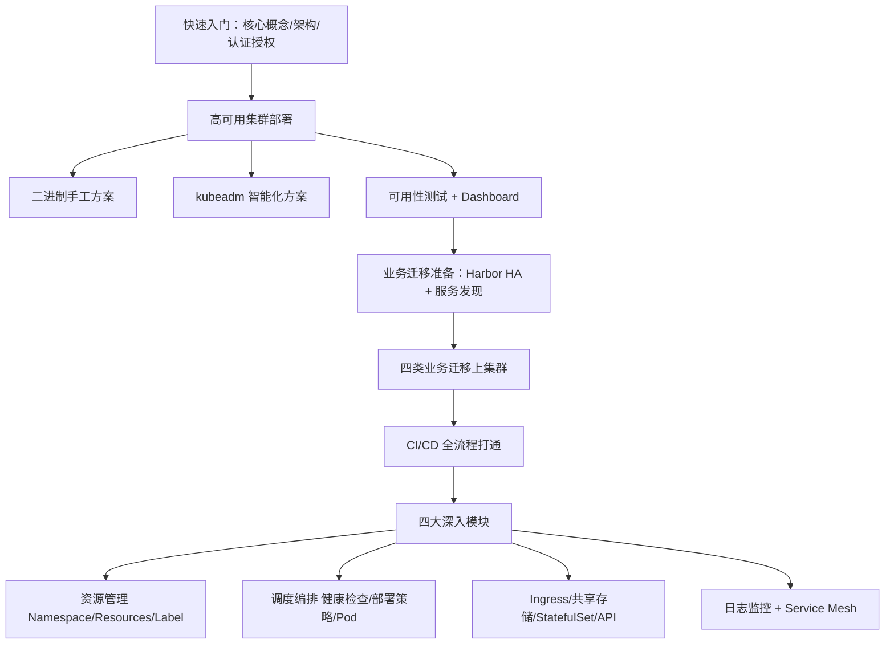

# Kubernetes 生产实践指南：从部署到核心应用

## 纲要

- 为什么是现在：云原生从 2017 年的苗头到 2019 年的成熟落地，K8s 已成容器编排事实标准
- 课程主线：先快速入门，再两种方式部署高可用集群，之后做业务迁移与 CI/CD，最后四大模块深入
- 两种高可用集群部署方案：手工二进制方案 + 智能化 kubeadm 方案（均基于当时最新的 K8s 版本）
- 集群就绪后：Harbor 高可用镜像仓库、服务发现（Ingress-Nginx），再把四类业务迁上集群
- 把 CI/CD 跑通：GitLab 拉代码 → Maven 构建 → 打镜像 → 推 Harbor → Shell 对接 kubectl 发布
- 四大深入模块：资源管理 / 调度编排 / Ingress 与存储 / 日志监控与 Service Mesh
- 环境参数与前置技能：K8s、Docker、Harbor、Prometheus、Istio 的版本与所需基础

## 为什么是现在：云原生已经成熟落地

从 2017 年底 Kubernetes 成为容器编排领域的事实标准之后，围绕它的生态持续爆发。如果说 2017 年云原生还只是冒出苗头，到 2019 年它已经变成一个被普遍接受的成熟理念。

CNCF 在 2018 年 8 月做了一份测量容器管理市场温度的调研报告，几个数字很能说明问题：

- 83% 的受访企业更喜欢基于 Kubernetes 的容器管理工具
- 58% 的受访者已经在生产中使用 Kubernetes
- 42% 的受访者表示正在评估，准备将来使用
- 员工规模达到 5000 人的企业中，有 40% 正在使用 Kubernetes；在开发人员中它已经非常流行

从面试也能感受到这股趋势：最近一年多参与面试，无论后端开发、架构还是系统运维，对 Docker 和 Kubernetes 的熟悉度都越来越高。Kubernetes 本身的迭代也越来越多地聚焦在稳定性、可扩展性和安全性上，核心 API 反而越来越稳；与此同时周边生态的二次创新高速发展，让它能服务于 DevOps、微服务、机器学习（如 Kubeflow）、甚至生物信息、气候模拟、航空动力等并行海量计算领域。结论是：2019 年依然是学习 Kubernetes 的最好时机。

## 课程主线：一条从部署到核心应用的完整链路

这门课叫《Kubernetes 生产实践指南：从部署到核心应用》，内容不是零散知识点，而是一条可落地的主线：



下面是一个更直观的目录树，对应上面这条链路在课程里的组织方式：

```dir
k8s-prod-course
├── 01 快速入门
│   ├── 核心概念（Pod/Deployment/Service）
│   ├── 架构设计（Master/Worker/组件工作流）
│   └── 认证授权（TLS/三种认证/RBAC/准入控制）
├── 02 高可用集群
│   ├── 二进制手工部署（5 节点示例）
│   ├── kubeadm 部署（5 节点示例）
│   └── 可用性测试 + Dashboard
├── 03 业务迁移准备
│   ├── Harbor 高可用镜像仓库
│   ├── 服务发现 Ingress-Nginx
│   └── 四类业务迁移（非 Docker/Docker/SpringBoot/Dubbo）
├── 04 CI/CD 落地
│   ├── GitLab 拉代码 + Maven 构建
│   ├── docker build 推 Harbor
│   └── Shell 脚本 + kubectl 发布 + Pipeline
└── 05 四大深入模块
    ├── 资源管理（Namespace/ResourceQuota/LimitRange/QoS）
    ├── 调度编排（探针/调度策略/部署方案/深入 Pod）
    ├── Ingress/存储/StatefulSet/API
    └── 日志监控 + Service Mesh（Prometheus/Istio）
```

## 两种高可用集群部署方案

因为不同同学有不同的需求，课程用两种方式各做了一遍高可用部署：

- **二进制手工方案**：每个组件拆开逐个部署，理解最透彻，适合想搞清楚每一环的人
- **kubeadm 智能化方案**：一条命令拉起，适合追求效率、快速拿到可用集群的人

两种方案都基于当时最新的 Kubernetes 版本，后续也会持续跟进升级。集群统一采用 **5 个节点**的示例：3 台 master + 2 台 worker；网络插件选用主流的 Calico，DNS 插件用官方推荐的 CoreDNS。集群部署完之后，会分别做可用性测试，并部署 Dashboard 看板。

## 业务迁移与 CI/CD

从一个要迁移 Kubernetes 的企业的视角看，集群搭好只是第一步，接下来才是把业务迁进来。迁移前要先做两件准备：

1. 讲 Harbor 的架构与原理，部署**高可用 Harbor 仓库**
2. 详细分析 Kubernetes 的各种服务发现策略，部署常用的 **Ingress-Nginx** 服务发现方案

准备就绪后，课程选了四种常见业务类型实操迁移：非 Docker 业务如何容器化、Docker 化业务如何跑在集群中、各类业务在集群里怎么做服务发现，最后把四类业务全部迁上集群。

迁移完并不是结束——没有 CI/CD 系统没法顺畅运转。课程接着实现了：从 GitLab 管理代码、Maven 构建、到 `docker build` 镜像、推送到 Harbor，再通过 Shell 脚本跟 Kubernetes 对接完成发布与健康检查，最后用 Pipeline 把整条链路整合起来。

## 四大深入模块：生产级必备知识点

要让服务在生产的 Kubernetes 集群上稳定可靠地运行，光会部署不够，课程分四大部分深入讲解：

| 模块 | 核心知识点 | 生产价值 |
| --- | --- | --- |
| 资源管理 | Namespace 隔离、ResourceQuota、LimitRange、Pod QoS 与驱逐机制、Label 用法 | 合理规划命名空间、用配额提升稳定性、灵活打标签 |
| 调度编排 | 健康检查探针与参数、调度器预选/优选策略、重建/滚动/蓝绿/金丝雀部署、深入 Pod 生命周期 | 把控调度与发布节奏，理解 Pod 设计思想 |
| Ingress 与存储 | Ingress-Nginx 的 AB 测试/蓝绿/小流量、GlusterFS 共享存储、PV/PVC/StorageClass、StatefulSet、K8s API | 对外暴露、有状态应用与动态供给、对接 API Server |
| 日志监控与 Mesh | 三种日志方案对比、Prometheus 架构与指标、Helm 部署监控告警、Istio 架构与落地 | 可观测性 + 服务网格流量治理 |

其中日志部分先了解 Docker 的日志特点、对比主流方案优缺点，再选一种做从采集到展示的完整实践；监控用主流的 Prometheus，最后用 Helm 方式实践基于 Prometheus 的监控告警体系。最后一部分是近年火热的 Service Mesh（以 Istio 为代表），从架构设计讲到部署完整 Istio 环境，并用 Jaeger/Zipkin、Kiali、Grafana 等工具把网格数据展现出来。

## 环境参数与前置技能

课程统一使用的环境参数如下（具体小版本以官方文档为准）：

| 组件 | 版本 | 说明 |
| --- | --- | --- |
| Kubernetes | 1.14.0 | 课程主线版本 |
| Docker | 17.03 | 官方做过全面兼容性测试 |
| Harbor | 1.6.0 | 高可用镜像仓库 |
| Prometheus | 2.8.1 | 监控方案 |
| Istio | 1.1.2 | 服务网格 |
| Java | 1.8 | 迁移示例多为 Java 项目 |

学习本课程需要的基础：熟悉 Linux 系统与常见命令（Linux 与 Shell 几乎贯穿所有章节）、了解基本 Docker 命令、最好对 Java Web 有概念（两类项目用到 SpringBoot 与 Dubbo，不熟悉可参考对应章节资料）。

这门课程适合三类人：对 Kubernetes 兴趣浓厚但基础薄弱者；已了解一点、希望系统化深入者；以及开发工程师、架构师或 DevOps 工程师。

## 总结

- 云原生在 2019 年已成熟落地，CNCF 调研显示超过半数企业已在生产使用 Kubernetes，现在仍是学习它的最好时机。
- 课程主线是一条可落地的完整链路：入门 → 两种高可用集群部署 → 业务迁移准备与迁移 → CI/CD → 四大深入模块。
- 两种部署方案（二进制手工 / kubeadm）互补：一个讲透原理，一个追求效率，都基于 5 节点（3 master + 2 worker）+ Calico + CoreDNS。
- 业务上云前要先备好 Harbor 高可用仓库与 Ingress-Nginx 服务发现，再用 CI/CD 把「代码→镜像→发布→健康检查」串成自动化流水线。
- 生产级稳定靠四大深入模块支撑：资源管理、调度编排、Ingress/存储/StatefulSet/API、日志监控与 Service Mesh。
- 环境以 Kubernetes 1.14.0、Docker 17.03、Harbor 1.6.0、Prometheus 2.8.1、Istio 1.1.2 为准，前置技能重点是 Linux、Docker 与 Java Web 基础。
