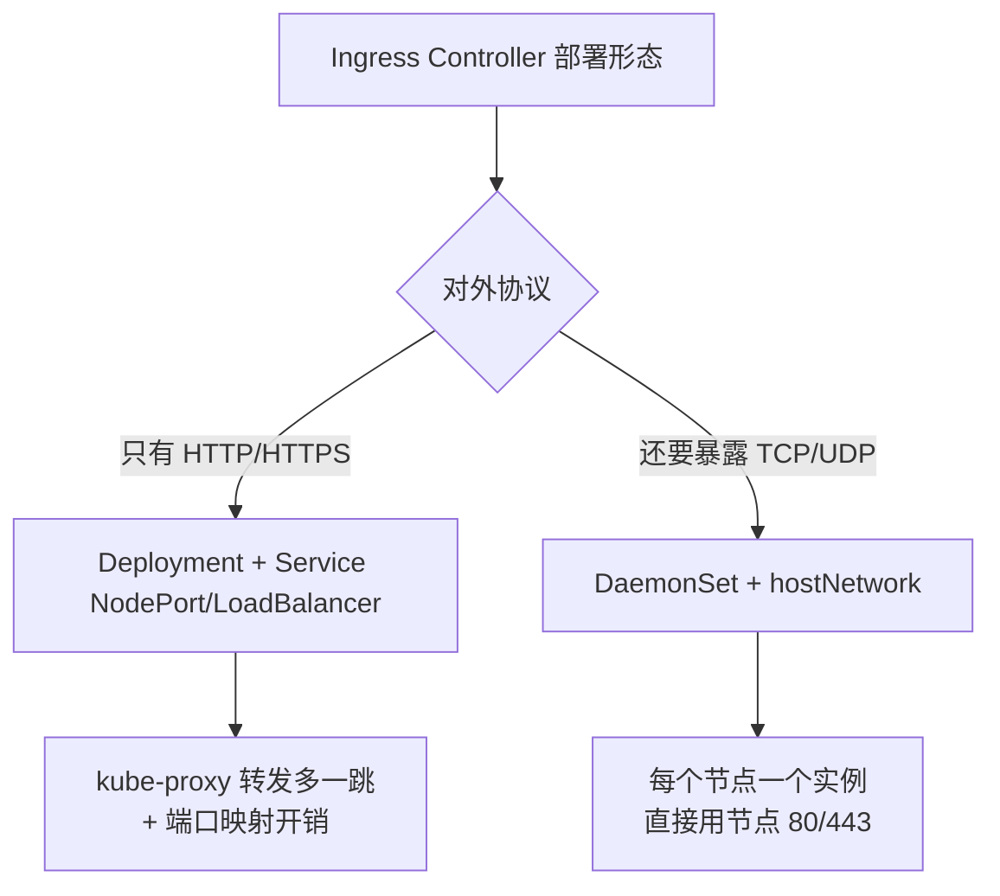
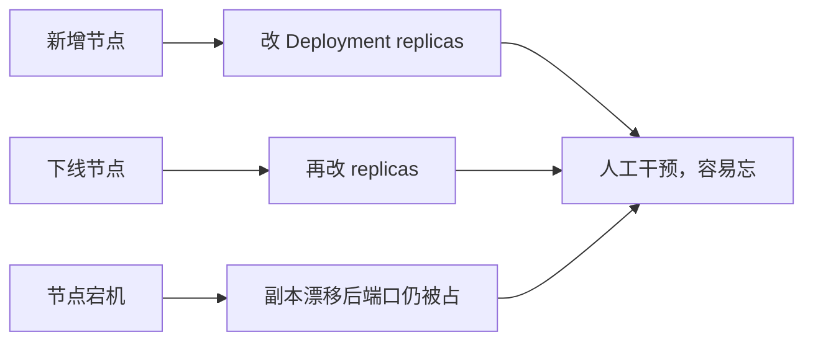
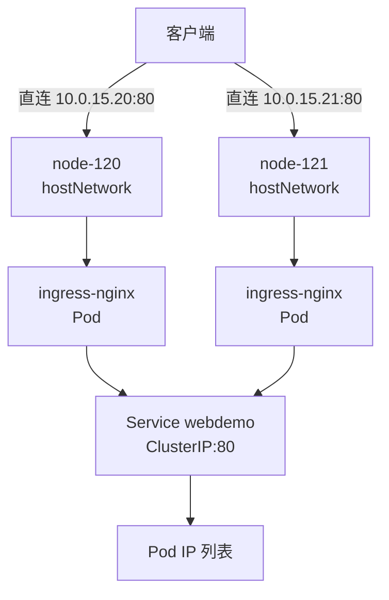
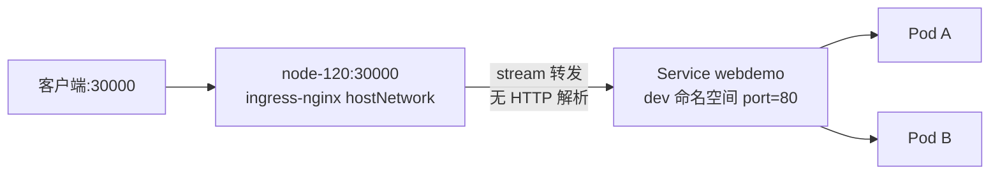
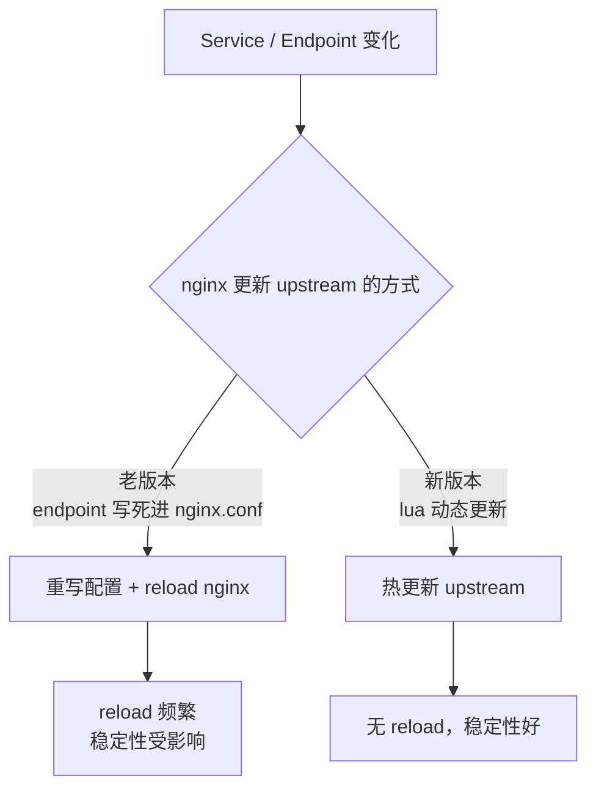
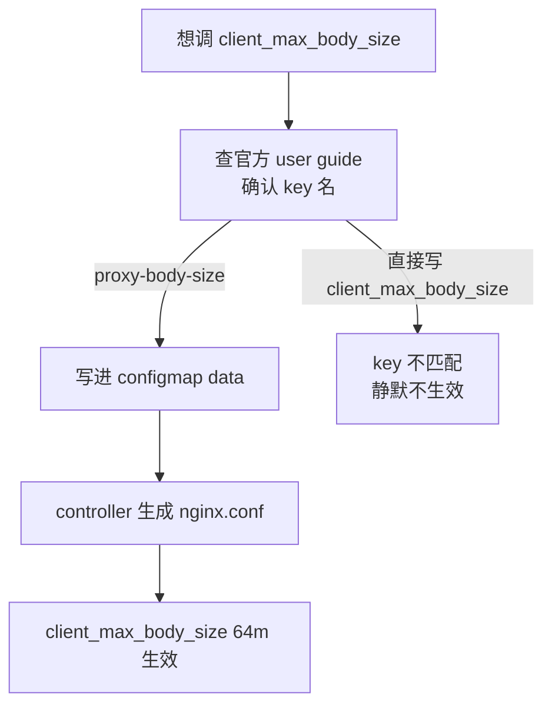

# Kubernetes 生产实践: ingress-nginx 的 DaemonSet 部署与四层 TCP 代理

生产里把 ingress-nginx 真正用起来，基础用法是不够的。这一节要解决的四个问题是：**controller 该用 Deployment 还是 DaemonSet 跑**、**对外提供的是 TCP 服务而不是 HTTP 该怎么服务发现**、**nginx 的一些定制参数（超时、buffer、header）怎么改**、**自定义配置又怎么注入回 nginx**。

结论先给：**ingress-nginx controller 在生产上应该用 DaemonSet + `hostNetwork: true` + `nodeSelector` 的方式跑，四层服务走 `tcp-services` ConfigMap 做流式转发，nginx 定制项走 `ingress-nginx-controller` 自己的 ConfigMap，而不是硬改 nginx 的 nginx.conf。**

## 纲要

- 部署形态：Deployment 的 replicas 痛点
- 改造成 DaemonSet：只动的字段
- `hostNetwork` + `nodeSelector` 的组合意图
-  port 冲突：80/443 被占用的处理
- 水平扩展：给节点打标签即可
- 四层代理：`tcp-services` ConfigMap 做 TCP/UDP 转发
- nginx 配置从哪来：自动生成的 nginx.conf
- 自定义 nginx 全局参数：ConfigMap 的 key 命名规则
- 自定义响应头：snippet 注入方式

## 正文

在正式环境里部署 Ingress Controller，第一个要拍板的不是"装哪个镜像"，而是**它跑在什么样的负载上**。



前面已经用 Deployment 把 ingress-nginx 装起来了、几个 web 服务也验证过基本转发，但一上生产就会撞上几件事：

- **节点变更不灵活**：扩节点要不要手动 `kubectl scale` 调 replicas？
- **要暴露 TCP 服务**（比如 MySQL、Redis、RPC），Ingress 只管 HTTP(S)，四层怎么办？
- **nginx 的某个参数要调**（超时、大请求体 buffer），改哪里？
- **要上 HTTPS 证书**，以及 **session 保持**要不要支持。

这一节把前两件先拆开讲。

## 部署形态：Deployment 的 replicas 痛点

之前用的 deployment 定义，核心字段长这样：

```yaml
apiVersion: apps/v1
kind: Deployment
metadata:
  name: ingress-nginx-controller
  namespace: ingress-nginx
spec:
  replicas: 1
  selector:
    matchLabels:
      app.kubernetes.io/name: ingress-nginx
  template:
    metadata:
      labels:
        app.kubernetes.io/name: ingress-nginx
    spec:
      hostNetwork: true
      nodeSelector:
        kubernetes.io/os: linux
      containers:
        - name: controller
          image: registry.k8s.io/ingress-nginx/controller:v1.9.5
```

看出来两个特征：

- **类型是 `Deployment`**，下面有 `nodeSelector`，约束只跑在带 `app=ingress` 标签的节点上；
- **网络模式是 `hostNetwork: true`**，也就是**每节点只能跑一个实例**（80 端口只能被一个进程占）。

对这种"每个节点都应该有一个、且只能有一个"的形态，用 Deployment 天然别扭：



**DaemonSet 的直接好处：不用管 replicas 了。** 打一个标签，它自己就跑起来；摘掉标签，它自己就退出来。

## 改造成 DaemonSet：只动的字段

把刚刚那个模板文件改一下，落到磁盘上就是一份 DaemonSet 清单：

```yaml
apiVersion: apps/v1
kind: DaemonSet
metadata:
  name: ingress-nginx-controller
  namespace: ingress-nginx
spec:
  selector:
    matchLabels:
      app.kubernetes.io/name: ingress-nginx
  updateStrategy:
    type: RollingUpdate
    rollingUpdate:
      maxUnavailable: 1
  template:
    metadata:
      labels:
        app.kubernetes.io/name: ingress-nginx
    spec:
      hostNetwork: true
      nodeSelector:
        kubernetes.io/os: linux
      containers:
        - name: controller
          image: registry.k8s.io/ingress-nginx/controller:v1.9.5
```

改的地方很少，逐项对照：

| Deployment | DaemonSet | 说明 |
| --- | --- | --- |
| `kind: Deployment` | `kind: DaemonSet` | **最核心的一处改动** |
| `replicas: 1` | **（无此字段）** | DaemonSet 按节点数自动铺，不需要副本数 |
| `strategy` | **`updateStrategy`** | 名字前面多一个 `update`，语义一致，也支持 `RollingUpdate` |
| `strategy.rollingUpdate.maxSurge` | **`rollingUpdate.maxUnavailable`** | DaemonSet 里"每次停一个、更新一个"，`maxSurge` 对单实例无意义 |
| `revisionHistoryLimit` | **（可删）** | DaemonSet 不需要 |
| `status` | **（删掉）** | 状态由控制器写回，手写无意义 |

有一处**必须删**：`progressDeadlineSeconds`。它是 Deployment 在部署新 ReplicaSet 时**卡住超过这个时间就打一条错误事件**用的参数，**DaemonSet 不支持**，留着 Apply 会直接报错。

```text
ingress-nginx-controller.yaml
├── kind: DaemonSet
├── updateStrategy
│   ├── type: RollingUpdate
│   └── rollingUpdate
│       └── maxUnavailable: 1
├── template
│   ├── metadata.labels
│   └── spec
│       ├── hostNetwork: true
│       ├── nodeSelector
│       └── containers
│           └── controller
│               └── image
└── （无 replicas / 无 strategy / 无 progressDeadlineSeconds / 无 status）
```

## `hostNetwork` + `nodeSelector` 的组合意图

这两项要一起看：

- **`hostNetwork: true`** —— Pod 直接用**节点的网络命名空间**，监听在节点的 80/443 上。**好处：不用再过一层 kube-proxy，客户端直连节点 IP，性能最好；坏处：80/443 这个节点上只能有一个进程占。**
- **`nodeSelector`** —— 只调度到打了 `app=ingress` 标签的节点。因为用了 hostNetwork，**必须**限制节点，否则多实例会抢同一个端口。



## 扩展与回收：只打标签

删掉旧的 Deployment 再起 DaemonSet：

```bash
kubectl delete deployment ingress-nginx-controller -n ingress-nginx
kubectl apply -f ingress-nginx-controller.yaml
kubectl get pod -n ingress-nginx -o wide
```

看到 controller 跑在 `node-120` 上，和之前同一个位置。浏览器里 `web.demo.com` 还是正常返回 404 / `hello name = michael`，说明是好的。

现在想**再扩一个节点**：

```bash
kubectl label node node-121 app=ingress
kubectl get pod -n ingress-nginx -o wide
```

很快 `node-121` 上就自动出现一个 ingress-nginx controller，状态是 `ContainerCreating` → `Running`。

**但有可能会卡在 `CrashLoopBackOff`**：如果 `node-121` 之前跑过 Harbor，**Harbor 已经占用了 80 端口**，nginx 起不来。这恰好是 hostNetwork 的代价 —— **端口冲突从"Pod 内"上移到了"节点级"**，规划阶段就得把网关节点的 80/443 预留干净。

去掉标签验证回收：

```bash
kubectl label node node-121 app-
kubectl get pod -n ingress-nginx -o wide
```

Pod 自动停掉，回到"只有 node-120 上一个实例"。**用 DaemonSet 控制这种运行形态，确实比管 replicas 顺畅得多。**

## 四层代理：`tcp-services` ConfigMap

Ingress 只描述 HTTP/HTTPS 的转发规则。要暴露的是**四层 TCP 服务**（MySQL、Redis、gRPC、自定义 RPC），得走 ingress-nginx 自带的 **`tcp-services`** ConfigMap。

ingress-nginx 安装完自带一个空的 ConfigMap：

```bash
kubectl get cm -n ingress-nginx
# NAME                                   DATA   AGE
# ingress-nginx-controller               ...
# ingress-nginx-controller-tcp-services   0     3d
```

在 `ingress-nginx` 命名空间下，ConfigMap 名叫 **`tcp-services`**，对外暴露的 TCP 端口就配在这里。

```yaml
apiVersion: v1
kind: ConfigMap
metadata:
  name: tcp-services
  namespace: ingress-nginx
data:
  "30000": "dev/webdemo:80"
```

data 的写法是固定的三段式：

```text
"<对外暴露端口>": "<命名空间>/<Service名>:<Service端口>"
```

- 左边双引号里的 `30000`：nginx 对外监听的** TCP 端口**（三万端口）；
- 右边 `dev/webdemo:80`：**目标 Service**，注意是 **Service 的名字和它的 `port`**，不是 Deployment 名、也不是容器端口。



创建之后，到 controller 所在的 `node-120` 上看监听：

```bash
ss -lnt | grep 30000
# LISTEN 0 128 10.0.15.20:30000  0.0.0.0:*
```

于是多了一条访问路径：

```bash
curl http://10.0.15.20:30000
# 正常返回 web 服务响应
```

**注意**：这里监听在节点端口上，浏览器/CLI 直接连节点 IP:30000 就能通，不用再过 NodePort。它测试起来最方便，但**生产上不建议把这类管理类服务从 30000 端口直接暴露出去**，四层端口集中收口、配好防火墙策略再放。

最后确认一下被代理对象的身份：

```bash
kubectl get svc -n dev webdemo
# NAME      TYPE        CLUSTER-IP     PORT
# webdemo   ClusterIP   10.96.42.108   80/TCP
```

**`tcp-services` 里写的 `webdemo` 是 Service 名，`port: 80` 也是 Service 的 port，不是Pod的容器端口。** 这一点和 Ingress 的后端语义一致。

| 项 | 值 | 含义 |
| --- | --- | --- |
| 对外监听 | `node-120:30000` | hostNetwork 直接占节点端口 |
| 转发协议 | TCP（stream） | **不解析 HTTP，不感知 Host** |
| 后端 | `Service webdemo` | `dev` 命名空间 |
| 后端端口 | Service 的 `port: 80` | **不是 targetPort / 容器端口** |
| 配置位置 | ConfigMap `tcp-services`（`ingress-nginx` 命名空间） | 后加即生效，controller 自动 reload |

## nginx 配置从哪来：自动生成的 nginx.conf

SSH 到 `node-120`，进容器看进程和配置文件：

```bash
# 下面命令中的变量按你的集群环境赋值后再执行
kubectl exec -n ingress-nginx -it $POD -- ps aux | grep nginx
kubectl exec -n ingress-nginx -it $POD -- nginx -T | head -50
```

nginx 用的配置文件是 **`/etc/nginx/nginx.conf`**，和普通 nginx 没有本质区别：

- 加载了一堆 `include`；
- 下面是各种指令（`log_format`、`events`、`http`）；
- `http` 里默认 80 server；
- 再往下就是具体业务的 server，比如 `web.demo.com` 那段，里面参数很多 —— **这些是 ingress-nginx 生成的默认参数，因为我们什么都没配，所以都是默认值**。

关键在 include 进去的 upstream 是怎么来的。老版本里 nginx.conf 里能看到具体的 endpoint，**把 Pod IP 直接写进配置文件**：

```text
upstream upstream_b3f2c1a1 {
    server 172.17.3.12:80;
    server 172.17.3.15:80;
}
```

**问题就在这里：endpoint 一变（Pod 重建、扩缩容），配置就要重写， nginx 就得 reload。** 频繁滚动发布的情况下，reload 非常频繁，会明显影响系统稳定性。

新版本引入了 **lua 模块，可以动态更新 upstream，不需要 reload nginx**。这就是为什么**不要去手改容器里的 nginx.conf** —— 它每次都会被 controller 覆盖生成。



## 自定义 nginx 全局参数：ConfigMap 的 key 命名规则

定制项走一个专门的 ConfigMap（通常就叫 `ingress-nginx-controller`）：

```yaml
apiVersion: v1
kind: ConfigMap
metadata:
  name: ingress-nginx-controller
  namespace: ingress-nginx
  labels:
    app.kubernetes.io/name: ingress-nginx
data:
  proxy-body-size: "64m"
  proxy-read-timeout: "180"
  proxy-connect-timeout: "10"
```

- 前面 `apiVersion/kind/metadata` 都是固定样板；
- `name`、`namespace`、label **都是固定的**；
- 真正能改的是 `data` 下面：**前面是参数名，后面是参数值**。

这些 key 支持什么，**必须去官网查**，不能照抄 nginx 的指令名。官网文档入口是 GitHub 仓库的 **Documentation → user guide**，里面详细列出了每一项配置。

配置里设了 `proxy-body-size` 64 兆、`proxy-read-timeout` 180 秒，apply 之后到容器里搜一下：

```bash
# 下面命令中的变量按你的集群环境赋值后再执行
kubectl exec -n ingress-nginx -it $POD -- grep -n "client_max_body_size" /etc/nginx/nginx.conf
kubectl exec -n ingress-nginx -it $POD -- grep -n "proxy_read_timeout\|proxy_connect_timeout" /etc/nginx/nginx.conf
```

能看到 `client_max_body_size 64m`、`proxy_read_timeout 180s`、`proxy_connect_timeout 10s` 都生效了。

**这里有个大坑：ConfigMap 里的 key 用了下划线，nginx 指令本身是中划线。**

| nginx 指令（生成出来的配置） | ConfigMap 里的 key（必须照抄） |
| --- | --- |
| `client_max_body_size`（`proxy-body-size`） | **`proxy-body-size`** |
| `proxy_read_timeout` | **`proxy-read-timeout`** |
| `proxy_connect_timeout` | **`proxy-connect-timeout`** |

**所以 key 要去文档上查阅，直接把 nginx 的指令名写进去是不生效的**（不报错，静默忽略）。这一条几乎每个刚上 ingress-nginx 的人都会踩。



## 自定义响应头：snippet 注入

想给**全部**响应加 header，需要配合一个 snippet ConfigMap。

先在 `ingress-nginx-controller` 里加一条 `proxy-set-headers`：

```yaml
apiVersion: v1
kind: ConfigMap
metadata:
  name: ingress-nginx-controller
  namespace: ingress-nginx
data:
  proxy-body-size: "64m"
  proxy-read-timeout: "180"
  # 引入自定义 header 片段
  proxy-set-headers: "ingress-nginx/custom-headers"
```

再单独建一个 `custom-headers` ConfigMap，下面的 key 就是具体 header：

```yaml
apiVersion: v1
kind: ConfigMap
metadata:
  name: custom-headers
  namespace: ingress-nginx
data:
  X-Frame-Options: "SAMEORIGIN"
  X-XSS-Protection: "1; mode=block"
  X-Content-Type-Options: "nosniff"
  X-Download-Options: "noopen"
  X-Permitted-Cross-Domain-Policies: "none"
  Strict-Transport-Security: "max-age=31536000"
```

Controller 启动参数带上这个 ConfigMap：

```yaml
spec:
  containers:
    - name: controller
      args:
        - /nginx-ingress-controller
        - --configmap=$(POD_NAMESPACE)/ingress-nginx-controller
        - --tcp-services-configmap=$(POD_NAMESPACE)/tcp-services
        - --udp-services-configmap=$(POD_NAMESPACE)/udp-services
        - --proxy-set-headers=$(POD_NAMESPACE)/custom-headers
```

注意 `--tcp-services-configmap` 这个参数名，少一个 `-` 就会忽略四层配置。

## API 速览

| 能力 | API / 配置 |
| --- | --- |
| 网关固定每节点一个实例 | `kind: DaemonSet` |
| 直接占节点 80/443 端口 | `spec.template.spec.hostNetwork: true` |
| 限定只在指定节点跑 | `spec.template.spec.nodeSelector: {app: ingress}` |
| 滚动更新 | `spec.updateStrategy.rollingUpdate.maxUnavailable: 1` |
| 四层 TCP 转发 | ConfigMap `tcp-services`，`data: {"30000": "dev/webdemo:80"}` |
| 四层 UDP 转发 | ConfigMap `udp-services`（同上结构） |
| nginx 全局定制参数 | ConfigMap `ingress-nginx-controller` 的 `data` |
| 大请求体上限 | `proxy-body-size: "64m"`（对应 `client_max_body_size`） |
| 读超时 | `proxy-read-timeout: "180"` |
| 连接超时 | `proxy-connect-timeout: "10"` |
| 注入自定义响应头 | `--proxy-set-headers=<ns>/<cm>` + ConfigMap snippet |
| 查看生成配置 | `nginx -T` |
| 查看监听端口 | `ss -lnt \| grep 30000` |

## Demo 示例

从零跑通：删 Deployment → 起 DaemonSet → 打标签扩点 → 配四层 TCP → 改全局参数。

```bash
# 1. 先删掉旧的 Deployment，避免 80 端口被占
kubectl delete deployment ingress-nginx-controller -n ingress-nginx

# 2. 起 DaemonSet
kubectl apply -f ingress-nginx-daemonset.yaml
kubectl get pod -n ingress-nginx -o wide
# NAME                                    READY   NODE
# ingress-nginx-controller-abcdef         1/1     node-120

# 3. 打标签扩节点（去掉标签即自动回收）
kubectl label node node-121 app=ingress
kubectl label node node-121 app-

# 4. 配四层 TCP 代理
kubectl apply -f tcp-services.yaml
# 下面命令中的变量按你的集群环境赋值后再执行
kubectl exec -n ingress-nginx -it $POD -- ss -lnt | grep 30000

# 5. 自定义全局参数
kubectl apply -f ingress-nginx-configmap.yaml
kubectl exec -n ingress-nginx -it $POD -- nginx -T | grep client_max_body_size
kubectl exec -n ingress-nginx -it $POD -- nginx -T | grep proxy_read_timeout
```

`tcp-services.yaml`：

```yaml
apiVersion: v1
kind: ConfigMap
metadata:
  name: tcp-services
  namespace: ingress-nginx
data:
  "30000": "dev/webdemo:80"
```

`ingress-nginx-configmap.yaml`：

```yaml
apiVersion: v1
kind: ConfigMap
metadata:
  name: ingress-nginx-controller
  namespace: ingress-nginx
data:
  proxy-body-size: "64m"
  proxy-read-timeout: "180"
  proxy-connect-timeout: "10"
  proxy-send-timeout: "180"
  use-forwarded-headers: "true"
  enable-underscores-in-headers: "true"
```

**排障三板斧：**

```bash
# 网关有没有起来
kubectl get pod -n ingress-nginx
kubectl logs -n ingress-nginx -l app.kubernetes.io/name=ingress-nginx

# 生成的 nginx 配置里到底有什么
# 下面命令中的变量按你的集群环境赋值后再执行
kubectl exec -n ingress-nginx -it $POD -- nginx -T > /tmp/nginx.conf.dump
grep -n "client_max_body_size\|proxy_read_timeout\|upstream" /tmp/nginx.conf.dump

# TCP 端口到底有没有 LISTEN（在节点上看，不是 Pod 里看）
ssh node-120 "ss -lnt | grep -E ':(80|443|30000)\b'"
```

### 总结

- **ingress-nginx controller 在生产上用 DaemonSet 跑**，因为它要的是"每节点恰好一个"，而不是"总共几个"；`hostNetwork: true` 让它直接占节点 80/443，少一跳 kube-proxy。
- **扩缩容只打节点标签（`kubectl label node <n> app=ingress`）**，摘标签自动回收，不用再碰 `replicas`；`progressDeadlineSeconds` 是 Deployment 专属字段，DaemonSet 里必须删。
- **四层 TCP/UDP 走 `tcp-services` / `udp-services` ConfigMap**，写法是 `"<对外端口>": "<ns>/<svc>:<svc的port>"`，**填 Service 名和它的 port，不是容器端口**。
- **nginx 定制参数放 ConfigMap `ingress-nginx-controller` 的 `data`**，key 是 **`proxy-body-size`、`proxy-read-timeout` 这种带下划线的短名，不是 nginx 的中划线指令名**；写错不报错，静默不生效。
- **生产规划必须给网关节点预留 80/443**，`hostNetwork` 会把端口冲突从 Pod 级上移到节点级，Harbor 之类的邻居进程撞端口会直接让 controller `CrashLoopBackOff`。

