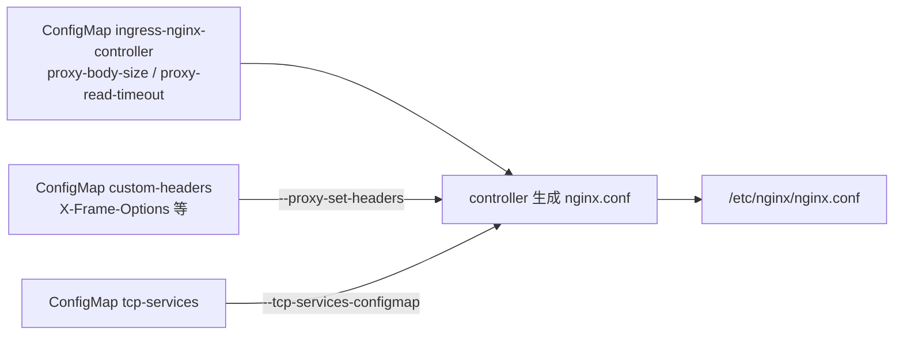
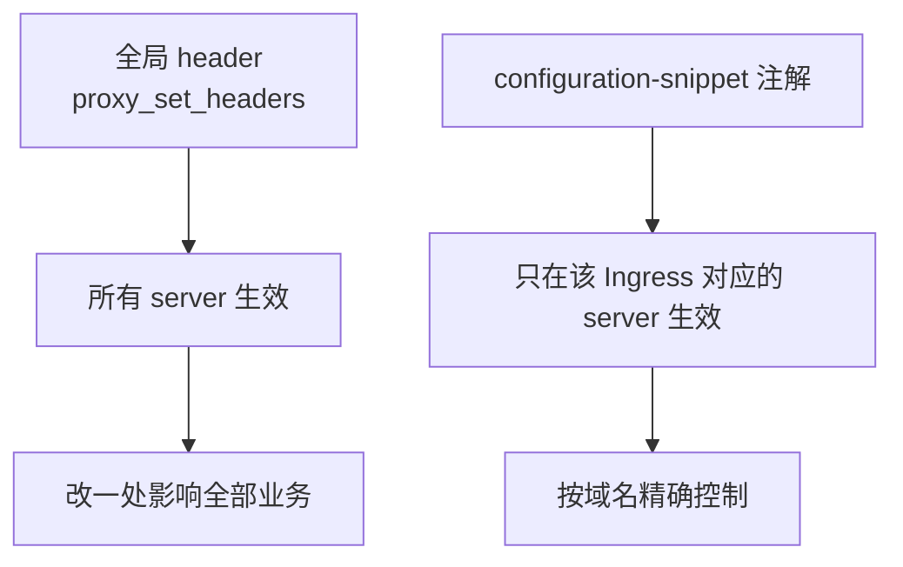
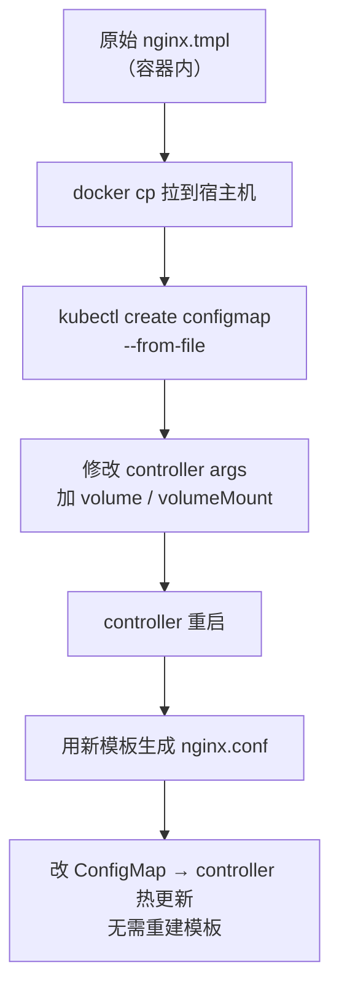
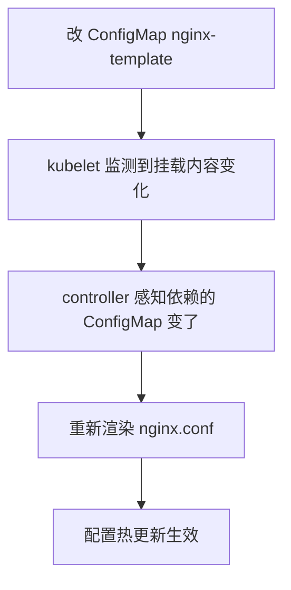
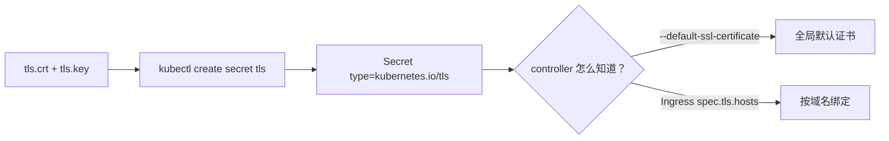
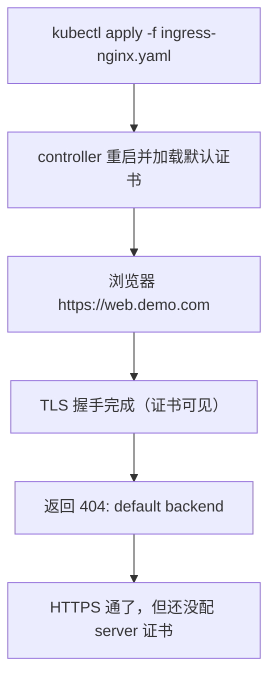
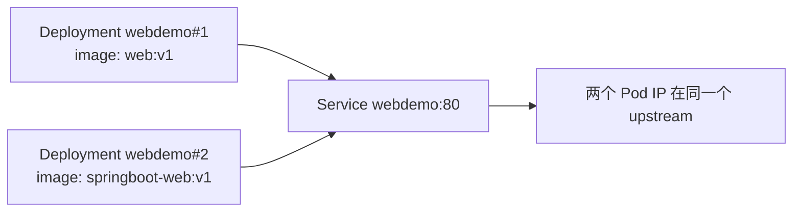

# Kubernetes 生产实践: ingress-nginx 自定义响应头、配置模板与 TLS 证书配置

上一节把 **DaemonSet 部署**和**四层 TCP 代理**打通了。这一节接着往下补三件事：**单个 Ingress 也能定制 header 怎么办**、**现有配置项满足不了时能不能改 nginx 模板**、**HTTPS 证书怎么配上去**。

结论先给：**全局 header 走 `--proxy-set-headers` 引入 snippet ConfigMap，单域名 header 走 Ingress 注解 `configuration-snippet`；实在改不动的配置用 `nginx.tmpl` 模板挂载，但优先级最低；HTTPS 是"证书进 Secret + controller 启动时挂 `--default-ssl-certificate` + Ingress 里写 `tls.hosts`"三步缺一不可。**

## 纲要

- 全局自定义响应头：`proxy-set-headers` 的回填验证
- 单 Ingress 定制 header：`configuration-snippet` 注解
- 兜底手段：自定义 nginx 配置模板
- 模板挂载：volume + volumeMount + ConfigMap
- 改模板验证：改一个变量热生效
- 证书准备：自签一个证书
- 证书落地：创建 TLS 类型 Secret
- 让 controller 用上证书：`--default-ssl-certificate`
- 域名的证书绑定：Ingress 的 `tls.hosts`
- 会话保持的环境准备

## 正文

先验证上一节配的全局 header 确实生效了：

```bash
# 下面命令中的变量按你的集群环境赋值后再执行
kubectl exec -n ingress-nginx -it $POD -- nginx -T | grep -A5 proxy_set_headers
```

能看到 `proxy_set_headers` 后面跟着我们配置的 key，包括 `proxy-set-headers` 自己引进来的 `request` 头。说明 controller 把 ConfigMap 的 `data` **整体搬进了 nginx 的 `http` 段**。



到这里全局定制已经成立。但业务里常常是**"我就要这一个域名加这个头"**，不该把所有域名都改了。

## 单 Ingress 定制 header：`configuration-snippet` 注解

看这条 Ingress，它就是个普通 Ingress，唯一区别是 **annotation 里加了 `configuration-snippet`**：

```yaml
apiVersion: networking.k8s.io/v1
kind: Ingress
metadata:
  name: web
  namespace: dev
  annotations:
    nginx.ingress.kubernetes.io/configuration-snippet: |
      more_set_headers "RequestId: $request_id";
spec:
  ingressClassName: nginx
  rules:
    - host: web.demo.com
      http:
        paths:
          - path: /
            pathType: Prefix
            backend:
              service:
                name: webdemo
                port:
                  number: 80
```

apply 之后到 nginx 配置里搜一下：

```bash
# 下面命令中的变量按你的集群环境赋值后再执行
kubectl exec -n ingress-nginx -it $POD -- nginx -T | grep -B3 -A3 "RequestId"
```

能搜到这一行，**而且它落在 `server web.demo.com` 这个 server 块里**，不是全局。



注意两点：

- **注解前缀是 `nginx.ingress.kubernetes.io/`**，这是 ingress-nginx 的官方注解前缀，写错前缀静默失效；
- **`configuration-snippet` 的内容会被原样塞进生成的 server 块**，所以可以用 `more_set_headers`（nginx 的 `headers-more` 模块指令），而不是普通的 `add_header` —— 因为 `add_header` 在有 `if` 块或 `proxy_pass` 的部分上下文里会被覆盖，`more_set_headers` 不受此限制。

## 兜底手段：自定义 nginx 配置模板

如果需求更特殊，官方配置项覆盖不到，还有最后**一招：改 nginx 的配置模板**。

nginx 配置不是手写的，而是 controller **拿一个模板文件程序化生成的**。模板在容器里的位置是：

```text
/etc/nginx/template/nginx.tmpl
```

官网的 **custom nginx template** 文档就是讲这个。思路是：把 `nginx.tmpl` 变成 ConfigMap 挂进容器，controller 用这份模板去生成 `nginx.conf`。



## 模板挂载：volume + volumeMount + ConfigMap

编辑 controller 的 DaemonSet，在 `args` 下面加挂载：

```yaml
spec:
  template:
    spec:
      containers:
        - name: controller
          image: registry.k8s.io/ingress-nginx/controller:v1.9.5
          args:
            - /nginx-ingress-controller
            - --configmap=$(POD_NAMESPACE)/ingress-nginx-controller
            - --tcp-services-configmap=$(POD_NAMESPACE)/tcp-services
            - --proxy-set-headers=$(POD_NAMESPACE)/custom-headers
            - --default-ssl-certificate=default/web-demo-tls
          volumeMounts:
            - name: nginx-template
              mountPath: /etc/nginx/template
      volumes:
        - name: nginx-template
          configMap:
            name: nginx-template
```

**apply 之前必须先建好这个 ConfigMap**，否则挂载不上、Pod 起不来。

先把容器里的模板拉出来：

```bash
# 下面命令中的变量按你的集群环境赋值后再执行
docker cp $CONTAINER_ID:/etc/nginx/template/nginx.tmpl ./nginx.tmpl
scp ./nginx.tmpl root@10.0.15.50:~/
```

拉到本地后，创建 ConfigMap —— **注意 key 要和文件名同名**，这样不用改名：

```bash
kubectl -n ingress-nginx create configmap nginx-template --from-file=nginx.tmpl
kubectl -n ingress-nginx get cm nginx-template
# NAME             DATA   AGE
# nginx-template   1      ...
```

> 实操里常会忘 `-n ingress-nginx`，建到了别的命名空间，controller 挂载时找不到 ConfigMap 就起不来。建完如果发现位置不对：`kubectl delete cm nginx-template` 再带 `-n` 重建。

```text
ingress-nginx 命名空间
├── cm ingress-nginx-controller   nginx 全局参数（proxy-* 系列）
├── cm custom-headers             自定义响应头
├── cm tcp-services               四层 TCP 转发
├── cm nginx-template             自定义 nginx.tmpl（模板）
└── ds  ingress-nginx-controller
    └── volumeMounts: /etc/nginx/template ← cm nginx-template
```

创好之后 apply 修改过的 DaemonSet。**改 controller 配置会触发 Pod 重启**，等它起来先看日志：

```bash
kubectl logs -n ingress-nginx -l app.kubernetes.io/name=ingress-nginx
```

没问题再进容器确认生成的配置：

```bash
# 下面命令中的变量按你的集群环境赋值后再执行
kubectl exec -n ingress-nginx -it $POD -- head -40 /etc/nginx/nginx.conf
```

## 改模板验证：改一个变量热生效

`kubectl -n ingress-nginx edit cm nginx-template`，打开模板一看，里面全是 **两个大括号 `{{ }}` 包起来的部分** —— 那是 Go template 的语法，**由 controller 程序在运行时填充**：变量、条件、循环都在这里。

大部分内容都可以自定义，要找"写死的地方"反而不好找。随便改一个看得见的，比如 worker 连接数上限：

```nginx
worker_rlimit_nofile {{ $cfg.MaxWorkerConnections }};
```

把它调大（比如 4096），保存。再进容器搜：

```bash
# 下面命令中的变量按你的集群环境赋值后再执行
kubectl exec -n ingress-nginx -it $POD -- grep -n "worker_rlimit_nofile\|4096" /etc/nginx/template/nginx.tmpl
kubectl exec -n ingress-nginx -it $POD -- grep -n "worker_rlimit_nofile" /etc/nginx/nginx.conf
```

**模板里立刻就变了，而且没有重启 Pod。**



**原理和之前讲 ConfigMap 时一样**：kubelet 会定期检查它挂载的 ConfigMap，内容一变就更新容器里的文件，controller 检测到自己依赖的配置变了就重新渲染。**模板机制的代价是优先级最低** —— 官方能配的参数尽量走 ConfigMap，模板是最后手段。

| 定制方式 | 作用范围 | 优先级 | 适合什么 |
| --- | --- | --- | --- |
| Ingress 注解 `nginx.ingress.kubernetes.io/*` | 单个 Ingress / server | 高 | 单域名的超时、重写、限流 |
| ConfigMap `ingress-nginx-controller` | 全局 | 中 | 所有业务的公共参数 |
| 配置模板 `nginx.tmpl` | 全局（改生成逻辑） | **最低** | 官方文档没有对应配置项的极端需求 |

## 证书准备：自签一个证书

要做 HTTPS，首先得有证书。测试用的是假域名，不可能有合法证书，所以先自签一个。

```bash
cat > gen-cert.sh <<'EOF'
#!/bin/bash
openssl req -x509 -nodes -days 3650 -newkey rsa:2048 \
  -subj "/CN=demo.com" \
  -addext "subjectAltName=DNS:demo.com,DNS:*.demo.com" \
  -keyout tls.key \
  -out tls.crt
EOF
bash gen-cert.sh
ls -l tls.key tls.crt
```

**如果公司有合法证书，这一步直接跳过，拿现成的 `.key` 和 `.crt` 就行。**

## 证书落地：创建 TLS 类型 Secret

```bash
kubectl -n default create secret tls web-demo-tls \
  --cert=tls.crt \
  --key=tls.key
```

看一下这个 Secret：

```bash
kubectl get secret web-demo-tls -o yaml
```

```yaml
apiVersion: v1
kind: Secret
metadata:
  name: web-demo-tls
  namespace: default
type: kubernetes.io/tls
data:
  tls.crt: <base64 编码的证书>
  tls.key: <base64 编码的私钥>
```

**为什么单独弄一个 `kubernetes.io/tls` 类型？** 因为这种场景用得特别广，Kubernetes 统一做了规范：**证书字段固定叫 `tls.crt`，私钥字段固定叫 `tls.key`**。这样 ingress-nginx 只要按约定读这两个 key 就行，不用关心业务怎么命名。

> 本质还是一段 base64 编码的 Secret，只是类型不同、字段约定不同。



## 让 controller 用上证书

先看 controller 的帮助信息，找有没有"指定证书"的入口：

```bash
# 下面命令中的变量按你的集群环境赋值后再执行
kubectl exec -n ingress-nginx -it $POD -- nginx-ingress-controller --help | grep -i ssl
# --default-ssl-certificate: 默认的 SSL 证书，类型 kubernetes.io/tls 的 Secret
```

找到了。回到 DaemonSet 的 `args`，在最下面加一行命令行参数：

```yaml
args:
  - /nginx-ingress-controller
  - --configmap=$(POD_NAMESPACE)/ingress-nginx-controller
  - --tcp-services-configmap=$(POD_NAMESPACE)/tcp-services
  - --proxy-set-headers=$(POD_NAMESPACE)/custom-headers
  - --default-ssl-certificate=default/web-demo-tls
```

`--default-ssl-certificate` 的值是 `命名空间/Secret名`。**更好的习惯是把证书放到跟 controller 同一个命名空间**（通常是 `ingress-nginx`），少一层跨命名空间引用。

apply 之后等容器起来，浏览器访问 `https://web.demo.com`：

- 提示"连接不安全" —— 因为是自签证书，正常；
- 信任继续后，返回 `default backend - 404`；
- **浏览器里点开证书，确实是我们刚创建的那个** —— 说明证书挂上去了。

返回 404 是**另一回事**，下面说。



## 域名的证书绑定：Ingress 的 `tls.hosts`

为什么会 404？因为**默认证书只是"握手时用"，并不等于这个域名就会有一条 HTTPS 的 server 段**。要在具体域名下显式声明用哪张证书。

看 `dev` 命名空间下的 `web-ingress` 配置（在 `tls` 段里）：

```yaml
apiVersion: networking.k8s.io/v1
kind: Ingress
metadata:
  name: web-ingress
  namespace: dev
spec:
  ingressClassName: nginx
  tls:
    - hosts:
        - web.demo.com
      secretName: web-demo-tls
  rules:
    - host: web.demo.com
      http:
        paths:
          - path: /
            pathType: Prefix
            backend:
              service:
                name: webdemo
                port:
                  number: 80
```

和之前的 Ingress 比，**多出来的就是 `spec.tls` 这一整块**：

- `tls.hosts`：这个域名用哪张证书（和 `rules[].host` 对应）；
- `tls.secretName`：证书 Secret 的名字。

**不写这一段，controller 根本不会生成 `web.demo.com` 对应的 HTTPS server 块**，请求落到 default backend 自然 404。

```bash
kubectl -n dev apply -f web-ingress-tls.yaml
```

再试：

```bash
curl -k https://web.demo.com
# 正常返回业务响应
```

**如果证书是合法签发的，浏览器就是一把绿色小锁。**

| 缺哪一步 | 现象 |
| --- | --- |
| 建了证书但没建 Secret | controller 拿不到 key，启动报证书不存在 |
| 建了 Secret 但 controller 没挂 `--default-ssl-certificate` | 握手失败 / 走 SPDY 转发 |
| 挂了默认证书但 Ingress 没写 `spec.tls` | **能握手，但返回 404 default backend** |
| Ingress 写了 `spec.tls` 但 Secret 名写错 | controller 日志报 secret not found |

## 会话保持的环境准备

最后一个要解决的问题是**访问控制**，其中第一个需求是**会话保持**：同一个会话最好一直落到同一个后端 Pod。

ingress-nginx 支持，但**做实验前得先能分辨出访问的是哪个后端**。当前的两个 Deployment 镜像是一样的（`web:v1`），看不出来区别。

把其中一个改一下，换成 springboot 版本镜像，这样响应内容不一样，就能区分访问落到哪个 Pod：

```bash
kubectl -n dev edit deployment webdemo
# image: web:v1  →  image: springboot-web:v1
```



有了可区分的后端，下一步才谈得上验证会话保持到底有没有把同一个请求一直送到同一个 Pod。

## API 速览

| 能力 | API / 配置 |
| --- | --- |
| 全局自定义响应头 | `--proxy-set-headers=<ns>/<cm>` + ConfigMap 里写 header 名 |
| 单 Ingress 加 header | 注解 `nginx.ingress.kubernetes.io/configuration-snippet: \|`<br/>`more_set_headers "...";` |
| 注解前缀 | `nginx.ingress.kubernetes.io/` |
| path 类型 | `pathType: Prefix` / `pathType: Exact` / `pathType: ImplementationSpecific` |
| 自定义 nginx 模板 | ConfigMap `nginx-template` 挂载到 `/etc/nginx/template` |
| 模板源文件 | 容器内 `/etc/nginx/template/nginx.tmpl` |
| 生成配置 | `/etc/nginx/nginx.conf` |
| 查看生成配置 | `nginx -T` |
| 生成证书 | `openssl req -x509 -nodes -newkey rsa:2048 -subj "/CN=..." -addext "subjectAltName=..."` |
| 创建证书 Secret | `kubectl create secret tls <name> --cert=tls.crt --key=tls.key` |
| Secret 类型 | `kubernetes.io/tls`，字段固定 `tls.crt` / `tls.key` |
| controller 默认证书 | `--default-ssl-certificate=<ns>/<secret>` |
| 域名绑定证书 | `spec.tls.hosts` + `spec.tls.secretName` |
| 查看 controller 参数 | `nginx-ingress-controller --help` |

## Demo 示例

一次性把本节所有配置串起来：

```bash
# 1. 单 Ingress 定制 header
kubectl -n dev apply -f web-ingress-snippet.yaml
# 下面命令中的变量按你的集群环境赋值后再执行
kubectl exec -n ingress-nginx -it $POD -- nginx -T | grep -A2 RequestId

# 2. 拉模板 → 建 ConfigMap
docker cp $CONTAINER_ID:/etc/nginx/template/nginx.tmpl ./nginx.tmpl
kubectl -n ingress-nginx delete cm nginx-template
kubectl -n ingress-nginx create cm nginx-template --from-file=nginx.tmpl

# 3. 给 controller 挂模板 + 默认证书
kubectl -n ingress-nginx edit daemonset ingress-nginx-controller
#   args 增加：
#     - --default-ssl-certificate=ingress-nginx/web-demo-tls
#   volumeMounts / volumes 增加 nginx-template

# 4. 自签证书 → 建 Secret
bash gen-cert.sh
kubectl -n ingress-nginx create secret tls web-demo-tls --cert=tls.crt --key=tls.key

# 5. Ingress 绑定域名证书
kubectl -n dev apply -f web-ingress-tls.yaml
curl -k https://web.demo.com

# 6. 准备会话保持环境（改镜像区分后端）
kubectl -n dev edit deployment webdemo
```

**核验脚本：**

```bash
#!/usr/bin/env bash
set -euo pipefail

POD=$(kubectl -n ingress-nginx get pod -l app.kubernetes.io/name=ingress-nginx -o name | head -1)

echo "== 1. 全局参数 =="
kubectl -n ingress-nginx exec "$POD" -- nginx -T | grep -E "client_max_body_size|proxy_read_timeout"

echo "== 2. 全局响应头 =="
kubectl -n ingress-nginx exec "$POD" -- nginx -T | grep -E "X-Frame-Options|Strict-Transport-Security"

echo "== 3. 单 server 的 snippet =="
kubectl -n ingress-nginx exec "$POD" -- nginx -T | grep -A2 "more_set_headers"

echo "== 4. 默认证书 =="
kubectl -n ingress-nginx exec "$POD" -- nginx -T | grep -i "ssl_certificate"

echo "== 5. TLS 握手 =="
curl -kI https://web.demo.com | head -1
```

### 总结

- **全局 header 用 `--proxy-set-headers=<ns>/<cm>`** 引入一个 snippet ConfigMap；**单个域名才用的 header 用 Ingress 注解 `nginx.ingress.kubernetes.io/configuration-snippet`**，内容塞进对应 server 块，不污染其他域名。
- **注解要写 `more_set_headers` 而不是 `add_header`** —— 后者在 `location` / `if` 上下文里容易被覆盖，前者由 headers-more 模块提供，行为稳定。
- **官方文档没有配置项时，用自定义 `nginx.tmpl` 模板**：先把容器里的模板 `--from-file` 做成 ConfigMap，再给 controller 加 `volumeMounts` + `volumes` 挂到 `/etc/nginx/template`。**apply 前 ConfigMap 必须先存在**，否则 Pod 起不来。
- **改模板 ConfigMap 会热生效**（kubelet 更新挂载内容 → controller 重新渲染 `nginx.conf`），不用重启 Pod；但模板是**优先级最低**的定制手段，能走 ConfigMap 就别碰模板。
- **HTTPS 三步缺一不可**：`openssl` 生成证书 → `kubectl create secret tls`（类型 `kubernetes.io/tls`，字段固定 `tls.crt`/`tls.key`）→ controller 加 `--default-ssl-certificate=<ns>/<secret>` 且 Ingress 里写 `spec.tls.hosts` + `spec.tls.secretName`。**少了 Ingress 的 `tls` 段，握手能过但一定返回 404 default backend。**

