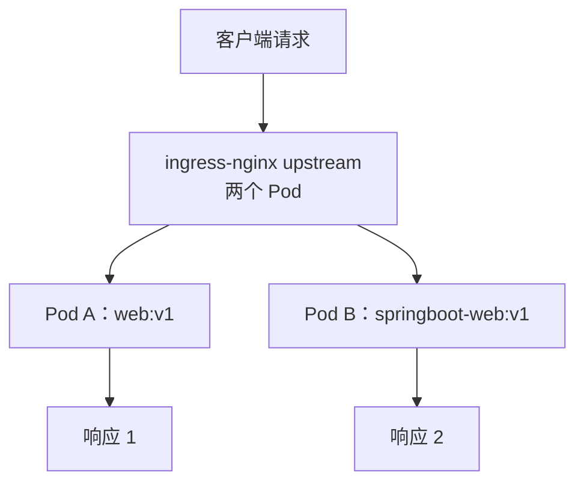
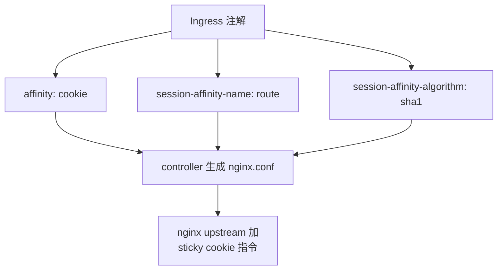
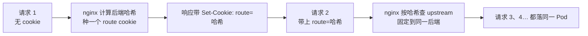
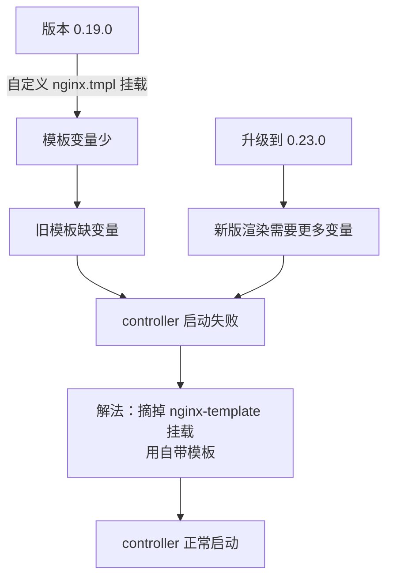
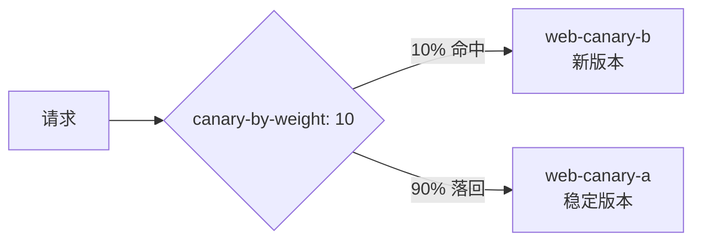
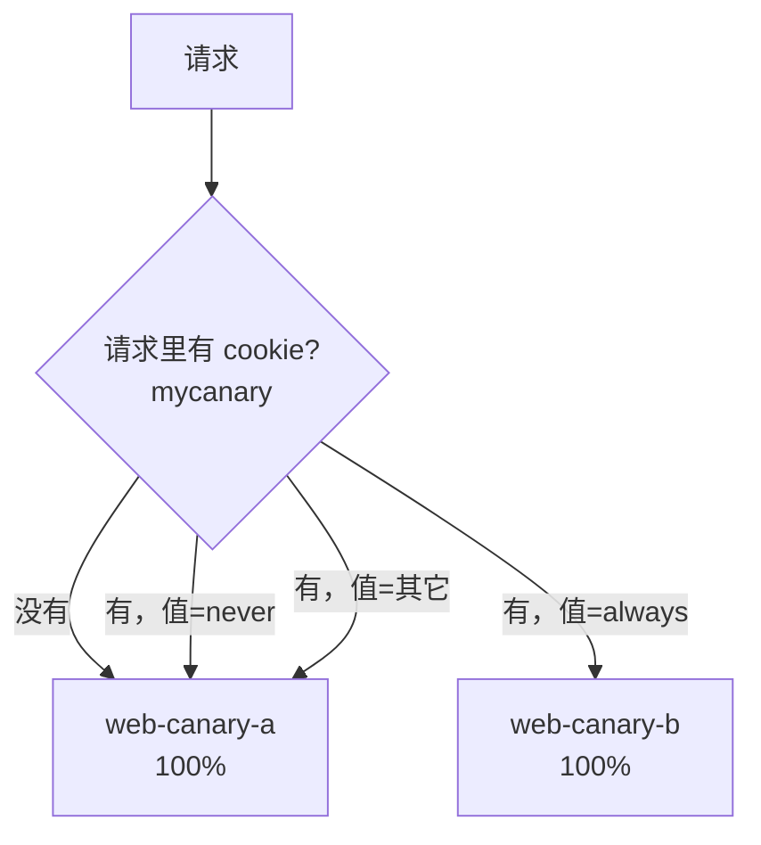
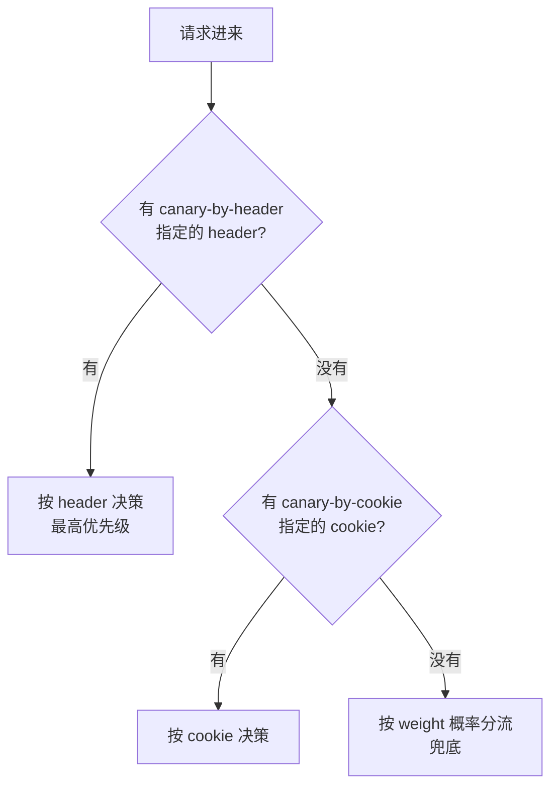

# Kubernetes 生产实践: ingress-nginx 的会话保持与金丝雀流量控制

前两节把 ingress-nginx 的部署形态、四层代理、定制配置、HTTPS 都铺完了。这一节收两个**生产必用但最容易被忽略**的能力：**会话保持**和**金丝雀（小流量）发布**。

结论先给：**会话保持靠三个注解（`affinity` / `sessionAffinityName` / `sessionAffinityAlgorithm`）；金丝雀发布靠一条带 `nginx.ingress.kubernetes.io/canary: "true"` 的 Ingress，后端是真实服务的镜像副本，`canary-by-weight` / `canary-by-cookie` / `canary-by-header` 三种方式按 **header > cookie > weight** 的优先级做流量切分；而且金丝雀是 0.23.0 才有的能力，0.19.0 首先要升级镜像。**

## 纲要

- 默认轮询：两个后端随机出现
- 会话保持：三个注解把同一会话钉在同一个后端
- cookie 的形态：会话级 + 哈希值
- 小流量/AB 测试：为什么要升到 0.23.0
- 升级踩坑：自定义 nginx.tmpl 挂载导致新版起不来
- 部署 A/B 两套服务
- 按权重切流：`canary-by-weight`
- 按 cookie 定向：`canary-by-cookie`
- 按 header 定向：`canary-by-header`
- 三种方式组合的优先级
- 和原生滚动发布里金丝雀的差异

## 正文

先验证一下当前状态：浏览器里访问 `https://web.demo.com`，**随机出现两种响应** —— 有时是普通 web 服务，有时是 springboot 版的 web 服务。这说明两个后端都在线，且**请求是轮询分流的**。



这就是默认的 **Round Robin**。对无状态服务没问题，但只要后端**有本地状态（登录会话、上传的临时文件、内存缓存）**，用户就会"一会儿登录、一会儿掉线"。

## 会话保持：三个注解把同一会话钉在同一个后端

新建一个 `ingress-session` Ingress，跟普通 Ingress 唯一的区别在 `annotations`：

```yaml
apiVersion: networking.k8s.io/v1
kind: Ingress
metadata:
  name: ingress-session
  namespace: dev
  annotations:
    nginx.ingress.kubernetes.io/affinity: "cookie"
    nginx.ingress.kubernetes.io/session-affinity-name: "route"
    nginx.ingress.kubernetes.io/session-affinity-algorithm: "sha1"
spec:
  ingressClassName: nginx
  rules:
    - host: web.demo.com
      http:
        paths:
          - path: /
            pathType: Prefix
            backend:
              service:
                name: webdemo
                port:
                  number: 80
```

三个注解各管一件事：

| 注解 | 值 | 作用 |
| --- | --- | --- |
| `affinity` | `cookie` | 用 cookie 做会话保持（打开这个能力） |
| `session-affinity-name` | `route` | **cookie 的名字**，可以自己起 |
| `session-affinity-algorithm` | `sha1` | **哈希算法** |



改完之后 **TCP 那套就不行了**（四层 `tcp-services` 不解析 HTTP，看到不了 cookie），所以回到 HTTP 访问。一路刷新，看到的**全都是 springboot 那个版本**，不再乱跳。

```bash
for i in $(seq 1 10); do curl -s https://web.demo.com; echo; done
# 十次全是 springboot 版本
```

再看浏览器里这个 cookie：

```text
Set-Cookie: route=<sha1 哈希值>; Path=/; Expires=Session; HttpOnly
```

- **名字就是 `session-affinity-name` 起的 `route`**；
- **过期时间是"会话级别"**（`Expires=Session`，关掉浏览器即失效）；
- **值是一个 sha1 哈希值**。



**带上了这个 cookie 就一直访问同一个后端**，除非把浏览器关掉重开（会话级 cookie 没了），才可能落到另一个服务。实现很简单，但**这个功能本身是有代价的**：upstream 里某一个 Pod 挂了，绑在它上面的那些会话会一起失效，所以一般配合副本数 ≥ 2 用。

## 小流量/AB 测试：为什么要升到 0.23.0

部署服务时还有个常见需求：**"我先切 10% 流量上去看看，没问题再 20% → 50% → 100%"**。

ingress-nginx 提供了，但**只在比较新的版本上支持**。讲师环境里用的是 **0.19.0**，得先升到 **0.23.0**：

```bash
kubectl -n ingress-nginx set image daemonset/ingress-nginx-controller \
  controller=registry.k8s.io/ingress-nginx/controller:0.23.0
kubectl -n ingress-nginx rollout status daemonset/ingress-nginx-controller
```

## 升级踩坑：自定义 nginx.tmpl 挂载导致新版起不来

升级完去访问新域名，**连接失败**。查 `kubectl get pod -n ingress-nginx` 发现 **ingress-nginx pod 根本没起来**。

SSH 到 `node-120` 看日志：

```bash
POD=$(kubectl get pod -n ingress-nginx -l app=ingress-nginx -o jsonpath='{.items[0].metadata.name}')
kubectl logs -n ingress-nginx "$POD"
# nginx template 这份文件不对了
```

原因是**上一节我们自己挂的 `nginx-template` ConfigMap** —— 那份模板是从 **0.19.0 容器里拷出来的**，新版 controller 渲染模板时需要新增一些变量，**旧模板缺变量就渲染失败，controller 起不来**。

解法很直接：**把这个自定义模板的挂载去掉，用 controller 自带的模板**：

```bash
kubectl -n ingress-nginx edit daemonset ingress-nginx-controller
# 删掉 volumeMounts 里的 nginx-template
# 删掉 volumes 里的 nginx-template
kubectl -n ingress-nginx rollout status daemonset/ingress-nginx-controller
```

再去看日志，这回正常了，访问也就通了。



**这条经验很值钱：动过 nginx.tmpl 之后，做任何 controller 版本升级，第一件事就是确认自定义模板和新版本兼容，否则 gateway 直接起不来，整个集群入口断掉。**

## 部署 A/B 两套服务

金丝雀相关的配置文件都放在一个叫 `canary` 的文件夹里。先看两个文件 `web-canary-a.yaml` 和 `web-canary-b.yaml`。

**先建命名空间**：

```bash
kubectl create namespace canary
```

**A 应用**：一个 ConfigMap + 一个 Deployment + 一个 Service：

```yaml
apiVersion: v1
kind: ConfigMap
metadata:
  name: by-canary-a
  namespace: canary
---
apiVersion: apps/v1
kind: Deployment
metadata:
  name: web-canary-a
  namespace: canary
spec:
  replicas: 1
  selector:
    matchLabels:
      app: web-canary-a
  template:
    metadata:
      labels:
        app: web-canary-a
    spec:
      containers:
        - name: web
          image: web:v1
---
apiVersion: v1
kind: Service
metadata:
  name: web-canary-a
  namespace: canary
spec:
  selector:
    app: web-canary-a
  ports:
    - port: 80
      targetPort: 80
```

**B 应用**对照 A 看，**只有镜像不同**：

```yaml
apiVersion: apps/v1
kind: Deployment
metadata:
  name: web-canary-b
  namespace: canary
spec:
  replicas: 1
  selector:
    matchLabels:
      app: web-canary-b
  template:
    metadata:
      labels:
        app: web-canary-b
    spec:
      containers:
        - name: web
          image: springboot-web:v1
```

```text
canary 命名空间
├── cm by-canary-a
├── deploy web-canary-a   image: web:v1
├── svc  web-canary-a     80 → 80
├── deploy web-canary-b   image: springboot-web:v1
└── svc  web-canary-b     80 → 80
```

apply 之后 Deployment 和 Service 都有了，**但还缺一个 Ingress 才能访问**。配一个域名 `canary.mock.com`，后端指向 `web-canary-a`：

```yaml
apiVersion: networking.k8s.io/v1
kind: Ingress
metadata:
  name: web-canary-a
  namespace: canary
spec:
  ingressClassName: nginx
  rules:
    - host: canary.mock.com
      http:
        paths:
          - path: /
            pathType: Prefix
            backend:
              service:
                name: web-canary-a
                port:
                  number: 80
```

本地绑 host（训练环境是内网域名，生产里用外部 DNS）：

```bash
grep -q "canary.mock.com" /etc/hosts || echo "10.0.15.20 canary.mock.com" >> /etc/hosts
```

验证：

```bash
curl http://canary.mock.com/hello
# 返回 web:v1 对应内容，确定是 A
```

## 按权重切流：`canary-by-weight`

现在把 B 当成 A 的升级版上线。做法不是去改 A，**而是再建一条 Ingress，专门描述"额外的那部分流量"**：

```yaml
apiVersion: networking.k8s.io/v1
kind: Ingress
metadata:
  name: web-canary-b
  namespace: canary
  annotations:
    nginx.ingress.kubernetes.io/canary: "true"
    nginx.ingress.kubernetes.io/canary-by-weight: "10"
spec:
  ingressClassName: nginx
  rules:
    - host: canary.mock.com
      http:
        paths:
          - path: /
            pathType: Prefix
            backend:
              service:
                name: web-canary-b
                port:
                  number: 80
```

**重点全在 annotation：**

- **`nginx.ingress.kubernetes.io/canary: "true"`** —— 声明这条是金丝雀规则，**注意值是字符串 `"true"`**，写布尔真会解析失败；
- **`nginx.ingress.kubernetes.io/canary-by-weight: "10"`** —— 10% 的流量转发到 `web-canary-b`，剩下 90% 走原来的 A。

同一域名因此可以有多条 Ingress：一条"正常"的指向 A，一条 `canary: "true"` 的指向 B。

```bash
for i in $(seq 1 20); do curl -s http://canary.mock.com/hello; echo; sleep 0.2; done
```

大部分返回 A，**偶尔蹦出几个 B，比例大约是 10%**。把权重调到 90，再访问 —— **大部分是 B**。



**这就是精细的流量控制。** 但注意它毕竟**有真实线上流量会打到新版本上**。

## 按 cookie 定向：`canary-by-cookie`

更常见的诉求其实是：**别拿线上用户试，让测试同学先测**，测过再走正式上线流程。

用 cookie 做定向：

```yaml
apiVersion: networking.k8s.io/v1
kind: Ingress
metadata:
  name: web-canary-cookie
  namespace: canary
  annotations:
    nginx.ingress.kubernetes.io/canary: "true"
    nginx.ingress.kubernetes.io/canary-by-cookie: "mycanary"
spec:
  ingressClassName: nginx
  rules:
    - host: canary.mock.com
      http:
        paths:
          - path: /
            pathType: Prefix
            backend:
              service:
                name: web-canary-b
                port:
                  number: 80
```

`canary-by-cookie` **不是权重，是 cookie 的名字**。访问时：

- **不带这个 cookie → 全部落到 A**；
- 携带 `mycanary=always` → **全部落到 B**（刷新也一直在 B）。



**这个后面还有真实使用场景**：比如给网站女性用户做了个新页面，想先看这部分人的反馈、不想让男用户看到 —— **用户登录之后判断性别，是女的第个 cookie `web-canary=always` 写回去**，这个用户之后每次访问都会落到专门给他的那个页面，就实现了**对用户群体的精准控制**。

## 按 header 定向：`canary-by-header`

除 cookie 外还有常见的用 header 的方式：

```yaml
metadata:
  annotations:
    nginx.ingress.kubernetes.io/canary: "true"
    nginx.ingress.kubernetes.io/canary-by-header: "mycanary"
```

`canary-by-header` 也是**头名字，不是值**。测试用 curl 最方便：

```bash
curl -s http://canary.mock.com/hello            # A 版本
curl -s -H "mycanary: always" http://canary.mock.com/hello   # springboot 版本
```

加上这个 header，一直返回新版本；不加，回到 A。**cookie 那条 Ingress 已经不生效了** —— 说明同一时刻只有一条金丝雀 Ingress 在起作用（同名 host 下后建/优先级决定的那一条）。

## 三种方式组合的优先级

`by-weight`、`by-cookie`、`by-header` **可以组合使用，有明确优先级，不冲突**：

```text
优先级（高 → 低）：
  1. canary-by-header      请求带了这个 header → 按 header 决策
  2. canary-by-cookie      没有 header 但有 cookie → 按 cookie 决策
  3. canary-by-weight      都没有 → 按权重概率分流
```



组合测试（`canary-compose`）：

- **带了 cookie → 正确访问到 B**；
- **把 cookie 值改成 `never` → 完全回到第一个版本 A**；
- **把 cookie 删掉 → 按 `weight` 的概率走**，多大概率到 B 多大概率到 A；
- **加 header 的情况类似，header 优先级更高**。

这个优先级设计很符合直觉：**先给人定向（header/cookie），人没指定才轮到给"随机的一部分流量"定向（weight）。**

## 和原生部署方式里金丝雀的差异

之前讲原生（非 ingress-nginx）部署方式时也讲过金丝雀发布，但那一套是**应用自己的实现**（服务框架内切流），**和 ingress-nginx 这套完全是两种实现方式，结果也不一样**。

ingress-nginx 这套是**在网关层切流**：

| 维度 | 网关层切流（ingress-nginx canary） | 服务内实现 |
| --- | --- | --- |
| 切流位置 | 入口网关，请求还没进业务 | 业务服务内部转发 |
| 精确度 | **精确到百分比** | 通常只能按比例/实例数 |
| 感知不到业务 | 业务无感知，改 Ingress 即可 | 要改代码或配置 |
| 依赖版本 | 需较新版本（0.23.0+） | 无额外依赖 |

**生产上优先用网关层切流**，成本低、不侵入、可随时调整。

## API 速览

| 能力 | API / 配置 |
| --- | --- |
| 打开会话保持 | `nginx.ingress.kubernetes.io/affinity: "cookie"` |
| 指定 cookie 名 | `nginx.ingress.kubernetes.io/session-affinity-name: "route"` |
| 指定哈希算法 | `nginx.ingress.kubernetes.io/session-affinity-algorithm: "sha1"` |
| 声明金丝雀 | `nginx.ingress.kubernetes.io/canary: "true"` |
| 按权重切流 | `nginx.ingress.kubernetes.io/canary-by-weight: "10"`（百分比） |
| 按 cookie 定向 | `nginx.ingress.kubernetes.io/canary-by-cookie: "mycanary"` |
| 按 header 定向 | `nginx.ingress.kubernetes.io/canary-by-header: "mycanary"` |
| 组合优先级 | header > cookie > weight |
| 升级 controller | `kubectl set image daemonset/... controller=...:0.23.0` |
| 本地域名解析 | `/etc/hosts` 加 `10.0.15.20 canary.mock.com` |

## Demo 示例

完整跑一遍：升级 → 部署 A/B → 权重切流 → cookie 定向 → header 定向。

```bash
# 0. 先解决升级遗留问题：如果挂过自定义 nginx.tmpl，摘掉挂载
kubectl -n ingress-nginx edit daemonset ingress-nginx-controller   # 删 volumes/volumeMounts
kubectl -n ingress-nginx rollout status daemonset/ingress-nginx-controller

# 1. 升级到支持金丝雀的版本
kubectl -n ingress-nginx set image daemonset/ingress-nginx-controller \
  controller=registry.k8s.io/ingress-nginx/controller:0.23.0
kubectl -n ingress-nginx rollout status daemonset/ingress-nginx-controller

# 2. 部署 A/B
kubectl create namespace canary
kubectl -n canary apply -f web-canary-a.yaml
kubectl -n canary apply -f web-canary-b.yaml

# 3. 正常 Ingress → A
kubectl -n canary apply -f ingress-canary-a.yaml

# 4. 本地解析
echo "10.0.15.20 canary.mock.com" | sudo tee -a /etc/hosts

# 5. 权重切流 10%
kubectl -n canary apply -f ingress-canary-b.yaml     # canary-by-weight: "10"
curl -s http://canary.mock.com/hello

# 6. 权重放大到 90%，观察比例变化
sed -i 's/canary-by-weight: "10"/canary-by-weight: "90"/' ingress-canary-b.yaml
kubectl -n canary apply -f ingress-canary-b.yaml
for i in $(seq 1 20); do curl -s http://canary.mock.com/hello; echo; done

# 7. 切回 cookie 定向（只给测试同学放）
kubectl -n canary apply -f ingress-canary-cookie.yaml
curl -s http://canary.mock.com/hello                         # A
curl -s -H "Cookie: mycanary=always" http://canary.mock.com/hello   # B

# 8. 切到 header 定向
kubectl -n canary apply -f ingress-canary-header.yaml
curl -s http://canary.mock.com/hello                         # A
curl -s -H "mycanary: always" http://canary.mock.com/hello   # B
```

**统计权重的验证脚本：**

```bash
#!/usr/bin/env bash
# 统计 N 次请求里落到 B（springboot 版）的比例
HOST=http://canary.mock.com
N=${1:-100}

b=0
for ((i=0;i<N;i++)); do
  if curl -s "$HOST/hello" | grep -q "springboot"; then
    ((b++))
  fi
  sleep 0.1
done

echo "总请求: $N，命中新版本: $b，占比: $(( b * 100 / N ))%"
```

```text
验证矩阵

  canary-by-weight: 10  → 命中率约 10%
  canary-by-weight: 90  → 命中率约 90%
  canary-by-cookie: 无 cookie → 0%
                        mycanary=always → 100%
                        mycanary=other  → 0%
  canary-by-header: 无 header  → 0%
                     mycanary: always → 100%
```

### 总结

- **会话保持 = 三个注解**：`affinity: "cookie"` 打开能力、`session-affinity-name` 定 cookie 名（如 `route`）、`session-affinity-algorithm: "sha1"` 定哈希算法；生效后浏览器拿到一个**会话级、值为哈希**的 cookie，带着它就固定落到同一个 Pod。
- **会话保持只对 HTTP 有效**，四层 `tcp-services` 不解析 cookie，配了 TCP 服务的域名这条路走不通。
- **金丝雀发布 = 一条 `canary: "true"` 的 Ingress**：它和正常 Ingress **同域名共存**，正常那条指向稳定版，金丝雀那条指向新版。
- **三种切流方式按 header > cookie > weight 组合**：`canary-by-weight` 拿真实流量做百分比灰度；`canary-by-cookie` / `canary-by-header` 用于"只让测试同学 / 只让指定用户群"命中新版本（真实场景：登录时按用户属性下发 cookie，实现精准人群控制）。
- **金丝雀在 0.19.0 上不支持，必须升到 0.23.0+；而升级前必须先摘掉自定义的 `nginx.tmpl` 挂载** —— 0.19.0 拷出来的旧模板缺变量会让新版 controller 直接起不来，整个集群入口断掉。

