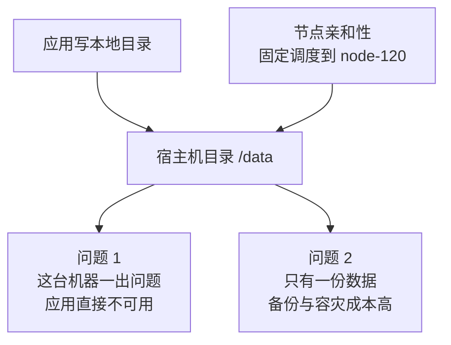
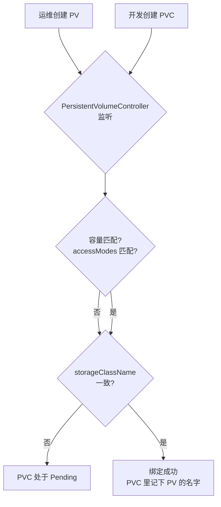
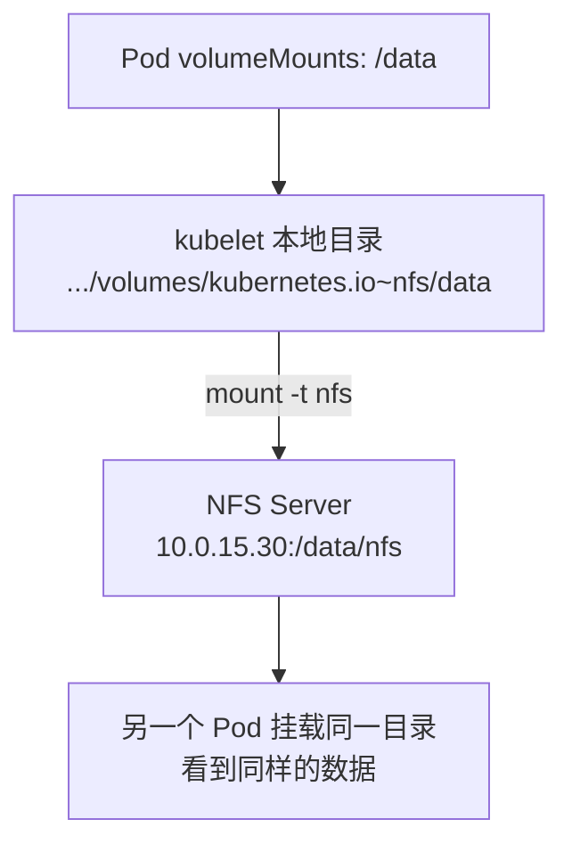
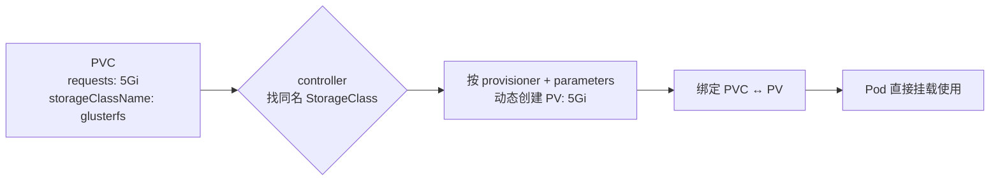
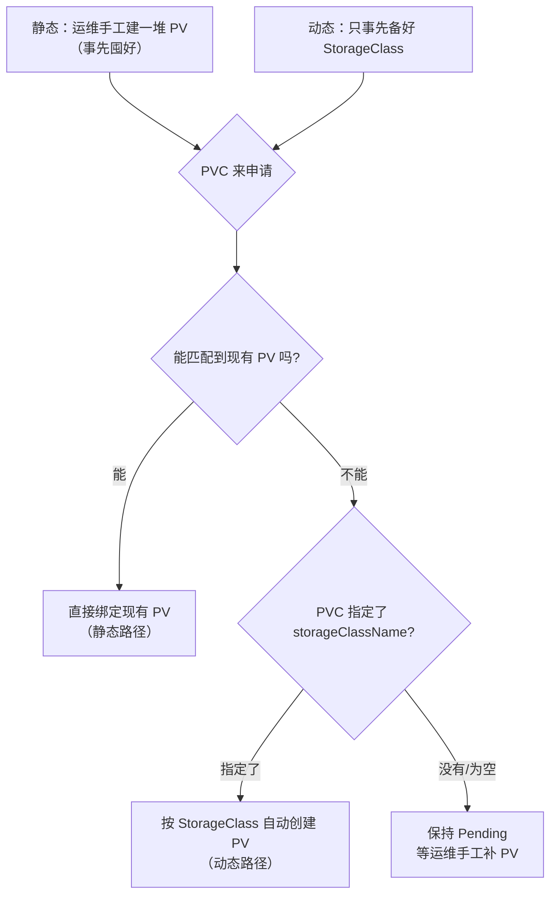
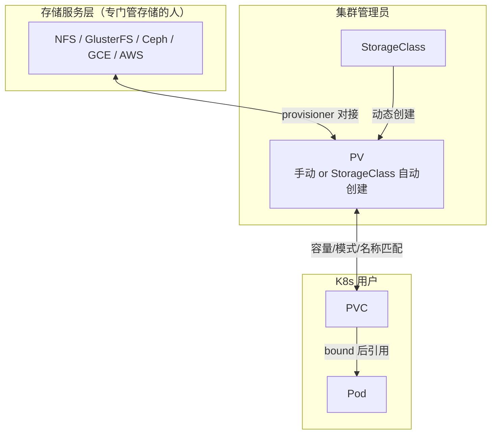
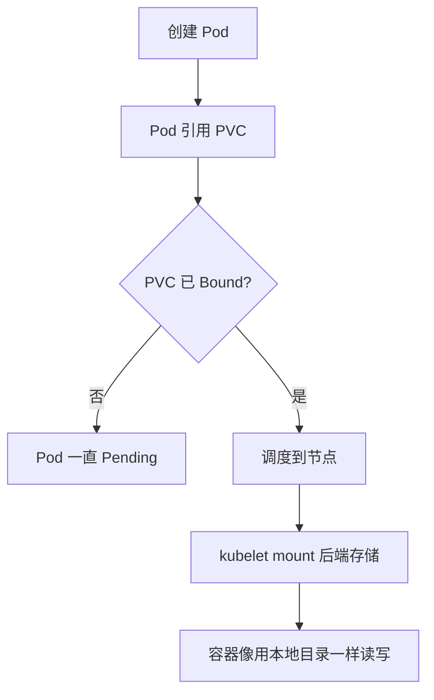
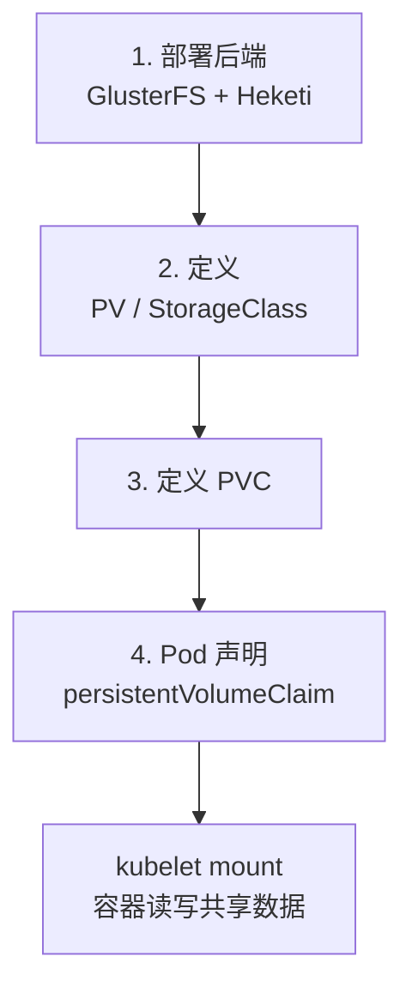

# Kubernetes 生产实践: PV、PVC 与 StorageClass 的绑定机制与 GlusterFS 后端

前面迁移的服务都是**无状态的**，搬到容器里非常顺。但**有状态应用**不一样 —— 最常见的一种就是把文件存到服务器本地目录上（尽管这不是好习惯，但现实里这种应用不少）。直接迁移到容器，**每次启动、每次部署都会把目录清空**，因为容器每次新建，磁盘空间都是全新的。

结论先给：**共享存储靠 PV（具体存储，运维管）+ PVC（需求，开发管）两层抽象，二者必须「容量/访问模式匹配」且 `storageClassName` 一致才能绑定；手工为每个 Pod 建 PV 代价太大，所以用 StorageClass 做 PV 的动态供给；实践里后端用 GlusterFS，靠 Heketi 和 `gluster-kubernetes` 项目部署。**

## 纲要

- 有状态应用的本地存储困境
- 绑定节点的方案为什么缺陷大
- PV：运维创建的持久化卷
- PVC：Pod 对存储的需求
- 绑定条件：匹配 + storageClassName 一致
- Pod 怎么用：声明一个 `persistentVolumeClaim`
- 底层挂载原理：kubelet 的 mount
- StorageClass：PV 的自动模板
- 动态供给：PVC 指定 `storageClassName`
- 静态/动态与默认 StorageClass
- 全局架构图
- 实践环境：GlusterFS 节点与裸磁盘
- 前置条件：`allow-privileged` 参数
- 部署 GlusterFS 服务端

## 正文

有同学会说：**用目录挂载嘛**，把需要的目录挂到宿主机上，再设好节点亲和性，让 Pod 每次都调度到同一个固定节点，不就完了？

没错，这确实是一种方案，**但缺陷比较大**：



1. **绑定了一台机器**，这台机器一出问题，应用就处于不可用状态；
2. **只有一份数据**，只能靠人工去备份，风险大。

所以 Kubernetes 提供的是**共享存储**这一套。

## PV：运维创建的持久化卷

**PV（PersistentVolume）** 描述的是一个**持久化数据卷**。比如一个 NFS 类型的挂载目录。

```yaml
apiVersion: v1
kind: PersistentVolume
metadata:
  name: nfs
spec:
  capacity:
    storage: 10Gi
  accessModes:
    - ReadWriteOnce
  nfs:
    path: /data/nfs
    server: 10.0.15.30
```

定义一个 PV 需要这些东西：

| 字段 | 例子 | 说明 |
| --- | --- | --- |
| `kind` | `PersistentVolume` | PV 是集群级资源（**不命名空间**） |
| `metadata.name` | `nfs` | 起个名字 |
| **`spec.capacity.storage`** | `10Gi` | **存储容量** |
| **`spec.accessModes`** | `ReadWriteOnce` | **访问模式** |
| `spec.nfs.path` / `server` | `/data/nfs` / `10.0.15.30` | NFS 后端的具体信息 |

**`accessModes` 的取值：**

| 取值 | 含义 |
| --- | --- |
| **`ReadWriteOnce`（RWO）** | **只有一个 Pod 可以使用这个 PV**，权限是读写 |
| `ReadOnlyMany`（ROX） | 多个 Pod 只读共享 |
| **`ReadWriteMany`（RWX）** | **多个 Pod 可以共享读写** |

**如果多个 Pod 需要共享这一块磁盘，就把 PV 设成 `ReadWriteMany`。**

NFS 是 Kubernetes **内置支持**的存储类型，PV 里只要给出「挂到远程哪个目录」+「NFS 服务器地址」，这些数据就描述了一个远程共享存储的使用方法。

## PVC：Pod 对存储的需求

**PVC（PersistentVolumeClaim）** 比 PV 多了个 `claim`，它描述的是**一个 Pod 所希望使用的持久化存储的属性，也就是一份需求**：我要多大磁盘、什么读写权限、要不要独占。

```yaml
apiVersion: v1
kind: PersistentVolumeClaim
metadata:
  name: my-pvc
spec:
  accessModes:
    - ReadWriteOnce
  resources:
    requests:
      storage: 5Gi
```

**PVC 一般是由开发同学负责管理的**（在业务命名空间里），它请求的是：一个可读写、**只能被我独占**、有实际空间大小的存储。**这是 Pod 对共享存储的需求期望。**

## 绑定条件：匹配 + storageClassName 一致

PV 和 PVC 都 create 起来了，**Pod 就能用吗？还不行 —— 必须先建立绑定关系，才处于可用状态。**

绑定要满足两条：

1. **PV 要满足 PVC 的需求** —— 存储大小、读写权限都要对得上；
2. **PV 和 PVC 的 `storageClassName` 必须一致**。

当条件满足，集群里有个叫 **PersistentVolumeController** 的组件会发现这个匹配的 PV，**自动把两者绑定起来**。



**本质就是在 PVC 的资源对象里把 PV 的名字填进去**，两者就"正式在一起"了。绑定之后，Pod 终于可以像用普通 volume 一样去用这个 PVC 了。

## Pod 怎么用：声明一个 `persistentVolumeClaim`

Pod 定义跟之前用的 volume 区别不大，**唯一区别在红框/关键字段处**：

```yaml
apiVersion: v1
kind: Pod
metadata:
  name: web-with-pvc
spec:
  containers:
    - name: web
      image: nginx:1.25
      volumeMounts:
        - mountPath: /usr/share/nginx/html
          name: data
  volumes:
    - name: data
      persistentVolumeClaim:
        claimName: my-pvc
```

**在 volume 定义里用了一个字段 `persistentVolumeClaim`，指定一个 PVC 的名字，用起来非常简单。**

```text
Pod 层
└── volumes.persistentVolumeClaim.claimName = my-pvc
PVC 层
├── 需求：5Gi / RWO
├── status.phase = Bound
└── spec 指向被绑定的 PV
PV 层
├── capacity: 10Gi
├── accessModes: RWO
└── nfs: server / path
```

## 底层挂载原理：kubelet 的 mount

通过 PV / PVC 这两层抽象，Pod 用共享存储看起来很简单。原理也不算复杂：

**Pod 里所有 volume 都会在本地对应到一个具体目录**：

- 普通的 `hostPath` / `emptyDir` 类 volume → 对应一个**普通本地目录**；
- **共享存储 → 不再是普通目录**，每种后端存储有不同处理过程。

以 NFS 为例，比较简单：**kubelet 把这个目录远程挂载到 PV 指定的位置**，相当于执行了一条 mount 命令：

```bash
    # 执行前先给下面的占位变量赋值，如 NODE_NAME=node1，否则变量为空会导致命令行为不符合预期
mount -t nfs 10.0.15.30:/data/nfs /var/lib/kubelet/pods/${UID}/volumes/kubernetes.io~nfs/data
```

挂载好之后，**对 Pod 来说这个目录和本地目录没什么区别**，还是照常用 `docker run -v` 那套思路把目录映射到容器里，最终就实现了容器的共享存储。



## StorageClass：PV 的自动模板

到这儿好像挺完美。**但如果有很多 Pod 要共享存储，每建一个就得让运维配一个 PV，不用了还得通知回收 —— 代价实在太大。**

所以 Kubernetes 提供了一套**自动管理 PV 的机制，叫 StorageClass**。

**它的本质就是 PV 的一个模板**， purpose 就是让 Kubernetes 能通过 StorageClass 去**自动创建 PV**：

```yaml
apiVersion: storage.k8s.io/v1
kind: StorageClass
metadata:
  name: glusterfs
provisioner: kubernetes.io/glusterfs
parameters:
  resturl: "http://10.0.15.50:8080"
  clusterid: "1c2d2f2e-..."
  fsType: ext4
```

- `kind: StorageClass`、起个名字；
- 下面的 **`provisioner` 是 Kubernetes 内置存储插件的名字** —— 支持的插件很多（前面列的那张表里的都是），每一种插件有自己的参数，所以 `parameters` 里具体写什么**换一个插件就完全不同**；
- 拿 AWSEBS 来说，这些参数是它自己会用到的。

## 动态供给：PVC 指定 `storageClassName`

有了 StorageClass，PVC 就长这样：

```yaml
apiVersion: v1
kind: PersistentVolumeClaim
metadata:
  name: my-pvc
spec:
  accessModes:
    - ReadWriteOnce
  resources:
    requests:
      storage: 5Gi
  storageClassName: glusterfs
```

跟之前**基本没区别，主要区别就是多了一个 `storageClassName`**。

这样当用 `kubectl create` 创建这个 PVC 时，**PersistentVolumeController 会根据这个 StorageClass 的名字找到那个定义，按它自动创建一个 PV**（多大就按 PVC 里 request 的大小），再给它们建立绑定关系。



> 注意：动态创建出来的 PV **大小是实际的大小（比如 5Gi）**，不是 PV 模板里写死的值。

## 静态/动态与默认 StorageClass

**容易误解的一点：并不是「StorageClass 只为动态创建 PV 而存在」。** 实际上：

- **每一个 PV 和 PVC 都有一个 `storageClassName`**；
- **不管你用静态的还是动态的**；
- **如果你没有设置，它们就会有一个默认的、空的 StorageClass**（`storageClassName: ""`）。

比如你**手动创建一个 PV，也可以给它指定一个 `storageClassName`**，然后当 PVC 里写了**相同名字**的 StorageClass 时，controller 就会自动绑定 —— **它并不在意这个 StorageClass 是不是真的存在，只要名字一样就可以。**



| 模式 | 谁准备 | 事先要做什么 | 回收 |
| --- | --- | --- | --- |
| **静态** | 集群管理员 | **事先手工创建很多 PV** | 用完通知管理员回收 |
| **动态** | 集群管理员 | **只需事先准备好 StorageClass**（一般一种后端一个就够） | 删 PVC，PV 可按 `reclaimPolicy` 自动回收 |

## 全局架构图

从全局梳理一遍相关组件：

**最下面一层 —— 存储服务提供方**，一般由专门负责存储的人管理。Kubernetes 支持的插件可以去官网查，常见的有：

```text
存储服务层（后端）
├── NFS
├── GlusterFS
├── CephFS
├── GCEPD        (GCP)
├── AWSEBS       (AWS)
└── ...（支持的远不止这些）

中间层（集群管理员负责）
├── PV          ← 可手动创建，也可由 StorageClass 自动创建
└── StorageClass ← 一种后端对应一个就够了

最上层（K8s 用户负责）
├── Pod
└── PVC
```

**约束关系：**

- **一个 PV 只能对应一种集群类型的后端存储** —— 比如一个 PV 指定的是 CephFS，就不能同时是 NFS，只能是一种；
- **一个 Pod 可以使用多个 PVC**；
- **一个 PVC 可以同时给多个 Pod 提供服务**；
- **一个 PVC 只能绑定一个 PV**。



**Pod 创建时的完整判定链：**

1. 一个 Pod 要用共享存储 → **先创建 PVC**，在 PVC 里描述自己想要什么类型的后端、多大空间；
2. controller 根据需求去匹配**现有的 PV 和 StorageClass**；
3. **如果匹配都没成功 → PVC 处于 `Pending` 状态**：
   - 这时如果你创建的 Pod 用了这个 PVC，**Pod 也会处于 `Pending`**（`ContainerCreating` 卡住）；
4. 如果 **PVC 匹配到了合适的 PV** → 自动绑定；
5. 如果 **PVC 匹配到了 StorageClass** → 按配置自动创建 PV，再绑定；
6. **最后创建 Pod 时，只需指定 PVC 的名字**，就能像普通 volume 一样用共享存储了。



## 实践环境：GlusterFS 节点与裸磁盘

接下来进实践。这次后端存储用 **GlusterFS**。

**部署方式**：用 **Docker Hub 上的 `gluster` 项目下的 `gluster-kubernetes`** 这个项目来跑，相关的重要组件还有 **Heketi**。

**对基础环境的要求：**

1. **准备三个 GlusterFS 节点**，保证**每一份数据有三份备份**（副本数 3）；
2. **每一个节点上要有一块裸磁盘（没有经过分区的磁盘）** —— 这是 GlusterFS 的基本要求，它会**完全接管这块磁盘**，从而实现更高效地管理数据。

**当前环境：**

- 之前有两个 worker 节点：`node-120`、`node-121`；
- **为了做 Gluster 又新建了三台虚拟机**，每台配了**两块磁盘**，第二块是单独加上的、没经过任何操作的裸盘；
- 主节点上看节点列表，除了 120/121 之外，又加入了 `class-01`、`class-02`、`class-03` 三个 worker 节点，对应那三台虚拟机。**加入 worker 节点的过程跟之前装 120/121 时一样**。

```text
集群节点
├── master      (master / 控制节点)
├── node-120    worker + GlusterFS 客户端
├── node-121    worker + GlusterFS 客户端
├── class-01    worker + 裸磁盘 (GlusterFS 服务端)
├── class-02    worker + 裸磁盘 (GlusterFS 服务端)
└── class-03    worker + 裸磁盘 (GlusterFS 服务端)
```

> 提醒：**每一台机器的 `/etc/hosts` 都要配好**，让它们之间能通过机器名互相访问。

**先在每一个 worker 节点上装 GlusterFS 客户端** —— 装了客户端才能正常使用 GlusterFS：

```bash
yum install -y glusterfs glusterfs-fuse
```

**每一个想调度 Pod 的 worker 节点都要装**（120、121 都要装）。为了演示方便，三台 `class-0x` 机器内存小，就不装客户端了 —— 一般情况下 Pod 只会调度在 120/121 上。

## 前置条件：`allow-privileged` 参数

检查主节点上 **API Server 的启动参数**，应该带有 `allow-privileged` 参数，**需要加上 `allow-privileged=true`**：

```bash
ps -ef | grep kube-apiserver | grep allow-privileged
# --allow-privileged=true
```

**除了 API Server，还要检查每个节点的 kubelet 服务**，也要有 `allow-privileged=true`：

```bash
ps -ef | grep kubelet | grep allow-privileged
# --allow-privileged=true
```

**两边都得有这个参数才可以**，否则 Privileged 类型的 Pod（GlusterFS 服务端就是）会被拒。

## 部署 GlusterFS 服务端

到这一节的目录下 `persistentvolume`，先看第一个 `glusterfs-daemonset.yaml` —— 它是一个 **GlusterFS 服务端，以 DaemonSet 方式运行**：

```yaml
apiVersion: apps/v1
kind: DaemonSet
metadata:
  name: glusterfs
spec:
  selector:
    matchLabels:
      storage: glusterfs
  template:
    metadata:
      labels:
        storage: glusterfs
    spec:
      hostNetwork: true
      nodeSelector:
        storage: glusterfs
      containers:
        - name: glusterfs
          image: gluster/gluster-centos:latest
          # ... 端口、健康检查、privileged 等
```

关键几点：

- **用了 `hostNetwork: true`**；
- **`nodeSelector: storage=glusterfs`** —— 所以**需要在这三个节点上打一个 `storage=glusterfs` 标签**，它才能运行在正确的位置；
- 镜像是 `gluster/gluster-centos`；
- 下面定义了关于容器的一系列参数、网络、还有**健康检查（liveness probe）**。

> 这就是官方提供的一个标准配置，**它的功能就是提供 GlusterFS 的服务端**，相当于前面那张图**最底层的"存储服务提供者"**。具体的 DaemonSet 配置不详细展开了。

给节点打标签：

```bash
kubectl label node class-01 storage=glusterfs
kubectl label node class-02 storage=glusterfs
kubectl label node class-03 storage=glusterfs

kubectl apply -f glusterfs-daemonset.yaml
kubectl get pod -o wide -l storage=glusterfs
```

**实践这一套流程包含三块**：

1. 后端存储服务提供者的部署（GlusterFS + Heketi）；
2. PV / StorageClass 的定义；
3. PVC 的定义 + Pod 怎样使用 PVC。



## API 速览

| 能力 | API / 配置 |
| --- | --- |
| 描述一个持久化卷 | `kind: PersistentVolume` + `spec.capacity.storage` |
| 指定容量 | `spec: { capacity: { storage: 10Gi } }` |
| 指定访问模式 | `spec.accessModes: [ReadWriteOnce \| ReadWriteMany \| ReadOnlyMany]` |
| NFS 后端 | `spec: { nfs: { path, server } }` |
| 描述一份存储需求 | `kind: PersistentVolumeClaim` + `resources.requests.storage` |
| Pod 引用 PVC | `volumes[].persistentVolumeClaim.claimName` |
| 容器内挂载点 | `volumeMounts[].mountPath` |
| 动态供给 | `kind: StorageClass` + `spec.provisioner` + `spec.parameters` |
| PVC 指定模板 | `spec.storageClassName: glusterfs` |
| 查看绑定关系 | `kubectl get pv,pvc` |
| 查看 Pending 原因 | `kubectl describe pvc <name>` |
| 节点专属标记 | `kubectl label node class-01 storage=glusterfs` |
| 检查特权参数 | `ps -ef \| grep kube-apiserver \| grep allow-privileged` |

## Demo 示例

静态供给（手工 PV + PVC）最小闭环：

```bash
# 1. 运维先备好一堆 PV（这里只放一个示例 PV 的清单）
cat <<'EOF' | kubectl apply -f -
apiVersion: v1
kind: PersistentVolume
metadata:
  name: nfs
spec:
  capacity:
    storage: 10Gi
  accessModes:
    - ReadWriteOnce
  nfs:
    path: /data/nfs
    server: 10.0.15.30
EOF

# 2. 开发申请 5Gi
cat <<'EOF' | kubectl apply -f -
apiVersion: v1
kind: PersistentVolumeClaim
metadata:
  name: my-pvc
spec:
  accessModes:
    - ReadWriteOnce
  resources:
    requests:
      storage: 5Gi
  storageClassName: ""
EOF

# 3. 看绑定结果（Bound 才说明 controller 把 PV 名填进 PVC 了）
kubectl get pv
kubectl get pvc

# 4. Pod 用起来
cat <<'EOF' | kubectl apply -f -
apiVersion: v1
kind: Pod
metadata:
  name: web-with-pvc
spec:
  containers:
    - name: web
      image: nginx:1.25
      volumeMounts:
        - mountPath: /usr/share/nginx/html
          name: data
  volumes:
    - name: data
      persistentVolumeClaim:
        claimName: my-pvc
EOF
```

**排障：Pod 一直 Pending**

```bash
kubectl describe pvc my-pvc
# 看 Events 段报的是 "no persistent volumes available for claim" 还是
# 关联到某个 StorageClass  ProvisioningFailed

kubectl get pod web-with-pvc
kubectl describe pod web-with-pvc
# Events: pod has unbound PersistentVolumeClaim
```

```text
Pending 的两类成因

  PVC 没 Bound          → Pod 无法调度启动
    ├─ 现有 PV 容量/模式不匹配
    ├─ PV 与 PVC 的 storageClassName 不一致
    └─ 没配 StorageClass 且没人手工补 PV

  PVC Bound 但 Pod 起不来 → kubelet 阶段 mount 失败
    ├─ 后端存储不可达（NFS server 挂了）
    └─ 节点缺客户端（没装 glusterfs-fuse）
```

### 总结

- **PV 是"有什么"，PVC 是"要什么"**：PV 由运维创建，描述后端存储（NFS 地址/路径、容量、访问模式）；PVC 由开发创建，描述需求（多大空间、什么权限）。**二者必须容量/模式匹配 + `storageClassName` 一致，PersistentVolumeController 才会把 PV 名填进 PVC 完成绑定。**
- **`accessModes` 三个取值决定共享程度**：`ReadWriteOnce` 独占读写、`ReadOnlyMany` 多读、`ReadWriteMany` 多 Pod 读写共享 —— **多 Pod 共享磁盘必须用 RWX**。
- **Pod 用存储只需一行**：`volumes[].persistentVolumeClaim.claimName`，容器内 `volumeMounts` 挂载；底层是 **kubelet 把远端目录 mount 到本地目录**（NFS 就是一条 `mount -t nfs`），对容器而言和本地目录没区别。
- **StorageClass 是 PV 的模板、用于动态供给**：只事先备好 StorageClass（一种后端一个就够），PVC 写上 `storageClassName` 就会自动创建对应大小的 PV 并绑定，省掉"每建一个 Pod 找运维要一个 PV"的成本；**但静态/动态都要求 `storageClassName` 字段参与匹配，不写就是默认的空值**。
- **GlusterFS 实践前置条件**：三节点（三副本）+ 每节点一块**未分区裸盘** + 每个 worker 装 `glusterfs`/`glusterfs-fuse` 客户端 + **API Server 与 kubelet 都要 `--allow-privileged=true`**；服务端以 DaemonSet + `hostNetwork` 跑，靠 `nodeSelector: storage=glusterfs` 落到专门节点。

