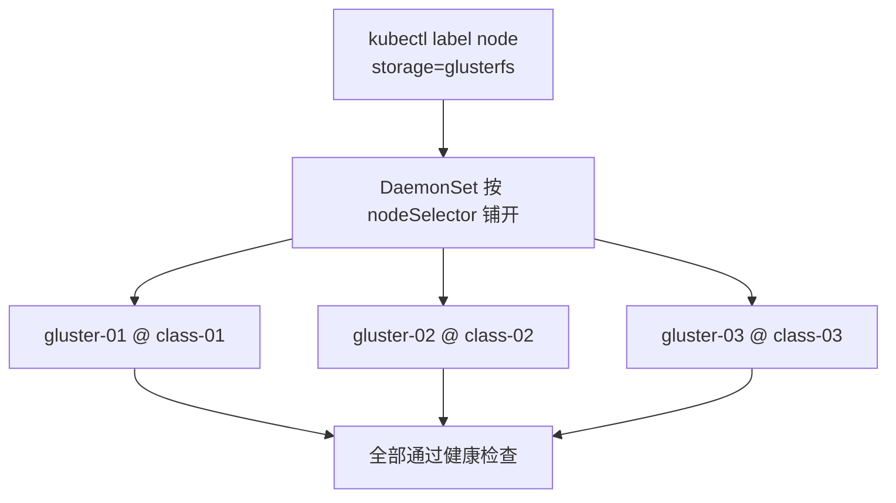
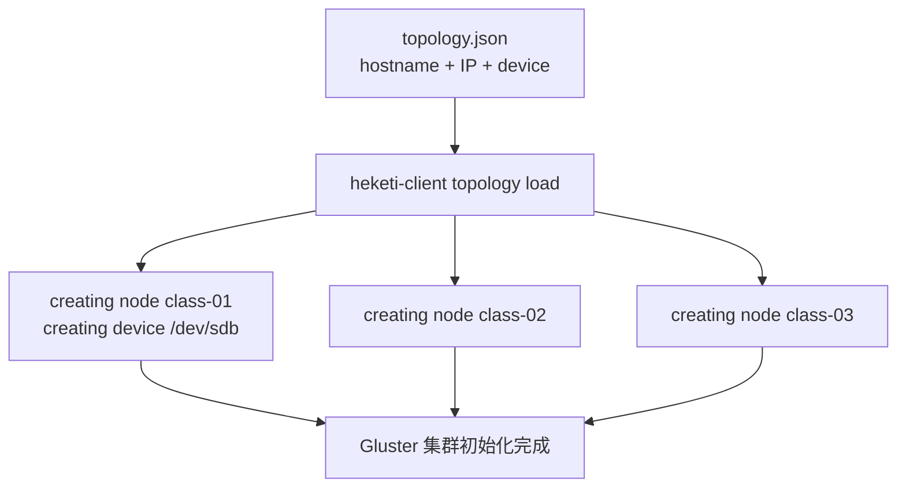
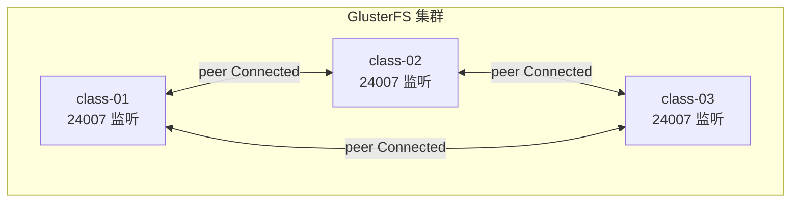
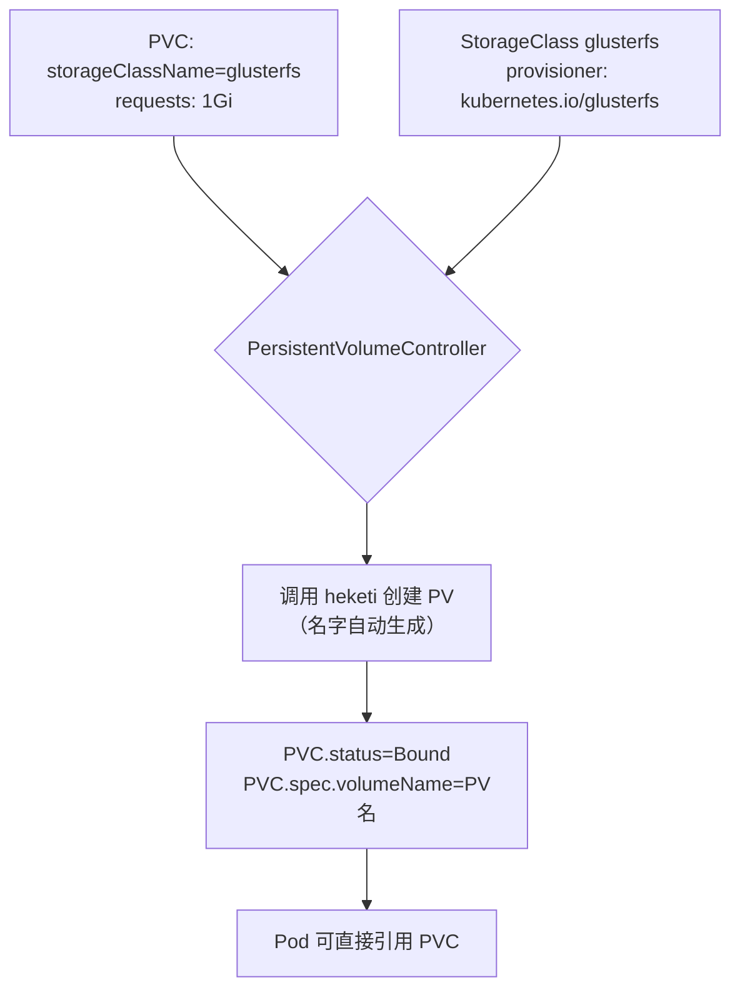
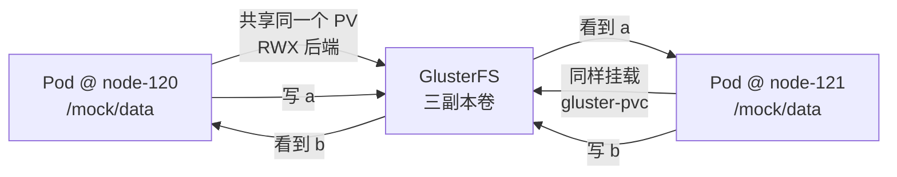
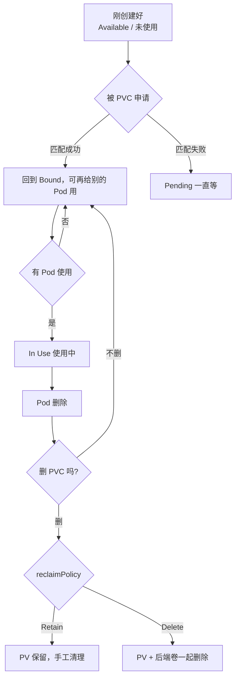

# Kubernetes 生产实践: 用 Heketi 初始化 GlusterFS 并让 StorageClass 动态供给 PV

上一节把共享存储的**原理**（PV / PVC / StorageClass 三层 + 绑定机制）讲清楚了，也把 GlusterFS 服务端 DaemonSet 的部署前置条件（`--allow-privileged`、裸磁盘、`nodeSelector` 标签）铺好了。这节是**完整落地**：从三节点 GlusterFS 跑起来，到 Heketi 初始化裸磁盘、动态生成 PV、PVC 自动绑定，再到双副本验证共享存储真的能通。

结论先给：**GlusterFS 跑起来只是"存储服务层"，要让它能被 PVC 用，必须过 Heketi 做一次 `topology load` 把裸设备纳管；然后 StorageClass 的 `provisioner` 指 `kubernetes.io/glusterfs`、`resturl` 指 Heketi 的 30001/TCP 端口，PVC 只需写 `storageClassName` 就会自动拉出一个 PV 并绑定。**

## 纲要

- 给 Gluster 节点打标签，跑起三节点 DaemonSet
- 引入 Heketi：目的就是纳管裸磁盘
- 部署 Heketi：ServiceAccount + ClusterRole + Binding
- Heketi 的 DB 用 hostPath 持久化
- 写 topology.json：节点名、IP、裸设备名
- `heketi client topology load` 初始化集群
- 三个节点必须齐，两个会埋雷
- 验证：拓扑信息 + gluster peer status
- StorageClass：provisioner + resturl
- PVC 一行 storageClassName 触发动态 PV
- 验证绑定：PVC bound + `spec.volumeName`
- Deployment 双副本验证共享存储
- PV/PVC 生命周期与回收策略

## 正文

## 给 Gluster 节点打标签，跑起三节点 DaemonSet

给 `class-01`、`class-02`、`class-03` 都打上标签，这样运行 DaemonSet 时**每一个节点都会跑一个 Pod**：

```bash
kubectl label node class-01 storage=glusterfs
kubectl label node class-02 storage=glusterfs
kubectl label node class-03 storage=glusterfs
```

然后创建最底层的服务：

```bash
kubectl apply -f glusterfs-daemonset.yaml
kubectl get pod -o wide
```

三个 GlusterFS Pod 跑起来了（`gluster-01` / `gluster-02` / `gluster-03`），正是期望的运行结果。

**第一次运行会比较慢，要等镜像下载**，中途可能有几个还在 `ContainerCreating`，**等全部通过健康检查**再继续。

```text
[hack]
$ kubectl get pod -o wide -l storage=glusterfs
NAME          READY   STATUS    RESTARTS   AGE   NODE
gluster-01    1/1     Running   0          2m    class-01
gluster-02    1/1     Running   0          2m    class-02
gluster-03    1/1     Running   0          2m    class-03
```



## 引入 Heketi：目的就是纳管裸磁盘

GlusterFS 服务部署完了。**接下来要初始化那块裸磁盘，让 GlusterFS 把它管起来** —— 为了方便这一步，引入一个服务叫 **Heketi**，它主要是用来**方便我们管理和维护刚跑起来的 GlusterFS**。

## 部署 Heketi：ServiceAccount + ClusterRole + Binding

Heketi 的 deploy 包含几部分：

```text
gluster 部署清单目录
├── glusterfs-daemonset.yaml   GlusterFS 服务端，DaemonSet + hostNetwork
├── heketi-security.yaml       ServiceAccount + ClusterRole + ClusterRoleBinding
├── heketi-deployment.yaml     Heketi Deployment + Service(30001/TCP) + volumeDB
├── topology.json              节点 hostname / IP / 裸设备名，供 topology load 使用
├── gluster-sc.yaml            StorageClass，provisioner + resturl
├── gluster-pvc.yaml           PVC，只写 storageClassName 触发动态供给
└── web-deploy.yaml            双副本 Deployment，挂载同一个 PVC 验证共享
```

- 一个 **Service**，容器里 8080 → 80（对外是 80，也没什么多说的）；
- 一个 **ConfigMap** 暴露 **30001 端口**的 TCP Service（把具体 service 暴露出一个端口）；
- 一个 **Deployment**（名字 `heketi`）定义了很多环境变量；
- 有一个 **volumeDB** 对应 `/var/lib/heketi`，**用来存储一些数据**，这个 DB **以 hostPath 形式挂载到了宿主机目录**；
- **用了一个 ServiceAccount** —— `heketi-security`。

```yaml
apiVersion: v1
kind: ServiceAccount
metadata:
  name: heketi-security
---
apiVersion: rbac.authorization.k8s.io/v1
kind: ClusterRole
metadata:
  name: heketi-security
rules:
  - apiGroups: [""]
    resources: ["pods", "persistentvolumeclaims", "events", "secrets"]
    verbs: ["create", "list", "get", "watch", "delete"]
  - apiGroups: ["storage.k8s.io"]
    resources: ["storageclasses", "persistentvolumes"]
    verbs: ["create", "list", "get", "watch", "delete"]
---
apiVersion: rbac.authorization.k8s.io/v1
kind: ClusterRoleBinding
metadata:
  name: heketi-security
roleRef:
  apiGroup: rbac.authorization.k8s.io
  kind: ClusterRole
  name: heketi-security
subjects:
  - kind: ServiceAccount
    name: heketi-security
    namespace: default
```

为什么需要这一套 RBAC？**因为 GlusterFS 是运行在 Pod 里的，Heketi 要想管理 GlusterFS，本质上就是去管理 K8s 里的 Pod。** 所以要给 Heketi 定义一个 ClusterRole，包含 **serviceaccount / clusterrole / clusterrolebinding**，把 ServiceAccount 和 ClusterRole 绑在一起，让这个 ServiceAccount 具备相应的操作权限。

> 安全这块前面讲过很多，这里的思路一致。

先创建 ServiceAccount `heketi-security`，然后再部署 Heketi Deployment。

| 组件 | 作用 |
| --- | --- |
| Service（80 ↔ 8080） | 集群内访问 Heketi API |
| Service（30001/TCP） | 对外暴露的 TCP 端口，映射到容器内 8080 |
| Deployment heketi | 跑 Heketi 服务本身 |
| volumeDB → `/var/lib/heketi` hostPath | **存 Heketi 的元数据 DB**，不能丢否则知道的节点拓扑全没了 |
| ServiceAccount `heketi-security` | 让 Heketi 能 CREATE/PV/PVC 等 |
| ClusterRole + ClusterRoleBinding | 把权限绑上去 |

创建完看 Pod，Heketi 容器调度在 `node-121` 上，状态 `ContainerCreating`，**还没通过健康检查**，等一会儿。

```bash
kubectl apply -f heketi-security.yaml
kubectl apply -f heketi-deployment.yaml
kubectl get pod
# heketi-xxxxx   0/1   ContainerCreating
kubectl get pod -w
# heketi-xxxxx   1/1   Running
```

## Heketi 的 DB 用 hostPath 持久化

注意那个 `volumeDB`：

```yaml
spec:
  template:
    spec:
      containers:
        - name: heketi
          image: heketi/heketi:latest
          volumeMounts:
            - mountPath: /var/lib/heketi
              name: db
      volumes:
        - name: db
          hostPath:
            path: /data/heketi
```

**Heketi 的 DB 保存了 Gluster 集群的拓扑、device 分配、volume 映射。用 hostPath 挂到宿主机目录，是为了让这些数据不随 Pod 重建丢失。** 生产上更该用 PVC，但这里为了简化演示用 hostPath。

## 写 topology.json：节点名、IP、裸设备名

SSH 到 `node-121` 看容器：

```bash
    # 执行前先给下面的占位变量赋值，如 NODE_NAME=node1，否则变量为空会导致命令行为不符合预期
kubectl exec -it ${HEKETI_POD} -- sh
# 进去后设置环境变量，后面执行命令需要它访问 Heketi server
export HEKETI_SERVER_URL=http://heketi.default.svc.cluster.local:8080
```

因为等会要执行一个命令，**它需要这个环境变量去访问 Heketi server**。

先看那个配置：里面包了几个 json 配置文件，其中配了具体的 GlusterFS 信息，**包括每一个 hostname（gluster-01 对应哪个 IP 地址）—— 这个地方一定不要写错。**

```json
{
  "clusters": [
    {
      "nodes": [
        {
          "hostname": "class-01",
          "zone": 1,
          "devices": [
            { "name": "/dev/sdb", "dirty": true }
          ]
        },
        {
          "hostname": "class-02",
          "zone": 1,
          "devices": [
            { "name": "/dev/sdb", "dirty": true }
          ]
        },
        {
          "hostname": "class-03",
          "zone": 1,
          "devices": [
            { "name": "/dev/sdb", "dirty": true }
          ]
        }
      ]
    }
  ]
}
```

字段解释：

| 字段 | 含义 |
| --- | --- |
| `clusters[].nodes[]` | 组成集群的节点列表 |
| `hostname` | 节点机器名 |
| `zone` | 故障域（不同 zone 才能保障副本不落在同一故障域） |
| **`devices[].name`** | **裸设备名** —— 也就是那块裸磁盘的设备名 |

**看一下我们那块磁盘**：

```bash
lsblk
# NAME   MAJMIN RM  SIZE RO TYPE MOUNTPOINT
# sda    8,0    0   40G  0 disk
# ├─sda1 8,1    0   40G  0 part /
# sdb    8,16   0    4G  0 disk     ← 新挂载进去的裸磁盘
```

`vdb`（在有些环境里是 `/dev/sdb`）**就是新挂载进去的那块磁盘**。这里 zsh/环境里的名字可能都不一样，**需要自己替换成实际值**。

三个节点的对应关系：

| 节点 | IP | 设备名 |
| --- | --- | --- |
| class-01 | 192.168.56.56 | `/dev/sdb`（你环境可能是 `/dev/vdb`） |
| class-02 | 192.168.56.57 | 同上 |
| class-03 | 192.168.56.60 | 同上 |

把这个配置复制一下，进到容器里编辑一个配置文件 `topology.json`，粘贴进去保存。

## `heketi client topology load` 初始化集群

```bash
    # 执行前先给下面的占位变量赋值，如 NODE_NAME=node1，否则变量为空会导致命令行为不符合预期
kubectl exec -it ${HEKETI_POD} -- sh
export HEKETI_SERVER_URL=http://heketi.default.svc.cluster.local:8080
# 把前面编辑好的 topology.json 放进容器
kubectl cp topology.json ${HEKETI_POD}:/tmp/topology.json

# 指定 json 文件，让 Heketi 按配置把 GlusterFS 集群初始化
heketi client topology load --server=... --json=/tmp/topology.json
# 或（容器变量已设好时）：
heketi-client topology load --json=/tmp/topology.json
```

正常会看到类似日志：

```text
creating node class-01  id: 8a1f2c3d4e5b6a7f
creating node class-02  id: ...
creating node class-03  id: ...
creating device /dev/sdb on class-01
```

**`creating node` —— 当前正在创建节点 class-01**，然后有个 ID，然后有对应我们配置的裸设备设备名。**初始化时间可能比较长，需要耐心等待。**



第一个节点加好了，第二个、第三个……**这里一定要注意：必须要有三个节点。** 虽然**两个节点在这一步也可以初始化成功，但后面使用的时候会出现一些意想不到的问题**。

完成后看拓扑：

```bash
heketi-client topology info
```

```text
Cluster ID: f3a9...
    Node: class-02
        Status: online
        Address: 192.168.56.57
        Size: 4GB  Used: 0%  (0)
    Node: class-01
        Status: online
        Address: 192.168.56.56
        Size: 4GB  Used: 0%  (0)
    Node: class-03
        Status: online
        Address: 192.168.56.60
        Size: 4GB  Used: 0%  (0)
```

看到 ClusterID、node 的 `status: online`、hostname、IP，还有大小 4GB 已用 0% —— 三个都正常。**这样最下边一层存储服务就正式可以提供服务了。**

## 验证：gluster peer status

到 Gluster 节点上看 `netstat` 验证监听端口起来了：

```bash
netstat -lnt | grep gluster
# 24007   ← GlusterFS 的监听端口
```

进容器看集群信息：

```bash
    # 执行前先给下面的占位变量赋值，如 NODE_NAME=node1，否则变量为空会导致命令行为不符合预期
kubectl exec -it ${GLUSTER_POD} -- gluster cluster peer status
# Number of Peers: 2
# Peer 1: class-02 ... State: Connected
# Peer 2: class-03 ... State: Connected
```

**三个节点，状态都是已连接（Connected），说明 GlusterFS 三节点集群正常。**



## StorageClass：provisioner + resturl

**最下面一层准备好了，开始准备倒数第二层（PV / StorageClass）。**

```yaml
apiVersion: storage.k8s.io/v1
kind: StorageClass
metadata:
  name: glusterfs
provisioner: kubernetes.io/glusterfs
parameters:
  resturl: "http://heketi.default.svc.cluster.local:30001"
  clusterid: "f3a9..."
  fsType: ext4
  reclaimPolicy: Delete
```

非常简单的配置：

- `kind: StorageClass`，名字 `glusterfs`；
- **`provisioner` 是谁？`kubernetes.io/glusterfs` —— GlusterFS 是 Kubernetes 内置的一种存储类型**；
- 下面是 GlusterFS 的一个 server 的请求地址：**IP 是我们 ingress 的 IP，30001 是我们对外暴露的 TCP 端口，对应到 glusterfs 这个服务容器里边的 8080 端口**。

```text
StorageClass 的转发链
PVC → heketi (30001/TCP，ingress 暴露)
        ↓
heketi 服务容器 (8080)
        ↓
调度/管理 GlusterFS Pod（三副本）
```

## PVC 一行 storageClassName 触发动态 PV

> 注意：这里其实已经"不需要手工建 PV"了 —— **动态供给的关键就在这行 `storageClassName`**。

倒数的第二层准备完，**就可以准备最上面一层（PVC + Pod）了。**

```yaml
apiVersion: v1
kind: PersistentVolumeClaim
metadata:
  name: gluster-pvc
spec:
  accessModes:
    - ReadWriteOnce
  storageClassName: glusterfs
  resources:
    requests:
      storage: 1Gi
```

`storageClassName` 对应的就是我们刚才创建的那个 StorageClass，`accessModes` 只许自己挂载，存储大小 1GB。

**注意：这里没有指定 `spec.volumeName`** —— 这正是动态供给的意义，PV 是系统后来造的。

## 验证绑定：PVC bound + `spec.volumeName`

```bash
kubectl apply -f gluster-pvc.yaml
kubectl get pvc
# NAME          STATUS   VOLUME                                     CAPACITY
# gluster-pvc   Bound    pvc-8f2a1c9e-...                          1Gi
```

**PVC 当前状态是 Bound 状态。**

再看 PV：

```bash
kubectl get pv
# NAME                CAPACITY   ACCESS MODES   RECLAIM POLICY   STATUS
# pvc-8f2a1c9e-...    1Gi        RWO            Delete           Bound
```

**PV 名字非常长，很明显是一个系统自动生成的 PV** —— 它是根据我们的 StorageClass 生成的，然后跟这个 PVC 进行了绑定。

**怎么体现绑定？** 一个是状态（Bound），还可以 `describe` 一下这个 PVC：

```bash
kubectl describe pvc gluster-pvc
```

**在 `spec` 下面有一个字段叫 `volumename`，对应的就是 PV 的名字 —— 这个值就是它在做绑定的时候，controller 自动填进去的。**



| 验证项 | 命令 | 看什么 |
| --- | --- | --- |
| PVC 已绑定 | `kubectl get pvc` | `STATUS=Bound` |
| 动态 PV 已生成 | `kubectl get pv` | **名字很长 = 系统自动生成的** |
| 绑定的 PV 名 | `kubectl describe pvc` | **`spec.volumeName` 字段** |
| PV 回收策略 | `kubectl get pv` | `RECLAIM POLICY`（当前是 Delete） |

## Deployment 双副本验证共享存储

看看一个 Pod 的例子 `web-deploy.yaml`，跟之前的 Deployment 区别也不大：

```yaml
apiVersion: apps/v1
kind: Deployment
metadata:
  name: web-deploy
spec:
  replicas: 2
  selector:
    matchLabels:
      app: web
  template:
    metadata:
      labels:
        app: web
    spec:
      containers:
        - name: springboot-web
          image: springboot-web:v1
          volumeMounts:
            - mountPath: /mock/data
              name: gluster-volume
      volumes:
        - name: gluster-volume
          persistentVolumeClaim:
            claimName: gluster-pvc
```

**首先，它的副本数是 2 —— 为了验证共享存储，特意把 replicas 设成 2。**

下面定义了一个 volume，名字叫 `gluster-volume`，**容器目录是根目录下的 `/mock/data`，可读可写**，volume 来源 `persistentVolumeClaim`，PVC 名字 `gluster-pvc`。

> **GlusterFS 能跑起来的前提是 120 和 121 上都装了 GlusterFS 客户端** —— 这在最开始已经装过了。

```bash
kubectl apply -f web-deploy.yaml
kubectl get pod -o wide
# web-deploy-xxx  1/1  Running  node-120
# web-deploy-yyy  1/1  Running  node-121
```

**一个在 node-120 上，一个在 node-121 上。**

## 实测：一个副本写，另一个副本直接看到

```bash
# 在 node-120 的这个容器里
    # 执行前先给下面的占位变量赋值，如 NODE_NAME=node1，否则变量为空会导致命令行为不符合预期
docker exec -it ${WEB_DEPLOY_XXX} sh
cd /mock/data
ls
# （空的）
echo hello > a
ls
# a
```

再跑去 `node-121` 的**另外一个副本**：

```bash
    # 执行前先给下面的占位变量赋值，如 NODE_NAME=node1，否则变量为空会导致命令行为不符合预期
docker exec -it ${WEB_DEPLOY_YYY} sh
cd /mock/data
cat a
# hello     ← 看到了刚才写的内容
echo b > b
```

**再回到第一个容器：**

```bash
cd /mock/data
ls
# a  b      ← 也看到了对方写的 b 文件
```

**由此可见，共享存储确实可用了。**



> 这里是 `ReadWriteOnce` + 单 PVC 被两个 Pod 依次挂载的场景：mount 是分布式的，文件创建后通过 Gluster 的 inode/条目自愈对端可见。**真正多 Pod 同时读写共享，后端要用 `ReadWriteMany`（如 CephFS / NFS），否则会出现"写丢失"。**

## PV/PVC 生命周期与回收策略

还有个细节：PV 和 PVC 的生命周期。

```bash
kubectl get pvc
# NAME          STATUS   VOLUME          CAPACITY
# gluster-pvc   Bound    pvc-8f2a...     1Gi

kubectl get pv
# NAME              CAPACITY   RECLAIM POLICY   STATUS
# pvc-8f2a...       1Gi        Delete           Bound
```

- `get pvc` 有一个字段 **`status = Bound`**；
- `get pv` 有个重要 **status 是 Bound**，除了这个字段，**还有一个字段叫 `reclaim`（回收策略），当前是 `Delete`**。

**生命周期无非这么几种状态：**



**值得动手验证的两个问题**（原文留作练习，这里给出结论指引）：

1. **把 Deployment 删掉之后，PVC 处于什么状态？还能给其他 Pod 再次使用吗？**
   → PVC **不会跟着 Pod 删**，它仍是 `Bound`，且 `in use` 计数归零，**新的 Pod 引用同一个 PVC 可以立刻用**。
2. **把 PVC 也删掉，PV 处于什么状态？还能跟其他 PVC 绑定吗？**
   → 取决于 `reclaimPolicy`：**`Delete`（动态供给默认）会连后端 Gluster 卷一起删掉，PV 直接消失；`Retain` 则 PV 变成 `Released`，**`spec.claimRef` 还指向已删的 PVC，**不能直接被新 PVC 绑定**，必须先手工删 `claimRef` 或重建 PV。

```text
生命周期状态速查

  PVC  Available → Pending → Bound → (Pod 删除后仍 Bound)
  PV   Available → Bound   → Released → Retain: 永久 / Delete: 已删
  关键字段  pv.spec.persistentvolumereclaimpolicy = Delete | Retain | Recycle
             pv.status.phase = Available | Bound | Released | Failed | Pending
             pvc.status.phase = Pending | Bound | Lost
```

## API 速览

| 能力 | API / 命令 |
| --- | --- |
| 打标签让 DaemonSet 铺开 | `kubectl label node class-01 storage=glusterfs` |
| GlusterFS 服务端 | DaemonSet + `hostNetwork` + `nodeSelector` |
| 特权检查 | `ps -ef \| grep kube-apiserver \| grep allow-privileged` |
| Heketi 权限 | `ServiceAccount` + `ClusterRole` + `ClusterRoleBinding` |
| Heketi 元数据 | `volumeMounts: /var/lib/heketi`（hostPath） |
| Heketi 对外端口 | Service **30001/TCP** → 容器 8080 |
| 初始化集群 | `heketi-client topology load --json=topology.json` |
| 看集群拓扑 | `heketi-client topology info` / `heketi client topology` |
| Gluster 端口 | `24007` |
| 集群连通性 | 容器里 `gluster cluster peer status` |
| 裸设备查看 | `lsblk` / `fdisk -l` |
| 动态供给 | `kind: StorageClass` + `provisioner` + `parameters.resturl` |
| glusterfs provisioner | `kubernetes.io/glusterfs` |
| PVC 触发自动 PV | `spec.storageClassName` |
| 验证绑定 | `kubectl get pv,pvc` / `kubectl describe pvc` 看 **`spec.volumeName`** |
| 回收策略 | `pv.spec.persistentvolumereclaimpolicy: Delete \| Retain` |
| 查看状态 | `pvc.status.phase` / `pv.status.phase` |

## Demo 示例

一条龙脚本：

```bash
#!/usr/bin/env bash
set -euo pipefail

# 1. 打标签，跑 GlusterFS 三节点
for n in class-01 class-02 class-03; do
  kubectl label node "$n" storage=glusterfs --overwrite
done
kubectl apply -f glusterfs-daemonset.yaml
kubectl wait --for=condition=ready pod -l storage=glusterfs --timeout=600s

# 2. Heketi 权限 + 部署
kubectl apply -f heketi-security.yaml
kubectl apply -f heketi-deployment.yaml
kubectl wait --for=condition=ready pod -l app=heketi --timeout=600s

# 3. 先看裸设备名（替换成你自己的）
lsblk

# 4. 写 topology.json 并灌进 Heketi
cat > topology.json <<'EOF'
{
  "clusters": [
    {
      "nodes": [
        { "hostname": "class-01", "zone": 1, "devices": [{ "name": "/dev/sdb", "dirty": true }] },
        { "hostname": "class-02", "zone": 1, "devices": [{ "name": "/dev/sdb", "dirty": true }] },
        { "hostname": "class-03", "zone": 1, "devices": [{ "name": "/dev/sdb", "dirty": true }] }
      ]
    }
  ]
}
EOF
HK=$(kubectl get pod -l app=heketi -o name | head -1)
kubectl cp topology.json "$HK":/tmp/topology.json
kubectl exec "$HK" -- heketi-client topology load --json=/tmp/topology.json

# 5. 看拓扑，三个节点都要 online
kubectl exec "$HK" -- heketi-client topology info

# 6. StorageClass + PVC
kubectl apply -f gluster-sc.yaml
kubectl apply -f gluster-pvc.yaml
kubectl get pv,pvc

# 7. 双副本 Deployment
kubectl apply -f web-deploy.yaml
kubectl get pod -o wide -l app=web
```

**共享存储验证：**

```bash
POD_A=$(kubectl get pod -l app=web -o jsonpath='{.items[0].metadata.name}')
POD_B=$(kubectl get pod -l app=web -o jsonpath='{.items[1].metadata.name}')

kubectl exec "$POD_A" -- sh -c 'echo hello > /mock/data/a'
echo "--- 在 $POD_A 写 a，到 $POD_B 读 ---"
kubectl exec "$POD_B" -- cat /mock/data/a     # hello

kubectl exec "$POD_B" -- sh -c 'echo b > /mock/data/b'
echo "--- 在 $POD_B 写 b，回到 $POD_A 读 ---"
kubectl exec "$POD_A" -- ls /mock/data         # a  b
```

**Helm 之外的注意点**：GlusterFS 客户端必须装在**所有可能调度 Pod 的 worker** 上（`node-120`、`node-121`），否则 Pod 起在没装客户端的节点上会 mount 失败。

### 总结

- **GlusterFS 三节点必须先过 Heketi 的 `topology load` 才能被用** —— `topology.json` 里 `hostname`（别写错 IP）、`zone`（故障域）、`devices[].name`（裸设备名，用 `lsblk` 确认）缺一不可；初始化慢，要有耐心。
- **三个节点必须齐** —— 两个节点也能初始化成功，但**后面用起来会出现意想不到的问题**；`heketi-client topology info` 里三个节点都要 `status: online`，再用 `gluster cluster peer status` 确认 `Connected`。
- **Heketi 要有 RBAC 才能管 Gluster** —— 因为它要操作的就是 K8s 里的 Pod/PV/PVC：ServiceAccount + ClusterRole + ClusterRoleBinding 一套下去；元数据 DB（`/var/lib/heketi`）必须持久化（这里是 hostPath，生产建议 PVC）。
- **动态供给就靠 PVC 里那一行 `storageClassName`** —— StorageClass 的 `provisioner` 写 `kubernetes.io/glusterfs`，`parameters.resturl` 指向 Heketi 的 30001/TCP（映射到容器内 8080）；PVC 一建，`PersistentVolumeController` 自动拉出一个名字很长的 PV 并绑定，**PVC 的 `spec.volumeName` 就是被自动填进去的 PV 名**。
- **回收策略决定删 PVC 之后 PV 的命运** —— `reclaimPolicy: Delete`（动态默认）会把后端 Gluster 卷一起删；`Retain` 则 PV 变成 `Released` 且带着 `claimRef`，**不能直接被新 PVC 绑定，得手工清**；另外**删 Pod 不会删 PVC**，PVC 会保持 Bound 给下一个 Pod 继续用。

