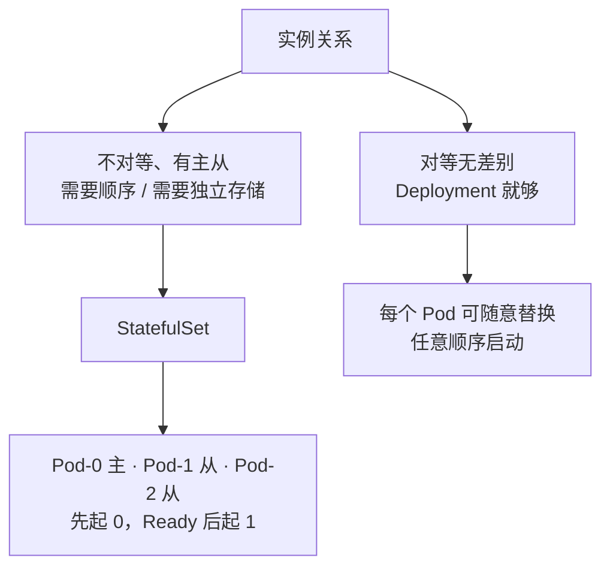
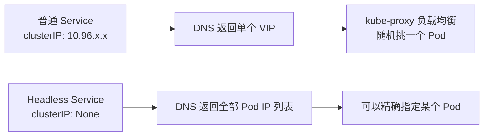
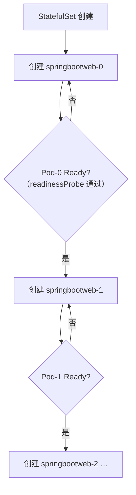
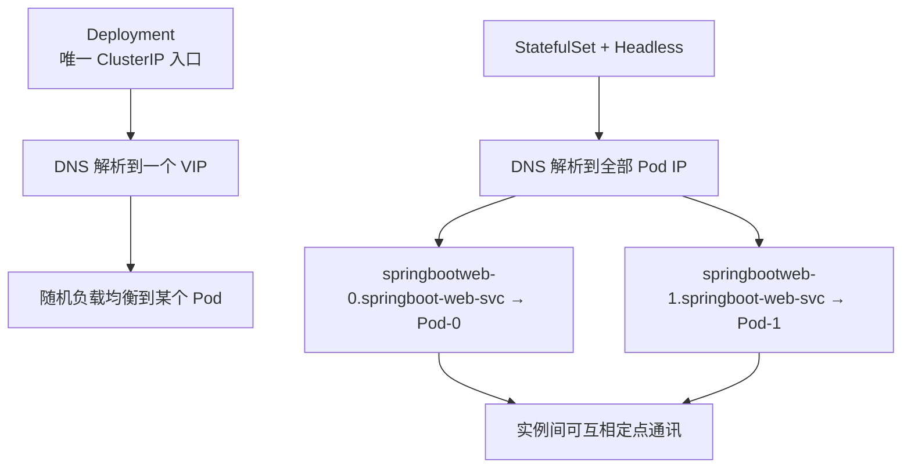
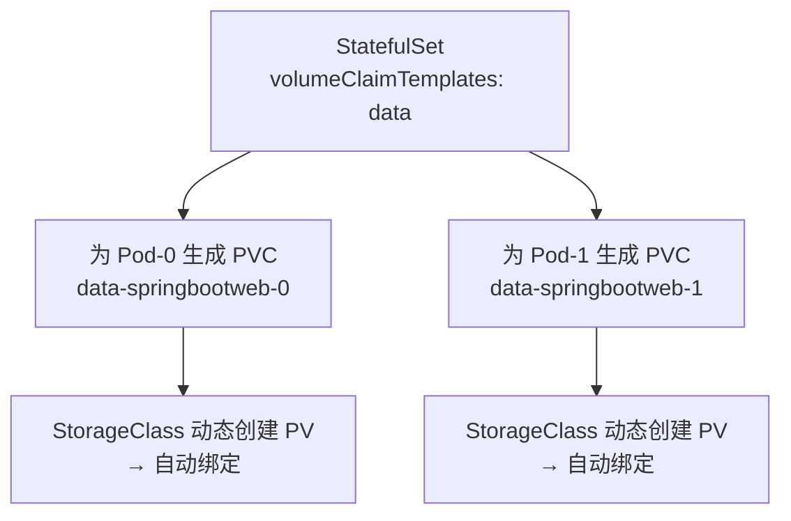
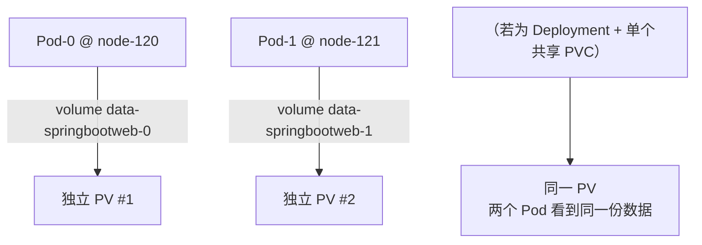
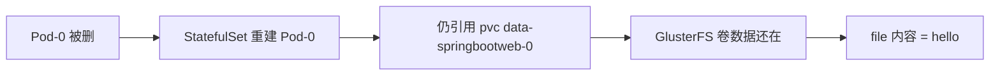
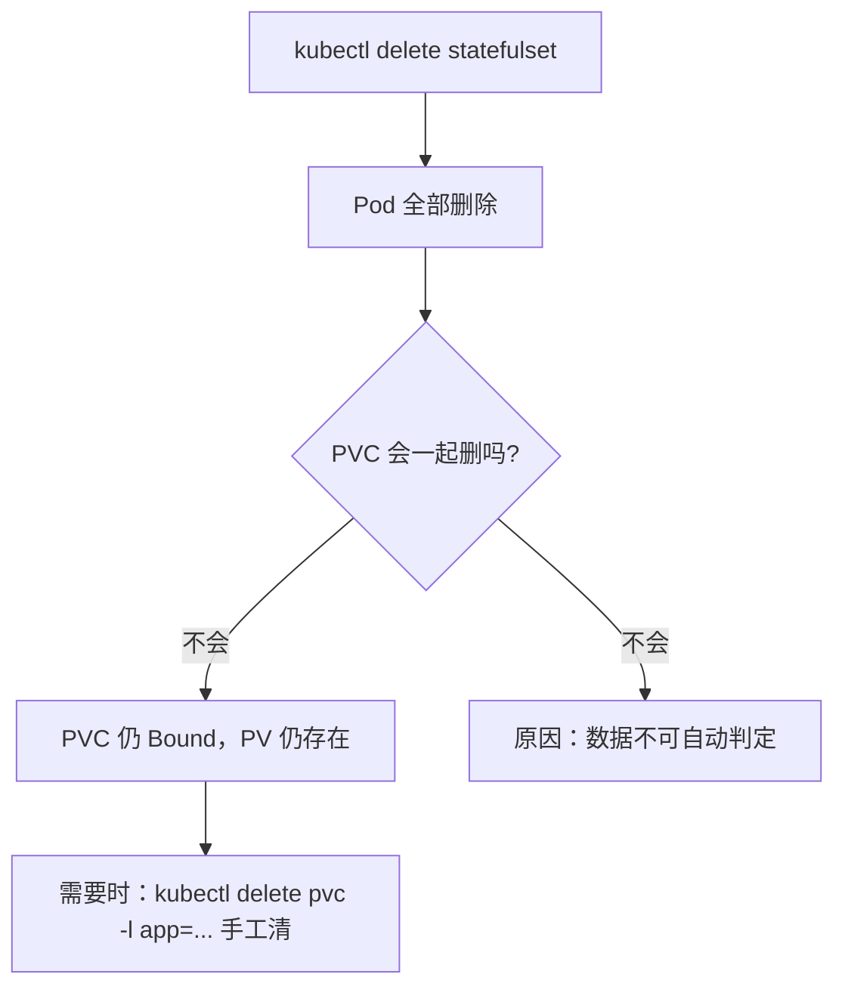
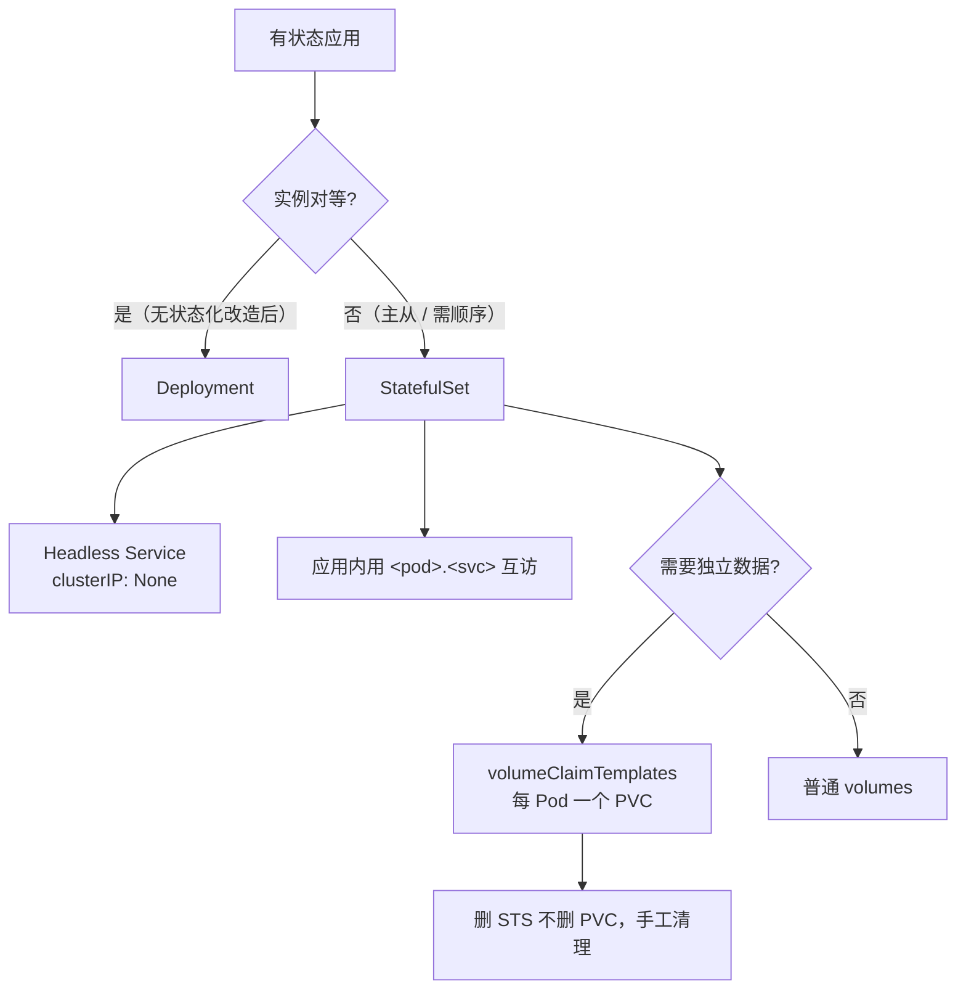

# Kubernetes 生产实践: StatefulSet 的有序启动与独立持久存储

之前用过的编排对象主要是 **Deployment**，我们开发的服务也都能顺利用 Deployment 管起来。但**Deployment 并不能胜任所有编排工作** —— 之前的服务有个共同特征：**都是无状态的**，每个 Pod 无差别，实例之间没有顺序性。

结论先给：**StatefulSet 解决两件事 —— ①多 Pod 的**顺序性与稳定 DNS**（靠 `Headless Service`，Pod 名固定为 `<sts名>-<序号>`，每个编号一条 DNS 记录）；②持久存储的**区分**（靠 `volumeClaimTemplates` 为每个 Pod 自动生成一个 PVC，各 Pod 有独立 volume，不共享）。**

## 纲要

- Deployment 管不了什么：无差别、无序
- 分布式应用的实例间关系
- StatefulSet 解决的两个问题
- Headless Service：`clusterIP: None`
- StatefulSet 定义：`serviceName` 字段
- 有序启动实测：`-0` ready 后才起 `-1`
- Pod 命名规则与 hostname
- 稳定 DNS：`<pod>.<svc>` 能 ping 通
- 删掉 Pod 之后：仍然从 0 开始
- `volumeClaimTemplates`：PVC 的模板
- 为每个 Pod 自动生成 PVC
- 实测：各写各的文件，不共享
- 杀掉 Pod 重建：数据还在
- 删掉 StatefulSet：PVC/PV 仍保留
- 与 Deployment 的差异对照

## 正文

实际场景里并不是所有应用都满足"无差别 + 无顺序"这个条件，**特别是分布式应用**。

**很多分布式应用的多个实例之间，往往会存在一种关系 —— 主从关系。** 常见的有：

- **MySQL 主从**
- **Redis Sentinel / 主从**
- **ZooKeeper 集群**
- **ETCD 集群**



对于这种**多实例不对等**的应用，Kubernetes 专门设计了一个编排对象叫 **StatefulSet**。

**根据实际应用情况，StatefulSet 抽象了两种有状态的场景，主要解决两个问题：**

1. **多个 Pod 之间的顺序性** —— 要按一定顺序启动，每个实例有自己的编号；实例之间会互相访问、互相通讯，靠顺序性这个特征解决；
2. **对持久存储的区分** —— 让 Pod 之间对同一目录**各自持有**，每个 Pod 可以有自己的数据。

> 第 2 点只对**共享存储**有意义。如果 Pod 本身没有共享存储需求，天然就是区分开的，不用管。
> 反过来说，Deployment 里配一个共享的 PVC，**多个 Pod 就共享同一个目录 —— 一个 Pod 写文件，所有 Pod 都能看到**，这正好是我们要避开的。

**所以不管是 MySQL 主从、Redis Sentinel、ZooKeeper 还是 ETCD 集群，本质上都是靠 StatefulSet 这两种特性实现的。**

下面针对这两个特性分别实测。

## Headless Service：`clusterIP: None`

先看一个 Service 定义 `headless-service.yaml`，跟常用 Service 的区别就在**这一行 `clusterIP: None`**：

```yaml
apiVersion: v1
kind: Service
metadata:
  name: springboot-web-svc
spec:
  clusterIP: None
  selector:
    app: springboot-web
  ports:
    - port: 80
      targetPort: 8080
```

前面讲过，**这是一个 Headless Service，它不会有一个 Service 的 VIP**。通过 DNS 名字访问它，**返回的是对应的 endpoint 的 IP 列表**。



## StatefulSet 定义：`serviceName` 字段

StatefulSet 跟 Deployment 区别不大，**主要就是多了一行 `serviceName`**：

```yaml
apiVersion: apps/v1
kind: StatefulSet
metadata:
  name: springboot-web
spec:
  serviceName: springboot-web-svc
  replicas: 2
  selector:
    matchLabels:
      app: springboot-web
  template:
    metadata:
      labels:
        app: springboot-web
    spec:
      containers:
        - name: springboot-web
          image: springboot-web:v1
          ports:
            - containerPort: 8080
          readinessProbe:
            httpGet:
              path: /health
              port: 8080
```

- **`serviceName` 这个字段的意思就是：告诉 StatefulSet 用哪个 Headless Service 去保证每个 Pod 的解析。**
- Service 的名字是 `springboot-web-svc`，回头看 `serviceName` 等于 `springboot-web-svc` —— **这两个要对起来。**
- `replicas` 配了 2，镜像 `springboot-web:v1`，下面端口、健康检查跟之前配置没区别。

```text
StatefulSet 定义要点
├── serviceName: springboot-web-svc   ← 关键：绑定 Headless Service
├── replicas: 2
├── selector.matchLabels
├── template（Pod 模板，与 Deployment 同构）
│   ├── metadata.labels
│   └── spec.containers
│       ├── image
│       └── readinessProbe
└── volumeClaimTemplates（第二组实验才用）
```

## 有序启动实测：`-0` ready 后才起 `-1`

先创建 Headless Service，再创建 StatefulSet：

```bash
kubectl apply -f headless-service.yaml
kubectl apply -f statefulset.yaml
```

```bash
kubectl get pod -l app=springboot-web
kubectl get pod -l app=springboot-web -w
```

当前只看到一个 Pod（`-0`），加 `-w` 监控：**第一个创建的 Pod 是 `springbootweb-0`，当它处于 Ready 状态之后，才会去创建 `springbootweb-1`**。

```text
$ kubectl get pod -l app=springboot-web -w
NAME               READY   STATUS    RESTARTS   AGE
springbootweb-0    0/1     Pending   0          0s
springbootweb-0    0/1     ContainerCreating   0s
springbootweb-0    1/1     Running   0          15s
springbootweb-0    1/1     Running   0          30s
springbootweb-1    0/1     Pending   0          31s      ← 0 Ready 之后才起 1
springbootweb-1    1/1     Running   0          46s
```



## Pod 命名规则与 hostname

**名字跟 Deployment 创建出来的差别很大 —— 它的名字是相对固定的。**

- **前一部分来自 StatefulSet 的名字**；
- **后一部分固定格式：一个中划线 + 一个编号，编号从 0 开始**。

比如有三个实例，就是 `-0`、`-1`、`-2`；**启动顺序是先启动 `-0`，起起来并通过健康检查后才创建 `-1`，依次类推。**

进到 `node-120` 上的 0 号容器看 `hostname`：

```bash
kubectl exec -it springbootweb-0 -- sh
hostname
# springbootweb-0        ← hostname 跟 Pod 名字是一样的
```

**对，`springbootweb-0` 跟 Pod 名完全一样**，另一个实例就是 `springbootweb-1`。

## 稳定 DNS：`<pod>.<svc>` 能 ping 通

```bash
ping springbootweb-0.springboot-web-svc
# PING springbootweb-0.springboot-web-svc (172.17.3.12): 56 data bytes
```

DNS 名字的规则：**`Pod名` 后面跟一个 `Service名`**：

```text
<pod-name>.<service-name>.<namespace>.svc.cluster.local
```

- **`springbootweb-0` + `springboot-web-svc`**，后面跟的是 namespace：
- `default` 命名空间下**不用加也可以**，所以直接写 `springbootweb-0.springboot-web-svc` 就行。

> DNS 搜索域的规则可以参考 `cat /etc/resolv.conf` 里 `search` 那几行。**在 default 命名空间下，只需要写 `Pod名.Service名` 就够了。**

同理 1 号 Pod 也能这样访问。**在另一台机器上去访问也是没问题的 —— 它们都能互相通过这个名字访问到具体的某一个 Pod。**

**这跟之前 Deployment 时完全不同：** 之前是**一个唯一入口做负载均衡，随机访问到其中某个 Pod**；这里**可以通过编号精确指定其中某一个 Pod** —— 这就是顺序性带来的能力。



## 删掉 Pod 之后：仍然从 0 开始

```bash
kubectl delete pod springbootweb-0
kubectl get pod -l app=springboot-web -w
# 还是从 0 开始创建，不会因为删掉了就同时一起起来
```

**它启动的过程始终保证顺序性** —— `-0` 变成 Ready 的时候才会开始启动 `-1`，编号和之前一样，一个 `-0` 一个 `-1`，访问方式也一样。

**所以可以在任何地方通过"名字 + 编号"访问到具体的某一个实例，包括实例之间自己的通讯都可以使用这种方式。**

| 能力 | Deployment | StatefulSet |
| --- | --- | --- |
| Pod 名字 | 随机后缀（`web-7d9f8b-x2k4p`） | **固定编号**（`springbootweb-0`） |
| hostname | 随机 | **等于 Pod 名** |
| 启动顺序 | 并发、无序 | **0 → 1 → 2 串行，等 Ready** |
| 定点访问 | 做不到（只有入口 VIP） | **`<pod>.<svc>` 精确到实例** |
| 缩容时 | 随机删 | **从最大序号开始倒序删** |

## `volumeClaimTemplates`：PVC 的模板

下面验证**持久存储的区分**。**先删掉之前的 StatefulSet。**

> 前提：要有共享存储（上一节的实验环境）—— 有底层的存储服务，有 StorageClass 可以动态创建 PV。

看 `statefulset-volume.yaml`，跟刚才的 StatefulSet 基本一样：上面这部分一模一样（`serviceName` 还是 `springboot-web-svc`，副本数 2，容器定义、健康检查都一样），最下边有一个 `volumeMount`，名字叫 `data`，对应容器目录根目录的 `/mock/data`。

**唯一的区别在 volume 定义这块：**

```yaml
apiVersion: apps/v1
kind: StatefulSet
metadata:
  name: springboot-web
spec:
  serviceName: springboot-web-svc
  replicas: 2
  selector:
    matchLabels:
      app: springboot-web
  template:
    metadata:
      labels:
        app: springboot-web
    spec:
      containers:
        - name: springboot-web
          image: springboot-web:v1
          volumeMounts:
            - name: data
              mountPath: /mock/data
  volumeClaimTemplates:
    - metadata:
        name: data
      spec:
        accessModes:
          - ReadWriteOnce
        storageClassName: glusterfs
        resources:
          requests:
            storage: 1Gi
```

下边这块的定义是 **`volumeClaimTemplates`** —— **从名字就知道它也是一个模板，跟我们常用的 `podTemplate` 有几分相似：**

- **`podTemplate` 是创建 Pod 的模板**；
- **`volumeClaimTemplates` 是创建 PVC 的模板**。

**为什么这里不直接指定一个 PVC 呢？** 像上一节那样先创建一个 PVC 再在这里指定一下，**那不就变成共享了** —— 不符合我们现在的需求。

看它的具体定义：有个名字叫 `data`，下面跟我们之前定义的 PVC 非常相似 —— `accessMode` 读写权限，指定一个 `storageClassName`，再指定 `requests` 的存储大小。

**可见它的功能就是自动地创建多个 PVC，是一个 PVC 的模板。**



## 为每个 Pod 自动生成 PVC

```bash
kubectl delete -f statefulset.yaml
kubectl apply -f statefulset-volume.yaml
kubectl get pvc
```

**第一个 PVC 正处于 Pending 状态**，稍等一会儿再看：

```text
$ kubectl get pvc
NAME                          STATUS   VOLUME                                     CAPACITY
data-springbootweb-0          Bound    pvc-3a1f9c2e-...                           1Gi
data-springbootweb-1          Bound    pvc-7d5b0e81-...                           1Gi
```

**已经有两个 PVC 了，它们的名字分别是 `data-` 后面跟具体的 Pod 名字（带编号的 Pod 名），状态也都是 Bound —— 自动地根据 StorageClass 创建出了 PV。**

再看 PV，`kubectl get pv`，**没错，有两个 PV**。

> 上一节只是 PV 通过 StorageClass 自动创建的；**这里 PVC 也是自动创建的，是根据 `volumeClaimTemplates` 自动创建出来的。**

```text
default 命名空间
├── sts springboot-web
│   ├── pod springbootweb-0  → 挂载 pvc data-springbootweb-0 → pv pvc-3a1f... (1Gi)
│   └── pod springbootweb-1  → 挂载 pvc data-springbootweb-1 → pv pvc-7d5b... (1Gi)
```

## 实测：各写各的文件，不共享

Pod 一个跑在 `node-120`、一个跑在 `node-121`。

在 `springbootweb-0` 容器里写文件：

```bash
kubectl exec -it springbootweb-0 -- sh
echo hello > /mock/data/file
ls /mock/data
# file
```

再去 `node-121` 上看 —— 那个实例对应的编号是 `web-0`（即 `-1` 号 Pod），写另一个文件：

```bash
kubectl exec -it springbootweb-1 -- sh
echo hi > /mock/data/file
```

退出来看：

```text
$ kubectl exec springbootweb-1 -- cat /mock/data/file
hello        ← 是 0 号写的 hello，不是自己的 hi
```

**两个实例的文件并没有共享，每个人都访问的是自己的一个文件的空间。**



## 杀掉 Pod 重建：数据还在

```bash
kubectl delete pod -l app=springboot-web
kubectl get pod -l app=springboot-web -w
# springbootweb-0 正在创建，还没就绪；等 -0 通过健康检查
# 再等 -1，也正常了
```

等两个都 Ready 再看：

```bash
kubectl exec springbootweb-1 -- cat /mock/data/file
# hello     ← 内容还在
kubectl exec springbootweb-0 -- cat /mock/data/file
# hi        ← 另一份也还在
```

**说明持久化存储确实已经具体地绑定到了某一个编号的 Pod 上，并且让每个 Pod 都具备了不同的磁盘空间。**



## 删掉 StatefulSet：PVC/PV 仍保留

```bash
kubectl delete -f statefulset.yaml
kubectl get pod -l app=springboot-web
# （空，Pod 已经不在了）
kubectl get pvc
# data-springbootweb-0   Bound
# data-springbootweb-1   Bound
kubectl get pv
# 两个 PV 都还在
```

**就算 StatefulSet 都删掉了，它的 PVC 还是会持久存在。**

**为了安全起见，它不会帮我们自动地清除 PVC —— 只会自动帮我们生成 PVC，而不会自动帮我们清除掉。如果确实不需要了，可以手动清掉。**



## 与 Deployment 的差异对照

```text
                    Deployment                    StatefulSet
Pod 名字             web-7d9f8b-x2k4p（随机）        springbootweb-0（固定编号）
hostname             = Pod 名（随机后缀）            = Pod 名（含编号）
启动顺序             并发、无序                      0 → 1 → 2，等 Ready 再起下一个
访问方式             唯一入口 + 负载均衡              <pod>.<svc> 定点解析
缩容                 随机删除                        从最大序号倒序删
存储                 单个 PVC（全 Pod 共享）          volumeClaimTemplates（每 Pod 独立）
删 StatefulSet       Pod/PVC 一并消失（PVC 看策略）  Pod 消失，PVC/PV 保留
适用                 无状态前端                       MySQL/Redis/ZK/ETCD 主从
```

## 落地提醒

上面例子用的都是 `springboot-web` 服务，**显然不够真实** —— 为了把 StatefulSet 的机制讲清楚，这里刻意简化了业务场景。

**真实业务场景往往更复杂：一般情况下既会用到顺序性，也会用到持久存储。** 落地时按这三步走：

1. **先想清楚实例间是不是对等的** —— 对等就用 Deployment，别硬上 StatefulSet（白管一套编号和有序启动）；
2. **主从/集群类应用，先配一个 `clusterIP: None` 的 Headless Service，再把 `serviceName` 指过去**；
3. **需要每 Pod 独立数据的，用 `volumeClaimTemplates` 而不是外部单个 PVC**。



## API 速览

| 能力 | API / 配置 |
| --- | --- |
| Headless Service | `spec: { clusterIP: None }` |
| StatefulSet 绑定 Service | `spec.serviceName: <svc>`（**必须和 headless service 名一致**） |
| 固定 Pod 名 | `<sts-name>-<序号>`（**序号从 0 开始**） |
| 有序启动 | **Pod N Ready 后才创建 N+1**（由 `readinessProbe` 保证） |
| Pod 内 hostname | **等于 Pod 名** |
| 稳定 DNS | `<pod-name>.<service-name>`（default 命名空间下可省略 ns） |
| 定点访问实例 | `ping springbootweb-0.springboot-web-svc` |
| 每 Pod 独立存储 | `spec.volumeClaimTemplates[]`（**PVC 模板**） |
| 模板里的 PVC 字段 | `accessModes` / `storageClassName` / `resources.requests.storage` |
| 挂载 | `volumeMounts[].name` 要与模板 `metadata.name` 对应 |
| 查看自动 PVC | `kubectl get pvc`（名字形如 `data-springbootweb-0`） |
| 验证数据存活 | 删 Pod 重建后再 `cat` 一次 |
| 清理残留存储 | `kubectl delete pvc` 手工删（STS 删除不会带走 PVC） |

## Demo 示例

```bash
#!/usr/bin/env bash
set -euo pipefail

# 1. Headless Service（必须先建，STS 的 serviceName 要指向它）
kubectl apply -f headless-service.yaml

# 2. StatefulSet（有序启动版）
kubectl apply -f statefulset.yaml
kubectl get pod -l app=springboot-web -w &
watch_pid=$!
sleep 20
kill $watch_pid

# 3. 验证 DNS 定点解析
kubectl exec -it springbootweb-0 -- ping -c 1 springbootweb-1.springboot-web-svc
kubectl exec -it springbootweb-1 -- ping -c 1 springbootweb-0.springboot-web-svc

# 4. 删一个 Pod，看它是否仍按 0 → 1 顺序重建
kubectl delete pod springbootweb-0
kubectl get pod -l app=springboot-web -w --timeout=120s
```

**存储区分版：**

```bash
# 先清掉上一组，避免 PVC 混在一起
kubectl delete -f statefulset.yaml

# 带 volumeClaimTemplates 的 StatefulSet
kubectl apply -f statefulset-volume.yaml
kubectl get pvc -w          # 先 Pending，随后逐个 Bound
kubectl get pv              # 两个自动生成的 PV

# 各自写各自的文件
kubectl exec -it springbootweb-0 -- sh -c 'echo hello > /mock/data/file'
kubectl exec -it springbootweb-1 -- sh -c 'echo hi > /mock/data/file'

# 验证：读到的是对方写的（因为各自挂载各自的卷）
kubectl exec springbootweb-0 -- cat /mock/data/file   # hi
kubectl exec springbootweb-1 -- cat /mock/data/file   # hello

# 杀掉两个 Pod，等重建，数据还在
kubectl delete pod -l app=springboot-web
kubectl wait --for=condition=ready pod -l app=springboot-web --timeout=300s
kubectl exec springbootweb-0 -- cat /mock/data/file   # hi

# 删掉 StatefulSet，PVC/PV 仍保留（不会自动清）
kubectl delete -f statefulset-volume.yaml
kubectl get pvc                                       # 还在
kubectl get pv                                        # 还在
```

### 总结

- **Deployment 无差别、无序，只对等无状态服务；主从类（MySQL / Redis / ZK / ETCD）必须用 StatefulSet**，它抽象了两种有状态场景：顺序性 + 持久存储的区分。
- **顺序性靠 `Headless Service`（`clusterIP: None`）+ `spec.serviceName`**：Pod 名固定为 `<sts名>-<0,1,2…>`，**hostname 等于 Pod 名**；**Pod N 通过 readinessProbe Ready 之后才创建 N+1**，删掉 Pod 重建也仍然从 0 开始串行。
- **稳定 DNS 是实例间通讯的关键**：`<pod-name>.<service-name>`（default 命名空间下可省略命名空间）能解析到指定 Pod 的 IP，**实例之间可以定点互访**，而不是像 Deployment 那样只能从一个 VIP 随机负载进去。
- **`volumeClaimTemplates` 是 PVC 的模板（对应 `podTemplate` 是 Pod 的模板）**：为每个编号 Pod 自动生成一个 PVC（名字形如 `data-springbootweb-0`）并由 StorageClass 自动拉出 PV 绑定，**各 Pod 卷独立、不共享**；删 Pod 重建后数据仍在。
- **删掉 StatefulSet，Pod 消失但 PVC / PV 依然保留** —— StatefulSet 只负责生成 PVC，不负责清除；**为了安全起见数据不能自动删，确定不用了要手工 `kubectl delete pvc`**。

