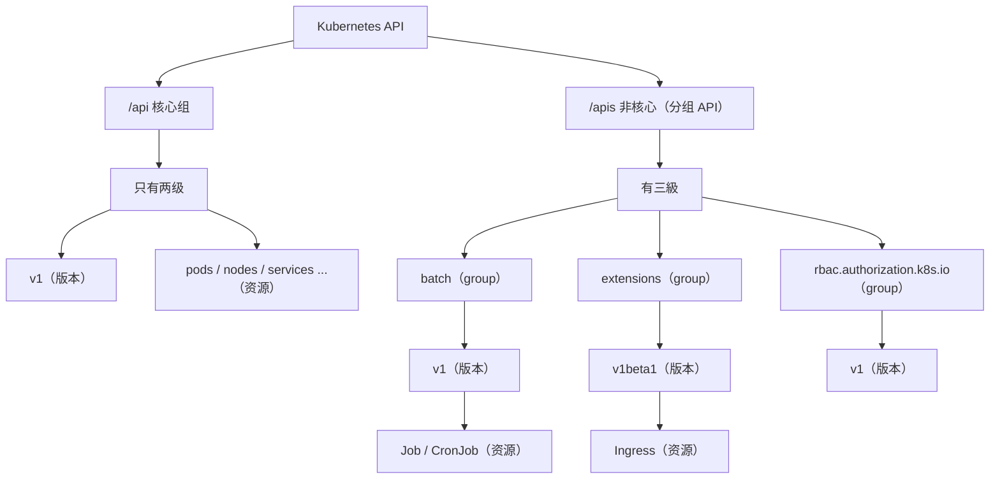
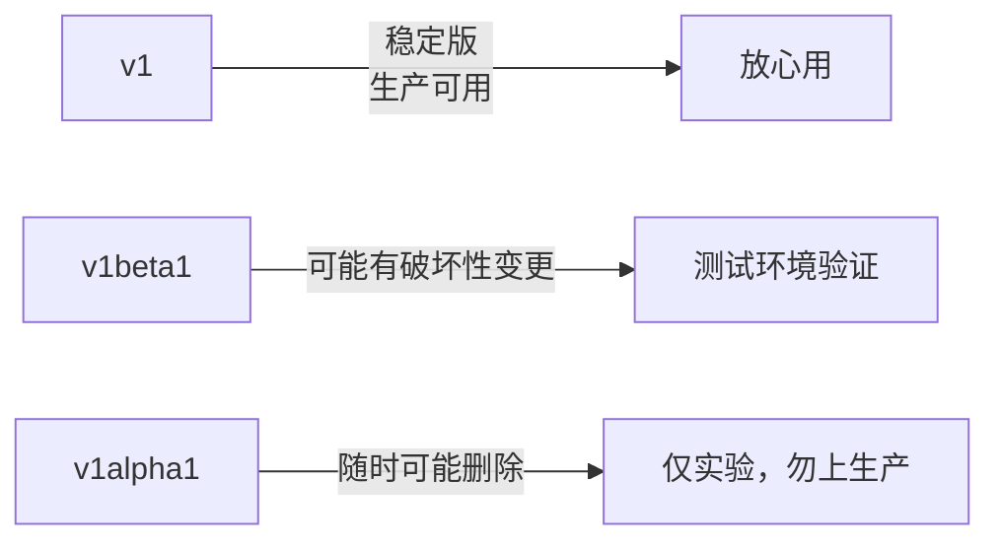
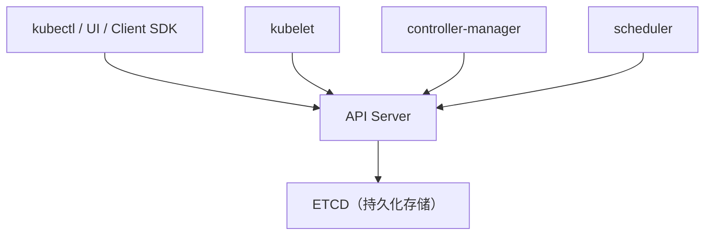
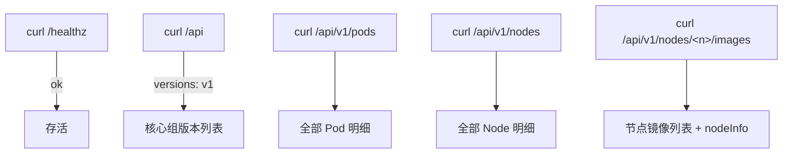
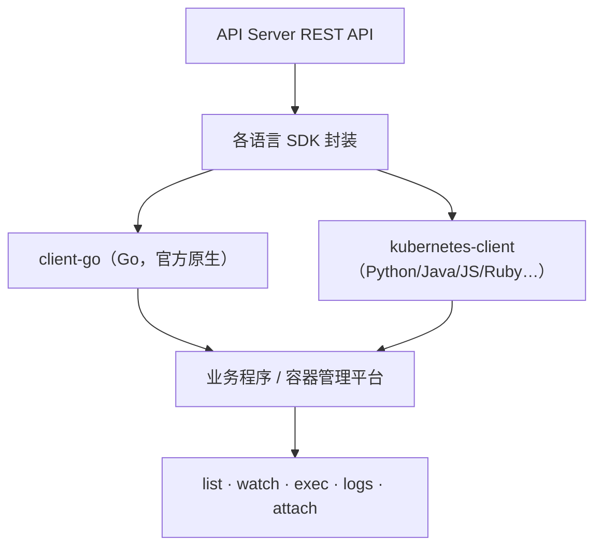
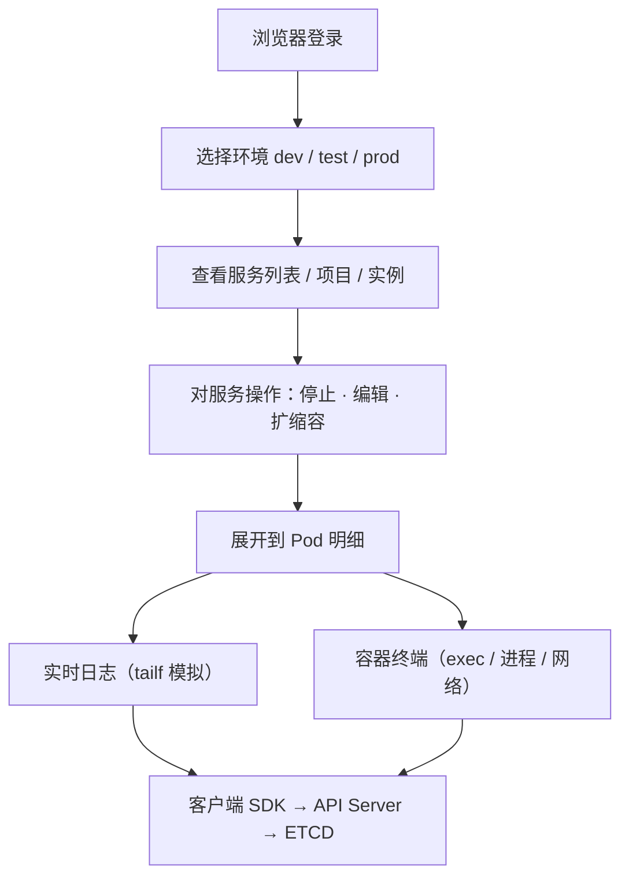

# Kubernetes 生产实践: Kubernetes API 的分组/版本设计与 REST 接口实战

这一节聊我们一直在用、却一直被忽略的 **API**：Kubernetes 的 API 设计、使用方式，以及如何用 API 做一个基于 Kubernetes 的容器管理平台。

结论先给：**API 分「核心组」和「分组 API」两层，核心组 `/api/v1` 只有版本和资源两级，分组 API `/apis/<group>/<version>/<resource>` 多一级 group；版本带 `alpha` 是实验版、`v1` 是稳定版。API Server 暴露的是标准 HTTPS-ish 的 RESTful 接口（`POST`/`PATCH`/`PUT`/`DELETE`），但直接和它打交道成本高，实际开发用 `client-go`（Go）或 `kubernetes-client`（其他语言）这类封装过的客户端。**

## 纲要

- `apiVersion` 都有哪几种写法
- API 设计：核心组 vs 分组
- 分组的好处：来路清晰
- 版本的好处：可靠性可见 + 先后兼容
- 怎么写对 `apiVersion`？查官方 API Reference
- 谁负责 API：API Server
- 开启 8080 不安全端口体验 REST
- 读接口实测：`/healthz` `/api` `/pods` `/nodes` `/images`
- 写操作：create / patch / replace / delete
- 直接用 REST 的代价
- 客户端库：client-go 与多语言 SDK
- 一个容器管理平台的示例设计

## 正文

先回想一下：前面所有 yaml 配置文件，是不是每个都有一个字段叫 `apiVersion`？

到 master 节点上 `grep -r apiVersion` 看一下：

```bash
grep -r apiVersion .
# apiVersion: v1
# apiVersion: extensions/v1beta1
# apiVersion: apps/v1
# apiVersion: storage.k8s.io/v1
# apiVersion: rbac.authorization.k8s.io/v1
```

有好多种 `apiVersion`，大部分是 `v1`、以 `extensions` 开头、以 `apps` 开头，还有 `storage.k8s.io` 开头的（StorageClass），以及授权的 `rbac.authorization.k8s.io`。

**乍一看很乱，但它确实有规则可循 —— 这就是 Kubernetes 的 API 设计。**

## API 设计：核心组 vs 分组

看这张图，主要看两部分：**`API`** 和 **`APIs`**。



- **`/api` 下目前只有一个 `v1`，再下一级是 `pods`、`nodes` 这些非常核心的资源。所以 `/api` 里没有分组，默认就是核心组，只有两级：一级是版本，一级是具体资源。**
- **`/apis` 是非核心 API，每个资源用三级表示**：
  1. **第一级叫 group（分组）**，比如 `batch`、`extensions`；
  2. **第二级才是版本**，像 `v1`、`v2`、`alpha`；
  3. **第三级是具体资源**。

| 分组 group | 主要处理什么 |
| --- | --- |
| `batch` | **离线业务**（Job / CronJob） |
| `extensions` | **扩展资源**（如 Ingress） |
| `rbac.authorization.k8s.io` | 授权（Role / ClusterRole / Binding） |
| `storage.k8s.io` | 存储（StorageClass / CSIDriver 等） |
| `apps` | 应用编排（Deployment / StatefulSet / DaemonSet） |

### 分组的好处

- **让大家很容易了解这个 API 的来路**；
- **资源的组织结构更加清晰**。

### 版本的好处

1. **看一眼就知道当前 API 的可靠性** —— 比如 `v1` 我们知道是稳定版本、非常可靠；**带一个 `alpha` 的明显不是稳定版**；
2. **可以让 Kubernetes 放心升级** —— 升级时用版本区分做到**先后兼容**，不用担心对现有用户造成影响。



## 怎么写对 `apiVersion`？查官方 API Reference

**"API 版本管理这么复杂，我写 yaml 时怎么确认该用哪个版本？"**

到 Kubernetes 官网 → Documentation → 最左边的 **Understand the Basic** → 里面有一个 **The Kubernetes API**，点进去看第二个 **API endpoint / resource types and samples**（即在 **API Reference** 里）找对应版本号。

比如当前用 1.14，在 API overview 里可以看到：

> "欢迎来到 Kubernetes API，可以用 Kubernetes API 读写 Kubernetes 的资源对象" —— 通过 Kubernetes 的 endpoint。

左边有快捷链接，**看 Deployment `v1` 时要看它 group 是 `apps`、version 是 `v1`、类型是 `Deployment`**，于是：

```yaml
apiVersion: apps/v1
kind: Deployment
```

**这样就把当前这个资源对象唯一锁定了。**

除了基础的资源定义之外，还会有 Deployment 对象的所有字段：

- 大字段：`apiVersion`、`kind`、`metadata`、`spec`、`status`；
- `spec` 下面还有 `selector`、`strategy`、`template`。

**通过这个文档就能看出，我们写的配置文件结构跟它是一一对应的。所以配置不知道怎么配时，去这个文档查，就能写出满足需求的配置。**

再看一个 Pod：

```yaml
apiVersion: v1
kind: Pod
```

**Pod 的 group 是核心（`core`），默认就是核心 API，所以 `apiVersion` 里只写 `v1` 就够了。**

| 资源 | `apiVersion` | 说明 |
| --- | --- | --- |
| Pod / Service / Node / ConfigMap / Secret | `v1` | **核心组，无 group** |
| Deployment / StatefulSet / DaemonSet / ReplicaSet | `apps/v1` | 分组 `apps` |
| Job / CronJob | `batch/v1` | 分组 `batch` |
| Ingress | `extensions/v1beta1`（旧） / `networking.k8s.io/v1` | 分组 `extensions` / `networking.k8s.io` |
| StorageClass | `storage.k8s.io/v1` | 分组 `storage.k8s.io` |
| Role / ClusterRole / Binding | `rbac.authorization.k8s.io/v1` | 分组 `rbac.authorization.k8s.io` |

## 谁负责 API：API Server

**API Server 是集群的一个交通枢纽** —— 各种资源数据都通过 API Server 提交到后端持久化存储 **ETCD**；Kubernetes 集群的各个组件之间，也是通过 API Server 的接口实现解耦，**包括我们的客户端 kubectl**，它对集群操作时也都是通过 API Server 完成的。



### 对外访问方式

就是最常见的、最通用一种：**基于 HTTPS 的 REST API**。

先开启 8080 端口体验一下（默认关闭）：

```bash
vim /etc/kubernetes/manifests/kube-apiserver.yaml
# 把 insecure-port 改成 8080 并开启
#     - --insecure-port=8080
systemctl daemon-reload
systemctl restart kube-apiserver   # 或 systemctl start kube-apiserver
ss -lnt | grep 8080
```

> 生产环境**不要开 insecure-port**，这里是学习环境为了方便 curl。

## 读接口实测

```bash
curl localhost:8080/healthz
# ok                       ← 检查 API Server 健康状态的 API

curl localhost:8080/api
# {"kind":"APIVersions","versions":["v1"],...}

curl localhost:8080/api/v1/pods
# 返回集群中运行的所有 Pod 的详细信息（很长，不逐条看）

curl localhost:8080/api/v1/nodes
# 所有 Node 的详细信息

curl localhost:8080/api/v1/nodes/node-120/images
# 节点上的镜像列表；下面是 nodeInfo（系统各种详细信息：
# IP、hostname、Pressure: DiskPressure / MemoryPressure 等节点状态）
```

**通过 API Server 的 RESTful API 可以很容易掌握当前集群的信息。**



## 写操作：create / patch / replace / delete

**上面只是凭记忆随便写了几个地址，怎么知道所有 API 的详细用法？** 还是回到那个文档。

点开一个 Pod，下面会有子链接和写操作：

**create pod** —— 创建一个 Pod 的 REST 地址：

```text
POST /api/v1/namespaces/<namespace>
```

- `pretty`：输出是不是 pretty 的；
- `dryRun`：是不是一个测试的运行，**不会真正去创建**；
- 主要部分是 **body parameters** —— body 就是一个 Pod 的 JSON 定义。

**所以流程是：准备一个 Pod 的 json 定义，以 body 的形式 POST 到这个 API 路径里，就完成了一个 Pod 的创建。**

后面的写操作：

| 操作 | HTTP 方法 | 路径 | body |
| --- | --- | --- | --- |
| 创建 | `POST` | `/api/v1/namespaces/<ns>` | Pod 对象 |
| **部分更新** | `PATCH` | `/api/v1/namespaces/<ns>/pods/<name>` | patch 对象 |
| 替换 | `PUT` | 同 PATCH 路径 | Pod 对象 |
| 删除 | `DELETE` | `/api/v1/namespaces/<ns>/pods/<name>` | — |

- **`patch` 是部分的去更新指定的 Pod** —— **只更新某一个或某几个字段**，比如更新 image、更新 CPU/内存，都可以通过 patch 来更新；
- **`replace` 是替换**指定的 Pod，用的 HTTP 方法 PUT，路径跟 patch 一样；
- **`post` 传的参数跟 create 一样，也是一个 Pod 对象**（因为是替换）；
- **`delete` 对应的就是 DELETE 方法**，路径跟之前一样。

**确实是有 RESTful 的风格 —— 用不同的操作方式区分了不同的操作。**

除了 Pod 之外，所有资源对象都有类似的这些方法，不一一说了。

## 直接用 REST 的代价

**通过这个文档也看出来了，有很多请求都需要传 json 对象。**

如果直接写程序跟这个 REST API 打交道：

- **当然可以做到完全控制集群**；
- **但复杂度非常高** —— 每个对象都非常复杂，**对象里要包含的对象、要包含的 list、又包含对象**，嵌套结构非常多；
- **集群升级时，还要去单独维护跟集群交互的客户端，代价非常大**。

而且虽然 `kubectl` 这个命令几乎可以完成所有想做的功能，**但手动敲命令控制集群也不是长久之计**。Kubernetes 当然考虑到了，所以**提供了多种语言环境的客户端 API**。

## 客户端库：client-go 与多语言 SDK

到 GitHub 上搜项目名 **kubernetes-client**，下面有很多项目：Ruby、Python、Java、Go、JS —— 非常多种语言的客户端 API。

**这里面比较常用的是 Python 客户端和 Java 客户端**（从 star 也能看出来这两个比较受欢迎）；**还有一种使用更广泛的在官方 Kubernetes 项目里自带 —— 原生 Go 客户端 `client-go`**。

> **如果用 Go 开发，选 `client-go` 就对了；如果用其他语言，看 `kubernetes-client` 这个项目。**

这些客户端功能大同小异，**主要都是对 API Server 的 REST API 做了再一层的封装，对外提供对应语言的 SDK**，目的就是让我们更容易接入 Kubernetes API。

以 Java 客户端为例：

```text
pom.xml
└── <dependency>
      <groupId>io.kubernetes</groupId>
      <artifactId>client</artifactId>
      <version>12.0.1</version>
    </dependency>
```

- Maven 用户直接加一个 dependency 就行，**用法非常简单**；
- 它也会有一些例子：**list pod（列出所有 Pod）、watch（监听一个对象变化）**；
- **兼容的版本大家一定要事先看好，是不是兼容你的服务器对应版本**（集群 1.14 就得挑兼容 1.14 的客户端版本）；
- 它上面还有一个 `examples` 文件夹，**里面有很多例子，开发前可以先过一遍** —— 相对容器的 attach、exec、logs、watch、websocket 这些功能，**开发中可能会用到，可以参考样例开发**。



## 一个容器管理平台的示例设计

理解了 API、也知道客户端怎么用了，就可以开始做自己的容器管理平台了。

**每个公司需求不同，做出来的功能肯定各不相同** —— 不会像商业级的 Rancher 那么复杂，当然也没 Rancher 那么通用（Rancher 做的是产品，要满足绝大多数公司需求，功能和使用上比较复杂）。**具体到每个公司，只需要按自己的需求开发。**

这里给一个 demo，主要是从**系统设计层面抛砖引玉**。访问本地 8080，先是一个登录界面：

登录进去，从上往下说：

```text
容器管理平台
├── 顶部模块
│   ├── 服务列表
│   ├── 主机信息
│   ├── 配置模板
│   ├── 常用环境变量
│   └── 权限管理
│       ├── 用户管理
│       └── 用户 / 角色（角色下对应某些服务、某些操作）
├── 部署服务
│   └── 三个环境：dev / test / prod（跑在同一集群上，可切换）
│       └── 每个环境下：所有服务 / 不健康 / 健康 / 已停止
├── 数据列表（两级）
│   ├── 第一级：项目（含运行实例数、当前实例状态）
│   └── 第二级：具体服务（如 dubbo 服务、web 服务）
└── 操作区
    ├── 停止 · 编辑 · 扩缩容
    └── 服务详情：镜像 / 实例 / CPU 内存 / 磁盘挂载 / 环境变量 /
        label / 健康检查 / 调度策略（亲和性 · 反亲和性）
        └── 下方：Pod 明细（是否 Ready、健康检查、Pod 名、
                          所在节点、节点 IP、Pod IP）
```

几个设计要点：

- **可以面向对 Kubernetes、Docker 都不是特别了解的同学使用** —— 开发同学、测试同学都能顺利把业务建上去并方便维护；
- **可以通过浏览器直接看某一个 Docker/Pod 的日志**，看**实时日志**，还可以**模拟 tailf** 看日志实时变化；
- **日志不够用的话，可以登录到容器里** —— 登录后能看到当前容器的环境、查看进程、查看网络等常用命令都预装好了，**让开发人员像使用虚拟机一样管理容器**。



```text
技术落点

  前端（登录 / 环境切换 / 服务树 / 日志 / WebShell）
        ↓ HTTPS
  后端业务（权限 · 用户 · 角色 · 模板 · 环境变量）
        ↓ client-go / kubernetes-client
  Kubernetes API Server
        ↓
  ETCD + 各控制器 + kubelet
```

## API 速览

| 能力 | API / 配置 |
| --- | --- |
| 核心组资源 | `apiVersion: v1`（Pod / Service / Node / ConfigMap / Secret） |
| 应用编排资源 | `apiVersion: apps/v1`（Deployment / StatefulSet / DaemonSet） |
| 离线任务 | `apiVersion: batch/v1`（Job / CronJob） |
| 入口网关 | `apiVersion: networking.k8s.io/v1`（旧：`extensions/v1beta1`） |
| 存储类 | `apiVersion: storage.k8s.io/v1`（StorageClass） |
| 授权 | `apiVersion: rbac.authorization.k8s.io/v1`（Role / ClusterRole） |
| 健康检查 | `curl localhost:8080/healthz` → `ok` |
| 列出核心资源 | `GET /api/v1/pods` / `/api/v1/nodes` |
| 节点镜像 | `GET /api/v1/nodes/<node>/images` |
| 创建 | `POST /api/v1/namespaces/<ns>` (body: Pod json) |
| 部分更新 | `PATCH /api/v1/namespaces/<ns>/pods/<name>` |
| 替换 | `PUT /api/v1/namespaces/<ns>/pods/<name>` |
| 删除 | `DELETE /api/v1/namespaces/<ns>/pods/<name>` |
| 干跑测试 | body 参数 `dryRun` |
| Go 客户端 | `k8s.io/client-go`（官方原生） |
| 多语言客户端 | GitHub 项目 **kubernetes-client**（Python / Java / JS / Ruby） |
| Java 依赖 | `io.kubernetes:client` |

## Demo 示例

**(1) 用 curl 把 REST API 走一遍（读 + 写）**

```bash
# 读
curl -s localhost:8080/healthz; echo
curl -s localhost:8080/api
curl -s localhost:8080/api/v1/nodes | head -40
curl -s localhost:8080/api/v1/nodes/node-120/images | head -20

# 创建：准备一个 Pod 的 JSON，POST 到 namespaces 路径
cat <<'EOF' > pod.json
{
  "apiVersion": "v1",
  "kind": "Pod",
  "metadata": { "name": "rest-test" },
  "spec": {
    "containers": [{
      "name": "nginx",
      "image": "nginx:1.25",
      "ports": [{ "containerPort": 80 }]
    }]
  }
}
EOF
curl -s -X POST -H 'Content-Type: application/json' \
     -d @pod.json \
     localhost:8080/api/v1/namespaces/default
# 创建后确认
kubectl get pod rest-test

# 部分更新（改镜像）
curl -s -X PATCH -H 'Content-Type: application/merge-patch+json' \
     -d '{"spec":{"containers":[{"name":"nginx","image":"nginx:1.26"}]}}' \
     localhost:8080/api/v1/namespaces/default/pods/rest-test

# 删除
curl -s -X DELETE localhost:8080/api/v1/namespaces/default/pods/rest-test
```

**(2) 用 Go 直接调 API Server（只依赖标准库，可直接跑）**

生产里一般走 `client-go`（用 ServiceAccount 的 token + 6443），这里为了能独立编译运行，用标准库演示同样的「读 Pod + 部分更新」流程：

```bash
# 取一个能访问 API Server 的 token（学习环境可用 insecure 8080 简化）
TOKEN=$(cat /var/run/secrets/kubernetes.io/serviceaccount/token 2>/dev/null || echo "")
APISERVER=${APISERVER:-http://localhost:8080}
```

```go
package main

import (
	"bytes"
	"encoding/json"
	"fmt"
	"io"
	"net/http"
	"os"
)

// ApiClient 最小化的 Kubernetes REST 客户端：只封装 GET / PATCH，
// 与 client-go 的语义一致（client-go 做的也是这层封装）。
type ApiClient struct {
	BaseURL string
	Token   string
	client  *http.Client
}

func NewApiClient(base, token string) *ApiClient {
	return &ApiClient{BaseURL: base, Token: token, client: http.DefaultClient}
}

func (c *ApiClient) do(method, path string, body interface{}) ([]byte, error) {
	var r io.Reader
	if body != nil {
		bs, err := json.Marshal(body)
		if err != nil {
			return nil, err
		}
		r = bytes.NewReader(bs)
	}
	req, err := http.NewRequest(method, c.BaseURL+path, r)
	if err != nil {
		return nil, err
	}
	req.Header.Set("Accept", "application/json")
	if body != nil {
		req.Header.Set("Content-Type", "application/json")
	}
	if c.Token != "" {
		req.Header.Set("Authorization", "Bearer "+c.Token)
	}
	resp, err := c.client.Do(req)
	if err != nil {
		return nil, err
	}
	defer resp.Body.Close()
	raw, err := io.ReadAll(resp.Body)
	if err != nil {
		return nil, err
	}
	if resp.StatusCode < 200 || resp.StatusCode >= 300 {
		return nil, fmt.Errorf("api server %s %s: %d %s", method, path, resp.StatusCode, raw)
	}
	return raw, nil
}

func (c *ApiClient) Health() error {
	raw, err := c.do(http.MethodGet, "/healthz", nil)
	if err != nil {
		return err
	}
	if string(raw) != "ok" {
		return fmt.Errorf("healthz 返回非 ok: %s", raw)
	}
	fmt.Println("healthz: ok")
	return nil
}

func (c *ApiClient) ListPods(ns string) (int, error) {
	raw, err := c.do(http.MethodGet, "/api/v1/namespaces/"+ns+"/pods", nil)
	if err != nil {
		return 0, err
	}
	var out struct {
		Items []struct {
			Metadata struct {
				Name string `json:"name"`
			} `json:"metadata"`
			Status struct {
				Phase string `json:"phase"`
			} `json:"status"`
		} `json:"items"`
	}
	if err := json.Unmarshal(raw, &out); err != nil {
		return 0, err
	}
	for _, it := range out.Items {
		fmt.Printf("  pod=%-24s phase=%s\n", it.Metadata.Name, it.Status.Phase)
	}
	return len(out.Items), nil
}

// PatchImage 用 merge-patch 只更新容器镜像 —— 对应 kubectl patch。
func (c *ApiClient) PatchImage(ns, pod, container, image string) error {
	patch := map[string]interface{}{
		"spec": map[string]interface{}{
			"containers": []map[string]interface{}{
				{"name": container, "image": image},
			},
		},
	}
	path := "/api/v1/namespaces/" + ns + "/pods/" + pod
	if _, err := c.do(http.MethodPatch, path, patch); err != nil {
		return err
	}
	fmt.Printf("patched %s/%s image -> %s\n", ns, pod, image)
	return nil
}

func main() {
	base := os.Getenv("APISERVER")
	if base == "" {
		base = "http://localhost:8080"
	}
	c := NewApiClient(base, os.Getenv("K8S_TOKEN"))

	if err := c.Health(); err != nil {
		fmt.Println("健康检查失败:", err)
		os.Exit(1)
	}
	n, err := c.ListPods("default")
	if err != nil {
		fmt.Println("列出 Pod 失败:", err)
		os.Exit(1)
	}
	fmt.Println("default 命名空间 Pod 数:", n)

	if len(os.Args) == 5 && os.Args[1] == "patch" {
		if err := c.PatchImage(os.Args[2], os.Args[3], "nginx", os.Args[4]); err != nil {
			fmt.Println("patch 失败:", err)
			os.Exit(1)
		}
	}
}
```

**运行：**

```bash
APISERVER=http://localhost:8080 K8S_TOKEN="" go run main.go
APISERVER=http://localhost:8080 K8S_TOKEN="" go run main.go patch default rest-test nginx:1.26
```

**和 client-go 的差异**

| 项 | 上面的 stdlib 示例 | `client-go` |
| --- | --- | --- |
| 依赖 | 仅标准库 | `k8s.io/client-go` + `k8s.io/api` |
| 认证 | 手写 Bearer token | InClusterConfig / kubeconfig / oauth 全套 |
| 路径拼接 | 手工拼 `…/api/v1/namespaces/…` | `Clientset.CoreV1().Pods(ns).List(ctx, opts)` |
| 类型 | 需要自己 `json.Unmarshal` | 结构体强类型，编译期发现字段错 |
| watch / informer | **没有**（要自己轮询） | `Watch()` / `Informer` 事件驱动 |
| 适用 | 理解 REST 语义、小工具 | **生产业务程序、容器管理平台的真正选择** |

> 结论很明显：**自己用 curl/裸 http 能跑通语义，但 `watch`、informer 缓存、认证重试这些东西必须靠 `client-go`。**

## 总结

- **API 分核心组和分组两层**：`/api` 是核心组，只有「版本 + 资源」两级（`apiVersion: v1`）；`/apis` 是分组 API，多一级 group，形如 `/apis/<group>/<version>/<resource>`，`batch` 管离线任务、`extensions`/`networking.k8s.io` 管扩展资源、`rbac.authorization.k8s.io` 管授权。
- **版本 `v1` 是稳定版、`v1beta1` 有兼容风险、`v1alpha1` 随时可能删除**；分组让 API 来路清晰、版本让升级可以先后兼容且不伤现有用户。
- **写 yaml 前不确定版本就查官方 API Reference（Documentation → Understand the Basic → The Kubernetes API → API Reference）**，它能唯一锁定 `apiVersion` + `kind`，也给出 `spec` 下所有字段。
- **API Server 是交通枢纽**：所有组件（kubectl / kubelet / controller-manager / scheduler）都通过它读写数据、落到 ETCD；对外是标准 REST 接口，`POST` 创建、`PATCH` 部分更新（改 image / CPU / 内存）、`PUT` 替换、`DELETE` 删除，`dryRun` 可干跑。
- **直接用 REST 成本很高（对象嵌套深、升级要自己维护客户端），实际开发 Go 用官方 `client-go`、其他语言用 `kubernetes-client`（Python / Java / JS / Ruby）**；多语言的 `examples` 里 attach / exec / logs / watch / websocket 这些容器管理平台常用能力都有样例，版本兼容性要先核对。

