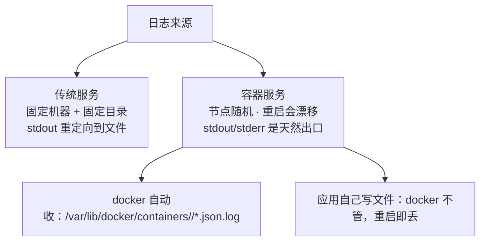
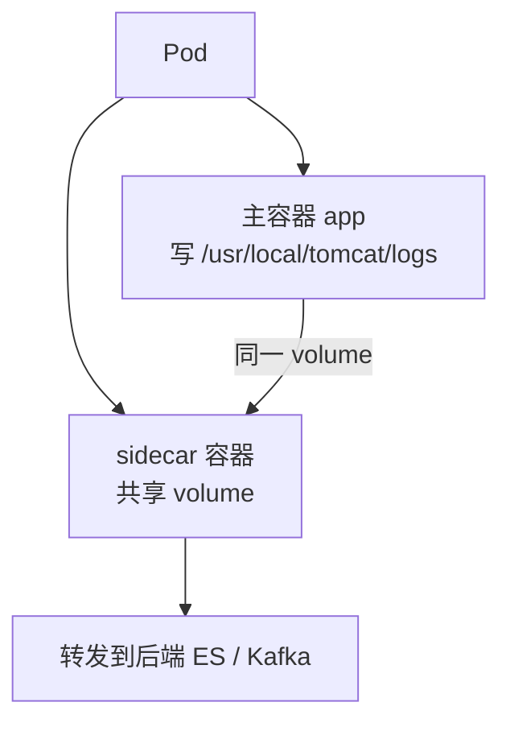
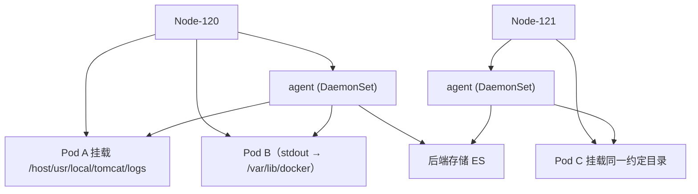
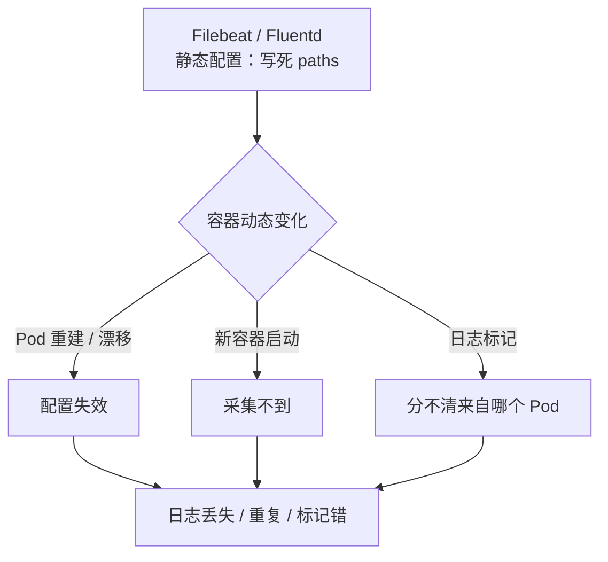
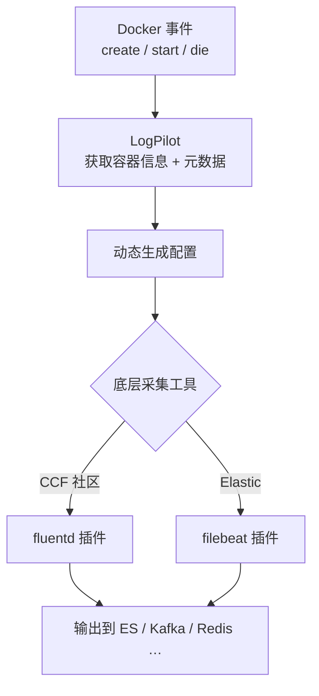
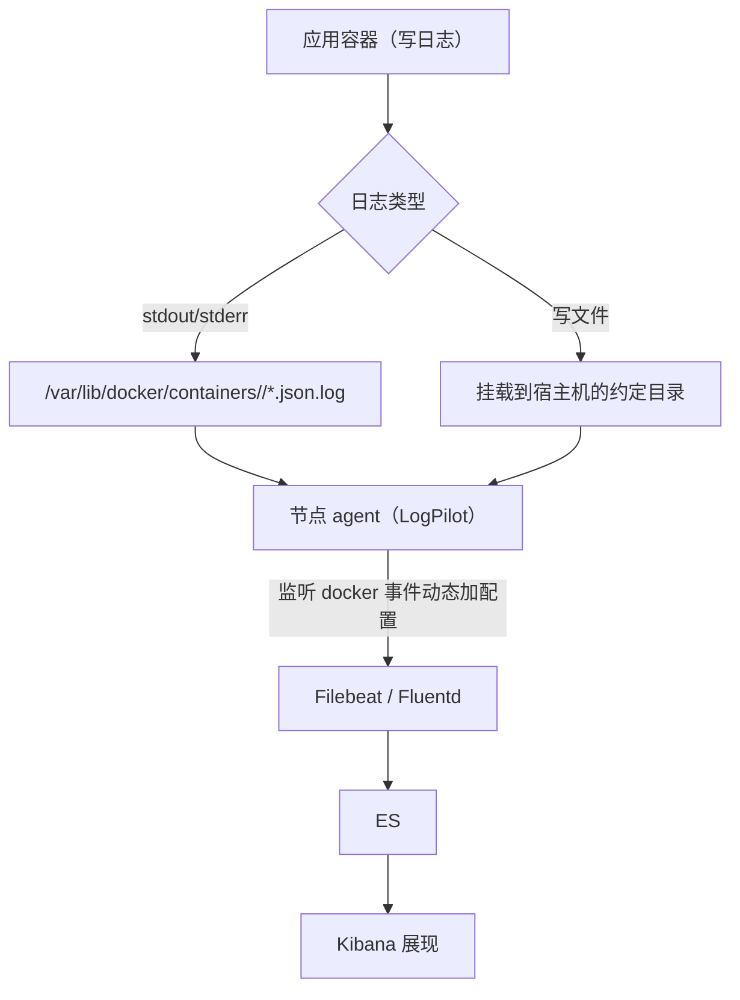

# Kubernetes 生产实践: 容器日志采集的三种方案对比与 LogPilot 原理

这一节聊**容器化应用的日志该怎么处理**。

结论先给：**容器日志分两块 —— 标准输出/错误输出（Docker 自动收集到 `/var/lib/docker/containers/<id>/*.json.log`）和应用自己写文件（Docker 不管，重启就丢）。三套方案：应用直发远程日志、Pod 内 sidecar、节点级 DaemonSet agent；生产首选节点级 agent，而常见的 Filebeat/Fluentd 都是静态配置、跟不上容器的动态性，所以要用 LogPilot 这种在静态工具外面包一层「动态配置」的工具。**

## 纲要

- 传统服务 vs 容器服务的日志差异
- Docker 日志的两块构成
- 方案一：远程日志应用（直发远端）
- 方案二：Pod 内 sidecar
- 方案三：节点级 agent（推荐）
- 三种方案的取舍对照
- 静态采集工具碰上动态容器
- LogPilot 是什么：本质与自动发现
- 底层支持 Filebeat / Fluentd

## 正文

先想想：**传统方式运行的服务，与运行在 Kubernetes 的服务，在日志上有哪些区别？**

## 传统服务 vs 容器服务的日志差异

**传统服务**部署在固定的机器上 —— **日志就是固定机器、固定目录**：

- 服务重启，日志也不受影响；
- 运行服务时通常会把**标准输出和错误输出都重定向到指定的某个日志文件**，而不是输出到控制台；
- 所以最终只需要关注**一个固定目录里的固定文件**。

**Kubernetes 里就不是这样了：**

- **服务不固定** —— 不一定跑在哪个节点上；
- **服务重启之后可能调度到一个全新的节点**，日志位置也跟着变了；
- **容器的本质是一个进程**，启动之后就自带标准输出和错误输出 —— 也就是 `docker logs` / `kubectl logs` 能看到的内容；
- **这两个输出我们没办法重定向到文件，也不应该这么来做。**



## Docker 日志的两块构成

**总体上 Docker 的日志就分两块：**

**第一块：标准输出和错误输出。** Docker 本身会帮我们处理 —— **默认情况下它们以 json 的格式保存在宿主机的一个固定目录：默认是 `/var/lib/docker/containers` 下面 `<容器名>/<容器名>-json.log`**，这是 Docker 的默认行为。**也可以通过修改 Docker 的 `logdriver` 把日志直接发送到远端（比如 fluentd）。**

**第二块：应用直接写入的日志文件。** **这个就没有那么受待见了 —— Docker 不会直接管理它，也不清楚哪个是你的日志文件。所以当服务重启的时候，它们就会丢失。**

```text
容器日志的两块

/var/lib/docker/containers/
└── <container-id>/
    ├── <container-id>-json.log   ← 标准输出 + 错误输出（Docker 托管）
    └── （应用自建目录，如 /usr/local/tomcat/logs/）  ← Docker 不管，无状态卷重启即丢
```

## 三种采集方案

情况就是这么个情况，那怎么实现日志采集？先看业内常见的解决方案。

### 方案一：远程日志应用

**应用通过配置远程日志，本地不做写入，直接将日志内容打到远端**（比如 Elasticsearch，后面可以再做统一处理；也可以汇总到某个日志服务器）。

- **好处：简单，适用于各种各样的场景** —— 不管你是 Docker 的还是非 Docker 的，都可以通过这种方式完成日志采集；
- **劣势：需要应用做改造** —— 有写入本地文件的服务，就需要重新做调整、做配置。

**总体来说，对于可以使用远程日志的业务，这个方案业内用得比较多。**

### 方案二：Pod 内 sidecar

**在每个 Pod 中跑一个 sidecar（边车容器），它跟主容器共享 volume，可以访问到所有的日志文件，就负责干一件事：把日志文件转发到后端存储。**

- 虽然也很简单，**对服务也没有侵入**；
- **但对 Pod 还是有一定侵入** —— 毕竟**每一个 Pod 都多了一个容器**；
- 而且**虽然与主容器共享 volume，它依然是一个单独的进程，内存和 CPU 消耗是不可避免的**；
- **所以社区并不推荐这种方式。**



### 方案三：节点级 agent（推荐）

**在每一个节点上部署一个 agent** —— 相当于把方案二里的 sidecar **从 Pod 里拿出来，放到了节点上**，目的就是通过一个 agent 采集所有 Pod 的日志，然后发送到后端存储。**一般它以 DaemonSet 方式运行在集群中，可以直接采集到 Docker 对应的 json log 目录。**

对于**写日志文件的服务**，用这种方式就需要**服务把容器中的日志挂载到宿主机上**，并且**事先约定好挂载的宿主机目录，然后采集这个目录下面的文件**。

**好处：**

- **每一个节点只运行了一个 agent，资源消耗小**；
- **侵入性小** —— 对 Pod 没有侵入，对应用也没有侵入。

**带来的问题：**

- **要约定所有程序都挂载到一个特定的主机目录，文件的后缀名也要尽量统一，否则维护起来比较困难**；
- **因为挂载目录是预先定义好的，导致我们没办法判断日志来源于哪一个 Pod**；
- **还得想着定期清理残留的日志文件。**



## 三种方案的取舍对照

| 维度 | 远程日志应用 | Pod 内 sidecar | 节点级 agent |
| --- | --- | --- | --- |
| **要不要改应用** | **要**（直发远端） | 不用 | 不用 |
| **对 Pod 侵入** | 无 | **多一个容器** | 无 |
| **资源消耗** | 视应用 | 每 Pod 一份 CPU/内存 | **每节点一份，最小** |
| **社区态度** | 适用面广、业内心仪 | **不推荐** | **主流推荐** |
| **多租户隔离** | 好 | 好 | 差（**不好判断日志来自哪个 Pod**） |
| **落地约束** | 需改造 | 需共享 volume | **需约定宿主机目录 + 后缀统一 + 定期清理** |

> 上面三种都只是大致思路。**具体落地会有很多形式，每个公司都有自己的业务特征，不存在说一种方案肯定比另一种好** —— 在了解常见方案的基础上，结合自己的业务特征做决定。

## 静态采集工具碰上动态容器

下面看课程要实践的方案 —— **主要思路跟上面第三个方案类似，也就是一个节点运行一个 agent 采集日志转发到后端存储。特殊的地方是 agent 选用了阿里开源的 LogPilot，后端用 ES 做存储、Kibana 做展现。**

**为什么选 LogPilot？先看常见的日志工具有哪些：**

- `filebeat`、`fluentd`、`logstash`、`logagent`、`logtail` …… 很多种类；
- **其中 filebeat / fluentd 在生产环境用得比较多**，特别是 **Filebeat 占用的资源非常少，只有一个二进制文件**，尽管它还十分年轻，**但因为非常简单，几乎没有什么可以出错的地方，所以它也非常稳定**。

**但上面这些工具有一个共同的痛点：它们都是静态的，需要事先配置好。而我们的容器恰恰是动态的、非常容易变化的。**

所以在很多场景下，**这种静态的日志配置就会遇到瓶颈，或者出现像前面提到的那些难以解决的问题**。



**所以就出现了专门为 Docker 环境设计的日志采集工具 —— LogPilot。它既能采集 Docker 的标准输出/错误输出，也能采集 Docker 的文件形式日志。**

## LogPilot 是什么

```text
LogPilot
├── 智能日志采集工具
│   ├── 采集传输到各种后端：ES / Kafka / Logstash / Redis …
│   └── 动态发现和采集容器内部的日志文件
├── 自动发现机制
│   └── 通过监听容器的事件，动态的配置日志采集
└── 解决了三个问题
    ├── 日志重复
    ├── 日志丢失
    └── 日志标记（分不清来自哪个 Pod）
```

- **动态发现**：LogPilot 具有自动发现的机制，**它通过监听容器的事件，动态地配置日志采集**，很好地解决了**日志重复、日志丢失以及日志标记**的问题；
- **2017 年就在 GitHub 上开源**，项目地址感兴趣可以去访问深入了解更多原理。

### 它的本质

**说了这么多高大上的功能，本质其实很简单 —— 就是在静态日志采集工具外面包了一层：通过获取 Docker 的信息和事件，去实现静态工具的动态配置。**



**目前它支持两种底层采集工具：**

- **CCF 社区的 fluentd 插件**；
- **Elastic 的 filebeat 插件**。

细节的东西在接下来的实践中深入学习。



## API 速览

| 能力 | 做法 |
| --- | --- |
| 看标准输出 | `kubectl logs <pod>` / `docker logs <container>` |
| Docker 默认日志目录 | `/var/lib/docker/containers/<container-id>/<container-id>-json.log` |
| 改日志出口 | 修改 Docker 的 **`logdriver`**（如 `fluentd`） |
| 方案一 | 应用直发远端（ES / 日志服务器），本地不落盘 |
| 方案二 | Pod 内 sidecar 共享 volume 转发 |
| **方案三（推荐）** | **节点级 agent，DaemonSet 运行** |
| agent 采集文件日志的约束 | 服务需把日志目录**挂载到宿主机约定目录** + 后缀名统一 + 定期清理 |
| 常见静态工具 | filebeat / fluentd / logstash / logagent / logtail |
| 节点 agent 选型 | **LogPilot（阿里开源，2017 开源）** |
| LogPilot 底层 | **fluentd 插件** 或 **filebeat 插件** |
| LogPilot 的招 | 监听 Docker 事件 → 动态配置，解决**重复 / 丢失 / 标记** |
| 后端存储 | ES + Kibana（也可 Kafka / Logstash / Redis） |

## Demo 示例

三种方案的骨架配置都能直接落地。

**方案二：Pod 内 sidecar（不推荐，仅作对照）**

```yaml
apiVersion: v1
kind: Pod
metadata:
  name: web-with-sidecar
spec:
  containers:
    - name: app
      image: tomcat:8
      volumeMounts:
        - name: logs
          mountPath: /usr/local/tomcat/logs
    - name: collector          # 边车：转发日志到后端
      image: filebeat:7.17.10
      volumeMounts:
        - name: logs
          mountPath: /usr/local/tomcat/logs
        - name: filebeat-config
          mountPath: /usr/share/filebeat
  volumes:
    - name: logs
      emptyDir: {}
    - name: filebeat-config
      configMap:
        name: filebeat-log-config
```

**方案三：节点级 agent（推荐）**

```bash
# 日志目录约定：所有写文件的服务都挂到 /host 下的同一约定目录
# agent 通过挂载宿主机根目录（/-host）读到任意位置的日志
kubectl apply -f logpilot.yaml   # DaemonSet，每节点一个实例
kubectl get pod -n kube-system -l k8s-app=logpilot
```

```bash
#!/usr/bin/env bash
# 检查采集是否生效
echo "== 1. agent 是否在每个节点跑起来了 =="
kubectl get pod -n kube-system -l k8s-app=logpilot -o wide

echo "== 2. agent 是否发现并采集了容器 =="
kubectl -n kube-system logs -l k8s-app=logpilot | grep -i "logpilot"

echo "== 3. 宿主机上的日志目录真的存在吗 =="
    # 执行前先给下面的占位变量赋值，如 NODE_NAME=node1，否则变量为空会导致命令行为不符合预期
ssh node-120 "ls /usr/share/docker/overlay2/<...>/merged/usr/local/tomcat/logs/ && ls /var/lib/docker/containers/${ID}/*.log"

echo "== 4. ES 里有没有数据 =="
curl -s 'localhost:9200/_cat/indices?v'
```

### 总结

- **容器日志分两块**：`stdout/stderr`（Docker 默认存到 `/var/lib/docker/containers/<id>/<id>-json.log`，可用 `kubectl logs` 看），和**应用自己写的文件**（Docker 不管，**重启就丢**）—— 后者必须挂卷或使用采集方案。
- **不要试图把容器标准输出重定向到文件**，那违背了容器的设计；控制台输出才是容器里唯一"天然"的日志出口。
- **三套方案：远程日志应用（要改代码，但适用面最广）、Pod 内 sidecar（社区不推荐，每 Pod 多一个进程的 CPU/内存代价）、节点级 DaemonSet agent（主流选择，资源最小、对 Pod 和应用都无侵入）**。
- **节点级 agent 的代价要认**：日志目录必须**事先约定**并挂到宿主机固定位置、后缀名尽量统一、还得**定期清理残留文件**，而且**挂载目录是预定义的，不好判断日志来自哪一个 Pod**。
- **Filebeat / Fluentd 都是静态工具，跟不上容器的动态性**；**LogPilot 的本质就是在静态工具（fluentd 插件 / filebeat 插件）外面包一层 —— 通过监听 Docker 事件、获取容器信息来动态生成配置**，从而解决**日志重复、日志丢失、日志标记**三个问题。

