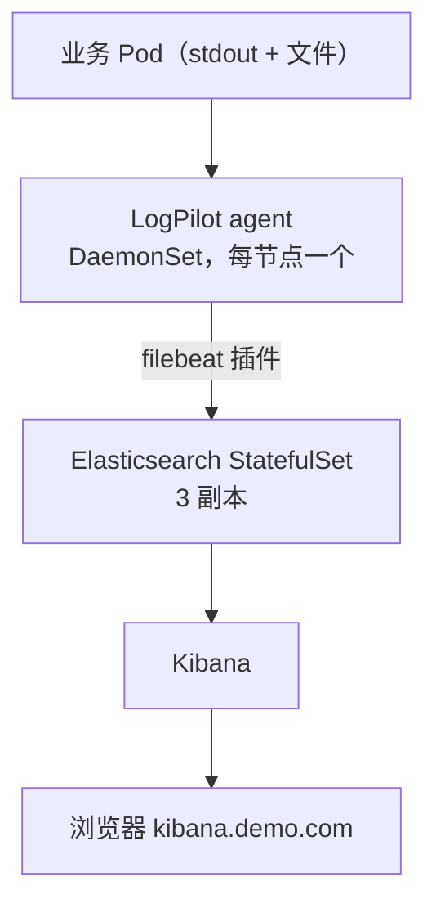
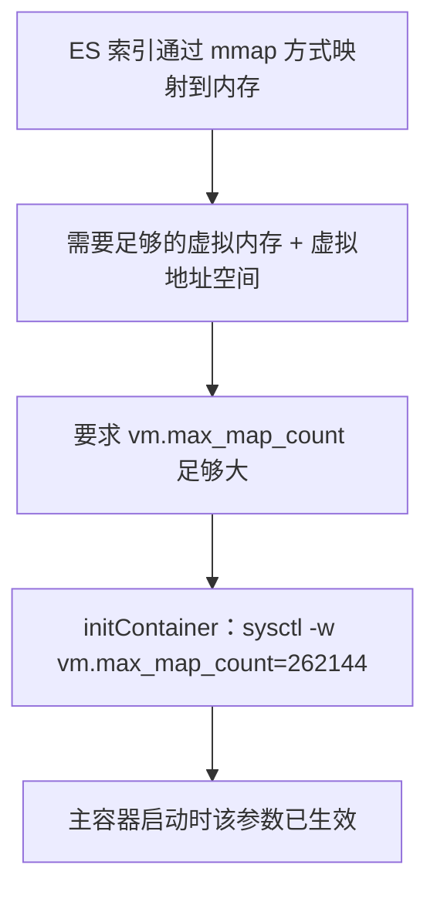
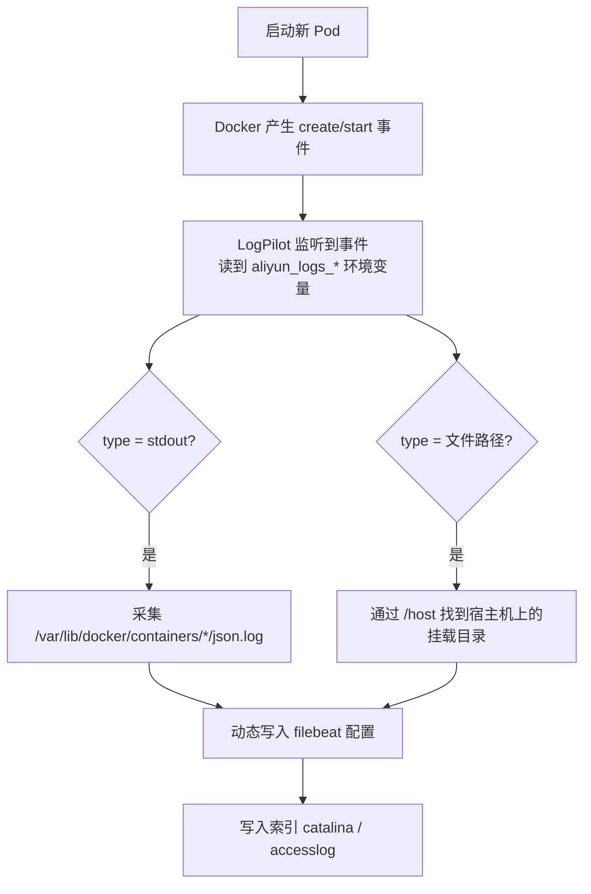
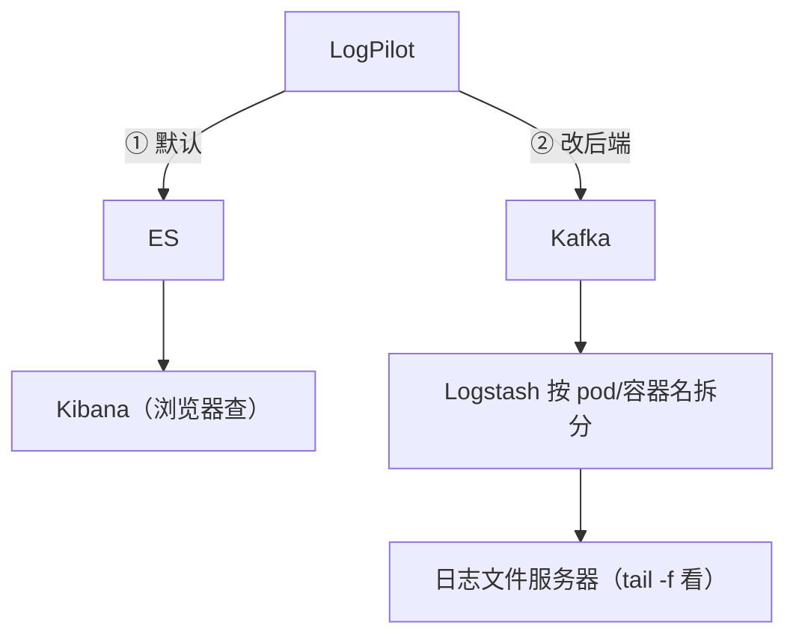

# Kubernetes 生产实践: LogPilot + ES + Kibana 的日志采集落地

上一节把容器日志的**三种采集方案**和 **LogPilot 的本质**（静态采集工具 + 一层动态配置）讲清楚了。这一节按架构图把环境真正搭起来：**ES → LogPilot → Kibana**，再改造一个 web 服务让 LogPilot 去采它的日志，最后在 Kibana 里搜到。

结论先给：**ES 存日志、Kibana 展现、LogPilot 以 DaemonSet 每节点一个 agent 采集；LogPilot 靠挂载宿主机根目录（`-host`）+ docker.sock 拿到 Docker 信息，通过环境变量 `aliyun_logs_<名>_stdout` / `aliyun_logs_<名>_path` 声明采集项；索引名在环境变量里定（对接 ES 就是索引名，对接 Kafka 就是 topic）。**

## 纲要

- 整体架构：ES → LogPilot → Kibana
- 部署 ES：两个 Service 与两个端口
- ES 的 9200 / 9300 各管什么
- ES StatefulSet：三副本 + initContainer 调 sysctl
- 为什么 ES 要调 `vm.max_map_count`
- LogPilot DaemonSet：为什么是 DaemonSet
- 三个关键挂载：`docker.sock` / `-host` / 根目录
- 部署 Kibana：Service + Ingress + Deployment
- 改造业务服务：两个环境变量声明日志
- LogPilot 动态发现的日志形态
- Kibana 建索引模式并对上字段

## 正文

先按这张图搭环境：**第一个搭 ES，然后搭 LogPilot，最后搭 Kibana。**



## 部署 ES

到控制节点 `deployments` 目录的 `11-logs`，里面是事先准备好的配置文件。第一个是 ES。

先看配置内容 —— 上面是一个 ES 的 Service，名字叫 `es-api`，namespace 是 `kube-system`，后端是具有 `app=es` 标签的应用，端口暴露的是 **9200**；下面还有一个 Service 叫 `es-discovery`，后端一样，暴露 **9300**。

```yaml
apiVersion: v1
kind: Service
metadata:
  name: es-api
  namespace: kube-system
spec:
  selector:
    app: es
  ports:
    - name: rest
      port: 9200
      targetPort: 9200
---
apiVersion: v1
kind: Service
metadata:
  name: es-discovery
  namespace: kube-system
spec:
  selector:
    app: es
  ports:
    - name: inter
      port: 9300
      targetPort: 9300
```

**为什么要暴露两个端口？因为容器确实有两个端口，对外提供两种服务：**

| 端口 | 用途 |
| --- | --- |
| **9200** | **对外是 HTTP 的 RESTful 接口**（我们 curl 查的就是它） |
| **9300** | **ES 节点之间通讯**，**是通过 TCP 来通讯的**（集群之间、节点之间都走这个） |

下面定义了一个 StatefulSet，就是具体的 ES 服务。

```yaml
apiVersion: apps/v1
kind: StatefulSet
metadata:
  name: es
  namespace: kube-system
spec:
  serviceName: es-discovery
  replicas: 3
  selector:
    matchLabels:
      app: es
  template:
    metadata:
      labels:
        app: es
    spec:
      tolerations:
        - key: node-role.kubernetes.io/master
          operator: Exists
          effect: NoSchedule
      serviceAccountName: dashboard-admin
      initContainers:
        - name: sysctl
          image: busybox
          command: ["sysctl", "-w", "vm.max_map_count=262144"]
          securityContext:
            privileged: true
      containers:
        - name: es
          image: elasticsearch:5.5.1
          ports:
            - containerPort: 9200
            - containerPort: 9300
          env:
            - name: cluster.name
              value: logstash-cluster
            - name: node.name
              valueFrom:
                fieldRef:
                  fieldPath: metadata.name
            - name: discovery.type
              value: single-node
          resources:
            limits:
              cpu: 2000m
              memory: 4Gi
          readinessProbe:
            httpGet:
              path: /_cluster/health
              port: 9200
      volumes:
        - name: es-data
          hostPath:
            path: /data/es
```

### ES 的副本数

**`replicas` 定义的是三个节点，这也是 ES 对高可用的一个要求。** Worker 节点不够的话，**最少可以有两个实例**也能正常跑，**但一个肯定跑不起来**。

为了后面演示，新加了一个 worker 节点 —— 除了 `node-120`、`node-121`，又加入了一个新的 worker，保证三个副本能正常跑。

### 让 ES 能调度到主节点

考虑到有些同学节点数不充足，加了一个让容器**可以调度在主节点上**的配置。

- **如果是通过二进制方式安装的主节点，并没有运行 kubelet，这个是不起作用的；**
- **如果是通过 kubeadm 安装的，这个就可用** —— 让它可以跑在主节点上。

之前讲 Pod 时应该知道：**主节点的调度我们可以通过给节点打一个污点来拒绝 Pod 调度，同时 Pod 也可以通过声明污点容忍（tolerance）去容忍这个污点，让它能调度到对应节点上。**

### initContainer 调 `sysctl`

下面这个很重要 —— 有一个 **initContainers**，容器是一个**非常非常小的 busybox**，没什么功能，**只执行了一条命令 `sysctl -w` 临时修改系统参数 `vm.max_map_count`，给它定义一个非常大的值**。



**因为 ES 索引是通过 mmap 的方式映射到内存中的，所以要求系统要有足够的虚拟内存空间以及足够的虚拟地址空间** —— 这个 initContainer 就是干这个的。设置好之后，就会在下边的容器（主容器）中生效。

### ES 容器要点

- 镜像 `elasticsearch:5.5.1`；
- 容器端口两个：9200、9300；
- 下面是对它的安全设置，增加一些它需要的权限；
- 对资源有限制（**资源不能太小**）；
- 定义了环境变量（用到的一些参数）；
- 健康检查；
- 挂载了一个 volume —— **目前使用的方式是固定挂载到了宿主机上（hostPath），生产环境中也可以选择挂载到共享存储，指定节点。**

```bash
kubectl -n kube-system apply -f es-statefulset.yaml
kubectl -n kube-system get svc -l app=es
# NAME            TYPE        CLUSTER-IP      PORT
# es-api          ClusterIP   10.96.x.x       9200/TCP
# es-discovery    ClusterIP   10.96.x.x       9300/TCP

kubectl -n kube-system get pods
# es-0  1/1  Running
# es-1  1/1  Running
# es-2  1/1  Running
```

## 部署 LogPilot

```yaml
apiVersion: apps/v1
kind: DaemonSet
metadata:
  name: logpilot
  namespace: kube-system
  labels:
    k8s-app: logpilot
spec:
  selector:
    matchLabels:
      k8s-app: logpilot
  template:
    metadata:
      labels:
        k8s-app: logpilot
    spec:
      tolerations:
        - key: node-role.kubernetes.io/master
          operator: Exists
          effect: NoSchedule
      serviceAccountName: dashboard-admin
      containers:
        - name: logpilot
          image: registry.cn-hangzhou.aliyuncs.com/aliyun/logpilot:0.9.4-filebeat
          env:
            - name: NODE_NAME
              valueFrom:
                fieldRef:
                  fieldPath: spec.nodeName
            - name: LOG_LEVEL
              value: info
          resources:
            limits:
              memory: 500Mi
            requests:
              cpu: 100m
              memory: 200Mi
          volumeMounts:
            - name: varlib-docker
              mountPath: /var/lib/docker
            - name: rootfs
              mountPath: /host
              readOnly: true
      volumes:
        - name: varlib-docker
          hostPath:
            path: /var/lib/docker
        - name: rootfs
          hostPath:
            path: /
```

**为什么定义 DaemonSet？因为它要在每一个节点都有一个实例，每节点一个，负责收集当前节点上所有的日志。** namespace 定义到 `kube-system`；同样可以运行在 master 上（不喜欢的可以去掉）；它也用了 ServiceAccount `dashboard-admin`。

**容器用的是 `logpilot:0.9` 的 filebeat 版本 —— 也就是说它的底层实现是一个 filebeat，它通过动态地修改 filebeat 的配置文件来实现日志采集。**

### 三个关键挂载

下面这些 volumes 要重点关注：

```text
LogPilot 容器的 volumeMounts
├── /var/lib/docker   ← hostPath /var/lib/docker
├── /host             ← hostPath /（宿主机根目录，只读）
└── docker.sock       ← hostPath /var/run/docker.sock
```

- **`varlib-docker` 挂载 `/var/lib/docker`** —— LogPilot 确实需要用到 docker 能力去访问宿主机，**可以看到 Docker 信息、Docker 日志存储的位置、所有的 Docker 事件，都可以通过挂载这个目录的形式拿到权限**；
- 还有一个目录是 **`-host`，挂载到了宿主机的 `/var/run/docker.sock`**，拿到 Docker 的权限；
- **对于 root 目录，挂载到了宿主机的根目录，也就是把宿主机的整个磁盘都赋予了可读权限** —— 只有这样它才可能拿到 Docker 的任意配置，**因为 Docker 可能被我们配置改掉了日志存储目录，不一定在哪**，所以**必须挂载根目录，能读到系统中所有的文件**；
- 下面是相关的数据盘和日志的目录。

**整个日志采集就只有一个 DaemonSet** —— 因为它**不需要对外提供服务，也不需要服务发现**，所以不需要别的东西。

```bash
kubectl -n kube-system apply -f logpilot.yaml
kubectl -n kube-system get pod
# 当前有三个节点，期望是 3；两个还没有全部通过健康检查，等一会儿
kubectl -n kube-system get pod -w
# 三个 pod 都正常启动了，都处于 Ready
```

## 部署 Kibana

最后一个组件 Kibana：

```yaml
apiVersion: v1
kind: Service
metadata:
  name: kibana
  namespace: kube-system
spec:
  selector:
    app: kibana
  ports:
    - name: http
      port: 80
      targetPort: http
---
apiVersion: networking.k8s.io/v1
kind: Ingress
metadata:
  name: kibana
  namespace: kube-system
spec:
  ingressClassName: nginx
  rules:
    - host: kibana.demo.com
      http:
        paths:
          - path: /
            pathType: Prefix
            backend:
              service:
                name: kibana
                port:
                  number: 80
---
apiVersion: apps/v1
kind: Deployment
metadata:
  name: kibana
  namespace: kube-system
spec:
  replicas: 1
  selector:
    matchLabels:
      app: kibana
  template:
    metadata:
      labels:
        app: kibana
    spec:
      containers:
        - name: kibana
          image: kibana:5.5.1
          ports:
            - name: http
              containerPort: 5601
          env:
            - name: ELASTICSEARCH_URL
              value: http://es-api.kube-system:9200
```

- 一个 Service（名字 `kibana`，端口 80）；
- 一个 **Ingress**，通过刚才这个 Service 的 80 端口，给了个 host 叫 **`kibana.demo.com`**；
- 一个 Kibana 的 Deployment（namespace `kube-system`，镜像 `kibana:5.5.1`），配置了它访问的 ES 的 URL，端口 9200；对外 HTTP 端口是 5601，**名字叫 `http`** —— 上面暴露的那个 80 端口对应的 targetPort 名字就是 `http`。

配个 host：

```bash
echo "10.0.15.20 kibana.demo.com" | sudo tee -a /etc/hosts
```

**这个 Deployment 目前也正常 Running 了**（`available=1`），浏览器打开 `kibana.demo.com` —— **提示我们去创建索引**，但**目前还没有采集到任何日志，还不是创建索引的时候**，至少证明 Kibana 是正常的。

```bash
kubectl -n kube-system get deploy -l app=kibana
# NAME     DESIRED   AVAILABLE
# kibana   1         1
```

## 改造业务服务：两个环境变量声明日志

找一个服务配置日志，让 LogPilot 去采。准备好的是 `web.yaml`，**这是之前一个 web 项目的改造版**：

```yaml
apiVersion: apps/v1
kind: Deployment
metadata:
  name: webdemo
spec:
  replicas: 3
  selector:
    matchLabels:
      app: webdemo
  template:
    metadata:
      labels:
        app: webdemo
    spec:
      containers:
        - name: webdemo
          image: webdemo:v1
          env:
            - name: aliyun_logs_catalina_stdout
              value: stdout
            - name: aliyun_logs_access_log
              value: /usr/local/tomcat/logs/*
          volumeMounts:
            - name: accesslog
              mountPath: /usr/local/tomcat/logs
      volumes:
        - name: accesslog
          emptyDir: {}
---
apiVersion: v1
kind: Service
metadata:
  name: webdemo
spec:
  selector:
    app: webdemo
  ports:
    - port: 80
      targetPort: 8080
```

**`env` 这块跟之前不一样，定义了两个名字：**

**第一个名字叫 `aliyun_logs-catalina`（环境变量的规则）：**

- **开头必须是 `aliyun_logs`，然后下划线，然后自己起的一个名字 `catalina`**；
- **这个名字是有定义的规则**：
  - **对接 ES，它表示的就是索引（index）**；
  - **对接的是 Kafka，它表示的就是 topic** —— 对应不同后端有不同含义；
- `value: stdout` —— **就是容器的标准输出**，直接写一个固定的名字 `stdout`。

**第二个定义了一个索引名字 `accesslog`，value 对应一个具体目录 `/usr/local/tomcat/logs/*`。**

- 当然如果只想采 `.log` 文件，可以改成 `*.log`，或者 `.out`，**就是要采集的文件类型**，**如果是所有的就加星号 `*` 就行**。

> **注意：上面要采集的目录是 `/usr/local/tomcat/logs`，所以下面还要把这个目录挂载到宿主机上 —— 挂载的目录名字叫 `accesslog`，挂载位置是 `emptyDir`（Docker 自动生成的默认位置，不用手动指定）。其实这里主要起的作用就是：声明出我们需要采集的目录。**

**这就是日志的 tomcat 配置 —— 一个 env（声明），一个 volume（挂载）。** 底下别的（Service、Ingress）跟之前一样，定义 `webdemo` 服务 80 对应 8080，通过 `web.demo.com` 可以访问。

### 环境变量命名规则

```text
aliyun_logs_<名>_<类型>

  aliyun_logs_catalina_stdout   = stdout        → 索引 catalina（标准输出）
  aliyun_logs_access_log        = /usr/local/tomcat/logs/*   → 索引 accesslog（文件）

  <名>  → 对接 ES 时 = 索引名；对接 Kafka 时 = topic 名
  类型  → stdout | 文件路径（支持 *.log 通配）
```

```bash
kubectl apply -f web.yaml
kubectl get pod -o wide
# webdemo 三个实例：node-120 一个、新机器 136 一个、node-121 一个，每台机器各分配一个
```

## LogPilot 动态发现的日志形态

回头看 LogPilot 的日志：

```bash
kubectl -n kube-system logs -l k8s-app=logpilot
# enable logpilot filebeat ...        ← 说明它是基于 filebeat 来做的
# 下面发现了一些容器（容器 ID）……
# 但并没有日志的配置 → 跳过了，这些容器都没有对应的配置，不会采集
# 后来：found container ... 处理这个容器启动的一个事件
#        对应目录 /host/var/share/docker/...  ← 由于把宿主机根目录挂载到容器的 -host 目录
#        catalina → stdout → docker 自己的目录 *.json.log
```

关键对照：

- **发现容器启动事件 → 按环境变量匹配采集项**；
- **对于 `catalina`（配的 stdout）** → 走到 **Docker 自己目录里的 json 文件**（`*.json.log`），**它既处理了标准输出，也处理了我们声明的日志目录，符合预期**；
- **对于 `accesslog`（配的 `/usr/local/tomcat/logs`）** → 对应到宿主机的目录（因为把宿主机根目录挂到容器的 `-host` 目录，后面跟的就是宿主机目录），找到 **某个具体 Pod 下 volume 里的 `accesslog`**，对应到容器里就是 `/usr/local/tomcat/logs`。

到宿主机上验证目录确实存在：

```bash
    # 执行前先给下面的占位变量赋值，如 NODE_NAME=node1，否则变量为空会导致命令行为不符合预期
ls /var/lib/docker/.../${POD}/volumes/.../accesslog
# （有文件，对应容器里 /usr/local/tomcat/logs 下的内容）
ls /var/lib/docker/containers/${ID}/*.log
# <id>-json.log    ← 标准输出
```



## Kibana 建索引模式

回到浏览器，**配置索引** —— 默认的 `logstash*` 开头是找不到的。

**索引的名字就是刚才业务服务里配置的名字：**

1. 配 **`access*`** —— 能找到；
2. 找一个**时间的字段**，创建索引模式；
3. 再创建 **`catalina`**（刚才那个 web 服务里配置的名字），再创建一个 **`accesslog`**。

进 **Discover** 按索引搜索，**默认的会使用 `access*` 去搜** —— 发现已经有日志内容了。

看日志字段：

```text
一条日志里的字段
├── filebeat.hostname      filebeat 的主机名
├── filebeat.version       filebeat 版本
├── docker.container.name  容器名
├── kubernetes.pod.name    Pod 名        ← 能区分出来
├── _source.message        日志内容（一行一行的原始日志）
└── @timestamp
```

**这样的话就非常容易知道日志来源于哪个 Pod、哪个容器，都可以作为条件去查询。**

再访问一下服务 `web.demo.com` 的 hello 接口并传个参数，然后**在 Kibana 里搜索这个字符串**：

```bash
curl 'http://web.demo.com/hello?name=michael'
```

**Kibana 里能搜到 `michael`** —— 日志里打印出了传进去的值（`hello,double... hello,michael`），**反应非常快，马上就能查到结果。**


## 给习惯命令行的同学：绕开 Kibana

**肯定有很多开发同学不习惯用 Kibana 查日志，更习惯在命令行看日志文件。** 这种需求也能实现 —— **不直接打到 ES，而是从 LogPilot 直接发到 Kafka，Kafka 再发到存储后端（比如 Logstash），Logstash 可以按照容器或 Pod 名区分，把日志都写到日志服务器上**，这样就可以非常方便地按文件查看日志了。



> Kibana 和 ES 更多功能不展开 —— 这里主要目的是学 K8s 的日志采集，ES/Kibana 的资料非常多，可以自己深入。

## API 速览

| 能力 | API / 配置 |
| --- | --- |
| ES REST 接口 | `9200`（对外 HTTP） |
| ES 节点间通讯 | `9300`（TCP） |
| ES 高可用 | `replicas: 3`（最少 2，1 跑不起来） |
| ES mmap 前置条件 | `initContainer: sysctl -w vm.max_map_count=…`（privileged） |
| ES 调度到 master | 节点污点 + Pod `tolerations` + `serviceAccountName` |
| LogPilot 形态 | **DaemonSet**（每节点一个 agent） |
| LogPilot 镜像 | `logpilot:0.9-filebeat`（底层即 filebeat） |
| 拿 Docker 信息 | 挂载 `/var/lib/docker` + `/var/run/docker.sock` |
| 拿到任意位置日志 | **挂载宿主机根目录到 `-host`（只读）** |
| 声明采集项 | `env: aliyun_logs_<名>_<类型>` |
| 索引名 / topic | `<名>` —— **对接 ES 是索引，对接 Kafka 是 topic** |
| 采标准输出 | `aliyun_logs_<名>_stdout = stdout` |
| 采文件 | `aliyun_logs_<名>_<名> = /usr/local/tomcat/logs/*` |
| 业务侧配合 | 把日志目录 `emptyDir` 挂到容器，并声明 volume |
| Kibana 端口 | `5601`（容器），Service `80` → `targetPort: http` |
| Kibana 访问 | Ingress host `kibana.demo.com` + 本地 `/etc/hosts` |
| 建索引模式 | 用环境变量里起的索引名（`access*` / `catalina` / `accesslog`） |

## Demo 示例

```bash
#!/usr/bin/env bash
set -euo pipefail

# 1. 部署 ES（StatefulSet：3 副本 + initContainer sysctl）
kubectl -n kube-system apply -f es-statefulset.yaml
kubectl -n kube-system rollout status sts/es --timeout=600s

# 2. 部署 LogPilot（DaemonSet，每节点一个 agent）
kubectl -n kube-system apply -f logpilot.yaml
kubectl -n kube-system get pod -w   # 等所有节点都 Ready

# 3. 部署 Kibana（Service + Ingress + Deployment）
kubectl -n kube-system apply -f kibana.yaml
echo "10.0.15.20 kibana.demo.com" | sudo tee -a /etc/hosts

# 4. 改造业务：两个环境变量声明日志 + 挂目录
kubectl apply -f web.yaml
kubectl get pod -o wide          # 三实例分到三台机器

# 5. 核验采集
kubectl -n kube-system logs -l k8s-app=logpilot | grep -i "stdout\|accesslog"

# 6. 造一条可调的日志
curl -s 'http://web.demo.com/hello?name=michael'
```

**排障三板斧：**

```bash
# ES 起来了没
kubectl -n kube-system get pod -l app=es
curl -s localhost:9200/_cluster/health

# LogPilot 有没有发现容器（只看到容器 ID、没看到采集项就是没配 aliyun_logs_*）
kubectl -n kube-system logs -l k8s-app=logpilot | tail -50

# 宿主机上目录真的存在吗（LogPilot 通过 /host 读到）
ssh node-120 "ls /host/usr/local/tomcat/logs/ 2>/dev/null; ls /host/var/lib/docker/containers/*/*.log"
```

```text
常见故障

  LogPilot 只 skip、不采集   → 业务 Pod 没配 aliyun_logs_* 环境变量
  Kibana 看不到索引         → 索引名写错；LogPilot 还没采集到
  ES 起不来 / CrashLoop     → vm.max_map_count 太小；或内存不足
  ES 只起来 1 个副本        → 节点数不够，最少 2 个才能进 yellow/green
  Kibana 页面打不开         → Ingress host 与 /etc/hosts 不一致
```

### 总结

- **ES 要暴露两个端口**：**9200 对外是 HTTP RESTful 接口**（curl / Kibana 走它），**9300 是 ES 节点之间 TCP 通讯用**，所以配了两个 Service（`es-api` / `es-discovery`）。
- **ES 用 StatefulSet 3 副本**（最少 2 个能跑，1 个肯定跑不起来），**并加一个 busybox initContainer 执行 `sysctl -w vm.max_map_count=…`（privileged）** —— 因为 **ES 索引通过 mmap 映射到内存，需要足够的虚拟内存与虚拟地址空间**。
- **LogPilot 必须是 DaemonSet**（每节点一个 agent，不需要服务发现），**靠三个挂载拿到能力：`/var/lib/docker` + `/var/run/docker.sock` 看 Docker 信息与事件，把宿主机根目录挂到 `-host` 只读** —— 因为 Docker 日志目录可能被改过，只有全盘可读才能兜住。
- **业务侧只要声明，不用改代码**：环境变量 `aliyun_logs_<名>_<类型>` —— 名字段**对接 ES 时就是索引名、对接 Kafka 时就是 topic**；`_stdout` 写 `stdout` 采标准输出，写文件路径（如 `/usr/local/tomcat/logs/*`）采文件；再把日志目录 `emptyDir` 挂到容器里声明出来即可。
- **LogPilot 通过监听 Docker 事件发现容器并动态改 filebeat 配置**（镜像即 `logpilot:0.9-filebeat`），所以新 Pod 一起来就能采；**Kibana 里建索引模式要用环境变量里起的索引名**，日志字段里带 `kubernetes.pod.name` / `docker.container.name` / `message`，**可以按 Pod、容器做查询条件**；习惯命令行的团队可把后端从 ES 换成 Kafka → Logstash → 文件服务器。

