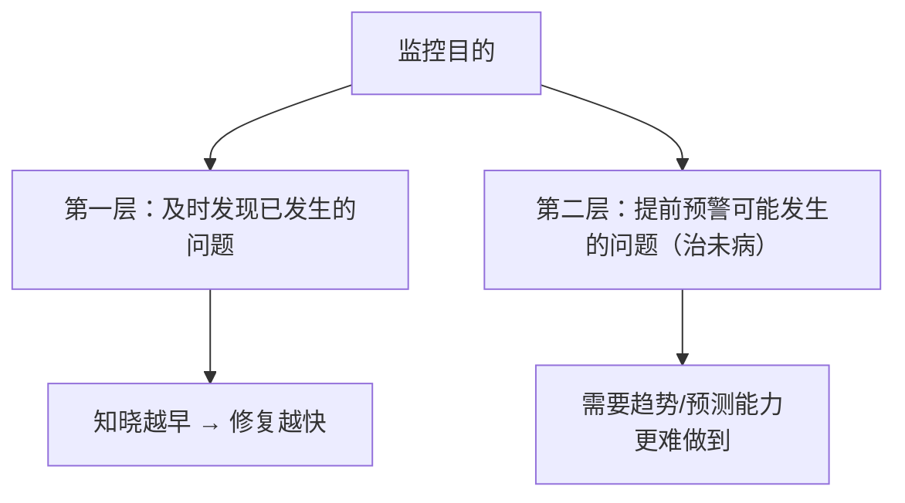
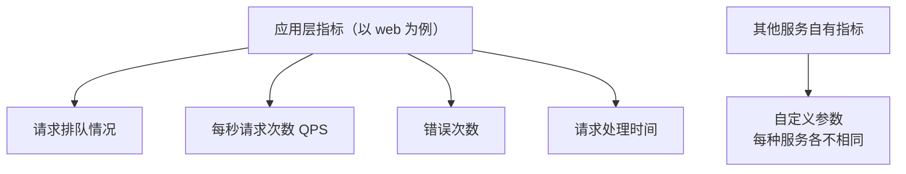
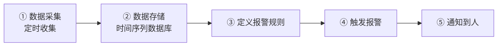
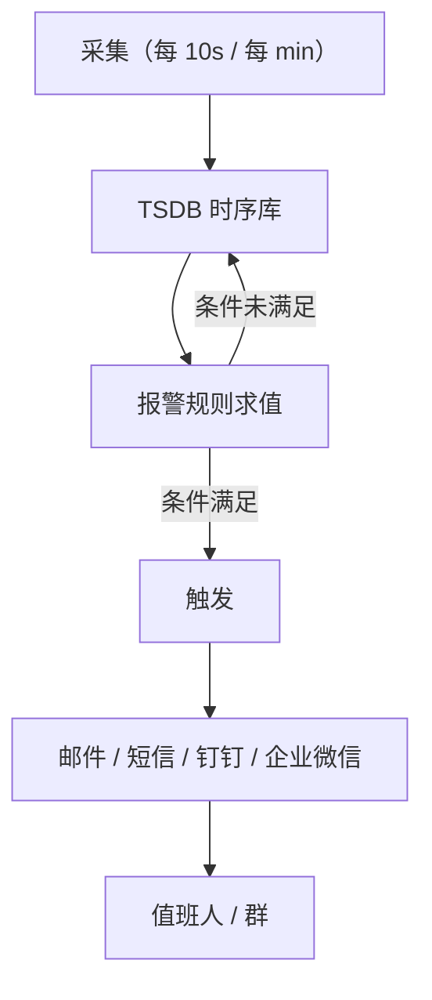
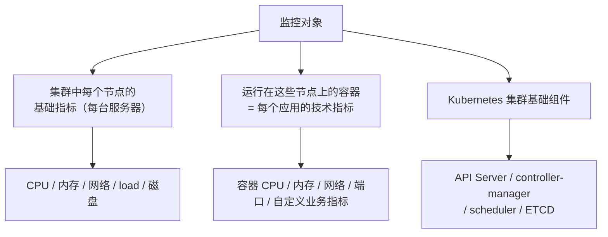
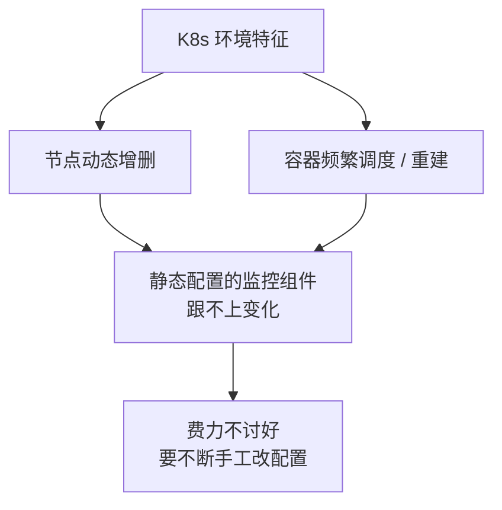

# Kubernetes 生产实践: 监控体系的目标、采集流程与监控对象

这一节聊**监控、报警以及 Kubernetes 的监控报警体系**。

结论先给：**监控的目的是「及时发现已发生的问题」+「提前预警可能发生的问题」（治未病）；落地流程是「定时采集 → 时序库存储 → 定义报警规则 → 触发通知」；监控对象分三层：节点基础指标、容器/应用指标、K8s 基础组件指标（API Server / controller-manager / scheduler / ETCD）；传统组件（Zabbix / 小米 Open-Falcon）在容器环境下静态部署不合适，所以要用 Prometheus。**

## 纲要

- 监控的目的：两个层次
- 要监控什么：服务器基础指标
- 要监控什么：服务自身指标
- 要监控什么：业务日志
- 采集流程：定时采集 → 时序存储 → 报警规则 → 通知
- 为什么必须用时间序列数据库
- 报警通知渠道
- 业内常用监控组件
- 监控是一个持续调优的过程
- 回到 Kubernetes：本次要监控的三层
- 传统组件为什么不适合容器环境

## 正文

说到监控，这不承认是一个很大的话题。有同学觉得"监控一个服务不简单吗？定时访问一下它的设置页面，判断一下返回值" —— **其实真没那么简单**。

## 监控的目的：两个层次

**第一，及时发现已经出现的问题。** 出现问题得尽早知道，**知道的越早才能解决的越快**。

**第二，提前预警可能发生的问题** —— 在问题还没有发生的时候就知道即将可能发生的问题。

> 这个跟中医理论比较契合，讲究**治未病** —— 这有一定的高度，也是更难做到的。



## 要监控什么

要达到上面的目的，要做的事情其实非常多。

### 服务器基础指标

**我们的服务是跑在服务器上的，至少得监控一下这个服务器的技术指标**：

- **CPU**
- **内存**
- **网络 I/O**
- **load 负载** 等等

**基础信息都必须监控，否则主机出现问题，服务肯定不能幸免。**

```text
节点层指标
├── CPU / load
├── 内存（含是否溢出）
├── 网络 I/O
├── 磁盘 I/O
└── 端口是否在监听
```

### 服务自身指标

**除了基础信息，服务本身也要监控：**

- 服务占用多少内存？
- 使用了多少 CPU？
- **内存是不是溢出**了？
- 占用的网络带宽？
- 磁盘 I/O？
- **监听端口在不在？**

**更进一步的，有些服务会提供一些特定的接口，用来提供更细致更深入的服务信息** —— 每种服务有各自的特征、各自的自定义参数。

**比如一个 web 服务常见的：**

- **请求的排队情况**
- **每秒的请求次数（QPS）**
- **错误次数**
- **请求的处理时间**



```text
容器 / 应用指标
├── 容器 CPU / 内存用量
├── 内存是否溢出（OOM）
├── 网络带宽占用
├── 磁盘 I/O
├── 监听端口存活
└── 业务自定义指标（排队、QPS、错误率、耗时）
```

### 业务日志

**还有一个非常重要、也比较常见的监控手段：不断去分析业务的日志** —— 比如**根据日志的异常数，或者某些特定异常发生的频率来做预警**。

## 采集流程

上面说的还只是"要做什么"，具体怎么做更麻烦。但总体思路大同小异，一般过程是：



### ① 数据采集

**定时去收集一些数据，比如每分钟每隔十秒采集一次。**

**为什么要定时？因为监控是一个持续的、长期的过程，采集一次或几次的数据肯定没什么意义。**

### ② 数据存储：时间序列数据库

**数据采集完之后就是数据的存储，一般我们使用时间序列数据库来存储。**

**为什么用时间序列？** 想一想：采集一次的数据信息足够用来判断是否需要报警吗？当然有些数据可以，但**一般我们都会以时间或次数作为依据** ——

- **五分钟内某件事情发生了三次 → 我要报警**；
- **三分钟内 CPU 的使用持续超过 70% → 我报警**。

**可以说大部分的报警场景都跟时间有关系。所以说监控数据的存储都是用时间序列数据库。**

| 判断条件 | 必须依赖时间序列 |
| --- | --- |
| 5 分钟内某事发生 3 次 | 需要时间窗口内的计数序列 |
| CPU 持续 3 分钟 > 70% | 需要连续采样 + 时间范围比较 |
| 「突然」变化 / 环比 | 需要历史序列做对比 |

### ③ 定义报警规则

**数据有了之后，就根据数据去定义一些报警规则。** 上面那些场景都需要预先定义，**定义完之后就要有人去负责这个报警定义，然后一直盯着，一旦达到你定义的条件就触发报警。**

### ④/⑤ 触发与通知

最后一步就是具体的报警通知。**报警方式也有很多**（打电话也许是其中之一），但**一般是通过邮件、短信、钉钉、企业微信等等，发送到对应的接收报警的人或者群**。



## 业内常用监控组件

产品非常多，简单罗列几个：

| 组件 | 特点 |
| --- | --- |
| **Zabbix（老牌）** | **做运维的都知道，主要做系统基础信息的监控**；当然也有对日志的监控，有自己的数据采集、数据存储，可以自定义报警规则 |
| **小米 Open-Falcon（小米开源）** | **数据采集用 agent 主动往上推送数据**；有界面可以查看数据；支持自定义插件、**支持策略模板**；目前互联网公司用得不少 |
| **商业产品** | 听云、监控宝等第三方公司的产品（不展开） |

**总之业内提供了很多监控组件或产品 —— 根据公司规模不同、业务不同，都有适合自己的监控手段和报警阈值。**

**甚至在同一家公司不同的发展阶段，报警策略也会发生变化，阈值更是要不断调整和优化。所以监控在公司里落地，肯定不是一蹴而就的，而是一个不断调整、不断迭代优化的过程。**

> 这条经验很实在：**刚上监控时阈值照抄模板，跑半年后全是误报和漏报，最后一定得按自己的业务重新标定。**

## 回到 Kubernetes：本次要监控的三层

大致了解监控领域之后，回到现实看 Kubernetes 的监控。

**本次课程讨论的范围 / 要达到的基本目标：**



1. **集群中每个节点的基础指标** —— 也就是每台服务器的基础信息；
2. **运行在这些节点上的容器** —— **这些都是容器、也就是每一个应用的技术指标监控**（一个进程、一个容器就对应一个应用）；
3. **Kubernetes 集群的基础组件监控** —— 像 **API Server、controller-manager、scheduler、ETCD** 这些组件。

> **跟 Kubernetes 没有关系的监控不在此讨论范围**（比如对应用日志的监控是另一条线，前面日志那节已经讲过）。

## 传统组件为什么不适合容器环境

**要达到这些监控目标，如果用上面说的传统监控组件，其实并不太合适。**

**首先 Kubernetes 的集群节点会经常变化 —— 经常加节点、删节点；容器更是会经常变化。如果去静态地部署一个监控服务，显然是费力不讨好的事情。**



**那该选择什么样的方式去监控？接下来就是重头戏 —— Prometheus 登场。下一节详细了解适用于容器环境的 Prometheus 监控体系。**

```text
监控体系选型

  传统：Zabbix / Open-Falcon（静态 agent + 手配监控项）
        ↓ 不适应
        K8s 节点与容器动态变化 → 配置永远在追着补
        ↓
  容器环境：Prometheus（拉取模型 + 服务发现 + 时序库 + 报警）
```

## API 速览

| 能力 | 说明 |
| --- | --- |
| 监控目的 | ① 及时发现已发生的问题；② 提前预警可能发生的问题（治未病） |
| 节点基础指标 | CPU / 内存 / 网络 I/O / load / 磁盘 I/O / 端口存活 |
| 容器指标 | 容器 CPU、内存用量、是否 OOM、带宽、磁盘 I/O、监听端口 |
| 应用指标 | 排队数、QPS、错误次数、请求处理时间，及各服务的自定义参数 |
| 日志监控 | 按异常数 / 特定异常频率做预警（另一条采集链路） |
| 采集频率 | 定时采集（如每 10 秒 / 每分钟一次），持续长期采集 |
| 存储 | **时间序列数据库**（报警判定多基于时间与次数） |
| 典型报警条件 | 「5 分钟内某事发生 3 次」「CPU 持续 3 分钟 > 70%」 |
| 报警规则 | 基于数据预先定义，条件满足即触发 |
| 通知渠道 | 邮件 / 短信 / 钉钉 / 企业微信 / 电话 |
| 传统组件 | Zabbix（老牌，基础信息）、小米 Open-Falcon（agent 推送、策略模板） |
| 容器环境监控目标 | 节点指标 + 容器/应用指标 + API Server / controller-manager / scheduler / ETCD |
| 下一步 | **Prometheus**（适配 K8s 动态环境） |

## Demo 示例

一个最小可跑的监控闭环骨架（对应上面的五步流程）：

```bash
# ① 采集：节点基础指标（这里用 node_exporter，暴露 /metrics）
kubectl apply -f node-exporter-ds.yaml      # DaemonSet，每节点一个
curl -s localhost:9100/metrics | grep -E "^node_cpu_seconds_total|^node_memory_MemAvailableBytes"

# ② 存储 + ③ 规则 + ④ 触发：Prometheus 定时拉取（默认 15s / 可配 10s）
kubectl apply -f prometheus-cm.yaml
kubectl apply -f prometheus-deployment.yaml
# global.scrape_interval: 10s
#   - job_name: 'kubernetes-nodes'
#     kubernetes_sd_configs: [{ role: node }]

# ⑤ 通知：Alertmanager 挂钉钉/企业微信
kubectl apply -f alertmanager.yaml
```

**告警规则长这样（对应"CPU 持续超过 70%"这类条件）：**

```yaml
groups:
  - name: node.rules
    rules:
      - alert: NodeCPUHigh
        expr: 100 - (avg by (instance) (rate(node_cpu_seconds_total{mode="idle"}[5m])) * 100) > 70
        for: 3m                     # 「持续 3 分钟」← 这就是时间序列才能算的条件
        labels:
          severity: warning
        annotations:
          summary: "节点 {{ $labels.instance }} CPU 持续 3 分钟超过 70%"
          description: "当前值 {{ $value }}%"

      - alert: NodeMemoryAvailableLow
        expr: node_memory_MemAvailableBytes / node_memory_MemTotalBytes * 100 < 10
        for: 3m
        labels:
          severity: critical
        annotations:
          summary: "节点 {{ $labels.instance }} 可用内存低于 10%"

      - alert: TargetDown
        expr: up == 0
        for: 1m
        labels:
          severity: critical
        annotations:
          summary: "采集目标 {{ $labels.instance }} 已下线"
```

**验证链路是否通：**

```bash
# 规则有没有被加载
kubectl logs -l app=prometheus | grep -i "loading configuration"

# 告警有没有触发
curl -s 'localhost:9090/api/v1/alarms'          # Prometheus 侧
curl -s 'localhost:9093/api/v2/alerts'          # Alertmanager 侧

# 手动压一下 CPU，看告警在 for 窗口后是否转 firing
yes > /dev/null &
PID=$!
sleep 200        # 超过 for: 3m 的窗口
kill $PID
```

### 总结

- **监控的目的是两层：及时发现已发生的问题（知晓越早、修复越快），以及提前预警还没发生的问题（治未病，更难做到）。**
- **要监控的东西分三类：服务器基础指标（CPU/内存/网络 I/O/load）、容器与应用指标（容器用量、是否 OOM、端口存活、QPS、错误次数、处理时间等服务自定义参数）、以及 Kubernetes 基础组件（API Server / controller-manager / scheduler / ETCD）。**
- **落地流程五步：定时采集（如每 10 秒）→ 时间序列数据库存储 → 预定义报警规则 → 条件满足触发 → 通过邮件/短信/钉钉/企业微信通知到人。**
- **必须用时序库是因为大部分报警条件都跟时间有关** —— 「5 分钟内发生 3 次」「CPU 持续 3 分钟 > 70%」，单次采样根本判不出来。
- **传统组件（Zabbix、小米 Open-Falcon）在 K8s 下不合适**：节点和容器频繁增删调度，静态部署监控服务等于永远在追着补配置；**这正是要上 Prometheus 的原因**；另外监控落地不是一蹴而就，**阈值和策略必须随公司发展阶段不断调优**。

