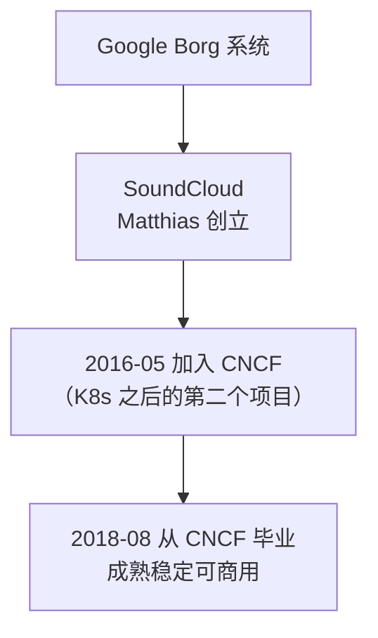
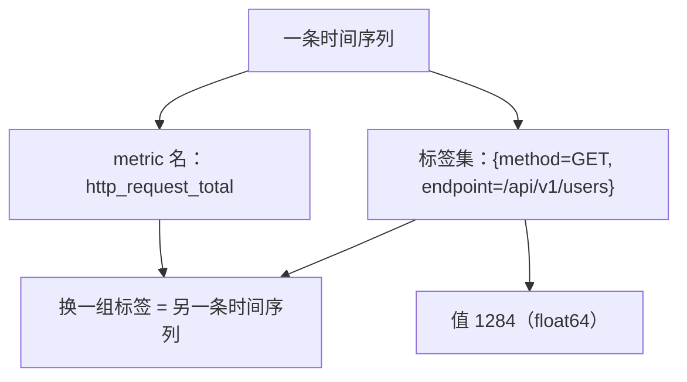
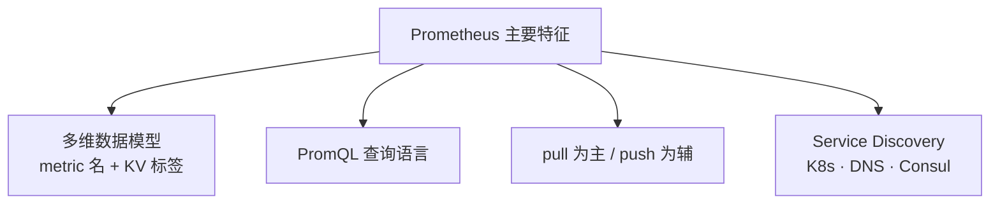
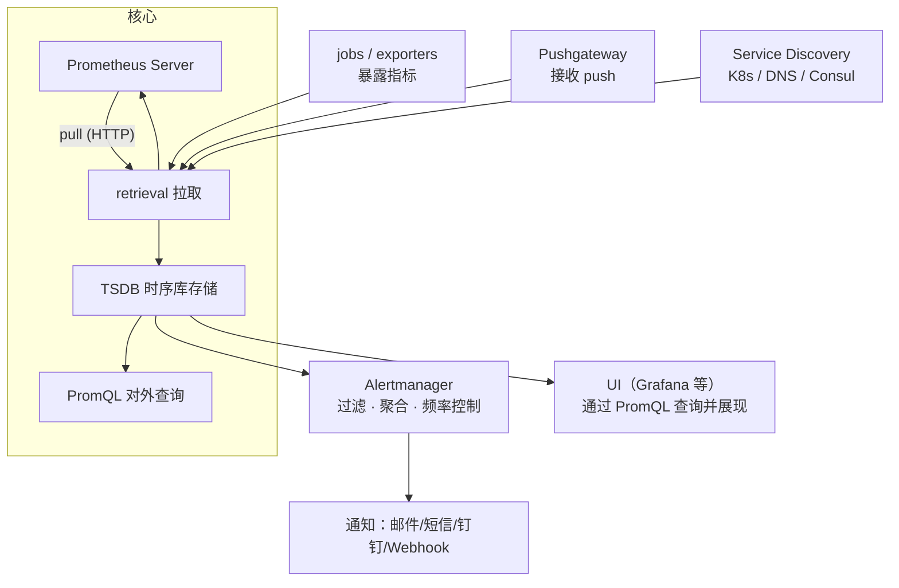
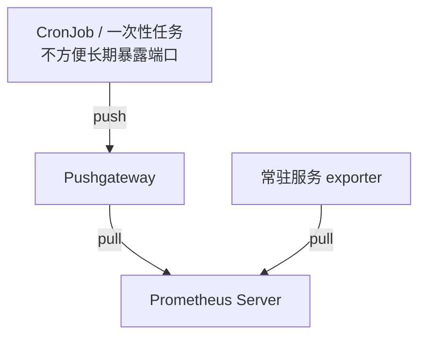
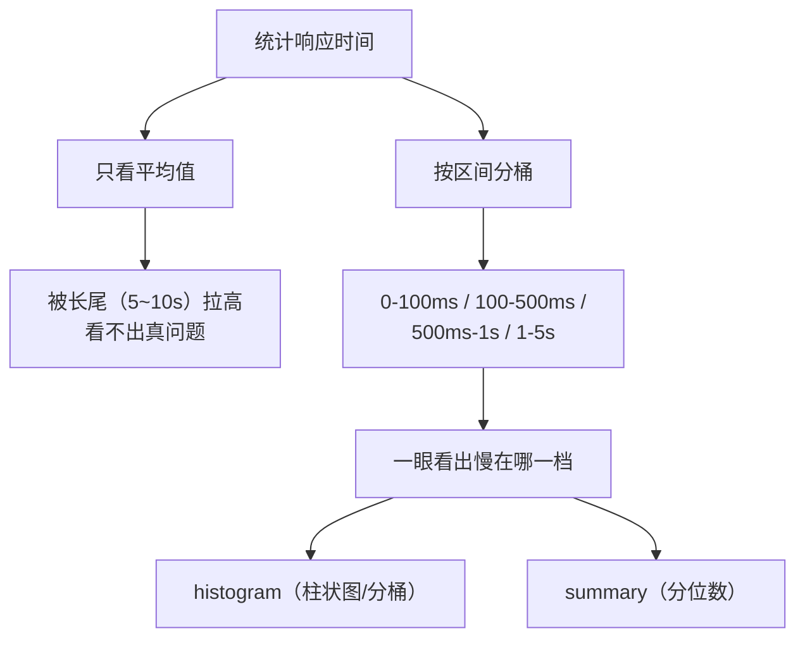
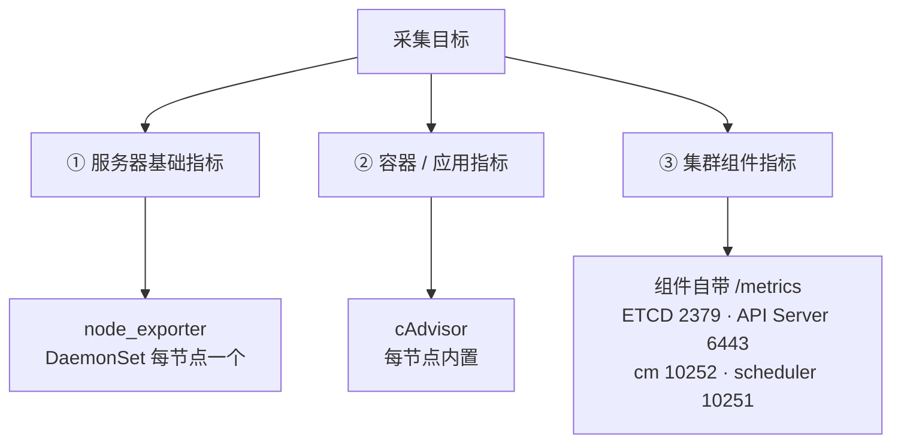
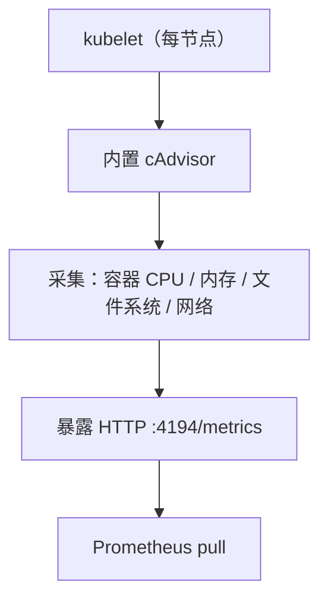

# Kubernetes 生产实践: Prometheus 的架构组件与四种指标类型

这一节认识 Prometheus。

结论先给：**Prometheus 不是一个单独的服务，而是一系列服务的组合；核心是 Prometheus Server（pull 拉取 → TSDB 存储 → PromQL 对外查询），其它组件都是围绕这个核心：exporter 暴露指标、Pushgateway 收 push、Service Discovery 动态发现、Alertmanager 管告警、多套 UI 展现。指标类型四种：`counter`（只增）、`gauge`（可增可减）、`histogram`（分桶直方图，类似柱状图）、`summary`（分位数，类似 99 线）。K8s 三层采集的落地件就是：节点 `node_exporter`（DaemonSet）、容器 `cAdvisor`、集群组件自带 `/metrics`。**

## 纲要

- Prometheus 的来历与 CNCF 毕业
- 它是什么：一系列服务的组合
- 特征一：多维数据模型（metric + labels）
- 特征二：PromQL 查询语言
- 特征三：pull 为主、push 为辅
- 特征四：K8s 服务发现
- 架构图：Server / exporter / Pushgateway / SD / Alertmanager / UI
- 数据类型：counter 与 gauge
- 长尾问题与 histogram / summary
- histogram vs summary 的区别（分位数）
- 怎么达到 K8s 监控目标：三层采集
- `node_exporter` 与 cAdvisor
- 集群组件自带 metrics 端口

## 正文

曾几何时 Kubernetes 的监控体系非常繁杂，社区中也有很多方案，**但随着时间的发展，类似的监控已经演变成以 Prometheus 项目为核心的一套统一方案。**

## Prometheus 的来历

**Kubernetes 最初源自于 Google 的 Borg 系统。同样，Prometheus 也是从曾经开发过 Borg 系统的 Google 工程师的想法发展而来** —— 当时有一位叫 **Matthias** 的工程师离开谷歌去了 SoundCloud，**创立了 Prometheus 项目**。

- **2016 年 5 月，Prometheus 正式加入 CNCF，稳坐 CNCF 基金会第二个项目**（第一个是 Kubernetes）；
- **把近两年多的时间，在 2018 年 8 月正式从 CNCF 毕业** —— 说明这个项目已经具备一定的成熟和稳定性，**可以放心地将它集成在商业平台中**；
- Kubernetes 从 CNCF 毕业之后，被投入生产的速度也加快了不少。



## 它是什么

**首先它不是一个个单独的服务，而是一系列服务的组合。** 具体都包括哪些服务后面讲。

**它的作用主要是用于监控系统和服务，包括但不限于 Kubernetes 集群的监控、还有 Docker 的监控。**

- **它支持静态配置监控目标，也支持很多动态的服务发现**；
- **对 SpringBoot 的支持也很好** —— 你可以引入一个 Prometheus 插件，**就可以让 SpringBoot 服务自动纳入 Prometheus 的监控**。

## 特征一：多维数据模型

**首先它具有由 metric 名称 + KV 标识的多维数据模型。**

看例子，每一行就是一条数据：

```text
http_request_total{method="GET",endpoint="/api/v1/users"} 1284
http_request_total{method="POST",endpoint="/api/v1/users"} 96
http_request_total{method="GET",endpoint="/api/v1/orders"} 512
```

- **`http_request_total` 表示的就是 metric 的名字**；
- **后面括号里的 `method` 和 `endpoint`，就是具体的 KV（标签）**；
- **每一个名字加上不同的 KV 组合，都是一条单独的时间序列。**



## 特征二：PromQL

**它还提供了一个灵活的查询语言叫 PromQL。** 可以想象一下数据库 SQL，**PromQL 也是类似的意思，是 Prometheus 专用的查询语言，非常强大、非常高效。**

比如基于上面的例子，用一条非常简单的查询：

```promql
http_request_total{method="GET"}
```

**就是把 metric 名叫 `http_request_total`、带有 `method="GET"` 标签的数据全部查询出来。**

## 特征三：pull 为主、push 为辅

**虽然 Prometheus 的设计是通过 pull 的方式主动获取数据，但它也为 push 提供了支持 —— 这两种方式都可以去添加数据。**

## 特征四：K8s 服务发现

**它支持基于 Kubernetes 的服务发现，动态配置 Kubernetes 相关组件。** 除了 K8s 以外还支持 **DNS、Consul** 等等 —— **就是说它对这些系统做了更深层的开发，进入到了系统内部去支持它们的一些服务发现机制。**



## 架构设计

**Prometheus 由很多个组件组成，其中有很多组件也是可选的。**



**核心组件就是这个 Prometheus Server，它用 pull 的方式去从各个地方拉取数据。**

- 这个过程就是 **retrieve（数据拉取）**；
- 拉回来之后有一个 **storage 存储，数据保存在 TSDB 时间序列数据库里**；
- 数据存储之后，**通过 PromQL 对外提供强大的查询支持**。

**有了这个核心之后，其他组件都是围绕着这个核心展开的。**

### jobs / exporters

**它就是用来暴露指标，让 retrieval 来抓取的。通俗来说干两个事：**

1. **想方设法去采集到想要的数据**；
2. **提供一个对外的 HTTP 接口，可以拿到采集的数据**。

**前面讲过的那个 `node_exporter`，就是 exporter 其中的一种。**

### Pushgateway

**上面这一块是 Pushgateway，支持通过 push 的方式将指标数据推送到这个网关。**

**比如有一些定时任务，或者是一些一次性执行的任务，就可以采用这种主动 push 的方式**。然后同样对于 Prometheus Server 来说，**它也是通过 pull 的方式从这个 gateway 里拉数据回来**。



### Service Discovery

**就是 Prometheus 支持的服务发现，第二条列的就是 Kubernetes，除了 K8s 以外还支持 DNS、Consul 等。**

### Alertmanager

**右上方是 Alertmanager —— 当 Prometheus 定义的规则被触发之后，就会把报警信息 push 给 Alertmanager。**

在 Alertmanager 里**支持自定义的报警规则，对报警做过滤、做聚合、对报警的频率做控制**等等，然后实现报警的通知。**通知也支持多种方式，也可以发送到指定的 HTTP 接口去实现对报警的自定义处理。**

### UI

**右下方表明 Prometheus 可以对接多种 UI 展现，最常见的还是 Grafana。UI 的实现主要就是通过 PromQL 去对 Prometheus 里面的数据做查询，然后做一个丰富的、漂亮的展现。**

| 组件 | 是否可选 | 职责 |
| --- | --- | --- |
| **Prometheus Server** | **核心** | pull 拉取 → TSDB → 供 PromQL 查询 |
| jobs / exporters | 可选 | 采集数据 + 暴露 HTTP 指标接口 |
| **Pushgateway** | 可选 | 收一次性任务/定时任务的 push |
| **Service Discovery** | 可选 | K8s / DNS / Consul 动态发现目标 |
| **Alertmanager** | 可选 | 过滤、聚合、频率控制、多通道通知 |
| UI（Grafana） | 可选 | 用 PromQL 查询并图形化展现 |

## 数据类型

**知道了 metric 是由「metric 名字 + KV 对」组成的，那 value 呢？其实很简单，就是一个 float64 类型的数值。这个值一般放什么数据？**

```text
指标数据的组成

  http_request_total{method="GET"} 1284
  └─────────────── 标签集 ───────────────┘ └ value: float64
```

### counter 与 gauge

**第一种是 `counter`，用于记录累计的值，这个值会一直增加，不会减少** —— 比如请求的次数、异常发生的次数。

**第二种是 `gauge`，常规数值，可以变大、可以变小** —— 比如内存的变化、磁盘的变化、CPU 负载的变化。**这两种都比较好理解。**

### 长尾问题

**除了这两种之外，Prometheus 还分别定义了 `histogram` 和 `summary` 的指标类型。这两种主要用于统计和分析样本的分布情况。**

**在大多数情况下，我们会使用某些量化指标的平均值** —— 比如 CPU 的平均使用率、页面的平均响应时间。**但这种方式有个明显的问题：**

> 比如有一个折线图，大多数的 API 请求都维持在 100 毫秒以内，而个别请求响应时间可能要 5 秒到 10 秒 —— **这就导致这个平均时间并不能体现出真的问题。**

**这种现象通常被称为长尾问题。为了区分开是平均时间还是长尾这种情况，最简单的处理方式就是按照请求的延迟范围进行分组：**

- 0 ~ 100 毫秒，请求有多少个？
- 100 ~ 500 毫秒，请求有多少个？
- 500 毫秒 ~ 1 秒，有多少个？
- 1 ~ 5 秒，有多少个？

**通过这种方式就可以快速分析系统慢的原因。`histogram` 和 `summary` 就是为了解决这样的问题而存在的 —— 通过这两种指标，可以快速了解样本的分布情况。**



### histogram vs summary

**它们俩的主要区别：`histogram` 类似于一个柱状图（直方图），就是我们刚才说的先定好区间，然后统计每个区间的个数；`summary` 是一个分位数 —— 就是说样本排序之后，第几个的值是多少。**

**这个意思就跟 99 线是一样的，了解流水线的同学对这个肯定比较熟悉。**

| 类型 | 语义 | 典型场景 | 产出示例 |
| --- | --- | --- | --- |
| **counter** | 只增不减的累计值 | 请求总数、错误总数 | `http_requests_total` |
| **gauge** | 可增可减的瞬时值 | 内存、磁盘、队列长度 | `node_memory_MemAvailable_bytes` |
| **histogram** | **分桶直方图**，先定区间统计个数 | **响应时长分布、请求大小分布** | `http_request_duration_seconds_bucket` |
| **summary** | **分位数**（样本排序后第 N 个） | **99 线 / P95 延迟** | `http_request_duration_seconds{quantile="0.99"}` |

```mermaid
flowchart LR
    A["样本分布统计"] --> B["histogram<br/>分桶计数<br/>{le=\"0.1\"} / {le=\"0.5\"} …"]
    A --> C["summary<br/>分位数<br/>{quantile=\"0.99\"}"]
```

## 怎么达到 K8s 的监控目标

**了解了 Prometheus 之后，看看它是如何达到我们对 Kubernetes 的监控目标的 —— 也就是每一种需要的数据，如何实现采集。**



### ① 服务器技术指标：`node_exporter`

**首先服务器的技术指标，Prometheus 提供了一个叫做 `node_exporter` 的工具。前面也提到过，一般我们使用 DaemonSet 的方式把它运行在每台主机上。**

它的作用就是抓取节点的信息，**比如 load、CPU、内存、磁盘、网络等等相关的机器技术指标信息，然后它内置了一个 HTTP 服务来给 Prometheus 提供数据。**

**`node_exporter` 是 Prometheus 的一个子项目**，可以在 GitHub 上查看（github.com/prometheus），里面有一个子项目叫 `node_exporter` 就是它。**我们可以看到它提供的指标在这里列出来了 —— `enabled by default` 默认就提供这么多的指标**，感兴趣可以自己去详细看，包括各种各样的系统相关信息。

```bash
kubectl apply -f node-exporter-ds.yaml      # DaemonSet，每台主机一个
curl -s localhost:9100/metrics | head
# node_load1 0.42
# node_cpu_seconds_total{...} ...
# node_memory_MemAvailable_bytes ...
```

### ② 容器指标：`cAdvisor`

**第二个，具体服务在 K8s 中都是以容器的形式运行的，所以要采集的就是每个容器本身的数据。这个 Prometheus 替我们准备好了 —— 在每一个节点上，我们都会有一个 kubelet 服务，这个服务启动的时候会内置一个 cAdvisor，cAdvisor 就负责采集容器的详细信息：**

- **容器的 CPU**
- **容器的文件系统**
- **容器的内存**
- **容器的网络**

**最后它也会启动一个 HTTP 服务供 Prometheus 去提供数据。**



### ③ 集群组件：自带 `/metrics`

**最后集群本身的各个组件。集群中的组件有哪些？存储组件 ETCD、主节点上的 API Server、controller-manager、scheduler，worker 节点上的 kubelet —— 它们都是集群中的组件。**

**- ETCD 在 2379 端口提供了 metrics；API Server 在 6443 上提供了 metrics；controller-manager 是在 10252 上提供了 metrics；scheduler 在 10251 这个端口提供了 metrics。**

| 组件 | metrics 端口 | 备注 |
| --- | --- | --- |
| **ETCD** | **2379** | 通常只监听 127.0.0.1，需配 `--metrics-secure=false` 等才可被抓 |
| **API Server** | **6443** | kube-apiserver 进程暴露 |
| **kube-controller-manager** | **10252** | 默认只绑 127.0.0.1，通常加 `--bind-address` / 用 readiness 端口 |
| **kube-scheduler** | **10251** | 同上 |
| kubelet / cAdvisor | 10250（只读认证）/ 4194（cAdvisor） | 由 cAdvisor 提供容器指标 |

**我们发现每一个 Kubernetes 相关的组件都自带了 metrics，所以就非常简单了 —— 我们只需要去想办法让 Prometheus 定期把数据抓回来就好了。**

> ⚠️ 这几端口在二进制部署里默认只绑 `127.0.0.1`，Prometheus 抓不到是**最常见的坑**，需要配合组件的 `--bind-address=0.0.0.0` 或 manager 的 `--port`/` secured port` 配置。kubeadm 部署的 manager/scheduler 默认走 10257/10259 的 HTTPS 端口。

**原理和架构了解了，数据如何传给 Prometheus 的大方向也把握好了，异常报警和数据展现也知道有哪些组件管理、如何对接。接下来就是把这一整套服务部署起来，按预期方式提供监控报警的能力。**

## API 速览

| 能力 | 说明 |
| --- | --- |
| Prometheus Server | 核心：**pull 拉取 → TSDB 存储 → PromQL 查询** |
| 数据获取方式 | **pull 为主**，同时支持 **push**（经 Pushgateway） |
| 数据模型 | `metric名 + KV 标签集`，**一组标签 = 一条时间序列**，值为 float64 |
| 查询语言 | **PromQL**（类似 SQL，可 `http_request_total{method="GET"}` 过滤） |
| exporter | 采集数据 + 暴露 HTTP 指标接口 |
| node_exporter | **节点指标（load/CPU/内存/磁盘/网络），DaemonSet 部署** |
| cAdvisor | **容器内嵌 kubelet**，采集容器 CPU/内存/文件系统/网络 |
| Pushgateway | 收**定时任务 / 一次性任务**的 push 数据 |
| Service Discovery | **K8s / DNS / Consul** 等动态发现 |
| Alertmanager | 规则触发后 push 给它，**过滤 / 聚合 / 频率控制 / 多通道通知** |
| UI | Grafana 等，用 **PromQL** 查询并展现 |
| **counter** | 只增不减（请求次数、异常次数） |
| **gauge** | 可增可减（内存、磁盘、CPU 负载） |
| **histogram** | **分桶直方图**，先定区间统计个数，看分布 |
| **summary** | **分位数**（P95 / 99 线），样本排序后第 N 个的值 |
| 长尾问题 | 平均值被个别慢请求拉高，**用 histogram/summary 看分布** |
| 集群 metrics 端口 | ETCD 2379 / API Server 6443 / controller-manager 10252 / scheduler 10251 |

## Demo 示例

把三层采集跑通：

```bash
# ① 节点指标：DaemonSet 铺满所有节点
kubectl apply -f node-exporter-ds.yaml
kubectl get pod -n monitoring -o wide

# ② 容器指标：kubelet 自带 cAdvisor（默认 4194）
curl -s localhost:4194/metrics | grep -E "container_cpu_usage_seconds_total|container_memory_usage_bytes"

# ③ 集群组件：确认这些端口能抓到（打不开就是只绑了 127.0.0.1）
curl -sk https://localhost:6443/metrics | head
curl -s  http://localhost:2379/metrics | head
curl -s  http://localhost:10252/metrics | head
curl -s  http://localhost:10251/metrics | head

# ④ 让 Prometheus 抓：scrape 配置里用 kubernetes_sd_configs
```

**Prometheus 抓取配置（对应"服务发现动态配置 K8s 组件"）：**

```yaml
global:
  scrape_interval: 10s          # 定时采集，与上一节讲的采集节奏一致
  evaluation_interval: 10s

scrape_configs:
  # 节点：从 node-exporter 的 9100 抓
  - job_name: 'kubernetes-nodes'
    kubernetes_sd_configs:
      - role: node
    relabel_configs:
      - source_labels: [__address__]
        regex: '(.*):10250'
        target_label: __address__
        replacement: '$1:9100'

  # 容器：kubelet 的 cAdvisor
  - job_name: 'kubernetes-cadvisor'
    kubernetes_sd_configs:
      - role: node
    relabel_configs:
      - source_labels: [__address__]
        regex: '(.*):10250'
        target_label: __address__
        replacement: '$1:4194'

  # Pod：让 SpringBoot 这类业务 Pod 自动纳入
  - job_name: 'kubernetes-pods'
    kubernetes_sd_configs:
      - role: pod

  # 集群组件
  - job_name: 'kubernetes-apiservers'
    kubernetes_sd_configs:
      - role: endpoints
    scheme: https
    tls_config:
      insecure_skip_verify: true
    bearer_token_file: /var/run/secrets/kubernetes.io/serviceaccount/token
```

**用 PromQL 看四种类型的数据：**

```promql
# counter：累计请求数（只增）
sum(rate(http_requests_total[5m]))

# gauge：当前可用内存（可增可减）
node_memory_MemAvailable_bytes / node_memory_MemTotalBytes * 100

# histogram：分桶看分布，定位长尾
histogram_quantile(0.99, sum(rate(http_request_duration_seconds_bucket[5m])) by (le))

# summary：直接看分位数
http_request_duration_seconds{quantile="0.99"}

# 长_tail 的直观写法：慢请求占比
sum(rate(http_request_duration_seconds_bucket{le="0.1"}[5m]))
/ sum(rate(http_request_duration_seconds_count[5m]))
```

```bash
# 验证
curl -s 'localhost:9090/api/v1/query?query=up'
curl -s 'localhost:9090/api/v1/query?query=sum(rate(http_requests_total[5m]))'
```

### 总结

- **Prometheus 不是单个服务，而是一系列服务的组合；核心是 Prometheus Server（pull 拉取 → TSDB 时序库 → PromQL 对外查询），其余组件（exporter / Pushgateway / Service Discovery / Alertmanager / UI）都围绕这个核心。**
- **2016 年 5 月加入 CNCF（K8s 之后第二个项目），2018 年 8 月毕业** —— 从 CNCF 毕业说明它已成熟稳定，可放心集成到商业平台。
- **多维数据模型：`metric 名 + KV 标签集`，一组标签 = 一条独立时间序列，值是 float64；查询靠 PromQL（类似 SQL，如 `http_request_total{method="GET"}`）；获取方式 pull 为主、push 为辅（Pushgateway 收定时任务/一次性任务）。**
- **四种指标类型：`counter` 只增（请求数/错误数）、`gauge` 可增可减（内存/磁盘/负载）、`histogram` 先定区间分桶统计个数（类似柱状图）、`summary` 给分位数（99 线）；只看平均值会遇到长尾问题 —— 多数请求 100ms 内、个别 5~10s，平均值完全掩盖真相，必须用 histogram/summary 看分布。**
- **K8s 三层采集的落地件：节点用 `node_exporter`（DaemonSet，9100）、容器用 kubelet 内置的 cAdvisor（4194）、集群组件自带 `/metrics`（ETCD 2379 / API Server 6443 / controller-manager 10252 / scheduler 10251）—— 只需让 Prometheus 定期抓回来即可；注意 manager/scheduler 这类端口在二进制部署里常只绑 127.0.0.1，抓不到是常见坑。**

