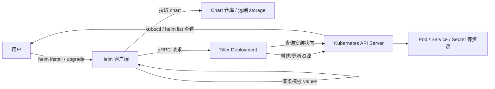
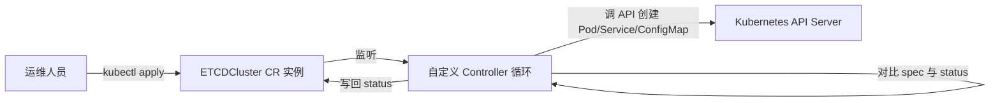

## 纲要

- Prometheus 体系有四种部署方案，从手动部署一路演进到 Helm + Operator
- Helm 是 Kubernetes 的包管理器，对应 Linux 上的 apt / yum，核心概念是 chart
- Helm 架构由客户端、chart 仓库、Tiller 服务端三部分组成，Tiller 才是真正与 API Server 对话的组件
- 安装 Helm 客户端：下载二进制、解压、放到 `/usr/local/bin`、配置 PATH、验证 client version
- 安装 Tiller：以 Deployment 方式跑在集群内，需要指定镜像源、repo 地址、并且用 ServiceAccount 授权
- Tiller 必须有权限，做法是建 ServiceAccount `tiller` 并绑定 `cluster-admin`，空口讲权限不如给集群管理员角色
- Operator 的本质：CRD 自定义资源 + 自定义控制器循环，替代 StatefulSet 去做有状态服务的编排
- 这一节先把 Helm 和 Operator 两个前置概念打牢，下一节才动手用 Helm 拉起 Prometheus 全家桶

## 为什么要先理一遍部署方案

上一节画完了 Prometheus 的架构图，会发现要真正把这套体系跑起来，要准备的东西特别多。社区上常见的部署方案本身就给人一种眼花缭乱的感觉，所以在动手之前，先把「都有哪几条路可以走」理清楚，比一上来就敲命令重要得多。

| 方案 | 做法 | 优点 | 代价 |
| --- | --- | --- | --- |
| 手动部署 | 每个组件自己写配置、自己起、自己做高可用 | 每个细节都可控，排查问题时心里有数 | 要懂每个组件怎么配、怎么协同、怎么高可用，复杂度最高 |
| Helm 部署 | 用 chart 把 Prometheus 及依赖组件一次性拉起 | 比手动简单很多，一条命令装一套 | 装完之后仍有大量配置、调优、额外组件要自己处理 |
| Prometheus Operator | 用 Operator 机制托管 Prometheus 的部署与管理 | 在更深一层做生命周期管理，方案更优雅 | 上手成本不低，自己要做的事情仍然不少 |
| Helm + Operator | 用 chart 装 Operator，再由 Operator 管 Prometheus | 既优雅又完整，生产环境主流 | 前提是先搞懂 Helm 和 CRD/Operator 两套东西 |

第三、第四种方案里反复提到的那个词是 Operator。之所以说它「更深一层」，是因为它利用了 Kubernetes 的 Operator 机制，本质上是 CRD 加自定义控制器。具体原理这一节最后会讲，先把 Helm 这环补上。

结论其实很直白：想要 Helm + Operator 这套方案，必须先付出一点代价——搞清楚 Helm 是怎么装、Tiller 是怎么被授权的，以及 Operator 靠什么干活。

## Helm 是什么

很多同学用过 Ubuntu 下的 `apt-get`，或者 CentOS 下的 `yum`。这两个都是 Linux 的包管理工具，它们维护着各个包的信息以及包与包之间的依赖关系，用户只要一条命令就能完成软件包的查找、安装、升级、卸载。

Helm 就是 Kubernetes 世界里的 apt 或 yum，它是 Kubernetes 的包管理器。

- 对应用发布者而言：可以用 Helm 打包应用、管理应用的依赖关系，让别人用起来更简单
- 对使用者而言：用了 Helm 之后不用再去自己写这一大堆 Kubernetes 应用配置，一条命令就能从 chart 仓库把应用下载并部署好

### chart 是什么

对 Kubernetes 来说，每一个软件包我们称之为一个 **chart**。chart 本质上就是一个目录，里面按约定的目录结构和约定的文件名存放着 Kubernetes 资源相关的 yaml 文件。为了方便分发，一般会把这个目录打包成一个 `.tgz` 文件存起来。

一个典型的 chart 目录结构是这样的：

```text
prometheus/
├── Chart.yaml          # chart 的元数据：名字、版本、appVersion、维护者
├── values.yaml         # 默认值，安装时覆盖这些值就能改配置
├── templates/          # 模板目录，里面的 yaml 用 Go template 语法渲染
│   ├── deployment.yaml
│   ├── service.yaml
│   ├── rbac.yaml
│   └── NOTES.txt
└── charts/             # 依赖的子 chart
```

## Helm 架构是怎么运作的

撑起这套东西一共四个角色，理解它们之间的关系，后面排查问题就有抓手了。

| 组件 | 形态 | 职责 |
| --- | --- | --- |
| Helm 客户端 | 二进制文件，跟 apt 一个性质 | 接收用户命令，渲染模板，管理 chart |
| Chart 仓库 | 远端存储（一个 HTTP 服务） | 存放各种 chart 软件包，并提供包的文件清单供客户端查询 |
| 本地仓库 | 本地目录 | 下载下来的 chart 存在本地；Helm 也支持管理多个不同的仓库 |
| Tiller | Helm 的服务端 | 接收 Helm 的请求，根据对应 chart 生成 Kubernetes 部署配置，再提交给 Kubernetes 创建应用 |

一句话概括：**Tiller 是 Helm 和 Kubernetes 之间的桥梁**。客户端负责「想」，Tiller 负责「做」。



## 动手安装 Helm

这一节的参考文档是 `deepinrelease` 项目里 `12-monitor` 目录下的 `helm.md`，按着它一步一步来就行。

### 第一步：安装 Helm 客户端

客户端就是一个二进制文件，下载下来解压即可。

- 能科学上网的，直接到 release 页面挑喜欢的版本下载
- 不能科学上网的，用同一个版本 **v2.13.1**，解压开之后把里面的二进制文件放到 `/usr/local/bin`

放好之后如果没配环境变量，需要把 `/usr/local/bin` 加进 PATH。配置完简单验证一下：

```bash
# 解压并把二进制放到系统目录
tar -zxvf helm-v2.13.1-linux-amd64.tar.gz
cp linux-amd64/helm /usr/local/bin/helm

# 配置环境变量（没配过的同学）
export PATH=$PATH:/usr/local/bin

# 验证版本
helm version --client
```

输出里能看到 client 的版本是 `v2.13.1`，说明客户端装好了。此时大概率会看到一行 `couldn't find tiller`，这不是报错，只是提醒还没找到服务端——因为 Tiller 还没装。

### 第二步：安装 Tiller

Tiller 是以 Deployment 的方式部署在 Kubernetes 集群里的。这里有两个坑：

1. Helm 默认会去 `storage.googleapis.com` 拉镜像，国内环境拉不到，必须自己指定一个可用的镜像地址
2. 官方 repo 地址同样访问不畅，需要指定到阿里云的 stable repo 地址，另外再添加一个仓库

```bash
# 指定自己可用的镜像来装 Tiller，这条命令比较长
# 先给变量赋值，例如：
# TILLER_IMAGE_REPO=registry.cn-hangzhou.aliyuncs.com/imooc
# STABLE_REPO_URL=https://kubernetes-charts.storage.googleapis.com
# CHARTS_URL=https://mirrors.aliyun.com/kubernetes/charts
helm init \
  --tiller-image=<你的镜像仓库>/tiller:v2.13.1 \
  --stable-repo-url=https://aliyunctl.oss-cn-beijing.aliyuncs.com/charts \
  --service-account=tiller

# 加仓库并刷新索引，速度很快
helm repo add aliyun https://kubernetes.oss-cn-hangzhou.aliyuncs.com/charts
helm repo update
```

### 第三步：给 Tiller 授权

Tiller 要干的事非常多，它得跟 Kubernetes 打交道、帮我们部署各种各样的环境组件，所以需要非常多的权限。创建一个 ServiceAccount 叫 `tiller`，然后创建角色绑定，对应的角色直接用 `cluster-admin`，也就是集群管理员的角色：

```yaml
---
apiVersion: v1
kind: ServiceAccount
metadata:
  name: tiller
  namespace: kube-system
---
apiVersion: rbac.authorization.k8s.io/v1
kind: ClusterRoleBinding
metadata:
  name: tiller
roleRef:
  apiGroup: rbac.authorization.k8s.io
  kind: ClusterRole
  name: cluster-admin
subjects:
  - kind: ServiceAccount
    name: tiller
    namespace: kube-system
```

注意这里 `roleRef` 用的是 `rbac.authorization.k8s.io/v1` 这个分组版本，不是 `v1` 核心组。

### 第四步：验证

```bash
# 看 Deployment 起来了没
kubectl get deploy -n kube-system -l app=helm,name=tiller

# 看配置里的 ServiceAccount 是不是 tiller
kubectl get deploy tiller-deploy -n kube-system -o yaml | grep serviceAccount

# 看 Pod 是不是正常启动并通过健康检查
kubectl get pod -n kube-system | grep tiller

# 客户端 + 服务端版本都打印出来才算通
helm version
```

`helm version` 同时打出 client 和 server 两行版本号，就说明整套环境搭起来了，下一节可以直接用了。

## Operator 又是什么

Operator 这个词直译是「操作者」，起得挺形象。

前面我们学了很多种资源：Pod、Deployment、Service、DaemonSet、StatefulSet……它们都是 Kubernetes 预先定义好的资源，也有自己的控制器在管理。那这些控制器的本质是什么呢？就是一个代码循环——不停地去看「预期状态」与「真实状态」的差别，然后努力让两者保持一致。

举个很直白的例子：一个 Deployment 我们定义实例数是三，现在集群里只有一个实例，控制器就会发现这个差别，然后启动两个实例达到一致。

Kubernetes 从 1.7 之后就支持了 CRD（Custom Resource Definition），也就是自定义的资源类型。Operator 本质上就是利用了 CRD 自定义资源类型，加上自定义控制器，来实现这个「操作者」的能力。

比如下面这张图（示意图）里，我可以先定义一个类型叫 `ETCDCluster`，再对应地去开发一个控制器。在控制器的循环代码里，我就能拿到当前这个 `ETCDCluster` 的配置，然后通过调用接口去实现一个「预期的 ETCD 集群创建」的过程。



由于具体的 Pod 配置和创建过程都是在自定义控制器里完成的，所以 Operator 也能够胜任类似 StatefulSet 的工作。而且它是针对特定服务定制的，完成得比通用 StatefulSet 更优雅。

当然难点也就在这里——怎么去开发这个自定义控制器。这一节不研究那么深，只要把原理搞明白就够用。CRD 这一块网上的学习资料也很丰富，感兴趣可以自己往里钻。

### Operator 和 StatefulSet 的分工

| 维度 | StatefulSet | Operator |
| --- | --- | --- |
| 通用性 | 通用工作负载，任何有状态应用都套用 | 针对特定服务定制（如 ETCDCluster、Prometheus） |
| 能力边界 | 只管副本数、稳定 DNS、稳定存储 | 能处理备份、扩容缩容、故障切换、版本升级等运维动作 |
| 控制器来源 | Kubernetes 内置 | 第三方实现的自定义控制器 |
| 上手成本 | 低，写 yaml 就行 | 高，需要懂 CRD 和控制器开发 |

## API 速览

| 能力 | 做法 | 关键参数 / 资源 |
| --- | --- | --- |
| 查 Helm 版本 | `helm version` | `--client` 只看客户端 |
| 初始化 Helm 与 Tiller | `helm init` | `--tiller-image`、`--stable-repo-url`、`--service-account` |
| 添加 chart 仓库 | `helm repo add` | 仓库名 + 仓库地址 |
| 刷新仓库索引 | `helm repo update` | — |
| 部署应用 | `helm install` | chart 名 + `--values` 覆盖配置 |
| 给 Tiller 授权 | 建 ServiceAccount + ClusterRoleBinding | 角色直接用 `cluster-admin` |
| 自定义资源类型 | 定义 CRD + 写控制器 | `rbac.authorization.k8s.io/v1` 下的 ClusterRole/Binding |
| 看 Tiller 状态 | `kubectl get deploy/pod -n kube-system` | 标签 `app=helm,name=tiller` |

## Demo 示例

把整套流程串一遍，最后应该得到这个样子：

```bash
# 1. 客户端就绪
helm version --client       # 输出 v2.13.1

# 2. 装 Tiller（镜像与 repo 换成自己能拉到的）
# 先给变量赋值，例如：
# TILLER_IMAGE_REPO=registry.cn-hangzhou.aliyuncs.com/imooc
# STABLE_REPO_URL=https://kubernetes-charts.storage.googleapis.com
# CHARTS_URL=https://mirrors.aliyun.com/kubernetes/charts
helm init \
  --tiller-image=$TILLER_IMAGE_REPO/tiller:v2.13.1 \
  --stable-repo-url=$STABLE_REPO_URL \
  --service-account=tiller

# 3. 补一个仓库并刷新
helm repo add aliyun $CHARTS_URL
helm repo update

# 4. 确认 Tiller 活着
kubectl get pod -n kube-system -l app=helm,name=tiller
helm version                # client 与 server 两行都出

# 5. 装应用（下一节就是这条）
# helm install stable/prometheus --name prom --namespace monitoring
```

集群里的资源结构最终长这样：

```text
kube-system/
├── pod/tiller-deploy-xxxxx          # Helm 服务端，跑着 tiller 进程
├── deployment.apps/tiller-deploy    # 由 helm init 创建
├── serviceaccount/tiller            # 前面建的账号
└── clusterrolebinding/tiller        # 绑到 cluster-admin
monitoring/                          # 下一节的目标命名空间
└── （Prometheus 全家桶将落在这里）
```

常见问题的对应关系：

| 现象 | 原因 | 处理 |
| --- | --- | --- |
| `couldn't find tiller` | 客户端装好了但服务端没起 | 跑一遍 `helm init`，确认镜像能拉到 |
| Pod 一直 `ImagePullBackOff` | 默认去 `storage.googleapis.com` 拉镜像 | 用 `--tiller-image` 指定自己的镜像 |
| Tiller 起完就重启 | 权限不足或镜像不对 | 检查 ServiceAccount 绑定与镜像 tag |
| `helm version` 只有 client 一行 | server 侧没连上 | 看 Pod 日志，核对 `kubeconfig` 与 RBAC |

### 总结

- Prometheus 有四种部署方案，生产推荐 Helm + Operator，但前提是先把 Helm 和 CRD 原理吃透
- Helm 是 Kubernetes 的包管理器，chart 就是一个带约定目录结构的目录，通常打包成 `.tgz` 分发
- Tiller 才是真正落资源的服务端，Helm 客户端只是把模板渲染好交给它；镜像拉不到就换源，权限不够就绑 `cluster-admin`
- Operator = CRD + 自定义控制器循环，靠「比对预期状态与真实状态并持续收敛」来做有状态服务的运维
- 装完先验证 `helm version` 能同时打出 client 与 server 两行，再往下走

