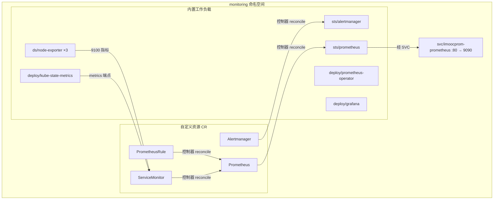

## 纲要

- 官方仓库拉不动、阿里仓库又不更新，所以放弃在线安装，把 chart 克隆到本地离线装
- 克隆 kube-prometheus 仓库，从 `stable/` 里挑出 `prometheus-operator` 拷贝到当前目录
- 装之前会报依赖缺失：kube-state-metrics、prometheus-node-exporter、grafana 三个子 chart 要手动补进 `charts/` 目录
- 装的过程会一次性建出 CRD、ClusterRole/Binding、ConfigMap、Deployment、StatefulSet、DaemonSet、Service 一大堆对象
- Operator 的四个自定义资源：Alertmanager、Prometheus、PrometheusRule、ServiceMonitor
- 镜像拉不到是常态，改 `values.yaml` 里的 image 前缀指向自己的仓库，再 `helm upgrade` 即可热替换
- 最终目标：monitoring 命名空间下所有 Pod 全 Ready，再配一个 Ingress 把 Prometheus Web 暴露出来

## 本来可以一条命令搞定

其实理论上这一步特别简单，一条命令就能把整套 Prometheus 监控体系立起来：

```bash
helm install --name imoocprom stable/prometheus-operator
```

但现实有两个坎：

1. **网络**：访问不到 Google 的 chart 仓库，阿里仓库又很久不更新，拉不到 package
2. **个性化**：本地环境肯定要做定制配置，需要经常调整这些 yaml，在线装完再改很别扭

所以干脆走本地 route：把 chart 下载到本地，用本地方式安装。

## 第一步：把 chart 克隆到本地

执行 `git clone`，地址在 `github.com` 下 `helm` 组织里的 `chart` 项目（`helm/charts`）……实际上要拿到的是 kube-prometheus 这套 chart，对应项目下 `helm` 目录里的一个子项目。

```bash
# 先给变量赋值，例如：CHART_REPO_URL=https://kubernetes-charts-incubator.storage.googleapis.com
# 克隆，内容比较多，慢慢等
git clone $CHART_REPO_URL

# 看当前目录 charts 里有什么
ls charts
# 看到一个 stable 目录，里面是稳定版发行版，有非常多的软件包

# 需要的是 prometheus-operator
cp -r charts/stable/prometheus-operator .
```

打开这个文件夹，就是 Helm 约定俗成的文件组织方式：

- `values.yaml`：整个环境和变量的配置
- `templates/`：主要是 Kubernetes 资源的模板配置

## 第二步：安装并补依赖

```bash
helm install --values values.yaml \
  --name imoocprom \
  --namespace monitoring \
  ./prometheus-operator
```

`--namespace` 指定的命名空间可以不存在，Helm 会自己创建，这里就是 `monitoring`。

很快会返回一个错误：

```text
found in requirement, and its dependency
  charts/ 下没有找到 kube-state-metrics、prometheus-node-exporter 和 grafana
```

这其实侧面对应了这套部署包含的组件。手动把缺的三个补上：

```bash
cp -r charts/stable/kube-state-metrics prometheus-operator/charts/
cp -r charts/stable/prometheus-node-exporter prometheus-operator/charts/
cp -r charts/stable/grafana prometheus-operator/charts/
```

再跑一遍刚才那条 install 命令。这次要创建的东西比较多，不会那么快返回，中途会打印出它创建的一大堆东西：ClusterRole、ClusterRoleBinding、ConfigMap、若干 Deployment、Service，还有自定义的 Prometheus 资源、RoleBinding、Secret……

一瞬间整套监控系统好像就搭起来了。

## Operator 到底建了些啥

刚装完的时候工作原理还是比较懵的，没关系，一点一点切入。首先我们已经知道 Operator 利用的是 Kubernetes 的 CRD，可以通过命令去看一下：

```bash
kubectl get crd
```

一共四种自定义资源类型：

| CRD | 对应组件 | 在架构图里的位置 |
| --- | --- | --- |
| `alertmanager` | Alertmanager 组件 | 告警侧 |
| `prometheus` | Prometheus Server 核心组件 | 架构图最中间 |
| `prometheusrule` | 一系列报警规则 | 规则定义 |
| `servicemonitor` | 各种 exporter 的采集定义 | 架构图左边 |

随便看一个的定义，比如 Alertmanager：

```bash
kubectl describe crd alertmanager
```

输出的类型是 `CustomResourceDefinition`，下面是对这个资源类型的详细描述：每个字段的名字和类型，以及规定 `spec` 里看的必须是 `Alertmanager` 那一套字段。下面是对所有字段的规则定义，相当于这个 yaml 文件元数据的定义，跟普通资源的 `metadata` 是一个意思。内容非常多，挑着看就行。

有了这样的 CRD 之后，Kubernetes 就能根据这个 CRD 的定义去校验你的配置文件是否合法，它也就「认识」我们自定义的配置文件了。

那我们自定义的配置文件在哪儿？看一眼新建的 `monitoring` 命名空间：

```bash
kubectl get pod -n monitoring
kubectl get svc -n monitoring
```

能看到很多 Pod、一些 Service，还有 Deployment、DaemonSet、StatefulSet——但这些都是 Kubernetes 内置类型，并没有看到我们自定义的类型。自定义的要用完整的类型名去查：

```bash
kubectl get alertmanager -n monitoring
kubectl get servicemonitor -n monitoring
```

看一个 Alertmanager 的定义就比较简单了：

```yaml
apiVersion: monitoring.coreos.com/v1
kind: Alertmanager
metadata:
  name: imoocprom-alertmanager   # 名字跟 release 前缀对齐
  namespace: monitoring
spec:
  replicas: 3                    # 副本数
  version: v0.20.0               # 使用的镜像版本
  alertmanagerImage:             # 依赖的镜像名
    repository: quay.io/prometheus/alertmanager
    tag: v0.20.0
  externalUrl: http://alertmanager.imooc.com   # 对外访问地址
```

下面的配置描述了它依赖的镜像、对外访问地址、日志、副本数、使用的 Service 等具体信息。Prometheus Operator 的 controller 就是根据这些信息，去创建出对应的 Alertmanager Deployment、Service 这些 Kubernetes 自带对象。

## 镜像拉不到怎么办

在自己环境里，由于网络原因，很可能有一些镜像下载会失败，这没关系，知道怎么修就行。

```bash
# 第一步：看是哪个镜像
kubectl describe pod <pod名> -n monitoring

# 第二步：到对应的 worker 节点看系统日志，一般能看到拉不到的镜像名
# 镜像名在哪定义？就在 prometheus-operator 目录下的 values.yaml 里
grep -n "image" prometheus-operator/values.yaml
```

比如某个 image 拉不到，修改方式都是一致的：把地址换成自己的仓库，后面的目录和版本不动。

```bash
# 改 values.yaml 里的镜像地址前缀
#   原: k8s.gcr.io/xxx          → 改成 registry.cn-hangzhou.aliyuncs.com/imooc/xxx
#   原: quay.io/xxx             → 改成 registry.cn-hangzhou.aliyuncs.com/imooc/xxx
```

具体升级方法：

```bash
helm upgrade imoocprom ./prometheus-operator \
  -f prometheus-operator/charts/grafana/values.yaml
```

（如果刚才改的是 `charts/grafana/values.yaml`，就这样指定；改的是根目录 `values.yaml` 就别加 `-f`。）

然后看效果：

```bash
kubectl get pod -n monitoring -o yaml | grep -A2 image
```

找一下刚才那个 Grafana，会看到它的 image 已经在重建过程中，也更新成了我们定义的地址。以后遇到类似问题都是这个套路。

另外两个可以预见会出问题的镜像：

1. Grafana 的 `6.1.6` 版本，同样替换成 `registry.cn-hangzhou.aliyuncs.com/imooc` 前缀
2. kube-state-metrics —— 这个镜像不是在主 `values.yaml` 里定义的，得再挖一层：

```bash
# 找到 kube-state-metrics 的 values
find . -name values.yaml | xargs grep -l kubeStateMetrics
# 位置在 charts/kube-state-metrics/values.yaml
```

这里的 `k8s.gcr.io` 仓库肯定是访问不了的，也替换成前面的地址，其余都不用变。然后再像刚才那样重新 upgrade 一次。

## 验收：该有的都有了

最终要达到的效果，跟下面一致——所有 Pod 都处于 Ready 状态：

```bash
kubectl get pod -n monitoring
```

```text
NAME                                                     READY   STATUS    RESTARTS   AGE
alertmanager-imoocprom-alertmanager-0                     1/1     Running   0          5m
grafana-imoocprom-grafana-5f7d9c8b6-x7k2p                 1/1     Running   0          5m
kube-state-metrics-xxxxx                                  1/1     Running   0          5m
node-exporter-xxxxx                                       1/1     Running   0          5m
node-exporter-yyyyy                                       1/1     Running   0          5m
node-exporter-zzzzz                                       1/1     Running   0          5m
prometheus-imoocprom-operator-6c9d8f7b4-h5s2m             1/1     Running   0          5m
prometheus-imoocprom-prometheus-0                         1/1     Running   1          5m
```

更细致地看一下：

```bash
kubectl get deploy -n monitoring
# 三个 Deployment，都以 Helm 名字 imoocprom 开头：
#   kube-state-metrics
#   prometheus-operator（自定义控制器那个 Pod）
#   （Grafana 也在其中）
```

```bash
kubectl get ds -n monitoring
# 一个 DaemonSet：node-exporter，负责采集节点指标
# 每个节点都要跑一个，当前有三个节点，所以起了三个
```

```bash
kubectl get sts -n monitoring
# 两个 StatefulSet：alertmanager 和 prometheus 本身
# 说明它们都支持跑多实例做高可用
```

```bash
kubectl get svc -n monitoring
# alertmanager 有一个 service，clusterIP: None（headless）
# grafana 有一个 service，端口 80
# kube-state-metrics / node-exporter 各有一个
# alertmanager-imoocprom-prometheus-operator / prometheus 本身
```

这些自动创建的东西，还包括角色、权限的定义，全都在这个 `prometheus-operator` 文件夹里描述。就像插件一样，把这个文件夹里的所有东西创建出来，插在集群上。

拔掉也很简单：

```bash
helm delete imoocprom
# 删完之后还要手动删一下 CRD
kubectl delete crd prometheusrules.monitoring.coreos.com
kubectl delete crd alertmanagers.monitoring.coreos.com
kubectl delete crd prometheuses.monitoring.coreos.com
kubectl delete crd servicemonitors.monitoring.coreos.com
```

注意删除之后其实是放到「回收站」里了，可以加上 `--wait` 强制清空，这样在回收站里也看不到。删干净之后再 `helm install`，所有组件会重新跑起来。

整个过程里，我们只要在这些配置文件里调集群属性就行，不需要去改 Kubernetes 自己的配置文件——这种管理方式看起来非常优雅。



## 把 Prometheus 暴露出来

集群都部署起来了，接下来访问一下。先访问最核心的组件——Prometheus 怎么访问？

```bash
kubectl get svc -n monitoring
```

看 Prometheus 那一条，它的详细定义里有 `clusterIP`、有一堆 label，端口叫 `web`，端口 80，容器端口 9090。

集群里已经有 Ingress 了，所以可以给它配一个域名。在 `deepinrelease` 项目的 `12-monitor` 小节的 Ingress 文档里，已经准备好了 Prometheus 的 yaml，跟我们复制的 Service 是一致的，就是一个很普通的 Ingress：

```yaml
apiVersion: extensions/v1beta1
kind: Ingress
metadata:
  name: prometheus
  namespace: monitoring
  annotations:
    nginx.ingress.kubernetes.io/rewrite-target: /
spec:
  rules:
    - host: prometheus.imooc.com
      http:
        paths:
          - path: /
            backend:
              serviceName: imoocprom-prometheus
              servicePort: 80
```

用 `kubectl create` 建好之后，再改一下本地 hosts：

```text
127.0.0.1 prometheus.imooc.com
```

## API 速览

| 能力 | 做法 | 关键参数 |
| --- | --- | --- |
| 本地安装 chart | `helm install -f values.yaml --name X --namespace Y ./dir` | `--name`、`--namespace`、`-f` |
| 装完改配置再生效 | `helm upgrade <release> <chart目录> -f <values>` | `-f` 指定改过的 values |
| 看自定义资源类型 | `kubectl get crd` | 四种：alertmanager / prometheus / prometheusrule / servicemonitor |
| 看自定义资源实例 | `kubectl get <类型> -n monitoring` | 必须带命名空间 |
| 查某个镜像定义在哪个 values | `find . -name values.yaml \| xargs grep -l <key>` | 子 chart 的镜像在 `charts/<子chart>/values.yaml` |
| 定位拉不掉的镜像 | `kubectl describe pod` + 到 worker 节点看日志 | 输出里带 image 全名 |
| 整体卸载 | `helm delete <release>` + 手动删 CRD | CRD 删除走回收站，可加 `--wait` |
| 暴露 Web | 建 Ingress 指向 Service | `nginx.ingress.kubernetes.io/` 注解前缀 |

## Demo 示例

把整套流程串一遍：

```bash
# 1. 拿 chart
git clone $CHART_REPO_URL
cp -r charts/stable/prometheus-operator .
cp -r charts/stable/kube-state-metrics  prometheus-operator/charts/
cp -r charts/stable/prometheus-node-exporter prometheus-operator/charts/
cp -r charts/stable/grafana              prometheus-operator/charts/

# 2. 改镜像（能拉到的除外）
sed -i 's#k8s.gcr.io/#registry.cn-hangzhou.aliyuncs.com/imooc/#g' prometheus-operator/values.yaml
sed -i 's#k8s.gcr.io/#registry.cn-hangzhou.aliyuncs.com/imooc/#g' prometheus-operator/charts/kube-state-metrics/values.yaml
sed -i 's#quay.io/#registry.cn-hangzhou.aliyuncs.com/imooc/#g' prometheus-operator/charts/grafana/values.yaml

# 3. 装
helm install -f values.yaml --name imoocprom --namespace monitoring ./prometheus-operator

# 4. 验收
kubectl get pod -n monitoring
kubectl get ds -n monitoring
kubectl get sts -n monitoring
kubectl get crd

# 5. 暴露
kubectl create -f prometheus-ingress.yaml
echo "127.0.0.1 prometheus.imooc.com" >> /etc/hosts
```

集群最终的资源结构：

```text
monitoring/
├── crd/
│   ├── alertmanagers.monitoring.coreos.com
│   ├── prometheuses.monitoring.coreos.com
│   ├── prometheusrules.monitoring.coreos.com
│   └── servicemonitors.monitoring.coreos.com
├── pod/
│   ├── alertmanager-imoocprom-alertmanager-0
│   ├── prometheus-imoocprom-prometheus-0
│   ├── prometheus-imoocprom-operator-xxxxx
│   ├── grafana-imoocprom-grafana-xxxxx
│   ├── kube-state-metrics-xxxxx
│   └── node-exporter-{n1,n2,n3}
├── deploy.apps/{kube-state-metrics,prometheus-operator,grafana}
├── daemonset.apps/node-exporter
├── statefulset.apps/{alertmanager-imoocprom-alertmanager,imoocprom-prometheus}
├── svc/{alertmanager,imoocprom-grafana,imoocprom-prometheus,...}
└── ingress.extensions/prometheus  →  prometheus.imooc.com
```

| 现象 | 原因 | 处理 |
| --- | --- | --- |
| install 报找不到子 chart | 缺 kube-state-metrics / node-exporter / grafana | 从 `charts/stable/` 拷贝进 `prometheus-operator/charts/` |
| Pod `ImagePullBackOff` | 镜像仓库访问不到 | `describe` 拿到镜像名 → 改 `values.yaml` 前缀 → `helm upgrade` |
| 子 chart 镜像改不到 | 定义在子 chart 自己的 values 里 | `find ... \| xargs grep` 定位后单独改 |
| 卸载后 CRD 还在 | CRD 走回收站 | 手动 `kubectl delete crd` 并加 `--wait` |
| 访问不到 Web | 没建 Ingress 或 hosts 没配 | 建 Ingress 指向 Service，本地 hosts 加解析 |

### 总结

- 仓库拉不动就别硬刚，把 chart 克隆到本地离线装，后面改配置也方便
- 子 chart 是手动补的（kube-state-metrics、node-exporter、grafana），补不补会直接报依赖错误
- 装完最关键的是看懂四个自定义资源，它们是 Operator 的「输入」，也是这套方案优雅的根源
- 镜像问题统一套路：describe 找镜像名 → 改 values 前缀到自己的仓库 → helm upgrade 热替换
- 最后拿 Service 端口（80 → 9090）配 Ingress，配 hosts 就能打开 Prometheus Web

