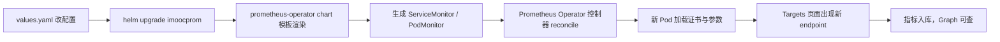

## 纲要

- 打开 Prometheus Web，Graph 页是写 PromQL 做试验场的首选，正式看图交给 Grafana
- Status → Targets 把所有被抓取的 endpoint 全列出来了，up / down、scrape 间隔、labels 一目了然
- relabel 的本质：把 endpoint 的元数据（Pod IP、Pod 名、命名空间、ready 状态）变成指标的标签
- 默认已经抓到的：kubelet、cAdvisor、kube-dns、kube-state-metrics、Grafana、node-exporter、operator、prometheus 自身
- 没抓到的三项：kube-controller-manager、kube-scheduler、etcd——原因是它们是二进制装的，不走 API 服务端发现
- 补的办法在上层 chart 的 `values.yaml` 里：给定 endpoint、port/targetPort，指定后就不用再配 selector 自动匹配
- kube-controller-manager 的 10252 是 HTTPS，values 里默认写的是 HTTP，必须改过来，否则抓不到
- etcd 必须走 HTTPS + 证书，需要一个存着 ca/证书/密钥三个文件的 secret

## 先去 Web 界面看看

上一节集群部署起来了，接着去访问 `prometheus.imooc.com`。

进来就是首页，首页其实就是一个查询页面。在这里可以输入 PromQL 直接查数据，也可以从下拉里选指标；选一个指标，点 **Execute** 执行查询，下面出结果，左边的图表区域会画出数据变化趋势。

比如随便选一个节点的 CPU load，就能看到一条曲线。这个地方平时常用来做 PromQL 的试验：我要展现某个图表、要调整哪些字段、要调整什么判断值，都在这里先试通，再搬到 Grafana 里。图表这块比较简单，一般并不会从这儿看，最终会对接到 Grafana——那一节后面再讲。

## Targets 页面才是重点

还有一个非常重要的入口在 **Status** 下面，叫 **Targets**。这个页面把 Prometheus 当前抓取（scrape）的所有 endpoint 全列出来了。

```text
Endpoint                          State   Labels                          Last Scrape
http://10.15.20.50:10250/me...    UP      1                               13s ago
http://10.15.20.50:10255/metrics UP      job=kubelet                      12s ago
http://10.15.20.50:4194/metrics  UP      job=kubernetes-nodes,cadvisor    15s ago
http://10.15.20.50:9100/metrics  UP      job=kubernetes-nodes             14s ago
https://10.15.20.50:6443/me...   UP       job=apiserver                   11s ago
http://10.15.20.50:9153/metrics  UP       job=kube-dns,coredns            13s ago
http://10.15.20.50:8080/metrics  UP       job=kube-state-metrics          12s ago
http://10.15.20.50:3000/metrics  UP       job=k8s                         13s ago
http://10.15.20.50:9100/metrics  UP       job=kubernetes-nodes-exporter   14s ago
```

一行一个 target，看几处关键信息：

- **State**：`UP` 就是正常，Down 的话后面 Error 列会打出具体原因
- **Last Scrape**：上次抓取距现在多少秒。默认配置一般 30 秒抓一次，到 30 秒它会再抓一次（界面上能看到 24s / 27s / 28s 一路走到 ~469ms 这个量级再归零）
- **Labels**：这个 endpoint 下所有 metric 都带的标签，平时就是靠它做过滤和聚合

### relabel 到底是什么

把鼠标放到某个 target 上，会看到一个 `before relabeling`，这是 Prometheus 自己的概念——relabel。下面列出的这些数据是 endpoint 的一些元数据：Pod 的 IP 地址、类型、名字（`pod_name` 是 web）、当前是否正常（`ready="true"`）、它所在的 namespace 等等，都是元数据。

如果这些元数据对我们有用，有可能想让它作为一个数据的标签，就可以把它 relabel 一下，加入每条数据的 KV 对里。上面看到的那些具体 label，就是通过 relabel 达到的效果。

**没做 relabel 之前是「元数据」，做了 relabel 之后就变成「可查询的标签」。**

### 已经抓到哪些

往下翻，当前已经有很多指标被采集回来了，基本上把我们之前想要监控的东西都覆盖了：

| Target | 端口 | 说明 |
| --- | --- | --- |
| kubelet | 10250 / 10255 | 监控 kubelet 本身的信息 |
| cadvisor | 4194 | 监控当前节点上容器的信息 |
| node-exporter | 9100 | DaemonSet 跑在每个节点上，系统级指标 |
| kube-dns (CoreDNS) | 9153 | 靠服务发现找到的 target 和对外端口 |
| kube-state-metrics | 8080 | 所有命名空间的资源对象信息 |
| apiserver | 6443 | API Server 组件监控 |
| grafana | 3000 | 这次部署自动起的服务 |
| prometheus-operator | — | 控制器自身的监控 |
| prometheus (server) | — | Prometheus 自己监控自己 |

这一大堆里，kube-state-metrics 特别值得好奇它到底是什么。想了解的话很容易：把这个 endpoint 复制出来，在 worker 节点上 `curl` 一下，就能看到它有什么内容——各个 namespace 下的 ConfigMap、`default` 下的 webgame 这个 ConfigMap 的 info、所有资源对象的创建时间……非常多。

对某一类资源，它上面会带注释；遇到不懂的情况可以查注释。当前集群所有资源的情况——Deployment、滚动更新、Labels、Endpoint 和 Pod 的创建时间——特别详细都在这展示。你觉得哪些有用，就可以拿去用。

另外 kubelet 这里要注意一点：10250 这个端口已经不推荐使用了，kubelet 另开了一个 10255 的 HTTP 只读端口，一般监控读的是这个 HTTP 端口。上面那个监控 kubelet 本身，下面这个监控节点上的容器，这两个有本质区别。

至于 node-exporter，就是之前说过的那个 DaemonSet，每个节点一个，里面内容非常多，都是系统相关的指标，就不逐个看了。

### 没抓到的三项

继续往下看，问题就暴露出来了：

- `kube-controller-manager` 显示 0——没发现
- `etcd` 没发现
- `kube-scheduler` 没发现

**为什么没发现？** 因为这三个组件都是用二进制方式安装的，并不是以 Pod 的形式跑在集群里，所以没法通过 Kubernetes 的 API 做服务端发现。所以没发现是正常情况，后面一个一个把它们加上去。

另外 avpiser 那个 target 只有一个，是因为当前主节点是单点状态（另外两台节点已经下调另作他用），所以它发现的地址就是 `10.15.20.50:6443`，发现得是对的。

## 第一个坑：kube-controller-manager

思路很简单：不管监控什么，配置都在 Prometheus Operator 那个目录里做。`prometheus-operator` 目录下的 `values.yaml` 就是入口——所有的创建配置都是靠这个变量文件做模板替换生成的。

打开搜一下 `controllerManager`，果然有一段：

```yaml
kubeControllerManager:
  # 开关：默认 false
  enabled: false
  # 如果 kube-controller-manager 不是以 Pod 方式部署的，直接指定 IP 列表
  endpoint:
    - https://10.15.20.50:10252
  # 指定了 endpoint 之后，只需要指定 port 和 targetPort
  # 下面这两个 selector/pod 自动匹配就不需要了，注释掉即可
  # service:
  #   selector:
  #     k8s-app: kube-controller-manager
  serviceMonitor:
    interval: 30s
    # 这里默认是 http（false），但我们 10252 是 HTTPS
    https:
      scheme: https
      insecureSkipVerify: false
      serverName: kube-controller-manager
      caFile: /etc/kubernetes/pki/ca.crt
      certFile: /etc/kubernetes/pki/controller-manager.crt
      keyFile: /etc/kubernetes/pki/controller-manager.key
```

几个要改的点，逐个看：

1. `endpoint` 上面有注释：当你的 kube-controller-manager 并不是以 Pod 的方式部署的，你可以去指定 IP 列表。我们正是这种情况，所以指定一个 IP 列表，master 是 `10.15.20.50`，只写一个；多个主节点就都写上。如果是以 Pod 方式运行的，就根本不存在这个问题。

2. 指定了 endpoint 之后只需要定义 port 和 targetPort，下面那个 selector 就不需要指定了，注释掉就可以。原因很直白：没指定 endpoint 时它要通过 selector 根据 label 去匹配具体 endpoint；手动指定了就冲突了。

3. 它指定的 `https: false`，也就是访问这个端口时用 HTTP。但我们这个 controller-manager 到底是 HTTPS 还是 HTTP？去 master 上 `vi /etc/systemd/system/kube-controller-manager.service` 看一下：10252 端口配置的是 TLS，说明它是基于 HTTPS 的。所以 `https: false` 对我们这个环境不适用，要改成 `true`（scheme: https）。

改完保存，再 `helm upgrade` 一次，这个 target 就会被捡起来。

## 第二个坑：etcd

同样搜一下 `etcd`，很快能找到 `kubeEtcd`：

- 如果 ETCD 不是用 Pod 方式运行的，也可以指定一个 endpoint
- 给它指定 `endpoints`，同样是 master 上的 `10.15.20.50`

```yaml
kubeEtcd:
  enabled: false
  endpoints:
    - https://10.15.20.50:2379
  serviceMonitor:
    interval: 30s
    # 这里写成 http 显然不对，ETCD 对外提供的是 HTTPS 服务
    https:
      scheme: https
      insecureSkipVerify: false
      serverName: etcd-10.15.20.50
      # 安全访问 ETCD 集群，需要把证书加载到 Prometheus 里
      caFile: /etc/kubernetes/pki/etcd/ca.crt
      certFile: /etc/kubernetes/pki/etcd/healthcheck-client.crt
      keyFile: /etc/kubernetes/pki/etcd/healthcheck-client.key
```

再看 scheme，这里写的是 HTTP，这不对——我们怎么能算 HTTP？ETCD 肯定对外是 HTTPS 的服务。

去确认一下 ETCD 的配置：对外提供的是 `listen-client-urls`，是 HTTPS 的 `https://10.15.20.50:2379`；而 HTTP 那个是基于本机的（监听 127.0.0.1），外面访问不到这个 HTTP 服务。所以要改成 HTTPS。

否则就要把 ETCD 的 HTTP 监听地址改到对外，但这样安全性就存在问题，**最好还是使用证书去访问 ETCD**。

### 证书 secret 怎么办

改成 HTTPS 之后还得指定证书，上面有一段详细说明：配置安全的访问 ETCD 集群，需要把一个 certificate 加载到 Prometheus 里，在 `securityConfig` 这一段配置里指定 CA、证书和密钥三个文件。前提是先要有一个 `etcd-client-secret` 这样的 secret，里面包含这三个文件（一个 CA、一个证书、一个密钥）。

```bash
# 先看这三个证书在哪：master 上 /etc/kubernetes/pki/ 下 etcd 目录
ls /etc/kubernetes/pki/etcd/
# ca.crt  server.crt  server.key  healthcheck-client.crt  healthcheck-client.key
```

因为我们这些证书既能当服务端用也能当客户端用，所以直接用 ETCD 这份证书和密钥就行，不需要重新创建，省事不少。

```bash
kubectl create secret generic etcd-client-secret \
  -n monitoring \
  --from-file=/etc/kubernetes/pki/etcd/ca.crt \
  --from-file=/etc/kubernetes/pki/etcd/healthcheck-client.crt \
  --from-file=/etc/kubernetes/pki/etcd/healthcheck-client.key
```

这一块还是挺麻烦的，要建 secret，还要配 Prometheus 的证书配置，不过也得老老实实做。

## 调整的整体思路



这套系统搭建过程非常自动化，很多细节很难一开始就了解。而改配置恰恰是一个让我们熟悉它的好机会：改一处 → upgrade → 看 Targets 有没有出现 → 看 Graph 里有没有数据，四步一个循环。

```mermaid
graph TB
    subgraph 已发现（自动服务发现）
        A1[kubelet 10255]
        A2[cAdvisor 4194]
        A3[node-exporter 9100]
        A4[kube-state-metrics]
        A5[apiserver 6443]
        A6[kube-dns 9153]
        A7[grafana 3000]
    end
    subgraph 待补齐（values.yaml 手工指定 endpoint）
        B1[kube-controller-manager 10252 HTTPS]
        B2[kube-scheduler 10251]
        B3[etcd 2379 HTTPS + 证书 secret]
    end
```

## API 速览

| 能力 | 做法 / 位置 | 关键字段 |
| --- | --- | --- |
| 调 PromQL | Web → Graph 页，输入表达式点 Execute | — |
| 看抓取目标 | Web → Status → Targets | State / Last Scrape / Labels / Error |
| 看 relabel 前的元数据 | Targets 页面悬停 → `before relabeling` | 原始元数据 → 标签 |
| 手写 endpoint 监控 | `values.yaml` → `kubeControllerManager.endpoint` | endpoint 列表、port/targetPort |
| 用 Pod 的 selector 自动匹配 | `values.yaml` → `*.service` | selector（指定了 endpoint 就注释掉） |
| 协议对不对 | `values.yaml` → `serviceMonitor.https.scheme` | http / https，配错抓不到 |
| 安全抓 etcd | `securityConfig` / tlsConfig | caFile、certFile、keyFile、insecureSkipVerify |
| 建证书 secret | `kubectl create secret generic <名>` | `--from-file` 带三个文件 |
| 让改动生效 | `helm upgrade imoocprom ./prometheus-operator` | 改完必须 upgrade |

## Demo 示例

```bash
# 1. 打开界面直接验：https://prometheus.imooc.com

# 2. 改 kube-controller-manager
vi prometheus-operator/values.yaml
#   kubeControllerManager.enabled: true
#   kubeControllerManager.endpoint: ["https://10.15.20.50:10252"]
#   serviceMonitor.https.scheme: https
#   注释掉 service.selector（指定 endpoint 后不需要自动匹配）

# 3. 建 etcd 证书 secret（三个文件）
kubectl -n monitoring create secret generic etcd-client-secret \
  --from-file=/etc/kubernetes/pki/etcd/ca.crt \
  --from-file=/etc/kubernetes/pki/etcd/healthcheck-client.crt \
  --from-file=/etc/kubernetes/pki/etcd/healthcheck-client.key

# 4. 改 etcd
vi prometheus-operator/values.yaml
#   kubeEtcd.endpoints: ["https://10.15.20.50:2379"]
#   serviceMonitor.https.scheme: https
#   挂上 caFile / certFile / keyFile

# 5. 生效并验收
helm upgrade imoocprom ./prometheus-operator -f values.yaml
kubectl -n monitoring get secret etcd-client-secret
```

配置改动落盘后集群里的对应关系：

```text
prometheus-operator/
├── values.yaml              # 所有开关与 endpoint 的入口
│   ├── kubeControllerManager.enabled / endpoint / serviceMonitor.https
│   ├── kubeEtcd.endpoints / serviceMonitor.https / securityConfig
│   ├── kubelet.serviceMonitor.targetPort（10255 只读端口）
│   └── kubeStateMetrics / kubeScheduler / kubeProxy …
├── templates/
│   ├── prometheus.yaml          # 由 values 渲染出来的 Prometheus 配置
│   └── servicemonitor-*.yaml    # 每种组件一对 ServiceMonitor
└── charts/{kube-state-metrics,prometheus-node-exporter,grafana}
```

| 现象 | 原因 | 处理 |
| --- | --- | --- |
| Targets 里 controller-manager 是 0 | 二进制部署没走服务发现 | values 里给 `endpoint` |
| 给了 endpoint 还是 Down | scheme 写成 http，实际是 https | 改 `serviceMonitor.https.scheme: https` |
| endpoint 与 selector 冲突 | 两者都配了 | 指定 endpoint 后注释掉 `service.selector` |
| etcd 证书报错 | 没有 secret 或路径不对 | 建 `etcd-client-secret`，配置里指向三个文件 |
| 抓到但没数据 | 端口只读或指标路径不对 | `curl` 那个 endpoint 看返回内容 |
| 图表不好看 | 在 Graph 页试好再搬 | 先在 PromQL 里调字段和判断值 |

### 总结

- Graph 页用来试 PromQL，Targets 页用来检查「到底抓了谁、抓没抓着」，两者要对着看
- relabel 把 endpoint 的元数据转成指标标签，是后续按 Pod、按命名空间过滤的基础
- 二进制装的组件服务发现不到是必然的，解法是在上层 chart 的 values 里手写 endpoint
- 手写 endpoint 之后 selector 自动匹配就多余了；scheme 必须跟组件真实协议一致（10252 是 HTTPS）
- 抓 etcd 要证书：建一个内含 CA/证书/密钥的 secret，chart 里配好文件路径，再 `helm upgrade` 才生效

