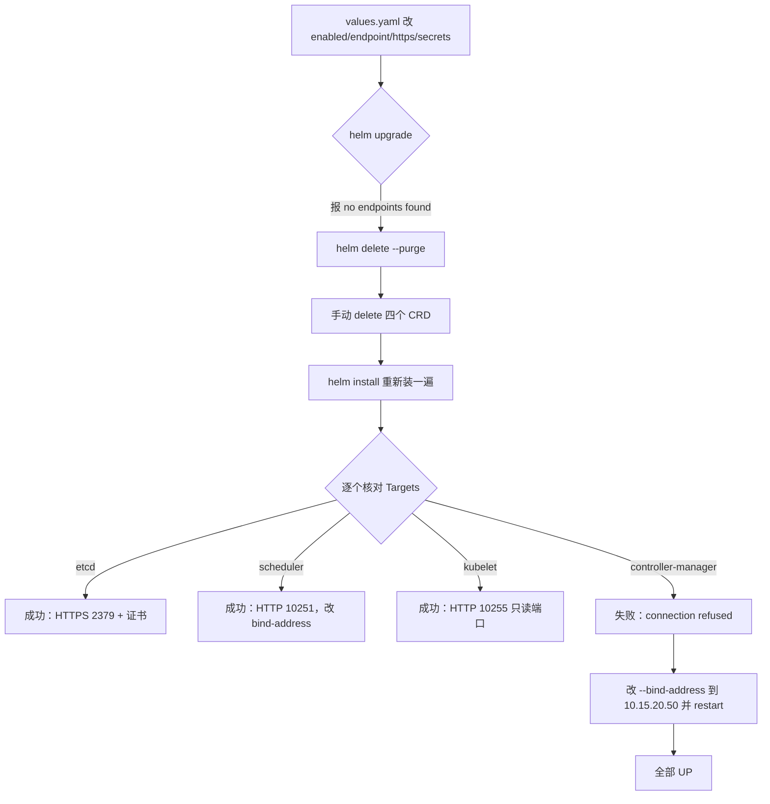

## 纲要

- 配证书之前先建 secret：`kubectl create secret` 用 `--from-file` 把 CA、证书、密钥三个 PEM 塞进去
- values 里 `caFile/certFile/keyFile` 的前缀目录是 chart 固定挂载的，不能乱写，文件名要对上 secret 里的名字
- Prometheus 需要一个「同命名空间的 secret 列表」，以宿主挂载的方式送进 Pod，它才拿得到证书去跟 ETCD 打交道
- 顺手把 kube-scheduler 一起配了：给 endpoint、给 10251、确认协议是 HTTP
- kubelet 既然开了只读端口，就把 targetPort 切到 10255 的 HTTP 方式
- `helm upgrade` 报 `no endpoints with name ... found` 时别死磕，整机卸载重装反而最快
- 卸载要 `helm delete --purge` 强制移除回收站，还要手动清掉四个 `*.coreos.com` 的 CRD
- 全套下来对集群零侵入：说装就装、说撤就撤，调整全部沉淀在 chart 目录里

## 先把证书塞进 secret

上一节说到要建一个 `etcd-client-secret`，里面包含三个文件（一个 CA、一个证书、一个密钥）。这一节动手。

```bash
# 三个 PEM（注意这里是 .pem，不是 .crt）
kubectl create secret generic etcd-certs \
  -n monitoring \
  --from-file=/etc/kubernetes/pki/ca.pem \
  --from-file=/etc/kubernetes/pki/etcd-key.pem \
  --from-file=/etc/kubernetes/pki/etcd.pem
```

```bash
# 验一下
kubectl get secret -n monitoring | grep etcd
kubectl get secret etcd-certs -n monitoring -o yaml
```

把 yaml 打开看，里面就是 `ca.pem`、`etcd-key.pem`、`etcd.pem` 三个字段，没问题。

### 再把 Prometheus 这边的路径配好

下一步先把 CA 文件那块也配好。前面的目录是固定的——因为 chart 自己有挂载配置，下面只认文件名：

```yaml
kubeEtcd:
  enabled: true
  endpoints:
    - https://10.15.20.50:2379
  serviceMonitor:
    interval: 30s
    https:
      scheme: https
      insecureSkipVerify: false
      serverName: etcd-10.15.20.50
      caFile: /etc/kubernetes/pki/ca.pem
      certFile: /etc/kubernetes/pki/etcd.pem
      keyFile: /etc/kubernetes/pki/etcd-key.pem
```

不过光配这个还不够，还得给 Prometheus 设一个密钥列表。到 values 里找 Prometheus 那段：`prometheus.enabled=true` 在 `count` 上面，不用太在意；往下翻能看到 `serviceMonitor`、各种 `image`……里面有一个 `secret`，可以写一个列表——**secret 是一个 list，跟 Prometheus 在同一个命名空间下**，装进去之后 Prometheus 就能拿这个 secret 去跟 ETCD 打交道了。

同样它是一个宿主的（host）形式，这个 secret 名字叫 `etcd-certs`，命名空间也是同一个 `monitoring`，都没问题。

```yaml
prometheus:
  enabled: true
  prometheusSpec:
    # secret 列表：同一命名空间下的 secret 会以宿主卷的形式挂进 Prometheus Pod
    secrets:
      - etcd-certs
```

这样 ETCD 的问题基本就解决了。

## 顺手把 kube-scheduler 也配了

继续编辑同一个 values，搜 `scheduler`：

- 原理跟前面一样，也是 endpoint
- 写到单独这个 master 节点 `10.15.20.50`，端口 10251，`https: false`

但这里有个坑要先确认：去看一下 kube-scheduler 的配置——`netstat -lntp | grep 10251`，发现它监听到了 `127.0.0.1` 上，这个肯定不行。要给它改成 `10.15.20.50`，至少得改成这个地址。

改完之后再确认它是 HTTP 还是 HTTPS：`curl http://10.15.20.50:10251/metrics`，返回正常，说明它确实是 HTTP 的。然后 `systemctl reload` 一下 kube-scheduler，再 `netstat` 看端口是不是真的监听在自己的 IP 上。确认没问题，values 下面就不用再改什么了。

## kubelet 切到只读端口

刚才提到 kubelet，端口最好改成 10255。确认一下：在节点上 `netstat -lntp | grep kubelet`，能看到两个监听端口，一个是 10250，一个是 10255，对应基于 HTTP 的这个服务，`/metrics` 是正常的。

既然它开了这个只读端口，就改成只读端口从这个端口读数据。看 kubelet 的 serviceMonitor 定义，它给出的是一个「是否是 HTTPS」的标记，可以直接改成 false。具体端口在 Prometheus Operator 别的地方已经固化好了，不需要手动配——这只是猜测，等下试一下看有没有问题。

## 一个开关就能关掉监控

这个 values 里如果你不想对某个组件做监控，很简单：`enabled` 改成 false，它就不会再对它做监控了。通过 Helm 的 values 文件去修改监控组件的相关配置，非常方便也非常灵活。

## upgrade 失败就重装

改完执行：

```bash
helm upgrade imoocprom ./prometheus-operator -f values.yaml
```

结果报错：

```text
no endpoints with name imoocgreen/controlmanager found
```

这个异常在更新的时候确实会遇到，修改某些文件会引发。没关系，可以用一种更彻底的方式：**先把监控组件全部删掉，重新来一遍**。因为唯一的依赖就是这个 prometheus-operator 插件，相当于一条命令拔下来、再一条命令装上去，而我们的调整已经完全保存在这个文件夹里了，跟 Kubernetes 集群不再有任何关系。

```bash
# 1. 先删 release
helm delete imoocprom
# 看 helm list 还没删完，再删一次
helm delete imoocprom

# 如果还删不掉，加 --purge 强制移除，不放到回收站
helm delete imoocprom --purge

# 2. 手动清理 CRD（四个）
kubectl get crd | grep coreos
kubectl get crd | grep coreos | awk '{print $1}' | xargs kubectl delete crd
```

> 四个 CRD 就是前面见过的那四个：`alertmanagers`、`prometheuses`、`prometheusrules`、`servicemonitors`，后缀都是 `*.monitoring.coreos.com`。

删完之后集群就清空了，也就是完全不具有监控能力了。这时候再去访问那个页面，就是 503——服务已经不存在了。

重新部署：

```bash
helm install -f values.yaml --name imoocprom --namespace monitoring ./prometheus-operator
```

等组件都跑起来，`kubectl get pod -n monitoring` 看一眼。

**整个过程中就能体会到这套部署方式有多优雅**：对 Kubernetes 集群完全零侵入，作为一个完全的插件形式——说给你建起来就马上建起来，说不想用了一下一撤就干净，比较舒服。

## 验一下哪几处改成功了

再看 Targets 页面：

| 组件 | 结果 | 说明 |
| --- | --- | --- |
| etcd | 成功 | 已经能监听基于 HTTPS 的 2379 端口了 |
| kube-scheduler | 成功 | HTTP，10251 |
| kubelet | 成功 | 改成 HTTP 了，走 10255 只读端口 |
| kube-state-metrics | 成功 | 一并改过来了 |
| kube-controller-manager | 失败 | `dial tcp 10.15.20.50:10252: connection refused` |

就剩下 controller-manager 这一个问题。

### connection refused 的根因

去看 10252 这个端口——`netstat -lntp | grep 10252`，这个端口是绑定在本机（127.0.0.1）上的。

那就不合适了，绑定在本机肯定监控不到。有两种选择：

1. 为了安全放弃这个组件的监控
2. 让 kube-controller-manager 绑定到它自己的 IP 上

修改 `--bind-address` 为 `10.15.20.50`，然后 `systemctl restart kube-controller-manager`，刷新页面——变好了，所有的 endpoint 全部监控起来了。



## 看看 Prometheus 自己暴露了什么

顺带看一些别的。Prometheus 的 `/metrics` 之外还有几块值得瞄一眼：

| 页面 | 内容 |
| --- | --- |
| Runtime Information | 当前运行的一些信息 |
| Command Flags | 它本身运行的一些启动参数 |
| Config | 由 Prometheus Operator 自动生成并注入的配置 |

Config 这块比较复杂，具体配置不展开，网上资料也很多。但通过我们这种安装方式，其实**不需要去关注 Prometheus 自己的配置**——只需要关注 Helm 里对应的那套配置方式就行，它相当于对 Prometheus 的配置做了一层简化，让人更容易理解。

## 报警其实就是一堆表达式

还有一块是 **rules** 里定义的。这里要先说一件事：**报警其实就是一堆 expression，expression 本质就是 PromQL 的一个条件**。PromQL 本身非常强大也非常复杂，有很多函数，再配上我们的 metric 和 KV 标签一起用。

```yaml
groups:
  - name: demo-rules
    rules:
      - alert: KubeletDown
        expr: up{job="kubelet"} == 0
        for: 5m
        labels:
          severity: critical
        annotations:
          summary: "kubelet 抓取失败（{{ $labels.instance }}）"
```

你可以给这个 alert 起个名字，定一个表达式，当表达式满足条件的时候就会触发一个报警。注释里可以用很多变量，像 `labels` 就是我们 KV 标签里的值，可以取出来，有助于定位问题。

## API 速览

| 能力 | 做法 | 关键点 |
| --- | --- | --- |
| 把三份证书变成 secret | `kubectl create secret generic <名> --from-file=...` | 三个 `--from-file`，同命名空间 |
| 让 Prometheus 读到证书 | values → `prometheus.prometheusSpec.secrets` | 列表形式，宿主挂载进 Pod |
| 指定证书文件路径 | `caFile / certFile / keyFile` | 目录由 chart 固定，只改文件名 |
| 关掉某个组件的监控 | `values.yaml` → `<组件>.enabled: false` | 一行开关 |
| 强制移除 release | `helm delete <名> --purge` | 不加会把资源留在回收站 |
| 批量清 CRD | `kubectl get crd \| grep coreos \| awk '{print $1}' \| xargs kubectl delete crd` | 四个 `*.coreos.com` |
| 查组件真实协议 | `netstat -lntp \| grep <端口>` + `curl .../metrics` | HTTP 还是 HTTPS 必须先看 |
| 修监听地址 | 改 `--bind-address` 后 `systemctl restart` | 绑 127.0.0.1 一定抓不到 |

## Demo 示例

```bash
# 1. 建证书 secret
kubectl create secret generic etcd-certs -n monitoring \
  --from-file=/etc/kubernetes/pki/ca.pem \
  --from-file=/etc/kubernetes/pki/etcd-key.pem \
  --from-file=/etc/kubernetes/pki/etcd.pem

# 2. values.yaml 里三段配置
#   kubeEtcd:      endpoints + https.scheme: https + caFile/certFile/keyFile
#   prometheusSpec.secrets: [etcd-certs]
#   kubeScheduler: endpoint: ["http://10.15.20.50:10251"]
#   kubelet:       serviceMonitor.targetPort: 10255, https: false

# 3. 组件侧先动
sed -i 's#--bind-address=127.0.0.1#--bind-address=10.15.20.50#' /etc/kubernetes/kube-scheduler
sed -i 's#--bind-address=127.0.0.1#--bind-address=10.15.20.50#' /etc/kubernetes/controller-manager
systemctl restart kube-scheduler kube-controller-manager

# 4. 卸载重装（比死磕 upgrade 快）
helm delete imoocprom --purge
kubectl get crd | grep coreos | awk '{print $1}' | xargs kubectl delete crd
helm install -f values.yaml --name imoocprom --namespace monitoring ./prometheus-operator

# 5. 验收
kubectl get pod -n monitoring
```

集群最终的资源分布：

```text
monitoring/
├── secret/etcd-certs              # ca.pem / etcd.pem / etcd-key.pem 三份
├── secret/prometheus-im.mock-k8s-stack       # chart 生成的 Prometheus 配置
├── pod/prometheus-imoocprom-prometheus-0     # 宿主挂载了 etcd-certs
├── pod/prometheus-imoocprom-operator-xxxxx
├── pod/kube-state-metrics-xxxxx
├── pod/node-exporter-{n1,n2,n3}
├── pod/alertmanager-imoocprom-alertmanager-0
├── deploy.apps/grafana-imoocprom-grafana
├── svc/{alertmanager,imoocprom-prometheus,...}
└── crd/*.monitoring.coreos.com    # 重装时会被重建
```

| 现象 | 原因 | 处理 |
| --- | --- | --- |
| 证书文件找不到 | secret 名或文件名没对上 | 看 secret 里的 key，`-o yaml` 逐个核 |
| Prometheus 拿不到证书 | 没配 `prometheusSpec.secrets` | 加上 secret 名列表 |
| `connection refused` | 组件监听在 127.0.0.1 | 改 `--bind-address` 到节点 IP 并 restart |
| upgrade 报 no endpoints | 改 values 引发冲突 | `helm delete --purge` + 删 CRD 重装 |
| delete 后资源还在 | 走了回收站 | 加 `--purge` 强制移除 |
| 重装后 CRD 还在 | CRD 不属于 release | 手动 `kubectl delete crd` |

### 总结

- 证书先变 secret 再配路径，`--from-file` 一次塞三份 PEM，secret 名字要和 values 里写的对上
- `prometheusSpec.secrets` 是把证书送进 Prometheus Pod 的关键，光配 caFile 不够
- 组件自身监听地址必须先看 `netstat`，绑 127.0.0.1 的话怎么配都抓不到
- upgrade 炸了别硬修，插件化部署的最大好处就是「删干净重装」三分钟搞定
- 卸载记得 `--purge` + 手动删四个 CRD，重装后逐个核对 Targets，一套流程下来集群零侵入

