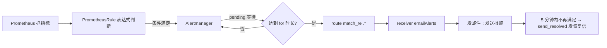

## 纲要

- 默认报警规则是 chart 自动加的，定义在 `values.yaml` 的 `defaultRules` 开关下面，模板在 `templates/prometheus/rules/`
- 规则的本质是一个 `PrometheusRule` 自定义资源，核心就是那个 `expr` 表达式 + alert 名字 + labels/annotations
- 除了改模板，也可以自己写一个 `etcd.yaml` 之类的 `PrometheusRule` 再 apply，但要记住它已脱离 Helm 管理
- Alerts 页面三态：健康的（绿）、已触发 firing（红）、pending（黄）——pending 是 Alertmanager 故意等的
- 访问 Grafana：Service + Ingress，账号从 secret 里 base64 解码拿，不是猜的
- Grafana 自带面板非常全：coredns、etcd、集群级 CPU/内存、namespace、workload、node 负载、PVC/PV 等
- 面板本质就是 PromQL，要改先去 Prometheus 界面调通再搬回来
- Alertmanager 配 SMTP：`smtp_smart_host` 带端口、`smtp_auth_username/password`、receiver 正则匹配、配 `send_resolved`（恢复也发信）

## 默认就给你装了一堆报警规则

上一条菜单往下看，边上的这些规则都是自动默认加上的、常用的报警规则，也可以去修改和调整。里面的具体 PromQL 非常多，不逐个讲，感兴趣的可以自己去深入。

那这个 rule 到底怎么定义的？先到 master 上的 `prometheus-operator` 目录里看 `values.yaml`。最上面就有一个 `defaultRules`，默认开启的报警规则，密密麻麻一大堆。

这些东西对应在什么位置？对应在 `templates` 下面有一个 `prometheus`，再往下有一个文件夹叫 `rules`——这就是默认所有报警规则的模板。

比如看一个 etcd 的规则，本质上就是一个 `PrometheusRule` 这个自定义资源。默认的情况下，它会根据当前的集群环境去生成一个这样的规则。页面上看到的那些 alert、它的 message、它的 expression、还有它的 label，全都在这个模板里定义。

```yaml
apiVersion: monitoring.coreos.com/v1
kind: PrometheusRule
metadata:
  name: imoocprom-prometheus-kube-etcd
  namespace: monitoring
  labels:
    app: prometheus-operator
    prometheus: imoocprom
spec:
  groups:
    - name: kube-etcd
      rules:
        - alert: EtcdClusterUnavailable
          expr: |
            sum(up{job="kube-etcd"}) < 3
          for: 5m
          labels:
            severity: critical
          annotations:
            summary: ETCD 集群不可用（{{ $labels.instance }}）
```

### 两种改法

1. **在原有基础上小改**：直接修改这个模板文件（`templates/prometheus/rules/*`），跟着 Helm 一起走
2. **单纯自己定义**：直接定义一个 `PrometheusRule` 的配置文件，比如一个 `etcd.yaml`，然后 apply 一下就把这个 rule 加进去了

```bash
kubectl get prometheusrule -n monitoring
```

现在 monitoring 里应该已经有很多条 rule 了，各种各样的。自己定义的时候可以参考它，默认配置随便看一个都很简单、大同小异，主要就是那个表达式的定义——看你需要用到什么样的数据去做报警判断。

不过要注意第二种方式的副作用：**这样定义就不受 Helm 包管理控制了**。以后删除或者重建的时候，别忘了把你自己手动加的东西也一起处理掉。

## Alerts 页面看三态

还有一个比较重要的菜单是单独的一个 **Alerts**，这里展示目前的报警情况。

| 状态 | 颜色 | 含义 |
| --- | --- | --- |
| 未触发 | 绿色 | 我们定义的所有 rule 都没满足条件，没有任何问题 |
| firing | 红色 | 已经真正触发的报警，比如 API 延迟比较高 |
| pending | 黄色 | 条件刚满足但还在等，没到 fire 的那一刻 |

黄色的表示这个报警正处于一个 **pending** 状态。当一个事情发生的时候，它不一定会马上触发这件事儿，而是会有一个等待；当达到一定条件的时候，它才会变成红色真正 fire 出来。

这也是 Alertmanager 做的一件事——**它要避免由于一些通用性或者集群整体的问题，导致邮件雪崩，不停不停地发邮件发太多**。

顺带一提，内网环境的网络和磁盘都是走的网盘，延迟确实会比较高，所以页面里会出现 API 延迟高的红色报警，属于环境使然。

## 去看 Grafana

Prometheus 的东西看得差不多了，下面去看 Grafana 提供了哪些图表。

```bash
kubectl get svc -n monitoring | grep grafana
# imooc-prometheus-grafana   <clusterIP>  80/TCP
```

在 `deepinrelease` 项目 12 小节里已经准备好了 Ingress，域名叫 `grafana.imooc.com`，serviceName 就是刚才看到的那个，端口 80，直接用：

```yaml
apiVersion: extensions/v1beta1
kind: Ingress
metadata:
  name: grafana
  namespace: monitoring
  annotations:
    nginx.ingress.kubernetes.io/rewrite-target: /
spec:
  rules:
    - host: grafana.imooc.com
      http:
        paths:
          - path: /
            backend:
              serviceName: imooc-prometheus-grafana
              servicePort: 80
```

本地 hosts 加一行 `127.0.0.1 grafana.imooc.com`，打开——确实能访问。那用户名是什么？这是个问题，去查。

### 密码不是猜的，是解码出来的

到 prometheus-operator 里看 grafana 的 chart，翻 values 找一下关于账号的东西：`username`、`adminUser`，然后找一个 `password`——`password` 不是，SMTP 那个也不是，管理员用户名是 `adminUser`。然后 `user`、`password` key 用的是一个已经存在的 secret。

```bash
kubectl get secret -n monitoring | grep grafana
kubectl get secret imooc-prometheus-grafana -n monitoring -o yaml
```

secret 里的 `admin-user` 和 `admin-password` 都是 base64 编码的，解开：

```bash
    # 执行前先给下面的占位变量赋值，如 NODE_NAME=node1，否则变量为空会导致命令行为不符合预期
echo '${BASE64}' | base64 -d
# 用户名：admin
# 密码：prom-operator
```

拿到用户名密码登录后成功。

### 面板都有啥

进去就是这一堆面板，密密麻麻一大堆（放大的话反而没那么好看，稍微看一眼就行）：

| 面板 | 内容 |
| --- | --- |
| coredns | CoreDNS 的监控指标 |
| etcd | ETCD 的监控指标，正常 |
| disk / memory | 磁盘、内存相关指标 |
| cluster | 集群级的 CPU、内存等 |
| namespace / pod | 可选择不同 namespace，看Pod 的 CPU 使用、内存使用 |
| workload | 也能选 namespace |
| node | system load、每块 GPU 使用情况，三个节点可选，CPU、内存、网络、磁盘 IO |
| pvc / pv | 存储卷各种信息 |

基本该有的都有了，挺全面的，这同样是 Helm 自动给我们装的一套 Prometheus 配置。

### 面板是可以改的

对这些图表都可以查看和修改。本质上它们都是通过 PromQL 做的数据查询。比如点 manage 找到想修改的 dashboard，看它的数据来源，可以 edit——下面会给出具体的 PromQL 是怎么把这些数据查出来的，也可以直接改。

不过直接改比较容易出错。**建议的做法：把 PromQL 拿到 Prometheus 那个界面上去一点一点调试，调通了再放回到 Grafana 里作为一个图表**。同时当然也可以自己 create 自己的 dashboard。

## 最后一步：把邮件打通

还有一件事没干——具体的报警往哪儿发？Alertmanager 还没给我们发过报警信息，那就去配置发邮件。

报警配置也在 values 里，搜 alertmanager。发邮件的配置是一个比较通用的配置：

```yaml
alertmanager:
  enabled: true
  config:
    global:
      resolve_timeout: 5m
      smtp_smart_host: 'smtp.163.com:25'
      smtp_from: 'imoocdat@163.com'
      smtp_auth_username: 'imoocdat@163.com'
      smtp_auth_password: 'smtpAuthPasswordHere'
    route:
      receiver: emailAlerts
      match_re:
        alertname: '.*'
    receivers:
      - name: emailAlerts
        email_config:
          to: 'imoocdat@163.com'
          send_resolved: true
```

几个点逐个说：

- `smtp_smart_host` 设置一个邮箱和服务器的地址，这里用的 163，**一定要记得带上端口 25**
- `smtp_from` 设置发件人
- `smtp_auth_username` / `smtp_auth_password` 是用于验证的用户名和密码
- `route` 的 `receiver` 给一个名字 `emailAlerts`，当它 match 到某一个条件的时候就发给对应的 receiver
- `match.name` 默认是 `watchdog`，这种情况太少了，改成支持正则的 `.*` 匹配，**所有报警都发给这个 receiver**
- receiver 的特点是一个 `email_config`，发给谁——这里就发给一个邮箱
- `send_resolved: true`，就是说当这个问题解决的时候他也给你发一封邮件。什么叫问题解决？默认 5 分钟没有达到报警条件，就会认为问题已经解决，会发一封「已恢复」的邮件

> 注意：发件人不要照抄，换成自己的邮箱。

Alertmanager 支持很多种报警方式，常见的组件都支持，还可以自定义报警后端——它会把报警数据发到你的 HTTP 服务器，具体可以查 Alertmanager 相关文档。

### 生效并验证

```bash
helm upgrade imoocprom ./prometheus-operator -f values.yaml
```

打开邮箱，已经是未读邮件状态，刷新一下——目前还是没有邮件进来。那就制造一个：把 ETCD 给它 stop 一下，强制来一个问题，考验一下它。

```bash
systemctl stop etcd
```

邮箱动起来了，报警邮件进来了。随便点开一个：

- 一条是关于 kube-state-metrics 监控 Kubernetes 集群的这个组件的——它发现之前做测试一直没删掉的那个 ES 实例数不对：`elasticsearch: 15 分钟以上没有 match 到它想要的实例数`，这种历史遗留问题也照样给报出来，非常贴心
- 另一条就是 ETCD 的错误也报出来了，说明刚才停止 ETCD 已经被发现了

报警信息默认是这个样式，也可以自己去自定义修改样式，没什么特别复杂的。

到这里 Prometheus 监控报警就全通了。整套东西涉及的知识点和细节非常多，不可能全部讲完——光是 PromQL 一样东西要大家学会就可能得讲很久。想把监控掌握好，还是得自己一点点去完善各个环节的细节。



## API 速览

| 能力 | 做法 | 关键字段 |
| --- | --- | --- |
| 关/开默认规则 | `values.yaml` → `defaultRules` | 组件名开关 |
| 改默认规则 | 改 `templates/prometheus/rules/` 下的模板 | 跟着 Helm 一起走 |
| 自定义规则 | 写 `PrometheusRule` 后 `kubectl apply` | `spec.groups[].rules[].expr` |
| 看已有规则 | `kubectl get prometheusrule -n monitoring` | 四种 CR 之一 |
| 看报警状态 | Web → Alerts 菜单 | firing / pending / 健康三态 |
| 拿 Grafana 密码 | `kubectl get secret <grafana-secret> -o yaml` + `base64 -d` | `admin-user` / `admin-password` |
| 暴露 Grafana | Ingress → Service 80 | `nginx.ingress.kubernetes.io/` 注解前缀 |
| 改面板 | Grafana → manage → dashboard → edit | 底下就是 PromQL |
| 配邮件 | `values.yaml` → `alertmanager.config` | `smtp_smart_host`、`route.match_re`、`receivers` |
| 恢复也发信 | `email_config.send_resolved: true` | 默认 5 分钟判定恢复 |

## Demo 示例

```bash
# 1. 自定义一条报警规则：etcd 不可达
cat <<'EOF' | kubectl apply -f -
apiVersion: monitoring.coreos.com/v1
kind: PrometheusRule
metadata:
  name: my-etcd-rules
  namespace: monitoring
spec:
  groups:
    - name: my-etcd
      rules:
        - alert: EtcdDown
          expr: up{job="kube-etcd"} == 0
          for: 1m
          labels:
            severity: critical
          annotations:
            summary: "ETCD 实例不可用"
EOF

# 2. 拿 Grafana 密码
kubectl -n monitoring get secret imooc-prometheus-grafana -o jsonpath='{.data.admin-password}' | base64 -d
kubectl -n monitoring get secret imooc-prometheus-grafana -o jsonpath='{.data.admin-user}' | base64 -d

# 3. 配完 alertmanager 之后
helm upgrade imoocprom ./prometheus-operator -f values.yaml

# 4. 验证：把 etcd 停掉，看邮箱
systemctl stop etcd
# 等 pending → firing，收到报警邮件
systemctl start etcd
# 5 分钟内不再满足，收到「已恢复」的邮件
```

整条告警链路落盘后的结构：

```text
monitoring/
├── crd/prometheusrules.monitoring.coreos.com
├── prometheusrule/
│   ├── imoocprom-prometheus-kube-etcd      # chart 默认生成
│   ├── imoocprom-prometheus-kube-apiserver
│   ├── imoocprom-prometheus-kube-pods
│   └── my-etcd-rules                        # 手写，脱离 Helm 管理
├── configmap/alertmanager-im.mock-config   # alertmanager.config 渲染结果
├── secret/imooc-prometheus-grafana         # admin-user / admin-password
├── pod/alertmanager-imoocprom-alertmanager-0
├── pod/grafana-imoocprom-grafana-xxxxx
└── ingress.extensions/{prometheus,grafana}
```

| 现象 | 原因 | 处理 |
| --- | --- | --- |
| 邮箱一直没信 | SMTP 没配端口或密码错 | 检查 `smtp_smart_host:25` 与 `smtp_auth_password` |
| 只有一条 watchdog 的 | `match.name` 写死 | 改成 `match_re: alertname: .*` |
| 报了但没恢复信 | `send_resolved` 没开 | 置 true，等 5 分钟不再满足即发 |
| 登录不上 Grafana | 用了默认值 | 从 secret 里 base64 解码拿真实账号 |
| 面板数据空 | PromQL 名字对不上 | 去 Prometheus 界面调试后再搬过来 |
| 重建后规则丢了 | 手写的 rule 没被 Helm 管 | 单独留存自己的 rule 文件 |

### 总结

- 默认规则来自 chart 的 `defaultRules` 与 `templates/prometheus/rules/`，要长期维护就改模板走 Helm；临时加规则可以手写 `PrometheusRule` 但记得它脱离了 Helm
- Alerts 的 pending 是 Alertmanager 的抗雪崩设计，不是 bug，等 `for` 时长到了才变红
- Grafana 账号密码在 secret 里，base64 解出来用；Ingress 指过去就能开图
- 面板全是 PromQL，改之前先在 Prometheus 页面调通，别在 Grafana 里硬改
- Alertmanager 邮件四件套：带端口的 SMTP 地址、auth 账号密码、正则匹配的 route、开 `send_resolved` 收恢复信

