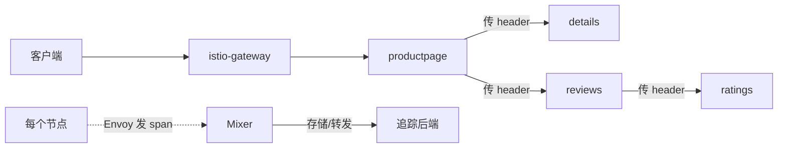
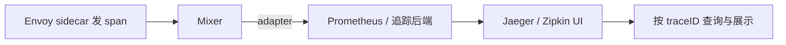

## 纲要

- 分布式追踪解决的是：调用链路很长时，到底哪个服务慢、对用户影响多大
- 代理能自动发 span，但要把整个追踪串起来，应用得自己分发链路相关的 HTTP header
- **span 是一个服务到另外一个服务之间的跨度**，多个 span 靠 TraceID 串成一条完整链路
- Istio 默认会捕获追踪所有请求，高流量网格必须降采样——靠 `values.pilot.tracing.sampling` 或 Pilot Deployment 的环境变量
- 打开追踪就三件事：`tracing.enabled=true`、`provider=jaeger`（或 zipkin）、`tracing.ingress.enabled=true` 配域名
- 镜像路径比别的组件多一级（`…/istio/tracing/…`），换源时容易漏
- 访问要带 path（Jaeger 是 `/jaeger`、Zipkin 是 `/zipkin`），少了就是 default backend 404
- 换后端先把旧的删掉——同一个 `tracing` service 下再部署一个会冲突
- Zipkin 的 span 详情比 Jaeger 更全（traceID / spanID / parentID、HTTP 方法/版本/返回码/地址）

## 这一任务要干什么

继续深入遥测，接下来是第三个任务：**分布式追踪**。

这个任务会使用 Istio 来对应用中的请求的流动路径进行追踪——最终用户体验的总体延迟、在服务之间是如何分布的。

**分布式追踪可以解决这样一个问题**：当我们的调用链路比较长的时候，我们要分析到底是哪个服务比较慢，对用户造成的影响比较大。

## span 是什么，为什么应用还要改

虽然 Istio 代理能够自动地发送 span，但仍然需要一些**线索来将整个追踪连接起来**——应用程序分发给合适的 HTTP header，以便当代理发送 span 信息时，span 可以正确地被关联到一个追踪中。

**这里的 span 是什么意思？就是一个服务到另外一个服务之间这样的一个跨度。**

看这个例子：对于 productpage 服务，我们可以在 HTTP 请求头中看到很多跟追踪相关的 header 信息。如果查看示例服务（productpage）从 HTTP 请求中所取的 header，就是那些具体的调用代码了。reviews 程序也做了类似的事情——对每个请求都会取出这样的跟踪相关的参数，并且在调用下游程序的时候，要保证这些 header 是存在的。

**也就是说：要追踪一个链路的前提，是要求每一个微服务都去传递一些链路相关的信息。**



### 采样率必须会调

Istio 默认会捕获追踪所有请求——上面这个实例应用，每次访问 productpage 都会看到追踪仪表盘。这种方式适用于流量比较低的网格。

如果我们要追踪每一个链路，记录每一个链路的信息，在请求量比较大的时候性能损耗会非常非常大，是不可接受的。所以要有一个**采样百分比**：

- 安装网格时使用这个值 `pilot.tracing.sampling` 来控制最终采样的百分比
- 在一个已经运行的网格中，编辑 Pilot Deployment，可以通过设置**环境变量**的方式来改变这个值
- 环境变量在 template 下边的 deployment 里，`values.tracing.sampling` 最终来源是一样的

## 先上 Jaeger

体验分布式追踪，第一个是 Jaeger。

### 改 values 三件套

安装之前我们要设置 `tracing.enabled=true`。看看 values 里 tracing 部分——**默认是 `enabled: false`**，要设成 true。然后可以通过这个选项设置采样率，默认百分之一，我们就用百分之一。

访问仪表盘文档里还使用端口转发——**我们还是去配置 ingress**：

```yaml
tracing:
  enabled: true
  provider: jaeger
  sampling:
    percentage: 1
  ingress:
    enabled: true
    hosts:
      - istio-tracing.imooc.com
```

看上面是不是用到了 Jaeger 的镜像——`provider: jaeger`，tracing 目前的 provider 是 jaeger，所以他会用这个镜像，我们也把它改成自己的仓库（`registry.cn-hangzhou.aliyuncs.com/imooc`）。

```bash
helm template istio-core --namespace istio-system > istio.yaml
kubectl apply -f istio.yaml
```

istio-system 下应该有一个新的 tracing 的 Pod。这时候下载镜像有点问题——到节点上看能不能拉下来：

```bash
# registry.cn-hangzhou.aliyuncs.com/imooc/...
# 哦，后面多了一级：多了个 tracing 的目录
```

**要修改 tracing values**——镜像的根目录多了 `istio/tracing` 这一层，顺便把下边的也改了（一会儿我们也会去用它）。再看看还有没有别的漏网的，重新来一遍：

```bash
kubectl get pod -n istio-system
```

这回下载成功了，处于 Running 状态，已经通过了健康检查，没问题。

### 访问要带 path

通过域名去访问：

```bash
# 本机 hosts
echo "<ingress 节点 IP> istio-tracing.imooc.com" >> /etc/hosts
```

打开浏览器访问，default backend 404。看看 service——istio-system 里 tracing 是有的，clusterIP、80 都没问题；看 ingress：

```bash
kubectl get ingress -n istio-system
kubectl describe ingress istio-tracing -n istio-system
# host: istio-tracing.imooc.com
# path: /jaeger     ← 最下边也有一个 path 叫 jaeger
```

那就这么访问：域名加上 path——`http://istio-tracing.imooc.com/jaeger`。

进去可以看到这边可以选择 service，现在什么数据都没有。

### 造数据再看

当 bookinfo 应用运行时，访问 productpage 一次或多次就能生成追踪信息，默认采样率百分之一。我们要发送一百个请求：

```bash
# 脚本复制过来，随便找个机器访问
for i in $(seq 100); do
  curl -s -o /dev/null http://10.15.20.50:8888/productpage
done
```

> 地址一定要确认：`$INGRESS_HOST:$INGRESS_PORT/productpage`。

访问完之后，从仪表盘的 service 下拉选择 productpage，点 Find Traces。

> 我们访问了一百次，采样率百分之一，所以只抓到一条——这是正常的。

点进去详情页：**总共花了三十二毫秒，五个 service**，具体每一个 service 耗费的时间也都有了：

```text
istio-ingressgateway  →  总耗时最长
└── productpage.default
    ├── details.default       3.25 ms
    └── reviews.default
        └── ratings.default
```

从这张图我们可以一目了然地看到时间都花在哪儿了。如果一个请求突然变长，从这里很容易分析出到底是哪个服务占用时间比较长。

### 其它功能

- 上面的**直方图**里能明显看到所有 trace 所花费的时间
- **Compare**：可以根据两个 trace ID 对两条追踪做比较
- **Dependency**：图比较小，可以滑动滚轮放大——这是服务之间的调用关系。点击 `productpage.default` 就显示跟这个服务**直接相关**的其他服务（reviews、istio-gateway、detail）；点击 review 就显示那两个只跟它直接有调用关系的服务，可以很清晰地看出服务之间的依赖关系。这里还列了从头到尾全的调用关系和调用次数

## 换成 Zipkin

Jaeger 用完之后看下一个——Zipkin，也是类似的功能，只是在界面上、数据上会有一些区别。

`tracing.enable`，然后 `tracing.provider=zipkin` 就可以了。去修改 tracing values：有一个 provider 改成 zipkin，下面是不是有一个 zipkin 的镜像——已经修改过了，其他应该不用改，再生成一遍完整的 yaml。

**注意**：这个地方我们之前部署了一个 Jaeger 的 Deployment，它的 service 就是 `tracing`，如果我们再部署一个 Zipkin，同一个 service 下会跟之前产生冲突。**所以先把之前的删掉，再 apply。**

```bash
RELEASE=istiojaeger
helm delete "$RELEASE"       # 或者删掉旧的 tracing 相关 release
helm template istio-core --namespace istio-system > istio.yaml
kubectl apply -f istio.yaml
```

看一下 ingress 改过来没——改成 zipkin 的时候，tracing 的 path 已经变成了 `/zipkin`。再检查 Pod：

```bash
kubectl get pod -n istio-system
```

istio-tracing 正处于 Running 状态但没有通过健康检查，稍等一会儿。为什么启动这么慢？describe 一下，没有异常，看它的健康检查：

```text
readiness: httpGet ... delay: 200s
```

**这个 delay 是 200 秒，确实很长，怪不得这么慢**——不过现在应该可以了。

### Zipkin 界面

访问还是刚才那个 `istio-tracing.imooc.com` 加一个 path `/zipkin`：

- 第一个是服务名，也可以选 span 名、远程服务名，时间间隔可以根据时间戳去查询，学习时间等各种查询条件
- 数据可能还没进来，多访问几次、刷新几下就有了
- 找 `productpage.default` 查找——结果出现了，details 其实都一样，因为它们是关联在同一个 trace ID 下的

看结果：**一个是七十四毫秒，一个是三十六毫秒，有排序是按耗时降序**，耗时最长的放最上面。跟刚才那个类似：持续时间、几个服务、锁定深度、span 数量都类似。

再看每个服务的耗时——`spandetail` 服务干了四十四毫秒，这个比较长；最下边这个 ratings 服务就比较快，只有九百纳秒。

点开还能看到这一次请求的详细信息：客户端的开始时间、结束时间，各种 HTTP 参数（id、方法、HTTP 版本、返回码、HTTP 地址）——非常详细。

**还有 traceID、spanID、parentID 各种 ID，好像比之前那个会更全面一点。**

再看看有没有别的功能，查找依赖——也有依赖图，可以这么放大服务之间的依赖关系：`productpage.default` 依赖于 details、reviews、ratings。

## 商业版就不演示了

还有一个用的是 LightStep——是一个商业版的产品，用起来比较麻烦，还要申请一些账号之类的，这里就不演示了。

## 底层原理其实就一条链路

分布式追踪我们大概完成。其实主要就是对这个数据的一个展现方式，**底层原理跟我们之前实践的都是一样的**：

> Envoy 把数据发过来 → 汇总给 Mixer → Mixer 把数据送到后端（Prometheus / 追踪存储）→ 我们的展现工具从 Prometheus 里把数据拉取出来做查询，再以很好的方式展现给我们。



## API 速览

| 能力 | 做法 | 关键点 |
| --- | --- | --- |
| 开追踪 | values `tracing.enabled: true` | 默认 false，不改就没 Dashboard |
| 选后端 | `tracing.provider: jaeger` / `zipkin` | 决定用哪套镜像和 path |
| 调采样率 | `tracing.sampling.percentage: 1` | 高流量网格必须降，否则性能扛不住 |
| 运行时改采样 | 编辑 Pilot Deployment 加环境变量 | 来源还是 `values.tracing.sampling` |
| 暴露 UI | `tracing.ingress.enabled: true` + hosts | 别用 port-forward |
| 访问路径 | `/jaeger` 或 `/zipkin` | 少了就是 default backend 404 |
| 换后端 | 先删旧的 tracing release 再 apply | 同一个 `tracing` service 会冲突 |
| 耐心等 | 看 readiness probe delay | Zipkin 那个 delay 有 200 秒 |

## Demo 示例

```bash
# 1. 开 Jaeger + ingress，采样 1%
cat >> values.yaml <<'EOF'
tracing:
  enabled: true
  provider: jaeger
  sampling:
    percentage: 1
  ingress:
    enabled: true
    hosts:
      - istio-tracing.imooc.com
EOF
helm template istio-core --namespace istio-system > istio.yaml
kubectl apply -f istio.yaml
kubectl get pod -n istio-system | grep tracing

# 2. hosts + 带 path 访问
INGRESS_IP=$(kubectl get svc istio-ingressgateway -n istio-system -o jsonpath='{.spec.clusterIP}')
echo "$INGRESS_IP istio-tracing.imooc.com" >> /etc/hosts
# http://istio-tracing.imooc.com/jaeger

# 3. 造数据（100 次，采样 1% 大约抓到 1 条）
for i in $(seq 100); do curl -s -o /dev/null http://$INGRESS_HOST:$INGRESS_PORT/productpage; done

# 4. 换成 Zipkin：provider 改 zipkin，先删旧的再 apply
helm delete "$RELEASE"
kubectl apply -f istio.yaml
# http://istio-tracing.imooc.com/zipkin
```

两种后端的对照：

| 维度 | Jaeger | Zipkin |
| --- | --- | --- |
| provider 值 | `jaeger` | `zipkin` |
| 路径 | `/jaeger` | `/zipkin` |
| 列表排序 | 按服务名 / 操作名查 | 同样，按耗时降序排列 |
| span 详情 | 客户端起止时间、HTTP 参数 | 更全：traceID / spanID / parentID、方法、版本、返回码、地址 |
| 依赖图 | 有，滚轮放大，点击看直接依赖 | 有，productpage → details/reviews/ratings |

| 现象 | 原因 | 处理 |
| --- | --- | --- |
| tracing.enabled 没开 | 默认 false | 改 true 后重新 template + apply |
| Pod 一直拉不到镜像 | 镜像路径多一级 `istio/tracing` | values 里补全目录再换源 |
| 打开是 default backend 404 | 少了 path | Jaeger 加 `/jaeger`，Zipkin 加 `/zipkin` |
| 切换后冲突 | 新旧共用一个 `tracing` service | 先删旧 release 再 apply |
| Pod Running 但 Ready 不了 | readiness delay 设了 200 秒 | 等三分钟，别急 |
| 查不到 trace | 采样率太低 + 没造够流量 | 发一百次请求，或把采样率调高 |
| 数据一直是空的 | 只访问了一次且未命中采样 | 多刷几次再刷新 UI |

### 总结

- 代理自动发 span，但链路要能串起来，靠的是应用自己把追踪 header 一路透传下去
- span = 服务与服务之间的一次跨度，整条链路靠 TraceID 关联
- 高流量网格一定要降采样，`pilot.tracing.sampling` 和运行中的 Pilot 环境变量两条路都能改
- 追踪后端的开启是三个开关：enabled、provider、ingress；镜像路径记得多核对一层
- 换后端要先删旧的，同名的 `tracing` service 扛不住两个后端
- 详情页把「时间花在哪」摊开——请求变长时从这里一眼定位到慢的那个服务

