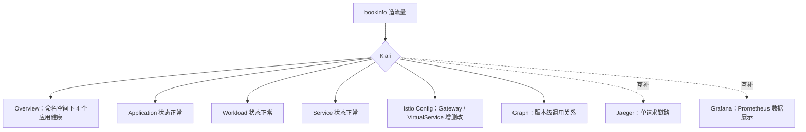
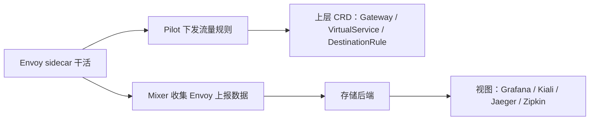

## 纲要

- 插件里带有一个预配置的 Grafana Dashboard，可以直接对网格的流量进行监控
- 开 Grafana 三件事：`grafana.enabled: true`、镜像换源、开 ingress 配 `istio-grafana.imooc.com`
- `contextPath` 要设成根目录，不然访问会打回 default backend
- 仪表盘已经预置好：Mixer Performance、Pilot、Service、Workload 等组件相关看板
- Service 面板看请求速率与成功率（global request rate 1.16 PS），Workload 面板看 P50 / P90 / P99 延迟
- Kiali 是「网格可视化」任务：先建一个带 admin/mysecret 的 Secret 当登录凭证，再开 `kiali.enabled: true`
- Kiali 镜像路径容易多一层目录，多了会一直 ImagePullBackOff，去掉那层就好
- Kiali 最有价值的是 Istio Config：Gateway、VirtualService 都能在里面看、改、存，等于给 Istio 配了个后台
- Kiali 的 Graph 能看到版本级调用关系，但它没有单请求链路追踪，和 Jaeger、Grafana 是互补关系

## Grafana：预置看板直接用

这一节继续使用 Istio Operator 安装 Grafana 插件，**插件中带有一个预配置的 Dashboard，可以用来对网格的流量进行监控**。

开始之前要设置 `grafana.enabled=true`。先说一说：`grafana.enabled` 等于 true，然后确认集群中 **Prometheus 服务正在运行**（这个没问题）。验证 Grafana 是否在集群中运行——我们还没去做。

做之前先看 Grafana 的镜像，看看要不要改一下镜像地址——`charts/grafana` 下面的 values：

```yaml
grafana:
  enabled: true
  image:
    repository: registry.cn-hangzhou.aliyuncs.com/imooc
  ingress:
    enabled: true
    hosts:
      - istio-grafana.imooc.com
  contextPath: /
```

`repository` 确实是原来的，改成自己的仓库（杭州那个 `registry.cn-hangzhou.aliyuncs.com/imooc/istio`）。下边还有吗？好了，下边没有什么需要改的了。

然后还有一个 ingress，我们也一块给它开启吧——肯定是要访问的 `istio-grafana.imooc.com`。`contextPath` 这个我们改成根（`/`）呗，其他的不需要。继续去生成一下 istio.yaml，生成模板文件，apply。

下一步就可以去检查 Grafana 的服务是否运行——没问题，运行着。然后通过 Grafana 的 UI 打开 Istio 仪表盘就可以访问了。访问之前，配置一个 hosts：

```bash
echo "<ingress 节点 IP> istio-grafana.imooc.com" >> /etc/hosts
```

访问 `istio-grafana.imooc.com`，确实是可以访问了。

### 看板里有什么

Grafana does spare dashboard……可以看到一堆仪表盘：Mixer、Performance、Pilot、Service、Workload 啊，有一些组件相关的 dashboard——**Pilot 的默认就给我们配置好了好多的 dashboard**。

它给的示例还是 bookinfo，刷新几次页面产生一些流量。先看看有没有流量——Mixer 确实是没什么流量；我们先刷新一下，稍等一会儿再看，已经有流量过来了：

- **global request 1.16 PS，全部是成功的**
- 下边有对应的服务的详细信息
- Workload 然后是请求的请求速率、**P50、P90 和 P99**，主要是用来看我们请求的延迟情况

其实无非就是这个 Grafana 去查询 Prometheus 的一些数据，然后把它展示出来而已，没有什么特别需要说的。下面文档分别给了几个仪表盘的示例，大家可以自己去详细看，就不挨个看了。

## Kiali：网格可视化 + Istio 后台

除了这些，还有一个地方我们没有讲到，是一个比较重要的地方——**任务里边的「遥测」下边有一个「网格可视化」**。这一块也学习一下。

刚才那个任务是对 Istio 服务网格进行多角度的可视化。首先要安装 Kiali 插件，然后通过界面查询网格内的服务以及 Istio 配置对象。

任务中也是使用 bookinfo 实例作为测试案例。下面告诉我们了 Kiali 安装的方法：

### 第一步：建登录凭证 Secret

首先在命名空间中创建一个 Secret，作为 Kiali 的一个登录凭证：

```bash
kubectl create secret generic kiali \
  -n istio-system \
  --from-literal=username=admin \
  --from-literal=password=mysecret
```

我们设置一下它的用户名，设置的是 admin；密码也设置为 mysecret。名字是 kiali，namespace 我们肯定已经创建完了。然后再创建一下 Kiali 需要的一个 secret。创建完了。

### 第二步：开 kiali 并配 ingress

然后必须设置成 `kiali.enabled=true`。我们去设一下——Kiali enable 我们改成 true，然后就可以去使用了。最好还要看一下具体看这里边有没有什么需要改的地方：

```yaml
kiali:
  enabled: true
  image: registry.cn-hangzhou.aliyuncs.com/imooc    # 镜像要改
  contextPath: /                                    # 访问 UI 的 contextPath 改掉
  ingress:
    enabled: true
    hosts:
      - istio-kiali.imooc.com
```

首先一个 Docker 的镜像，我们就需要改了（改一下镜像地址）；然后 `contextPath`——我们改掉，访问它 UI 的时候用；是不是还应该有一个 ingress？既然有 UI 的话，一并给它都改掉，hosts 是 `istio-kiali.imooc.com`，其他的就不需要改了。然后再生成一下 istio.yaml，再生成一下带有 Kiali 的配置。

bookinfo 应用早就部署完了。验证一下肯定没问题；给网格发送流量，然后访问 Kiali 的 service——行了，然后就可以去访问了；不过还不行，我们还要配置一下 hosts。

```bash
echo "<ingress 节点 IP> istio-kiali.imooc.com" >> /etc/hosts
```

访问一下——503，说明我们的服务是不是还没起来？

```bash
kubectl get pod -n istio-system
# 果然 ImagePullBackOff，describe 一下
```

镜像又多了一层 Kiali——好吧，**我们又弄错了**：那块儿在 values 上边多了一层，去掉，重来一遍，apply 一下再看 Pod——很快马上就起来了。然后再访问一下服务，可以访问了。

用户名是什么？刚才我们定的那个 admin，密码是看一下这块儿——密码设置的是 mysecret，登录。

> 登录之后看着会比我们之前用的那几个会强大一些，功能至少是比较多。



## Kiali 里能干什么

刷新刷新刷新，好的，然后等一会儿去看看：

- **default 命名空间下有四个应用都是健康状态**——一个 Overview
- Workload 等一会儿，Application 状态是正常的
- Service 状态正常
- **还有一个 Istio Config**，可以管理我们 Istio 相关的一些配置

这里边有很多配置：**Gateway 是我们 bookinfo 那个 Gateway，VirtualService 都可以在这里边去查看**——你看一下，跟我们定义的那个配置文件是一样的。然后在这个 Gateway 里边，我们还可以点进去看到它具体的详细信息，**甚至可以在这儿去修改和保存**，相当于给了我们一个 Istio 的后台维护的功能，包括具体的 VirtualService 也都可以看到。这块还是挺方便的。

再回过去看看 Graph——现在已经生成了。我们刚才访问了几次，可以看到当前的版本关系：productpage 的 v1 版本调用了 details 的 v1 版本，然后调用了 reviews 的 v3 版本（我们目前只是访问了 v3 版本，只有这个红色的是访问了一个），这样的话它就看到了这一个版本，然后调用了 ratings 的 v1 版本。

总体来说这个功能相对确实是比较强大一些。但是它其实并没有对应那个每一个请求的链路追踪的信息——**可以说跟我们之前的那个 Jaeger 还有 Grafana 是一个互补的关系吧。它定位其实主要就是 Istio 的一个后台管理**。从这个 Overview 里边就可以大致看出它的功能定位了。

## Istio 这一套实践讲完了

到这儿，我们这个 Istio 的实践就结束了。

从刚开始，我们体验了：

1. **流量控制** —— Pilot 控制 Envoy 实现了流量的控制
2. **路由策略**
3. **数据收集统计**
4. 以及建立在此基础之上的**分布式的链路追踪**

但不管上层是多么炫酷的功能，都离不开底层的这个基本逻辑：**sidecar（Envoy）默默地在干活**。



- **Pilot 控制 Envoy 实现了流量的控制**，然后在上层就支持了我们配置各种的 CRD——Gateway、VirtualService、DestinationRule 等等
- **Mixer 负责收集 Envoy 上报上来的数据**，并且把数据输送给存储的后端，从而得以给我们在上层提供更多的视图，同时支持了多种分布式追踪的组件

这些大致的原理大家首先要搞清楚，然后在后边进行细节的学习就会非常容易。

## API 速览

| 能力 | 做法 | 关键点 |
| --- | --- | --- |
| 开 Grafana | `grafana.enabled: true` | 插件自带预置 Dashboard |
| Grafana 换镜像 | charts/grafana 的 `image.repository` | 换成自己的仓库 |
| 暴露 Grafana | `grafana.ingress.enabled: true` + hosts | `istio-grafana.imooc.com` |
| 修 404 | `grafana.contextPath: /` | 否则 default backend |
| 看延迟分位 | Service / Workload 面板 | P50 / P90 / P99 |
| Kiali 登录凭证 | `kubectl create secret generic kiali --from-literal=username=admin --from-literal=password=mysecret` | 用户名密码就是登录信息 |
| 开 Kiali | `kiali.enabled: true` + 镜像 + contextPath + ingress | hosts 写 `istio-kiali.imooc.com` |
| 读改配置 | Kiali → Istio Config | Gateway / VirtualService 可在线改存 |
| 看调用关系 | Kiali → Graph | 是版本级关系，不是单请求链路 |

## Demo 示例

```bash
# 1. 开 Grafana + ingress
#    grafana.enabled: true
#    grafana.image.repository: registry.cn-hangzhou.aliyuncs.com/imooc
#    grafana.ingress.enabled: true  hosts: [istio-grafana.imooc.com]
#    grafana.contextPath: /
helm template istio-core --namespace istio-system > istio.yaml
kubectl apply -f istio.yaml
echo "<ingress IP> istio-grafana.imooc.com" >> /etc/hosts
# 打开 http://istio-grafana.imooc.com  → 刷新 bookinfo 造流量

# 2. Kiali
kubectl -n istio-system create secret generic kiali \
  --from-literal=username=admin --from-literal=password=mysecret
#    kiali.enabled: true
#    kiali image + contextPath: /
#    kiali.ingress.enabled: true  hosts: [istio-kiali.imooc.com]
kubectl apply -f istio.yaml
kubectl get pod -n istio-system      # ImagePullBackOff 就查 values 里多的一层目录
echo "<ingress IP> istio-kiali.imooc.com" >> /etc/hosts
# 登录 admin / mysecret
```

三个观测工具的职责划分：

```text
Prometheus ←── Mixer 汇总数据 ── Envoy
    │
    ├── Grafana   把 Prometheus 数据画成面板（组件级：Mixer/Pilot/Service/Workload）
    │
Jaeger / Zipkin  ←── span ←── Envoy
    └── 单请求链路追踪：这条 trace 走了哪几个服务、各花了多少毫秒

Kiali
    ├── Graph：服务/版本级调用关系（productpage v1 → details v1 → reviews v3 → ratings v1）
    ├── Config：Gateway / VirtualService 在线查看与修改
    └── Overview：命名空间下应用/服务/工作负载健康状态
```

| 现象 | 原因 | 处理 |
| --- | --- | --- |
| Grafana 打不开 | contextPath 没设成根 | 设 `/` 后重新 apply |
| Kiali 503 | Pod 还没起 | 看 Pod 状态，describe |
| Kiali 一直 ImagePullBackOff | 镜像目录多了一层 kiali | values 里去掉多的一层 |
| 登录不上 Kiali | 用了默认账号 | 用 secret 里的 admin / mysecret |
| 看板没数据 | 没造流量 | 刷新 bookinfo 页面，等一会儿 |
| Graph 里只有一个版本 | 只访问过 v3 | 多访问几个版本再刷新 |
| 找单请求慢在哪个服务 | Kiali 没有这个能力 | 去 Jaeger / Zipkin 看 trace |

### 总结

- Grafana 插件自带 Istio 预置看板，开 enabled + 换镜像 + 开 ingress 三步就完事
- 看延迟认 P50 / P90 / P99，看成功率认 global request rate
- Kiali 要先建 secret 当登录凭证，账号密码就是 secret 里的 admin / mysecret
- Kiali 是「Istio 后台」：Istio Config 里能在线查看、修改、保存 Gateway 和 VirtualService
- Kiali 的 Graph 是版本级调用关系，跟 Jaeger 的单请求链路、Grafana 的指标面板各管一段
- 整套 Istio 就三条主线：Envoy 干活、Pilot 发流量规则、Mixer 收数据喂给后端视图

