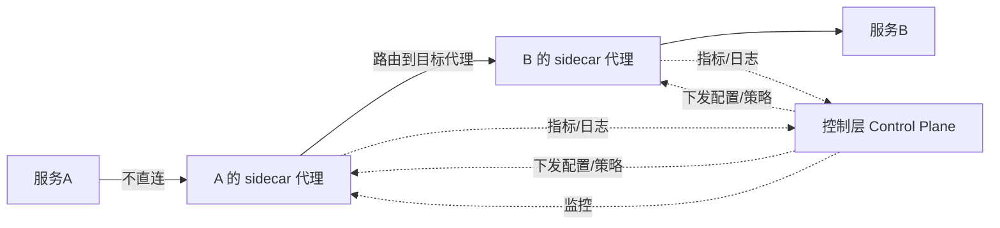

## 纲要

- Service Mesh 中文叫服务网格，听着高大上，其实它不是具体产品，而是一个概念、理论层面的东西
- 微服务火热之后带来一堆新问题：服务发现、负载均衡、路由、流量控制、服务间通信可靠性、监控
- API 网关是老方案：集中式管理能解决一部分，但有单点、容易成为瓶颈、实现越来越臃肿难维护
- Service Mesh 的本质：把网络从业务代码里抽离出来，让开发者不再关注这些底层业务无关的东西，甚至完全感知不到
- 两个知名实现：Linkerd 和 Istio，都基于 sidecar（边车）模式
- sidecar 模式下每个服务配一个独立代理，通信不直连，要走代理转发，所有代理构成数据层，再加一个独立部署的控制层来配置和监控
- Linkerd：2016 年起步的 CNCF 项目，Scala 写的 1.x 内存占用广受诟病，后来有了替补项目，2.0 改用 Rust 并为 Kubernetes 定制
- Istio：Google、IBM、Lyft 三巨头发起，2017 推出，2018 年 7 月发 1.0，综合来看更胜一筹
- 这一门课选 Istio 来讲，下一节深入它的架构设计

## 什么是 Service Mesh

中文翻译是**服务网格**。听起来很高大上，其实它不是一个具体的东西、具体的产品，而是一个概念或者理论层面的东西。

这个概念其实是随着微服务而来的。前几年微服务火了，同时也就带来了很多新问题：

- 服务发现
- 负载均衡
- 路由
- 流量控制
- 服务间通信的可靠性
- 监控

等等，都需要解决。

### 老方案：API 网关

先出现了 API 网关，可以集中式地把服务配置管理起来，能解决上述一部分问题。但它有个单点的问题——容易成为系统的瓶颈，并且实现起来也会越来越臃肿，不容易维护。

### 新思路：把网络抽离出来

再往后一点点，就出现了 Service Mesh 的概念。上面说的那些问题，本质上其实是同一个问题——**网络的问题**。

所以大家想：能不能把这个网络从功能代码里边抽离出来，让它自己去实现服务发现、负载均衡、流量控制，去实现熔断，去确保通信的安全，让应用开发者不再需要关注这些底层的业务无关的东西，甚至完全感知不到这一层的存在？

答案是肯定的，我们就把这个东西叫做 Service Mesh。

然而它还只是空中楼阁，需要有人去真正地实现。

## 两个知名实现

目前有两个非常知名的、具体的实现：**Linkerd** 和 **Istio**。分别了解一下。

### Linkerd

Linkerd 最初是在 2016 年打造的一个服务网格项目，是 CNCF 的官方项目，最初是用 Scala 语言编写，设计理念是支持基于物理机或者是虚拟机的部署。

由于最初版本的内存占用广受诟病，并导致了替补新项目的开发：这是一个轻量级的服务网格，用 Rust 语言编写，为 Kubernetes 定制，叫 linkerd2（candidate 项目），目前已经合并到 Linkerd，并且在 2018 年 7 月份发布为 Linkerd 2.0。

鉴于 Linkerd 2.x 是基于 Kubernetes 的，Linkerd 1.x 是基于节点的，所以人们可以更灵活地做出选择。

### Istio

Istio 是由 Google、IBM 和 Lyft 三大巨头发起的开源的服务网格项目，该项目在 2017 年推出，并在 2018 年 7 月发布了 1.0 版本。

可以说 Istio 是如今炙手可热的网格项目，同时它也支持多种平台的部署：支持在 Kubernetes 上部署的服务使用 linkerd 注册的服务，也支持在虚拟机上部署的服务。

### 怎么选

从整体的架构设计上，其实两者是一样的，都是基于 sidecar（边车）的模式。网上关于 Linkerd 和 Istio 的对比资料也非常多。总体来说，不管是稳定性、功能丰富程度，还是社区的活跃度，都是 Istio 更胜一筹。

可以到 GitHub 上去看一看 Istio 的火热程度：GitHub 首页里有一个同名项目也叫 Istio，star 到了 17k+，三百多个贡献者，五十八个 release，二十四个分支。

所以这门课程就选择 Istio 进行学习。

## sidecar 模式是怎么工作的

不管 Linkerd 还是 Istio，架构设计都基于这个 sidecar 模式：

- 在这种模式下，**每个服务都会被分配单独的一个代理**
- 服务间的通信并不是直接进行的，而是通过自身的代理进行转发
- 代理会将请求的数据路由到目标服务的代理，该代理再将请求转发到目标的微服务
- 所有这些服务代理构成了**数据层（data plane）**

有了数据层之后，还要有一个负责管理数据的，也就是**控制层（control plane）**，用来对数据层进行配置和监控。控制层一般是独立部署的。



### 两层的分工

| 层次 | 由谁组成 | 职责 |
| --- | --- | --- |
| 数据层（data plane） | 每个服务配一个 sidecar 代理，所有代理合起来 | 承载真实流量：转发、路由、负载均衡、重试、熔断 |
| 控制层（control plane） | 独立部署的控制面组件 | 不碰业务流量，负责配置下发、策略管理、监控数据采集 |

这个分工的意思很直白：**业务代码只管业务，网络的事儿全部下沉到边车**，控制面想改路由、改策略，改的是代理的配置而不是改业务代码。

```text
应用服务
├── 业务容器（只写业务，不管服务发现/负载均衡/熔断）
└── sidecar 代理容器（接管进出流量，做转发与安全）
    └── 与控制层通信，拉取配置，上报指标
```

## API 速览

| 概念 | 要点 | 常见误解 |
| --- | --- | --- |
| Service Mesh | 一个概念/理论，不是具体产品 | 以为装个组件就叫上了 Mesh |
| API 网关 | 集中式方案，管一部分 | 单点、臃肿、容易成瓶颈 |
| sidecar（边车） | 每个服务配一个独立代理 | 以为只有一个统一代理 |
| data plane | 所有 sidecar 代理的集合 | 以为是独立进程集群 |
| control plane | 独立部署，配置与监控 | 以为它也转发业务流量 |
| Linkerd | CNCF 项目，1.x 基于节点（Scala），2.x 基于 Kubernetes | 以为只有一套 |
| Linkerd2 | Rust 编写、为 Kubernetes 定制，2018-07 发 2.0 | 以为是另一个产品，其实已合并 |
| Istio | Google / IBM / Lyft 发起，2017 推出，2018-07 发 1.0 | 以为只支持 Kubernetes |

## Demo 示例

按课程路线，这一节先建立概念，下一节就详细了解 Istio 的架构设计。整个学习路径是这样一条线：

```text
12-1  什么是 Service Mesh / Istio        ← 当前
  │
  ├── 12-2  Istio 架构和原理
  ├── 12-3  部署面向生产的 Istio - istio-init
  ├── 12-4 ~ 12-6  核心组件（上 / 中 / 下）
  ├── 12-7  部署 bookinfo
  ├── 12-8  智能路由
  ├── 12-9  指标收集和查询
  ├── 12-10 分布式追踪
  └── 12-11 grafana 和 kiali
```

概念落地的判据，其实就三条：

| 想解决的问题 | Mesh 之前 | Mesh 之后 |
| --- | --- | --- |
| 服务发现 | 业务代码里写死或自己实现 | sidecar 自动拿到目标实例列表 |
| 负载均衡 | 代码里配 | 代理层做 |
| 熔断 / 重试 | 代码里写 | 代理层配置 |
| 安全通信 | 代码里搞证书 | 控制面下发 mTLS 策略 |
| 调用链监控 | 接 SDK 打点 | 代理自动上报 |

验证「是不是真的把网络抽离了」，就看一件事：**应用进程里有没有这段代码**。没有，就说明这一层做到了「开发者感知不到」。

```bash
# 看一个被 Mesh 接管的服务，业务容器里找不到这些逻辑
# 下面命令中的变量按你的集群环境赋值后再执行
kubectl exec -it $POD -c <业务容器> -- sh
# 业务代码里只有业务，没有服务发现 / 负载均衡 / 熔断的实现
# 同一个 Pod 里多出一个代理容器在跟着
kubectl get pod $POD -o jsonpath='{.spec.containers[*].name}'
```

### 总结

- Service Mesh 是概念不是产品，核心主张是「把网络从业务代码里抽离出来」
- API 网关能集中管一部分，但单点、臃肿、容易成为瓶颈，这是它被 Mesh 取代的根本原因
- sidecar 模式下每个服务配一个独立代理，通信走代理转发，代理集合构成数据层，再加一个独立控制层
- Linkerd 1.x（Scala，基于节点）与 Linkerd 2.x（Rust，基于 Kubernetes）是两个时代，后者替代前者
- Istio 由 Google / IBM / Lyft 发起，功能、稳定性、社区都更胜一筹，所以课程选它来讲

