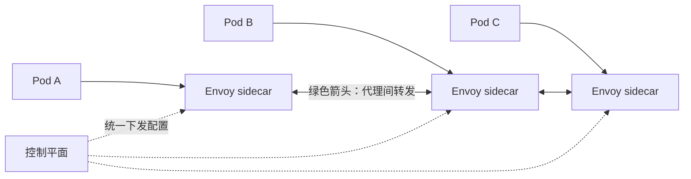
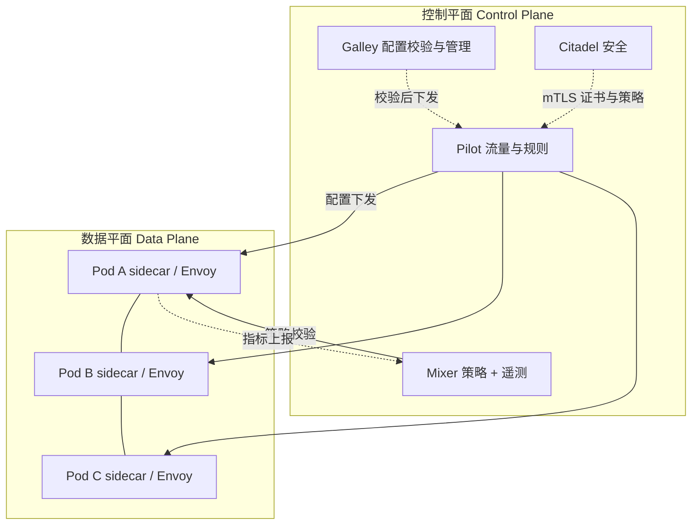

## 纲要

- 官网就是 `istio.io`，加 `/zh` 切中文文档；但系统学习还是建议看英文，中文翻译比英文还晦涩
- 首页四大块功能：Connect（连接）、Secure（保护）、Control（控制）、Observe（观测）
- 这四个名词听着虚，本质就一层代理——跟 Nginx 不同，它是「每个服务一个」的代理
- 代理能接管 Pod 网络，靠的是Pod 里容器共享网络命名空间的机制，进出流量都过代理
- 数据面 = 一堆代理；控制面 = 统一管这些代理的组件，手动改每个代理配置是不现实的
- Sidecar 默认选 Envoy（C++ 写的，2016 年就发了 1.0，Istio 之前就有，只是被选作网络代理）
- Pilot：告诉 Envoy 集群里有什么服务、谁分多少流量、超时多久、重试几次，把用户配置翻译成 Envoy 能识别的格式
- Mixer：策略（访问控制、限流到 QPS）+ 遥测（从 Envoy 收数据，通过 adapter 转发给 Prometheus、Stackdriver、Datadog 等）
- Galley 校验配置并屏蔽底层平台细节；Citadel 负责安全（服务间通信升级成 mTLS、授权 RBAC），但都不是必须的

## 先从官网说起

了解 Istio 可以先去看官网，网址很简单，就是 `istio.io`，默认官方原版英文文档。在链接上加上 `/zh` 就会切换到中文文档。

课程里看中文文档舒服些，但真要系统学习，建议大家尽量看英文——中文翻译比英文还要晦涩难懂得多。

首页有四大块，很清晰：**连接（Connect）、保护（Secure）、控制（Control）、观测（Observe）**，每一块都有简短描述：

| 功能 | 官网描述 | 大白话 |
| --- | --- | --- |
| Connect | 智能控制服务之间的流量和 API 调用，测试并通过红黑部署逐步升级 | 流量治理、灰度、金丝雀 |
| Secure | 通过托管身份验证、授权和服务间通信加密，自动保护你的服务 | 服务之间自动加密、鉴权 |
| Control | 应用策略并确保其执行，使资源在消费者之间公平分配 | 策略下发、配额限流 |
| Observe | 通过丰富的自动追踪、监控和记录，了解正在发生的情况 | 链路追踪、指标、日志 |

这四块都能点进去。文档内容非常多：从相关概念、架构，到 Istio 的安装（Kubernetes 上的安装、基于 Control 的安装），还有任务和示例让你通过做任务逐步实践。看起来非常完善贴心——不过真要一点一点啃文档，过来人告诉大家真的是非常痛苦。

所以文档的价值其实更适合在**学完课程之后**再去看：那时候你遇到具体问题再翻文档，肯定更有帮助。

## 剥掉名词看本质

回到 PPT：首页这几个功能听起来非常高级、功能非常强大，但一股脑出现这么多名词，还都是很虚的概念，看了跟没看一样。

**其实它的本质就很简单：核心就是一个代理。**

但跟我们熟悉的 Nginx 代理不太一样——这个代理是针对每个服务的。在 Kubernetes 里，针对的就是每个 Pod 一个 Pod 有一个网络代理。它正是利用了 Pod 中容器共享网络的机制，通过某种手段让这个代理完全接管 Pod 网络，让服务的进出流量都经过代理，这样它就可以做很多事情了。

有了代理之后，还需要一个对这些代理统一管理的组件——毕竟手动更新每个代理的配置是不现实的。

这时候集群的情况大致就是这张图：每个 Pod 的网络都被上面的控制中心管理起来了。这就是 Istio 最简易的模型。



## 更细致的两层架构

整体上跟刚才说的类似，分成两块：上面是**数据平面**，下边是**控制平面**。

- **数据平面**：由一系列的代理组成，这些代理控制微服务之间的所有网络通讯以及各种策略
- 两个 Service 在通讯的时候，两个 Pod 里都有一个 proxy 组件，它们之间的通讯会通过 proxy 进行转发（就是那根绿色箭头）
- proxy 之间支持很多协议：HTTP/1.1、HTTP/2、gRPC，或者 TCP，覆盖了主流的网络通讯协议

下面这一堆就是控制平面，由很多模块组成：有管理流量的、管理路由策略的、收集监测数据的、校验配置的、负责通信安全的……功能非常多。



## 五个模块逐个看

### Envoy：一线员工

Proxy（代理）默认情况 Istio 选择的是开源的 **Envoy**，Envoy 是一个用 C++ 开发的高性能代理组件，用于管理所有服务的入口和出口流量。

其实 Envoy 本质上并不属于 Istio——它在 2016 年就已经发布了 1.0，那个时候还没有 Istio，可以理解为 Istio 选择了 Envoy 来作为它的网络代理。

得益于 Envoy 内置也有很多功能：动态服务发现、负载均衡、多种协议支持、断路器、流量分割、健康检查、模拟一些故障，还有监控指标等等。

Envoy 会以 sidecar 的形式部署在每一个 Pod 中，负责完成 Istio 的核心功能。**如果把 Istio 比作一个互联网公司，Envoy 就是这个公司的一线员工，所有的具体工作都是由它们干的。**

### Pilot：Envoy 的直接领导

Pilot 就好比是 Envoy 的直接领导。Pilot 会给 Envoy 提供一些帮助，告诉它怎么来干活。

刚才说了 Envoy 内置很多功能：服务发现、负载均衡、断路器、流量管理，但是他自己跑在一个容器里，什么信息都不知道，就没法干活了。

Pilot 就是给它提供信息的，告诉他：

- 集群都有什么样的服务 → 他就能做**服务发现**
- 哪些 Pod 需要多少流量 → 他就能做**AB 测试、灰度部署**
- 多长时间算超时 → 超时控制
- 应该重试几次 → 重试次数

在客户端，用户可以为 Pilot 配置这些流量管理。Pilot 会根据用户的配置和他得到的服务信息，转换成 Envoy 可以识别的格式，然后分发给他们，最终由 Envoy 实现用户期望的行为。

**有了 Pilot 就能转起来了，别的组件可以不需要，所以 Pilot 和 Envoy 这两个组件在 Istio 里是核心。**

### Mixer：策略 + 遥测

Mixer 是一个独立的组件，有两大功能：一个是**策略**，一个是**遥测**。

**策略**：它为整个集群执行访问控制——哪些用户可以访问哪些服务，还有一些策略管理，比如对某些服务的访问速度限制：这个服务最多接收 100 QPS，超过的就会被直接扔掉。这些策略都是通过 Kubernetes 的配置文件来描述的，而且它们不是必要的，没配置就相当于没有这种策略约束。

**遥测**：主要是数据的收集和汇报。从哪收集？从 proxy（也就是 Envoy）里收集。收集的是服务之间流转的数据。收集完汇报给谁？汇报对象非常多，每个汇报对象都会有一个 adapter 适配器，把数据格式转换成后端认识的格式。

常见 adapter 像 Prometheus、Stackdriver、Datadog、Bluemix 等等，非常多。汇报什么数据？请求从哪发出来、发给谁、用的什么协议、请求延时、响应状态码等等。

同样，汇报这个工作也不是必须的，甚至可以不用 Mixer 组件，也能把 Istio 跑起来。

### Galley：校验 + 后勤

最开始 Galley 只是负责验证配置，在 Istio 1.1 之后升级为整个控制平面的配置管理中心，配置验证的工作还是继续在做。

主要就是：

1. **校验**：各种配置是不是正确
2. **配置管理**：主要目的是将其他所有 Istio 组件与具体的底层平台（比如 Kubernetes）给它的配置细节隔离开，相当于是一个后勤的工作

### Citadel：安全

最后一个组件是 Citadel，主要功能是安全相关的：可以为用户到服务、服务到服务之间提供安全的通信，可以让 HTTP 的服务无感知地升级成 HTTPS（mTLS），还有服务的访问授权，包括 RBAC 的访问控制。

当然这个功能也不是必须的——如果你的网络环境是安全的，业务上也不需要权限控制，完全可以忽略这个功能。

## 它到底解决了哪些实际问题

架构看起来非常炫酷、功能也非常强大，但是一个架构和产品出来都是要解决具体问题的。看看 Istio 的功能和架构设计都解决了哪些实际问题。

### 拆成微服务之后，排查变难了

原来的单个应用拆成多个微服务，它们相互调用才能完成一个任务。而一旦某个过程出错，组件越多，出错的概率就会越大，就会非常难以排查。

用户请求出问题，无外乎两种：**错误**和**慢响应**。

- 请求错误：得知道哪个步骤出错了。这么多微服务之间的调用，怎么确定哪个调用成功、哪个没成功？
- 响应太慢：需要知道哪些地方比较慢，整个链路各个阶段耗时是多少，哪些调用是并发执行，哪些是串行

这些问题都要求我们能非常清楚整个集群的调用以及流量情况。

### 没有错误处理机制会连锁出问题

微服务拆成这么多组件之后，如果单个组件出错的概率不变，整体出错概率就会增加。服务调用的时候如果没有错误处理机制，会导致非常多的问题：

- 应用没配超时参数或者配得不正确，会导致请求的调用链超时**叠加**，对用户来说就是请求卡住了
- 没有重试机制，某种原因导致的偶发性故障会直接把错误反馈给用户，体验非常不好
- 某些节点异常（网络中断或者负载很高），也会导致整体响应时间变长，这时候就需要服务能**自动避开**这些节点上的应用

### 发布也要智能流量控制

应用的数量增多之后，日常发布就成了一个难题：

- 应用发布需要非常谨慎，如果一次性升级出错，整个线上应用不可用，影响范围非常大
- 很多情况需要同时存在不同版本，用 AB 测试试验哪个版本更好
- 版本升级改了 API、服务之间又有依赖，希望自动控制发布期间不同版本访问到不同的应用

这些都需要智能的流量控制机制。

### 安全功能一遍遍重写

为了保证系统安全，每个应用都要实现一套相似的认证授权、HTTPS、限流等等功能。一方面大多数程序员对安全相关的功能并不擅长也不感兴趣，另一方面这些内容非常相似，每次都要实现一遍非常冗余。这就需要一个能自动把安全这块管理起来的系统。

上面提到的问题是不是很多都很匹配——**它们就是 Istio 尝试解决的问题**。把问题和 Istio 提供的功能做一个映射，你会发现非常匹配。毕竟 Istio 就是为了解决这个问题才出现的。

| 实际问题 | Istio 的解法 |
| --- | --- |
| 调用链难排查 | Mixer 遥测 + 分布式追踪 |
| 错误 / 慢响应定位 | 指标 + 链路耗时数据 |
| 超时叠加 | Pilot 下发超时、重试、断路器配置 |
| 偶发故障 | 重试机制由代理自动做 |
| 坏节点拖慢整体 | 熔断 / 异常实例剔除 |
| 灰度、AB 测试、依赖版本共存 | Pilot 的流量规则（权重 / 路由） |
| 每个应用重写一遍安全 | Citadel 管 mTLS 与 RBAC，业务无感知 |

## API 速览

| 能力 | 归属 | 是否必需 | 关键说明 |
| --- | --- | --- | --- |
| 接管 Pod 出入流量 | Envoy sidecar | 必需 | 靠 Pod 内容器共享网络命名空间 |
| 服务发现 / 超时 / 重试 / 权重路由 | Pilot | 核心必需 | 把用户配置翻译成 Envoy 格式下发 |
| 访问控制 + QPS 限流 | Mixer 策略 | 可选 | 没配策略就等于没有约束 |
| 指标 / 日志 / 追踪数据汇报 | Mixer 遥测 + adapter | 可选 | adapter 对接 Prometheus、Stackdriver、Datadog |
| 配置校验与平台解耦 | Galley | 必需（轻） | 1.1 起是配置管理中心 |
| mTLS、授权、RBAC | Citadel | 可选 | 内网安全可信可忽略 |

## Demo 示例

先建概念，后动手。整个集群被接管之后，资源结构大致是：

```text
istio-system/
├── pod/istio-pilot-xxxxx            # 控制面：流量规则
├── pod/istio-mixer-xxxxx            # 策略与遥测
├── pod/istio-galley-xxxxx           # 配置校验
├── pod/istio-citadel-xxxxx          # 证书与 mTLS
├── pod/istio-proxy（在业务 Pod 里）  # Envoy sidecar
├── deploy.apps/{istio-pilot,istio-mixer,istio-galley,istio-citadel}
├── svc/istio-pilot:15010            # 发现接口
├── svc/istio-mixer:9091
└── svc/istio-galley:443
```

一个 Pod 被注入 sidecar 前后差别很大：

```bash
# 注入前：只有业务容器
# 下面命令中的变量按你的集群环境赋值后再执行
kubectl get pod $POD -o jsonpath='{.spec.containers[*].name}'
# myapp

# 注入后：多出一个 istio-proxy，两个容器共享同一个网络命名空间
kubectl get pod $POD -o jsonpath='{.spec.containers[*].name}'
# myapp istio-proxy
```

验证「接管成功」的三个判据：

| 判据 | 怎么验 |
| --- | --- |
| 流量真的过代理 | 进业务容器看路由规则，`iptables`/`netstat` 里能看到重定向到 15001/15006 |
| 控制面下发成功 | Pilot 日志无报错，Envoy 拿到最新配置（xDS 推送） |
| 代理间协议兼容 | Envoy 之间跑 HTTP/1.1、HTTP/2、gRPC、TCP 都能通 |

### 总结

- 四大功能（连接/保护/控制/观测）本质就是一层代理，只不过它是「一 Pod 一个」而不是统一一个
- 接管 Pod 网络的底气在于容器共享网络命名空间，进出流量全过代理后才谈得上治理
- Envoy 是干活的，Pilot 是发指令的，这两个是核心；Mixer、Galley、Citadel 都能按需取舍
- Mixer 的遥测靠 adapter 对接后端，不想接就别装，Istio 照样跑
- Istio 解决的就是微服务化的四件老实事：排查难、错误处理缺失、发布不敢灰度、安全代码重复实现

