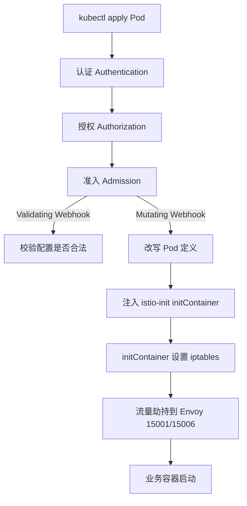

## 纲要

- 动手前先把环境清干净：监控、测试服务全删掉，目标状态是除必需组件外只剩一个 ingress-nginx
- Pod 要能被 Istio 接管，得满足几个硬要求：端口必须有名字且带协议前缀、容器要声明端口、要有 Service、Deployment 带 `app` 和 `version` 标签
- 生产安装推荐 `helm template` 模板方式：先生成全部 yaml 看一眼再 apply，比直接连 Tiller 更透明
- 发行版要从 GitHub releases 下载（1.1.7），解压出来的 `istioctl` 可以做手工 sidecar 注入
- `values.yaml` 里 `gcr.io/istio` 拉不到就换仓库前缀，镜像前缀改了再 template
- sidecar 自动注入靠的是 **mutating 类型的准入 webhook**，它给 Pod 塞一个 initContainer 去设置 iptables
- istio-init 干的就是劫持流量：initContainer 设 iptables 把入口出口流量导到 Envoy
- 也可以不用准入控制改装 CNI 插件，但 CNI 插件出来不久，默认那套更成熟稳定
- 裸机没有 LoadBalancer，gateway 要改成 NodePort 暴露
- 装完 init 之后是一堆 Job 去批量创建 CRD，等 Job Completed，CRD 数量对上（五十多个）才算好

## 先把环境清干净

Istio 相关的组件比较多，占用的资源也会相对比较大，所以在开始之前，最好把之前安装的所有东西全清空：监控删掉、自己做的测试服务删掉。

最终最好达到这个效果：

```bash
helm ls -a --all
# 什么都没有，之前装的监控都清干净了

kubectl get pod -n monitoring
# monitoring 里什么都没留下

kubectl get pod --all-namespaces
# 除了 Kubernetes 系统必须的组件之外，只剩一个 ingress-nginx，其他都清空了

kubectl get pod -n default
# 默认命名空间下没有在运行的 Pod
```

## 文档里的 Pod 要求

回到 Istio 官网 `istio.io`，看中文文档，概念之后第二部分就是安装。文档说有两种：基于 `currentKubernetes`（容器平台）还有 `consul`（注册中心），我们当然看 Kubernetes 的。

里面有个提示：Istio 1.1 在 1.1、1.2、1.3 版本做过测试，最新版的应该也没问题，大体安装流程是相同的。

**查看一个 Pod 的要求**，这几条是硬性的：

| 要求 | 说明 |
| --- | --- |
| 给端口正确命名 | 要用 Istio 提供的服务，Pod 必须每个端口都有名字，而且有格式要求：**协议 + 后缀**，常见协议有 gRPC、HTTP、HTTPS、TCP 等 |
| Pod 必须声明端口 | 容器 / Pod 要声明监听了哪个端口 |
| 关联服务 | Pod 不管怎样都需要有一个 Service 的定义 |
| Deployment 标签 | 建议带 `app` 和 `version` 两个标签；`app` 应用名字会在分布式追踪过程中被加入到上下文信息里 |
| 用户 ID | 对 UID 有要求，这个一般跟我们关系不大 |

```yaml
apiVersion: v1
kind: Service
metadata:
  name: webdemo
  labels:
    app: webdemo
spec:
  ports:
    - name: http          # 协议前缀，不是随便起的
      port: 80
      targetPort: 8080
  selector:
    app: webdemo
---
apiVersion: apps/v1
kind: Deployment
metadata:
  name: webdemo
spec:
  template:
    metadata:
      labels:
        app: webdemo      # app 会被追踪上下文带上
        version: v1
    spec:
      containers:
        - name: webdemo
          image: nginx
          ports:
            - name: http   # 端口必须有协议前缀
              containerPort: 8080
```

**标签不合规，sidecar 注入进来也没法识别流量，这是最常见的踩坑点。**

## 两种安装方式

往下是「准备您的 Kubernetes 平台」——平台我们本地服务器已经搭好了。

然后是「安装评估安装 / 生产」，我们选生产环境；只用来玩一玩没意思。文档建议使用 `helm` 安装指南来做生产级安装。

推荐两种方式：

1. 用 Helm 渲染（`template`）生成一个配置文件，然后 `kubectl apply` 来安装
2. 使用安装监控时的方式——`helm install` 连接远程的 Tiller 服务，让 Tiller 帮我们管理这个安装

由于 Istio 比监控来说更加复杂，生成的配置文件也更多，所以**最好还是用 template 方式**：先把所有配置文件写出来，自己看一遍再去执行，这样也更容易搞清楚它的机制是什么。

### 下载发行版

在 GitHub 上的 istio 仓库里，进入 releases 下载。目前最新版本是 1.1.7，复制链接到 master 节点 wget 下来：

```bash
ISTIO_URL=https://github.com/istio/istio/releases/download/1.1.7/istio-1.1.7-linux-amd64.tar.gz
wget "$ISTIO_URL"
tar -zxvf istio-1.1.7.tar.gz
```

解压之后 `istio-1.1.7` 目录下有一个 `istioctl` 文件，后面可能会用它做一些测试，可以手工进行 sidecar 注入。

仓库（Google 的那个）就别装了，肯定访问不到。

### 镜像仓库换源

看 `values.yaml`，`docker.io/istio` 这块还是有点问题——可能下载不到这个镜像，仓库名字要改。改成阿里云的仓库（自己维护的一个仓库），istio 相关的所有镜像都放到了这个仓库里：

```bash
# values.yaml 里把所有镜像前缀换成自己的仓库
# registry.cn-hangzhou.aliyuncs.com/imooc/...
```

### 裸机没有 LoadBalancer

文档提示：默认情况下 Istio 使用的是 LoadBalancer 服务类型。云平台可能支持这种类型（前提还得有负载均衡器），但对于**裸机安装**肯定没有这个支持。这时候可以用 NodePort 方式把服务暴露出来：

```bash
--set values.gateways.istio-ingressgateway.type=nodeport
```

## istio-init 到底在干什么

下面这块提示很关键，说明假定你将 istio-init 容器用于设置 iptables，并将网络流量重新定向到 Envoy。

也就是说，如果你在自定义配置中把 `sidecarInjector` 那块改成了 CNI 相关配置（CFEnable 之类），还要确保部署了 CNI 插件。说来话长，得先理解 sidecar 自动注入的原理。

**sidecar 自动注入利用了准入控制器。** 还记得一个 API 请求打到 API Server 分几步吗——三步：**认证、授权、准入**，准入是最后一步，本质上就是一段代码。

Kubernetes 1.9 之后，准入控制器有两种类型叫 admission webhook：

| 类型 | 作用 |
| --- | --- |
| `ValidatingAdmissionWebhook` | 根据自定义准入策略决定**是不是拒绝请求**，主要用来拒绝 |
| `MutatingAdmissionWebhook` | 根据预先定义好的配置对请求进行**编辑** |

通过 Mutating 类型的 webhook，我们就可以在每一个 Pod 上给它建一个 initContainer，这个 initContainer 就是用于设置 iptables，把流量劫持住，让入口和出口都通过 Envoy。

不过 Istio 也提供了另外一种方式：**不使用这个准入控制，而是直接部署它的 CNI 插件**。CNI 插件其实是一个插件链，并不会影响我们现有的 Kubernetes 的 CNI 插件——相当于是又加了一层专门做网络初始化设置的插件。

默认情况下 CNI 插件是关闭的，要手动打开再去安装 CNI 插件。两种方式都可以，但 **CNI 插件出来时间不久，相对成熟稳定的方法还是使用默认这套通过准入控制来做的方式**。



```text
Pod（被注入后）
├── initContainer: istio-init
│     干的事：写 iptables，把 inbound/outbound 重定向到 Envoy
├── container: istio-proxy（Envoy）
│     干的事：转发、路由、负载均衡、重试、熔断
└── container: 业务容器
```

## 正式安装 istio-init

```bash
# 0. 先把 install 目录拷到自己维护的地方（放 repos 里不合适），顺手改 values 的镜像前缀
#    后续所有修改都记在这个目录里，层级也没那么深
ISTIO_CUSTOM_DIR=$HOME/deepin/istio-1.1.7-custom
cp -r istio-1.1.7/install/kubernetes "$ISTIO_CUSTOM_DIR"

# 1. 建命名空间
kubectl create namespace istio-system

# 2. 用 helm 把 chart 里所有 Kubernetes 配置渲染出来，重定向到一个文件
# 先给变量赋值，例如：VALUES_FILE=$HOME/deepin/istio-values.yaml
helm template istio-init \
  --name istioinnet \
  --namespace istio-system \
  -f "$VALUES_FILE" \
  --set values.gateways.istio-ingressgateway.type=nodeport \
  > install-istio.yaml

# 3. 看一下这个文件里都是什么
#    最上面可能是一个 ConfigMap，下面全是 CustomResourceDefinition
wc -l install-istio.yaml     # 一千五百多号行
kubectl apply -f install-istio.yaml
```

这个 yaml 里主要就是一堆 `CustomResourceDefinition`——自定义资源类型，我们之前讲过，很多自定义的源类型。Job 就是用来创建这些 CRD 的。

等一下：

```bash
kubectl get pod -n istio-system
# 所有 Pod 仍处于 ContainerCreating，镜像下载需要时间
```

这时候看 `kubectl get crd`，还没有 Istio 相关的 CRD，说明它还没建起来。从刚才的配置能知道它应该是通过这个 Pod 去自动生成和创建 CRD。等它跑完：

```bash
kubectl get job -n istio-system
kubectl get pod -n istio-system     # 状态变成 Completed

kubectl get crd | grep istio
# 非常多，非常多的 CRD
```

文档说「如果使用以下命令，可以看到全部五三个 CRD 提交到 API Server」，数一下 `wc -l`——五十了，没有问题。**对上数了。**

init 这部分做完，接下来就是正式去部署 Istio 的核心组件了。

## API 速览

| 能力 | 做法 | 关键点 |
| --- | --- | --- |
| 渲染全部配置 | `helm template <release> --name X --namespace Y -f values.yaml` | 先出文件再 apply，比连 Tiller 透明 |
| 暴露裸机网关 | `--set values.gateways.istio-ingressgateway.type=nodeport` | LoadBalancer 裸机没有 |
| 换镜像仓库 | 改 `values.yaml` 里镜像前缀 | `gcr.io/istio` / `docker.io/istio` 换成自己的仓库 |
| 手工注入 sidecar | `istioctl kube-inject -f <yaml>` | 解压出来的那个 `istioctl` |
| 下载发行版 | GitHub releases，`wget` + `tar` | 1.1.7，里面有 `istioctl` 和 `install/` |
| 看注入机制 | 查 MutatingAdmissionWebhook | 准入三步骤的最后一步 |
| 校验 CRD 装没装 | `kubectl get crd \| grep istio` + `wc -l` | 五十多个才对得上 |
| 看 Job 完成没 | `kubectl get job -n istio-system` | 完成后 CRD 才出现 |

## Demo 示例

```bash
# 1. 环境清理
helm delete imoocprom --purge
kubectl get crd | grep coreos | awk '{print $1}' | xargs kubectl delete crd
kubectl delete namespace monitoring

# 2. 下载并解压发行版
wget "$ISTIO_URL"
tar -zxvf istio-1.1.7.tar.gz
cp istio-1.1.7/bin/istioctl /usr/local/bin/

# 3. 渲染 + apply
kubectl create namespace istio-system
helm template istio-init --name istioinnet --namespace istio-system \
  -f values.yaml \
  --set values.gateways.istio-ingressgateway.type=nodeport \
  > install-istio.yaml
kubectl apply -f install-istio.yaml

# 4. 等 Job 跑完，数 CRD
kubectl get pod -n istio-system
kubectl get job -n istio-system
kubectl get crd | grep istio | wc -l     # 应为 50+
```

集群在这个阶段的形态：

```text
istio-system/
├── job/istio-init-remove-xxxxx     # 清理用
├── job/istio-init-install-xxxxx    # 批量创建 CRD，跑完变 Completed
└── crd/
    ├── sidecars.networking.istio.io
    ├── gateways.networking.istio.io
    ├── virtualservices.networking.istio.io
    ├── destinationrules.networking.istio.io
    ├── serviceroles.rbac.istio.io
    ├── clusterroles.rbac.istio.io
    └── ...（共 50+ 个）
```

| 现象 | 原因 | 处理 |
| --- | --- | --- |
| 渲染出的 yaml 拉不到镜像 | `gcr.io/istio` 在前缀里 | 改自己仓库前缀后重跑 template |
| Job 一直 Running | 镜像没拉下来 | 查 Pod 事件看是哪个镜像，换源重来 |
| Job Completed 但没 CRD | 顺序没对 / apply 失败 | 看 Job 日志，重新 apply |
| CRD 数量对不上 | 版本不一致 | 对齐发行版与 values 的版本字段 |
| 网关起不来 | LoadBalancer 裸机不支持 | `--set ...type=nodeport` |
| 业务 Pod 没被注入 |  Deployment 缺 `app`/`version` 或端口没名字 | 补标签、给端口加协议前缀 |

### 总结

- 装之前把监控和测试服务清干净，空环境起步，后面出问题好回溯
- 端口名必须带协议前缀、`app`/`version` 标签必须有，这是能被 Istio 正确识别流量的前提
- 生产用 `helm template` 先把配置全渲染出来看一眼，比直接 helm install 到 Tiller 更有掌控感
- sidecar 注入的本质是 MutatingAdmissionWebhook 改写 Pod，插进去的 initContainer 负责 iptables 劫持
- CNI 插件方案能绕过准入控制，但成熟度不如默认方案，生产先用默认
- 裸机网关必须改 NodePort，Job Completed 后数一下 CRD（五十多个）确认 init 这一步真的成了

