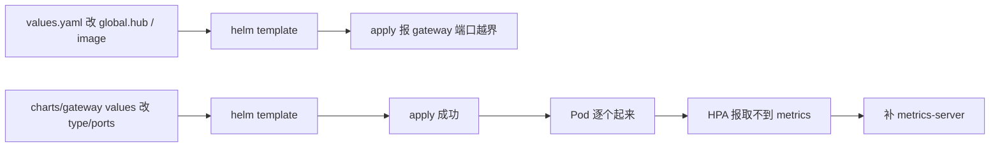

## 纲要

- 生产环境推荐 `default` 配置文件，另有 demo / demo-offs / minimum / sds 等几种可选
- 远程连 Tiller 用的 ServiceAccount 和 ClusterRoleBinding 没用上，直接删掉，只要留需要的文件
- default 里必须开的：gateway、sidecarInjectorWebhook、galley、mixer（policy + telemetry）、pilot；istioCNI 保持关闭（走准入控制方案）
- `global.hub` 默认 `docker.io/istio` 拉不到，换成自己的仓库前缀
- 渲染出来的第一条资源是 PodDisruptionBudget：`minAvailable: 1`，用 label 选中 Pod，保证最少一个实例，drain 时会被保护
- Prometheus 之类的镜像常常漏改，逐个 image 核一遍再 apply
- apply 报 `istio-gateway ... 31380` 不在 nodePort 范围：Charts 里 gateway 的 service 还是 loadBalancer + 31380，要改 type 和 nodePort
- Gateway 起来之后 HPA 报「取不到 metrics」——缺 metrics-server，它是 aggregation 插件机制，二进制部署要自己给 API Server 加启动参数

## 继续方案一的第四步

上一节装完 istio-init，这一节继续去安装 Istio 的核心组件，也是方案一：选一个配置文件，然后部署对应配置文件里的核心组件。

官网建议在生产环境部署中使用 **default** 这个配置文件。一共有几个：default、demo、demo-offs、minimum、SDS。把这几个配置文件拷到之前的机器上。

Helm 目录里有一些没用的，删掉：那个 `canh`（values serviceaccount）是远程连接 Tiller 时使用的 ServiceAccount 和 ClusterRoleBinding，我们没用远程 Tiller，所以这个文件没意义，删掉；`weave` 也删掉，只留这两个文件夹。`istioctl` 下边的 istio-ingress（上一节）已经搞定了。

然后看到里面有很多个 values 文件：默认的（`values.yaml`）、demo、demo-off、minimum、remoteSDS、osx……其实各个配置文件之间主要也就是组件和模块的一些区别。既然生产环境推荐 default，就用 default 来做。

### default 里都开了什么

先看 default 的 `values.yaml`：

| 配置项 | 值 | 说明 |
| --- | --- | --- |
| `gateway.enabled` | true | 网关组件 |
| `sidecarInjectorWebhook` | 必须开 | 自动注入 sidecar 的准入 webhook |
| `galley` | 开启 | 配置校验与管理 |
| `mixer.policy` | 开启 | 策略 |
| `mixer.telemetry` | 开启 | 遥测 |
| `pilot` | 开启 | 流量与规则下发 |
| `security.nodeAgent` | 使用 | 安全节点代理 |
| `grafana` | 没用 | — |
| `prometheus` | 开启 | — |
| `kiali` | 没开启 | 后面会讲 |
| `istioCNI.enabled` | false | 我们选用的是准入控制这个方案 |

再看下面 global 的一些设置：`global.hub` 是 `docker.io/istio`，这块还是要修改——毕竟有的时候会下载不了镜像，对应改成 `registry.cn-hangzhou.aliyuncs.com/imooc`。

顺带说一句，刚才看文档时提到 Istio 对外访问方式默认是 loadBalancer，要改成 nodePort；在 values 里搜 `loadBalancer` 没搜到，先不管，等渲染出来再看。

## 先渲染，再看

```bash
helm template istio-core --namespace istio-system > istio.yaml
```

其实目前它什么都没做，就是帮我们生成一个配置文件。看一下：

**第一条资源就有点懵圈了**——`apiVersion` 是 Istio 自带的资源，我们之前没碰到过：**PodDisruptionBudget**，中文叫 **Pod 的中断预算**。

```yaml
apiVersion: policy/v1beta1
kind: PodDisruptionBudget
metadata:
  name: istio-galley
  namespace: istio-system
  labels:
    app: galley
    release: imoocistio
spec:
  minAvailable: 1
  selector:
    matchLabels:
      app: galley
      release: imoocistio
```

它的配置有名字、有 namespace、有对应的 label，还有一个 `minAvailable`——最小可用的数值是 1。对应的是拥有这些 label 的 Pod（app=galley，release=imoocistio）。

意思就是说：这个 Pod 在这个集群中最少需要一个实例，不能再少了。

**为什么要这个？** 因为有一个命令叫 `kubectl drain`，它可以把一个节点上的所有 Pod 都驱逐掉。当我一个 Deployment 只有一个实例、并且就在这个节点上的时候，drain 的时候这个 Pod 就会被保护住、不会被驱逐掉——就是尽量去保证服务的可用性。

往下还有几个，每个组件可能都有好多个中断预算的设置，都是 `minAvailable = 1`。

再过去就是 ConfigMap，包含了各种各样的配置。想把这配置的每一行都搞清楚什么意思，是非常困难的——它有多少行？**四千多行配置**。而且之前初始化的时候还创建了五十多个自定义资源 CRD。

所以这个 Istio 真是把 Kubernetes 的 CRD 机制使用到了极致，相当于是在 Kubernetes 这个系统之上又设计出来了一个非常非常复杂的系统。

## 逐个 image 核对

要注意的是 image。看一看它这里边所有的 image 是不是符合我们的要求——有一个 Prometheus 的没改过来，其他的应该都可以。

那就改一下 Prometheus：vi 下边所有依赖的组件，Prometheus 是不是有一个 hub（`global.hub`）没改过来，复制一下刚才那个改好的，改完 Prometheus 就 ok 了。改完了重新生成一遍，Grafana image 也定成 Istio 1.x 版本，这回镜像版本至少满足要求了。

## 第一个报错：gateway 端口

```bash
kubectl apply -f istio.yaml
# error: 报错了
```

报的是 istio-gateway：我们指定的是 8400 到 8900 这个 nodePort 范围，它用的是 31380，不符合我们的范围（有些同学环境上没问题）。

去改 charts/gateway 下边的 values，istio-ingressgateway 的 service 配置就在那儿。两个地方要动：

```yaml
# charts/gateway/values.yaml（示意）
ingressGateway:
  type: NodePort          # 原来是 LoadBalancer
  ports:
    - port: 8888          # 原来是 31380，不在我们允许的范围里
      nodePort: 4888      # 改成四个八，好记
      protocol: HTTP      # 不用 HTTPS，用 HTTP 8888 就够了
      name: http2
```

另外还有一个 loadBalancer 忘了改，应该就是 `type: loadBalancer`，改成 NodePort；然后 `nodePort` 改成我们那个范围里的（四个八）；HTTPS 那层也不需要，用一个 HTTP 8888 就够了；exposer TCP 的也不需要。

还有没有 nodePort 的设置？应该没有了。

改完重新 template 生成配置文件，再 apply 一下——这回没包说没有报错。



## 起来之后看日志

看看 Pod：最终创建起来的肯定都是 daemonset，istio-sidecar-injector、galley、gateway（刚才没起来的这回起来了）、mixer policy、telemetry、pilot、citadel 都已经启动了，看起来没什么问题，也没有处于重启状态。

但再看系统日志，好像报了一些异常，好多 `pod type warning`——这个之前应该是没有的：

```text
Error creating: horizontal pod autoscaling ..., namespace istio-system, telemetry
unable to fetch metrics from resource metric API. the server couldn't find the requested resource
```

后面类似的错都是找不到那个 metric，metric API 调用失败了，都是一样的数。这个问题得解决。

### metrics-server 是什么

简单讲一下 metrics-server。metrics-server 其实在 Kubernetes 社区的定位，是用来**取代 heapster** 这个项目。heapster 大家可能有所闻——很早之前它是用来获取 Kubernetes 监控数据的，比如说 Pod 还有节点的一些资源使用情况。

后来提出了 metrics-server，它把这些监控数据通过**标准的 Kubernetes API** 给它暴露出来，很优雅的方式跟 kubelet 解耦了，heapster 也就可以一点一点下线了。

但需要注意的是：**metrics-server 并不是 API Server 的一部分，而是通过一种 aggregation 插件的机制**，它是独立部署的。

不过要把这个跑起来，还是要对 API Server 的启动参数做一些调整：

- 如果用 kubeadm 搭集群，这些参数默认就有
- 如果是通过**二进制手动部署**，需要我们自己去添加参数来启用这个插件

这块配置片段文档里已经准备好了（在 metrics-server 那边）。因为是二进制部署，需要把这一块拷贝到 `/etc/systemd/system/kube-apiserver` 里，找地方加进去、调整一下格式。

这些配置主要作用是给这个插件去使用的一些证书和密钥：

```text
--requestheader-client-ca-file=...   # 指定一个根证书，也就是我们的 CA
--requestheader-allowed-names=...    # requestheader 允许的 CN
--requestheader-extra-header-prefix=...
--proxy-client-cert-file=...         # 插件自己私有的证书
--proxy-client-key-file=...          # 插件自己私有的密钥
```

两个比较重要的是 `proxy-client-cert` 和 `proxy-client-key`，就是插件自己私有的证书和密钥，这两个密钥我们还没有。

怎么办？当然可以按照文档单独生成一个，然后配置好那个证书的配置文件再生成。但可以看看有没有现成的——我们当时搭建那个集群里 `/etc/kubernetes/pki` 下面借用一下 admin 的：管理员的权限问题不用担心，CN 就是 admin。这里边不用去修改，然后根据它去生成证书和密钥（具体看之前的文档）。

## API 速览

| 能力 | 做法 | 关键点 |
| --- | --- | --- |
| 选一份 Istio 配置 | 用 `default` values | demo / minimum / sds 是别的取舍 |
| 精简 chart 目录 | 删掉没用的 values serviceaccount、weave | 只留要用的 |
| 换镜像仓库 | 改 `global.hub` 到自己的仓库 | 逐个 image 核一遍，容易漏 Prometheus |
| 生成全部配置 | `helm template <release> --namespace istio-system` | 先看再 apply |
| 保护核心组件 | `PodDisruptionBudget` + `minAvailable: 1` | kubectl drain 时生效 |
| 改网关暴露方式 | charts/gateway values：`type: NodePort` + `nodePort` + `ports` | 默认 LoadBalancer 裸机不支持 |
| 查 HPA 报错 | 看事件 `unable to fetch metrics from resource metric API` | 缺 metrics-server |
| 启用 metrics-server | 给 kube-apiserver 加 aggregation 参数 + 证书 | kubeadm 默认有，二进制要自己加 |

## Demo 示例

```bash
# 1. 精简 chart 目录，用 default values
rm -rf values-serviceaccount.yaml weave
vi values.yaml
#   global.hub: registry.cn-hangzhou.aliyuncs.com/imooc
#   mixer.image / prometheus.image / grafana.image 逐个核对

# 2. 渲染
helm template istio-core --namespace istio-system > istio.yaml
head -20 istio.yaml          # 第一条就是 PodDisruptionBudget
grep -c '' istio.yaml        # ConfigMap 四千多行

# 3. apply（第一次会报 gateway 端口）
kubectl apply -f istio.yaml

# 4. 改 charts/gateway values 后重试
vi charts/gateway/values.yaml
#   type: NodePort, nodePort: 4888, ports.port: 8888, protocol: HTTP
helm template istio-core --namespace istio-system > istio.yaml
kubectl apply -f istio.yaml

# 5. 看 Pod
kubectl get pod -n istio-system
kubectl get pdb -n istio-system

# 6. 看日志，确认 HPA 报错来源
kubectl describe hpa -n istio-system
```

这个阶段集群里的资源：

```text
istio-system/
├── pdb/istio-galley, istio-gateway, istio-mixer-policy, ...   # minAvailable: 1
├── configmap/istio                       # 四千多行核心配置
├── pod/istio-sidecar-injector-xxxxx      # mutating webhook
├── pod/istio-galley-xxxxx                # 配置校验
├── pod/istio-mixer-xxxxx                 # policy + telemetry
├── pod/istio-pilot-xxxxx                 # 流量规则
├── pod/istio-citadel-xxxxx               # 安全
├── pod/istio-proxy-ingressgateway-xxxxx  # 网关（NodePort 4888）
├── deploy/pod-disruption-budget 相关 CRD（policy/v1beta1）
└── metrics-server（待装）
```

| 现象 | 原因 | 处理 |
| --- | --- | --- |
| apply 报 31380 越界 | gateway 还是 LoadBalancer + 31380 | charts/gateway values 改 NodePort 与端口范围 |
| 某个镜像还是拉不到 | 只改了 global.hub，漏了单组件 image | 逐个 grep image 核对 |
| Pod 起一半 | 镜像版本不一致 | 改完重渲染再 apply |
| HPA 报取不到 metrics | 没装 metrics-server | 装 metrics-server + 配 API Server aggregation 参数 |
| drain 时核心组件被赶走 | 没有中断预算 | 补 PodDisruptionBudget（minAvailable: 1） |

### 总结

- 生产用 default values，sidecarInjectorWebhook、pilot、galley、mixer、gateway 都是必开，istioCNI 关掉走准入控制
- `global.hub` 换源只是第一步，单组件的 image 字段要逐个核，最容易漏掉 Prometheus 那一类
- 渲染出来的第一条往往是 PodDisruptionBudget——`minAvailable: 1` 是 drain 时的护身符，别当冗余资源跳过去
- Istio 把 CRD 用到了极致：一个 ConfigMap 四千多行、加初始化阶段五十多个 CRD，本质是在 K8s 之上又搭了一层系统
- 网关端口必须在自己允许的 nodePort 范围内，LoadBalancer 换 NodePort 记得连端口一起改
- HPA 取不到指标就是缺 metrics-server，二进制部署要给 API Server 补 aggregation 参数和独立证书

