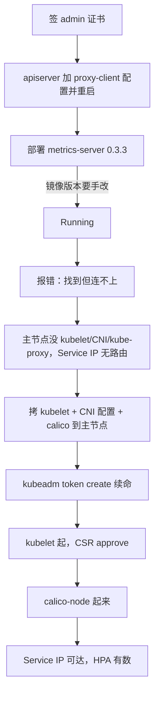

## 纲要

- 给 API Server 补 `proxy-client-cert-file` / `proxy-client-key-file`，指向用 admin 证书签出来的密钥，再重启 apiserver
- metrics-server 从 GitHub 下载 release 0.3.3，解压后 `deploy/1.8+` 下的 yaml 整个目录 apply 上去
- 官方 yaml 里的镜像版本写错了（写成 0.2.2），会卡在镜像拉不到，必须手动改成 0.3.3
- 报错从「找不到 metric API」变成「找到了但处理不了」——根因不在 metrics-server 本身
- Service IP 连不上，是因为主节点上没 kubelet、没 CNI、没 kube-proxy，clusterIP 的转发规则根本不存在
- 解法是把 worker 上的 kubelet、CNI 配置、calico 相关文件整套拷到主节点复用，别从头再装一遍
- kubelet 起来报授权失败，是 bootstrap token 过期（有效期只有 24 小时），用 `kubeadm token create` 现造一个
- kubelet 注册后会产生 CSR，需要 `kubectl certificate approve` 批掉

## 先给 apiserver 补证书授权

接着上一节继续。先找到之前的证书目录 `/etc/kubernetes/pki`，签一个 admin 的证书出来；当然也可以自己配置重新来一遍。

```bash
# CA 的位置不用改
#   /etc/kubernetes/pki/ca.pem / ca-key.pem
# 签完得到 admin.key / admin.pem，把它 copy 过去
cp admin.key admin.pem /etc/kubernetes/pki/
```

然后 vi 一下 `/etc/systemd/system/kube-apiserver`，把最后两个证书配置写上去：

```text
--proxy-client-cert-file=/etc/kubernetes/pki/admin.pem
--proxy-client-key-file=/etc/kubernetes/pki/admin-key.pem
```

重启 kube-apiserver。这是第一步。

## 下载 metrics-server

去 GitHub 搜 `metrics-server`，这是 kubernetes 孵化器项目下的子项目。看它的文档：Deployment 版本信息，1.7 大于 1.8 的时候直接去使用它的一个目录就可以了。

就用 release 0.3.3 这个版本：

```bash
MS_URL=https://github.com/kubernetes-sigs/metrics-server/releases/download/v0.3.3/components-bundle.tar.gz
wget "$MS_URL"
tar -zxvf v0.3.3.tar.gz      # metrics-server 解压出来了
```

文档提示让我们 `create -f deploy/1.8+`。看一下 `deploy/1.8+` 下面就是一堆配置文件，直接 apply 就可以了。这块也把它拷到我们项目目录下，方便大家出问题时对照——所有操作的文件都留个记录。

```bash
# deploy/1.8+ 是 metrics-server 的一部分：一个是 apiserver 的配置，一个是部署
kubectl apply -f deploy/1.8+ -n kube-system
```

### 镜像版本写错了

```bash
kubectl get pod -n kube-system | grep metrics
```

它跑到哪个命名空间下？确认一下有没有 metrics-server deployment。单独部署的肯定有 deploy。

看它的 image，这个 image 是没有的——把镜像前缀改一下，所有镜像都在这个仓库里找：`registry.cn-hangzhou.aliyuncs.com/imooc`。

改完再来一遍，得确保 Pod 正常运行。等一会儿——怎么还是 `ImagePullBackOff`？

因为这个 server deployment 的 image 版本写的不对：我们下的明明是 0.3.3，它的版本写成 0.3.2，估计是忘改了。**这块有能力的同学可以去官方给它提个 issue，让他们把这个问题修掉。**

```bash
# 强制改成 release: v0.3.3
vi deploy/1.8+/metrics-server.yaml
kubectl apply -f deploy/1.8+/metrics-server.yaml
kubectl get pod -n kube-system
```

这回没问题了，metrics-server 处于 Running 状态。

## 报错变了，但还没好

再看日志：

```bash
kubectl logs -n kube-system -l k8s-app=metrics-server
```

哇塞还有问题，而且这个报错跟刚才不一样了——刚才是不好处理、找不到，**现在是「找到了但不能处理请求」**。

```text
error: ... field validate.go:43: request cancelled waiting connection
```

有一个明确的错误信息：`waiting for connection`，没有连到这个 service。

API Server 去尝试连这个服务，这个服务是谁？先看看 kube-system 里的 service：

```bash
kubectl get svc -n kube-system
# 10.95.89.171 / 89.171 ... 这个 IP 就是 metrics-server
```

metrics-server 的 443 端口是正常的。那这个 Service IP 到底能不能连上？到 worker 节点上 `curl` 一下 89.171——是可以连的，虽然什么都没返回，但至少有连通性，肯定没问题的。

**这说明什么呢？** API Server 去连它的时候连不上——因为主节点上 Service IP 的转发根本没有：我们这儿没有 kube-proxy、没有 CNI，主节点压根就什么都没有。

所以这儿又被坑了一下：**主节点上还要部署一个 kubelet、部署一个 Calico，让 Calico 跑起来，跑上去才可以正常地联通这个 Service 请求。**

## 复用 worker 上的现成文件

那怎么办？还是回去看文档——要部署一个 kubelet，再部署一个 CNI（Calico）。

**主节点上先把镜像下载下来**——把之前那个 kubelet 镜像直接拷贝一份过来，比从头拉要快。有人会问：去 worker 节点上把这个对应的文件拿过来复用就行了，能复用就复用，不用从头来，会快很多。

```bash
# 1. kubelet 的二进制、配置文件
vi kubelet 配置文件     # 最终在这个位置
# 没有跟 worker 节点相关的东西就不需要改，直接复制过来

# 2. 目录别忘建（肯定已经有了）
#    /etc/cni/net.d 相关的 flannel/CNI 配置
#    /etc/kubernetes/...  Cauchy 配置（kubelet 的 kubeconfig）
    # 执行前先给下面的占位变量赋值，如 NODE_NAME=node1，否则变量为空会导致命令行为不符合预期
cp /etc/cubernetes/kubelet.conf ${MASTER}:/etc/cubernetes/
vi /etc/cubernetes/kubelet.conf     # 这里是不是有 10.x 的内容？改掉

# 3. 服务文件 kubelet.service
vi /etc/systemd/system/kubelet.service
```

这样会比我们从头一步一步来要快很多。

## kubelet 起来报授权失败，token 过期

```bash
systemctl start kubelet
journalctl -u kubelet -f
```

日志里 fatal 一大堆：

```text
fatal: cannot open certificate ... unauthorize
```

授权要授权——说明某个配置文件不对，是那个**授权（bootstrap token）**的内容写在这儿。这个 token 有点儿过期了，**token 有效期好像只有二十四小时**。

过期怎么办？先创建一个 token：

```bash
kubeadm token create
# 相当于自己给自己创建了一个 token
```

然后再重启一下 kubelet service，等一段时间（这个时间比较长）。重启完再来一看，这就对了。

等等，还差一步：

```bash
# 再开一个主节点终端给它授权
kubectl get csr
CSR=$(kubectl get csr -o name | grep metrics | head -1)
kubectl certificate approve "$CSR"
```

看它的日志应该是起来了。这样 kubelet 就正常了。

CNI 有 kubelet 就自动有了——Calico 也是刚刚启动了，没问题。然后就差一个 kube-proxy。



## API 速览

| 能力 | 做法 | 关键点 |
| --- | --- | --- |
| apiserver 授权 aggregation | `--proxy-client-cert-file` / `--proxy-client-key-file` | 指向签好的 admin 证书，改完必须重启 |
| 签证书 | 用 `/etc/kubernetes/pki` 下的 CA 签 admin | 得到 admin.pem / admin-key.pem |
| 装 metrics-server | `kubectl apply -f deploy/1.8+ -n kube-system` | 0.3.3，1.8+ 目录整个 apply |
| 修镜像版本 | 改 yaml 里的 `release` | 官方漏写，保持 0.2.2 会 ImagePullBackOff |
| 修 Service IP 不可达 | 主节点补 kubelet + CNI + kube-proxy | clusterIP 靠 kube-proxy 的转发规则 |
| 复用 worker 配置 | 拷 kubelet 二进制、kubelet.conf、kubelet.service、CNI 配置 | 改掉绑定地址相关项 |
| 修 token 过期 | `kubeadm token create` | token 有效期 24 小时 |
| 批 kubelet CSR | `kubectl get csr` + `kubectl certificate approve` | 不批就一直卡在 Pending |

## Demo 示例

```bash
# 1. apiserver 侧
cd /etc/kubernetes/pki
# 签 admin → admin.pem / admin.key
cp admin.pem admin-key.pem /etc/kubernetes/pki/
vi /etc/systemd/system/kube-apiserver
#   --proxy-client-cert-file=/etc/kubernetes/pki/admin.pem
#   --proxy-client-key-file=/etc/kubernetes/pki/admin-key.pem
systemctl daemon-reload && systemctl restart kube-apiserver

# 2. metrics-server
MS_URL=https://github.com/kubernetes-sigs/metrics-server/releases/download/v0.3.3/components-bundle.tar.gz
wget "$MS_URL" && tar -zxvf components-bundle.tar.gz
vi deploy/1.8+/metrics-server.yaml      # 镜像换源 + release: v0.3.3
kubectl apply -f deploy/1.8+/ -n kube-system
kubectl get pod -n kube-system | grep metrics-server

# 3. 主节点补 kubelet / CNI
#    从 worker 拷：kubelet 二进制、kubelet.conf、kubelet.service、/etc/cni/net.d/*
kubeadm token create
systemctl restart kubelet
kubectl get csr
CSR=$(kubectl get csr metrics-server-csr -o jsonpath='{.items[0].metadata.name}')
kubectl certificate approve "$CSR"
```

主节点补齐之后的资源分布：

```text
主节点 10.15.20.50
├── apiserver（重启过，带 proxy-client 证书）
├── kubelet + calico-node（刚补上）
├── kube-proxy（最后一项）
└── pod/metrics-server-xxxxx  （现在 Service IP 可达：10.95.89.171:443）
```

| 现象 | 原因 | 处理 |
| --- | --- | --- |
| metrics-server 起不来 | yaml 里 release 写成 0.2.2 | 手动改 0.3.3 |
| apiserver 找不到 metric API | 没装 metrics-server | apply 1.8+ 目录 |
| 找到了但 `waiting connection` | 主节点没 kube-proxy，Service IP 无转发规则 | 主节点补 kubelet + CNI + kube-proxy |
| kubelet 起不来 unauthorize | bootstrap token 过期（24h） | `kubeadm token create` 再重启 |
| kubelet 起来但不 Ready | CSR 没批 | `kubectl certificate approve` |
| 加了配置没生效 | apiserver 没重启 | `systemctl restart kube-apiserver` |

### 总结

- apiserver 的 aggregation 参数必须配齐并重启，否则 metrics-server 无论怎么装都交不出数
- metrics-server 官方 yaml 有版本 bug，镜像 tag 要自己核，0.3.3 就别让它写 0.2.2
- 「找不到」变「连不上」是排障的关键分界线——前者是没装，后者是网络不通
- Service IP 能不能通，取决于那个节点上有没有 kube-proxy 的转发规则和 CNI 路由
- 主节点补 kubelet 时优先复用 worker 上现成的二进制和配置，改两处绑定地址就能跑
- token 24 小时过期、CSR 要人工 approve，这两步是主节点 bootstrap 最常见的两个坑

