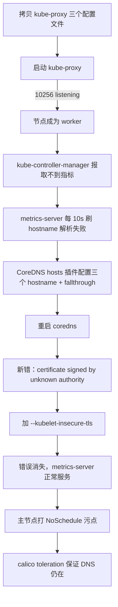

## 纲要

- 补齐最后一个组件 kube-proxy：把 worker 上的三个文件（kubeconfig、配置、service）拷过来，替换掉绑定地址后启动
- kube-proxy 起来后 10256 端口在监听，节点才算正式成为 worker 角色
- 新报错从 controller-manager 侧转到 metrics-server：它按 hostname 去 10250 抓 kubelet，DNS 解析不到这个主机名
- CoreDNS 的 hosts 插件就是为这个场景准备的：把三个节点 IP 与 hostname 写进 `coredns` ConfigMap，别忘了 `fallthrough`
- 改完 DNS 又冒出证书错误：访问的是 HTTPS 服务，证书不被识别——要么让 metrics-server 认识它，要么干脆不校验
- `--kubelet-insecure-tls` 是最省事的一档，加进 deployment 的 args 就能解决
- metrics-server 是 HPA 的数据源，也能和 Prometheus 配合做扩缩容判断
- 主节点也成了 worker，要给它打污点 NoSchedule，用不了调度；但 Calico/DNS 这类组件带 toleration 才不会被踢走

## 补上最后一个组件 kube-proxy

把 kubelet 和 calico 跑起来，再一起跑起来就没问题了。先看证书文件——最终生成了一个 `kube-proxy.kubeconfig`，我们也一样去 worker 上复制它。

```bash
vi kube-proxy.kubeconfig       # 把这张照都复制下来
# 注意一下有没有节点相关的内容——明显是没有的，全部贴进去
```

第一个文件搞定。第二个文件是 `kube-proxy.yaml`（一体机 Kubernetes 的 kube-proxy config，kubeconfig 相关的 yaml），这个文件很少：

```bash
vi kube-proxy.yaml
# 里面有很多 127.0.0.1，要替换：把 127.0.0.1 替换掉，替换成本机地址 10.15.20.50，全局替换
```

最后一步是服务文件 `kube-proxy.service`，搭建一个节点。手工来说代价还是不算小，但实在没办法。看 service 内容没有节点相关的，OK。

然后建目录、启动服务：

```bash
systemctl start kube-proxy
journalctl -u kube-proxy -f
```

日志没问题，并且 **10256 端口都已经打开了**：

```bash
netstat -lntp | grep 10256
# 10256 listening
```

这说明什么？**说明我们这个节点已经正式成为 worker 节点了。**

## 新报错：取不到 Pod 指标

再看系统日志，还有一些错误：kube-controller-manager 报的一个错：

```text
failed to get metric ... unable to get metric families or CPU metric
returned no message returned from the resource metric API
```

看起来是他去请求 metrics-server 没有拿到数据。去看看 metrics-server 的日志：

```bash
kubectl logs -n kube-system -l k8s-app=metrics-server -f --tail=100
```

metrics-server 确实是报了一些错误：`unable to fully fetch metrics`，取不到 point metric，然后 `no metrics for pod`，**一直每隔十秒刷这个**——`unable to fully collect metrics`。

这个错误有一定规律。看得懂一些是「找不到这个 hostname」——它是通过 worker 节点的 hostname，然后去 10250（kubelet 的 metrics 端口）取数据。然后通过 DNS 去没有找到这个域名。

确实我们这个 DNS 肯定是找不到这个域名的——**我这个主机名只是通过 `/etc/hosts` 配置了一下，在 DNS 上没有任何解析**。

如果大家做解析的话，应该就不会遇到这个问题。遇到了就想办法改掉：让 DNS 去支持这个解析，手动添加一下。

## 用 CoreDNS 的 hosts 插件兜住主机名

DNS 有一个 ConfigMap `cni`（coredns），在 `kube-system` 下。看一下目前 DNS 的这个配置，这里面可以去给它添加一个。

指定一个 host，让它去支持我们所有主机名的解析——可以添加一个选项叫 `hosts`，非常形象。这里边就跟配置 hosts 文件其实是一样的：

```yaml
apiVersion: v1
kind: ConfigMap
metadata:
  name: coredns
  namespace: kube-system
data:
  Corefile: |
    .:53 {
        errors
        health
        hosts {
          10.15.10.136 node-136
          10.15.10.6  node-06
          10.15.20.50 node-50
          fallthrough
        }
        kubernetes cluster.local in-addr.arpa ip6.arpa {
           pods insecure
           fallthrough in-addr.arpa ip6.arpa
        }
        ...
    }
```

比如我有一个节点叫 `10.15.10.136`，主机名对应上；还有一个 `10.15.10.6` 的节点（有些服务器挪出去做别的用处了，又换了一些节点，不过安装方式都一样）；还有一个 50 的，就是当前这个节点，主节点也是一个 worker 节点。三个 hostname 就配置完了。

配置完之后，**最后一行还要加一个 `fallthrough`**——出问题的时候让它继续往下走，不要停在这儿不管好。

```bash
kubectl apply -f coredns.yaml
kubectl delete pod -n kube-system -l k8s-app=kube-dns   # 让它重启，DNS 生效快一些
```

再去看日志：错误日志时间间隔比较长，那个每十秒刷一次的日志跟它有关系，刚开始会进入这样的循环，从缓存或者别的地方拿数据、填充数据。

等等，刚说到这儿，他又报错了——不过这次跟刚才不一样了，**往前前进了一步**：

```text
certificate signed by unknown authority
```

证书没有被识别。我们访问的是 HTTPS 的服务，证书没有被验证过。

## 两个套路解决证书不被信任

有两个套路：

1. 让 metrics-server 认识它这个证书
2. 让 metrics-server 忽略它这个证书不校验

看看 metrics-server 到底是它怎么运行的：

```bash
docker inspect metrics-server:0.3.3
# CMD: /metrics-server
# ENTRYPOINT: metrics-server
```

然后看它运行的时候能加什么参数——去 worker 节点上把镜像 id 拷过来运行一下，看看 `--help` 有哪些参数：

```bash
docker run --rm -it <镜像ID> /metrics-server --help
```

果然是有了。看这些参数的介绍，怎么样把这个证书搞定：一种是 `kubelet-certificate-authority`（指定一个证书，用来校验 kubelet 的证书）；还有一种更简单一些——`--kubelet-insecure-tls`，不验证 kubelet 的 CA。

```bash
# 用这个先试一下——问题解决了才是最重要的
```

那就去改文件：到 `deploy/1.8+/metrics-server-deployment` 里给容器加一个参数。它的 containers 在这儿原来没什么参数，给他加一个 args，加一个 `--kubelet-insecure-tls`。**这个变量不需要值。**

```yaml
apiVersion: apps/v1
kind: Deployment
metadata:
  name: metrics-server
  namespace: kube-system
spec:
  template:
    spec:
      containers:
        - name: metrics-server
          image: registry.cn-hangzhou.aliyuncs.com/imooc/metrics-server:v0.3.3
          args:
            - --kubelet-insecure-tls
```

然后 apply 一下：

```bash
kubectl apply -f deploy/1.8+/metrics-server-deployment.yaml
```

再去看：metrics-server 启动了，看日志目前还是报原来的错，不用着急，它还会有一个初始化的过程，等一会儿看看。

等到两点四十一三十五、两点四十一三十八，下面就没有了，不刷了——**这个错误消失了**，系统日志好像也没问题了。确实我们这个改动生效了，metrics-server 可以正常地提供服务了。

顺便说一下，metrics-server 还是挺有用的，特别是那些对 HPA（自动扩缩容）有需求的同学一定要了解一下；并且它还能够跟 Prometheus 非常良好地集成，根据 Prometheus 的一些监控信息做到自动扩容缩容。HPA 这块不深入讲解，毕竟并不是大部分公司都需要的功能，感兴趣的可以课后讨论。

## 别忘了给主节点打污点

后面还有一个要注意的事：我们把主节点也加入了这个集群中，变成了一个 worker。如果我这个主节点调度了太多 Pod，毕竟会对主节点造成一些影响。

比如我不想让主节点去调度应用层面的 Pod，怎么办？之前学过**污点和污点容忍（toleration）**，可以给这个节点打一个污点：

```bash
kubectl taint nodes 10.15.20.50 node-role=master:NoSchedule
# 名字随便起，比如叫 node-role 或者 master，等号后面留空也可以但写上值
# 效果是 NoSchedule：不调度，都不调度
```

有同学说：CoreDNS 肯定是要调度在这儿的，会不会把 DNS 插件也给它驱除掉了？看一下 calico（kube-dns 的 pod），应该有一个污点容忍：

```yaml
# calico-node 的 tolerations
- key: node-role.kubernetes.io/master
  operator: Exists
  effect: NoSchedule
```

对 NoSchedule 做了容忍，所以它就能够调度在主节点上，没有问题。

打完污点之后，所有应用层面的 Pod 就都不会调度到这儿了。

**到这里，我们所有的 Pod 历经了很多磨难，Istio 终于完全正常地跑起来了。** 从下一节开始，看看 Istio 到底是怎么来用。

整个阶段结束时集群的模样：

```text
主节点 10.15.20.50（污点 NoSchedule，但 calico-node 容忍得住）
├── kube-apiserver（带 proxy-client 证书）
├── kubelet / kube-proxy / calico-node
└── pod/metrics-server-xxxxx
worker 10.15.10.136 / 10.15.10.6
istio-system/
├── pod/istio-sidecar-injector, galley, mixer, pilot, citadel
├── pod/istio-proxy-ingressgateway（NodePort 4888 / 8888）
├── pod/istio-egressgateway
└── crd/*（50+ 个）
kube-system/
├── pod/coredns（Corefile 里带 hosts 插件）
├── pod/calico-node（带 toleration）
└── pod/metrics-server（--kubelet-insecure-tls）
```



## API 速览

| 能力 | 做法 | 关键点 |
| --- | --- | --- |
| 部署 kube-proxy | 拷 kubeconfig / config / service 三个文件 + 替换 127.0.0.1 | 启动后 10256 监听才算成节点 |
| 让 metrics-server 找到 Pod 节点 | 改 `coredns` ConfigMap 加 `hosts` 插件 | 三行 IP + 主机名，最后必须 `fallthrough` |
| 改完 DNS 生效 | `kubectl delete pod -n kube-system -l k8s-app=kube-dns` | 删 Pod 让它重建最快 |
| 跳过 kubelet 证书校验 | args 加 `--kubelet-insecure-tls` | 不加值，无参数也要写全 |
| 查镜像自带参数 | `docker inspect` + `docker run <镜像> /metrics-server --help` | 有 `--kubelet-certificate-authority` 可选 |
| 不让主节点跑业务 Pod | `kubectl taint nodes <node> node-role=master:NoSchedule` | 配合 toleration 保留插件 |
| 确认 toleration 生效 | `kubectl describe pod -n kube-system -l k8s-app=calico-node` | 看 Tolerations 字段 |

## Demo 示例

```bash
# 1. 从 worker 拷 kube-proxy 三件套
    # 执行前先给下面的占位变量赋值，如 NODE_NAME=node1，否则变量为空会导致命令行为不符合预期
cp kube-proxy.kubeconfig kube-proxy.yaml kube-proxy.service ${MASTER}:/etc/kubernetes/
sed -i 's#127.0.0.1#10.15.20.50#g' /etc/kubernetes/kube-proxy.yaml
systemctl start kube-proxy
netstat -lntp | grep 10256

# 2. CoreDNS 加 hosts
kubectl -n kube-system edit cm coredns
#   Corefile 里与 kubernetes 同级加：
#     hosts { <IP> <hostname> ... fallthrough }
kubectl -n kube-system delete pod -l k8s-app=kube-dns

# 3. metrics-server 跳过 kubelet 证书校验
kubectl -n kube-system edit deploy metrics-server
#   containers[0].args: ["--kubelet-insecure-tls"]

# 4. 主节点打污点
kubectl taint nodes 10.15.20.50 node-role.kubernetes.io/master=:NoSchedule
kubectl describe pod -n kube-system -l k8s-app=calico-node | grep -A3 Tolerations
```

排障对照：

| 现象 | 日志关键字 | 根因 | 处理 |
| --- | --- | --- | --- |
| 节点不成 worker | 10256 没监听 | kube-proxy 没起 | 拷配置、替换绑定地址、启动 |
| controller-manager 取不到指标 | `unable to get metric families` | metrics-server 没数据 | 往下看它自己的日志 |
| metrics-server 每 10 秒刷 | `no metrics for pod` / `unable to fully collect metrics` | 按 hostname 找节点，DNS 解析不到 | CoreDNS hosts 插件 |
| 加了 hosts 还报错 | `certificate signed by unknown authority` | 走 HTTPS，证书不被信任 | 加 `--kubelet-insecure-tls` |
| 打污点后 DNS 被赶走 | Pod Pending | 没有 toleration | 确认 calico/kube-dns 的 toleration 已在 |

### 总结

- kube-proxy 是主节点补齐的最后一块，10256 监听 = 节点正式成为 worker
- metrics-server 按 hostname 反查节点，只配 `/etc/hosts` 不够，CoreDNS 侧要有 hosts 插件
- `fallthrough` 是 hosts 插件的最后一行，少了它遇到不认识的域名直接断掉
- 证书问题两选一：信任 kubelet 证书（`--kubelet-certificate-authority`）或干脆不校验（`--kubelet-insecure-tls`）
- 改完都要给 Pod 一个重建的时机：DNS 删 Pod 重建，metrics-server 等 Its 初始化周期
- 主节点当 worker 用完就打 NoSchedule 污点，靠 calico-node 自带的 toleration 保住系统组件

