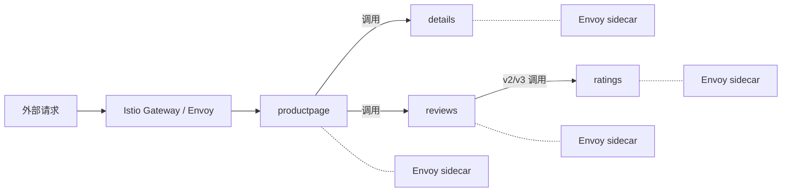

## 纲要

- 官方文档分三块：任务、示例、参考；入门从「示例」走，它才有顺序，别从任务里背单词式地看
- bookinfo 是模仿在线书店的示例应用，四个微服务：productpage、details、reviews、ratings
- reviews 有三个版本：v1 不调 ratings、v2 用黑星星、v3 是 v2 升级改成红星星
- 四个服务用四种语言写的，但**代码里对 Istio 零依赖**，就是普通服务
- 自动注入 sidecar 的开关是给命名空间打 label：`istio-injection=enabled`
- 镜像默认在 `istio/examples` 下，拉不到就替换成自己仓库前缀（`image:` 后面留空格再替换）
- 对外访问靠两个自定义资源：Gateway（域名和端口）+ VirtualService（进来之后路由到哪个服务）
- 裸机没有 LoadBalancer，NodePort 直接取 ingressgateway 的端口，任意节点 IP 都能当入口
- 刷新页面 reviews 会轮播黑星/红星/无星——这就是 sidecar 之间的轮询，下一个特征就是智能路由

## 文档怎么读

上一节把 Istio 装好了，装好之后还不会用。怎么使用、到底能带来什么好处，接着根据文档做就行。

关于概念和安装都看差不多了，还有三部分：一块是**任务**、事例（示例），还有**参考**。

- **任务**：按流量管理、安全、策略、遥测几块分类，每类下又有各种知识点说明和练习，内容几乎是涵盖 Istio 所有功能。但它学习起来没有什么顺序，不适合入门时从头到尾看——就像背单词从 a 背到 b 到 c 一直到 z，非常痛苦
- **示例（bookinfo）**：这个非常适合入门，有组织和学习顺序，过程中会引入很多任务里的核心内容，给了我们一个按步骤学习的文档
- **参考**：类似词典，各种 Istio 相关配置的表格，等我们研究得很细、要查某个字段属性时再看

入门肯定从示例开始，把示例里重要的部分完成掉。

## bookinfo 是什么

第一个是 **bookinfo 应用**，这是一个示例应用。我们体验和测试 Istio 用的这个应用是模仿一个在线书店的一个分类，显示一本书的信息。

**应用分为四个单独的微服务**：`productpage`、`details`、`reviews`、`ratings`。

| 服务 | 职责 | 开发语言 |
| --- | --- | --- |
| productpage | 页面入口，调用 details 和 reviews 渲染页面 | Python |
| details | 书籍的详细信息 | Ruby |
| reviews | 书籍相关的评论，有三个版本 | Java |
| ratings | 由数据评价组成的评级信息 | Node.js |

- productpage 会调用 details 和 reviews 这两个服务用来渲染它的页面
- details 包含书籍的详细信息，reviews 包含书籍的相关的评论
- reviews 还会调用 ratings 微服务，ratings 包含了评级信息

**reviews 三个版本的差别**：

| 版本 | 行为 |
| --- | --- |
| v1 | 并不会调用 ratings 服务 |
| v2 | 调用了 rating 服务，并用一到五个黑色的星星表示评级 |
| v3 | 是 v2 的一个升级，把星星改成了红色 |

虽然 bookinfo 是 Istio 提供的一个示例服务，但**它们并没有关于 Istio 的任何依赖，也没有去实现 Istio 相关的功能**——可以理解为非常简单的技术栈。

看一下服务的架构图：请求进来都是通过 productpage 作为入口，productpage 调用 reviews 的三个不同版本，还有一个 details 服务；在 reviews 里黑色和红色的版本还会调用 rating 服务把星星打出来。

## 加了 Istio 之后，通信变成什么样



其实没什么特殊的：**每一个服务里都运行了一个 Envoy sidecar，把这些网络流量全都劫持掉，服务之间的通讯都是通过 sidecar 来进行的。**

## 部署前的准备

开始之前要求 Istio 的部署工作没有问题，另外注意一点：**要求应该有 4G 以上的内存**，对资源的占用还是比较大的。

进入安装目录。然后是默认自动注入 sidecar——**为 default 命名空间打上一个 label**，把命名空间打上这个 label 之后，对于这个命名空间的所有的 Pod 都会对它进行自动注入；没打标签的就不会注入。

```bash
kubectl label namespace default istio-injection=enabled
kubectl get namespace --show-labels
# default   ... istio-injection=enabled
```

## 部署应用

```bash
# 建一个 demo 实例目录，所有的测试都放这里；遇到问题可以回来找对应的文件
mkdir demo
cd demo

# bookinfo.yaml（原样贴过来，先不做任何修改）
kubectl apply -f bookinfo.yaml
# service 和 deploy 都部署起来了
```

看一眼确认所有服务和 Pod 都已经正确定义和启动：

```bash
kubectl get svc          # service 位是肯定没问题了，都有了
kubectl get pod          # 默认命名空间下六个 Pod
```

六个 Pod。这时候可能会看到一些 error（image pull），看看它用的是什么 image——image 都是 `istio` 下面的 image。有问题的就改一下：

```bash
# 把这一段修改一下：所有 image 以 istio 开头的，都换成自己的镜像仓库
# registry.cn-hangzhou.aliyuncs.com/imooc/istio-<原镜像名>
sed -i 's#image:"istio/#image: registry.cn-hangzhou.aliyuncs.com/imooc/istio-#g' bookinfo.yaml
grep image bookinfo.yaml
```

> 注意：是 `image:` 后面**留一个空格**再替换，别把冒号吞掉；少选了一个会替换错，选准了再跑一遍。

改完重新 apply，稍等一会儿：

```bash
kubectl apply -f bookinfo.yaml
kubectl get pod
```

都处于 Running 状态，六个。

### 先确认应用自身是好的

确认应用程序正常运行，可以通过某个 Pod 里 curl 向它发送命令：

```bash
    # 执行前先给下面的占位变量赋值，如 NODE_NAME=node1，否则变量为空会导致命令行为不符合预期
kubectl exec -it <productpage pod> -- curl http://${POD_IP}:9080/productpage
# 返回了一个 title，跟它的效果是一样的，没问题
```

## 用 Gateway 暴露出去

确认 Ingress 的 IP 和端口——bookinfo 已经启动运行。我们需要使应用程序可以从外部（集群外）访问，然后定义了一个 Istio Gateway 应用到目标中。

先看一眼这个 Gateway 的定义，它也是 Istio 的自定义资源类型：

```yaml
apiVersion: networking.istio.io/v1alpha3
kind: Gateway
metadata:
  name: bookinfo-gateway
spec:
  selector:
    istio: ingressgateway     # 选中的是 ingressgateway 这个 Envoy
  servers:
    - port:
        number: 80
        name: http
        protocol: HTTP
      hosts:
        - "*"                 # 接收所有域名
```

然后对应的一个 VirtualService，也是 Istio 的自定义资源：

```yaml
apiVersion: networking.istio.io/v1alpha3
kind: VirtualService
metadata:
  name: bookinfo
spec:
  hosts:
    - "*"
  gateways:
    - bookinfo-gateway
  http:
    - match:
        - uri:
            prefix: /productpage
      route:
        - destination:
            host: productpage
            port:
              number: 9080
```

- Gateway 定义了**域名和端口**（80，HTTP，所有星）
- VirtualService 定义了**这个端口和域名进来之后要访问哪个服务**：对应的这个 gateway，在 HTTP 协议下匹配这样的 URL 时，就路由到 productpage 服务的 9080 端口

先大致看，创建：

```bash
kubectl apply -f bookinfo-gateway.yaml
kubectl get gateway
# gateway 已经有了
```

至于这些配置具体完成什么功能、每个配置项什么意思，不用着急了解，先看看都有什么内容，随着使用一点一点了解。

### 裸机怎么拿入口地址

文档说根据设置访问的 ingress host 和 ingress port。文档里「使用外部负载均衡器时」那部分是针对 LoadBalancer 类型的，我们肯定不是——**我们使用的是 NodePort**。

所以看下面「没有外部负载均衡器」这一段：确认端口，get 一下 gateway 的 service，把它的端口打印出来：

```bash
export INGRESS_PORT=$(kubectl -n istio-system get service istio-ingressgateway \
  -o jsonpath='{.spec.ports[?(@.name=="http2")].nodePort}')
echo $INGRESS_PORT     # 8888，就是我们之前给 istio-gateway 设的那个端口
```

HTTPS 那个（TLS 的）是自动生成的 nodePort，我们并没有设置过，也不用管。

然后是 ingress host，这个 IP 应该取决于集群情况——NodePort 的话任意一个节点 IP 都可以，先不设置它：

```bash
export INGRESS_HOST=10.15.20.50
```

### 两种方式访问

**命令行方式**：curl HTTP 服务，加 `-H` 模拟一个 host。真实访问的还是刚才设置的 ingress host 和 ingress port，只是告诉 gateway「我的请求的域名是这个」，骗它一下：

```bash
curl -s -o /dev/null -D - -H "Host: productpage.com" \
  "http://$INGRESS_HOST:$INGRESS_PORT/productpage"
```

**浏览器方式**：把 Gateway 的 host 变成 `*`，所有匹配的都走这个位置；再把 VirtualService 的 host 也变成 `*`，**所有域名甚至 IP 地址都会走到这个路由里**。接下来就能在 URL 里这么输入：

```text
http://$INGRESS_HOST:$INGRESS_PORT/productpage
```

### 验收

bookinfo-gateway 支持的路径是 `/productpage`、`/login`、`/logout`、`/api/v1/products`。访问第一个 productpage：

```text
http://10.15.20.50:8888/productpage
```

返回了 bookinfo 的应用。**而且每刷新一次，后边的 reviews 都会变化**——一个是没星星的（v1）、黑色的是 v2、红色的是 v3，目前是一个轮询的状态，每刷新一次都会变一下。

到这儿示例程序就搭建完了，也可以通过 Gateway 去访问它了。

## API 速览

| 能力 | 做法 | 关键字段 |
| --- | --- | --- |
| 开自动注入 | `kubectl label namespace default istio-injection=enabled` | 不打标签就不注入 |
| 部署示例应用 | `kubectl apply -f bookinfo.yaml` | 6 个 Pod、4 个微服务 |
| 换镜像 | sed 替换 `image: <仓库>/istio-...` | `image:` 后要留空格 |
| 定义入口端口与域名 | `Gateway` CR | `selector` 指向 ingressgateway，`hosts: ["*"]` |
| 定义进来后去哪 | `VirtualService` CR | `gateways`、`http.match.uri.prefix`、`destination.host/port` |
| 拿 NodePort | `kubectl -n istio-system get svc istio-ingressgateway` | JSONPath 取 nodePort |
| 本地验证 | `curl -H "Host: xxx" http://$INGRESS_HOST:$INGRESS_PORT/...` | `-H` 只是告诉网关域名 |

## Demo 示例

```bash
# 1. 开注入
kubectl label namespace default istio-injection=enabled

# 2. 部署（镜像换源后）
cd demo
kubectl apply -f bookinfo.yaml
kubectl get pod          # 6 个，都是 2/2（业务 + istio-proxy）
# 下面命令中的变量按你的集群环境赋值后再执行
    # 执行前先给下面的占位变量赋值，如 NODE_NAME=node1，否则变量为空会导致命令行为不符合预期
kubectl exec -it $POD -- curl ${POD_IP}:9080/productpage   # 返回 title

# 3. 建网关与路由
kubectl apply -f bookinfo-gateway.yaml
kubectl get gateway

# 4. 取入口并访问
export INGRESS_HOST=10.15.20.50
export INGRESS_PORT=$(kubectl -n istio-system get service istio-ingressgateway \
  -o jsonpath='{.spec.ports[?(@.name=="http2")].nodePort}')
curl -s -o /dev/null -w '%{http_code}\n' -H "Host: productpage.com" \
  "http://$INGRESS_HOST:$INGRESS_PORT/productpage"
```

这个应用被 Mesh 接管后的 Pod 长相：

```text
default/
├── svc/productpage:9080
├── svc/details:9080
├── svc/reviews:9080
├── svc/ratings:9080
├── pod/productpage-v1-xxxxx      [业务容器 python + istio-proxy]
├── pod/details-v1-xxxxx           [Ruby + istio-proxy]
├── pod/reviews-v1-xxxxx          [Java + istio-proxy]
├── pod/reviews-v2-xxxxx          [黑星 + istio-proxy]
└── pod/reviews-v3-xxxxx          [红星 + istio-proxy]
```

| 现象 | 原因 | 处理 |
| --- | --- | --- |
| 打完标签还是没注入 | label key 拼错 | `kubectl get ns default --show-labels` 核对 |
| 六个 Pod 起不来 | 镜像在 `istio/examples` 下拉不到 | 把 image 前缀换到自己仓库 |
| 替换后镜像名串了 | sed 少选了 `image:` | 改成 `image: <仓库>/` 再跑一次 |
| 外部访问 404 | 没建 VirtualService 或 prefix 不匹配 | 补 route，路径取 `/productpage` |
| 域名不通 | 裸机无 DNS 解析 | 用 IP + NodePort，或浏览器方式把 host 放成 `*` |
| 刷新reviews 不变 | 只有部分版本副本 | 三版本都有副本时才是轮询 |

### 总结

- 文档三块里挑「示例」入门，任务是词典式排列，一上来顺着看会很痛苦
- bookinfo 四个微服务、四种语言，代码对 Istio 零依赖，纯粹用来看流量怎么跑
- 注入 sidecar 就靠命名空间上一个 label，default 打了 label 之后这命名空间所有 Pod 都注入
- Gateway 定「入口地址端口」，VirtualService 定「进来之后去哪」，两个 CR 缺一不可
- 裸机没有 LoadBalancer，NodePort 直接取 ingressgateway 的端口，任意节点 IP 都行
- 刷新页面 reviews 在无星 / 黑星 / 红星之间轮播，说明 sidecar 之间在轮询——下一步就是智能路由

