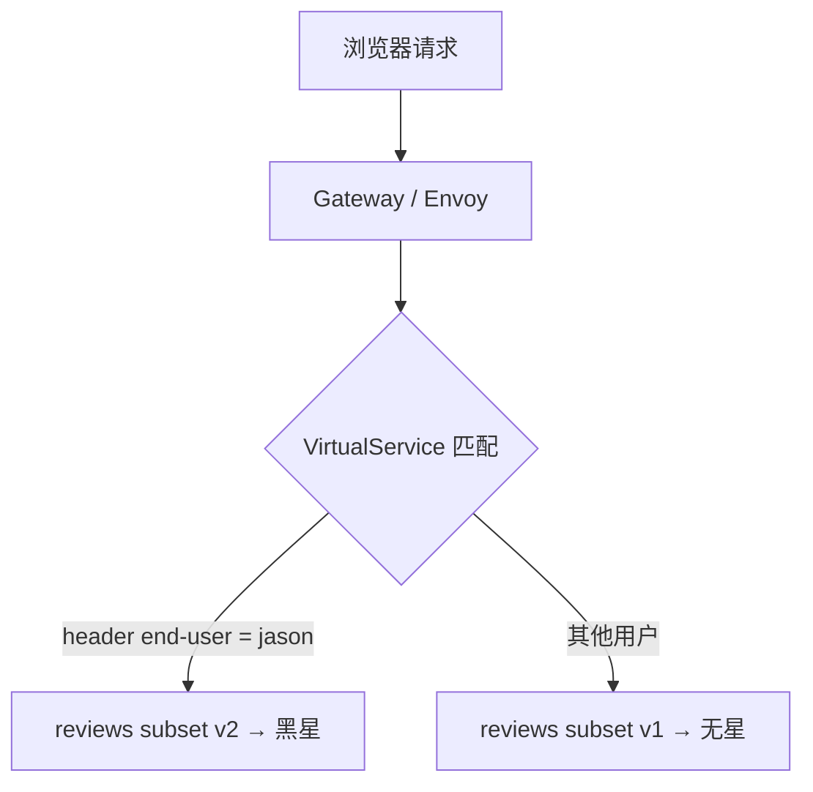

## 纲要

- 流量管理是 Pilot + Envoy 干的活：Pilot 下发规则，Envoy 照着执行
- 三个任务：请求路由、故障注入、流量迁移
- 用 subset 之前必须先有 DestinationRule——它按 label 把 Pod 分组命名成 v1/v2/v3
- 请求路由：VirtualService 指向 subset v1，所有流量就只走 v1，刷新页面不再轮播
- 基于用户身份的路由：Istio 对用户身份没有任何内置机制，靠的是服务自己在调用时加的 `end-user` header，用 `match.headers` 精确匹配
- 故障注入：在 reviews v2 与 ratings 之间注入 7 秒延迟，结果页面报错——因为服务有硬编码超时（3 秒 ×2 次重试 ≈ 6 秒）
- 流量迁移：先全部 v1，再 50/50 权重切到 v3，最后去掉 weight 把 v3 拉到 100%

## 谁在负责流量管理

上一节部署了 bookinfo，这一节继续智能路由，还是跟着文档走。

智能路由演示了在 Istio 服务网格中使用多种流量管理功能。可以思考一下，**流量管理是谁负责的？** —— 是 **Pilot 和 Envoy** 帮我们完成的：Pilot 把规则下发下去，Envoy 在边车上照着执行。

开始之前「安装指南」的步骤（部署 Istio、部署 bookinfo 应用）都已完成。这一节有三个任务：**请求路由、故障注入、还有流量迁移**。

## 任务一：请求路由

bookinfo 里 reviews 有三个版本，之前我们通过 productpage 访问、刷新几次会轮序出现不同效果（无星 / 黑星 / 红星）。这一节第一个任务就是把**所有流量切换到 v1 版本**。

### 先要有一条 DestinationRule

`VirtualService` 仅应用到某个版本之前，得先有目标规则——**如果还没有应用 destination rule，请先应用，缺少目标规则**。

在 Istio 控制 bookinfo 版本之前，需要在**目标规则**中定义好可用的版本，命名为 subset。

```yaml
apiVersion: networking.istio.io/v1alpha3
kind: DestinationRule
metadata:
  name: bookinfo-reviews
spec:
  host: reviews
  subsets:
    - name: v1
      labels:
        version: v1
    - name: v2
      labels:
        version: v2
    - name: v3
      labels:
        version: v3
```

DestinationRule 又是一个自定义资源类型。`bookinfo-reviews` 定义了一个 subset 名为 v1（version 为 v1）的一个 label；下面定义了三个版本 v1、v2、v3，对应于不同的 label（version 是 v1/v2/v3）。

**这个 label 就是对应 Pod 的 label**，相当于用 label 把不同的 Pod 给它区分开了，然后起了个名字——这就是 subset 的意义。

应用完 DestinationRule，再回去应用 VirtualService——**重头戏来了**：

```yaml
apiVersion: networking.istio.io/v1alpha3
kind: VirtualService
metadata:
  name: bookinfo
spec:
  hosts:
    - reviews
  http:
    - route:
        - destination:
            host: reviews
            subset: v1
```

`destinationHost` 是 reviews，subset 选择的是 v1——就是刚才在 DestinationRule 里定义的 subset。

再测试新的路由：刷新页面——**没有变化了**，都是没有星星了，都是跑到了 v1 版本。确实当我们应用了那两个规则之后就生效了，流量控制到 v1 版本了。

### 再基于用户身份做路由

接下来更改路由配置，来自用户名为 **jason** 的用户，将所有的流量请求到 reviews **v2** 版本，其他用户不受影响。

```yaml
apiVersion: networking.istio.io/v1alpha3
kind: VirtualService
metadata:
  name: bookinfo
spec:
  hosts:
    - reviews
  http:
    - match:
      - headers:
          end-user:
            exact: jason
    - route:
      - destination:
          host: reviews
          subset: v2
    - route:
      - destination:
          host: reviews
          subset: v1
```

请注意：**Istio 对用户身份没有任何的内置机制**。这个例子的基础在于——productpage 服务在调用 review 服务的时候会加上自定义的 HTTP header，把取到的用户名作为 header 发送给 review，告诉他当前的用户是什么。

也就是说，`end-user` 这个 header 是应用自己加的，不是 Istio 凭空造的。**记住 v2 版本是包含评分的。**

匹配上了就路由到 subset v2（有个 match headers `end-user exact jason`），没有 match 的时候默认走 root 下边那个规则（v1）。



回头试一下 bookinfo 应用：还是 v1；然后**登录一下**（有个 Sign in，用户名填 jason），星星马上出来了，并且是黑色的（v2）；刷新没问题，一直是黑色版本；**登出**又变成了 v1。

用其他用户登录（比如 michael）——没有到 v2，还是 v1。**只有 jason 可以。** 这就实现了对这个用户的一个精准控制。

## 任务二：故障注入

第二个是**故障注入**，测试 bookinfo 的应用弹性。具体方式是在 **reviews v2 和 ratings 之间的请求做一个延迟**，然后从最终用户的角度去观察它的行为。

我们会注意到 reviews 服务的 v2 版本有一个 bug，注意所有的其他用户都不会感知到。

前提我们都满足：路由规则初始化、程序路由版本是 v1……这些都做过了。

### 注入 7 秒延迟

用 HTTP 延迟进行故障注入，我们将用户 jason 在 reviews v2 和 ratings 服务之间做一个**七秒的延迟**：

```yaml
apiVersion: networking.istio.io/v1alpha3
kind: VirtualService
metadata:
  name: ratings
spec:
  hosts:
    - ratings
  http:
    - match:
        - headers:
            end-user:
              exact: jason
      fault:
        delay:
          percentage:
            value: 100
          fixedDelay: 7s
      route:
        - destination:
            host: ratings
```

因为 reviews v2 对其他服务（ratings）调用具有**十秒的硬编码连接超时**，比我们设置的基准延迟要大，所以我们期望端到端流程是正常的、没有任何错误。

测试：用 jason 登录，期望页面在七秒钟返回并且没有错误。

打开页面——**卡住正在转**，然后返回一个错误：`error fetching product reviews`，再刷一下等了很久又返回了这个错误。

### 为什么不是 7 秒？

打开浏览器的网络标签看一眼：这个页面花了 6.1 秒，**并不是我们设置了七秒钟延迟**。

这说明什么？确实服务之间有硬编码的超时——**服务的硬编码是三秒，加一次，总共是六秒左右**。从试两次、一次三秒——通过这种方式，**我们测试出了程序中的一个潜藏的 bug**。

> 也就是说：故障注入的价值不在于「看出延迟」，而在于它把应用层硬编码超时和真实延迟的矛盾暴露出来了。故障注入只影响 jason 这个用户，其他用户完全无感。

## 任务三：流量迁移

流量迁移是使用户**所有的流量从 reviews v2 版本迁移到 v3 版本**，来规避 v2 版本中 bug 造成的影响。这个比较简单。

先让 VirtualService 把所有流量路由到 v1：

```bash
kubectl apply -f virtual-service-v1.yaml
```

刷新多少次都没有评级。然后**把百分之五十的流量从 reviews v1 转换到 v3**：

```yaml
apiVersion: networking.istio.io/v1alpha3
kind: VirtualService
metadata:
  name: bookinfo
spec:
  hosts:
    - reviews
  http:
    - route:
        - destination:
            host: reviews
            subset: v1
          weight: 50
        - destination:
            host: reviews
            subset: v3
          weight: 50
```

应用之后等几秒钟再刷新——**百分之五十的几率出现红色**：一半是红色（v3），一半是没有（v1），一半一半儿。

如果目前认为 v3 的服务已经稳定，然后把 VirtualService 流量调到百分之百——这个也很简单：**没有 v1 了呗，把 v1 去掉了**，所有的都是 v3 了。

```yaml
      route:
        - destination:
            host: reviews
            subset: v3
```

刷新一下，全是 v3，怎么刷新都是 v3。流量迁移完成。


## API 速览

| 能力 | 资源 | 关键字段 |
| --- | --- | --- |
| 把 Pod 分组命名 | `DestinationRule` | `subsets[].name` + `subsets[].labels`（对应 Pod 的 label） |
| 全量路由到某版本 | `VirtualService` | `route[].destination.subset` |
| 按用户/请求头分流 | `VirtualService` | `match.headers.<key>.exact` |
| 按权重切流 | `VirtualService` | 多个 `route[].weight` 之和为 100 |
| 注入延迟故障 | `VirtualService` | `fault.delay.percentage.value` + `fixedDelay` |
| 只影响特定调用链 | `VirtualService` | `match` 与 `fault` 写在同一条 rule 里 |
| 看规则有没有生效 | `kubectl get vs/dr -n default` | subset 名要和 DR 里对得上 |

## Demo 示例

```bash
# 1. 目标规则：定义三个 subset
kubectl apply -f destination-rule-all.yaml

# 2. 全量到 v1
kubectl apply -f virtual-service-v1.yaml
#   刷新 page → 一直无星

# 3. jason 用户看到 v2
kubectl apply -f virtual-service-v2-jason.yaml
#   登录 jason → 黑星；登出 → 无星；michael 登录 → 仍无星

# 4. 注入 7s 延迟（只影响 jason）
kubectl apply -f virtual-service-ratings-delay.yaml
curl -H "end-user: jason" -o /dev/null -w '%{time_total}\n' \
  http://$INGRESS_HOST:$INGRESS_PORT/productpage
#   → 页面报 error fetching product reviews，耗时约 6s（应用层硬编码超时）

# 5. 迁移到 v3
kubectl apply -f virtual-service-v3-weight.yaml   # 50 / 50
kubectl apply -f virtual-service-v3.yaml           # 100% v3
```

路由规则生效后，reviews 服务的流量走向：

```text
reviews（host）
├── subset v1 → Pod reviews-v1-*   （version=v1，无星星）
├── subset v2 → Pod reviews-v2-*   （version=v2，黑星星）
└── subset v3 → Pod reviews-v3-*   （version=v3，红星星）
    └── 访问入口：VirtualService bookinfo
        ├── match: headers end-user exact jason → v2
        └── 其余 → v1 / 权重 50:50 v1:v3 / 100% v3
```

| 现象 | 原因 | 处理 |
| --- | --- | --- |
| VirtualService 没效果 | 没先建 DestinationRule | 先 apply DR，subset 名必须对得上 |
| 刷新还是三个版本轮播 | route 里没写 subset 或指向不对 | 指到 subset: v1 |
| jason 也看不到黑星 | 头字段名不是 `end-user` | 确认 productpage 传的是 `end-user` |
| 注入延迟不起作用 | fault 写在了没有 match 的那条 rule 上 | 把 match 与 fault 放在同一条 rule |
| 延迟没到 7 秒就报错 | 应用层硬编码超时 3s + 1 次重试 ≈ 6s | 这是真实 bug，不是配置问题 |
| 权重不生效 | 多条 route 的 weight 加起来不是 100 | 调整权重总和 |

### 总结

- 流量管理 = Pilot 下发规则 + Envoy 执行，写配置就是在写 VirtualService 和 DestinationRule
- DestinationRule 用 label 把 Pod 分成 subset，VirtualService 才能按名字引用版本
- 基于用户路由靠的是应用自己透传的 header，Istio 只负责匹配 `match.headers`
- 故障注入能精准只Impact 一个用户，是用来压出应用隐藏 bug 的好手段
- 延迟实测 6 秒而非 7 秒，说明网关层和应用层的超时配置是两套，别混着算
- 流量迁移就是 weight 从 100/0 → 50/50 → 0/100，验证完再摘掉旧版本

