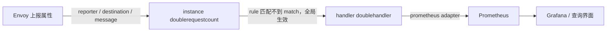

## 纲要

- 遥测的三个任务：收集指标、查询指标，以及跨服务的追踪、日志——这一节做前两个
- Mixer 里最关键的一组自定义资源：`instance`（要生成什么）、`handler`（怎么输出）、`rule`（什么时候给谁）
- instance 里的 `value: "2"` 表示每个请求都生成一次计数，所以实际数值是真实请求数的两倍
- instance 里写的那些 `xxx_yyy` 属性，全部来自 Envoy 上报的属性，instance 只是给它们重新起名字、分组
- instance 的名字必须是**全限定名** `double_request_count.instance.istio-system`，缺命名空间就匹配不上
- rule 里不写 `match` 且命名空间是 istio-system，就等于对网格内所有通信生效
- 看 Prometheus 不用 port-forward，直接给 Chart 里的 Prometheus 开 ingress 更省事；注意 path/contextPath 要设成根目录
- 查询用 `istio_request_count`，加 `destination_service` / `destination_version` 过滤，用 `rate()` 看请求率

## 遥测解决了什么

这一节讲「深入遥测」：演示如何使用 **Mixer 和 sidecar** 获取指标、日志，并在不同的服务间进行追踪。

概述是：微服务部署到 Istio 服务网格之后，就可以在外部对服务进行监控、追踪、路由、弹性测试、安全控制、实施策略——把这一系列的功能都使用**一致的方式**完成，并且都是跨服务的，将应用作为一个整体进行控制。

本文中我们使用 bookinfo 应用示例来演示——**无需开发人员对业务做任何修改**，运维人员直接就可以从运行中的应用中获取指标和追踪信息。

开始之前的准备工作都做好了。这一节有四个任务，首先是**收集指标**：配置 Mixer 收集 bookinfo 应用中服务的系列指标。

看这一系列的功能点主要就是靠 **Mixer** 来完成的（Pilot 管流量，Mixer 管策略与遥测，这两个是 Istio 里最核心的组件）。

## Mixer 的三件套

本任务展示配置 Istio 对网格内服务遥测数据进行收集的方法，用 bookinfo 作为实例应用，收集**新的遥测数据**——新建一个 yaml 用来配置新的指标以及数据流，Mixer 将会自动生成和收集。

新建一个 `metrics.yaml`，先看大概：

### instance：要生成什么指标

又来了一个新的类型——`instance`，也是 Istio 里的一个 instance 实例。名字叫 `doublerequestcount`（双倍的请求计数）：

```yaml
apiVersion: config.istio.io/v1alpha2
kind: instance
metadata:
  name: doublerequestcount
  namespace: istio-system
spec:
  template: metric
  value: "2"
  dimensions:
    message: |-
      response_code | 200
    reporter: |-
      conditional((context.reporter.kind | "unknown"), "unknown", context.reporter.name)
    destination: destination_workload.name | "unknown"
  monitor_doc: true
```

`template` 定义了一个 template（metric），然后定义了一系列参数：`value` 是等于 2。

`dimensions` 里定义了几个字段，有常量的 message（一个常量的字段），其他就是一些类似于引用的字段——`destination_workload.name`，这应该是一个固定的值，如果没取到的话就取后边的值（那个 `"unknown"`）。

上面那个 `reporter`，除了用了一个固定的属性之外好像还用了一个函数（`conditional`）。

**instance 主要是告诉 Mixer：如何为请求生成指标。** 指标来源于 Envoy 汇报的属性，我们写死的那些属性，都是来自 Envoy 的属性值，instance 把它们整理了一下、起了几个名字。

**`value: "2"` 是什么意思？** 因为 Istio 对每个请求都会生成 instance，这就意味着这个指标的值等于收到请求的**两倍**——用它来计数时，看到的就是实际请求倍数的两倍。

### handler：怎么把数据送出去

又一个自定义资源，名字叫 `doublehandler`：

```yaml
apiVersion: config.istio.io/v1alpha2
kind: handler
metadata:
  name: doublehandler
  namespace: istio-system
spec:
  compiledAdapter: prometheus
  params:
    metrics:
      - name: double_request_count
        instanceName: doublerequestcount.instance.istio-system
        type: COUNTER
        labelNames:
          - reporter
          - destination
          - message
```

它定义了一个 `compiledAdapter`（编译的适配器）——**Prometheus**，类似于它是给 Prometheus 工作的这样的一个东西。下面定义了一些参数：

- `metricInstanceName` 对应我们刚才看到的那个 `doublerequestcount`，给它做了一个绑定
- 类型 `type: COUNTER`（计数器）
- `labelNames` 选择的 label，跟上面定义的也是一样的

**instance 可以理解为单纯的一些数据（提供数据的 key/value），handler 负责把这些 key/value 整理好发送给 Prometheus。**

### rule：什么时候把数据给谁

最后一个是 rule，也是一个新 CRD：

```yaml
apiVersion: config.istio.io/v1alpha2
kind: rule
metadata:
  name: doublehandler
  namespace: istio-system
spec:
  actions:
    - handler: doublehandler
      instances:
        - doublerequestcount
```

它主要配置了 action 对应的 handler（上面那个），还有 instance——把 handler 和 instance 做了一个对应关系。



**因为 rule 里没有包含 match 字段，并且所处的命名空间是 istio-system，所以这个 rule 会对网格内所有的通信都生效。** 另外从这里也能看出来：一个 handler 可以对应多个 instance（有很多数据来源），一个 Prometheus handler 也能同时处理多个数据来源。

### 三个概念一句话总结

| 资源 | 作用 | 关键点 |
| --- | --- | --- |
| `instance` | 定义要生成什么指标 | `template: metric`、`value`、`dimensions` 取自 Envoy 上报属性 |
| `handler` | 定义用什么适配器处理 | `compiledAdapter: prometheus`、`instanceName` 必须全限定 |
| `rule` | 定义什么条件下把 instance 送给 handler | 不写 `match` 就全局生效 |

instance 的名字必须使用的是**全限定名**——`double_request_count.instance.istio-system`（命名空间 + 类型 + 名字），`instanceName` 这一块要照抄全名，少一段就匹配不上。

## 把 Prometheus 暴露出来

```bash
kubectl apply -f metrics.yaml
```

创建完了，刷新一下 bookinfo 页面（`10.15.20.50/productpage`），看看指标有没有生成。

然后在 Kubernetes 中为 Prometheus 设置端口转发去看——但**我们没有必要这么去做**，它相当于是一个临时的处理方案，把 Prometheus 的端口暴露在集群外的一种方法。既然已经有了 ingress，直接给 Prometheus 做一个 Ingress 就行。

看前面 Helm 的 istio 配置里应该有一个 Prometheus，看看它有没有配置 ingress——`ingress.enabled`，我们可以设置一个 host，叫 `istio-prometheus.imooc.com`，其他的不用动。把这段复制出来，重新生成一个模板：

```bash
helm template istio-core --namespace istio-system > istio.yaml
kubectl apply -f istio.yaml
kubectl get ingress -n istio-system
```

生成了一个 ingress。然后到本机修改 hosts，复制一行，把 ingress 地址指向节点 IP（`istio-prometheus.imooc.com`）。

访问一下——**404，没有找到 Prometheus**。看看是不是有地方配错了：生成的 path 叫 prometheus，当时我们预想的这个域名应该写在前面，其实后面跟一个 path 没有必要，看有没有地方配置这个 contextPath——看到了一个 `contextPath`，把它设置为根目录 `/`，再重新 apply 一次，ingress 变成根目录了，再访问——可以访问了。

> 也就是说：**Mixer 的目标就是让 Prometheus 能在浏览器里访问到**，现在实现了。

## 查询刚收集的指标

在 Prometheus 界面查询 `doublerequestcount` 的值：

```
double_request_count
```

确实可以查到，说明我们的遥测已经开始奏效了，Prometheus 确实收集到了一些数据。

看一下它的 labels：`destination`、`instance`、`job`、`message`、`reporter`、`source`……这些字段都加进来了，对于每一个请求这些值都加进来了。

**values 是不是都是偶数？** 都是偶数、都是二的倍数——**每调用一次它就加 2**。

看 handler 里实际发送给 Prometheus 的这些 key 的名字：`destination`、`instance`、`job`、`message`、`reporter`、`source`。

## 查询指标

第二部分是查询指标，使用 Prometheus 查询说明：通过 Prometheus Web 界面进行查询。

前提条件：验证 Prometheus 是否运行（肯定运行了）；将流量发送到服务网格（上一节已经做过了，访问一下就行）。

```text
istio_request_count
```

打开 UI 执行这个表达式。注意文档里写的例子（类似 `istio_request_total`）这个值不对；**默认情况它自带的 metric 里包含非常多的信息**，其中 `istio_request_count` 是默认就会有的。

- 可以对 **productpage 服务所请求数的总和**进行查询
- 通过各种字段进行过滤：加 `destination_service` 等于目标服务（productpage），就能查到对应服务的请求数
- 还能查 **review 服务 v3 请求的指数**：除了 `destination_service`，还有 `destination_version`——可以看到请求的都是 v3 版本（source 是 v1，destination_service 是 reviews，destination_version 都是 v3）

```text
istio_request_count{destination_service="reviews", destination_version="v3"}
```

- 还可以做统计：**过去五分钟**对 productpage 服务的请求率，response_code 等于 200 的，加一个 `rate` 函数

```text
rate(istio_request_count{destination_service="productpage", response_code="200"}[5m])
```

刚开始我们返回的是 0——因为五分钟之内没有请求过，我们访问一下再去查，五分钟之内就有请求率了，看到这个值已经过来了，统计了一个平均的请求速率。

### 默认的就已经够用

关于 Prometheus 的附加组件：默认情况下，**Mixer 中就配置了 Prometheus 的适配器**，默认 Prometheus 会抓取下面这些 metric 的信息——mixer、envoy、pilot、galley 各种组件。也就是我们在 Prometheus 里去查询的时候，**默认就可以查出来**这样的数据，并不需要自己去配——基本把我们需要的东西都已经准备好了。

## API 速览

| 能力 | 资源 / 做法 | 关键字段 |
| --- | --- | --- |
| 定义新指标 | `instance` CR | `template: metric`、`value`、`dimensions` |
| 引用 Envoy 属性 | dimensions 里写属性名 | `destination_workload.name`、可用 `\|` 兜底 |
| 条件取值 | dimensions 里用函数 | `conditional(...)`、`context.reporter.kind` |
| 输出到 Prometheus | `handler` CR | `compiledAdapter: prometheus`、`instanceName` 全限定名 |
| 绑定数据流 | `rule` CR | `actions[].handler` + `actions[].instances` |
| 全局生效 | rule 不写 `match` | 命名空间放在 istio-system |
| 暴露 Prometheus | Helm values 里 `prometheus.ingress` | 设 host + `contextPath: /` |
| 查询请求数 | `istio_request_count` | `destination_service` / `destination_version` |
| 算请求率 | `rate(...[5m])` | 没有流量时会是 0 |

## Demo 示例

```bash
# 1. 定义 instance / handler / rule 三件套
kubectl apply -f metrics.yaml
kubectl get instance,handler,rule -n istio-system

# 2. 给 Prometheus 开 ingress（记得 contextPath 设成 /）
helm template istio-core --namespace istio-system > istio.yaml
kubectl apply -f istio.yaml
kubectl get ingress -n istio-system
echo "<ingress 节点 IP> istio-prometheus.imooc.com" >> /etc/hosts

# 3. 造点流量再看指标
curl http://<任意节点>:8888/productpage

# 4. 在 Prometheus 里查
#    double_request_count        → 都是偶数，每次加 2
#    istio_request_count         → 默认自带指标
#    istio_request_count{destination_service="reviews", destination_version="v3"}
#    rate(istio_request_count{destination_service="productpage", response_code="200"}[5m])
```

指标链路跑通之后的整体结构：

```text
istio-system/
├── instance/doublerequestcount              # 定义指标结构（value=2，取自 Envoy 属性）
├── handler/doublehandler                    # prometheus adapter 输出
├── rule/doublehandler                       # 无 match → 全局
├── ingress/istio-prometheus                # host: istio-prometheus.imooc.com, path: /
└── pod/{istio-mixer-*, istio-pilot-*, istio-galley-*}
default/
└── pod/{productpage,details,reviews-v1,v2,v3}  # 每个都带 Envoy sidecar
```

| 现象 | 原因 | 处理 |
| --- | --- | --- |
| Prometheus 访问 404 | 生成的 path 不是根目录 | values 里 `contextPath` 设成 `/` 后重 apply |
| 查不到 `double_request_count` | instanceName 不是全限定名 | 写成 `doublerequestcount.instance.istio-system` |
| 数值不是真实请求数 | `value: "2"` 是故意的 | 每条请求 +2，想对得上就把 value 改成 1 |
| 规则只对部分流量生效 | rule 里写了 `match` | 去掉 match 即全局生效 |
| rate() 返回 0 | 5 分钟内没流量 | 先访问应用再查 |
| 新指标一直不出现 | 没给网格造流量 | 刷新 bookinfo 页面或 curl 一下 |

### 总结

- Mixer 的遥测就三个角色：instance 定义「生成什么」，handler 定义「发给谁」，rule 定义「什么时候发」
- instance 里的属性名不是凭空编的，全部来自 Envoy 上报，`\| "unknown"` 是取不到的兜底
- `value: "2"` 让每条请求计两次，所以 Prometheus 里看到的一定是偶数——这是配置使然不是 bug
- handler 的 `instanceName` 必须用全限定名，少写命名空间就匹配不上
- 已有 ingress 就别用 port-forward，给 Chart 里的 Prometheus 开 ingress 一步到位，注意 path 要是根
- `istio_request_count` 是默认自带的，配了 `destination_service`、`destination_version` 就能按服务按版本过滤

