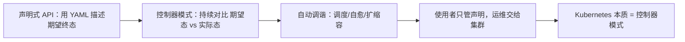

# Kubernetes 生产实践指南：课程总结与方法论

## 纲要

- 坚持的意义：近 20 小时课程能学完，你已经超过绝大部分人
- 课程覆盖回顾：从入门、两种集群搭建、业务迁移与 CI/CD，到资源/调度/深入 Pod、外围功能与日志监控
- 学习方法：一边用一边学，而不是把概念文字通读一遍——计算机不适合「速读百遍」
- 由浅入深像练功：第一遍跑起来，第三遍做 DIY，第五遍理解设计精髓
- Kubernetes 为什么赢：本质不是调度策略或资源管理，而是**声明式 API + 控制器模式**
- 一个 yaml 表达期望终态，集群自动把你运维起来——这是每个组件的设计理念
- 展望：Kubernetes 很可能成为云计算领域的「下一个 Linux」，是每个技术人必备的基础

## 能坚持到这儿，你已经赢了大多数人

前面将近二十个小时的课程，能坚持学完真的不容易。以对在线课程的观察，能完整学完你就已经超过了绝大部分同学，值得祝贺。

这一路我们从 Kubernetes 基础入门，到二进制和 kubeadm 两种集群搭建，到业务容器化迁移与 CI/CD，到 Namespace/Resources/Label 资源管理、调度与编排、健康检查与各种部署方案，再到深入 Pod；后面更偏外围的功能如 Ingress、共享存储、有状态应用、Kubernetes API，以及紧密相关的日志监控、Service Mesh。内容不算少，掌握之后在 Kubernetes 相关的工作上基本可以独当一面。

## 学习方法：一边用一边学

课程期间陆续收到很多反馈，有同学一两天就在问答区提问题，非常踊跃。问题再多我都会一一回复，但也建议大家对每个问题都有自己的思考——IT 行业一半以上的工作都是在解决问题，排障能力比记忆概念更重要。

不久前有同学提：基础知识的讲解不够细致，比如 `Deployment` 的 `apiVersion` 为什么写成 `apps/v1`、`kind` 能不能大写。问题很细，但借此分享一个学习方法：**一边用一边学，用到什么就学什么，而不是把相关概念的文字逐一研读**。计算机这东西不像文学，一篇文章仔细品读、速读百遍其义自见——这种方式在计算机学习上并不合适，光看不练只会越学越懵。

前面学 Istio 时，`Gateway`、`VirtualService` 这些深入的词，前面都没单独讲过，上来就直接玩。第一遍可能只是跑起来，第二遍知道大概的配置方式，第三遍会做一些 DIY，第四遍清楚每个配置之间的关系，第五遍才理解这样设计的精髓。学习就该这样在实践中由浅入深，像练功一层层深入。

## Kubernetes 为什么赢：声明式 API 与控制器模式

从我接触 Kubernetes 到现在，它的热度一直不减，周边商业与开源产品层出不穷（Rancher、OpenShift、KubeSphere，以及各大云厂商都直接支持）。很多中小公司也从调研测试走向生产落地。

可以从技术层面想一想：Kubernetes 为什么这么火？为什么赢得容器编排大战？是服务编排调度策略吗？是底层计算资源管理吗？我觉得都不是。真正的关键是它的**声明式 API 设计**——对使用者来说，你最关心的是「这个东西好不好用」，而好不好用本质上就是 API 的设计。



Kubernetes 项目的本质其实只有一句话：**控制器模式**。简单来说，你用一个清单文件（manifest）去表达应用的**最终状态**，集群就会按照你期望的状态，自动把你运维管理起来。这也是 Kubernetes 里每一个组件的设计理念——拥有这样的设计，集群才具备了自愈与自动化能力。

```dir
kubernetes-essence
├── 使用者侧
│   └── 一份 YAML 清单（期望终态）
├── 控制面
│   ├── API Server（接收声明）
│   ├── Scheduler（选节点）
│   ├── Controller Manager（调谐循环）
│   └── etcd（实际态存储）
└── 数据面
    └── Kubelet 让 实际态 收敛到 期望态
```

## 一个判断：Kubernetes 可能是下一个 Linux

在这个云计算以前所未有速度普及的世界里，我判断 Kubernetes 很可能在云计算领域成为**下一个 Linux 操作系统**，很可能成为每个技术从业者必备的基础知识。它不是某一款绑定产品，而是一套以声明式 API 和控制器模式为内核的分布式操作系统范式。

| 视角 | 容器编排大战的「表面答案」 | 本课程给出的「本质答案」 |
| --- | --- | --- |
| 核心竞争力 | 调度策略 / 资源管理 | 声明式 API 设计 |
| 项目内核 | 一堆组件 | 控制器模式（声明终态 + 自动调谐） |
| 使用者体感 | 功能多 | 好用、只管声明 |
| 未来定位 | 编排工具 | 云计算的「下一个 Linux」 |

## 总结

- 能学完近 20 小时课程，你已经超过绝大多数人；IT 行业一半以上工作在解决问题，排障能力比背概念更重要。
- 学习方法的核心是一边用一边学、由浅入深：第一遍跑通、第三遍 DIY、第五遍才懂设计精髓，光看不练只会越学越懵。
- Kubernetes 赢得容器编排大战，靠的不是调度策略或资源管理，而是**声明式 API 的设计**——好不好用本质是 API 好不好用。
- Kubernetes 的本质是**控制器模式**：一份 YAML 表达期望终态，集群自动完成调度、自愈、扩缩容，把运维交还给系统。
- 在云计算普及的当下，Kubernetes 很可能成为云计算领域的「下一个 Linux」，是每位技术人值得掌握的基础。
- 课程虽结束，但 Kubernetes 不会落幕；保持长期实践与联系，把声明式思维用进真实生产，才是真正的开始。
