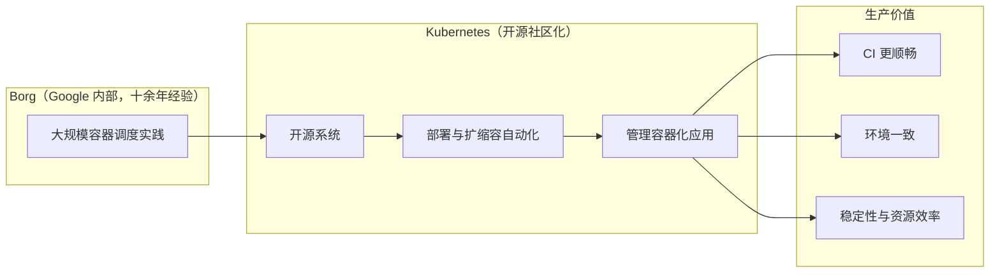
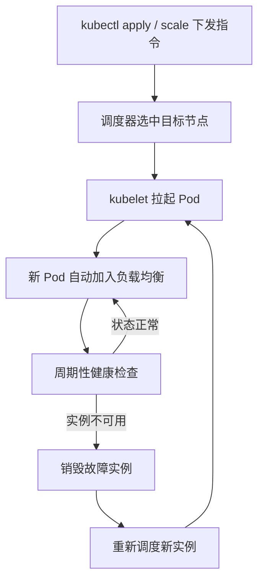

# 认识 Kubernetes：名字由来、核心特征与和 Docker 的关系

## 纲要

- 从名字讲起：Kubernetes 取源于古希腊语，是「舵手」的意思
- Logo 像渔网又像罗盘，Docker 自比拖着集装箱的鲸鱼，Kubernetes 就是那个掌舵的人
- 官网定位：开源系统，目标是让应用「部署与扩缩容自动化」+「管理容器化应用」
- 十五年经验的来源不是 Kubernetes 自己，而是 Google 内部的 Borg 系统
- 从一次真实的实践经历看容器编排大战：2015 年调研，2017 年成为事实标准
- 使用 Kubernetes 之后拿到的几个实在好处
- Kubernetes 的三个核心特征
- Kubernetes 与 Docker 的关系：上层架构，而不是绑定某一个容器产品
- 下一步开始看架构设计

## 从名字开始：舵手、渔网和罗盘

Kubernetes 这个词取源于古希腊语，含义是「舵手」——就是开船时握舵、掌方向的那个人。

它的 logo 也挺有讲究：既像一张渔网，又像一个罗盘。Google 选这个名字是有深意的。Docker 把自己比成一只鲸鱼，拖着一个个集装箱在大海里遨游；那 Google 就用 Kubernetes 去掌舵，去把握大盘的话语权，捕获并指引这条鲸鱼，让它按照主人设定的路线巡游。

所以「Kubernetes 管理 Docker」这句话，本质上是个比喻：容器是货物，鲸鱼是载体，舵手负责把整艘船开到该去的地方。理解了名字的含义，再看技术层面就顺了。

## 官网怎么定义 Kubernetes

Kubernetes 官网首页对它的介绍很克制，只有三句话的骨架：

- Kubernetes 是一个开源的（open source）系统
- 核心目标是 **自动化**：让应用的**部署（deployment）**和**扩缩容（scaling）**变成自动过程
- 以及**管理容器化的应用**

小字的补充说明大意是：Kubernetes 建立在 Google 十五年生态环境的经验积累之上，经过了大量实践验证，并且融合了社区优秀的 idea 和实践经验。

「历史才出来没几年，怎么会有十五年的经验？」——这里的十五年的经验积累并不来自 Kubernetes 本身，而是来自 Google 的另外一个系统：**Borg**。这是 Google 内部使用了十多年的大规模容器管理系统，是那套经验的结晶。本课程以实践为目的，Borg 的细节就不展开了，感兴趣可以自行查资料。



## 从一次真实实践看「容器编排大战」

讲师第一次接触 Kubernetes 是在 2015 年初，那会儿 Kubernetes 还没发布 1.0 版本，也没被大家熟知。公司抱着实验心态做这件事，最开始只有一个人去调研——官方文档不完善，学习资料极少，出了问题基本搜不到，只能靠自己一点一点摸索，全力以赴花了一年左右的时间，才在内网构建起一套 Kubernetes 集群，含部分业务的服务发现方案和技术集成方案，一个完整环境算是搭起来了。

后面就是不断迭代、全公司推广，让更多业务上 Docker。到 2017 年中旬，绝大部分应用都已经 Docker 化并跑在 Kubernetes 上，负责 Kubernetes 的人员也从一个人扩成小团队。

同样在 2017 年，Kubernetes 在「容器编排大战」中脱颖而出，成为容器编排的事实标准。

| 阶段 | 时间 | 状态 |
| --- | --- | --- |
| 个人调研 | 2015 年初 | Kubernetes 尚未发布 1.0，文档与资料稀缺 |
| 内网集群落地 | 约 2016 年 | 独自摸索一年，搭起可用集群与服务发现方案 |
| 全公司推广 | 2016 ~ 2017 年中 | 更多业务 Docker 化并迁到 Kubernetes |
| 成为事实标准 | 2017 年中 | 容器编排大战胜出，人员扩为小团队 |

使用过程中，几个好处非常实在：

- **持续集成更顺畅**：以前经常因为环境不同引发的问题几乎完全避免了
- **环境一致**：开发、测试、生产用同一套编排描述，不再「我这跑得好好的」
- **服务稳定性大幅提高**：不会因为服务的发布、重启导致服务中断
- **排障方便**：开发人员可以很方便地查看日志和调试问题，给运维减少大量工作
- **省资源**：整体上对公司资源是实打实的节省

## Kubernetes 的三个核心特征

### 特征一：一切以服务为中心

围绕服务转，使用者不用关心服务运行的环境和细节。构建在 Kubernetes 上的系统，既可以跑在独立的物理机、虚拟机上，也可以跑在私有云、公有云——在什么地方运行都是无差别的。

### 特征二：自动化

在 Kubernetes 里，服务可以自动扩缩容、自动升级更新部署。收到一条指令后会触发一个调度流程：选中目标节点、部署或者停止相应的服务。新 Pod 一启动就会被自动加入负载均衡器并自动生效。

### 特征三：定期体检 + 自动重建

服务运行过程中，Kubernetes 会定期检查实例数和这些实例的状态是否正常。一旦发现某个实例不可用，会自动销毁不可用的实例，然后重新调度一个新的实例。以上所有过程都不需要人工参与，全部自动化完成。



| 特征 | 一句话解释 | 生产里的样子 |
| --- | --- | --- |
| 一切以服务为中心 | 面向服务而不是面向机器 | 应用不分物理机/虚拟机/云，运行无差别 |
| 自动化 | 扩缩容、升级部署、注册都自动 | 一条 `kubectl scale` 完成扩容，Pod 自动进负载均衡 |
| 自愈 | 定期检查实例数与状态，坏的换掉 | 实例不可用就销毁重建，全程无人参与 |

## Kubernetes 与 Docker 的关系

可以这么理解：Kubernetes 是 Docker 的**上层架构**，就像 Java 和 J2EE 的关系。

- Kubernetes 以 Docker 为基础，准确说是**以 Docker 技术的标准**为基础，去打造一个全新的分布式架构系统
- 但它并不是一定要依赖 Docker 这个产品——Docker 技术本质上是一系列标准，只要实现了这个标准的产品都可以替代 Docker
- 所以 Kubernetes 在底层可以支持其他容器技术，并经过 Google 持续的优化，号称在某些方面做得会比 Docker 更优秀
- 用不用 Docker，自行决定

换句话说：Docker 解决的是「怎么把应用打包成一个标准件」，Kubernetes 解决的是「一堆标准件怎么在那么多机器上排兵布阵、扩缩容、自愈」。

## 集群视角下的一张目录树

Kubernetes 里所有资源都属于某个 Namespace，从集群根节点往下看大概是这样：

```text
kubernetes-cluster
├── node-1 (master)
│   ├── kube-apiserver
│   ├── kube-scheduler
│   ├── kube-controller-manager
│   ├── etcd
│   └── calico-node
├── node-2 (worker)
│   ├── kubelet
│   ├── kube-proxy
│   ├── nginx-demo-xxx1
│   └── nginx-demo-xxx2
├── node-3 (worker)
│   ├── kubelet
│   ├── kube-proxy
│   └── nginx-demo-xxx3
└── namespace: default
    ├── Pod（业务实例）
    ├── Deployment（期望副本数）
    └── Service（稳定的服务入口）
```

上面这一棵树，正好对应两个核心特征：「一切以服务为中心」——业务看到的是 `Service` 后面的那批 Pod；「自动化与自愈」——副本数写的是期望值，实际有几个、挂了换几个，由控制器和调度器自己算账。

## API 速览

初章没有太多 API，先把会反复打交道的几类对象认一下。

| 能力 | 做法 | 说明 |
| --- | --- | --- |
| 跑一个应用实例 | `kubectl run nginx-demo --image=nginx --replicas=3` | 直接产出 Deployment |
| 声明式跑应用 | 写 `Deployment` 清单后 `kubectl apply -f` | 生产推荐，留下可评审的配置 |
| 看实例状态 | `kubectl get pods -o wide` | `-o wide` 能同时看到节点和 Pod IP |
| 扩容 | `kubectl scale deployment nginx-demo --replicas=5` | 触发调度流程补齐副本 |
| 看详细事件 | `kubectl describe pod <name>` | 排障第一手材料，Events 都在里面 |
| 打通集群外访问 | 建 `Service` 并配 `NodePort` / `Ingress` | 服务有稳定入口 |
| 查看集群节点 | `kubectl get nodes -o wide` | Master / Worker 构成一眼可见 |

## Demo 示例

先按「期望副本数 = 3」声明一个应用，然后亲手验证「自动化」和「自愈」这两个特征。

第一步，写一份最小可用的 Deployment 清单：

```yaml
apiVersion: apps/v1
kind: Deployment
metadata:
  name: nginx-demo
spec:
  replicas: 3
  selector:
    matchLabels:
      app: nginx-demo
  template:
    metadata:
      labels:
        app: nginx-demo
    spec:
      containers:
        - name: nginx
          image: nginx:1.17.1
          ports:
            - containerPort: 80
```

第二步，应用并观察副本：

```bash
kubectl apply -f nginx-demo.yaml
kubectl get pods -o wide
```

```text
NAME                         READY   STATUS    RESTARTS   AGE   IP               NODE
nginx-demo-7d9c8b9f5-abcde   1/1     Running   0          10s   10.244.1.12     node-2
nginx-demo-7d9c8b9f5-bcdef   1/1     Running   0          10s   10.244.2.17     node-3
nginx-demo-7d9c8b9f5-cdefg   1/1     Running   0          10s   10.244.1.13     node-2
```

第三步，验证「自动化扩缩容」——一条命令把副本从 3 变 5：

```bash
kubectl scale deployment nginx-demo --replicas=5
kubectl get pods -o wide
```

再验证「自愈」——直接干掉一个 Pod，看它是不是被自动补回来：

```bash
kubectl delete pod nginx-demo-7d9c8b9f5-abcde
kubectl get pods -o wide
```

```text
NAME                         READY   STATUS              RESTARTS   AGE
nginx-demo-7d9c8b9f5-abcde   0/1     Terminating          0          2m
nginx-demo-7d9c8b9f5-defgh   0/1     ContainerCreating   0          3s
```

被删的那个 Pod 进入 `Terminating`，同时立刻冒出一个 `ContainerCreating` 的新 Pod——这就是「销毁不可用实例 + 重新调度新实例」在线上跑的样子，全程没有人工介入。

生产上正确的收尾姿势是删掉这份声明，而不是留一个没人管的 Deployment：

```bash
kubectl delete -f nginx-demo.yaml
```

### 总结

- Kubernetes 这个名字来自古希腊语的「舵手」，logo 像渔网又像罗盘；Docker 是拖着集装箱的鲸鱼，Kubernetes 负责掌舵，这个比喻比任何概念解释都好记。
- 官网把它定义成「开源系统」，核心目标就两条：让应用的部署与扩缩容自动化，以及管理容器化应用。
- 「十五年经验」来自 Google 内部的 Borg 系统，不是 Kubernetes 自己的历史；真正让它 2017 年脱颖而出的是社区与大规模实践的共同验证。
- 三个核心特征是一整条闭环：以服务为中心（不关心跑在哪）、自动化（扩缩容与注册自动完成）、自愈（定期检查实例状态，坏掉就销毁重建）。
- Kubernetes 是 Docker 的上层架构，以 Docker 的技术标准为基底而不绑定 Docker 这个产品，所以底层容器技术是可替换的。
- 下一步开始看 Kubernetes 的架构设计，把控制面和数据面拆开看清楚。

