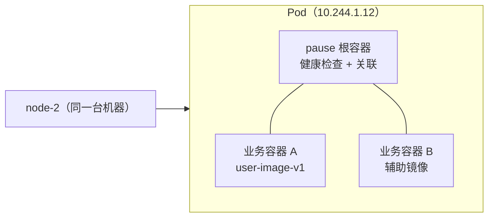
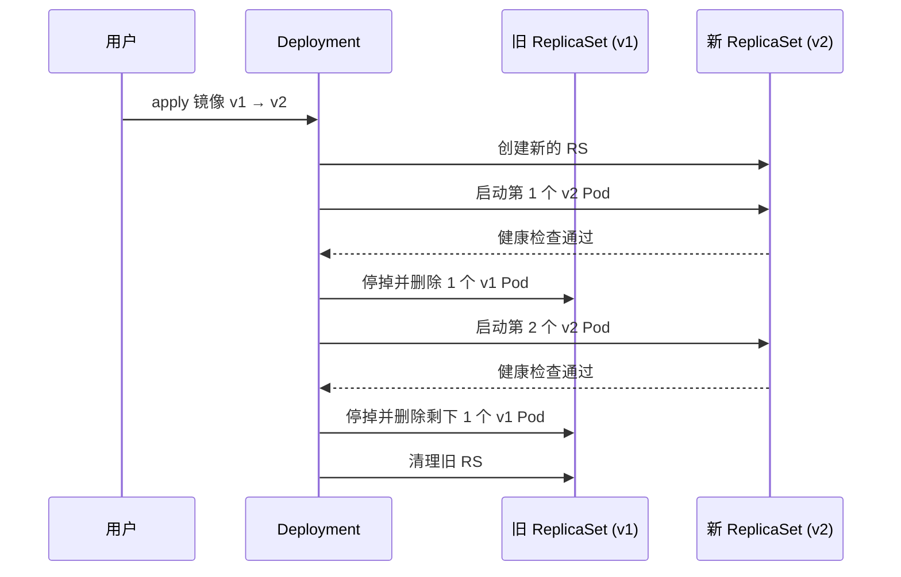

# Kubernetes 核心概念：从容器到 Pod、副本集、Deployment 与 Service

## 纲要

- 容器之外还有一层：Pod，是 Kubernetes 调度的最小单位
- Pod 的三个特征：同机运行、共享网络namespace与唯一 IP、必有一个 pause 根容器
- pause 容器的两个职责：把业务容器 link 在一起、负责整个 Pod 的健康检查并上报
- Pod 上一层是 ReplicaSet（副本机），负责保证副本数恒定
- Deployment 掌管滚动更新：新旧 RS 此消彼长的完整过程
- 真正在用的层面只有 Deployment，RS 和 Pod 的创建删除不用管
- Label 与 Selector：Kubernetes 里的「关系总线」
- Service 通过 selector 挂住一批 Pod，对外暴露 ClusterIP
- 一层层抽象下来，最终要记住的官方概念就那几个

## 先看容器外面那一层：Pod

从大家都熟悉的容器说起。一个容器是由一个镜像跑起来的——比如镜像是 `image-v1`，通过这个镜像运行了一个容器，这一层无需再解释。

那容器外面那一层是什么呢？这就是 Kubernetes 里的概念：**Pod**。一个 Pod 里可以有一个或多个容器。

Pod 有这些特征：

1. Pod 里所有容器都运行在**同一台机器**上
2. Pod 里的容器**共享网络**，对外只有一个唯一的 IP
3. 每个 Pod 里都有一个特殊的容器，叫 **Pod 容器**（pause 容器）

pause 容器本身极简，一般是一个固定的镜像（比如 `pause:1.0`）。它的作用有两个：

- **作为根容器**，把其他容器都 link 到一起，类似于 docker-compose 的做法——Pod 里那个 `user-image-v1` 之类的业务容器，都会被 Pod 容器关联起来
- **负责整个 Pod 的健康检查**，然后汇报给 Kubernetes

那么什么时候考虑把多个容器放进同一个 Pod？当业务里有两个或多个容器**关系非常紧密**的时候。



## ReplicaSet：保证副本数恒定

Pod 的上一层是 **ReplicaSet**，全称 ReplicaSet，简称 RS，也叫**副本机**。

它的职责很直白：同一个应用要跑几个实例，就是它管。比如同一个应用我们要跑两个 Pod，RS 就去把它们都跑起来、管理起来。运行过程中如果有一个 Pod 出现异常或者异常退出，RS 会保证副本数始终为 2——在另一台机器上重新调度一个出来。

## Deployment：滚动更新是怎么跑的

RS 的上一层是 **Deployment**，也就是「部署」。

想象这个场景：一个旧应用跑着两个实例，现在要更新这个应用，会发生什么？

更新的时候，改的其实是 Deployment。Deployment 会自动再创建一个 RS（副本机），然后**滚动**地先启动一个新版本 Pod（注意：变的不是 Pod 容器本身，而是镜像，比如从 `image-v1` 升到 `image-v2`）：

1. 第一个新 Pod 启动完成，健康检查通过
2. Deployment 目前管理着三个实例，正在对外提供服务的是这三个
3. 新 Pod 健康后，它控制**旧的 RS** 先停掉、删掉一个 Pod
4. 于是变成「一个新版本 + 一个旧版本」
5. 旧版本再降一个之后，通过新 RS 再创建一个 `image-v2` 的 Pod，新 Pod 也被这个 RS 管起来
6. 第二个新 Pod 健康检查通过后，同样让前面的 RS 把它的另一个 Pod 停掉
7. 全部换完，旧的 RS 也被清理掉
8. 整个服务更新过程完成——这就是一次典型的**滚动部署（rolling update）**

真正使用的时候，RS 和 Pod 的创建、删除都不需要我们操心；我们管理的层面只停在 Deployment，由它自动帮我们创建和销毁 RS，以及 Pod 此消彼长的整个过程。



## Label 与 Selector：把关系串起来

要说 Service，得先说 **Label（标签）**。Label 是 Kubernetes 里非常基础又非常重要的东西，很多资源都可以打标签，起到标识作用——Deployment 可以打，Pod 可以打，Node 也可以打。

比如我们跑了一个单点登录（SSO）服务，给它打一个标签 `app=sso`，Pod 也打上同样标签。Service 通过配置好的 selector 来表示「我负责管理哪些 Pod」——selector 写 `app=sso`，它就自动找到这两个 Pod。

Label 的选择器语法在命令行里长这样：

```bash
# 按标签查出 Pod，--show-labels 把标签也打出来
kubectl get pods -l app=sso --show-labels

# 多条件（与关系）
kubectl get pods -l app=sso,version=v1

# 按节点标签
kubectl get nodes -l node-role.kubernetes.io/worker=
```

## Service：给一批 Pod 一个稳定的入口

**Service（服务）** 是 Kubernetes 里另一个极重要的概念。Service 对外有一个 **ClusterIP**，其他服务或者客户端通过这个 ClusterIP 访问 Service，再由 Service 转发到最底层的 Pod 上。

前面那套组合拳，最终就是靠 selector 把 Service 和 Pod 绑在一起：

```yaml
apiVersion: v1
kind: Service
metadata:
  name: sso
spec:
  type: ClusterIP
  selector:
    app: sso
  ports:
    - port: 80
      targetPort: 8080
      protocol: TCP
```

到这儿，Kubernetes 中最重要的概念就讲完了：容器 → Pod → ReplicaSet → Deployment → Service，中间用 Label/Selector 串起来。

## 一层层看下去的目录树

把这些概念叠到集群里，从上往下大致是：

```text
cluster
├── node-2
│   ├── Pod (app=sso, version=v1)
│   │   ├── pause 根容器
│   │   └── user-image-v1
│   ├── Pod (app=sso, version=v1)
│   └── Pod (app=sso, version=v2)
├── node-3
│   ├── Pod (app=sso, version=v1)
│   └── Pod (app=sso, version=v2)
└── namespace: default
    ├── ReplicaSet: sso-v1-xxxxx   （旧，正在收缩）
    ├── ReplicaSet: sso-v2-yyyyy   （新，正在扩张）
    ├── Deployment: sso            （用户唯一的管理入口）
    └── Service: sso (ClusterIP 10.96.x.x)
```

这张树里最值得记住的一件事：我们只写 `Deployment: sso` 和 `Service: sso` 两个名字，中间那两个 RS 和一批 Pod 全是它们自动长出来的。

## API 速览

| 能力 | 做法 | 说明 |
| --- | --- | --- |
| 跑一个容器 | `kubectl run sso --image=user-image:v1` | 直接产出 Deployment + RS + Pod |
| 看 Pod 和它所在的节点 | `kubectl get pods -o wide` | 能看到 Pod IP 和 NODE 列 |
| 看副本机 | `kubectl get rs` | DESIRED / CURRENT / READY 三列就是副本情况 |
| 看部署详情 | `kubectl describe deployment sso` | 滚动更新的进度在 Events 里 |
| 按标签过滤 | `kubectl get pods -l app=sso --show-labels` | Label 是资源之间的 Relationship |
| 打标签 | `kubectl label pod <name> version=v1` | 随时可加，Service 会自动认 |
| 看服务的 ClusterIP | `kubectl get svc sso` | 集群内通过它访问，转发到后端 Pod |
| 临时跑个调试容器 | `kubectl exec -it <pod> -- sh` | 进到 Pod 里看网络是否通 |

## Demo 示例

用一个单点登录服务把上面这套串起来，亲眼看一下滚动更新和 selector 的生效过程。

第一步，起一份带标签的 Deployment：

```yaml
apiVersion: apps/v1
kind: Deployment
metadata:
  name: sso
spec:
  replicas: 2
  selector:
    matchLabels:
      app: sso
  template:
    metadata:
      labels:
        app: sso
        version: v1
    spec:
      containers:
        - name: sso
          image: user-image:v1
          ports:
            - containerPort: 8080
```

第二步，配套一个用 selector 挂住它们的 Service：

```yaml
apiVersion: v1
kind: Service
metadata:
  name: sso
spec:
  selector:
    app: sso
  ports:
    - port: 80
      targetPort: 8080
```

第三步，应用并观察三层资源：

```bash
kubectl apply -f sso-v1.yaml
kubectl get pods -o wide
kubectl get rs
```

```text
NAME                  DESIRED   CURRENT   READY   AGE
sso-6b8f9c7d4         2         2         2       20s

NAME                         READY   STATUS    RESTARTS   AGE   IP             NODE
sso-6b8f9c7d4-abcde         1/1     Running   0          20s   10.244.1.12   node-2
sso-6b8f9c7d4-bcdef         1/1     Running   0          20s   10.244.2.17   node-3
```

注意 `kubectl get pods -o wide` 里的 Pod IP 是每个 Pod 各自分配的，会随 Pod 重建而变；而 Service 的 ClusterIP 是稳定的。

第四步，把镜像改成 v2 触发滚动更新，看新旧 RS 此消彼长：

```bash
kubectl set image deployment/sso sso=user-image:v2
kubectl get rs -w
```

```text
sso-6b8f9c7d4         2         2         2   1m     （旧 RS 收缩中）
sso-7c2e1f9a8         2         1         1   15s    （新 RS 扩张中）
```

第五步，验证 Service 的 selector 确实咬住了 Pod（无论 Pod IP 怎么变，ClusterIP 不变）：

```bash
kubectl get svc sso
kubectl get pods -l app=sso --show-labels
```

```text
NAME   TYPE        CLUSTER-IP   PORT(S)   AGE
sso    ClusterIP   10.96.31.7   80/TCP    1m

NAME                        READY   STATUS    RESTARTS   AGE   IP             LABELS
sso-6b8f9c7d4-abcde         1/1     Running   0          1m    10.244.1.12   app=sso,version=v1
sso-7c2e1f9a8-bcdef         1/1     Running   0          20s   10.244.2.19   app=sso,version=v2
```

两个版本、两个 RS 同时在跑，Service 却只有一个——这就是滚动期间流量不中断的原因。

### 总结

- Pod 是容器外面那一层，是 Kubernetes 调度的最小单位：同机运行、共享网络 namespace、对外一个唯一 IP。
- 每个 Pod 都有一个 pause 根容器，它把业务容器 link 在一起，并负责整个 Pod 的健康检查上报；关系紧密的容器适合放进同一个 Pod。
- ReplicaSet（副本机）只管一件事——保证副本数恒定，Pod 挂了就在别的节点重新调度出来。
- Deployment 负责滚动更新：先建新 RS 起新 Pod，健康后让旧 RS 逐个收缩，最后清掉旧 RS，全程无需人工干预。
- Label 与 Selector 是资源之间的接线板，Deployment、ReplicaSet、Service 全靠它找到自己该管的对象。
- Service 通过 selector 挂住一批 Pod 并给出稳定的 ClusterIP，Pod 频繁重建、IP 天天变，调用方看到的地址始终不变。

