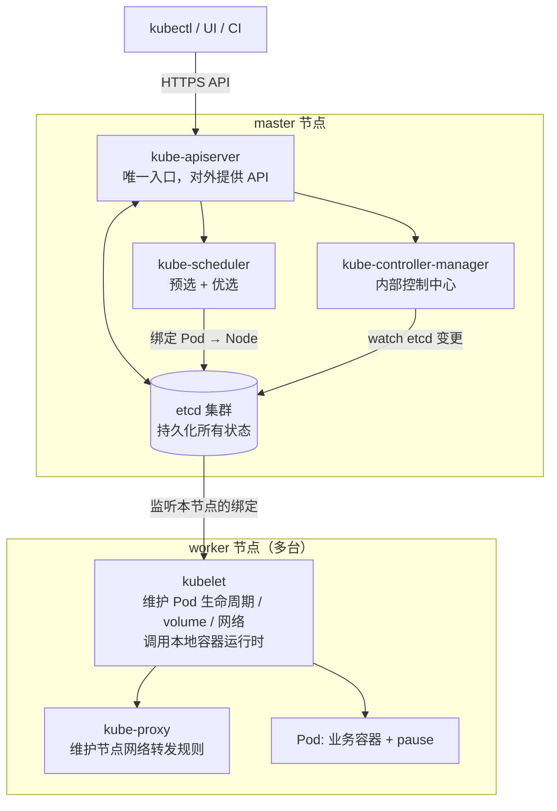

# Kubernetes 架构设计：两种节点、五个核心组件与一次调度落地的完整流程

## 纲要

- 集群由两种角色组成：master 主节点与 worker 工作节点
- 集群必须有自己的存储，etcd 集群承载所有状态，重启也不能丢
- apiserver 是操作集群的唯一入口，对外提供 HTTP / HTTPS API
- scheduler 调度器：收集节点资源信息，用预选 + 优选两类策略选出最优节点
- 绑定关系写回 etcd，controller-manager 监听变更并完成真正的落地
- controller-manager 是集群内部控制中心：Service / Endpoint / 副本 / 配额四类控制器
- kubelet 在每个 worker 上维护 Pod 生命周期、volume 与网络，最终调本地容器运行时起容器
- 理论到此为止，剩下的靠实践

## 两种角色：master 与 worker

Kubernetes 肯定需要很多台服务器、很多个节点，这些服务器分成两种角色：

- **master（主节点）**：一台主节点的机器，负责去管理这些 worker 节点
- **worker（工作节点）**：可以有很多很多个，负责运行具体的服务

另外，一般的应用都有自己的存储——有的是文件存储，有的是数据库，还有些是存储类中间件。Kubernetes 当然也需要自己的存储，因为它要管理机器节点、管理服务，这些信息总得放在一个地方。如果不做持久化，一旦出问题导致机器重启，数据就丢失了，服务也就没法恢复。

Kubernetes 选择的存储组件是 **etcd**，以 etcd 集群的形式作为它的存储组件。

存储有了，接下来该如何访问这个集群？比如我要创建一个服务，得先跟集群做一次交互。这时 master 节点上有一个服务叫 **apiserver**，它就是用来操作 Kubernetes 的**唯一入口**，对外提供 HTTP 或 HTTPS 形式的 API。



## 一次创建 Deployment 的完整流程

apiserver 接到客户端请求之后（比如一个创建 Deployment 的请求），流程是这样走的：

**第一步：选节点（调度）**

先要选一个节点把 Pod 调度上去。这用到了另一个组件 **scheduler（调度器）**。调度器会收集每一个 worker 的详细信息，包括它们的资源——内存、CPU，以及节点上跑了什么样的服务等等各种信息。然后通过一系列算法，主要分两大类：

- **预选策略（Predicate）**：先把明显不合适的节点过滤掉
- **优选策略（Priority）**：在剩下的节点里打分，选出最优的节点

最终选出一个最优节点，把这个节点跟 Pod 建立起关系，然后告诉 apiserver：这个 Pod 可以运行在某某节点上。apiserver 把这个消息存进 etcd 做持久化——**Pod 与 Node 的绑定关系就这么落盘了**。

**第二步：内部控制中心接手（controller-manager）**

接下来需要真正把那个 Pod 启动起来，这就用到了 **controller-manager**，它是集群内部的控制中心，负责维护各种各样的 Kubernetes 对象。它内部包含若干控制器：

| 控制器 | 管什么 |
| --- | --- |
| Service controller | 管理服务（负载均衡与后端入口） |
| Endpoint controller | 管理 Pod 列表（Endpoint） |
| Replication controller | 管理副本（副本数维持） |
| Resource quota controller | 管理资源配额 |

它会时刻关注这些内容的状态，并且时刻保证它们处于一个正确的状态。

回到刚才那个调度过程：controller-manager 会通过 apiserver 去取（watch）etcd 里的变更——比如刚才那个 Pod 与节点的绑定关系，就会被它监听到。它通过一些目录发现这个 Pod 当前处于等待调度（Pending）的状态，于是去完成那个调度，让 Pod 运行起来。

**第三步：worker 上真正把容器跑起来**

Pod 是怎么在 worker 上跑起来的？这需要在每一个 worker 节点上事先装好一个服务，叫 **kubelet**。这个服务在每个节点上都存在，主要负责维护 Pod 的生命周期，包括容器的 volume 和网络管理，最终 kubelet 会去调用本地的容器运行时（docker）把容器运行起来，一个一个的 Pod 就跑起来了。

> worker 节点上通常还有 kube-proxy，负责维护节点上的网络转发规则，让 Service 的 ClusterIP 在节点层面能正确转发。

## 集群架构的一张目录树

把上面这套铺到真实机房里，大致长这样：

```text
kubernetes 集群
├── master（10.15.20.50）
│   ├── kube-apiserver（6443，对外唯一入口）
│   ├── kube-scheduler
│   ├── kube-controller-manager
│   └── etcd 集群成员（2379 / 2380）
├── worker-1（10.15.20.51）
│   ├── kubelet（10250）
│   ├── kube-proxy（10256）
│   ├── calico-node
│   └── Pod × N
├── worker-2（10.15.20.52）
│   ├── kubelet（10250）
│   ├── kube-proxy（10256）
│   ├── calico-node
│   └── Pod × N
└── 存储
    └── etcd 集群（raft 多数派）
```

生产上 master 一般不止一台（多 master 做高可用），etcd 也必须奇数个成员组成集群，这些是后面高可用章节要展开的。

## API 速览

| 能力 | 做法 | 说明 |
| --- | --- | --- |
| 看集群有几个节点 | `kubectl get nodes -o wide` | 只看 ROLES/STATUS，看不出 master/worker 内部构成 |
| 看节点资源与压力 | `kubectl describe node <name>` | Conditions 里能看到 MemoryPressure / DiskPressure / Ready |
| 看核心组件健康 | `kubectl get componentstatuses` | 分别报 scheduler / controller-manager / etcd 的健康 |
| 看集群组件 Pod | `kubectl get pods -n kube-system -o wide` | apiserver、etcd、kubelet 全跑在 Pod 里 |
| 看组件日志 | `kubectl logs -n kube-system <pod>` | 排障第一现场 |
| 看调度结果 | `kubectl describe pod <name>` | Events 里那行 `Successfully assigned ... to worker-2` 就是调度结论 |
| 看 Etcd 本身 | `etcdctl endpoint health` | 存储层健康的直接证据 |
| 看当前谁在调度 | `kubectl get pod -o wide` | 已绑定的 Pod 会直接显示落在哪个 NODE |

## Demo 示例

用一条命令把「调度器选节点 → 绑定写 etcd → kubelet 拉起」这三段在集群里现场表演一遍。

第一步，先确认控制面组件都在：

```bash
kubectl get componentstatuses
kubectl get nodes -o wide
```

```text
NAME                 STATUS    MESSAGE              ERROR
scheduler            Healthy   ok
controller-manager   Healthy   ok
etcd-0               Healthy   {"health":"true"}

NAME      STATUS   ROLES    AGE   VERSION   INTERNAL-IP   NODE
master    Ready    master   8d    v1.15.3   10.15.20.50   10.15.20.50
worker-1  Ready    <none>   8d    v1.15.3   10.15.20.51   10.15.20.51
worker-2  Ready    <none>   8d    v1.15.3   10.15.20.52   10.15.20.52
```

第二步，创建一个单副本 Deployment，故意先不给它指定节点：

```bash
kubectl create deployment nginx-demo --image=nginx:1.17.1 --replicas=1
```

第三步，看调度器干的活——Events 里那行 `Successfully assigned` 就是 scheduler 选出来的结果：

```bash
kubectl describe pod -l app=nginx-demo
```

```text
Events:
  Type    Reason     Age    From               Message
  ----    ------     ----   ----               -------
  Normal  Scheduled  20s    default-scheduler  Successfully assigned default/nginx-demo-7d9c8b9f5-abcde to worker-2
  Normal  Pulling    19s    kubelet, worker-2  Pulling image "nginx:1.17.1"
  Normal  Pulled     13s    kubelet, worker-2  Successfully pulled image "nginx:1.17.1"
  Normal  Created    12s    kubelet, worker-2  Created container nginx
  Normal  Started    12s    kubelet, worker-2  Started container nginx
```

注意 Events 里的 `From` 列：`default-scheduler` 是调度器干的，`kubelet, worker-2` 是那个节点上的 kubelet 接手干的——同一条 Pod 的生命周期，被架构里两个不同角色分了两段活。

第四步，看节点资源，理解「优选策略」的依据从哪来：

```bash
kubectl describe node worker-2 | sed -n '/Allocated/,$p'
```

```text
Allocated resources:
  Resource           Requests    Limits
  --------           --------    ------
  cpu                950m (47%)  0 (0%)
  memory             180Mi (4%)  340Mi (8%)
Events:              <none>
```

第五步，验证状态确实持久化在 etcd 里——把 Pod 删掉，controller-manager 会立刻观察到变更并重建：

```bash
kubectl get pod -l app=nginx-demo -o wide
kubectl delete pod -l app=nginx-demo
kubectl get pod -l app=nginx-demo -o wide
```

```text
nginx-demo-7d9c8b9f5-abcde   1/1     Running   0   5m   10.244.2.19   worker-2
# 删除后立刻查，新名字又出现了
nginx-demo-7d9c8b9f5-zzzzz   0/1     Pending   0   1s   <none>        <none>
```

那个 `Pending` 状态的瞬间，正是「绑定写进 etcd、controller-manager 监听到、kubelet 还没拉起来」的中间态——整个集群的协作关系，就在这几秒钟里看得一清二楚。

### 总结

- 集群只有两种角色：master 负责管理，worker 负责干活，worker 可以横向扩很多台。
- etcd 集群是 Kubernetes 唯一的强一致存储，所有节点与对象状态都落在这里，机器重启数据不丢。
- apiserver 是操作集群的唯一入口，对外只暴露 HTTP / HTTPS API，所有组件彼此通信也都要经过它。
- 调度器用「预选 + 优选」两类策略，从收集到的节点资源信息里挑出最优节点，把 Pod 与 Node 的绑定关系写回 etcd。
- controller-manager 是集群内部控制中心，靠 watch etcd 的变更驱动，Service / Endpoint / 副本 / 配额四类控制器时刻把状态拉回正确值。
- kubelet 装在每台 worker 上，接收本节点的绑定、维护 Pod 生命周期与 volume 和网络，最终调本地容器运行时把容器跑起来。

