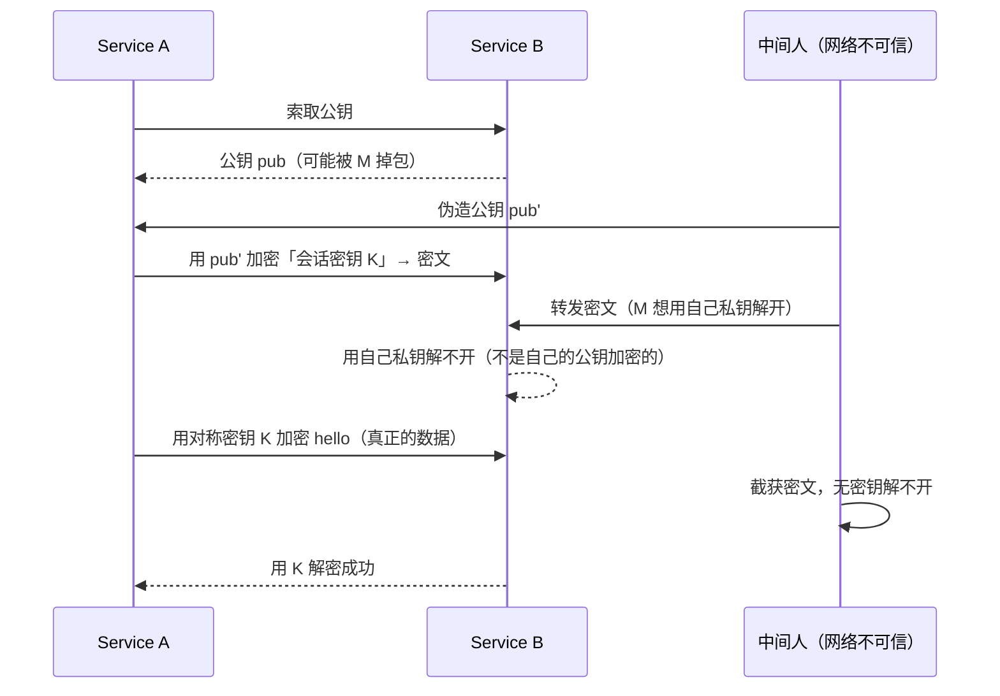

# 认证的密码学原理：从对称加密、非对称加密到 CA 证书与 TLS 握手

## 纲要

- 搭高可用集群之前，先理清认证与授权这两件事
- 集群一切资源都靠 apiserver 实现，认证解决「你是谁」，授权解决「你能干什么」
- 认证要解决的是网络不可信假设下的身份问题，不是「机器被 root 了怎么办」
- 对称加密：一个密钥加密、同一个密钥解密，性能高
- 非对称加密：公钥加密、私钥解密，性能损耗大
- 密钥分发难题：直接发密钥会被截获，纯非对称又太慢
- 混合方案：公钥加密一个「会话密钥」，此后全程对称加密——这就是 SSL / TLS
- 剩下的漏洞是「公钥被掉包」，靠 CA 证书机构与证书校验兜底
- 自签证书访问时那段红色警告，就是这么来的

## 先分清：认证和授权是两件事

Kubernetes 的认证和授权两大块，是原生集群搭建又麻烦又难懂的主要来源，操作麻烦、理解也麻烦，所以必须先搞清楚，不然后面学什么都在懵。

集群里所有的资源都是通过 **apiserver** 这个组件来实现的。所以整个集群的关键点就落在 apiserver 上：它如何实现客户端的身份，以及随后通过 apiserver 去访问那些资源时的授权。

认证和授权是两个词，要分开理解：

- **认证（Authentication）**：确认「你是谁」
- **授权（Authorization）**：确认「你能干什么」

## 认证到底在防什么

先说什么是认证。比如找工作，跟面试官说毕业于清华大学，他可能会半信半疑；但把学位证拿出来啪放在桌上，面试官肯定就信了——**这张学位证就是对你的一种认证**。

再比如上网，现在大部分网站都是 HTTPS 协议，浏览器地址栏那块显示成绿色，就证明当前访问的这个网站是安全的、经过认证、可信的。这也是一种认证。

Kubernetes 里的认证和这个非常相似。但要先想明白：认证解决的是什么问题、防止什么事情发生？是防止有人入侵集群、把机器 root 了、还要保证集群安全吗？不是——机器都已经被 root 了，就防不胜防了。

网络安全本身解决的是「**在某些假设成立的条件下，我们该如何防范**」。这里有个非常重要的假设：**有两个服务 A 和 B 在通讯时，中间这个网络是不安全、不可信任的**，可能被第三方不法分子把信息截获甚至篡改，你俩发的信息全经过了别人的手——上学时给心仪的女孩传纸条，可能被中间的同学偷看，甚至帮你把「我喜欢你」改成「我不喜欢你」，后果不堪设想。

这个假设不是随便想出来的，是从当前网络技术和实际发生过的问题里总结出来的。而它不需要自己想办法，因为任何需要在网络上通讯的服务都要面对这个问题，肯定早就被解决掉了。

## 密码学两个基本概念

### 对称加密

比如有一个保密数据「小姐姐好可爱」，不想被任何人看到。用一个加密密钥对它做对称加密，加密之后这串数据就变成了一堆看不懂的乱码。接收端用**同样的密钥**去解密，解出来就是原文。

**一个密钥加密，同一个密钥解密**——这就是对称加密。

### 非对称加密

同样是明文，用非对称加密算法加密，也有密钥，然后得到密文；解密用的是**另外一个密钥**，最终解出原文。加密用一个密钥、解密用另一个密钥，这就是非对称加密。这两个密钥互为一对：一个叫**公钥**（一般用来加密，谁拿得到都无所谓），一个叫**私钥**（一般用来解密，只有自己有）。

| 对比项 | 对称加密 | 非对称加密 |
| --- | --- | --- |
| 密钥 | 收发双方同一个密钥 | 公钥 + 私钥一对 |
| 速度 | 性能非常高 | 算法复杂，加密解密消耗都很大 |
| 主要用途 | 大量数据的加密传输 | 密钥交换、签名 |
| 典型算法 | AES | RSA、ECDSA |

## 密钥怎么送过去：三种方案

现在有服务 A 和 B 要通讯，中间数据要保密：

**方案一：裸发。** A 和 B 之间直接建 socket，发一个 `hello` 过去。肯定不行，中间一旦有人截获，直接就看到 `hello` 了。

**方案二：对称加密。** A 用一个密钥把 `hello` 加密成密文发出去。中间人被截获了也解不开，因为他没有密钥。但 B 收到密文，不知道密钥是什么——事先并没告诉过 B。有人会说让 A 先跟 B 打个招呼把密钥告诉它，可互联网世界里成千上万个服务，不可能靠人工互相通知密钥；那 A 先把密钥发给 B、B 拿到后再发密文？也不行，因为发密钥的时候这个密钥本身也可能被截获，之后他拿着密钥就能解开你的数据了。

**方案三：非对称加密。** B 公开一个公钥，谁都能看，黑客也看得到但没关系。A 用这个公钥把数据加密后发给 B，中间即使被截获，他也解不开——只有 B 手里的私钥能解开。数据确实安全送达了。

## 混合方案：SSL / TLS 握手过程

但这里还藏着一个问题：**非对称加密算法非常复杂，加密和解密的消耗都非常大**，如果每次通讯都做非对称加解密，性能损耗根本无法接受；而对称加密性能又非常高。

所以把两种算法结合起来用：

1. 第一次通讯，A 生成一个很复杂的密钥（**会话密钥**），用 B 的**公钥**把这个密钥加密成密文发出去
2. 中间人截获也拿不到这个密钥
3. B 用自己的私钥解开，发现里面是一个「对称加密的密钥」，就知道 A 要跟他用对称加密通讯，而且用的就是这个密钥
4. 接下来再发 `hello` 时，A 直接用这个会话密钥加密（对称加密），B 也用这个密钥解密

这样一个会话里，A 和 B 就用对称加密方式通讯了——**安全性和性能同时解决**。上面这个过程，就是大名鼎鼎的 **SSL 和 TLS 协议**；没听说过也没关系，HTTPS 肯定听过，HTTPS 底层就是通过这两个协议通讯的。



## 剩下那个坑：公钥被掉包

上面这个流程看起来完美了吗？还有一个潜在风险：公钥从 B 返回给 A 的路上，可能被中间人拿到——他本来该收到「一二三四五六」，却发给了 A「六五四三二一」这个假公钥。A 拿着假公钥加密自己的会话密钥，传输时又被黑客拿到，他就能用自己的私钥把数据解出来。

虽然这对黑客要求比较高（既要截获 B 发给 A 的公钥，还要继续截获 A 发出来的加密数据），但这种情况**确实有可能发生**。

现在的解法是引入 **CA（Certificate Authority，证书认证机构）**，就是一个给所有人颁发证书的中间商。正常的网站证书都存在这个地方：

1. A 向 B 索要公钥，拿到之后，去问一问 CA：这个公钥是不是合法的、是不是可以信任
2. CA 检查一下自己的库：这个公钥存不存在、是哪个公司的、域名是什么、所有人是谁，各种信息在 CA 都有备案
3. CA 告诉 A：这个公钥是我颁发的，没有问题
4. A 再拿这个公钥去通讯，就能确保拿到的是正常公钥

到这里整个流程才算完整。也正因为如此，访问某些网站时 HTTPS 会显示红色警告——说明它用的证书并不是通过 CA 认证过的，一般是自己生成的（自签证书）。

## 证书在集群里的落点

Kubernetes 集群整套认证体系都落在 `/etc/kubernetes/pki` 这一棵目录上：

```text
/etc/kubernetes/pki
├── ca.crt                 集群根 CA 证书
├── ca.key                 集群根 CA 私钥
├── apiserver.crt           apiserver 服务端证书（含 SAN）
├── apiserver.key
├── sa.pub / sa.key         ServiceAccount 密钥对
├── etcd
│   ├── ca.crt / ca.key    etcd 自己的 CA
│   ├── server.crt/key     etcd 服务端证书
│   └── healthcheck-client.crt/key
└── 客户端证书（后续授权章节会用到）
    ├── admin.crt / admin.key
    └── admin.kubeconfig
```

服务端证书一定要带上正确的 SAN（Subject Alternative Name），否则客户端校验证书时会报「证书对当前主机名无效」。

## API 速览

| 能力 | 做法 | 说明 |
| --- | --- | --- |
| 看 CA 证书主体与有效期 | `openssl x509 -in ca.crt -noout -subject -dates` | 排查「证书过期」先看这两列 |
| 看服务端证书里的 SAN | `openssl x509 -in apiserver.crt -noout -text \| grep -A2 Alternative` | Client/Server 名字对不上就是这里的问题 |
| 看握手链上的证书 | `openssl s_client -connect <ip>:6443 -showcerts` | 手动模拟一次 TLS 握手 |
| 忽略自签证书访问 API | `curl -k https://<master>:6443/version` | `-k` 就是 skip TLS verification |
| 用指定 CA 校验证书 | `curl --cacert /etc/kubernetes/pki/ca.crt https://<master>:6443/api` | 生产就该带 `--cacert` |
| 生成自签 CA | `openssl req -x509 -new -nodes -key ca.key -subj "/CN=kubernetes-ca" -days 3650 -out ca.crt` | 10 年有效期是集群常用值 |
| 签发客户端证书 | `openssl x509 -req -in client.csr -CA ca.crt -CAkey ca.key -CAcreateserial -out client.crt -days 365` | `-CAcreateserial` 别忘了，否则第二次签发会失败 |
| 看 kubeconfig 里的凭据 | `kubectl config view` | 里面藏着证书文件路径或 token |

## Demo 示例

亲手做一套自签证书，复现「HTTPS 红色警告」是怎么产生的。

第一步，用 openssl 造一个 CA：

```bash
mkdir -p /tmp/demo-pki && cd /tmp/demo-pki
openssl genrsa -out ca.key 2048
openssl req -x509 -new -nodes -key ca.key \
  -subj "/CN=kubernetes-ca" -days 3650 \
  -out ca.crt
```

第二步，给一个「服务端」签发带 SAN 的证书：

```bash
openssl genrsa -out server.key 2048
openssl req -new -key server.key \
  -subj "/CN=10.15.20.50" \
  -out server.csr

cat > server.ext <<'EOF'
subjectAltName = IP:10.15.20.50,DNS:master
extendedKeyUsage = serverAuth
EOF

openssl x509 -req -in server.csr \
  -CA ca.crt -CAkey ca.key -CAcreateserial \
  -extfile server.ext -days 365 -out server.crt
```

第三步，用这条命令看一眼证书到底签给了谁、有效期到什么时候：

```bash
openssl x509 -in server.crt -noout -subject -issuer -dates
```

```text
subject=C = ST = StateOrProvinceName, L = ..., CN = 10.15.20.50
issuer=C = ..., CN = kubernetes-ca
notBefore=Apr  1 10:00:00 2026 GMT
notAfter=Mar 31 10:00:00 2027 GMT
```

第四步，模拟客户端校验：证书是签名过的，但**根不在你的信任库里**，所以客户端会直接拒绝：

```bash
curl --cacert ./ca.crt https://10.15.20.50:6443/api
# curl: (60) SSL certificate problem: unable to get local issuer certificate

curl -k https://10.15.20.50:6443/version
{
  "kind": "APIVersions",
  "versions": ["v1"]
}
```

浏览器里弹出的那段「红色警告」，本质跟第一行一模一样：这个证书不是客户端信任的 CA 签发的。换成 `-k` 跳过校验就能通——这就是很多人在自己环境里图省事干的事，生产上绝不能这么干。

第五步，看真实集群里 apiserver 的证书链：

```bash
openssl s_client -connect 10.15.20.50:6443 -servername master -showcerts </dev/null 2>/dev/null | grep -E "subject=|issuer="
```

```text
subject=C=CN, O=Kubernetes, CN=kube-apiserver
issuer=C=CN, O=Kubernetes, CN=kubernetes-ca
```

到这里，TLS 握手、混合加密、CA 校验这三件事就闭环了。有了这套底子，再看 Kubernetes 的认证（客户端证书、token、ServiceAccount）和授权（RBAC），就不会觉得是一堆凭空冒出来的配置。

### 总结

- 认证和授权要分开看：认证回答「你是谁」，授权回答「你能干什么」，两者都在 apiserver 上落地。
- 认证面对的假设是「网络不可信、中间可截获可篡改」，而不是「机器已被 root」，这是理解整套机制的前提。
- 对称加密快但密钥难分发，非对称加密安全但性能损耗大，单独用都解决不了问题。
- SSL / TLS 的本质是混合方案：用对方公钥加密一个会话密钥完成密钥交换，之后全程对称加密传输数据。
- 剩下的风险是公钥被掉包，靠 CA 证书机构备案与本地信任库校验来兜底；自签证书就会触发红色警告。
- 集群里的证书落在 `/etc/kubernetes/pki`，服务端证书必须写对 SAN，否则客户端一律校验失败。

