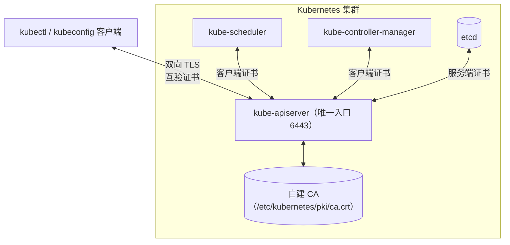

# Kubernetes 的认证、授权与准入控制：三种认证方式、RBAC 模型与三道关卡

## 纲要

- 场景先摆出来：kubectl 和集群内部各组件都通过 apiserver 联系，第一关就是认证
- 认证方式一：客户端证书认证，也就是双向 TLS
- Cluster 用的是自建 CA，不依赖公网机构，给每个组件单独发证书
- 认证方式二：bearer token，一个预先定义在 apiserver 里的复杂密码
- 认证方式三：ServiceAccount，给集群内部运行的 Pod 用的
- 授权是第二关：ABAC / Webhook / RBAC 三种机制，RBAC 从 1.6 引入且是最新策略
- RBAC 三层结构：用户 → 角色 → 权限，用户分 User 与 ServiceAccount 两类
- 权限的两个维度：资源（resource）与动作（verb）
- Role / RoleBinding 收在 namespace 下，ClusterRole / ClusterRoleBinding 管集群范围资源
- 最后一关准入控制：一串独立插件按顺序过一遍
- 常用的准入插件：AlwaysAdmit、AlwaysDeny、ServiceAccount、DenyEscalatingExec

## 场景：谁在访问 apiserver

假设画一个集群，apiserver 作为它的唯一入口。集群里有各种各样的组件——controller-manager、scheduler 这些是主节点上的组件，还有 etcd 等等各样组件在这个集群里运行，它们都是通过 apiserver 建立联系的客户端。

现在 kubectl 去访问 apiserver，第一步就要认证：apiserver 得知道访问我的人到底是谁。kubectl 一般使用的就是**客户端证书认证**这种方式。

## 认证方式一：客户端证书认证（双向 TLS）

客户端证书认证也叫 **双向认证 TLS**。为什么是「双向」？因为不只是 kubectl 去验证 apiserver 的证书是不是合法的、是不是自己真正想访问的那个 apiserver；apiserver 在被访问的时候，同样也要验证这个客户端是不是一个合法的客户端。双方互相验证对方的证书是不是这个 CA 所颁发的——是的话就通过认证，可以进行加密通讯了。

那这个 CA 从哪来？集群需要有一个 CA 用来判断和保证每一个证书的合法性。Kubernetes 用的并不是我们现在 websites 用的那种公有的机构，它是自己治理的一个认证中心——**在自定义的 CA 里面给每一个组件颁发证书**：可能给 etcd 发、给 scheduler 发、给 controller-manager 发、给 apiserver 发，给 kubelet 发，各种组件只要需要用到证书，就由这个 CA 来给他们颁发。



## 认证方式二：bearer token

还有一种认证方式叫 **bearer token**。这是个比较简单的方式，可以理解为有一个非常复杂的密码预先定义在 apiserver 里边，然后把这个密码告诉一个指定的客户端。客户端跟 apiserver 通讯的时候把这个 bearer token 带上，apiserver 验证一下，没有问题就可以通讯了。

开发基于 Kubernetes 的容器管理平台时，可以通过 bearer token 这种简单方式去访问 apiserver。

```bash
# 带 token 访问一次 API，验证身份
TOKEN=$(cat /var/run/secrets/kubernetes.io/serviceaccount/token)
curl -k -H "Authorization: Bearer $TOKEN" \
  https://10.15.20.50:6443/api/v1/namespaces/dev/pods
```

## 认证方式三：ServiceAccount

前两种方式都是**集群外部**访问 apiserver 时用的认证方式。而 **ServiceAccount** 适用于在集群内部运行的 Pod 里现在运行的容器——比如某个容器要跟 apiserver 打交道，要用的就是 ServiceAccount 方式。

ServiceAccount 跟 Kubernetes 其他资源一样，用户也可以创建自己的 ServiceAccount。它主要包含三个内容：

1. **namespace**：所属的命名空间
2. **token**：它的密码
3. **CA**：用于验证 apiserver 的证书

看到这些信息，它们都会通过**目录挂载**的方式挂载到 Pod 的文件系统里，应用只要读取指定目录的这些文件就能拿到，然后跟 apiserver 交互。

```text
/var/run/secrets/kubernetes.io/serviceaccount/     （默认挂载点）
├── namespace      当前命名空间名
├── token          ServiceAccount 的 JWT token
└── ca.crt         校验 apiserver 证书的 CA
```

客户端 Pod 拿到这三样东西之后，就能像 kubectl 一样完成一次带认证的 API 调用。

## 授权：第二关

如果说认证是访问 apiserver 的第一关，那授权就是**第二关**：认证确认了你的身份、身份没问题，第二步就要知道这个身份的人能干什么样的事情。

Kubernetes 里有一系列的授权机制，最早的有 **ABAC**，还有一种叫 **Webhook**，还有一种叫 **RBAC**。其中 RBAC 是 Kubernetes 1.6 开始引入的，也是最新的一个授权策略；因为社区投入和偏好，相较于前两种机制而言，RBAC 是更好的选择，所以只学 RBAC 就足够了。

RBAC 全称 Role-Based Access Control，即**基于角色的访问控制**。角色的概念很熟悉，一般权限系统都少不了：用户（user）拥有什么样的角色（role），这个角色下又包含哪些权限（authority）——一个三层结构。

### 用户层：两类用户

Kubernetes 在 user 这个层面上分了两种：

- **User（普通用户）**：比如用 kubeconfig、用 kubectl 去访问 apiserver 的场景，都属于普通用户
- **ServiceAccount**：专门用于在集群内部去访问 apiserver

只不过是在用户的层面把两者区分了一下。在权限设计里，User 和 ServiceAccount 可以认为是**对等**的概念——RoleBinding 和 ClusterRoleBinding 都同时支持这两种用户。

### 权限的两个维度

Kubernetes 里有很多类型的对象、很多类型的资源——Pod、Deployment、Service 等等。权限当然要考虑把它们区分开，这是一个维度，叫**资源的维度（resource）**。

还有一个维度是对资源的控制方式，也就是常见的增删改查，在 Kubernetes 里叫 **动作（verb）**。动作主要有：

- `list` 列表
- `create` 新增
- `update` 更新
- `patch` 小更新
- `delete` 删除
- 还有 `get` 单条、`watch` 监听

这些总结一下，其实就是 CRUD。

### 角色层：Role 与 ClusterRole

角色至少得有 name、有它覆盖哪些资源（resource）、有哪些操作（verbs）。用户有了、角色有了，用户跟角色之间的对应关系怎么描述？数据库里肯定要有一张关系表，但 Kubernetes 没有数据库，它用另外一种资源来描述这种对应关系，叫做 **RoleBinding（角色绑定）**——很形象，很容易理解。

这样的设计能满足需求吗？Kubernetes 里有个非常重要的概念叫 **namespace（命名空间）**，它用来对资源做隔离。如果有一个人只能访问某一个或某几个命名空间下的资源，上面这个设计好像不够——整个设计里并不包含命名空间的任何东西。

于是 Kubernetes 想了个办法：**把角色放到一个 namespace 下边**。比如有个 namespace 叫 `test`，那么这个 Role 就属于 `test` 这个命名空间；拥有了这个角色，就只能拥有当前这个命名空间下的角色对应的权限。命名空间的问题就这么解决了。

但还有跨 namespace 的需求——如果一个人拥有所有权限呢？于是又提出另外一种角色叫 **ClusterRole（集群角色）**，对应地有 **ClusterRoleBinding（集群角色绑定）**。集群角色除了可以定义和普通角色一样的 resource 和 verbs 以外，还可以定义集群范围内的资源——并不是所有资源都属于某个 namespace，比如 `kubectl get nodes` 返回的机器列表，**Node 就不属于任何 namespace**，但它也是应用资源；这种情况要给人给 Node 的操作权限，就需要定义一个 ClusterRole，把 Node 这个资源加到角色里。

这样角色的控制就比较灵活了，可以满足各种各样的需求：

- 需要某一个或某几个 namespace 的权限 → 定义对应的几个 Role 再把 RoleBinding 关联起来
- 需要整个集群的 Pod、Service 访问权限 → 定义 ClusterRole，在 resource 里指定 pods、services，再建 ClusterRoleBinding 把用户绑上去，就不受命名空间制约了

## 准入控制：最后一关

第二关授权过了，是不是就可以执行对应的请求了？当然不行，还有**最后一关：准入控制（Admission Control）**。

准入控制可以理解为一个个的小插件、一个个的小代码，它们之间独立存在，并没有什么联系。请求会挨个从这些控制代码段里执行一遍，一个一个地执行，这一条线走过去就算通了。具体执行哪一些、以及执行它们的先后顺序，在配置 apiserver 的时候去指定。可以把它理解为**一个 filter 链**。

Kubernetes 默认提供的准入控制大概有十几二十种，挑几个有基本认识：

| 插件 | 作用 |
| --- | --- |
| AlwaysAdmit | 总是允许，所有的请求通过 |
| AlwaysDeny | 所有请求一律拒绝，一般用于测试 |
| ServiceAccount | 给 ServiceAccount 做自动化，比如某些 Pod 没写 ServiceAccount，就自动加一个当前命名空间默认的 ServiceAccount，确保它在每个 Pod 里都存在 |
| DenyEscalatingExec | 拒绝 exec 和 attach 到有特权 Pod 上，是限制登录到容器里执行命令的安全插件 |

> 注意：`准入控制` 里的这个 ServiceAccount 插件和前面讲的认证方式里的 ServiceAccount 是**两个完全不同的概念**，只是名字一样。前者是一段准入控制代码，负责给 Pod 补挂默认 ServiceAccount。

## API 速览

| 能力 | 做法 | 说明 |
| --- | --- | --- |
| 建一个服务账号 | `kubectl create serviceaccount ci -n dev` | Pod 内部访问 apiserver 的凭据 |
| 看服务账号详情 | `kubectl describe sa ci -n dev` | 1.15 时代会自动带出 token secret |
| 看挂载进 Pod 的凭据 | `kubectl exec <pod> -- ls /var/run/secrets/kubernetes.io/serviceaccount` | 三个文件：token / ca.crt / namespace |
| 建普通用户凭据 | 签 client 证书 → 写 kubeconfig | 客户端证书认证的最终形态 |
| 看当前用谁的身份在说话 | `kubectl config view --minify` | current-context 对应的 user 就是认证身份 |
| 建角色 | 写 `rbac.authorization.k8s.io/v1` 的 Role | 作用域限于单个 namespace |
| 建跨 namespace 角色 | 写 ClusterRole + ClusterRoleBinding | Node、Namespace 这类集群级资源只能靠它 |
| 查「谁能干这个」 | `kubectl get rolebinding,clusterrolebinding -A` | 权限排查第一命令 |
| 看 apiserver 开了哪些准入插件 | `ps -ef \| grep kube-apiserver` | 找 `--enable-admission-plugins` 参数 |

## Demo 示例

把上面那套 RBAC 三层结构落一遍：给一个只读用户看 `dev` 命名空间下的 Pod，再给集群内部的一个 ServiceAccount 授权，最后验证越权会被拒。

第一步，先看清默认 ServiceAccount 长什么样，以及它怎么被挂进 Pod：

```yaml
apiVersion: v1
kind: ServiceAccount
metadata:
  name: dev
  namespace: dev
automountServiceAccountToken: true
```

```text
kubectl describe pod -n dev <pod>
Mounts:
  /var/run/secrets/kubernetes.io/serviceaccount from dev-token-xxxxx (ro)
```

第二步，定义一个只可读 Pod 日志的角色：

```yaml
apiVersion: rbac.authorization.k8s.io/v1
kind: Role
metadata:
  name: pod-reader
  namespace: dev
rules:
  - apiGroups: [""]
    resources: ["pods", "pods/log"]
    verbs: ["get", "list", "watch"]
```

第三步，用 RoleBinding 把这个角色绑到用户和服务账号两种身份上：

```yaml
apiVersion: rbac.authorization.k8s.io/v1
kind: RoleBinding
metadata:
  name: pod-reader
  namespace: dev
subjects:
  - kind: User
    name: dev
    apiGroup: rbac.authorization.k8s.io
  - kind: ServiceAccount
    name: ci
    namespace: dev
roleRef:
  kind: Role
  name: pod-reader
  apiGroup: rbac.authorization.k8s.io
```

注意 `subjects` 里 Kind 为 `User` 时必须带 `apiGroup: rbac.authorization.k8s.io`，而 ServiceAccount 不用写这一行——这是两种 subject 最容易写错的地方。

第四步，应用并验证两种身份：

```bash
kubectl apply -f role.yaml -f rolebinding.yaml

# 普通用户 dev：只读 Pod 成功
kubectl --user=dev -n dev get pods
# NAME    READY   STATUS    RESTARTS   AGE
# web-xxx 1/1     Running   0          2m

# 普通用户 dev 去删 Pod：授权不过，第二关卡住
kubectl --user=dev -n dev delete pod web-xxx
# Error from server (Forbidden): pods "web-xxx" is forbidden:
#   users "dev" cannot delete resource "pods" in API group "" in namespace "dev"
```

第五步，给集群内部的 ci 服务账号发一个 ClusterRole，让它能看全集群 Node（Node 不属于任何 namespace，只能用集群级角色）：

```yaml
apiVersion: rbac.authorization.k8s.io/v1
kind: ClusterRole
metadata:
  name: node-viewer
rules:
  - apiGroups: [""]
    resources: ["nodes"]
    verbs: ["get", "list", "watch"]
---
apiVersion: rbac.authorization.k8s.io/v1
kind: ClusterRoleBinding
metadata:
  name: node-viewer-ci
subjects:
  - kind: ServiceAccount
    name: ci
    namespace: dev
roleRef:
  kind: ClusterRole
  name: node-viewer
  apiGroup: rbac.authorization.k8s.io
```

第六步，到 Pod 里用挂载的 token 访问 apiserver，顺便验证准入控制插件已经把凭据挂好了：

```bash
# 下面命令中的变量按你的集群环境赋值后再执行
kubectl exec -n dev $POD -- sh -c '
  ls /var/run/secrets/kubernetes.io/serviceaccount
  TOKEN=$(cat /var/run/secrets/kubernetes.io/serviceaccount/token)
  curl -k --cacert /var/run/secrets/kubernetes.io/serviceaccount/ca.crt \
       -H "Authorization: Bearer $TOKEN" \
       https://10.15.20.50:6443/api/v1/nodes
'
```

```text
ca.crt
namespace
token
{
  "kind": "NodeList",
  "items": [
    {"metadata": {"name": "master"}, ...},
    {"metadata": {"name": "worker-1"}, ...}
  ]
}
```

整个调用链走完就是三关：凭据（认证）对得上 → NodeList 在 ci 的 ClusterRole 允许的 verbs 里（授权）→ 准入插件放行（准入控制），最后才真正落到 etcd。

### 总结

- 认证方式有三种：客户端证书（双向 TLS，kubectl 和组件用）、bearer token（简单静态密码）、ServiceAccount（集群内部 Pod 用）。
- 客户端证书认证是双向的：客户端验 apiserver，apiserver 也验客户端，两边都认这个自建 CA 才算通过。
- Kubernetes 用自建 CA 给 etcd、scheduler、controller-manager、apiserver、kubelet 等每个组件单独签发证书，不依赖公网证书机构。
- 授权三选一：ABAC、Webhook、RBAC；RBAC 从 1.6 引入，是社区主推的最新策略。
- RBAC 是「用户 → 角色 → 权限」三层，用户分 User 与 ServiceAccount 且权限上对等；权限由 resource（资源维度）和 verbs（动作维度）两个维度描述。
- Role/RoleBinding 收在 namespace 下解决单命名空间授权，Node、Namespace 这类集群级资源必须靠 ClusterRole/ClusterRoleBinding。
- 请求过 apiserver 是三关：认证、授权、准入控制；准入控制是一串可配置的独立插件（AlwaysAdmit、AlwaysDeny、ServiceAccount、DenyEscalatingExec 等），顺序在 apiserver 启动时指定。

