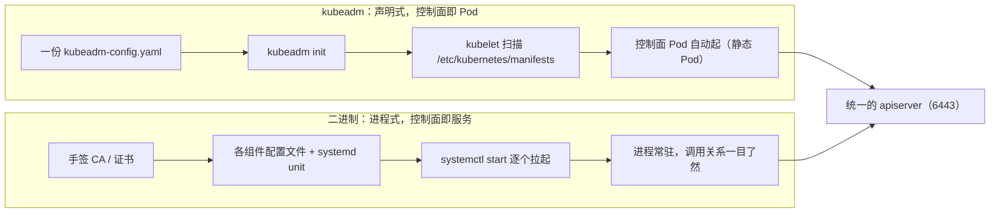

# 集群搭建方案对比：社区脚本、kubeadm 与二进制安装

## 纲要

- 动手装环境之前，先把常见安装方案摆出来对比
- 社区方案伴随 Kubernetes 诞生，五花八门但有三个致命缺点
- 社区方案一：方案杂而多，个人和小团队出的都有，单机 / 集群 / 高可用 / 非高可用全有
- 社区方案二：不可靠，号称简化其实并不简单，出问题难以定位
- 社区方案三：升级难，半年前装 1.6 的方案可能根本不支持升到 1.13
- kubeadm：官方推荐，组件全跑在容器与 Pod 里，优雅、简单、支持高可用、升级方便
- kubeadm 的缺点：不易维护、文档不够细致甚至有错误
- 二进制（binary）：官方方案之一，直进程运行、极易维护、灵活、升级方便
- 二进制的缺点：基本没有官方文档、安装过于复杂、证书授权都要手搓
- 结论：社区方案不推荐；学习和生产怎么选，以及本课程两种都做一遍的安排

## 社区方案：先说缺点，暂时想不出优点

Kubernetes 最初接触时的第一印象就是**上手困难、安装复杂**。正是因为这个复杂性，社区里出现了各种各样的安装方案，它们有什么特点呢？

**第一，非常杂、非常多，五花八门。** 有一些是个人出的方案，也有一些是小团队出的方案；有的方案是单机部署的，有的是部署集群的，还有的是高可用的方案、非高可用的方案。所以在选择的时候也不是特别容易找到自己想要的那一个。

**第二，不可靠。** 一方面体现在：虽然大部分方案都号称「简化」，但其实它们并不简单。安装过程中出现任何问题，都只能逐行自己看日志去定位，原因非常难以解决。用过一个 ansible 安装方案，如果对 ansible、shell 比较熟还好；如果不熟悉，出了问题基本搞不定。

**第三，升级难。** 比如你半年前用某个方案装了 1.6 版本，现在想升级到 1.13，肯定还是复用之前那个方案（毕竟已经比较熟悉了），但很有可能你发现之前那个方案就停在了 1.6，已经不支持更高版本的安装，只能换一种方式来做。

设计缺陷说完了——优点嘛，暂时想不出是吧，那就先不说了。

## kubeadm：官方推荐的优雅方案

**kubeadm** 是官方比较推荐的方案，特点如下：

- **非常优雅**：用 kubeadm 去安装，几乎所有的组件都是**运行在容器中的，并且都是运行在 Kubernetes 的 Pod 里面**
- **安装过程简单**：配一个配置文件、跑一条 `kubeadm init`，几乎会帮你完成所有事情
- **支持高可用**：不但支持非高可用的集群安装，也支持高可用的集群安装
- **升级方便**：只要能拿到 kubeadm 命令，肯定能拿到最新的 Kubernetes 集群——它是官方出的，会跟 Kubernetes 同步更新

那它有什么缺点？

- **不易维护**：对容器不太熟悉、或者对 Kubernetes 机制不太熟悉的同学，维护起来非常困难；传统运维如果让他去运维 K8s Pod，肯定是很难上手的
- **文档不够细致、比较简陋**：直接按官方文档做，很多时候会卡住；出现问题时很可能不知道这一步在说什么，或者某些变量不知道该如何替换。而且文档有时候会有错误——安装 1.11 版本的时候，文档里 kubeadm-config.yaml 那个文件有一段时间内容是有缺失的，花了很长时间才解决

## 二进制安装（binary）：官方方案，维护友好

**二进制（binary）方案**也算官方的一个方案，特征跟 kubeadm 正好相反：

- **非常易于维护**：它所有东西都是直接通过进程运行的，都需要你一点一点配置好、然后手动运行起来。这样就会非常清楚每个组件是怎么运行的、有什么样的调用关系，非常有利于理解，就算不懂容器的人也很快能上手
- **比较灵活**：不管你搭单机还是高可用，都是一个模块一个模块运行起来的，想怎么配置就怎么配置，控制起来非常灵活
- **升级方便**：和 kubeadm 一样，可以一点一点地升级，不会对整个集群造成太大影响

缺点呢？

- **它没有文档**：在官方文档里找了很多地方，都没有发现关于二进制安装和配置的一些文档，只能到别处找资料
- **安装太过于复杂**：一方面跟「没有文档」肯定有关系；另一方面是每个组件都需要自己配置，包括那些数字证书、认证授权、CA 都是需要一步步生成，还是比较复杂的

## 三种方案横向对比

| 维度 | 社区方案 | kubeadm | 二进制 |
| --- | --- | --- | --- |
| 来源 | 个人 / 小团队 | 官方推荐 | 官方（无文档） |
| 组件形态 | 形态不一，多为脚本直跑 | 全在容器与 Pod 里 | 直进程（systemd） |
| 上手难度 | 高，方案难选 | 低，一份配置一条命令 | 高，每组件都要手配 |
| 可维护性 | 差，出问题难定位 | 差，不懂容器机制就难维护 | 好，进程关系清楚 |
| 灵活性 | 一般 | 一般（被封装住） | 极灵活，逐模块掌控 |
| 升级 | 难，老方案常不支持新版本 | 方便，官方同步更新 | 方便，可逐组件升级 |
| 文档 | 分散 | 有但简陋甚至有错 | 基本没有 |
| 是否推荐 | 不推荐 | 可用（已 GA） | 生产主流 |

## 两种目录布局：看得见的区别

kubeadm 与二进制在集群落地后，目录形态差别很直观：

```text
【kubeadm 安装】组件全是 static Pod，由 kubelet 直接拉起
/etc/kubernetes/
├── manifests/                    ← kubelet 监控这个目录，里面有即自动起
│   ├── kube-apiserver.yaml
│   ├── kube-scheduler.yaml
│   ├── kube-controller-manager.yaml
│   └── etcd.yaml
├── kubelet.conf
├── kubeadm-config.yaml
└── pki/
    ├── ca.crt / ca.key
    ├── apiserver.crt / apiserver.key
    └── sa.key / sa.pub

【二进制安装】组件是独立进程，交给 systemd 管
/etc/kubernetes/
├── bin/                          ← kube-apiserver、kube-scheduler、kube-controller-manager、etcd、kubectl
├── conf/                         ← 各组件启动参数配置文件
├── pki/                          ← CA、服务端证书、客户端证书全部自己生成
└── logs/
/usr/lib/systemd/system/
├── kube-apiserver.service
├── kube-scheduler.service
├── kube-controller-manager.service
├── kube-proxy.service
└── etcd.service
```

一眼就能看出：kubeadm 世界里「有没有 Pod」答案是肯定的，控制面组件全在 `kube-system` 里跑；二进制世界里「有没有 Pod」答案是否定的——你看到的是一个又一个 systemd 服务。



## API 速览

| 能力 | 做法 | 说明 |
| --- | --- | --- |
| 一条命令初始化集群 | `kubeadm init --pod-network-cidr=10.244.0.0/16` | Pod 网段要和网络插件对齐 |
| 单机友好（跳过 API 外网可达校验） | `kubeadm init --apiserver-advertise-address=<ip>` | 单机部署常用 |
| 多 master 入口 | `kubeadm init --control-plane-endpoint=<lb>:6443` | 配合负载均衡做高可用 |
| 指定版本 | `kubeadm init --kubernetes-version=v1.15.3` | 别让默认版本漂移 |
| 工作节点加入 | `kubeadm join <master>:6443 --token <t> --discovery-token-ca-cert-hash sha256:<h>` | token 默认有时效 |
| 看能升到哪 | `kubeadm upgrade plan` | 升级前先跑它 |
| 执行升级 | `kubeadm upgrade apply v1.15.3` | 先排空节点再升，避免中断 |
| 二进制升级 | 逐个替换 `/opt/kubernetes/bin` 下二进制 + `systemctl restart` | 逐组件来，影响面小 |
| 看 static Pod 是否都在 | `kubectl get pods -n kube-system -o wide` | kubeadm 装完的第一条验证命令 |

## Demo 示例

两条路线各走一次最关键的开头，把「简单」和「复杂」的体感拉满。

**路线一：kubeadm，一份配置 + 一条命令**

```bash
# 1. 初始化主节点（Pod 网段与 calico 对齐）
kubeadm init \
  --apiserver-advertise-address=10.15.20.50 \
  --kubernetes-version=v1.15.3 \
  --pod-network-cidr=10.244.0.0/16 | tee kubeadm-init.log

# 2. 配置普通用户可用的 kubectl
mkdir -p $HOME/.kube
cp /etc/kubernetes/admin.conf $HOME/.kube/config
chown $USER:$USER $HOME/.kube/config

# 3. 装网络插件（calico）
kubectl apply -f calico.yaml

# 4. 验证控制面是不是全以 Pod 形式在跑
kubectl get pods -n kube-system -o wide
```

```text
NAME                                      READY   STATUS    RESTARTS   AGE
coredns-58cc68hcdd-9zxkq                  1/1     Running   0          2m
coredns-58cc68hcdd-rl9wp                  1/1     Running   0          2m
etcd-master                               1/1     Running   0          3m
kube-apiserver-master                     1/1     Running   0          3m
kube-controller-manager-master            1/1     Running   0          3m
kube-proxy-4rjtz                          1/1     Running   0          2m
kube-scheduler-master                     1/1     Running   0          3m
```

看到 `etcd-master`、`kube-apiserver-master` 这些不带副本号的名字，就是 static Pod 的样子——没有 Deployment，没有 ReplicaSet，全由 kubelet 直接托管。

**路线二：二进制，从证书开始手工搭**

```bash
# 1. 先生成 CA（这一步 kubeadm 全自动，二进制必须自己来）
openssl genrsa -out ca.key 2048
openssl req -x509 -new -nodes -key ca.key -subj "/CN=kubernetes-ca" -days 3650 -out ca.crt

# 2. 再给 apiserver 签服务端证书，SAN 一定要写对
openssl genrsa -out apiserver.key 2048
openssl req -new -key apiserver.key -subj "/CN=10.15.20.50" -out apiserver.csr
openssl x509 -req -in apiserver.csr -CA ca.crt -CAkey ca.key -CAcreateserial \
  -extfile server.ext -days 365 -out apiserver.crt

# 3. 每个组件一个 systemd unit，参数全靠自己写
cat > /usr/lib/systemd/system/kube-apiserver.service <<'EOF'
[Unit]
Description=kube-apiserver
After=network.target

[Service]
ExecStart=/opt/kubernetes/bin/kube-apiserver \
  --advertise-address=10.15.20.50 \
  --bind-address=0.0.0.0 \
  --etcd-servers=https://10.15.20.50:2379 \
  --service-cluster-ip-range=10.96.0.0/16 \
  --client-ca-file=/etc/kubernetes/pki/ca.crt \
  --tls-cert-file=/etc/kubernetes/pki/apiserver.crt \
  --tls-private-key-file=/etc/kubernetes/pki/apiserver.key
Restart=on-failure
RestartSec=5

[Install]
WantedBy=multi-user.target
EOF

systemctl daemon-reload && systemctl enable --now kube-apiserver
```

命令数量上差了十几倍，但换来的是：`ps -ef | grep kube-apiserver` 一行就能看到真实启动参数，**出问题不用翻 Pod 事件、不用进容器，直接看 journalctl**。

两种方式最终走向同一个 apiserver、同一套认证授权体系——区别只在「这套体系是你手工拼起来的，还是由 kubelet 以 Pod 形式托管起来的」。

### 总结

- 社区方案伴随 Kubernetes 诞生，缺点很集中：方案杂不好选、号称简化其实不简单且难定位、老版本方案升级不动，整体不推荐。
- kubeadm 是官方推荐的优雅方案：控制面组件全跑在容器和 Pod 里，一份配置一条命令搞定，支持高可用且升级方便。
- kubeadm 的代价是不易维护（不懂容器与 Kubernetes 机制就难运维）以及文档简陋甚至有错误，1.11 时 kubeadm-config.yaml 缺失内容就是个真实例子。
- 二进制安装是官方方案里最「反 kubeadm」的一条路：直进程 + systemd，维护性与灵活性最好，升级可逐组件进行。
- 二进制的代价是没有官方文档，且每个组件的证书、CA、认证授权都要自己一步步生成，安装复杂度全落在人身上。
- 选择建议：以学习为主两种都试一遍，理解组件关系与调用链；以应用为主挑一种；据实际了解，生产环境中大部分公司仍使用二进制方式，而 kubeadm 安装也已 GA，同样值得尝试。

