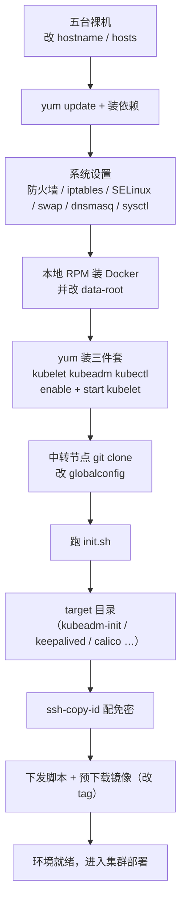

# 用 kubeadm 搭建高可用集群：实践环境准备全步骤

## 纲要

- 整体四步走：环境准备 → 高可用集群部署 → 集群可用性测试 → 部署 dashboard
- 版本与系统选型：CentOS 7.2、Kubernetes 1.11.x、etcd 3.2.18、Docker 17.03
- 五台机器：三台 master + 两台 worker，官方硬件底线是 2 核 2G
- host 名唯一、/etc/hosts 全互通，是所有节点都要做的一件事
- 安装依赖包后做系统设置：关防火墙、重置 iptables、禁 SELinux、禁 swap、关 dnsmasq、调 sysctl
- 装 Docker：官方源不稳，改用 RPM 包本地安装，并改 data-root 到空间大的目录
- 装三个工具：kubeadm、kubelet、kubectl，kubelet 先 enable 后启动，报错属正常
- 准备配置文件：一个中转节点 git clone 项目，改 globalconfig、跑 init 脚本出 target 目录
- 配免密登录，再预下载 master / worker 镜像并改 tag

## 整体路线：四步走

这一节开始用 kubeadm 去搭建 Kubernetes 的高可用集群。kubeadm 的搭建流程是严格按照官网的流程来的，但直接参照官网的话，很多过程里会有不太理解、或者根本没法进行下去的地方；另外没有科学上网的同学同样适用。

正是因为这个安装方式会一直保证 Kubernetes 用的是相对新的版本，所以后面涉及版本号的地方，都要能在配置文件里自己指定。

整个安装过程分为四步：

1. **实践环境的准备**
2. **高可用集群的部署**（最复杂、最长的一步）
3. 对集群可用性做一个测试
4. 最后部署一个 dashboard

其中最复杂的就是第二步，第一步（环境准备）和后面两步都比它简单。这一节只讲第一步：实践环境的准备。

## 版本与系统选型

- **操作系统**：CentOS 7.2（本环境）；这套教程在 Ubuntu 下也是可以用的，需要自己替换一些命令
- **Kubernetes**：最新可用的版本是 1.11.0 左右——注意它并不是实时跟进 Kubernetes 的最新版本。学习时如果发现 yum 源已经更新到 1.11.1 或更高，一样能用，只要在后面的配置文件里改版本号即可
- **etcd**：3.2.18，跟 Kubernetes 版本相匹配
- **Docker**：推荐版本 17.03；本环境用 17.03.1

## 五台机器的硬指标

Kubernetes 官方对硬件的要求是：**CPU 大于等于 2 核，内存大于等于 2G**。本环境五台机器都是实体机，内存和 CPU 都很大。

这里拿 **三个节点作为 master，两个节点作为 worker**：

- 搭建的是高可用集群，**一定要有三台 master 节点**
- worker 节点并不是严格限制的，只有一个 worker 节点也照样能用

| 角色 | 数量 | IP | hostname |
| --- | --- | --- | --- |
| master | 3 | 172.18.41.18 | k8s-master-18 |
| master | 3 | 172.18.41.19 | k8s-master-19 |
| master | 3 | 172.18.41.20 | k8s-master-20 |
| worker | 2 | 172.18.64.41 | k8s-worker-41 |
| worker | 2 | 172.18.64.42 | k8s-worker-42 |

后面演示切换机器时，为了不让看的人晕，先把这五台的连接关系说清楚。

## 第一步：五台机器上都要做的事

### 1. 改 hostname，保证每台的主机名不一样

新装的虚拟机可能都叫同一个固定名字（比如 ubuntu、centos），发现主机名都一样就改掉：

```bash
hostnamectl set-hostname k8s-master-18
# 其他几台分别改成自己的名字
```

### 2. 编辑 /etc/hosts，让节点之间可以通过主机名互相访问

这是**所有节点都要做**的一件事。每台 hostname 都对应一个 IP：

```text
172.18.41.18  k8s-master-18
172.18.41.19  k8s-master-19
172.18.41.20  k8s-master-20
172.18.64.41  k8s-worker-41
172.18.64.42  k8s-worker-42
```

这么多台机器逐台改很啰嗦，用支持级联 session 的终端工具（tmux 就可以做这种联动），在同一条命令会在当前所有会话里都执行一遍，改完保存就齐了。

### 3. 更新并安装依赖包

先 update 一下，再安装需要依赖的文件包。有的机器事先已经装好了，但还会有同学漏掉一些软件，所以要把所有节点跑一遍、确认都到齐了再进下一步。这一步耗时会比较长，耐心等。

### 4. 系统设置

```bash
# 关掉防火墙
systemctl stop firewalld && systemctl disable firewalld

# 重置 iptables 规则，只保留最原始的状态
iptables -F && iptables -X && iptables -Z

# 禁用 SELinux（Kubernetes 环境需要）
sed -i 's/^SELINUX=enforcing$/SELINUX=disabled/' /etc/selinux/config
setenforce 0

# 禁用 swap —— Kubernetes 是不允许 swap 存在的
swapoff -a
sed -i '/swap/d' /etc/fstab

# 关掉 dnsmasq 服务
systemctl stop dnsmasq && systemctl disable dnsmasq
```

### 5. 写系统参数文件并让它生效

把需要调优的 sysctl 参数写到一个文件里，然后 `sysctl --system` 让它生效。

### 6. 安装 Docker

因为用的是 kubeadm，所以 docker 是**每一个节点都必须有**的。

从 docker 官网下载 docker 最近网络很不稳定，有时很难下载成功，所以这里用 **RPM 包本地安装**的方式。先建一个目录，把 RPM 包下到这个目录，然后逐个检查是不是每一个都下载成功了。

```bash
mkdir -p /opt/docker-rpm && cd /opt/docker-rpm
# 下载 docker-ce 相关 RPM（yum --downloadonly 或下载离线包）
yum install -y *.rpm
systemctl enable docker

# 清理原有 docker（如果之前装过的话）
yum remove -y docker docker-client docker-common
```

装完后重新装一遍本地 RPM 包即可。

Docker 会占用很多磁盘空间（要下载镜像、存日志），所以得先看一看本地磁盘哪个挂载目录比较大、适合存储。默认它会存到 `/var/lib/docker`。本环境 `/data` 这个挂载空间比较大，就建一个 `/data/dockerdata` 存 docker 数据，并写进 docker 的配置文件：

```json
{
  "data-root": "/data/dockerdata",
  "registry-mirrors": ["https://<你的加速地址>.mirror.aliyuncs.com"],
  "exec-opts": ["native.cgroupdriver=systemd"],
  "log-driver": "json-file",
  "log-opts": {
    "max-size": "100m"
  }
}
```

> 注意把 `data-root` 替换成自己的目录；如果根目录本来就够用，这一步跳过也无所谓。

配置好之后启动 docker，验证没问题就进下一步。

### 7. 安装必要的工具：kubeadm、kubelet、kubectl

这三个命令用到的地方比较少，但一个都不能少：

- **kubeadm**：最重要的命令
- **kubelet**：会在每一台节点上都会运行
- **kubectl**：去控制和管理集群的工具

前两个以容器的方式运行相关组件需要事先准备二进制文件。安装方法两种：如果是科学上网，可以用官方 yum 源；如果是普通上网（本环境就是这样），就用下面的 yum 源（阿里云镜像源）。写 yum 源之后安装这三个工具，所有节点都装一遍：

```bash
cat > /etc/yum.repos.d/kubernetes.repo <<'EOF'
[kubernetes]
name=Kubernetes
baseurl=https://mirrors.aliyun.com/kubernetes/yum/repos/kubernetes-el7-x86_64
enabled=1
gpgcheck=0
EOF

yum install -y kubelet kubeadm kubectl
```

装完就可以先把 kubelet 给 enable 了，然后启动它：

```bash
systemctl enable kubelet
systemctl start kubelet
```

**kubelet 启动过程中会有问题，这是正常的**——等把其他组件（apiserver、etcd 等）搭好之后，它就会自动恢复。先把它拉起来就行。

## 第二步：准备配置文件

选任意一个节点作为**中转节点**，可以是这五个节点中的一个（也可以另开一台跳板机），主要作用是给其他节点发送、下发配置文件。

配置文件是用 git 来管理的，它并不会帮你自动化完成搭建过程，还是偏向原生——每一步都要自己来，它只是帮助减少一些机械化的、重复的工作。

在本环境选一台中间节点，先把级联的终端会话停掉，新建一个跳板机作为中间节点，建一个目录叫 `kubernetes`，关于 Kubernetes 的所有东西都在这个目录里做：

```bash
mkdir -p /opt/kubernetes && cd /opt/kubernetes
git clone <课程仓库地址> .
```

克隆下来看一下里面有什么东西，文件夹和文件都列出来了：

```text
/opt/kubernetes
├── plugins/              集群相关的插件，含 calico、dashboard 等等
├── config/               集群部署过程中用到的各种配置文件
├── script/               部署过程中用到的脚本，如预下载镜像、keepalived 检查脚本等
├── globalconfig          需要每个人去编写、更改的配置文件
├── init.sh               初始化脚本
└── README.md             说明文档
```

### 编辑 globalconfig

每一个选项上面都有注释说明。第一个是 kubernetes 的版本——因为是通过 yum 源安装的，它会不定期更新，需要先用 `kubeadm version` 去查一下当前源里的版本：

```bash
kubeadm version
# kubeadm version: v1.11.x
```

```text
##############################################################
# 1. Kubernetes 版本（yum 源不定期更新，用 kubeadm version 查）
##############################################################
KUBE_VERSION="v1.11.0"

##############################################################
# 2. Pod 网段：Pod 启动后分配 IP 地址所在的网段
#    一般使用 16 位掩码，前面两段固定，后两段动态生成
##############################################################
POD_NETWORK="172.22.0.0/16"

##############################################################
# 3. apiserver 虚拟 IP（集群对外统一的 apiserver 入口）
#    要跟具体网段一致，并且这个 IP 不能被占用
##############################################################
MASTER_VIP="172.18.41.100"

##############################################################
# 4. 三台 master 的 IP 与 hostname
##############################################################
MASTER_IPS=(172.18.41.18 172.18.41.19 172.18.41.20)
MASTER_HOSTNAMES=(k8s-master-18 k8s-master-19 k8s-master-20)

##############################################################
# 5. keepalived 使用的网卡接口
#    用 ip addr 看具体出口网卡，虚拟机一般是 eth0 或 ens33
##############################################################
VIP_IFACE="ens33"
```

### 执行 init 脚本生成配置

改完保存，执行 `init.sh` 初始化脚本，它就会帮我们自动生成需要的配置：

```bash
bash init.sh
```

- 最后会打印出「配置生成成功」
- 中间会打印出被替换的那些配置文件
- 最后会生成一个 **`target` 目录**，所有需要用到的配置文件都放在这儿了

```text
/opt/kubernetes/target
├── kubeadm-init.yaml          kubeadm 初始化配置
├── kube.sh                    master 组件安装脚本
├── worker.sh                  worker 加入脚本
├── keepalived/                keepalived 配置与检查脚本
├── nginx/                     四层负载均衡配置
├── calico.yaml                网络插件
└── dashboard/                dashboard 相关
```

这只是常见问题的一种组织方式，具体以你克隆下来的 target 为准。

## 第三步：免密登录

为了方便分发配置文件，中转节点访问其他机器都应该是免密登录的。

先看中转机器上是不是已经有 SSH 公钥，已经有了就直接复制；没有的话 `ssh-keygen` 一路回车生成一个：

```bash
ssh-keygen -t rsa -P "" -f /root/.ssh/id_rsa
# 然后把公钥内容追加到其他节点的信任 list 里
ssh-copy-id root@172.18.41.18
ssh-copy-id root@172.18.41.19
ssh-copy-id root@172.18.41.20
ssh-copy-id root@172.18.64.41
ssh-copy-id root@172.18.64.42
```

本环境这些节点用的都是 root 用户，公钥也是在 root 用户下设置的，所以用的时候直接 `ssh root@<ip>` 就不需要密码了——这就是免密登录配置是否正确的最直接验证。

## 第四步：预先下载镜像

如果科学上网，可以跳过这一步（能直接从 Google 的 hub 上自动下载）。不科学上网就得先预下载。

先把下载镜像的脚本传到 master 节点上：

```bash
scp -r /opt/kubernetes/script root@172.18.41.18:/root/
scp -r /opt/kubernetes/script root@172.18.41.19:/root/
scp -r /opt/kubernetes/script root@172.18.41.20:/root/
```

这个脚本做得很简单：从阿里云上把镜像下载下来，然后**重新打一个 tag**，打成正经的 Google 镜像 tag，再把前面那个带前缀的 tag 删掉。

执行一下，把 master 节点的镜像下下来，查一下已经下载了哪些：

```bash
bash script/pull-master-images.sh
docker images
```

然后下载 worker 节点的镜像——到中转机器 `root@172.18.64.41`、`.42` 这两台 worker 节点上也执行一遍。走阿里云源，下载速度还是挺快的。

镜像全部下载完，环境准备的最后一步就完事了，所有准备工作都做好了——下一节就开始部署集群本体。

## 环境准备的检查清单

| 环节 | 命令 / 动作 | 是否所有节点 |
| --- | --- | --- |
| 主机名唯一 | `hostnamectl set-hostname` | 是 |
| hosts 互通 | 编辑 `/etc/hosts` | 是 |
| 依赖包 | `yum update` + 装依赖 | 是 |
| 防火墙 | `systemctl stop/Disable firewalld` | 是 |
| iptables | `iptables -F -X -Z` 回到初始态 | 是 |
| SELinux | 改 config + `setenforce 0` | 是 |
| swap | `swapoff -a` + 删 fstab 条目 | 是 |
| dnsmasq | `systemctl stop/Disable dnsmasq` | 是 |
| 系统参数 | 写 sysctl 文件并生效 | 是 |
| Docker | RPM 本地安装 + `data-root` + 启动 | 是 |
| 三件套 | `yum install kubelet kubeadm kubectl` | 是 |
| kubelet 自启 | `systemctl enable kubelet` | 是 |
| 配置文件 | 中转节点改 globalconfig + 跑 init.sh | 仅中转节点 |
| 免密登录 | `ssh-keygen` + `ssh-copy-id` | 中转 → 其余 |
| 预下载镜像 | master / worker 两套脚本 | master / worker |

## 环境准备的整体链路

把上面这些步骤串起来，就是一条从「裸机」到「能下发的配置包」的流水线：



这条链路里唯一有「主次」之分的地方是：第 1~5 步五台机器**完全对称**，第 6 步之后只有中转节点在动，其余节点的配置全靠它分发。

## API 速览

| 能力 | 做法 | 说明 |
| --- | --- | --- |
| 改主机名 | `hostnamectl set-hostname <name>` | 静态 + 运行时一起改 |
| 看机器 IP 与网卡 | `ip addr` | 定 keepalived 网卡接口就靠它 |
| 看磁盘挂载 | `df -h` | 决定 docker 数据目录放哪 |
| 看 yum 源里的版本 | `kubeadm version` | 决定 globalconfig 里写哪个版本号 |
| 看 docker 数据目录 | `docker info \| grep "Docker Root Dir"` | 确认 data-root 是否生效 |
| 查镜像是否下全 | `docker images` | 对照脚本里的镜像列表逐个看 |
| 测免密 | `ssh root@<ip> date` | 不提示密码即成功 |
| 看 kubelet 为什么报错 | `journalctl -u kubelet -f` | 环境未就绪期的报错属正常 |

## Demo 示例

把上面这十几步收敛成一份可复制的执行清单，一台机器跑一遍，五台跑五遍。

第一步，主机层：

```bash
hostnamectl set-hostname k8s-master-18
cat >> /etc/hosts <<'EOF'
172.18.41.18 k8s-master-18
172.18.41.19 k8s-master-19
172.18.41.20 k8s-master-20
172.18.64.41 k8s-worker-41
172.18.64.42 k8s-worker-42
EOF
ping -c 1 k8s-master-19      # 主机名能解析即通
```

第二步，系统层：

```bash
iptables -F && iptables -X && iptables -Z
sed -i 's/^SELINUX=enforcing$/SELINUX=disabled/' /etc/selinux/config
setenforce 0
swapoff -a && sed -i '/swap/d' /etc/fstab
systemctl stop dnsmasq && systemctl disable dnsmasq
cat > /etc/sysctl.d/k8s.conf <<'EOF'
net.bridge.bridge-nf-call-iptables=1
net.bridge.bridge-nf-call-ip6tables=1
net.ipv4.ip_forward=1
EOF
sysctl --system
```

第三步，Docker 层：

```bash
mkdir -p /data/dockerdata
cat > /etc/docker/daemon.json <<'EOF'
{
  "data-root": "/data/dockerdata",
  "exec-opts": ["native.cgroupdriver=systemd"]
}
EOF
systemctl daemon-reload && systemctl restart docker
docker info | grep "Docker Root Dir"
# Docker Root Dir: /data/dockerdata
```

第四步，Kubernetes 三件套：

```bash
cat > /etc/yum.repos.d/kubernetes.repo <<'EOF'
[kubernetes]
name=Kubernetes
baseurl=https://mirrors.aliyun.com/kubernetes/yum/repos/kubernetes-el7-x86_64
enabled=1
gpgcheck=0
EOF
yum install -y kubelet kubeadm kubectl
systemctl enable kubelet && systemctl start kubelet
kubectl version
# 此时 kubelet 报错属正常，等控制面搭好自动恢复
```

第五步，中转节点上出配置：

```bash
cd /opt/kubernetes
vi globalconfig          # 改版本 / pod 网段 / 虚拟 IP / master 三台 / 网卡名
bash init.sh             # 末尾打印「配置生成成功」，生成 target 目录
ls target/
```

第六步，穷举验证：

```bash
ssh root@172.18.64.41 date    # 不输密码就出时间 = 免密 OK
docker images | wc -l         # master 镜像数量对得上
kubectl get nodes             # 环境还没就绪，报 connection refused 正常
```

### 总结

- 整体分四步：环境准备、高可用集群部署、集群可用性测试、部署 dashboard；其中最复杂最长的是第二步部署。
- 版本组合为 CentOS 7.2 + Kubernetes 1.11.x + etcd 3.2.18 + Docker 17.03，yum 源更新更快时只要改配置文件里的版本号即可。
- 五台机器三 master 两 worker，官方硬件底线 2 核 2G；高可用集群必须三台 master，worker 数量不强制。
- host 名唯一加 /etc/hosts 全互通是所有节点都要做的，可用 tmux 级联 session 一次改完。
- 系统设置五连：关防火墙、重置 iptables、禁 SELinux、禁 swap（Kubernetes 不允许）、关 dnsmasq，再统一写 sysctl 参数生效。
- Docker 用 RPM 本地安装更稳，并把 data-root 指到空间大的目录（如 /data/dockerdata），避免 /var/lib/docker 把根分区吃满。
- kubelet、kubeadm、kubectl 三件套全节点安装后先 enable 再 start，启动期报错是正常的，控制面就绪后自动恢复。
- 中转节点 git clone 项目、改 globalconfig（版本 / pod 网段 / apiserver 虚拟 IP / master 列表 / keepalived 网卡）、跑 init.sh 生成 target 目录，再配免密登录、预下载镜像改写 tag，环境准备才算收口。

