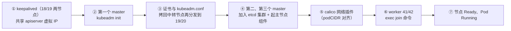

# 用 kubeadm 部署高可用集群：keepalived、etcd 集群、三 master 与 calico 落地

## 纲要

- 先部署 keepalived 做 apiserver 的高可用：两个 master 共享一个虚拟 IP
- keepalived 配置三件套：router_id、检查 apiserver 的脚本、优先级与网卡接口
- 检查脚本的判活逻辑：先查本地 6443，再查自己是否已持有 VIP
- 第一个 master：上传 kubeadm.conf 执行 init，记下最后打印的 join 命令
- 三个 master 的证书必须一模一样，先拷回中转节点再分发，并删掉多余的 apiserver、etcd 文件
- 第二、第三个 master 的脚本三段：keepalived 引导、加入 etcd 集群、部署主节点组件
- 装网络插件 calico，只改 podCIDR，与前面的网段定义对齐
- 用保存的 join 命令把两个 worker 加进来，节点全部 Ready、Pod 全部 Running

## 部署顺序总览

环境准备好之后，就开始部署高可用集群，整体顺序是这样的：



## 第一步：部署 keepalived

**keepalived 是用于 apiserver 的高可用的。** keepalived 一般是一主一备，它们共享一个虚拟 IP，所以任选两个 master 节点去安装 keepalived——本环境选前两个节点，18 和 19。

安装完 keepalived 就要配置它的配置文件。先创建好配置文件的目录，然后到中转节点把 keepalived 的配置文件分发过去。

先看清两份配置的差别：master 节点（172.18.41.18）是 MASTER，backup 节点（172.18.41.19）是 BACKUP，其余都一样。

### 检查脚本：判活逻辑

除了 keepalived 的配置文件，还需要一个检查 apiserver 是否正常、退出状态要给权重的脚本，两个节点上用的是同一个文件，改一下 IP 即可：

```bash
cat > /etc/keepalived/check_apiserver.sh <<'EOF'
#!/bin/bash
VIP=172.18.41.100
# 1. 先看本地 6443 通不通，不通就直接异常退出
curl -k --connect-timeout 2 -m 3 https://127.0.0.1:6443/healthz -o /dev/null 2>&1
if [ $? -ne 0 ]; then
  exit 1
fi
# 2. 如果本节点已经持有这个 VIP，再检查 VIP 本身是否正常
#    不正常说明自己已经不具备持有这个 IP 的能力了，异常退出让出 VIP
if ip addr | grep -q "$VIP"; then
  curl -k --connect-timeout 2 -m 3 https://${VIP}:6443/healthz -o /dev/null 2>&1
  if [ $? -ne 0 ]; then
    exit 1
  fi
fi
exit 0
EOF
chmod +x /etc/keepalived/check_apiserver.sh
```

### 主节点配置

```text
/etc/keepalived/
├── keepalived.conf          主备都有，只有 state / priority 不同
└── check_apiserver.sh       同一个脚本，只改里面的 VIP/IP
```

主节点 `keepalived.conf` 关键内容：

```text
global_defs {
  router_id k8s-master-18
}

vrrp_script chk_apiserver {
  script "/etc/keepalived/check_apiserver.sh"
  interval 3
  weight -2
  fall 2
  rise 2
}

vrrp_instance VI_1 {
  state MASTER
  interface ens33
  virtual_router_id 64
  priority 100
  advert_int 1
  authentication {
    auth_type PASS
    auth_pass 1111
  }
  virtual_ipaddress {
    172.18.41.100
  }
  track_script {
    chk_apiserver
  }
}
```

backup 节点除了 `router_id`（与主节点不同）、`state BACKUP`、`priority 99` 之外，其它完全一致——`priority` 自己定义的一个值，主节点上优先级要比备节点高。

### 启动与验证

分别在主节点和备节点上启动 keepalived，检查状态是 running，再看日志：

```bash
systemctl enable --now keepalived
systemctl status keepalived
tail -f /var/log/messages
```

日志里脚本退出状态不正常是**预期之内**的——因为这时候 apiserver 还没在上面跑。

再看看虚拟 IP 是不是已经有了：主节点上虚拟 IP 已经绑定到这个 master 节点，备节点上肯定没有。ping 一下这个虚拟 IP 是可以通得，相当于拼到了本机 apiserver。

```bash
ip addr | grep 172.18.41.100      # 只在 MASTER 上出现
ping 172.18.41.100
```

## 第二步：初始化第一个 master

给第一个主节点上传生成的配置文件 `kubeadm.conf`（从 target 目录取），然后到主节点上去执行 `kubeadm init`。

先看这个配置文件，能改的主要是这几项：

- **版本**：要装哪个 Kubernetes 版本
- **apiserver 的虚拟 IP**：apiserver 通过虚拟 IP + 端口访问的方式
- **etcd 的各种监听地址**：2379、2380，还有它的 hostname
- **Pod CIDR**：Pod 网段

```yaml
apiVersion: kubeadm.k8s.io/v1beta1
kind: InitConfiguration
kubernetesVersion: v1.11.0
controlPlaneEndpoint: 172.18.41.100:6443
apiServer:
  certSANs:
    - 172.18.41.100
---
apiVersion: kubeadm.k8s.io/v1beta1
kind: ClusterConfiguration
etcd:
  local:
    dataDir: /var/lib/etcd
networking:
  podSubnet: 172.22.0.0/16
```

`controlPlaneEndpoint` 指向前面 keepalived 的虚拟 IP，这就是这一整套高可用设计的**收口点**：三个 master 的 apiserver 都挂在这个 VIP 后面。

然后执行：

```bash
kubeadm init --config kubeadm.conf
```

所有的工作都是它自动完成的，只需要等一会儿——如果没有预先下载镜像，这个地方等待的时间会比较长。看到最后一行：

```text
You can now join any number of machines by running the following on each node as root:
kubeadm join 172.18.41.100:6443 --token xxxxxx.yyyyyyy --discovery-token-ca-cert-hash sha256:zzzz...
```

就说明当前这个节点已经初始化完成了。**把这条 join 命令记下来保存好**，一会儿加入节点的时候要用。

接着配置 kubectl。新建一个目录，把 kubeadm 生成的 admin.conf 移到默认位置：

```bash
mkdir -p /root/.kube
mv /etc/kubernetes/admin.conf /root/.kube/config
kubectl get pods
```

这时候 `get pods` 已经可以工作了，但 DNS（coredns）是 Pending 状态，其它都正常——因为 DNS 是要运行在**工作节点（worker）**上的，而现在还没有一个 worker。

## 第三步：把配置拷给第二、第三个 master

在配置另外两个 master 节点之前，需要拷贝一些配置：三个节点有一些配置必须一模一样，不能各自生成——毕竟它们要组成一个集群，比如**它们的证书必须是一样的，才能互相信任、互相通讯**。

这里的做法：先在中转节点上，把第一个 master 节点上的配置文件拷到中转节点，再由中转节点拷到另外两个节点（如果中转节点就是主节点，可以直接拷到另外两个主节点）。

```bash
# 在主节点上把 pki 相关目录打包拷回中转节点
scp -r root@172.18.41.18:/etc/kubernetes/pki /opt/kubernetes/pki
scp root@172.18.41.18:/etc/kubernetes/admin.conf .
```

拷贝完要**删掉多余的文件**，因为列表里除了这些文件并不需要那些多余的：

- 把 apiserver 的东西删掉
- 把 kube-proxy 的删掉
- 把 etcd 没用的删掉

```bash
cd /opt/kubernetes/pki
rm -f apiserver.* kube-proxy.*
rm -rf /opt/kubernetes/pki/etcd
```

然后分别把下载下来的这些文件分发到另外两个 master 节点：

```bash
scp -r /opt/kubernetes/pki root@172.18.41.19:/etc/kubernetes/
scp -r /opt/kubernetes/pki root@172.18.41.20:/etc/kubernetes/
mkdir -p /root/.kube
scp root@172.18.41.18:/etc/kubernetes/admin.conf root@172.18.41.19:/root/.kube/config
scp root@172.18.41.18:/etc/kubernetes/admin.conf root@172.18.41.20:/root/.kube/config
```

还有一个文件需要拷贝：**每个节点对应的 `kubeadm.conf`**，这个文件每个主节点都是有一点区别的，要写上对应的 IP（19 对应 19，20 对应 20），**不要忘了把前面的目录名也改成对应节点**，因为它每一个节点都不一样。

```bash
scp /opt/kubernetes/target/kubeadm-19.conf root@172.18.41.19:/root/kubeadm.conf
scp /opt/kubernetes/target/kubeadm-20.conf root@172.18.41.20:/root/kubeadm.conf
```

## 第四步：部署第二个 master

上传一个 master 节点的部署脚本到第二个 master（172.18.41.19），然后运行这个脚本。脚本分三部分：

- **第一部分**：keepalived 的一些引导配置——这些脚本在官方文档上都有，这里主要是做了一个整合，并没有任何修改
- **第二部分**：**加入 etcd 集群**——因为之前的 etcd 只有一个节点，现在要再加入一个节点进去，通过一些命令组合成两个 etcd 的集群
- **第三部分**：部署主节点相关的组件

```bash
bash master-join.sh
```

有类似的输出，就说明安装过程应该是正常的。稍等一会儿看这个节点的端口监听情况：

```bash
netstat -lntup | grep -E "6443|2379|2380"
```

```text
tcp  0  0 172.18.41.19:6443   0.0.0.0:*   LISTEN  12345/kube-apiserver
tcp  0  0 172.18.41.19:2379   0.0.0.0:*   LISTEN  12987/etcd
tcp  0  0 172.18.41.19:2380   0.0.0.0:*   LISTEN  12987/etcd
tcp  0  0 127.0.0.1:10252     0.0.0.0:*   LISTEN  13001/kube-controller-manager
tcp  0  0 127.0.0.1:10251     0.0.0.0:*   LISTEN  13005/kube-scheduler
```

6443（apiserver）、2379/2380（etcd）、还有 10252/10251 的 controller-manager 和 scheduler，说明这些服务都已经正常启动了。

再用 kubectl 看相关的容器，看是不是起了很多个容器；看日志确认系统有没有问题——这时候会看到「**已经有一个 new newiconfig 还没初始化**」，这是因为还没有部署 CNI（网络）插件，属于正常。

如果想在这个节点上使用 kubectl，可以做个可选操作：把 admin.conf 放到 kubectl 默认的配置文件位置，试一下能正常用。

## 第五步：部署第三个 master

一样先上传第三个节点的初始化脚本（20）。可以看到这个脚本跟第二个节点的脚本是**一样的**，除了它们的 IP 地址、hostname，还有 ETCD 这个配置有区别之外，其它都是一样的——这块 etcd 相当于在现有的两个 etcd 集群基础上再增加一个，就变成三个 etcd 集群了。

```bash
bash master-join.sh
```

同样用 `netstat` 看端口，`ps` 看进程，看日志也是一样（还是 CNI 未初始化的提示）。这样三个主节点就都部署完了。

## 第六步：部署网络插件 calico

接下来部署网络插件，先安 calico。在有 kubectl 的节点上随便找一个目录创建一个，然后在中转节点把 calico 的配置文件传上去（也可以在官方下载，跟这里是完全一样的，这里只是帮大家把里边的 **podCIDR** 改掉了，别的没有区别）。

```bash
mkdir -p /opt/calico && cd /opt/calico
# 上传 calico.yaml（podCIDR 已对齐成 172.22.0.0/16）
kubectl apply -f calico.yaml
```

稍等一会儿看 calico 的 Pod 状态——还没有完全运行起来，因为它还缺 worker 节点，calico 也需要运行在 worker 节点上。

## 第七步：加入 worker 节点

加入 worker 节点非常简单：把刚才保存的 join 命令拿出来，到 worker 节点上去执行，41 和 42 都执行一下：

```bash
kubeadm join 172.18.41.100:6443 --token xxxxxx.yyyyyyy \
  --discovery-token-ca-cert-hash sha256:zzzz...
```

注意这个 join 指向的是 **VIP 172.18.41.100**，不是某一个 master 的 IP——这正是前面 keepalived 的意义所在。

执行完在 master 上看节点是不是被加进去了：

```bash
kubectl get nodes
```

```text
NAME            STATUS     ROLES    AGE     VERSION
k8s-master-18   Ready      master   12m     v1.11.0
k8s-master-19   Ready      master   6m      v1.11.0
k8s-master-20   Ready      master   3m      v1.11.0
k8s-worker-41   NotReady   <none>   20s     v1.11.0
k8s-worker-42   NotReady   <none>   10s     v1.11.0
```

两个节点都加完之后：

```bash
kubectl get nodes
```

```text
NAME            STATUS   ROLES    AGE   VERSION
k8s-master-18   Ready    master   13m   v1.11.0
k8s-master-19   Ready    master   7m    v1.11.0
k8s-master-20   Ready    master   4m    v1.11.0
k8s-worker-41   Ready    <none>   1m    v1.11.0
k8s-worker-42   Ready    <none>   40s   v1.11.0
```

节点都正常了，再去看 calico：

```bash
kubectl get pods -A -o wide
```

```text
NAMESPACE     NAME                                       READY   STATUS    RESTARTS   AGE
kube-system   calico-kube-controllers-6bf8b9d9f4-5xk7p   1/1     Running   0          5m
kube-system   calico-node-9d4vf                          1/1     Running   0          4m
kube-system   calico-node-t2lrq                          1/1     Running   0          4m
kube-system   calico-node-wm8xz                          1/1     Running   0          4m
kube-system   calico-node-zx7hp                          1/1     Running   0          4m
kube-system   coredns-78fdfcd8f4-4zt5d                   1/1     Running   0          13m
kube-system   coredns-78fdfcd8f4-pq6bn                   1/1     Running   0          13m
kube-system   kube-proxy-7p4qj                           1/1     Running   0          5m
...
```

这一次所有 Pod 都处于 Running 并且 Ready 状态了，说明集群应该是没有什么问题了。

## 三个 master 各自承担什么

| 阶段 | 18（首个 master） | 19 | 20 |
| --- | --- | --- | --- |
| keepalived | MASTER，priority 100 | BACKUP，priority 99 | 不装 |
| kubeadm | `init` 建集群 | `join` / 脚本加入 | `join` / 脚本加入 |
| etcd | 第 1 个成员 | 第 2 个成员 | 第 3 个成员 |
| apiserver | 有 | 有 | 有 |
| kubectl | 可用（admin.conf） | 可用（拷贝 admin.conf） | 可用（拷贝 admin.conf） |

三个 etcd + 三个 apiserver 前面顶一个 VIP，这就是 apiserver 高可用的全部秘密；剩下的 scheduler 与 controller-manager 靠 leader election 在同一时刻只有一个在工作。

## API 速览

| 能力 | 做法 | 说明 |
| --- | --- | --- |
| 看虚拟 IP 落在谁身上 | `ip addr \| grep <VIP>` | 只在一台 master 上出现即正常 |
| 测 VIP 连通 | `ping <VIP>` / `curl -k https://<VIP>:6443/healthz` | 虚拟 IP 拼到的就是本机 apiserver |
| 看 apiserver 端口 | `netstat -lntup \| grep 6443` | 三台 master 都要有 |
| 看 etcd 成员 | `etcdctl cluster-health` / `member list` | 三成员健康才算高可用 |
| 初始化控制面 | `kubeadm init --config kubeadm.conf` | 只能在第一个 master 上跑一次 |
| 看 join 命令输出 | `kubeadm init` 尾部打印 | 保存起来给 worker 和其余 master 用 |
| 看节点状态 | `kubectl get nodes` | NotReady 通常是 CNI 没装 |
| 看全集群 Pod | `kubectl get pods -A -o wide` | 全 Running Ready 才是真就绪 |
| 装网络插件 | `kubectl apply -f calico.yaml` | podCIDR 要和 kubeadm.conf 一致 |

## Demo 示例

把最关键的三段现场复现一遍：keepalived 起来 → init 成功 → 其余节点加入。

**第一段：keepalived 主备**

```bash
# 主节点（18）
cat > /etc/keepalived/keepalived.conf <<'EOF'
global_defs {
  router_id k8s-master-18
}
vrrp_script chk_apiserver {
  script "/etc/keepalived/check_apiserver.sh"
  interval 3
  weight -2
  fall 2
  rise 2
}
vrrp_instance VI_1 {
  state MASTER
  interface ens33
  virtual_router_id 64
  priority 100
  advert_int 1
  authentication { auth_type PASS; auth_pass 1111 }
  virtual_ipaddress { 172.18.41.100 }
  track_script { chk_apiserver }
}
EOF
systemctl enable --now keepalived

# 备节点（19）只改三处：router_id、state、priority
ip addr | grep 172.18.41.100 && echo "VIP 在 MASTER 上"
ping -c 1 172.18.41.100 && echo "虚拟 IP 可达"
```

**第二段：第一个 master 初始化**

```bash
kubeadm init --config kubeadm.conf 2>&1 | tee /tmp/init.log
mkdir -p /root/.kube
cp /etc/kubernetes/admin.conf /root/.kube/config
# 记下日志最后那行 join 命令
grep -A2 "you can now join" /tmp/init.log

kubectl get nodes          # 只有 master，worker 未加入
kubectl get pods -n kube-system
# coredns-xxx   0/1  Pending   ← 等 worker
```

**第三段：其余 master 与 worker 加入**

```bash
# 第三个 etcd 成员就绪后
kubectl get nodes
NAME            STATUS    ROLES    AGE   VERSION
k8s-master-18   Ready     master   13m   v1.11.0
k8s-master-19   Ready     master   7m    v1.11.0
k8s-master-20   Ready     master   4m    v1.11.0
k8s-worker-41   NotReady  <none>   20s   v1.11.0

# worker 41 / 42 各自执行保存下来的 join
kubeadm join 172.18.41.100:6443 --token xxxxxx.yyyyyyy \
  --discovery-token-ca-cert-hash sha256:zzzz...

kubectl get nodes
# 全部 Ready，calico-node 覆盖到每一个节点
kubectl get pods -A | grep -c Running    # 数量随节点增长
```

整个过程中，需要我们人工去处理的地方其实不多——通过 kubeadm 的方式搭建这个集群还是非常方便的，速度也是很快的。

### 总结

- keepalived 负责 apiserver 的高可用：两个 master 一主一备共享虚拟 IP，本环境由 18 主、19 备，VIP 是 172.18.41.100。
- keepalived 配置的核心是 vrrp_script（每 3 秒跑一次检查脚本、返回非零权重减 2）+ priority 主 100 备 99 + interface 与 virtual_router_id 主备一致。
- 检查脚本的判活有两层：先查本机 6443，若自己已持有 VIP 再查 VIP 本身；不通过就退出让位，这套逻辑才是 VIP 能自动漂移的前提。
- 第一个 master 用 kubeadm.conf 执行 init，配置里最关键的是 controlPlaneEndpoint（指向 VIP）、etcd 监听地址、podCIDR；init 成功后立刻保存尾部打印的 join 命令。
- 三个 master 的证书必须完全一致，做法是从第一个 master 把 pki 拷回中转节点、删掉多余的 apiserver/kube-proxy/etcd 文件后再分发，admin.conf 单独拷到各节点 ~/.kube/config。
- kubeadm.conf 每个节点不同（IP、hostname、目录名），第二第三个 master 各配一份；部署脚本内部分三段：keepalived 引导、加入 etcd 集群、部署主节点组件。
- 网络插件 calico 只需改 podCIDR 与 kubeadm.conf 对齐后 apply；它必须覆盖到所有 worker，worker 没进来时 Pod 起不全属正常。
- worker 直接用保存的 join 命令加入（指向 VIP），三个 master、两个 worker 全部 Ready 后，所有 Pod Running / Ready，集群才算真正可用——下一节验证集群是否完全正常。

