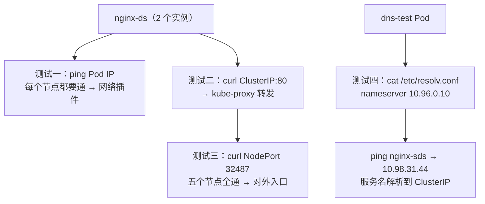

# 集群可用性测试：Pod 网络、Service、NodePort 与 DNS 四项验证

## 纲要

- 部署完高可用集群，得证明它真的可用：四项测试串起来
- 建一个 nginx 的 DaemonSet：两个节点就自然跑出两个实例
- 配一个 NodePort 类型的 Service，端口 80 对应容器 80
- 测试一：在每个节点上 ping Pod IP，通了说明网络层没问题
- 测试二：ServiceIP + ServicePort 访问，直接返回 nginx 首页
- 测试三：NodePort 从每个节点都访问一遍
- 测试四：exec 进 Pod 看 /etc/resolv.conf，再 ping 服务名解析到 ClusterIP
- 四项全过，集群才算真正可用

## 测试素材：一个 DaemonSet + 一个 NodePort Service

集群部署完了，这一节就来测试这个集群是不是正常的。首先创建一个 nginx 的 DS（DaemonSet）配置，把它写进一个配置文件里跑起来。

DaemonSet 的定义很简单：Service 类型用 NodePort，端口是 80（对应容器的 80），下面定义一个 `nginx-ds`，使用的镜像是 `nginx:1.17.9`，容器端口 80。

```yaml
apiVersion: apps/v1
kind: DaemonSet
metadata:
  name: nginx-ds
  labels:
    app: nginx-ds
spec:
  selector:
    matchLabels:
      app: nginx-ds
  template:
    metadata:
      labels:
        app: nginx-ds
    spec:
      containers:
        - name: nginx
          image: nginx:1.17.9
          ports:
            - containerPort: 80
```

配合上面的 Service：

```yaml
apiVersion: v1
kind: Service
metadata:
  name: nginx-sds
spec:
  type: NodePort
  selector:
    app: nginx-ds
  ports:
    - port: 80
      targetPort: 80
      protocol: TCP
```

建进来之后用它来检查 Pod IP 是否可以访问。因为是 DS 类型，目前有两个节点，它就会存在两个实例：

```bash
kubectl apply -f nginx-ds.yaml -f nginx-svc.yaml
kubectl get pods -o wide
```

```text
NAME           READY   STATUS    RESTARTS   AGE   IP             NODE
nginx-ds-abcde 1/1     Running   0          30s   172.22.1.7     k8s-master-18
nginx-ds-bcdef 1/1     Running   0          30s   172.22.3.11    k8s-worker-41
```

## 测试一：Pod IP 在各节点互通

已经运行起来了，可以看到 Pod 的 IP。在**每一个节点上**都去 ping 一下这个 IP，看看是不是能拼通：

```bash
ping -c 2 172.22.1.7
# 三个主节点上：可以拼得通
# worker 节点上：也可以拼得通
```

三个主节点上可以拼得通，节点上也可以拼得通，说明网络层（calico 铺开的 Pod 网络）是没有问题的。

## 测试二：ServiceIP + ServicePort 访问

再检查一下 Service 是否可访问。看 Service 有一个 `nginx-sds`，先通过 **ServiceIP + ServicePort** 的方式去访问一下：

```bash
kubectl get svc nginx-sds
# NAME         TYPE       CLUSTER-IP     EXTERNAL-IP   PORT(S)        AGE
# nginx-sds    NodePort   10.98.31.44   <none>        80:32487/TCP   1m

curl http://10.98.31.44:80
```

```html
<!DOCTYPE html>
<html>
<head><title>Welcome to nginx!</title></head>
<body><h1>Welcome to nginx!</h1></body>
</html>
```

直接返回了 nginx 的首页，说明 Service 转发链路（kube-proxy + iptables/IPVS 规则）是通的。

## 测试三：NodePort 在每个节点都可用

再检查一下 NodePort。NodePort 怎么用来检查？先看当前节点——本环境是 172.18.41.18，NodePort 是随机生成的 **32487**：

```bash
curl http://172.18.41.18:32487
```

也返回了 nginx 首页。再看看其他节点——19 也可以返回；worker 节点 41 和 42 也都可以访问，NodePort 也没有问题。

```text
curl http://172.18.41.19:32487   → 200 nginx 首页
curl http://172.18.64.41:32487   → 200 nginx 首页
curl http://172.18.64.42:32487   → 200 nginx 首页
```

NodePort 能在全部五个节点上访问，意味着集群外的客户端只要能连到任意一个节点，就有入口可用。

## 测试四：DNS 解析

最后检查一下 DNS。需要再去创建一个单独的 Pod，运行也是 nginx 1.17.9、端口 80，它只是简单地运行了一个 Pod。把这个 Pod 跑起来，使用 `kubectl exec` 命令进入到运行的 Pod 里面。

```bash
kubectl run dns-test --image=nginx:1.17.9 --port=80
kubectl exec -it dns-test -- sh
```

在这个 Pod 里先看 DNS 配置 `/etc/resolv.conf`：

```text
nameserver 10.96.0.10
search default.svc.cluster.local svc.cluster.local cluster.local
options ndots:5
```

`nameserver` 是 10.96.0.10，就是 DNS 的服务地址，下面这些名字都没有问题，DNS 是正常的。

然后再 ping 一下之前创建的这个 `nginx-sds` 服务：

```bash
ping nginx-sds
# PING nginx-sds.default.svc.cluster.local (10.98.31.44) 56(84) bytes of data.
```

能访问到，解析出来的 IP 是 10.98.31.44——这就是前面 `kubectl get svc` 里看到的 ClusterIP。也就是说，**服务名被正确解析到了 ClusterIP 上，说明 DNS 解析是正常的**。

四项测试做完，之前搭建的这个 Kubernetes 集群是处于可用状态的。

## 四项测试各自在验什么



| 测试项 | 命令 | 通过标准 | 主要在验 |
| --- | --- | --- | --- |
| Pod 网络 | `ping <pod-ip>` | 五个节点全通 | calico 网络插件、CNI |
| Service 访问 | `curl <cluster-ip>:80` | 返回 nginx 首页 | kube-proxy 转发规则 |
| NodePort | `curl <node-ip>:32487` | 五个节点全通 | 集群外入口是否可用 |
| DNS 解析 | `ping nginx-sds` | 解析到 ClusterIP | CoreDNS、Service  discovery |

## 一张集群可达性目录树

这四项测试覆盖的路径，在集群拓扑里是这样的：

```text
集群（5 节点）
├── k8s-master-18 (172.18.41.18)
│   ├── Pod nginx-ds-abcde  172.22.1.7     ← ping 通
│   ├── NodePort 32487                     ← curl 通
│   └── ClusterIP 10.98.31.44              ← curl 通
├── k8s-master-19 (172.18.41.19)
│   ├── Pod nginx-ds-xxxxx  172.22.2.x
│   └── NodePort 32487                     ← curl 通
├── k8s-master-20 (172.18.41.20)
│   └── NodePort 32487                     ← curl 通
├── k8s-worker-41 (172.18.64.41)
│   ├── Pod nginx-ds-bcdef  172.22.3.11    ← ping 通
│   └── NodePort 32487                     ← curl 通
├── k8s-worker-42 (172.18.64.42)
│   └── NodePort 32487                     ← curl 通
└── kube-dns (10.96.0.10)
    └── 解析 nginx-sds → 10.98.31.44        ← ping 通
```

## API 速览

| 能力 | 做法 | 说明 |
| --- | --- | --- |
| 看 DS 在几个节点铺了几份 | `kubectl get pods -o wide` | DS 的节点数 = 实例数 |
| 看 Pod IP | `kubectl get pods -o wide` | 后面 ping 的就是这一列 |
| 看 Service 的 ClusterIP 与 NodePort | `kubectl get svc -o wide` | 第三列 80:32487/TCP 就是它 |
| 从集群内访问 Service | `curl http://<cluster-ip>:<port>` | 走 kube-proxy 转发 |
| 从外部访问 Service | `curl http://<node-ip>:<nodePort>` | 任意节点都行 |
| 进 Pod 里看 DNS | `kubectl exec -it <pod> -- cat /etc/resolv.conf` | nameserver 就是 CoreDNS 地址 |
| 测服务名解析 | `kubectl exec -it <pod> -- ping <service-name>` | 解析到 ClusterIP 即正常 |
| 起一个测试用 Pod | `kubectl run dns-test --image=nginx --port=80` | 临时验证 DNS 很方便 |

## Demo 示例

把四项测试按顺序跑完，一次得出「集群是否可用」的结论。

第一步，起服务：

```bash
kubectl apply -f nginx-ds.yaml -f nginx-svc.yaml
kubectl get pods -o wide
kubectl get svc nginx-sds
```

第二步，测 Pod 网络（在每个节点上换 IP 跑）：

```bash
POD_IP=$(kubectl get pod -l app=nginx-ds -o jsonpath='{.items[0].status.podIP}')
for n in 172.18.41.18 172.18.41.19 172.18.41.20 172.18.64.41 172.18.64.42; do
  ssh root@$n "ping -c 1 $POD_IP" ;
done
# 五台全部 0% packet loss
```

第三步，测 ClusterIP 与 NodePort：

```bash
SVC_IP=$(kubectl get svc nginx-sds -o jsonpath='{.spec.clusterIP}')
NP=$(kubectl get svc nginx-sds -o jsonpath='{.spec.ports[0].nodePort}')
echo "ClusterIP=$SVC_IP  NodePort=$NP"

# 下面命令中的变量按你的集群环境赋值后再执行
curl -s http://$SVC_IP:80 | grep "$TITLE"
# <title>Welcome to nginx!</title>

for n in 172.18.41.18 172.18.41.19 172.18.41.20 172.18.64.41 172.18.64.42; do
  echo -n "$n -> "; curl -s -o /dev/null -w "%{http_code}\n" http://$n:$NP
done
# 172.18.41.18 -> 200
# 172.18.41.19 -> 200
# 172.18.41.20 -> 200
# 172.18.64.41 -> 200
# 172.18.64.42 -> 200
```

第四步，测 DNS：

```bash
kubectl run dns-test --image=nginx:1.17.9 --port=80 --restart=Never
kubectl exec dns-test -- cat /etc/resolv.conf
# nameserver 10.96.0.10
# search default.svc.cluster.local svc.cluster.local cluster.local

kubectl exec dns-test -- ping -c 1 nginx-sds
# PING nginx-sds.default.svc.cluster.local (10.98.31.44) 56(84) bytes of data.
```

第五步，收尾：

```bash
kubectl delete -f nginx-ds.yaml -f nginx-svc.yaml
kubectl delete pod dns-test
```

四项都过了，这个集群就是可用状态——Pod 网络通、Service 转发通、NodePort 入口通、DNS 解析通，缺任何一项都说明对应那一层有问题，得回头查网络插件或 CoreDNS。

### 总结

- DaemonSet 是按节点铺的：两个节点就自然跑两个实例，比 Deployment 更适合作网络探针这类常驻组件。
- 测试一验证 Pod 网络：在全部五个节点上 ping Pod IP 都通，说明 calico 与 CNI 配置是生效的。
- 测试二验证 Service：用 ClusterIP + 端口访问能拿到 nginx 首页，证明 kube-proxy 的转发规则已下发。
- 测试三验证 NodePort 入口：随机分配的 32487 在五个节点上都能访问，外部客户端连任意节点都有入口。
- 测试四验证 DNS：进 Pod 看 /etc/resolv.conf 拿到 nameserver 10.96.0.10，ping 服务名能解析到 ClusterIP 10.98.31.44。
- 四项测试对应集群里四条互不相交的路径（网络插件 / kube-proxy / 对外入口 / CoreDNS），任何一条不通都说明那一层没配好。
- 全部通过之后的结论很朴素：这个 Kubernetes 集群处于可用状态，可以开始往里跑真实业务了。

