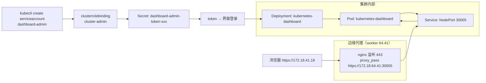

# 部署 Dashboard：创建 Token 登录、nginx 代理打通 HTTPS 访问

## 纲要

- Dashboard 也是以部署组件的方式在 Kubernetes 里跑起来，配置从官方拿，不做修改
- 传到 18 节点的 install 目录，创建各类服务组件
- 验证三连：Deployment available=1、Pod Running、Service 端口 30005
- Dashboard 从 1.7 之后只允许通过 HTTPS 访问，NodePort 暴露后需要 nodeIP + nodePort
- 用 IP 直接访问会报证书不信任；有证书可注入 Secret 让 Dashboard 走正规 HTTPS
- 端口被防火墙挡住时，用一个 nginx 监听 443 反代到 NodePort 30005
- Token 登录：建 ServiceAccount + 绑 cluster-admin + 取 Secret 里的 token
- 登录后的首页表现、为什么没有 CPU/内存图表（heapster 已被放弃，方向转向 Prometheus）

## 把 Dashboard 部署起来

最后一部分部署 Dashboard。Dashboard 也是通过在 Kubernetes 里边去部署组件的方式去运行，一样是先把这个 Dashboard 的配置传到对应的节点（传到中转节点，再到 18 上操作），传到它的 install 目录里边，然后创建对应的各种各样的服务组件。

这个配置也是从官方拿过来的，不做任何修改。

```bash
# 在中转节点把 dashboard 相关 yaml 传到 18 的 install 目录
scp -r dashboard root@172.18.41.18:/opt/install/

# 到 18 上创建
kubectl apply -f /opt/install/dashboard/
```

然后用这个命令去查看 dashboard 是不是起来了：

```bash
kubectl get deploy -n kube-system
# NAME                    DESIRED   CURRENT   UP-TO-DATE   AVAILABLE   AGE
# kubernetes-dashboard    1         1         1            1           1m
```

available 等于 1，已经起来了。再看一下对应的 Pod，处于 Running 状态，没有问题。然后看看对应的 Service，也已经有了，端口是 **30005**——这个端口是事先写在 Dashboard 配置文件里的，想配置其他的端口需要自己改一下。

```bash
kubectl get pods -n kube-system | grep dashboard
# kubernetes-dashboard-5c478c8b7f-2xk9p   1/1     Running   0   1m

kubectl get svc -n kube-system
# kubernetes-dashboard   type: NodePort   CLUSTER-IP 10.98.x.x   PORT(S) 443/TCP, 30005/TCP
```

NodePort 端口也已经正常了，Dashboard 的运行没问题。

## 怎么访问：NodePort + HTTPS

好了之后就可以访问。Dashboard 从 **1.7 之后，就是只允许通过 HTTPS 去访问的**。这里使用了 NodePort 的方式去暴露这个服务，所以可以用 **nodeIP + nodePort** 的方式去访问 Dashboard。

当然这个访问过程中肯定会报一个 HTTPS 证书不信任这样的问题——因为用的是 IP，并且也没配置证书。如果有域名、并且这个域名对应的证书有，可以自己去修改 Dashboard 的配置，把安全证书加进去。

Dashboard 启动参数中可以给它指定证书，这个证书文件就是通过 **Secret** 注入进来的，配置格式如下（注意不要有换行）：

```yaml
apiVersion: v1
kind: Pod            # 实际由 Dashboard Deployment 承载
metadata:
  name: kubernetes-dashboard
  namespace: kube-system
spec:
  containers:
    - name: kubernetes-dashboard
      image: k8s.gcr.io/kubernetes-dashboard/amd64:v1.10.1
      args:
        - --tls-cert-file=/etc/dashboard/dashboard.crt
        - --tls-key-file=/etc/dashboard/dashboard.key
```

指定的 `dashboard.crt` 和 `dashboard.key` 这两个文件是从 Secret 里边读进来的。可以通过 Dashboard 的配置文件去查它依赖的 Secret，然后在 Secret 里边把这两个文件名和文件内容都写进去，就可以通过正规的 HTTPS 方式去访问了。

## 端口被挡时的绕行：nginx 反代 443

本环境比较特殊：对外只能访问 80 端口，这个 30005 端口是被防火墙挡住的。所以准备了一个 nginx，在 nginx 里做了一个代理转发，把它配到 64.41 这个第一个 worker 节点上——nginx 监听 443，相当于把 443 的流量直接转发到这个 worker 节点的 30005 上，然后启动（通过 docker 来启动）。

```nginx
server {
    listen 443 ssl;
    server_name _;

    ssl_certificate     /usr/local/nginx/conf/cert/dashboard.crt;
    ssl_certificate_key /usr/local/nginx/conf/cert/dashboard.key;

    location / {
        proxy_pass https://172.18.64.41:30005;
        proxy_set_header Host $host;
        proxy_set_header X-Forwarded-Proto https;
        proxy_ssl_verify off;
    }
}
```

```bash
docker run -d --name dashboard-proxy \
  -p 443:443 \
  -v /opt/nginx/conf:/usr/local/nginx/conf \
  -v /opt/nginx/cert:/usr/local/nginx/conf/cert \
  --restart=always nginx
```

然后怎么访问？直接通过 HTTPS 访问这个地址就可以了：

```bash
curl -k https://172.18.41.18 -o /dev/null -w "%{http_code}\n"
```

浏览器里信任一下，就看到了登录的界面。

## Token 登录

登录界面选择**令牌（token）登录**。Dashboard 默认只支持 token 登录，所以使用 kubeconfig 配置文件时也一样，需要在这个文件中指定一个 token。

这里的主要任务就是去创建一个这样的 token：

**第一步，先创建一个 ServiceAccount：**

```bash
kubectl create serviceaccount dashboard-admin -n kube-system
```

**第二步，给这个 ServiceAccount 绑定一个角色——clusteradmin 集群管理员**（这是默认就存在的角色）：

```bash
kubectl create clusterrolebinding dashboard-admin \
  --clusterrole=cluster-admin \
  --serviceaccount=kube-system:dashboard-admin
```

**第三步，查看 dashboard-admin 的 Secret，查一下它的名字，并且赋给一个变量：**

```bash
kubectl -n kube-system get secret | grep dashboard-admin
# dashboard-admin-token-xxxxx   kubernetes.io/service-account-token   ...

SECRET=$(kubectl -n kube-system get secret | grep dashboard-admin | awk '{print $1}')
```

**第四步，describe 一下这个 Secret，把 token 部分打印出来：**

```bash
kubectl describe secret $SECRET -n kube-system
```

这条命令看起来稍微有些复杂，也可以直接手写前面这部分然后找到它的 token 复制出来；下面这个命令只是把 `<none>` 那么多信息过滤掉了，直接打印出来一个 token，然后用这个 token 去登录：

```bash
kubectl -n kube-system get secret $SECRET -o jsonpath='{.data.token}' | base64 -d
```

## 登录之后能看到什么

放大一点，可以看到默认显示的是 **default 命名空间**。

它的概况里有些地方会显示 CPU、内存的一些资源使用情况，这儿是没有的——如果要展示这部分内容，需要去部署一个叫 **heapster** 的东西，但目前 heapster 已经几乎被 Kubernetes 放弃了，主要工作方向已经转向 Prometheus 方向，所以也没有必要去纠结这个问题。

可以看到运行了哪些 Pod、运行了 replicaset 容器组、有哪些服务、有哪些 secret，还可以点进去到具体的 Pod 里边，看到这个 Pod 的详细信息、当前的状态，还有它发生的事件。

还有一个非常好的地方：可以点击进去**进入到容器的内部**（exec），可以看到容器里边的所有东西——只是这个容器里没有 ps 命令。进到这里面去非常方便，排障时不用另外起调试容器。

Dashboard 具体功能也不少，使用方法就是在界面上点点按按，可以自己摸索一下。这里的主要目的就是把它部署起来、让它可用，关键时刻可以用来方便维护容器系统。

## 部署与访问的两条路径



## API 速览

| 能力 | 做法 | 说明 |
| --- | --- | --- |
| 部署 Dashboard | `kubectl apply -f dashboard/` | 官方配置，原样用 |
| 看 Deployment 是否就绪 | `kubectl get deploy -n kube-system` | AVAILABLE 列等于 1 才算起 |
| 看 Dashboard 端口 | `kubectl get svc -n kube-system` | 443 转发到对外 30005 |
| 建登录账户 | `kubectl create serviceaccount dashboard-admin -n kube-system` | 放 kube-system 下是常用做法 |
| 给管理员权限 | `kubectl create clusterrolebinding ... --clusterrole=cluster-admin` | cluster-admin 是内置角色 |
| 取 token | `kubectl -n kube-system get secret <name> -o jsonpath='{.data.token}' \| base64 -d` | 一行直接出 token |
| 指定 HTTPS 证书 | `--tls-cert-file` / `--tls-key-file` + Secret 挂载 | Dashboard 1.7 起强制 HTTPS |
| 端口被防火墙挡 | nginx 443 反代到 NodePort | 本环境 30005 不可达的绕行方案 |

## Demo 示例

把「部署 → 出端口 → 打通访问 → 取 token → 登录」这条链路一次跑完。

第一步，部署：

```bash
kubectl apply -f /opt/install/dashboard/
kubectl get deploy,pods,svc -n kube-system | grep -i dashboard
# kubernetes-dashboard   1/1   1/1   1/1   1        Running   0   50s
# kubernetes-dashboard   NodePort    10.98.x.x   <none>   443:30005/TCP   50s
```

第二步，本环境用 nginx 反代（30005 被防火墙挡）：

```bash
cat > /opt/nginx/conf/conf.d/dashboard.conf <<'EOF'
server {
    listen 443 ssl;
    server_name _;
    ssl_certificate     /usr/local/nginx/conf/cert/dashboard.crt;
    ssl_certificate_key /usr/local/nginx/conf/cert/dashboard.key;
    location / {
        proxy_pass https://172.18.64.41:30005;
        proxy_ssl_verify off;
    }
}
EOF
docker exec -it dashboard-proxy nginx -s reload
curl -k https://172.18.41.18 -o /dev/null -w "%{http_code}\n"
# 200
```

第三步，生成 token：

```bash
kubectl create serviceaccount dashboard-admin -n kube-system
kubectl create clusterrolebinding dashboard-admin \
  --clusterrole=cluster-admin \
  --serviceaccount=kube-system:dashboard-admin

SECRET=$(kubectl -n kube-system get secret | grep dashboard-admin | awk '{print $1}')
TOKEN=$(kubectl -n kube-system get secret $SECRET -o jsonpath='{.data.token}' | base64 -d)
echo $TOKEN
```

第四步，浏览器登录：打开 `https://172.18.41.18` → 直接选「令牌」→ 把上面这串 token 粘进去 → 登录。

第五步，进去后看一眼：

```text
Dashboard 首页
├── 默认命名空间：default
├── 概况：Pod / ReplicaSet / Service / Secret 列表   （无 CPU 内存图，需 heapster）
├── 点进 Pod：详细信息 + 当前状态 + Events
└── 容器 exec：可直接进到容器内部（该容器内无 ps 命令）
```

到这儿，使用 kubeadm 搭建高可用集群这一部分就全部完成了。

### 总结

- Dashboard 以普通组件方式部署，官方 yaml 原样 apply 即可，验证点就是 Deployment AVAILABLE=1、Pod Running、Service 端口 30005。
- Dashboard 1.7 之后强制 HTTPS，只能走 HTTPS 访问；用 NodePort 暴露后是 nodeIP + nodePort，直接拿 IP 访问必然报证书不信任。
- 想让 HTTPS 正规可用，就给 Dashboard 加 `--tls-cert-file` / `--tls-key-file` 启动参数，证书文件通过 Secret 挂载进来。
- 30005 被防火墙挡住时，在 worker 节点用一个 nginx 监听 443、反代到本机的 30005，浏览器再访问 nginx 那台机器的 443 即可。
- Token 登录三步走：建 ServiceAccount → 用 clusterrolebinding 绑定内置 cluster-admin → 从对应 Secret 的 `.data.token` base64 解码取 token。
- 登录后默认看 default 命名空间，能看到 Pod、ReplicaSet、Service、Secret 列表，能点进 Pod 看详情与事件，还能 exec 进容器（部分容器里没有 ps）。
- 首页看不到 CPU / 内存图表是因为没装 heapster，而 heapster 已被 Kubernetes 放弃、官方方向转向 Prometheus，不必为此纠结。
- 至此「用 kubeadm 搭建高可用集群」全流程收尾：环境准备 → 高可用部署 → 可用性测试 → Dashboard，四步全部跑通。

