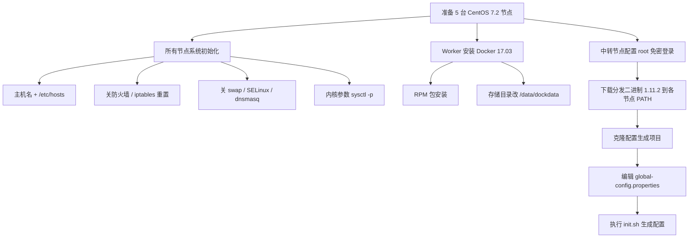

# 二进制高可用集群部署（上）：实践环境准备

## 纲要

- 本章用**二进制方式**部署高可用集群，与前面 kubeadm 方案互补，目标是帮你生成配置/脚本而非全自动部署
- 节点规划：5 台 CentOS 7.2，3 台 master + 2 台 worker；master 必须是 3 台才能高可用
- 所有节点系统初始化：主机名与 hosts、关防火墙、iptables 重置、关 swap/SELinux/dnsmasq、内核参数
- Worker 节点单独装 Docker 17.03（RPM 包方式），并把存储目录改到空间充足的 `/data/dockdata`
- 选一个中转节点，配置 root 免密登录到全部节点，用于后续文件分发
- 下载并分发 K8s 1.11.2 二进制文件到各节点，写入 PATH
- 克隆配置生成项目，编辑 `global-config.properties`（master IP、VIP、CIDR、NodePort 范围等），执行 `init.sh` 生成配置

## 为什么还要讲二进制部署

上一章我们用 kubeadm 这种方式安装了 Kubernetes 的高可用集群；本章换一种方式——**二进制方式**部署高可用集群。课程配套有一个专门做二进制部署的开源项目，它的目的**不是**帮你自动完成系统部署，而是帮你生成集群部署过程中用到的各种配置和脚本，尽量减少重复的繁琐工作；至于这些配置和脚本怎么用，每一步都需要你亲自操作。

软件版本方面：系统用 CentOS 7.2（Ubuntu 也可，但部分命令需自行替换）；Kubernetes 采用当时最新的 **1.11.2**，etcd、Docker、Calico 都对应这个 K8s 版本（小版本以官方推荐为准）。整个安装教程分四步：实践环境准备 → 高可用集群部署（最复杂的一步）→ 集群测试验证 → 部署 Dashboard。

环境准备阶段的工作可以串成下面这条流水线，每一步都依赖前一步打好底：



## 节点规划

演示用 5 台实体机，系统 CentOS 7.2：

| 角色 | 数量 | 说明 |
| --- | --- | --- |
| master | 3 台 | 高可用要求，必须是奇数 3 台 |
| worker | 2 台 | 非硬性要求两台，1 台也行，多台更佳 |
| 中转节点 | 1 台 | 可集群内也可集群外，用于文件分发 |

官方推荐硬件：CPU ≥ 2 核，内存 ≥ 2G。每台机器的 IP 与主机名都列出来，是为了演示时能清楚知道操作的是哪台机（比如 `41.18.19.20` 是三台主节点，`64.41` 和 `42` 是两个 worker）。

## 所有节点系统初始化

以下设置 master 与 worker 都需要做：

1. **主机名（hostname）**：每台必须唯一且各不相同；若用 Ubuntu 装虚拟机，默认都叫 `ubuntu` 需要改。用 `hostnamectl set-hostname` 修改，并保证各节点之间能通过 hostname 互访——即配置好 `/etc/hosts`。
2. **更新软件源并装必要包**：`yum update` 后统一安装（演示环境用了终端工具的级联执行，一条命令在全部节点跑一遍）。
3. **防火墙与 iptables**：关闭所有机器防火墙，重置 iptables，清空后只留默认三条链全部 ACCEPT。
4. **关闭 swap**：这是 Kubernetes 的硬性要求，不支持 swap；同时让 swap 不开机自启。
5. **关闭 SELinux、关闭 dnsmasq**。
6. **内核参数**：写好 sysctl 配置文件，再 `sysctl -p` 使其生效（这些是 K8s 运行所需的参数，如 bridge-nf 等，建议实测以官方文档为准）。

## Worker 单独安装 Docker

Docker 只需要在 **worker 节点**安装，master 都是用二进制服务方式启动，不需要 Docker。版本选 **17.03**（官方做过兼容性测试）。由于 Docker 官网访问慢、常下载不动，推荐用**原生 RPM 包安装**：

- 先建目录并关闭部分源，在两个 worker 节点分别下载 3 个 RPM 包
- 安装前清理可能已存在的旧 Docker，再分别安装并设开机自启
- Docker 镜像和日志占用磁盘大，先看本机哪个目录空间充足，把它作为存储目录。演示环境根目录 `/var/lib/docker` 只有 100G，而 `/data` 挂载了近 1T，于是把存储改到 `/data/dockdata`：

```bash
# 创建存储目录（两台 worker 都做）
mkdir -p /data/dockdata

# 修改 docker 启动参数，把 graph（数据根目录）指过去
# 17.03 用 graph 字段；较新版本用 data-root，建议以官方文档为准
```

- 启动并确认 `docker` 服务起来（`systemctl start docker && systemctl enable docker`）。

## 中转节点与免密登录

为方便文件互传，选一个**中转节点**（集群内或集群外均可），在该节点配置到其余 5 台节点的 root 免密登录：

```bash
# 本地若没有公钥就生成（一路回车）
ssh-keygen -t rsa -P "" -f ~/.ssh/id_rsa

# 把公钥内容贴到每台目标机的 authorized_keys
# 即执行：把 id_rsa.pub 追加到 ~/.ssh/authorized_keys
ssh-copy-id root@<目标IP>
```

> 注意用户名用 `root`，因为其他节点的 home 目录就是 root 的 home 目录，免密登录也用 root。配完后随便连一台验证不用输密码即可。

## 下载分发二进制文件

二进制文件可从官网下载，也可从整理好的网盘下载（官网目录零散、需逐个找，网盘里是规整的 1.11.2 版本）。下载后解压，目录里有两个子目录：

- `master/`：给 master 节点用的二进制（kube-apiserver、kube-scheduler、kube-controller-manager、kubectl 等）
- `worker/`：给 worker 节点用的（kubelet、kube-proxy 等）

在各节点创建存放目录，从中转节点用 `scp` 把 master 文件拷到 3 台 master、worker 文件拷到 2 台 worker；然后给每个节点把该目录写入 `PATH`，重新登录后即可访问命令。

## 配置生成项目与 global-config.properties

二进制部署用到的配置文件很多，课程配套一个专门项目帮大家生成配置。克隆后目录结构大致如下：

```dir
k8s-binary-ha
├── 节点规划
│   ├── master-0/1/2  (3 台, 如 41.18.19.20)
│   └── worker-0/1    (2 台, 如 64.41 / 42)
├── 系统初始化（全节点）
│   ├── hostname + /etc/hosts
│   ├── 防火墙 / iptables 重置
│   ├── 关 swap / SELinux / dnsmasq
│   └── sysctl 内核参数
├── 中转节点
│   ├── root 免密登录（ssh-copy-id）
│   └── 分发 1.11.2 二进制到各节点 PATH
└── 配置生成项目
    ├── addons/      (calico, coredns, dashboard 等插件)
    ├── pki/         (认证授权相关证书配置)
    ├── service/     (各组件 systemd 单元文件)
    ├── global-config.properties  (每人需自行编辑)
    └── init.sh      (执行后生成到 target/ 目录)
```

进入项目编辑 `global-config.properties`，关键项包括：

| 配置项 | 取值 / 说明 |
| --- | --- |
| master 节点 IP | 3 个，对应 master0/1/2 |
| master 主机名 | master0/1/2 |
| apiserver 虚拟 IP（VIP） | keepalived 生成的虚拟 IP，必须通过它访问 apiserver；**必须是未被占用的 IP**，否则冲突 |
| keepalived 网卡接口 | 演示环境叫 `bond1`，常见是 `eth0`，用 `ip a` 查当前 IP 绑在哪个出口 |
| worker 节点 IP 列表 | 可 1 个、2 个甚至 10 个 |
| service CIDR | 默认 `10.96.0.0/12`，演示用 `10.254.0.0/16` |
| DNS 服务 IP | 一般取 CIDR 内第二个，演示 `10.254.0.2` |
| pod CIDR | 演示 `172.22.0.0/16`，只要未被占用的内网网段即可 |
| NodePort 范围 | 演示 `8400-8900`（仅预留 500 个端口） |

> 这个配置文件**一定要配对**：任何一处错误都可能导致后面部署出现各种奇怪问题。配完后执行 `init.sh`，输出类似「配置生成成功，生成到 target 目录」，即可看到生成的全部 Kubernetes 相关配置。若执行过程有问题，项目里也列了常见问题的对照说明。

## 总结

- 二进制部署与 kubeadm 互补：前者帮你生成配置/脚本、每一步手动操作以吃透原理，基于 K8s 1.11.2 + CentOS 7.2。
- 节点规划是高可用的根基：master 必须 3 台，worker 数量灵活；每台 IP/主机名都记清楚便于对照操作。
- 系统初始化是「全员动作」：唯一主机名 + hosts、关防火墙、iptables 重置、关 swap/SELinux/dnsmasq、内核参数生效，任何一步漏了都可能埋坑。
- Docker 只装 worker，且因磁盘占用大要把存储目录改到空间充足的路径（17.03 用 `graph` 字段，新版本用 `data-root`，以官方文档为准）。
- 中转节点 + root 免密登录 + 二进制分发到 PATH，是后续所有拷贝动作的前置；配置生成项目用 `global-config.properties` 集中描述环境，配错即全盘皆输，配完跑 `init.sh` 拿到正式配置。
