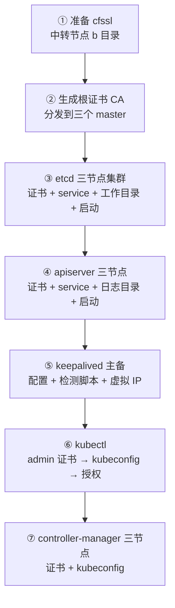

# 二进制高可用集群部署（上）：cfssl 签 CA、etcd 三节点、apiserver、keepalived 与 kubectl

## 纲要

- 环境准备完成后进入部署：先解决证书问题，工具是 cfssl
- 在中转节点准备 cfssl 二进制：下到 b 目录、改可执行、进 PATH
- 生成根证书 CA，把 CA 证书与密钥分发到三个 master
- 部署 etcd 高可用集群：三台 master 各跑一个成员，证书之外还要配 service 与工作目录
- etcd 三台同时启动组成集群，先看配置再启动，避免后面难查
- 部署 apiserver：三节点各一份，证书 + service + 日志目录，启动后验 6443
- keepalived 一主一备做 apiserver 高可用，检测脚本每 3 秒跑一次、权重减 2
- 虚拟 IP 上 curl 返回「未授权」，说明链路通了、只差认证
- 部署 kubectl：admin 证书 → kubeconfig → 分发 → 补 exec/run 所需权限
- 部署 controller-manager：三节点部署，靠选举产生 leader

## 部署顺序

上一节完成了实践环境的准备，这一节就开始高可用集群的部署。二进制方式的部署顺序是按依赖一字排开的：



## 第一步：准备 CA 工具 cfssl

第一步先解决证书的问题。有一个工具非常好用，叫 **cfssl**，是一个 CA 工具。先把它准备好，同样是在中转节点去部署：在中转节点创建一个 `b` 目录，然后把它下载到这个 `b` 目录里面去，改一下文件权限为可执行，再设一下环境变量，把这个目录加进 PATH。

```bash
mkdir -p /opt/kubernetes/b && cd /opt/kubernetes/b
wget https://pkg.cfssl.org/$(uname -s | tr '[:upper:]' '[:lower:]')/cfssl_1.6.4_$( \
  if [ "$(uname -m)" = "x86_64" ]; then echo amd64; else echo arm; fi) -O cfssl
wget .../cfssljson_1.6.4_... -O cfssljson
chmod +x cfssl cfssljson
export PATH=$PATH:/opt/kubernetes/b
cfssl version
```

cfssl 可以运行，就说明准备好了。

## 第二步：生成根证书并分发

去到刚才那个配置的目录（target/pki 目录下都是证书），用 cfssl 生成 CA 的根证书：

```bash
cd /opt/kubernetes/target/pki
cat > ca-config.json <<'EOF'
{
  "signing": {
    "default": { "expiry": "87600h" },
    "profiles": {
      "kubernetes": {
        "expiry": "87600h",
        "usages": ["signing", "key encipherment", "server auth", "client auth"]
      }
    }
  }
}
EOF

cat > ca-csr.json <<'EOF'
{
  "CN": "kubernetes-ca",
  "key": { "algo": "rsa", "size": 2048 },
  "names": [{ "C": "CN", "L": "Beijing", "O": "kubernetes" }]
}
EOF

cfssl gencert -initca ca-csr.json | cfssljson -bare ca
ls ca*
# ca.csr  ca-key.pem  ca.pem
```

通过 CA 的配置生成了 **CA 证书和 CA 的密钥**。得去主节点上创建目录（三个主节点都建），然后把证书文件分发到每一个 master 节点上（中转节点 18、19、20 三个主节点）：

```bash
for n in 18 19 20; do
  ssh root@172.18.41.$n "mkdir -p /opt/kubernetes/cert /etc/etcd/ssl"
  scp /opt/kubernetes/target/pki/ca.pem root@172.18.41.$n:/opt/kubernetes/cert/
done
```

## 第三步：部署 etcd 高可用集群

接下来开始部署 etcd 的高可用集群。把 etcd 部署在**三台 master 节点**上。

首先要有 etcd 的二进制文件。如果是在官网下载的二进制，可能需要自己单独下载 etcd；如果用的是已经准备好的二进制文件包，就不需要再下载了——里面已经包含了 etcd。

然后只需要去生成 etcd 的证书和私钥：到 `pki/etcd` 下边，根据刚才生成的根证书，还有 etcd 的证书配置文件去生成 etcd 的证书和私钥，然后把它们分发给每个 etcd 节点（其实就是三个 master 节点，18、19、20）。

```bash
cd /opt/kubernetes/target/pki/etcd
cfssl gencert -ca=/opt/kubernetes/cert/ca.pem \
  -ca-key=/opt/kubernetes/cert/ca-key.pem \
  -config=ca-config.json -profile=kubernetes \
  etcd-csr.json | cfssljson -bare etcd
# 生成 etcd.pem / etcd-key.pem，分发到三个 master 的 /etc/etcd/ssl
```

然后是 etcd 的系统服务配置。把 etcd 的 service 文件拷贝到每个 master 节点的 systemd 配置目录（在 target 目录下执行拷过来的那个文件），把 `nodeIP` 设成 172.18.41.18 作为第一个。

```ini
# /usr/lib/systemd/system/etcd.service（三份，只改 name / 本机地址 / initial-cluster 地址）
[Unit]
Description=Etcd Server
After=network.target

[Service]
Type=notify
WorkingDirectory=/var/lib/etcd
ExecStart=/opt/kubernetes/bin/etcd \
  --name=etcd-18 \
  --cert-file=/etc/etcd/ssl/etcd.pem \
  --key-file=/etc/etcd/ssl/etcd-key.pem \
  --trusted-ca-file=/opt/kubernetes/cert/ca.pem \
  --peer-cert-file=/etc/etcd/ssl/etcd.pem \
  --peer-key-file=/etc/etcd/ssl/etcd-key.pem \
  --peer-trusted-ca-file=/opt/kubernetes/cert/ca.pem \
  --listen-peer-urls=https://172.18.41.18:2380 \
  --initial-advertise-peer-urls=https://172.18.41.18:2380 \
  --listen-client-urls=https://172.18.41.18:2379,https://127.0.0.1:2379 \
  --advertise-client-urls=https://172.18.41.18:2379 \
  --initial-cluster-token=etcd-cluster-0 \
  --initial-cluster=etcd-18=https://172.18.41.18:2380, \
                    etcd-19=https://172.18.41.19:2380, \
                    etcd-20=https://172.18.41.20:2380 \
  --initial-cluster-state=new
Restart=on-failure
RestartSec=5
LimitNOFILE=65536

[Install]
WantedBy=multi-user.target
```

启动 etcd 服务之前，ETCD 运行的前提是要事先创建一下它的**工作目录**——到主节点上去创建。创建好之后就可以启动 etcd 服务了；启动服务之前先看一下配置是不是正确的，以免后续出问题：hostname 已经是正确的了，监听地址没有问题都替换过来了，还有 etcd 集群里 18 的 hostname 对应地址、19 的、20 的都没有问题。这一配置项对的话，后边就不会有什么问题，然后三台同时启动，组成一个三节点的 etcd 集群。

```bash
systemctl daemon-reload && systemctl enable etcd && systemctl start etcd
```

分别查看一下 etcd 的状态，然后再看一下日志，看有没有异常：

```bash
systemctl status etcd
journalctl -u etcd -f
```

看起来没什么问题、没有什么异常的日志，etcd 集群就部署完了。

```bash
ETCDCTL_API=3 etcdctl \
  --cacert=/opt/kubernetes/cert/ca.pem \
  --cert=/etc/etcd/ssl/etcd.pem --key=/etc/etcd/ssl/etcd-key.pem \
  endpoint health
# 172.18.41.18:2379 is healthy: took 2.1ms
```

## 第四步：部署 apiserver

下一个是 apiserver，也是一样：三个节点分别在三台 master 上运行。

先回到中转节点，第一步还是去生成这个证书和私钥——到 apiserver 的证书配置的地方，用之前生成的根证书 CA 去生成 apiserver 的证书，然后把它们分发到每个 master 节点上。为了方便，可以用编辑器把三份都编辑好然后一块儿运行。

**这一步用户名别忘了改成 root。**

下一步就是创建 service，把 service 拷贝到对应的节点上（同样的，三个主节点的 service 都要改对应 IP）。然后创建一下 apiserver 的日志目录，直接到主节点上去分别创建。

```ini
# /usr/lib/systemd/system/kube-apiserver.service（三份，改 --advertise-address 与 etcd 端点）
[Unit]
Description=Kubernetes API Server
After=network.target

[Service]
ExecStart=/opt/kubernetes/bin/kube-apiserver \
  --admission-control=ServiceAccount \
  --advertise-address=172.18.41.18 \
  --bind-address=0.0.0.0 \
  --insecure-bind-address=127.0.0.1 \
  --insecure-port=8080 \
  --secure-port=6443 \
  --etcd-servers=https://172.18.41.18:2379,https://172.18.41.19:2379,https://172.18.41.20:2379 \
  --service-cluster-ip-range=10.254.0.0/16 \
  --service-node-port-range=30000-50000 \
  --tls-cert-file=/opt/kubernetes/cert/apiserver.pem \
  --tls-private-key-file=/opt/kubernetes/cert/apiserver-key.pem \
  --client-ca-file=/opt/kubernetes/cert/ca.pem \
  --service-account-key-file=/opt/kubernetes/cert/sa.pub \
  --log-dir=/opt/kubernetes/logs/apiserver
Restart=on-failure
RestartSec=5

[Install]
WantedBy=multi-user.target
```

下一步就是启动服务，也是一样；启动之前抽查一个 service 配置（比如 `kube-apiserver.service`），看看里面这些易变化的值——IP 啊、端口啊，是不是事先定义的那个集群。配置没问题就挨个启动一下。

```bash
systemctl daemon-reload && systemctl enable kube-apiserver && systemctl start kube-apiserver
```

apiserver 启动的可能会稍微慢一些，要等一小会儿。写完看状态是 running（可能第一次还没正常启动完成，稍微再看一会儿就正常了）。再看监听的端口是不是都在：6443，顺便也看 2379 和 2380—etcd 的端口也都在。apiserver 就部署完成了。

```bash
netstat -lntup | grep -E "6443|2379|2380"
# 6443（apiserver）、2379 / 2380（etcd）
```

## 第五步：部署 keepalived

下一个组件是 keepalived，就是 apiserver 的一个高可用的组件。keepalived 一般有两个节点就够了，一主一备，任意选择两个节点来做，这里选前两个节点 18 和 19。

安装完成之后，给 keepalived 创建一个目录（配置文件的目录），然后把 keepalived 的配置文件拷过去——到中转节点拷贝：这个是 keepalived master，用 18 作为它的 master 节点；下一个是 backup，用 19 作为备节点。拷贝完这个配置文件之后，它**还依赖一个检测脚本**，再把这个检测脚本分别拷到主节点和备节点上（18 和 19，两个节点上都是一样的）。

检测的逻辑：首先去检查本机的 6443 是不是存在，如果不存在就直接错误退出，说明当前本机的 apiserver 不可用；如果本机 apiserver 可用，它再去通过 `ip addr` 看一下当前的虚拟 IP 是不是绑到了本机；如果绑到了，就再检查一下这个虚拟 IP 的 6443 是不是可用；如果不可用，说明本机出问题了。

```bash
cat > /etc/keepalived/check_apiserver.sh <<'EOF'
#!/bin/bash
VIP=172.18.41.14
curl -k --connect-timeout 2 -m 3 https://127.0.0.1:6443/healthz -o /dev/null 2>&1
[ $? -ne 0 ] && exit 1
ip addr | grep -q "$VIP"
if [ $? -eq 0 ]; then
  curl -k --connect-timeout 2 -m 3 https://${VIP}:6443/healthz -o /dev/null 2>&1
  [ $? -ne 0 ] && exit 1
fi
exit 0
EOF
chmod +x /etc/keepalived/check_apiserver.sh
```

然后启动 keepalived。启动之前先检查一下 `/etc/keepalived/keepalived.conf` 的全局配置：script 是 `checkAPIserver`（第二个拷过去的检测脚本，检测 apiserver 是不是可用），**每隔三秒检测一次**，如果不可用的话**权重减二**；它的 state 是 master；interface 是定义的那个网卡接口；`router_id` 是我们自己定义的一个值，必须保证整个 keepalived 集群是一致的；priority 的优先级主节点定义为 100；虚拟 IP 替换过来的是配置里配的那个虚拟 IP。

```text
/etc/keepalived/
├── keepalived.conf     master（18）与 backup（19）两份
│                       只差 router_id / state / priority
└── check_apiserver.sh  检测脚本，主备同一份
```

然后先启动主节点的 keepalived，再启动备节点的，用 systemctl 查一下状态，看一下日志没有什么错误值。然后可以访问一下这个虚拟 IP 是不是可访问的——虚拟 IP 配置的是 172.18.41.14，访问返回结果说「**未授权**」，这个是 apiserver 返回的内容（说明链路通了，只是还没认证）；再看 `ip addr`，网卡上已经有这个虚拟 IP 了，说明虚拟 IP 已经生效、绑定在主节点 18 上面，keepalived 就安装完了。

```bash
curl -k https://172.18.41.14:6443/version
# {"kind":"Status","apiVersion":"v1","status":"Failure", ... "reason":"Unauthorized"}
ip addr | grep 172.18.41.14      # 只在 18 上出现
```

## 第六步：部署 kubectl（控制节点）

下一个要部署的是控制节点。kubectl 可以装到任意一台机器上，它是创建集群的一个命令行工具，默认它会从这个目录去读取 apiserver 相关的访问方法，包括 apiserver 的地址、证书、用户名等等信息。

首先创建一个 admin 的证书和私钥（apiserver 对这个证书进行认证授权）。还是到中转机器、到证书的配置目录，去生成这个 admin 证书。生成证书之后，利用这个证书去创建 kubeconfig 这个配置文件——就是我们刚才说的 kubectl 依赖的那个访问 apiserver 的配置文件。

这个过程就是：**不断给这个配置文件写入访问 apiserver 的信息**——先设置集群的参数（这里改一下 VIP 的地址，172.18.41.14，也是在中转节点去运行），然后继续设置客户端的认证参数，包括它的证书，设置上下文。

```bash
# 1. 先造 admin 证书
cd /opt/kubernetes/target/pki
cfssl gencert -ca=/opt/kubernetes/cert/ca.pem \
  -ca-key=/opt/kubernetes/cert/ca-key.pem -config=ca-config.json \
  -profile=kubernetes admin-csr.json | cfssljson -bare admin

# 2. 再拼 kubeconfig（每步都是往一个文件里追加配置段）
kubectl config set-cluster kubernetes \
  --certificate-authority=/opt/kubernetes/cert/ca.pem \
  --embed-certs=true --server=https://172.18.41.14:6443 --kubeconfig=/opt/kubernetes/cfg/admin.kubeconfig

kubectl config set-credentials admin \
  --client-certificate=/opt/kubernetes/cert/admin.pem \
  --client-key=/opt/kubernetes/cert/admin-key.pem \
  --embed-certs=true --kubeconfig=/opt/kubernetes/cfg/admin.kubeconfig

kubectl config set-context kubernetes \
  --cluster=kubernetes --user=admin --kubeconfig=/opt/kubernetes/cfg/admin.kubeconfig

kubectl config use-context kubernetes --kubeconfig=/opt/kubernetes/cfg/admin.kubeconfig
```

然后把创建的文件分发到想要拥有 kubectl 这个命令的节点上——分发到第一个主节点 18。先到 18 上去创建一下 `~/.kube` 目录，再把 admin.kubeconfig 拷过去。

拷贝过去之后，还要**授予这个证书访问 kube 的 API 的权限**——它在执行 `kubectl exec`、`run` 等等命令的时候会需要用到这样的权限。创建一个角色绑定：

```bash
kubectl create clusterrolebinding kube-apiserver \
  --clusterrole=cluster-admin --user=kubernetes-admin
```

这同样也证明了 kubectl 是可以用的：

```bash
kubectl cluster-info
# Kubernetes master is running at https://172.18.41.14:6443
kubectl get all
# NAME             TYPE        CLUSTER-IP   EXTERNAL-IP   PORT(S)   AGE
# service/kubernetes   ClusterIP   10.254.0.1   <none>       443/TCP   2m
```

当前的 master 是运行在这个虚拟 IP 上；现在的所有的东西就只有一个 service（default 命名空间），它的 clusterIP 是事先定义好的 10.254 网段的第一个 IP，10.254.0.1。还可以 `get componentstatus` 看当前的组件状态——etcd 是正常的，scheduler 和 controller-manager 目前是未访问的（还没部署）。

```bash
kubectl get componentstatuses
# NAME                 STATUS      MESSAGE
# scheduler            Unavailable
# controller-manager   Unavailable
# etcd-0               Healthy     {"health":"true"}
# etcd-1               Healthy     {"health":"true"}
# etcd-2               Healthy     {"health":"true"}
```

## 第七步：部署 controller-manager

下面去部署 controller-manager，也是在三个主节点上分别部署。**它启动后会通过选举机制产生一个 leader，其他节点就处于阻塞状态；当这个 leader 不可用的时候，剩余的节点再次选举产生一个新的 leader，从而保证了服务的高可用。** 这也是二进制方式下控制面高可用的典型形态。

首先是创建证书和私钥，套路跟前面都是一样的：到中转节点创建证书和私钥，然后分发到每一个 master 节点上。然后创建 controller-manager 的 kubeconfig，用来访问 apiserver——跟之前创建 kubectl 那个是类似的（master 地址指向 VIP），最终也是创建出来这么一个配置文件，对它进行各种各样的设置。

```bash
# 证书 → kubeconfig（server 指向 VIP，别写成某一台 master 的 IP）
kubectl config set-cluster kubernetes \
  --server=https://172.18.41.14:6443 \
  --certificate-authority=/opt/kubernetes/cert/ca.pem --embed-certs=true \
  --kubeconfig=/opt/kubernetes/cfg/kube-controller-manager.kubeconfig
kubectl config set-credentials system:kube-controller-manager \
  --client-certificate=/opt/kubernetes/cert/kube-controller-manager.pem \
  --client-key=/opt/kubernetes/cert/kube-controller-manager-key.pem --embed-certs=true \
  --kubeconfig=/opt/kubernetes/cfg/kube-controller-manager.kubeconfig
kubectl config set-context system:kube-controller-manager \
  --cluster=kubernetes --user=system:kube-controller-manager \
  --kubeconfig=/opt/kubernetes/cfg/kube-controller-manager.kubeconfig
kubectl config use-context system:kube-controller-manager \
  --kubeconfig=/opt/kubernetes/cfg/kube-controller-manager.kubeconfig
```

## 七步组件总览

| 步骤 | 组件 | 部署节点 | 关键端口 | 关键产物 |
| --- | --- | --- | --- | --- |
| ① | cfssl | 中转节点 | — | `b/cfssl`、`cfssljson` |
| ② | CA 根证书 | 三个 master | — | `ca.pem` / `ca-key.pem` |
| ③ | etcd | 三个 master | 2379 / 2380 | 证书、`etcd.service`、工作目录 |
| ④ | apiserver | 三个 master | 6443 | 证书、`kube-apiserver.service`、日志目录 |
| ⑤ | keepalived | 18（主）+ 19（备） | — | `keepalived.conf`、`check_apiserver.sh` |
| ⑥ | kubectl | 18 | — | `admin.pem` + `admin.kubeconfig` + clusterrolebinding |
| ⑦ | controller-manager | 三个 master | 10252 | 证书 + `kube-controller-manager.kubeconfig` |

## 目录布局

二进制安装这一路的产物，都落在这几个目录里：

```text
中转节点 /opt/kubernetes
├── b/                  cfssl 工具
├── target/
│   ├── pki/            各类证书配置与生成脚本
│   │   ├── ca-config.json / ca-csr.json
│   │   ├── apiserver/ etcd/ kube-controller-manager/ 等子目录
│   └── cfg/            生成出来的 kubeconfig
├── cert/               所有签发好的证书（ca.pem / apiserver.pem / admin.pem …）
├── cfg/                各组件的 kubeconfig
├── bin/                组件二进制（kube-apiserver / etcd / kubectl …）
└── logs/apiserver      apiserver 日志目录

三个 master /opt/kubernetes
├── bin/
│   ├── kube-apiserver
│   ├── kube-controller-manager
│   ├── kube-scheduler
│   ├── kube-proxy
│   ├── kubelet
│   └── etcd
├── cert/  cfg/  logs/
└── /var/lib/etcd       etcd 工作目录
```

## API 速览

| 能力 | 做法 | 说明 |
| --- | --- | --- |
| 查看证书工具版本 | `cfssl version` | 先把 PATH 加好 |
| 生成根证书 | `cfssl gencert -initca ca-csr.json \| cfssljson -bare ca` | 出 ca.pem / ca-key.pem |
| 签发组件证书 | `cfssl gencert -ca … -ca-key … -profile=kubernetes x-csr.json` | 每个组件一份 csr 配置 |
| 起 etcd | `systemctl start etcd` | 三台同时起才成集群 |
| 查 etcd 健康 | `etcdctl --cacert … --cert … --key … endpoint health` | 三成员都要 healthy |
| 起 apiserver | `systemctl start kube-apiserver` | 首次启动较慢，日志里转圈正常 |
| 查 apiserver 端口 | `netstat -lntup \| grep 6443` | 6443 + etcd 2379/2380 同时在 |
| 验证 VIP 生效 | `ip addr \| grep <VIP>` | 只在 MASTER 上出现 |
| 验证 VIP 通路 | `curl -k https://<VIP>:6443/version` | 返回 Unauthorized 说明链路通 |
| 看组件状态 | `kubectl get componentstatuses` | 未部署的组件显示 Unavailable |

## Demo 示例

把前几步中最容易出错、也最值得现场看一眼的几个点串起来。

**第一步：cfssl 就位**

```bash
export PATH=$PATH:/opt/kubernetes/b
cfssl version
# 输出 cfssl 版本信息，能打印出来即工具可用
```

**第二步：签 CA 并分发**

```bash
cd /opt/kubernetes/target/pki
cfssl gencert -initca ca-csr.json | cfssljson -bare ca
ls ca.pem ca-key.pem
for n in 18 19 20; do scp ca.pem root@172.18.41.$n:/opt/kubernetes/cert/; done
```

**第三步：etcd 三台一起起**

```bash
# 先建工作目录
for n in 18 19 20; do ssh root@172.18.41.$n "mkdir -p /var/lib/etcd"; done
# 三台同时 start，不要一台一台拖时间
for n in 18 19 20; do ssh root@172.18.41.$n "systemctl daemon-reload && systemctl enable etcd && systemctl start etcd" & done; wait

ETCDCTL_API=3 etcdctl --cacert=/opt/kubernetes/cert/ca.pem \
  --cert=/etc/etcd/ssl/etcd.pem --key=/etc/etcd/ssl/etcd-key.pem \
  endpoint health --endpoints=https://172.18.41.18:2379,https://172.18.41.19:2379,https://172.18.41.20:2379
```

**第四步：apiserver 起来后的自检**

```bash
systemctl status kube-apiserver    # active (running)
netstat -lntup | grep -E "6443|2379|2380"
# tcp ... :6443  LISTEN  kube-apiserver
# tcp ... :2379  LISTEN  etcd
# tcp ... :2380  LISTEN  etcd
```

**第五步：keepalived 与 VIP**

```bash
systemctl start keepalived
ip addr | grep 172.18.41.14          # 只在 18 上命中
curl -k -o /dev/null -w "%{http_code}\n" https://172.18.41.14:6443/api
# 401  ← Unauthorized，正是 apiserver 未认证的样子
```

**第六步：kubectl 打通**

```bash
# 把 admin.kubeconfig 放到目标节点默认位置
scp /opt/kubernetes/cfg/admin.kubeconfig root@172.18.41.18:/root/.kube/config
kubectl cluster-info
kubectl get componentstatuses
# etcd-0/1/2 healthy；scheduler / controller-manager Unavailable（下一步才装）
```

到这一步，控制面最核心的三件套（etcd、apiserver、controller-manager 的凭证）都就位了，虚拟 IP 也能通；下一步继续把 scheduler、worker 节点和网络插件补齐，集群才算完全可用。

### 总结

- 二进制部署的第一步是解决证书：用到的 CA 工具是 cfssl，在中转节点的 b 目录里准备好并加入 PATH。
- 先生成根证书 CA（出 ca.pem / ca-key.pem），再把它分发到三个 master，后面所有组件证书都以它为根签。
- etcd 高可用就是把三个成员分别放三台 master 上：签证书、拷 service、建 /var/lib/etcd 工作目录，然后三台同时启动组成三节点集群；启动前务必核对 name、监听地址与 initial-cluster。
- apiserver 同样三节点各一份：证书 + service 文件 + 日志目录，启动后 6443 与 etcd 的 2379/2380 都要在监听。
- keepalived 一主一备（18 主、19 备），配置里检测脚本每 3 秒跑一次、失败权重减 2，priority 主 100 备低，router_id 集群内必须一致。
- 检测脚本分两层判活：先查本机 6443，再查自己是否已绑虚拟 IP、VIP 上的 6443 是否可用，都不通过就退出让位。
- 虚拟 IP 上 curl 返回 Unauthorized 是好事——说明 apiserver 链路已通，只是身份还没认证；`ip addr` 能查到 VIP 落在主节点即生效。
- kubectl 要靠 admin 证书 + 逐步拼出来的 kubeconfig 才能用；拷到目标节点 ~/.kube/config 后还要补集群角色绑定，exec / run 这类命令才不出权限错。
- controller-manager 三节点部署，靠 leader 选举保证同一时刻只有一个在工作，leader 挂了自动重选——这是控制面高可用的一部分。

