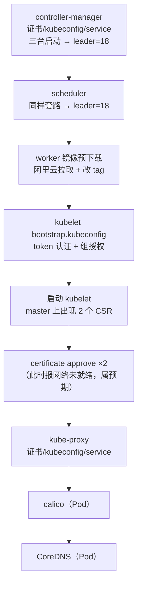

# 二进制高可用集群部署（下）：控制面补齐、worker 加入、kubelet bootstrap 与 kube-proxy

## 纲要

- 收尾 controller-manager：选上下文、拷 kubeconfig 与 service 到每节点、启动三台
- 看 leader 注解是谁：先启动的那台权重更大，抢到 leader
- scheduler 高可用与 controller-manager 套路一致，也是靠选举
- worker 部署第一步：先下载必要镜像，脚本自动拉镜像并重新打 tag
- 准备 kubelet bootstrap 认证：用 token 拼 kubelet bootstrap.kubeconfig
- 给 bootstrap 赋权：绑定 system:node-bootstrapper 到 bootstrappers 组
- kubelet 启动时 master 上会出现 CSR，两个节点都要 approve
- worker 日志报「网络插件没准备好」是预期之内
- 一个容易踩的坑：拷 CA 到 worker 前必须先建 pki 目录
- kube-proxy 部署到每个 worker，证书 + kubeconfig + service 三件套
- 最后两个插件以 Pod 方式跑：calico 与 DNS

## 承接上集：controller-manager 收尾

上集把 controller-manager 的证书和 kubeconfig 都生成好了。这里接着走：选择上下文，把这个配置文件也拷贝到每一个节点上（18、19、20）。

下一步创建 service 文件，也分别拷贝到每一台节点上。拷贝完之后就可以启动服务了——按照惯例，启动之前先检查一下这个 service 是不是正确的：端口、serviceClusterIP 的范围、要的 pod IP 地址的范围，以及各种各样的配置文件，确认没问题再启动。

```bash
systemctl daemon-reload && systemctl enable kube-controller-manager && systemctl start kube-controller-manager
```

在三台节点上启动，然后查看状态是 running；为了确保没问题，再看一下日志，没有 error、没有关系混乱的报错。

然后可以通过 `get endpoint` 获取到它当前的节点，在部署了 kubectl 的那台（18）上查看：

```bash
kubectl get endpoints kube-controller-manager -n kube-system -o yaml | grep -i holder
# control-plane.alpha.kubernetes.io/leader: |
#   {"holderIdentity":"k8s-master-18 ...","leaseDurationSeconds":15, ...}
```

可以看到有一个注解，目前的 leader 是 18，也就是当前这台机器——因为它是第一个启动的，所以说它的权重比较大，抢到了这个 leader 节点。controller-manager 就部署完了。

## 部署 scheduler

下一个继续部署 scheduler。**scheduler 的高可用跟 controller-manager 基本是一样的，也是通过选举的方式。**

第一步创建证书：到中转节点上去，根据根证书去生成 scheduler 的证书；然后跟 controller-manager 一样，生成一个 kubeconfig 文件，编辑一下，设置一下这个证书、设置上下文、选择上下文，然后分发到每一个 master 节点（18、19、20 三个主节点）。

分发完成，下一步创建 service 并分发（18、19、20），从 target 目录分发好。分发完 service 就启动服务，启动之前先查一下 `kube-scheduler.service`——这个 service 比较简单，里面只有刚才上传的那一个配置文件，别的没什么，肯定没什么问题。

启动三台机器都启动，然后查看状态全部是 running，再查一下日志没有错误。然后查看一下当前的 leader，在 18 上查看，leader 也是 18（172.18.41.18 这个节点）。

```bash
kubectl get endpoints kube-scheduler -n kube-system -o yaml | grep -i holder
# holderIdentity 指向 k8s-master-18
```

到这里，三个 master 上的控制面组件（apiserver、controller-manager、scheduler）就都齐了。

## 开始部署 worker 节点

下面进入 worker 节点的部署。在部署 worker 之前，需要先下载一些必要的镜像。如果是普通环境，下载这些镜像可能会比较慢，所以先把它们传到阿里云上，再提供一个脚本自动下载这些镜像，然后把它们**重新打一个 tag**，打成需要的那个镜像名字。

这一步针对的是 worker 节点，也就是后面的两个节点（64.41 和 64.42）：

```bash
scp pull-images.sh root@172.18.64.41:/root/
scp pull-images.sh root@172.18.64.42:/root/
ssh root@172.18.64.41 "bash pull-images.sh"
ssh root@172.18.64.42 "bash pull-images.sh"
```

## 准备 kubelet bootstrap 认证

下载完镜像之后，要准备一下 kubelet 的 bootstrap 配置文件。先到 admin 证书的位置去创建一个 token——之前生成过一个 kubeconfig 文件（admin.kubeconfig），就通过它去创建了一个 token，并且把这个 token 覆盖给了一个变量。这个 token 相当于连接了 apiserver，去创建了一个 token。

然后创建一个类似于之前的配置文件：设置集群的参数，创建一个 `kubelet bootstrap.kubeconfig`；然后去设置客户端的认证参数，**把 token 带进去**，然后设置上下文、选择默认的上下文。这个认证方式就是通过 token，使用的是认证方式中的 **bootstrap token** 那种方式。

```bash
TOKEN=$(kubectl -n kube-system get secret \
  $(kubectl -n kube-system get secret | awk '/bootstrap/{print $1}') \
  -o jsonpath='{.data.token}' | base64 -d)

cd /opt/kubernetes/cfg
kubectl config set-cluster kubernetes \
  --certificate-authority=/opt/kubernetes/cert/ca.pem --embed-certs=true \
  --server=https://172.18.41.14:6443 \
  --kubeconfig=kubelet-bootstrap.kubeconfig

kubectl config set-credentials kubelet-bootstrap --token=$TOKEN \
  --kubeconfig=kubelet-bootstrap.kubeconfig

kubectl config set-context default --cluster=kubernetes \
  --user=kubelet-bootstrap --kubeconfig=kubelet-bootstrap.kubeconfig

kubectl config use-context default --kubeconfig=kubelet-bootstrap.kubeconfig
```

然后把生成的 bootstrap 文件拷贝到每一个 worker 节点上（64.41、64.42）。再把 CA 证书分发到每一个 worker 节点上，这也是它需要的。

> 这里有个容易踩的坑：拷 CA 到 worker 节点之前，**应该先在 worker 节点上创建 PKI 这个目录**。如果没有这个目录的话，CA 这个文件被当成目录创建掉了，就有问题了。所以要先 ssh 到 worker 上 `mkdir -p /opt/kubernetes/pki`，再执行 scp。

接着是 kubelet 的配置文件（到 target 上面去配置，把 nodeIP 替换掉，41 用 41、42 用 42），还有 kubelet 的系统服务文件——**这个文件里 172.41 这个 IP 一定不要弄混**，要一台对应一台，因为它们有配置是跟 IP 有关系的。

```ini
# /usr/lib/systemd/system/kubelet.service（41 / 42 各一份）
[Unit]
Description=Kubernetes Kubelet
After=docker.service
Requires=docker.service

[Service]
WorkingDirectory=/var/lib/kubelet
ExecStart=/opt/kubernetes/bin/kubelet \
  --bootstrap-kubeconfig=/opt/kubernetes/cfg/bootstrap.kubeconfig \
  --kubeconfig=/opt/kubernetes/cfg/kubelet.kubeconfig \
  --cert-dir=/opt/kubernetes/ssl \
  --hostname-override=k8s-worker-41 \
  --cluster-dns=10.254.0.2 \
  --cluster-domain=cluster.local \
  --pod-infra-container-image=pod-infrastructure \
  --node-ip=172.18.64.41
Restart=on-failure
RestartSec=5

[Install]
WantedBy=multi-user.target
```

## 给 bootstrap 赋权，然后启动 kubelet

**在启动服务之前，要给 bootstrap 赋权**——相当于创建一个角色绑定，把这个角色 `node bootstrapper` 跟这个 bootstrap 这个 group 绑定到一起，使 kubelet 具有向 apiserver 发送这个请求认证的这样的一个权利。在 18 上面创建这个角色绑定：

```bash
kubectl create clusterrolebinding kubelet-bootstrap \
  --clusterrole=system:node-bootstrapper \
  --group=system:bootstrappers:kubernetes
```

创建完了，然后在启动服务之前给 kubelet 在 worker 节点上创建一个工作目录，就可以启动了。

启动之前再检查一下这个 service 文件，几个配置文件里指定的镜像也没什么问题，然后启动 kubelet。

```bash
systemctl daemon-reload && systemctl enable kubelet && systemctl start kubelet
```

到 master 上看一看有没有 kubelet 过来的请求：

```bash
kubectl get csr
# NAME        AGE   REQUESTOR                 CONDITION
# csr-2f8k9   10s   system:node:k8s-worker-41  Pending
# csr-7xw2m   8s    system:node:k8s-worker-42  Pending
```

看到了有两个请求过来了。用命令把这两个 bootstrap 请求 approve 同意通过，一共两个节点都给它通过了：

```bash
kubectl certificate approve csr-2f8k9
kubectl certificate approve csr-7xw2m
```

通过之后再去这两个 worker 节点上看一下日志，看有没有什么问题：

```bash
journalctl -u kubelet -f
```

会看到「**网络的插件没有准备好**」——这是预期之内的问题，网络插件（calico）还没部署，所以容器网络还没就绪。

## 部署 kube-proxy

接下来开始部署 proxy，也是部署在每一个 worker 节点上面。

首先是创建证书和私钥，标准步骤：到中转节点上生成 kube-proxy 的证书，然后创建一个 kubeconfig 的文件，设置它的证书、选择上下文，然后把这个 kubeconfig 分发到每一个 worker 节点（41、42）。

然后还要分发一个 kube-proxy 的配置文件（kube-proxy.kubeconfig），也就是生成好的那个，节点 IP 对应的 41、42 分别传过去。然后最后一个文件就是 kube-proxy 的服务文件（41、42 也是两个）。

```ini
# /usr/lib/systemd/system/kube-proxy.service
[Unit]
Description=Kubernetes Kube-Proxy Server
After=network.target

[Service]
WorkingDirectory=/var/lib/kube-proxy
ExecStart=/opt/kubernetes/bin/kube-proxy \
  --config=/opt/kubernetes/cfg/kube-proxy.conf
Restart=on-failure
RestartSec=5

[Install]
WantedBy=multi-user.target
```

我们可以启动服务了，启动之前创建一个它依赖的目录，目录创建好之后启动服务。启动之前先看一眼 `kube-proxy.service` 和相关的配置文件，应该没什么问题，然后启动一下，等一下看日志，运行得挺好没有问题。

kube-proxy 部署完了之后，主要的工作就都完成了。

## 两个以 Pod 方式运行的插件

剩下这两个是通过 yaml 文件的方式，以 Pod 的方式运行在 Kubernetes 集群中的两个插件：**一个是 calico（网络插件），一个是 DNS（CoreDNS）**。就挨个把它运行起来。

首先在有 kubectl 的那台机器上创建一个目录，用来存放这些配置文件，然后在中转节点把这个配置文件上传上去（上传到一个 addons 目录下边）。

然后到主节点上部署一下 calico：

```bash
kubectl apply -f /opt/kubernetes/addons/calico.yaml
kubectl get pods -n kube-system -o wide
```

稍等一会儿再看，刚才还在启动中的 Pod 已经处于 ready 状态了，说明 calico 是正常运行的。

最后部署一个 DNS，一样把 yaml 上传到 addons 目录（在 18 上），然后部署一下：

```bash
kubectl apply -f /opt/kubernetes/addons/coredns.yaml
kubectl get pods -n kube-system
# coredns-xxxxx   1/1   Running   0   30s
```

DNS 也创建了，再用 `get pod` 去看一下，DNS 也处于 running 状态了，也是 ready 的。

到这儿，二进制方式搭建集群就已经全部完成了。

## 部署顺序与产物总览



## 目录与端口

```text
worker 节点（172.18.64.41 / 172.18.64.42）
├── /opt/kubernetes
│   ├── bin/kubelet  kube-proxy
│   ├── cfg/
│   │   ├── bootstrap.kubeconfig   ← kubelet 首次认证用（含 token）
│   │   ├── kubelet.kubeconfig     ← 认证通过后自动生成的正式配置
│   │   ├── kube-proxy.conf
│   │   └── kube-proxy.kubeconfig
│   ├── pki/                        ← 必须先建目录再拷 CA
│   ├── ssl/                        ← 自动生成的 kubelet 客户端证书
│   └── logs/
├── /var/lib/kubelet                ← kubelet 工作目录
├── /var/lib/kube-proxy             ← kube-proxy 工作目录
└── /usr/lib/systemd/system/
    ├── kubelet.service
    └── kube-proxy.service
```

| 组件 | 部署位置 | 关键产物 | 就绪标志 |
| --- | --- | --- | --- |
| controller-manager | 三个 master | kubeconfig + service | running + leader 注解有主 |
| scheduler | 三个 master | 证书 + kubeconfig + service | running + leader 是 18 |
| kubelet | 两个 worker | bootstrap.kubeconfig + service | CSR 被 approve |
| kube-proxy | 两个 worker | 证书 + kubeconfig + service | 日志无报错 |
| calico | Pod | addons/calico.yaml | Pod Ready |
| CoreDNS | Pod | addons/coredns.yaml | Pod Running Ready |

## API 速览

| 能力 | 做法 | 说明 |
| --- | --- | --- |
| 看控制面 leader 是谁 | `kubectl get endpoints <name> -n kube-system -o yaml \| grep holder` | 只有leader 注解里有 holderIdentity |
| 造 bootstrap token | 从 kube-system 里的 bootstrap secret 取 `.data.token` 并 base64 解码 | 拼进 bootstrap.kubeconfig |
| 授权 bootstrap 组 | `kubectl create clusterrolebinding kubelet-bootstrap --clusterrole=system:node-bootstrapper --group=system:bootstrappers:kubernetes` | 不给权 kubelet 起不来 |
| 看未授权请求 | `kubectl get csr` | 每加一个 worker 就多一条 Pending |
| 放行请求 | `kubectl certificate approve <name>` | 两个 worker 各批一次 |
| 看 kubelet 在说什么 | `journalctl -u kubelet -f` | 「网络插件没有准备好」是正常阶段 |
| 部署网络插件 | `kubectl apply -f calico.yaml` | 二进制集群也要靠 Pod 装 CNI |
| 验证 DNS | `kubectl get pods -n kube-system` | coredns 需 Ready |
| 看节点是否已加入 | `kubectl get nodes` | approve 之后才会出现 |

## Demo 示例

把下半程最容易卡住的两段现场跑一遍：worker 的 bootstrap 加入，以及最后的插件。

**第一段：kubelet bootstrap 入职流程**

```bash
# 1. 在 master(18) 上取 token
TOKEN=$(kubectl -n kube-system get secret \
  $(kubectl -n kube-system get secret | awk '/bootstrap/{print $1}') \
  -o jsonpath='{.data.token}' | base64 -d)

# 2. 拼 bootstrap.kubeconfig（41 / 42 各拷一份）
cd /opt/kubernetes/cfg
kubectl config set-cluster kubernetes --certificate-authority=/opt/kubernetes/cert/ca.pem \
  --embed-certs=true --server=https://172.18.41.14:6443 \
  --kubeconfig=kubelet-bootstrap.kubeconfig
kubectl config set-credentials kubelet-bootstrap --token=$TOKEN \
  --kubeconfig=kubelet-bootstrap.kubeconfig
kubectl config set-context default --cluster=kubernetes --user=kubelet-bootstrap \
  --kubeconfig=kubelet-bootstrap.kubeconfig
kubectl config use-context default --kubeconfig=kubelet-bootstrap.kubeconfig

# 3. 组授权（只做一次）
kubectl create clusterrolebinding kubelet-bootstrap \
  --clusterrole=system:node-bootstrapper \
  --group=system:bootstrappers:kubernetes

# 4. worker 上建目录 → 拷 CA → 拷配置 → 拷 service → 起 kubelet
for n in 172.18.64.41 172.18.64.42; do
  ssh root@$n "mkdir -p /opt/kubernetes/pki /var/lib/kubelet"
  scp /opt/kubernetes/cert/ca.pem root@$n:/opt/kubernetes/pki/
done
ssh root@172.18.64.41 "systemctl daemon-reload && systemctl enable kubelet && systemctl start kubelet"
```

**第二段：审批 CSR 并看结果**

```bash
kubectl get csr
# csr-2f8k9   system:node:k8s-worker-41  Pending
# csr-7xw2m   system:node:k8s-worker-42  Pending

kubectl certificate approve csr-2f8k9 csr-7xw2m
kubectl get csr
# csr-2f8k9   system:node:k8s-worker-41  Approved,Issued
# csr-7xw2m   system:node:k8s-worker-42  Approved,Issued

kubectl get nodes
# k8s-master-18   Ready    master
# k8s-worker-41   Ready    <none>     ← approve 后自动出现
# k8s-worker-42   Ready    <none>
```

**第三段：kube-proxy 与两个插件**

```bash
# kube-proxy 起在 worker 上
ssh root@172.18.64.41 "mkdir -p /var/lib/kube-proxy && systemctl enable --now kube-proxy"
journalctl -u kube-proxy | tail -5        # 无报错

# calico → DNS（以 Pod 方式跑）
kubectl apply -f /opt/kubernetes/addons/calico.yaml
kubectl apply -f /opt/kubernetes/addons/coredns.yaml
kubectl get pods -n kube-system
# calico-node-xxxx   1/1   Running   0   1m
# coredns-xxxxx      1/1   Running   0   30s
```

整个二进制安装过程中有个原则：**每一步都要观察命令是不是执行成功了**。一旦有哪个命令没执行成功，一定要停下来解决掉了再往下走——看日志也好、看服务状态也好，必须是正常的情况下才能继续；否则一旦出错，再往下的操作都是没有意义的。

### 总结

- controller-manager 收尾走「选上下文 → 拷 kubeconfig → 拷 service → 三台启动」四步，启动顺序影响 leader：最先启动的那台抢到 leader（本环境是 18）。
- scheduler 与 controller-manager 完全同构：证书 → kubeconfig → 分发 → service → 启动三台，最后在 endpoints 注解里确认 leader 也是 18。
- worker 部署前的镜像可以从阿里云镜像站预先拉取再由脚本重新打 tag，避免官网慢或无外网的问题。
- kubelet 走 bootstrap token 认证：用 token 拼 kubelet bootstrap.kubeconfig，再把 system:node-bootstrapper 绑到 system:bootstrappers 组，kubelet 才有向 apiserver 申请认证的资格。
- CSR 是 worker 入职的关卡：每个 worker 启动后 master 上会出现一条 Pending CSR，必须 `kubectl certificate approve` 放行（这里是两条），节点才会出现在 `kubectl get nodes` 里。
- worker 上 kubelet 日志出现「网络插件没有准备好」是正常阶段，因为 calico 还没部署，不是故障。
- 拷 CA 到 worker 前必须先 `mkdir -p /opt/kubernetes/pki`，否则 CA 文件会被建成目录导致 kubelet 认证失败——这是本段最容易踩的坑。
- kube-proxy 在每台 worker 上部署，同样三件套（证书、kubeconfig、service），并要先建工作目录。
- 网络插件 calico 与 DNS 在二进制集群里也是以 Pod 方式运行：apply yaml 后等它们 Ready，集群才算装完。
- 收尾原则：每一步都要确认成功再往下走，出错就停下解决；装完之后再系统检查集群是否真正工作正常。

