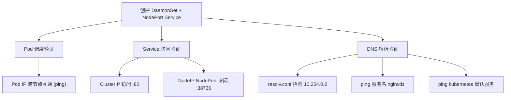

# 二进制高可用集群部署（中）：集群可用性测试

## 纲要

- 上一节集群已搭好，本节用四项验证确认集群「真的好用」：Pod 调度、Pod 网络、Service 访问、DNS 解析
- 第一步：创建 nginx 的 **DaemonSet + NodePort Service**，确认每个 worker 都能正常调度出 Pod
- 第二步：Pod IP 互通——在两个 worker 上互 ping Pod IP（都在 `172.22.0.0/16`）
- 第三步：Service 访问——既用 ClusterIP 访问，也用 NodeIP:NodePort（随机 38736）访问，两种都通
- 第四步：DNS 验证——起一个 busybox 类 Pod，看 resolv.conf 指向 `10.254.0.2`，ping 服务名与 `kubernetes` 都能解析
- 四项全过，说明集群在各个方面可用且高可用，可以放心使用

## 测试一：DaemonSet + NodePort Service 的 Pod 调度

先写一个配置文件（在装了 kubectl 的节点执行），核心是两块：

- **Service**：类型 `NodePort`，service 端口 80，容器端口 80，nodePort 随机生成未指定
- **DaemonSet**：`nginxds`，在每个 worker 节点上都跑一个实例，用来检查每个节点是否都能正常调度；镜像 `nginx:1.7.9`，label 为 `nginxds`，Service 的 selector 通过这个 label 找到它

```yaml
apiVersion: apps/v1
kind: DaemonSet
metadata:
  name: nginxds
  labels:
    app: nginxds
spec:
  selector:
    matchLabels:
      app: nginxds
  template:
    metadata:
      labels:
        app: nginxds
    spec:
      containers:
        - name: mynginx
          image: nginx:1.7.9
          ports:
            - containerPort: 80
---
apiVersion: v1
kind: Service
metadata:
  name: nginxds
spec:
  type: NodePort
  selector:
    app: nginxds
  ports:
    - port: 80
      targetPort: 80
```

创建后先看 Pod 是否调度出来：一开始是 `ContainerCreating`（在拉镜像），稍等片刻，`41` 这台机器上的节点已进入 `Running`，随后 `42` 节点也正常调度起来——两个 worker 都产生了正确的 Pod IP，且都在 `172.22.0.0/16` 网段。

## 测试二：Pod 网络互通

到两个 worker 节点上去 ping 对方的 Pod IP，都是可以 ping 通的。说明 Pod 跨节点网络正常。

## 测试三：Service 两种访问方式

集群里访问 Service 一般有两种姿势，都要验证：

1. **ClusterIP 访问**：直接通过 Service 的 ClusterIP（如 `10.254.x.x`）加端口 80 访问。在 worker 节点上去访问这个地址，正常返回 nginx 欢迎页。
2. **NodeIP:NodePort 访问**：先看 nodePort 随机生成的是 `38736`，在 worker 节点上确认端口已处于监听状态，然后 `curl` 节点 IP 加 `38736`：

```bash
# 在 worker 节点上 curl NodePort（注意 URL 别手滑多打空格）
curl http://10.64.41:38736
curl http://10.64.42:38736
```

两个 worker 节点的 NodeIP:NodePort 都能正常返回欢迎页，说明 Service 在两种访问方式下都 OK。整个验证链路可以画成一张流程图：



## 测试四：DNS 解析

DNS 需要再起一个 Pod 来验证（演示里起一个简单的 nginx/busybox 类 Pod，用相同镜像即可）。进入这个 Pod 内部：

1. 先看 Pod 的 DNS 配置，确认 `resolv.conf` 里 nameserver 是 `10.254.0.2`（即 DNS 服务地址），没问题。
2. 再 ping 之前建的 `nginxds` 服务名，可以看到名字已经正常解析到对应服务地址（如 `10.254.115.x`），说明服务名被正确解析。
3. 还可以 ping 一下 Kubernetes 默认创建的 `kubernetes` 服务，解析到 `10.254.0.1`，也没问题。

```bash
# 进到测试 Pod 里
kubectl exec -it <dns-test-pod> -- sh

# 看 DNS 配置
cat /etc/resolv.conf
# nameserver 10.254.0.2

# 解析服务名
ping nginxds
ping kubernetes
```

至此四项验证全部通过，目录树视角下这批测试资源长这样：

```dir
nginxds-availability-test
├── nginxds DaemonSet
│   ├── worker-41 pod (172.22.x.x, Running)
│   └── worker-42 pod (172.22.x.x, Running)
├── nginxds Service (NodePort)
│   ├── ClusterIP 访问 :80  -> 正常返回欢迎页
│   └── NodeIP:38736 访问   -> 两节点均通
└── dns-test pod
    ├── resolv.conf -> 10.254.0.2
    ├── ping nginxds   -> 解析到 10.254.115.x
    └── ping kubernetes -> 解析到 10.254.0.1
```

## 验证项速查表

| 验证项 | 方法 | 通过标志 |
| --- | --- | --- |
| Pod 调度 | DaemonSet 每个 worker 起 Pod | 两节点均 `Running` |
| Pod 网络 | 跨 worker ping Pod IP | 互通 |
| Service（ClusterIP） | 访问 Service IP:80 | 返回 nginx 欢迎页 |
| Service（NodePort） | 访问 NodeIP:38736 | 两节点均返回 |
| DNS 解析 | Pod 内 ping 服务名 / kubernetes | 解析到对应 ClusterIP |

## 总结

- 集群搭好不等于可用，必须用四项验证坐实：Pod 调度、Pod 网络、Service 访问、DNS 解析。
- DaemonSet 是验证「每个 worker 都能调度」的好载体；Service 用 NodePort 既能测 ClusterIP 也能测 NodeIP 访问，两种都要通。
- 随机 nodePort 是 `38736`，curl 时 URL 别多打空格，否则会出现奇怪的报错。
- DNS 验证要在 Pod 内做：确认 `resolv.conf` 指向 CoreDNS 地址（`10.254.0.2`），并能解析业务服务名与默认的 `kubernetes` 服务。
- 四项全过，说明集群在调度、网络、服务暴露、服务发现各个层面都正常且高可用，可以放心进入下一步（部署 Dashboard）。
