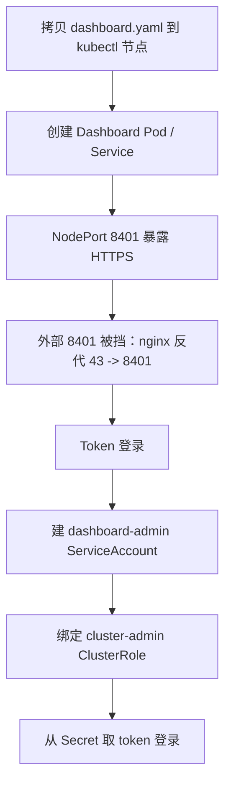

# 二进制高可用集群部署（下）：部署 Dashboard 看板

## 纲要

- Dashboard 也是以 Pod 方式运行；先把官方 yaml 拷到 kubectl 节点，再创建 Pod 与 Service
- 自 Kubernetes 1.7 起 Dashboard 只支持 HTTPS，我们用 NodePort 暴露，默认自签证书不受信任（可换自定义证书）
- 外部 8401 端口被挡，于是在 worker 上做一层 nginx 反代：访问本机 43 端口即等于访问 `10.64.41:8401`
- 登录方式只支持 Token：创建 `dashboard-admin` ServiceAccount 并绑定 `cluster-admin`，再从 Secret 取 token
- Dashboard 首页是 default 命名空间的总览，可看 DS/Pod/容器/Service、进容器 exec、看日志、改 Pod yaml
- 实时 CPU/内存需要 Heapster，但 Heapster 已被放弃、重心转到 Prometheus，故本课程不再装 Heapster

## 创建 Dashboard Pod 与 Service

Dashboard 的部署不复杂，它本身也是以 Kubernetes 的 Pod 方式运行。事先准备好一份 Dashboard 的配置文件，把它从中转机器拷贝到 kubectl 节点（演示是 `172.18.71.18`）的目录下，然后到主节点上去创建 Dashboard 的资源：

```bash
# 把 dashboard.yaml 拷到 kubectl 节点后，在主节点创建
kubectl apply -f dashboard.yaml

# 看状态
kubectl get pods -n kube-system -l k8s-app=kubernetes-dashboard
kubectl get svc -n kube-system kubernetes-dashboard
```

很快 `available` 就正常了，最后那个 Pod 处于 `Running` 状态，落在 `42` 这台节点上。Service 是 NodePort 类型，我们预先定义好的端口是 `8401`，到 worker 节点上看该 NodePort 已处于监听状态，没问题。

## HTTPS 与证书

从 Kubernetes **1.7** 开始，Dashboard 只允许通过 HTTPS 访问。我们用 NodePort 方式暴露服务，默认会自动生成一个数字证书，但这个证书肯定不受浏览器信任。如果要换自定义证书，可以修改 Dashboard 配置文件里的启动参数，加上：

- `--tls-cert-file`：证书文件路径
- `--tls-key-file`：私钥文件路径

证书和密钥文件通过 Kubernetes 的 **Secret** 注入进来——Dashboard 的配置里有对这两个 Secret 的描述，把文件名和文件内容直接注进 Secret 即可使用，之后就能通过受信任的 HTTPS 访问。



## 外部端口被挡：加一层 nginx 反代

演示环境比较特殊：worker 节点对外暴露的 `8401` 端口会被墙掉。于是在该节点上做一层中转——用 nginx 做反向代理，入口是 `43` 端口，转发到 `10.64.41:8401`。也就是说，访问当前这台机器的 `43` 端口，就相当于访问 `10.64.41` 的 `8401` 端口：

```nginx
server {
    listen 43 ssl;
    location / {
        proxy_pass https://10.64.41:8401;
        # 如需自签证书信任，可加 proxy_ssl_verify off;
    }
}
```

> 这台机器原本没装 Docker（nginx 反代用容器跑），所以现场先装了 Docker、拉起 nginx 容器把反代跑起来。装 Docker 的步骤与前面 worker 安装一致。

启动 Docker 并拉起 nginx 后，就可以通过 `https://172.18.41.18` 访问 Dashboard 了。浏览器地址栏是红色（证书不受信）是正常的，继续访问即可。

## 访问方式对照

Dashboard 在演示环境里经过了两层暴露，先把每种方式的端口与用途理清：

| 访问方式 | 端口 | 说明 |
| --- | --- | --- |
| Dashboard Service NodePort | 8401 | K8s 内部 NodePort，HTTPS 暴露 |
| nginx 反代入口 | 43 | 本机 43 转发到 `10.64.41:8401`，绕开外部 8401 被挡 |
| 浏览器直连 | `https://172.18.41.18` | 经反代访问，证书红字属正常 |
| 登录凭证 | Token | 从 `dashboard-admin` 的 Secret 取 |

## Token 登录

首次访问会跳到登录界面，支持 kubeconfig 或 Token 两种方式。由于 Dashboard 默认只支持 **Token 登录**（即便用 kubeconfig，也需要在配置里指定 token），所以干脆直接用 Token。

步骤如下：

1. 创建一个 Dashboard 专用的 ServiceAccount，叫 `dashboard-admin`
2. 创建该 ServiceAccount 与角色的绑定关系，角色用集群管理员 `cluster-admin`，把它绑定到这个账号上
3. 用命令查出 `dashboard-admin` 对应的 Secret 名字
4. 把 Secret 名字赋给一个变量，再 `describe` 这个 Secret，过滤出其中的 `token` 字段值
5. 用这个 token 登录

```bash
# 1. 创建 ServiceAccount
kubectl create serviceaccount dashboard-admin -n kube-system

# 2. 绑定 cluster-admin（集群管理员）
kubectl create clusterrolebinding dashboard-admin \
  --clusterrole=cluster-admin \
  --serviceaccount=kube-system:dashboard-admin

# 3. 找到对应的 secret 名字
kubectl get secrets -n kube-system | grep dashboard-admin

# 4. 取出 token（命令略复杂，本质只是把返回值赋给变量再 describe 过滤）
kubectl describe secret <dashboard-admin-token-xxx> -n kube-system
# 复制输出里的 token 字段值
```

把这段 token 粘贴进登录框，就进入了 Kubernetes 的首页。目录树视角下，这套访问链路是：

```dir
dashboard-access
├── dashboard Pod        (落在 node-42, Running)
├── dashboard Service    (NodePort 8401)
├── nginx 反代           (worker:43 -> 10.64.41:8401)
└── 认证
    ├── ServiceAccount dashboard-admin
    ├── ClusterRoleBinding cluster-admin
    └── Secret 中的 token (登录凭证)
```

## Dashboard 能做什么 / 不能做什么

登录后默认是 `default` 命名空间，显示集群概况：Deployment、Pod、容器、Service 等各种信息都能看到。注意这里**没有**内存、CPU 等实时图表——要显示那些需要部署 Heapster（属于监控范畴的组件）。但 Heapster 近期几乎已停止对 Kubernetes 的更新，官方把重心完全转移到了 **Prometheus** 上，所以本课程没有必要再去装 Heapster。

Dashboard 在关键时刻还是能让我们更直观、更方便地管理集群与查看内容，比如：

- 进到容器里看 Pod 的详细信息，包括状态和发生的事件
- 直接点进去在容器里执行命令（exec）
- 查看日志
- 编辑 Pod——对应的是它完整的配置文件，可以直接改

关于 Dashboard 更多功能，自己点点就很容易上手，这里不逐个演示。到这里，二进制方式的高可用集群部署方案就全部完成了。

## 总结

- Dashboard 以 Pod 运行，用 NodePort（演示 `8401`）暴露；自 K8s 1.7 起只支持 HTTPS，默认自签证书不受信，可用 Secret 注入自定义证书。
- 外部端口被挡时，用 nginx 反代（本机 `43` → `10.64.41:8401`）是最省事的访问方案，反代容器本身跑在 worker 上。
- 登录只支持 Token 方式：建 `dashboard-admin` ServiceAccount → 绑 `cluster-admin` → 从对应 Secret 取 token 登录，这是生产里给管理员开 Dashboard 权限的标准做法。
- Dashboard 首页是命名空间总览，能看资源、进容器 exec、看日志、改 Pod yaml；但实时 CPU/内存需要 Heapster，而 Heapster 已停更、重心转到 Prometheus，故不必装。
- 完成 Dashboard 部署，二进制高可用集群部署方案（环境准备 → 集群部署 → 可用性测试 → Dashboard）全流程收尾。
