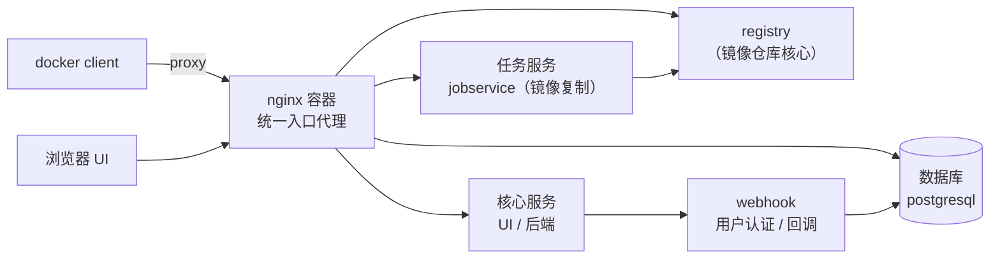
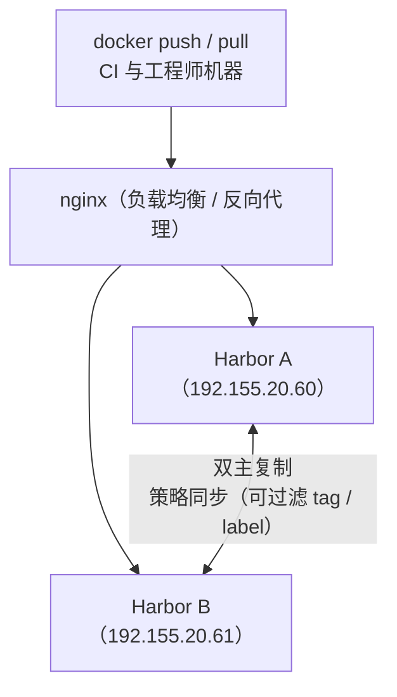

# Harbor 入门：云原生镜像仓库的特性、架构与高可用方案选型

## 纲要

- 集群准备好之后不能直接迁业务，迁移前还有准备工作要做：得先有私有镜像仓库
- Docker 原生 registry 太简单，业内常用的是 VMware 开源的 Harbor
- Harbor 官方定位：开源的可信云原生镜像仓库，存储、签名与扫描容器镜像
- 十大特性：云原生、RBAC、策略复制、漏洞扫描、AD、垃圾回收、Notary、UI、审计 API、两种安装方式
- 默认账号 admin / Harbor12345，UI 里能看到项目、日志、用户、仓库、复制与配置
- 架构概览：nginx 容器做统一入口代理，后面挂 registry、核心服务、数据库与任务服务
- 安装推荐离线包（一个包全含，装得快）
- 网上那种「拆模块 + 高可用 DB + 高可用共享存储」的方案成本高，中小公司不必
- 本课程采用双主复制方案：两个 Harbor 互相同步，上面挂 nginx 负载均衡

## 新一套内网环境

前面已经在准生产环境演示了高可用集群的搭建，但后续还有大量内容要在这个集群上操作，配置太高的机器就有些浪费了。所以在内网重新搭建了一套环境，环境是一模一样的，但有两个区别：机器配置可能会差一些，IP 也不一样。

新的集群结构：

| 角色 | 数量 | IP | 备注 |
| --- | --- | --- | --- |
| master 第一台 | 3 | 192.155.20.50 / .51 / .52 | 都是 192.155.20 网段 |
| worker | 2 | 192.155.20.120 / .121 | 其中 120、121 这两台是 worker |

后续用 kubeadm 去操作时，一般会在这台 50 上进行操作，同时重点关注的也就是第一个 master 节点 50，以及这两个 worker 节点 120、121。后面所有的演示都在这个集群上做。

## 集群就绪之后，还差什么

对于公司来说，Kubernetes 集群已经准备好了，下一步是不是就可以开始迁移业务了？把原来跑在虚拟机上、或者实体机上的服务，给它容器化，让容器实例管理起来？

在迁移之前还有一些准备工作要做，否则迁移过程中会有各种各样的麻烦。先想清楚还有哪些工作没做：把服务容器化之后，会**产生很多镜像**，那我们就需要一个地方去管理这些镜像，包括镜像的**存储**和**拉取**——也就是说需要一个 **Docker Registry**。

但这项服务就不能再用阿里云、网易的仓库了：速度慢不说，安全性也是一个很大的问题。所以需要的是一个**私有的仓库**。

## 两个候选：原生 registry 与 Harbor

首先能想到的是 Docker 原生的 registry。那么问题来了：原生 registry 有个毛病就是功能比较简单——只有存储和拉取的基本功能，里面有一个简单的 UI，主要问题就是**过于简单**。

还有一个业内常用的开源方案，叫做 **Harbor**——它是 VMware 开源出来的一个 Docker 仓库，功能比较全，还有一个方便的 UI，维护起来是个很好的选择，也是业内广泛使用的一个方案。所以这里采用 Harbor 来作为镜像仓库。

## Harbor 官方怎么介绍自己

从官网入手认识 Harbor。在官网搜索就能看到那个图标，点进去看官方介绍：

**Harbor 是一个开源的可信任的云原生的镜像仓库，用来存储、签名和扫描容器镜像。** 它扩展了开源的 Docker Distribution，添加了一些经常被用户所需要的功能——安全、身份认证，还有一些管理——使这个仓库更加接近构建和运行的环境，可以提高镜像传输的效率。

Harbor 支持 replication（镜像复制），在各个仓库实例之间进行镜像复制，并且提供了高级的安全特性，比如**用户管理、访问控制、还有活动的审计**。Harbor 目前已经托管于 CNCF 下面，有了很好的靠山，更加可信，可以放心使用。

## 十大特性

| 特性 | 说明 |
| --- | --- |
| Cloud native（云原生仓库） | 以容器的方式运行，支持通过项目做编排；面向 Kubernetes 这类编排平台 |
| Role based access control（RBAC） | 基于角色的访问控制，用户和仓库通过 **project（项目）** 组织起来，一个用户在一个项目下可以有不同的权限 |
| Policy based image replication（基于策略的镜像复制） | 镜像可被复制同步到多个仓库实例，过滤条件可以是仓库、tag、label；遇到错误自动重试，多实例间可做负载均衡、高可用、多数据中心 |
| Vulnerability scanning（漏洞扫描） | 可以定期扫描镜像，有漏洞就发出警告 |
| AD 用户配置支持 | 可以对接企业 AD/LDAP 用户体系 |
| Image deletion & garbage collection | 镜像删除与垃圾回收 |
| Notary | 确保镜像的真实性与正确性（签名信任） |
| Graphical user portal | 图形界面，供各种操作 |
| Auditing & RESTful API | 审计能力；其他系统通过 API 的形式跟 Harbor 交互 |
| 部署方式 | 提供**在线**和**离线**两种安装方式 |

## 界面长什么样

官网还有 demo 可以先去看看大概是什么样子。登录用的默认用户名是 **admin**，密码是 **Harbor12345**（H 大写，后面母也是大写）。

登录之后能看到一个 UI：项目、日志、用户管理、仓库的管理、还有 replication（多实例之间的复制），以及基本配置。这些都可以先点一点，了解一下 Harbor 大概是什么样的——这也是安装完之后访问 Harbor 的样子，跟 demo 是一模一样的。

## 架构概览

Harbor 的系统设计也不复杂。看官方文档里的架构 overview：

- 左边这块是 **Docker client（docker 客户端）**，还有浏览器，都会通过一个 proxy 虚线进来
- 这部分就是 Harbor 通过一个 **proxy 作为入口**——在 Harbor 里面用的就是这个 **nginx 容器**作为代理
- 后面一边会去连这个**仓库（registry）**，一边会有一些**核心的服务**：包括它的界面及后端、依赖的数据库，还有一些**任务处理**（主要用于镜像复制）
- UI 下面还有 **webhook**，这块主要作为一个用户的认证和一些回调的工作



## 安装方式

官网还有 Harbor 的安装和配置指南。怎么来安装呢？一个是**在线安装**，一个是**离线安装**（推荐大家使用离线安装的方式）——离线包把所有相关的文件都在一个包里边，安装的速度是比较快的。

下载的话可以到 GitHub 的 release 页面去下载，里面有各种版本：1.5.3、还有最新的 1.6.0。下载那个 1.6.0 版本的 offline installer：

```bash
tar -xf harbor-offline-installer-v1.6.0.tgz
cd harbor
ls
# docker-compose.yml
# harbor.cfg
# harbor.v1.6.0.tar.gz   ← 所有镜像都在这里
# prepare
vi harbor.cfg           # 改 hostname / admin 密码 / 存储 / DB 连接
./install.sh
```

```text
harbor-offline-installer-v1.6.0/
├── harbor.cfg              主配置（hostname、密码、数据库、存储驱动）
├── docker-compose.yml      所有容器的编排关系
├── harbor.v1.6.0.tar.gz    离线镜像包
├── prepare                 生成配置与证书
└── install.sh              一键安装
```

## 高可用方案怎么选

不过在安装之前要先考虑一个问题：要安装的是一个**高可用的版本**，怎么来高可用？

如果在网上查的话，会发现 Harbor 的高可用很多人给出的方案相对来说比较复杂。回到刚才那个架构页面看：复杂方案其实复杂在——**它把整个架构的模块拆开了**。因为 Harbor 本身提供的安装方案是一个 docker-compose，把所有容器之间的依赖关系都规划好了，执行一条命令就能全跑起来；而复杂的高可用方案主要思路就是把它们拆开，包括镜像用到的**存储**和**数据库**这一块都改成公用的：一个高可用的数据库，再加上一个高可用的共享存储，这些都要事先在自己的环境里搭建和准备，还要对 Harbor 本身的配置、以及其他模块的配置做一些修改，包括存储、数据库那块都需要改，才可能搭出这样的环境。

那种方案确实也是高可用的，但搭建过程和维护成本还是挺高的——包括 Harbor 这个 toolchain 的方式在 k8s 集群中也是要有共享存储之类的东西，并且是把它运行在了集群的内部。如果是在中小公司，没必要搞得这么复杂：**原生的 docker-compose 去运行，然后运行多个实例，也同样可以达到高可用的效果，并且非常简单。**

毕竟 Harbor 是一个镜像仓库，保护这个仓库最重要的一点是什么呢？是**不能让镜像丢了**——数据不能丢，这是必须保证的事。还有一个事是镜像在推送和拉取时的可用性：它并不是特别在意几秒、或者一分钟之内不能用，出了问题在**分钟级恢复**其实不影响正常业务——它并不是对外的用户服务，而是给工程师做服务升级、上线的时候可能会推送、拉取这样的动作。

考虑到大多数学员还是中小公司比较多（BAT 毕竟是少数），所以采用一个相对简单、同样能达到高可用效果的方案：**Harbor 的双主复制（双写复制）**。

## 双主复制方案

简单画一下双主复制：我们有两个 Harbor，一个 Harbor A，一个 Harbor B。Harbor A 上的项目会同步复制到 Harbor B，Harbor B 上的也会复制到 Harbor A，这叫双主复制。然后在上面挂一个 **nginx**（或者 haproxy 之类的正反向代理）做一个负载均衡，请求可以分发到 Harbor A 也可以分发到 Harbor B。

这样的话：

- 不管哪一个点挂掉，**镜像在两个点都有**，可以保证数据安全
- 挂掉一个点之后，另外一个点也是可以正常提供服务的
- Harbor A 和 Harbor B 都可以通过 Harbor 原生的安装方式完成，非常简单；一台机器彻底坏了，也可以很快在另外一台机器上搭建同样的环境，恢复很快



| 方案 | 复杂度 | 数据安全性 | 恢复方式 | 适用 |
| --- | --- | --- | --- | --- |
| 单实例 | 最低 | 单点，坏了就丢 | 重建 | 学习 / 临时环境 |
| 拆模块 + 高可用 DB + 共享存储 | 高（要改 DB、存储、各模块配置） | 高（共享存储 + 主备库） |  failover | 大型团队、有专职运维 |
| 双主复制 + nginx | 低（原生安装 ×2 + 一个代理） | 两处各有一份 | 坏一台换另一台 | 中小公司首选 |

下一节就开始搭建这个双主复制的高可用 Harbor 集群。

## API 速览

| 能力 | 做法 | 说明 |
| --- | --- | --- |
| 看 Harbor 版本与特性 | 官网 Features 页 / demo 站点 | 上手前先逛一圈 |
| 默认登录 | `admin` / `Harbor12345` | 装完立刻改密码 |
| 起一个本地 Harbor | `./install.sh`（离线包） | 一条命令把 compose 里所有容器拉起 |
| 看起了哪些容器 | `docker-compose ps` | nginx、registry、jobservice、数据库、redis 等 |
| 压测私有仓库速度 | `docker pull <harbor-host>/<project>/<image>` | 与公有云仓库对比体感 |
| 配双主复制 | UI 里建 replication 规则，两端互配 | 过滤条件支持仓库 / tag / label |
| 前端代理 | nginx `proxy_pass` 到两个 Harbor | 也可换 haproxy |
| 镜像清理 | UI 的垃圾回收 / `imageDelete` | 删了镜像记得跑 GC，否则磁盘不释放 |
| 接入 CI | 用 RESTful API 与机器人账号 | 审计日志也在 API 侧 |

## Demo 示例

把「跑起来 → 推一个镜像 → 看看容器构成」这条最小闭环走一遍，作为双主复制的前置体验。

第一步，离线安装并起单节点 Harbor：

```bash
tar -xf harbor-offline-installer-v1.6.0.tgz && cd harbor
vi harbor.cfg
# hostname = 192.155.20.60
# admin_password = Harbor12345
./install.sh
```

第二步，看它到底起了哪些容器（这就是前面架构图里那些模块的实际形态）：

```bash
docker-compose ps
#            Name                      State    Ports
# harbor_nginx_1                      Up      0.0.0.0:80->80/tcp
# harbor_registry_1                   Up      5000/tcp
# harbor_postgresql_1                 Up      5432/tcp
# harbor_redis_1                      Up      6379/tcp
# harbor_jobservice_1                 Up
# harbor_harbor-ui_1                  Up
# harbor_harbor-log_1                 Up      1514/tcp
```

注意 `harbor_nginx_1` 就是架构图里那个统一入口代理，所有 docker 客户端与浏览器流量都先进它。

第三步，推一个镜像进去，验证存储与拉取链路：

```bash
docker login 192.155.20.60          # admin / Harbor12345
docker pull busybox:1.30
docker tag busybox:1.30 192.155.20.60/library/busybox:1.30
docker push 192.155.20.60/library/busybox:1.30

# 换个节点拉下来，验证仓库确实能用
docker pull 192.155.20.60/library/busybox:1.30
```

第四步，把这个单节点变成双主复制的一边：在 UI 里建一个目标仓库指向另一台 Harbor，勾选「同时推送新镜像」（触发规则），并在过滤条件里限定只同步 `tag` 为 `v1` 的镜像——这就是前面说的 filter 能力。

第五步，装个 nginx 把两边挂起来当统一入口：

```nginx
upstream harbor {
    server 192.155.20.60:80;
    server 192.155.20.61:80;
}
server {
    listen 80;
    location / {
        proxy_pass http://harbor;
        proxy_set_header Host $host;
    }
}
```

之后所有推送与拉取都走这个统一入口，而镜像数据两端各有一份——这就同时满足了「不丢数据」和「坏一台还能用」。

### 总结

- 集群就绪后不能直接迁业务，迁移前必须先有私有镜像仓库：Docker 原生 registry 只有存储拉取和简单 UI，太单薄；Harbor 是 VMware 开源、功能全、带 UI 的业内主流方案。
- Harbor 官方把它定义成开源可信的云原生镜像仓库：扩展 Docker Distribution，补上安全、身份认证与管理能力，提高镜像传输效率，并已托管到 CNCF。
- 核心特性有十条：云原生部署、RBAC（按 project 组织权限）、基于策略的跨实例镜像复制（可按仓库/tag/label 过滤并自动重试）、漏洞扫描、AD/LDAP、镜像删除与垃圾回收、Notary 签名、图形 UI、审计与 REST API、在线/离线两种安装。
- 默认账号是 admin / Harbor12345，先在官网 demo 上点一圈，就能预见到自己装完之后 UI 的样子：项目、日志、用户、仓库、replication 与基本配置。
- 架构上就是一个 nginx 容器当统一入口代理，后面接 registry、UI 与后端核心服务、数据库、以及负责镜像复制的任务服务，UI 下还有 webhook 做认证与回调。
- 离线包（offline installer）把全部镜像打进一个 tar.gz，装得比在线快得多，推荐生产用离线方式。
- 网上那种「拆模块 + 高可用数据库 + 高可用共享存储」的 Harbor 高可用方案确实可用性高，但搭建与维护成本很高，也不必在 k8s 内部再折腾共享存储。
- Harbor 高可用的两个真实诉求其实很朴素：镜像不能丢、分钟级恢复不影响业务——所以中小公司用「双主复制 + nginx 负载均衡」就足够，两个节点各跑一份原生 compose 安装，互相同步，坏一台换另一台。

