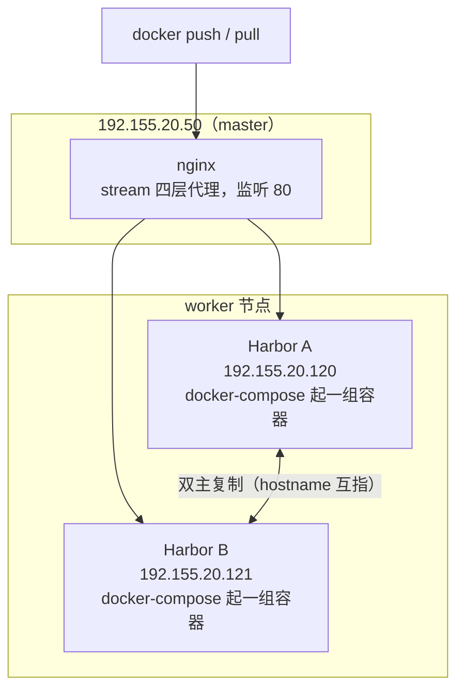

# Harbor 高可用部署（上）：两个 worker 节点安装 Harbor 并挂 nginx 负载均衡

## 纲要

- 拓扑定下来：两个 worker 节点各装一个 Harbor，master 50 上跑 nginx 做负载均衡
- 解压 Harbor 1.6.0 离线包，编辑 harbor.cfg
- hostname 必须写成本节点 IP，不能写域名：双主复制要靠 hostname 找对端
- ui_password 改掉默认密码，邮件、数据库、redis 配置先不动
- docker-compose.yml 里所有 `/data` 卷要落到空间最大的目录，必要时做软链接
- 离线装 docker-compose：改名到 /usr/local/bin 并给可执行权限
- 两个节点分别执行 install.sh，绿色提示即安装成功
- 在 master 上拉 nginx:1.13.12 镜像，写一份 stream 四层代理配置指到 Harbor B

## 拓扑

前面定的是双主复制方案，现在把它落地。这一次的机器角色是：

| 机器 | IP | 角色 | 跑什么 |
| --- | --- | --- | --- |
| 第一台 master | 192.155.20.50 | master | 用 kubeadm 操作集群的主节点，稍后装 nginx 做负载均衡 |
| worker | 192.155.20.120 | worker | **安装 Harbor A** |
| worker | 192.155.20.121 | worker | **安装 Harbor B** |

即在两个 worker 节点上去安装 Harbor，双主复制的高可用方案；两个都装完成之后，再在 50 这个 master 节点上去部署一个 nginx。



## 第一步：在 120 上装 Harbor A

安装文件（1.6.0 版本的离线安装包）在 120 和 121 上都事先下载好了。先解压，解压完成得到一个 `harbor` 文件夹，进入这个文件夹，看到有一个配置文件是 **harbor.cfg**，需要先去编辑它。

> 版本是 1.6.0，不用管。

### 关键配置：hostname 写 IP 而不是域名

第一项就是 hostname，这里需要把它改成**当前 worker 节点的 IP 地址**。这里可能有人会疑惑：为什么不改成域名而改成了一个 IP 呢？

因为用的是**双主复制**，如果都配置成域名的话，域名到底解析到哪一个点呢？并且在复制的时候，还是要通过这个 hostname 去复制的——如果是同样的话，他就找不到这个 hostname 对应的另外一个节点了。

```bash
cd /opt && tar -xf harbor-offline-installer-v1.6.0.tgz && cd harbor
vi harbor.cfg
```

```text
# harbor.cfg 关键项
hostname = 192.155.20.120        ← 本节点 IP，不要写域名
ui_url_protocol = http           ← 用 HTTP 即可，证书先不管
# email 相关配置：本次不用管
harbor_admin_password = Harbor12345   ← UI 登录的 admin 密码
# db_password / redis 相关：保持默认，勿改
```

往下翻：证书这块不用管；邮件配置也不用管；最下边有一个 **harbor_admin_password**，就是 UI 界面登录的那个密码，可以通过这个值去修改那个密码；再下边是一些 dbpassword 的配置，跳过——后面还有一些数据库和 Redis 的配置，也不用修改。其他配置应该没有什么要修改的了，保存一下。

### 看 docker-compose.yml 的挂卷

然后还要看一个文件，就是最主要的 **docker-compose.yml**——它配置了 Harbor 相关的所有镜像。这里要看一个点是它的 **volume**：它的 volume 大部分都是 `/data` 开头的，也就是说 Harbor 要存储镜像，它要有一个存储的位置；下面包括很多配置、数据库等等一些配置都是 `/data` 开头的。

所以要考虑一件事：要把 `/data` 这个目录放到当前磁盘**具有最大空间**的目录去。看一下当前磁盘情况——最大的一个磁盘挂载到了根目录，两百多个 G，所以本环境不需要做什么修改。如果自己的环境里磁盘最大空间没有挂载到根目录下、而是其他目录，就需要通过 `ln -s` 给这个根目录的 `/data` 做一个**软链接**，把它连到磁盘空间最大的那个目录去就可以了。

修改完配置之后，就可以执行 `install.sh` 了。

### 补一个 docker-compose

执行时它报了个错：`no such docker-compose`——也就是这个环境还需要去安装一下 docker-compose。由于 docker 现在的网络问题，如果按照官方的方式去安装 docker-compose 可能会出现一些问题，所以事先准备了一份离线文件。

把下载好的 `docker-compose` 文件 `mv` 到 `/usr/local/bin` 下边，并下边的 docker-compose 这个文件名改成 `docker-compose`（注意别把文件名搞错了），改完之后给一个可执行权限。同样命令在另外一个 worker 节点也执行一下。

```bash
mv docker-compose /usr/local/bin/docker-compose
chmod +x /usr/local/bin/docker-compose
docker-compose --version
# docker-compose version 1.22.0, build c4b3b8
```

装完成之后验证一下，两个节点都执行 `--version` 没问题，再重试安装：

```bash
cd /opt/harbor
./install.sh
```

第一次安装有一个加载镜像的过程，可能要稍微等待一会儿——虽然提前装过离线包，它还是要把相关的镜像文件解压缩之类的，也是有些耗时的。出现**绿色的提示**就说明 Harbor 已经正常安装了。

```bash
docker-compose ps
#          Name                    State    Ports
# harbor_nginx_1                  Up      0.0.0.0:80->80/tcp
# harbor_registry_1               Up
# harbor_postgresql_1             Up
# harbor_redis_1                  Up
# harbor_jobservice_1             Up
# harbor_harbor-ui_1              Up
# harbor_harbor-log_1             Up
```

通过 admin 的这个地址去看一看 Harbor 是不是正常打开——浏览器输入这个地址，看到很熟悉的界面，就是前面讲解时通过 demo 看到的那一个，一模一样。

```bash
curl -I http://192.155.20.120      # HTTP/1.1 200 OK
```

## 第二步：在 121 上装 Harbor B

下面把 121 这台机器也给它装好 Harbor。它的 harbor.cfg 文件也改掉——改成 192.155.20.121，然后后面好像没有什么需要修改的了。保存一下，再执行一遍 install.sh，这一台也顺利地启动了。

然后也去浏览器验证一下，只要把 IP 改成 121 就可以了。这两个点都是可以的，Harbor 两个点都装完了。

> 注意：**hostname 一定要各自写成自己那台的 IP**，两台都填同一个域名，后面的双主复制会找不到对端。

## 第三步：在 master 50 上部署 nginx 负载均衡

接下来把 nginx 布上去。先建一个目录叫 `nginx`，把相关的东西放到这儿。怎么运行 nginx 呢？用 docker 是不是比较方便？去找一个镜像，到阿里云上搜一下 nginx，来源选择 Docker Hub，找第一条认证的、版本比较新的用这个——**nginx 1.13.12**。

```bash
mkdir -p /opt/nginx/conf && cd /opt/nginx
docker pull nginx:1.13.12
```

下载的时候默认从 Docker Hub 下载，目前速度还可以接受；下载比较慢的话可以自己配置一个阿里云加速器。

### 编辑 nginx.conf

下载了镜像之后，编辑一份 nginx 配置：

- 指定一个 `worker_processes`，就给它指定 1
- 指定一个错误的目录（error log）
- 指定一个 pid 文件（/var/run/nginx.pid）
- 定义一个 worker 的最大连接数 `worker_connections` 1024
- 然后**定义一个 stream 模块**，里面有一个 upstream 叫 **hub**，然后有一个 server，就随便选一个 server——192.155.20.121，80 端口
- 当这个 server 出问题的时候，可以及时把它修改为另外一个 server
- 然后 server 部分 listen 80 端口，定义 `proxy_pass` 就是 harbor（即那个 upstream hub）
- 再定义几个超时：`proxy_timeout` 300 秒，`proxy_connect_timeout` 5 秒

```nginx
worker_processes 1;

error_log /var/log/nginx/error.log warn;
pid /var/run/nginx.pid;

events {
    worker_connections 1024;
}

stream {
    upstream hub {
        server 192.155.20.121:80;
        # 当这个 server 出问题的时候，可以及时把它修改为另外一个 server
    }

    server {
        listen 80;
        proxy_pass hub;
        proxy_timeout 300s;
        proxy_connect_timeout 5s;
    }
}
```

这份配置是 **stream（四层）代理**，正好符合 Harbor 这种只需要转发「到一个 IP:80」的场景：比七层 `http` 块更省资源，而且后面换上游heartbeat只要改 upstream 里那一行。

## 装完之后机器上的目录长这样

```text
worker 节点（192.155.20.120 / 121）
├── /opt
│   ├── harbor
│   │   ├── harbor.cfg              改过：hostname = 本机 IP
│   │   ├── docker-compose.yml      看了 volume：多数是 /data 开头
│   │   ├── harbor.v1.6.0.tar.gz    离线镜像包
│   │   ├── prepare
│   │   └── install.sh
│   └── nginx                       仅 50 上有
│       └── conf/nginx.conf         stream 四层代理配置
├── /usr/local/bin/docker-compose
└── /data（或指向空间最大目录的软链接）       镜像 + 数据库都落在这
    └── database  registry  job_logs  ...
```

master 节点（192.155.20.50）上除了 nginx 配置，还有 kubeadm 相关的操作入口：

```text
192.155.20.50
├── /opt/nginx/conf/nginx.conf     ← harbor 的 stream 代理
└── ~/.kube/config                 ← 操作集群用的 kubeconfig
```

## API 速览

| 能力 | 做法 | 说明 |
| --- | --- | --- |
| 看磁盘 biggest 挂载点 | `df -h` | 决定 `/data` 往哪落 |
| 给 /data 换位置 | `ln -s /bigdisk/harbor-data /data` | compose 里写的还是 /data |
| 看 compose 挂了哪些卷 | `grep data docker-compose.yml` | 镜像、数据库都在 /data 下 |
| 装 docker-compose | `mv <file> /usr/local/bin/docker-compose && chmod +x` | 离线文件改名别写错 |
| 起 Harbor | `cd harbor && ./install.sh` | 出绿色提示即成功 |
| 看 Harbor 容器状态 | `docker-compose ps` | Up 的才是真起来了 |
| 验证 Harbor 可访问 | `curl -I http://<ip>` | 200 即 UI 正常 |
| 起 nginx 代理 | `docker run -p 80:80 -v /opt/nginx/conf:/etc/nginx/nginx.conf` | 用容器跑最省事 |
| 看 nginx 上游连通 | `docker logs <nginx容器>` | 连接失败会打到 error log |

## Demo 示例

把两个节点的安装与 nginx 代理一条条跑通，最后用代理地址推一次镜像。

**第一步：120 上装 Harbor A**

```bash
tar -xf harbor-offline-installer-v1.6.0.tgz && cd harbor
vi harbor.cfg
# hostname = 192.155.20.120
# harbor_admin_password = <自己的密码>

# 磁盘最大的挂载点不在根分区时，先做软链接
df -h
ln -s /bigdisk/harbor-data /data

# 装 compose（离线包）
chmod +x docker-compose && mv docker-compose /usr/local/bin/
docker-compose --version

./install.sh                      # 等镜像解压，出绿色提示即成功
curl -I http://192.155.20.120 | head -1
# HTTP/1.1 200 OK
```

**第二步：121 上装 Harbor B（只改 hostname）**

```bash
tar -xf harbor-offline-installer-v1.6.0.tgz && cd harbor
vi harbor.cfg
# hostname = 192.155.20.121     ← 关键：各自写自己的 IP
./install.sh
curl -I http://192.155.20.121 | head -1
# HTTP/1.1 200 OK
```

**第三步：50 上起 nginx**

```bash
mkdir -p /opt/nginx/conf && cd /opt/nginx
vi conf/nginx.conf                # 上面那份 stream 配置
docker pull nginx:1.13.12
docker run -d --name harbor-proxy -p 80:80 \
  -v /opt/nginx/conf/nginx.conf:/etc/nginx/nginx.conf \
  --restart=always nginx:1.13.12

docker ps | grep harbor-proxy
curl -I http://192.155.20.50 | head -1     # 代理也能通
```

**第四步：切到入口地址推一次镜像**

```bash
docker login 192.155.20.50                 # 走的是 nginx 代理的 80
docker tag busybox:1.30 192.155.20.50/library/busybox:1.30
docker push 192.155.20.50/library/busybox:1.30
```

此时镜像已经落到 120 上；如果不放心，可以直接登录 121 的 UI 看一下项目里有没有这个镜像——没有的话正好用来做下一节的双主复制验证。

### 总结

- 拓扑是「两个 worker 各一个 Harbor（120 / 121）+ master 50 上一个 nginx 代理」，Harbor 之间做双主复制。
- 安装从解压 Harbor 1.6.0 离线包开始，核心编辑对象是 harbor.cfg。
- hostname 必须写成本节点 IP 而不是域名——双主复制要靠 hostname 找到对端，写同一个域名会复制失败。
- ui_url_protocol 用 http 即可（证书先不管），邮件、数据库、Redis 配置保持默认，只改 harbor_admin_password。
- docker-compose.yml 里几乎全部卷都以 /data 开头，要把 /data 放到空间最大的挂载点，否则用 ln -s 做软链接。
- install.sh 报错是缺 docker-compose，离线文件 mv 到 /usr/local/bin 并改名、加可执行权限即可，两个节点都要装。
- install.sh 首次执行要解压离线镜像，耗时长，出绿色提示才算成功；之后用 docker-compose ps 与 curl -I 验证 UI。
- 两节点都装好后，master 上用 docker 跑一个 nginx:1.13.12，写一份 stream 四层代理配置：upstream hub 指向 121:80、listen 80、proxy_timeout 300s、proxy_connect_timeout 5s。
- upstream 里的 server 是可以随时替换的（坏一台就改成另一台 IP），这正是双主复制方案在代理层留下的余量。

