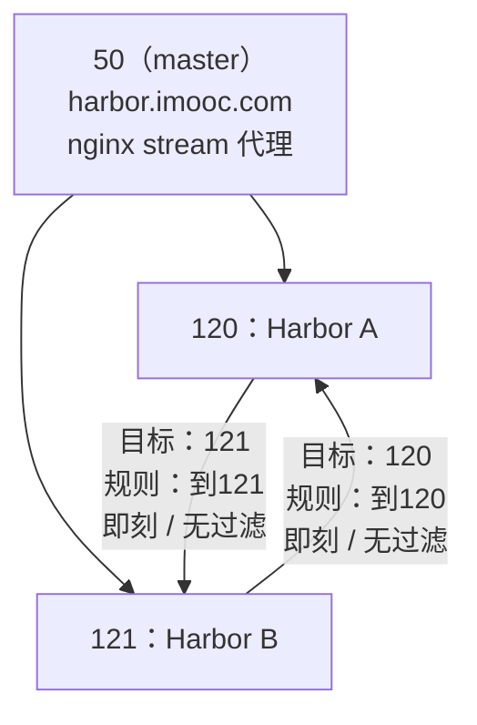

# Harbor 高可用部署（下）：restart 脚本、域名访问、推送用户授权与双主复制规则

## 纲要

- 给 nginx 写一份 restart.sh：停容器、删容器、以 host 网络重新挂载配置启动
- 用域名而不是 IP 访问 Harbor：本地 hosts 把 harbor.imooc.com 绑到 50
- 删掉默认的 library 公开仓库，新建一个业务项目
- 命令行 push 前的两道关：daemon.json 加 insecure-registries + 建一个可推送的用户
- 用户创建后在项目成员里给「开发人员」角色才有 push 权限
- 到另一个节点 pull 也要配 hosts 与 insecure-registries
- 双主复制落地：先建仓库管理里的「目标」，再在项目里建「复制规则」
- 复制的三种过滤器（仓库 / tag / label）与三种触发模式（手动 / 即刻 / 定时）
- 两边互建规则，对称复制；已存在的镜像只比对签名不重复传输
- Harbor 高可用准备工作到此全部完成

## 第一步：给 nginx 写一份 restart 脚本

四层代理的配置写完了。启动的话最好有个脚本，就是 restart 脚本：

- 首先要把这个容器停掉：`docker stop`（容器名叫 harbor-nginx）
- 然后再把它删掉：`docker rm harbor-nginx`
- 然后就可以 `docker run -d`，指定一个 host 模式，指定一个名字叫 harbor-nginx
- 把配置挂载上去：把 `/root/ngx/nginx.conf` 挂载到容器里边的 nginx 默认配置位置 `/etc/nginx/nginx.conf`
- 镜像版本就是 nginx 1.13.12

```bash
cat > /root/restart.sh <<'EOF'
#!/bin/bash
docker stop harbor-nginx
docker rm harbor-nginx
docker run -d --name harbor-nginx --restart=always --network host \
  -v /root/ngx/nginx.conf:/etc/nginx/nginx.conf \
  nginx:1.13.12
EOF
chmod +x /root/restart.sh
bash /root/restart.sh
docker logs harbor-nginx 2>&1 | tail -5        # 没有报错日志
```

## 第二步：用域名访问 Harbor

五零是可以正常访问的。但是通过 IP 访问肯定不是一个好的方式，最好是去配置一个域名：在本地给它绑一个 hosts，绑定到五零上，域名就叫做 **harbor.imooc.com**。然后就可以用这个域名去访问了。

```bash
# 各台机器的 /etc/hosts
192.155.20.50  harbor.imooc.com
```

```bash
curl -I http://harbor.imooc.com | head -1
# HTTP/1.1 200 OK
```

## 第三步：清理默认仓库并新建项目

登录进去看一看里面的仓库。里面有一个 library 是公开的、默认的一个仓库，把它删掉，没有什么用。

然后去新建一个项目，项目的名字就叫 **imooc**。内网是没有关系的，谁都可以 push，所以创建这个项目时直接允许任何人推送。

```bash
# UI 操作：项目 → 新建项目 → 名称 imooc → 访问级别（内网可公开）
```

## 第四步：命令行 push

接下来尝试用命令行给这个项目 push 一个镜像上来，看能不能成功。在 50 上先得有一个镜像，把这个 nginx:1.13.12 打一个 tag：打成 `harbor.imooc.com/imooc/nginx:1.13.12`。

这个域名也得配一个 hosts——编辑 hosts 文件，把 50 配置为 harbor.imooc.com，然后去试一下能不能 push 上去。

```bash
docker tag nginx:1.13.12 harbor.imooc.com/imooc/nginx:1.13.12
```

```text
$ docker push harbor.imooc.com/imooc/nginx:1.13.12
The push refers to a repository [...]
Get https://harbor.imooc.com/v2/: dial tcp ...:443       ← 443 报出来肯定不对
```

因为我们用的是 HTTP 的 Harbor，所以还要对 docker 做一个配置：编辑 docker 的配置文件 `/etc/docker/daemon.json`，如果不存在就新建一个；文件格式是 json，在里面用到了一个 **`insecure-registries`**——意思是允许通过 HTTP 来访问的这个镜像仓库，它是一个**数组**，可以有很多项；这里只有一个 harbor.imooc.com 配置这一项就可以了。

```json
{
  "insecure-registries": ["harbor.imooc.com"]
}
```

配置完之后需要重启一下 docker 服务。重启完之后 nginx 容器是不是停掉了？还要把 restart 脚本跑一下，把 nginx 起回来，然后再去尝试 push：

```bash
systemctl restart docker
bash /root/restart.sh
docker push harbor.imooc.com/imooc/nginx:1.13.12
```

```text
denied: requested access to the resource is denied     ← 因为没有登录
```

这回报了 `request access denied`，因为我们没有登录。那 `docker login` 以什么样的用户登录呢？现在只有一个 admin 用户，可以先去里面管理一下用户：**用户管理**可以创建一个用户，比如说就叫 **pusher**，专门是 push 用的——随便写一个密码（太短不行），保存一下。

然后在这个项目里边，它的成员有一个概念：我可以给它加一个叫 pusher，他作为**开发人员**，开发人员是有 push 权限的。

```text
系统管理 → 用户管理 → 新建用户
  用户名：pusher
  密码：……（不要用太短的密码）
项目 imooc → 成员 → 添加 pusher，角色选「开发人员」
```

接下来就可以使用这个用户去 push 镜像了：

```bash
# 密码不写进命令历史，用环境变量
read -rsp 'Harbor password: ' HARBOR_PWD && echo
docker login harbor.imooc.com -u pusher -p "$HARBOR_PWD"
# Login Succeeded

docker push harbor.imooc.com/imooc/nginx:1.13.12
# 这回是正常的，push 过程中还复制成功了（镜像同步完成）
```

## 第五步：到另一个节点 pull

再去另一个节点——去 120 或者 121 上给它 pull 一下，看能不能拉下来——也需要配一个 host（192.155.20.50  harbor.imooc.com）。

```bash
echo "192.155.20.50 harbor.imooc.com" >> /etc/hosts
cat > /etc/docker/daemon.json <<'EOF'
{
  "insecure-registries": ["harbor.imooc.com"]
}
EOF
systemctl restart docker
```

```text
$ docker pull harbor.imooc.com/imooc/nginx:1.13.12
Error response from daemon: ... insecure ...        ← daemon.json 没生效/没重启干净
```

`sirius docker start` 这个启动时间有点长——因为 worker 节点上面运行了很多 Kubernetes 的东西，需要等一会儿。121 上目前 Harbor 还没有启动完，因为 docker 刚才是重启了，所以再稍等一会儿再试一次：

```bash
docker start harbor-nginx
sleep 20
docker pull harbor.imooc.com/imooc/nginx:1.13.12
# nginx:1.13.12: Pulling from imooc/nginx
# Digest: sha256:...   Status: Downloaded newer image ...
```

这回可以正常地 pull 了。push 基本的操作都可以正常运行了。

## 第六步：配置双主复制

push、pull 都能跑，就去再配置一个双主复制。双主复制要分别访问两个地址——访问一下 120，再开一个窗口访问 121。目前在 121 上已经有一个仓库并且下边有个 nginx 的镜像，可以在这个**项目**里边、**复制**这个菜单里发现目前的复制规则，并且可以新建。

### 先建「目标（destination）」

新建之前要先有一个目标，也就是说要同步到什么位置。可以在左边的**仓库管理**这边去新建目标：目标名叫做 **120**，地址填 192.155.20.120，用户名密码要提供（admin / Harbor12345），然后**测试一下**——连接成功没有问题，这个目标就管理完了。

### 再在项目中建复制规则

回到项目下边，在它里面的**复制**里新建一个规则，名字就叫「到 120」。这里有个镜像的过滤器——之前讲概念的时候说过有三个过滤器：一个是**仓库**，一个是 **tag**，一个是 **label**。如果**不选择任何过滤器**，就相当于是这个项目下边的所有的镜像都会去同步，不会做任何过滤。

然后选一个目标，再选触发模式：**手动、即刻、定时**三种，这里选择**即刻**；并且同时勾选「删除本地镜像的同时也会去同步删除远程的镜像」。保存一下。

```text
项目 imooc → 复制 → 新建规则
  规则名称：到120
  镜像过滤器：（不选 = 同步该项目下全部镜像；也可按 仓库 / tag / label 过滤）
  目标：120（192.155.20.120）
  触发模式：即刻（手动 / 即刻 / 定时）
  其他：开启「删除远程镜像同步」
```

### 看任务状态

然后可以看到这个列表里多了一个复制的规则——规则可以有很多个，也就是可以有多个点。点进这个「到 120」规则可以看到当前的一些状态：它的任务应该是 finish 了，有 transferred 数量、开始时间、完成时间。

到 120 上去刷新一下，发现这个项目已经有了，多了一个镜像。

### 反向也建一份

同样的，在 120 上也要去创建一个目标、创建一个复制规则，名称就叫「到 121」，测试一下没有问题；同样在项目里边去给它添加一个复制的规则，目标选择「到 121」，触发模式更新、即刻，保存。

看一下这个效果——应该已经完成了：因为在 121 上已经存在这个仓库和这个镜像，并且跟这一个是**一模一样的**，所以**它不会发生真正的传输，只会去比对一下这个镜像的签名，发现一样就不会再做额外的工作了**。



到这里，第一个准备工作——高可用 Harbor 就全部完成了，下一节就开始其他的工作。

## 推送与复制的关键点

| 环节 | 踩到的坑 | 正确做法 |
| --- | --- | --- |
| 域名解析 | 直接用 IP 访问 | hosts 里把 harbor.imooc.com 指向 50（nginx 代理） |
| 协议 | push 报 443 | Harbor 走 HTTP，daemon.json 加 `insecure-registries` |
| 生效 | 改完配置不生效 | 重启 docker 后要把 nginx 容器用 restart.sh 拉起来 |
| 权限 | push 报 access denied | 建 pusher 用户 → 在项目成员里给「开发人员」角色 |
| 拉取 | 另一个节点 pull 也报 insecure | 同样配 hosts + daemon.json，并等 docker 与 Harbor 完全起来 |
| 复制 | 直接建规则会找不到对端 | 先在仓库管理里建「目标」并测试连接，再建复制规则 |

## 三个节点的配置落点

```text
50（master）
├── /etc/hosts                  → 192.155.20.50  harbor.imooc.com
├── /etc/docker/daemon.json     → insecure-registries
├── /root/restart.sh            → stop/rm/run harbor-nginx
└── /root/ngx/nginx.conf        → stream upstream hub + listen 80

120（Harbor A）
├── /etc/hosts /etc/docker/daemon.json   同上
├── harbor.cfg                  → hostname = 192.155.20.120
└── /data                       镜像与数据库落盘位置

121（Harbor B）
├── /etc/hosts /etc/docker/daemon.json   同上
├── harbor.cfg                  → hostname = 192.155.20.121
└── /data                       镜像与数据库落盘位置
```

三个节点上「同样的 hosts + 同样的 insecure-registries」，是后面镜像能在任意节点 pull 到的前提——缺了哪一台，那台的 docker 就会拒绝非 HTTPS 的注册表。

## API 速览

| 能力 | 做法 | 说明 |
| --- | --- | --- |
| 重启 Harbor 代理 | `bash /root/restart.sh` | stop + rm + run（host 网络） |
| 看 nginx 有没有起 | `docker logs harbor-nginx` | 无报错才往下走 |
| 域名解析 | 各节点 `/etc/hosts` 加 `192.155.20.50 harbor.imooc.com` | 生产上换正式 DNS |
| 允许 HTTP 仓库 | `/etc/docker/daemon.json` 的 `insecure-registries` | 数组，可多项 |
| 建推送用户 | UI：系统管理 → 用户管理 → 新建 | 别用太短的密码 |
| 给推送权限 | UI：项目 → 成员 → 角色选「开发人员」 | 只有该角色才有 push 权 |
| 登录验证 | `docker login harbor.imooc.com -u pusher` | 出 Succeeded 再 push |
| 手动同步 | UI：项目 → 复制 → 新建规则（即刻） | 也可手动触发已建规则 |
| 看复制任务 | 点开规则看 transferred / 开始 / 完成时间 | finish 才是成功 |

## Demo 示例

把 push、pull、双主复制三条线一次跑通。

**第一段：代理启动与域名**

```bash
bash /root/restart.sh
echo "192.155.20.50 harbor.imooc.com" >> /etc/hosts
curl -I http://harbor.imooc.com | head -1
# HTTP/1.1 200 OK
```

**第二段：推一个镜像进 imooc 项目**

```bash
docker tag nginx:1.13.12 harbor.imooc.com/imooc/nginx:1.13.12

# ① 允许 HTTP 仓库
cat > /etc/docker/daemon.json <<'EOF'
{ "insecure-registries": ["harbor.imooc.com"] }
EOF
systemctl restart docker
bash /root/restart.sh              # docker 重启会把 nginx 容器带走，重新拉起

# ② 用有权限的用户登录
docker login harbor.imooc.com -u pusher -p '<密码>'
# Login Succeeded

docker push harbor.imooc.com/imooc/nginx:1.13.12
# 1.13.12: digest: sha256:xxxx size: 952
```

**第三段：另一个节点拉下来**

```bash
echo "192.155.20.50 harbor.imooc.com" >> /etc/hosts
cat > /etc/docker/daemon.json <<'EOF'
{ "insecure-registries": ["harbor.imooc.com"] }
EOF
systemctl restart docker
docker start harbor-nginx
sleep 20                            # worker 上 k8s 组件多，docker 起来慢
docker pull harbor.imooc.com/imooc/nginx:1.13.12
# Status: Downloaded newer image for harbor.imooc.com/imooc/nginx:1.13.12
```

**第四段：两边互配复制规则**

```bash
# 121 上（也可用 120 同法）
# 1) 仓库管理 → 新建目标：名称 120，地址 192.155.20.120，admin/Harbor12345，测试连接
# 2) 项目 imooc → 复制 → 新建规则：到120，过滤器留空，目标 120，触发模式「即刻」
# 3) 点开规则看状态 → finish，transferred = N

# 120 上
# 1) 仓库管理 → 新建目标：名称 121，地址 192.155.20.121
# 2) 项目 imooc → 复制 → 新建规则：到121，目标 121，即刻
# 3) 回到 121 刷新：项目与镜像都已在，且不会再重复传输（比对签名一致即跳过）
```

配置完之后做一次故障演练也不难：把 120 上 Harbor 停掉，继续用 `harbor.imooc.com` push，请求会被 nginx 落到 121 上完成——因为两个点各有全量镜像，数据不丢、入口不断。

### 总结

- nginx 代理用 restart 脚本管理：先 `docker stop / rm harbor-nginx`，再 `docker run -d --network host` 并把 nginx.conf 挂到 `/etc/nginx/nginx.conf`，镜像用 nginx:1.13.12。
- 访问入口用域名 harbor.imooc.com 而不是裸 IP，各节点在 /etc/hosts 里把域名指向 50（生产环境换正式 DNS）。
- 默认那个公开的 library 仓库删掉没用，新建一个业务项目（imooc）并允许内网任何人推送。
- 命令行 push 必须先解决两件事：一是 daemon.json 里加 `insecure-registries`（Harbor 是 HTTP，否则会去连 443 报错），二是建一个专用用户并在项目成员里给它「开发人员」角色，否则就是 access denied。
- docker 重启会把 nginx 容器一起带走，重启后要重新跑 restart.sh，这是本段最容易漏的一步。
- 到另一个节点 pull 同样要配 hosts 与 insecure-registries；worker 节点上跑了很多 Kubernetes 负载，docker 与 Harbor 完全起来需要多等一会儿。
- 双主复制的顺序是固定的：先到「仓库管理」建目标（地址 + 用户名密码 + 测试连接），再到「项目 → 复制」建规则。
- 复制规则可以按仓库、tag、label 三种过滤器 filtering；不勾选即同步项目下全部镜像；触发模式有手动、即刻、定时三种，这里选即刻，并开启删除同步。
- 反向在 120 上也建一份到 121 的目标与规则，形成对称双写；已存在的相同镜像只会比对签名、不重复传输。
- 至此高可用 Harbor 的全部准备工作完成：两个节点各自全量存镜像 + nginx 四层代理做统一入口，坏一个还有另一个顶着。

