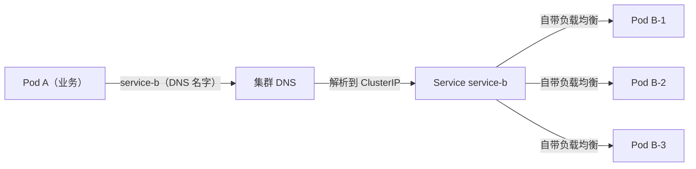
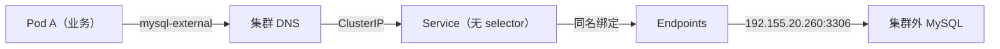
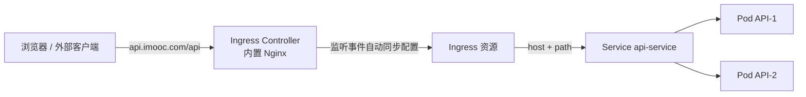

## 纲要

- 业务迁移到集群之前，必须先想清楚服务之间如何通讯、如何彼此发现
- 服务通讯一共三种场景：集群内互访、集群内访问集群外、集群外访问集群内
- 集群内互访第一方案：ClusterIP 提供虚拟 IP 与自带负载均衡，DNS 用名字访问 Service
- 集群内互访第二方案：headless Service 不轮询、不负载均衡，把 Pod 列表直接返回给客户端
- 集群内访问集群外：无 selector 的 Service 搭配同名 Endpoints，形成 external service
- 集群外访问集群内三个入口：NodePort、LoadBalancer、Ingress
- NodePort 与 LoadBalancer 的本质区别是端口开在全部节点还是仅实例所在节点
- Ingress 用域名加路径描述转发关系，由 Ingress Controller 监听事件自动同步 Nginx 配置

## 迁移之前必须先想清楚的一件事

把一个已有的业务搬进集群，最直观的做法是把原来跑在物理机上的进程塞进容器，端口、启动脚本照搬。可是一旦跑起来就会发现一件事：过去写死在配置里的那个 IP，在集群里根本就不存在了。

Pod 是被调度器动态放进节点的，重建就要换节点，换节点 IP 就变。老系统里靠 IP 直连的那套东西，到了集群里全都失效。所以真正动手迁移之前，得先回答一个问题：这些服务彼此之间到底怎么找到对方、怎么访问对方。

答案是把通讯拆成三种场景来看。只要这三种场景都有对应的技术方案，剩下形形色色的调用关系都能一一对应上去。

| 场景 | 流量方向 | 典型需求 | 集群提供的方案 |
| --- | --- | --- | --- |
| 一 | 集群内 → 集群内 | Pod A 调 Pod B | ClusterIP + DNS；headless Service |
| 二 | 集群内 → 集群外 | 访问已有的 MySQL | IP 直连；external service（Service + Endpoints） |
| 三 | 集群外 → 集群内 | 浏览器访问业务 | NodePort；LoadBalancer；Ingress |

下面按这三种场景逐个拆开看，Kubernetes 为每一类问题准备了什么。

## 场景一：集群内部服务之间怎么互相访问

假设容器 A 里跑着业务，它要调用另一个服务 B，B 也是 Pod。最朴素的做法是把 B 的 Pod IP 写进 A 的配置里，直接访问。这条路走得通，但 Pod IP 是不稳定的，随时会因为重建而变，所以肯定不是一个能用的办法。

集群给出的第一个方案是 Service。Service 拿着一个 ClusterIP，这是一个虚拟 IP，它可以指向后面的多个 Pod。容器 A 通过 Service IP 访问，Service 自带负载均衡，把请求分发到 B 的各个副本上。这么做的好处是 ClusterIP 相对固定，B 怎么重启都无所谓，只要 Service 还在，它的 IP 永远不变。

但把 Service IP 直接写进程序配置，同样不够优雅。于是又在 Service 之上加了一层 DNS，让应用可以通过 Service 的名字去访问。程序里写的是 Service 的名字，DNS 把它解析成 ClusterIP，再落到具体 Pod 上。这一套方案可以概括为 **DNS + ClusterIP**。



不过这套方案有个前提：负载均衡得由 Service 来做，Pod 之间不能有交互。一旦遇到两种情况它就力不从心了：

- 需要自定义负载均衡策略，比如按权重、按区域、按灰度比例分发
- 多个实例之间有交互，典型的是有中心化选举的应用，它们要彼此通讯选出一个主节点。这种应用必须知道自己到底有哪些实例，Service 直接把它负载均衡到一个副本上，剩下两个就失联了

针对这种情况，集群提供了另一种服务发现方案：headless Service。它的特点很直接——**不帮你轮询，也不帮你负载均衡**。客户端去访问这个 Service 的时候，DNS 直接把后面具体的 Pod 列表（也就是 endpoints）返回给客户端，客户端拿到这一串地址之后自己去负载均衡，或者按自己的策略挑一个。

名字里的 headless 是"无头"的意思，也就是没有那个统一的虚拟入口。它常用在这些场景：Elasticsearch、Kafka、ZooKeeper 这类需要在客户端感知全部实例的中间件，以及需要按客户端地域就近访问的场景。

两种方案的差异，一眼能看明白：

| 对比项 | ClusterIP Service | headless Service |
| --- | --- | --- |
| 是否有虚拟 IP | 有，ClusterIP | 无，clusterIP 为 None |
| 查询返回的 | 一个 ClusterIP | 后端 Pod 的全部 IP（endpoints） |
| 谁来做负载均衡 | Service（kube-proxy） | 客户端自己做 |
| DNS 记录形态 | A 记录指向单 IP | 多条 A 记录，或 SRV 记录 |
| 适合的业务 | 无状态、无交互的业务 | 有中心化选举、需感知实例列表的应用 |
| 典型中间件 | 普通 Web 服务、API | Elasticsearch、Kafka、 ZooKeeper |

## 场景二：集群内部的服务要访问集群外部

现实里不会所有依赖都迁进集群。比如有一套 MySQL 还跑在集群外的物理机上，地址是 `192.155.20.260`，集群里的 Pod 要访问它。

第一种做法最省事：直接在 Pod 里写 `IP:3306` 去连，也就是 `192.155.20.260:3306`。这跟迁移之前完全一样，也是最直观的方式。缺点是外部地址一旦变了，程序要改配置重新发版。

第二种做法可以把外部服务伪装成集群内的服务来用。做法是定义一个 Service，但它**不通过 label selector 去挑选集群内的 Pod**——selector 留空，让它是个空的 Service。然后手动定义一个叫 Endpoints 的对象，名字跟 Service 一模一样，两者靠名字绑定。Endpoints 里配的不是 Pod，而是一个具体的外部服务地址，比如 `192.155.20.260:3306`。

Pod 通过 DNS 找到这个 Service、找到 ClusterIP，再落到对应的 Endpoints 上。于是应用配置里可以像访问集群内服务一样只写一个名字。后端 MySQL 真要换地址了，只要去改集群里的 Endpoints，应用程序一行代码都不用改。

对 Pod A 来说，它完全感知不到这是一个集群外部的服务，访问方式和访问内部服务一模一样。这个方案一般称为 **external service**，也有人叫它 externalName 那一类的出向引流做法。



注意 Endpoints 需要自己维护，后面章节里也会提到 `ExternalName` 类型和 `EndpointSlice` 的自动维护方式；如果外部地址本身会变，自己手写 Endpoints 维护起来就略麻烦，这是手动方案固有的代价。

## 场景三：集群外部怎么访问集群内部

这是最常见也最重要的一类。集群外面有个客户端，要访问集群里跑的服务，比如浏览器访问一个域名。

### NodePort

第一种入口是 NodePort，它是 Service 的一种类型。前面说的 Service 只有一个 ClusterIP，NodePort 不一样，它在**每一个物理节点上都暴露一个端口**，比如 30080。集群里任何一个节点上都有这个端口，客户端请求任意一个节点的 30080，都会被转发到最终的服务上。

这种方式现在用得已经很少了，除非是非常特殊的服务。原因有三条：

- 每个节点都占一个端口，服务一多端口就不够用
- 多了一层转发，链路变长
- 客户端并不知道该访问哪个节点，虽然哪个节点都能通，但它得自己挑一个，配置负担落在业务侧

所以在生产环境里很少这么用。

### LoadBalancer

第二种入口同样是一个 Service，也会在节点上开一个类似的端口。它跟 NodePort 的区别只有一条：**NodePort 在所有节点上都开，LoadBalancer 只做简单的端口映射，服务跑在哪台机器上，就在那台机器上开这个端口**。只有一个实例，就只会在一台机器上开出来；客户端也只知道去访问这台机器的对应端口。

如果实例扩到三个，那三台机器上各有一个映射端口，客户端得自己做选择。这就是它俩最主要的区别：一个是"全部节点都有"，一个是"实例所在节点才有"。

### Ingress

第三种场景才是日常真正面对的：浏览器访问一个域名，这个域名要解析到集群里的服务上。

按前面的思路，可以手动在集群的任意一个节点上部署一个 Nginx，写好配置文件，把域名和后端 Pod 的 IP、端口都配上。请求打进来先到 Nginx，Nginx 在集群内部可以访问所有的 Pod IP，于是能正常返回。

问题在于 Pod 经常变、域名也可能不断增加，每次都要改配置、再 reload 重启，这个过程既复杂又麻烦。可这样的需求是切实存在的，于是集群提出了 **Ingress** 这个概念。

Ingress 的思路是把"怎么转发"这件事抽象成一条配置，交给用户来声明：

- 配一个域名 host，比如 `api.imooc.com`
- 在这个域名下再配一个路径 path，比如 `/api`
- 声明这个路径下的请求要转发给哪个 Service

也就是说告诉集群：哪个域名、哪个路径、落到哪个 Service 上，把这层对应关系建起来。真正做域名解析和七层转发的是 **Ingress Controller**。Controller 跑在集群里，能拿到所有 Service 后面挂着的 Pod，它通过监听集群事件来感知 Ingress 的变化、Pod 的变化，然后自动同步内置的那个 Nginx 配置，不需要人去手改文件。



Ingress Controller 理论上可以自己实现，毕竟跑在集群里，能拿到所有 Service 和 Pod 的信息，订阅 Ingress 的事件、监听路由变化去同步 Nginx 配置就行。不过这件事不值得自己从头做，社区里已经有了很多成熟实现，比如 ingress-nginx，做七层转发、灰度、TLS 终止都能覆盖。

## 三种场景方案全景

把上面讲的内容收成一张全图，能看清每个场景对应的入口在哪：

```text
                        集群外部（Outside）
┌───────────────────────────────┬───────────────────────────────┐
│ 外部客户端 → 集群内            │ 集群内 → 集群外                │
├───────────────────────────────┼───────────────────────────────┤
│ 1. NodePort                   │ 1. 直连 IP:端口                │
│    所有节点都开端口            │    Pod 配置写死外部地址        │
│    转发链路长、端口易耗尽      │                               │
│                               │ 2. external service           │
│ 2. LoadBalancer               │    Service（无 selector）      │
│    仅实例所在节点开端口        │    + 同名 Endpoints            │
│    本质是一层端口映射          │    改地址只动 Endpoints        │
│                               │                               │
│ 3. Ingress                    │                               │
│    host+path → Service        │                               │
│    Controller 自动同步 Nginx   │                               │
└───────────────────────────────┴───────────────────────────────┘
                                │
                        集群边界（Cluster Boundary）
                                │
┌───────────────────────────────┴───────────────────────────────┐
│ 集群内部（Inside）                                             │
├───────────────────────────────┬───────────────────────────────┤
│ 集群内 → 集群内                 │ 集群内 → 集群内（特殊场景）    │
├───────────────────────────────┼───────────────────────────────┤
│ 方案一：ClusterIP + DNS         │ headless Service              │
│   Pod → 名字 → ClusterIP       │   clusterIP: None             │
│   Service 自带负载均衡          │   返回 endpoints（Pod 列表）   │
│   Service 不删 IP 不变           │   客户端自己做负载均衡        │
│                               │   适合选主型、有交互的应用      │
└───────────────────────────────┴───────────────────────────────┘
```

## API 速览

| 能力 | 集群里该用什么 | 做法要点 |
| --- | --- | --- |
| 集群内按名字访问服务 | ClusterIP Service + 集群 DNS | 应用里写 Service 名字，别写 Pod IP |
| 客户端要感知全部实例 | headless Service | 把 `clusterIP` 设为 `None`，DNS 直接返回 Pod 列表 |
| 访问集群外已有服务 | Service（无 selector）+ 同名 Endpoints | Endpoints 里写外部 IP 与端口 |
| 临时外部依赖、只做别名 | ExternalName Service | 直接把 Service 指向一个外部 DNS 名 |
| 外部通过节点端口进来 | NodePort Service | `nodePort` 在默认范围内手工指定 |
| 云上直接拿到外部入口 | LoadBalancer Service | 云平台自动创建负载均衡器并回填地址 |
| 域名 + 路径七层转发 | Ingress + Ingress Controller | 声明 host 与 path 到 Service 的映射 |

## Demo 示例

### 1. 一个普通的 ClusterIP Service

```yaml
apiVersion: v1
kind: Service
metadata:
  name: series-b
  namespace: default
spec:
  type: ClusterIP
  selector:
    app: series-b
  ports:
    - port: 8080
      targetPort: 8080
```

配套的业务 Pod 要带上能被 selector 命中的标签：

```yaml
apiVersion: v1
kind: Deployment
metadata:
  name: series-b
  namespace: default
spec:
  replicas: 3
  selector:
    matchLabels:
      app: series-b
  template:
    metadata:
      labels:
        app: series-b
    spec:
      containers:
        - name: series-b
          image: nginx:1.25-alpine
          ports:
            - containerPort: 8080
```

### 2. 一个 headless Service

```yaml
apiVersion: v1
kind: Service
metadata:
  name: pod-c
  namespace: default
spec:
  clusterIP: None
  selector:
    app: pod-c
  ports:
    - port: 8080
      targetPort: 8080
```

### 3. 一个 external service：Service 加同名 Endpoints

```yaml
apiVersion: v1
kind: Service
metadata:
  name: mysql-external
  namespace: default
spec:
  ports:
    - port: 3306
      targetPort: 3306
---
apiVersion: v1
kind: Endpoints
metadata:
  name: mysql-external
  namespace: default
subsets:
  - addresses:
      - ip: 192.155.20.260
    ports:
      - port: 3306
```

### 4. NodePort 与 LoadBalancer 的 Service 片段

```yaml
apiVersion: v1
kind: Service
metadata:
  name: service-d-nodeport
  namespace: default
spec:
  type: NodePort
  selector:
    app: service-d
  ports:
    - port: 8080
      targetPort: 8080
      nodePort: 30080
---
apiVersion: v1
kind: Service
metadata:
  name: service-d-loadbalancer
  namespace: default
spec:
  type: LoadBalancer
  selector:
    app: service-d
  ports:
    - port: 80
      targetPort: 8080
```

### 5. 一条 Ingress 声明

```yaml
apiVersion: networking.k8s.io/v1
kind: Ingress
metadata:
  name: api-ingress
  namespace: default
spec:
  ingressClassName: nginx
  rules:
    - host: api.imooc.com
      http:
        paths:
          - path: /api
            pathType: Prefix
            backend:
              service:
                name: api-service
                port:
                  number: 8080
```

### 6. 验证三种场景是否通

```bash
# 看集群里所有的 Service，重点看 TYPE 和 CLUSTER-IP 两列
kubectl get svc -A -o wide

# headless Service 的 CLUSTER-IP 列应该是 <none>
kubectl get svc pod-c -o yaml | grep -i cluster-ip

# 查某个 Service 背后的真实 Pod 列表（headless 场景关键一步）
kubectl get endpoints pod-c

# 验证集群内解析：在一个临时 Pod 里直接 dig Service 名字
kubectl run -it --rm dns-test --image=busybox:1.36 --restart=Never -- \
  nslookup pod-c.default.svc.cluster.local

# 验证 external service 解析到的地址是不是外部 IP
kubectl get endpoints mysql-external -o yaml

# 看 Ingress 有没有被 Controller 接住，ADDRESS 列有了才说明配置已生效
kubectl get ingress api-ingress
kubectl logs -n ingress-nginx -l app.kubernetes.io/component=controller -f
```

### 7. 排障时最常看的三条链路

```bash
# 一、Pod 有没有就绪（Endpoints 里才有它）
kubectl get pod -l app=series-b -o wide
kubectl get endpoints series-b

# 二、kube-proxy 有没有把 Service 变成本机转发规则
kubectl get endpoints pod-c -ojsonpath='{.subsets[*].addresses[*].ip}'
ss -lntup | grep -E '30080|80' 

# 三、Ingress Controller 自己是否 healthy
kubectl get pod -n ingress-nginx -o wide
```

第三条的 curl 实际操作时更常用的做法是用 `kubectl proxy` 起一个本地转发，避免手拼证书参数：

```bash
kubectl proxy --port=8081
curl http://localhost:8081/api/v1/namespaces/default/services
```

### 总结

Pod 的 IP 是随调度和重建变化的，任何把 Pod IP 写死进配置的做法都不成立，服务发现这个问题必须由集群层面来兜底。

集群内互访最通用的是「DNS + ClusterIP」：Service 提供不变的虚拟 IP 并自带负载均衡，DNS 让应用能按名字访问，Service 不被删除 IP 就不会变。

需要客户端自己掌握实例列表、或者要做自定义负载均衡时，改用 headless Service——它返回的是全部 endpoints，把负载均衡的决策权交还给客户端。

访问集群外部的服务，可以用「空 selector 的 Service + 同名 Endpoints」把它伪装成集群内服务，后端地址变化只改 Endpoints，应用无感知。

集群外访问集群内有三个入口：NodePort 在每个节点都开端口、资源浪费且端口易耗尽，LoadBalancer 只在实例所在节点做端口映射，而日常生产最常用的是 Ingress——用域名加路径声明转发规则，由 Ingress Controller 监听事件自动同步 Nginx 配置完成七层转发。

