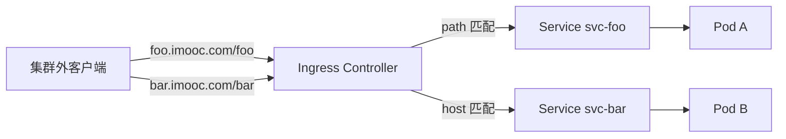

## 纲要

- 集群已经具备 Service、DNS、NodePort，但还缺一个域名访问的能力，这就是 Ingress
- Ingress 是管理外部访问集群内服务的 API 对象，提供负载均衡、SSL 与基于名字的虚拟主机
- 外部网络到集群内部有一道屏障，Ingress 是在这道屏障上打通的接口
- 只定义 Ingress 资源没用，必须有真实运行的 Ingress Controller 把它变成转发规则
- Ingress 支持三种典型用法：单服务、基于路径的扇出、基于名字的虚拟主机，外加 TLS
- ingress-nginx 是 Kubernetes 官方项目下的子项目，用 ConfigMap 存 Nginx 配置
- 官方给出一份 mandatory 清单，下载之后逐段解读，能看清 namespace、后端、配置、权限、控制器各是什么
- 裸机环境需要另外补一个 NodePort Service 把入口暴露到节点端口

## 集群还差一个域名入口

上一节把服务发现的三类场景过了一遍，集群自带的能力已经能覆盖集群内互访、访问集群外、以及靠 NodePort 从外部进来。但真正上线业务时，最常见的入口形态还是浏览器敲一个域名。

NodePort 能用，问题在于每个节点都占一个端口，服务一多端口就紧张，客户端还得知道该访问哪个节点。LoadBalancer 依赖云厂商，裸机房里没有。所以还缺一个正经的七层入口，这就是 Ingress 要解决的问题。

这个能力跟前面搭建的集群是分开的——集群本身并不自带，需要额外部署一个 Controller 进去。好在需求几乎是每家公司都有的，所以社区里有成熟实现，这一节就选业内用得最多的 **ingress-nginx**，把它部署到集群里。

## Ingress 到底是什么

翻官方文档，对 Ingress 的定义是：一个管理外部访问集群内部服务的 API 对象，典型场景包括负载均衡、SSL 终结，以及基于名字的虚拟主机。

理解这句话要抓住三点：

| 关键词 | 含义 |
| --- | --- |
| 外部访问 | 流量来源是集群外的客户端，不是集群内 Pod 互访 |
| 集群内服务 | 后端是 Service，最终落到 Pod |
| 负载均衡 / SSL / 虚拟主机 | 它工作在七层，能做域名分发和 HTTPS |

再看官方画的那个典型场景：Service 和 Pod 都有自己的可路由 IP，但那 IP 只在集群内部可访问。集群外部想进来，中间有一道屏障，类似边界路由，它要么把流量 drop 掉，要么转发出去，总之默认不会进到集群内部。

Ingress 就是在外部网络和集群内部服务之间打通的一个接口，有了它外部才能访问进来，并且顺带拿到负载均衡和 SSL 这些能力。

这里有个很容易踩的点：官方特别强调，**只定义一个 Ingress 资源是没有用的**。它只是一个数据对象，需要一个真实运行的 Controller 去把它管理起来、真正生效。这个 Controller 跟集群里原有的 controller-manager 不是一类东西，controller-manager 是控制面的，Ingress Controller 是跑在数据面、负责转发的。

所以部署 Ingress 分成两件事：装 Controller，然后按需写 Ingress 规则。

## Ingress 支持哪几种写法

官方文档把 Ingress 的用法列了几类，实际生产里前三种最常见：

**单服务的 Ingress**。配置里只有一个名字、一个后端 Service 名和端口，没有任何访问规则。创建之后 Controller 会给它分配一个地址，外部流量能从这个地址访问到这个 Service。实际这么用的情况很少，因为没体现七层分发的价值。

**基于路径的扇出**。一个 host 域名下面挂多个 path，不同的 path 转发到不同的 Service。比如请求 `/foo` 走服务 A，请求 `/bar` 走服务 B。用 `kubectl describe ingress` 能清楚地看到每个 host 下哪个 path 指向哪个后端。

**基于名字的虚拟主机**。两个不同域名共用同一个 ingress IP，各自访问各自的后端。区别在前一个写法里 host 是一个字符串，这个写法里 host 变成了一个列表，一份配置里可以同时配多个 host 对应不同后端。

**TLS**。创建 Ingress 时可以指定一个证书和私钥，对 HTTPS 服务很常用。做法是先定义一个 Secret，里面放两个 base64 后的数据项——`tls.crt` 和 `tls.key`，然后在 Ingress 里指定 `tls` 字段并把 Secret 名字填进去，Controller 会自动提供 HTTPS。



最后官方还提了负载均衡，Controller 自带一些负载均衡算法和基于权重的方案，但支持得不算多，像哈希类动态权重就不支持。更新一个 Ingress 也很直接：改一下 yaml 再 `apply` 就行，Controller 监听事件会自动把配置同步进 Nginx。

## 选 ingress-nginx 的理由

进 ingress-nginx 的 GitHub 首页能看到它的定位：它是 Kubernetes 项目下面的一个子项目，由 Kubernetes 官方在维护，所以不是第三方野路子实现。

它的实现方式是：Controller 基于 Ingress 资源来工作，并且**用 ConfigMap 存储 Nginx 的配置文件**。这一点很关键——看上去是发了一条 Ingress 声明，实际上 Controller 把规则翻译成 Nginx 配置写进 ConfigMap，再热加载到 Nginx 进程里，所以改规则不需要重启 Pod。

官方文档里那句"配置一个外部服务或者负载均衡器是比较麻烦的，而大部分 Web Server 的配置非常相似"，正是 Ingress Controller 这一类项目的立身理由：把重复的那部分抽象掉，剩下的用统一模型描述。Controller 通常以 DaemonSet 或 Deployment 的形式跑成 Pod，监听 API Server 上 Ingress 的地址变化，实时更新规则。

社区里实现很多，官方列了一长串：GCE 和 ingress-nginx 是当前受支持的两个，其余多是第三方自行开发维护。生产环境选稳定、维护活跃、文档全的，ingress-nginx 几乎是默认答案。

```text
ingress-nginx 项目结构
├── 控制器本体
│   ├── 监听 Ingress / IngressClass 变化
│   ├── 生成 nginx 配置模板
│   └── 写入 ConfigMap 并 reload nginx
├── 配置存储
│   ├── nginx-configuration（主配置）
│   ├── tcp（四层 TCP 端口映射）
│   └── udp（四层 UDP 端口映射）
├── 默认后端
│   └── default-http-backend（找不到 endpoints 时的兜底页）
└── 部署形态
    ├── Deployment + Service（默认）
    └── 裸机/物理机上额外挂 NodePort Service
```

## 下载官方的 mandatory 清单

官方给出的安装入口里有两条：一是必执行的命令，下载一份配置文件然后 apply；二是可选参数，默认会监听所有命名空间的 Ingress，可以用 `--watch-namespace` 改，一般还是全监听。

文档里还有一条警告值得记一下：**如果多个 Ingress 在同一个 host 上定义了不同的路径，Controller 会把它们合并在一起**。所以实际使用时要注意，同一个域名下的规则最好定义在同一份 Ingress 里，别拆成多处互相覆盖。

另外平台相关的差异，mac 上的 minikube、AWS 上的 EKS 有各自的写法，裸机 Metal 上没有云厂商的负载均衡，需要自己再定义一个 Service 把入口暴露成 NodePort。

先把必装的这份文件搞下来。集群是三台机器，主节点 50、worker 120 和 121，在主节点上操作：

```bash
mkdir ingress-nginx && cd ingress-nginx
curl -O https://raw.githubusercontent.com/kubernetes/ingress-nginx/controller-v1.9.5/deploy/static/provider/baremetal/deploy.yaml
ls -lh deploy.yaml
```

正式 apply 之前，先看这份文件到底定义了什么，不能两眼一抹黑就 apply 下去。

## mandatory 清单逐段解读

打开这份文件，从上往下扫一遍，结构是这样的：

**第一段：命名空间。** 新建一个叫 `ingress-nginx` 的 namespace，后面所有资源都落在这个命名空间里。

**第二段：默认后端。** 一个叫 `default-http-backend` 的 Deployment，只在找不到对应 endpoint 的时候返回一个默认页面，逻辑非常简单。紧跟着是它配套的 Service，Service 端口 80，targetPort 8080，对应上面那个 Deployment 的容器端口。这个兜底后端的作用是在路由规则还没有匹配到时，给用户一个明确的 404 页面，而不是连接被拒。

**第三段：几个 ConfigMap。** 一个叫 `ingress-nginx-controller` 的存储主 Nginx 配置；另外还有 `tcp` 和 `udp` 两个，用来存四层代理的端口映射，两者是并列关系。

**第四段：权限体系。** 给 Controller 定义一个 ServiceAccount，再定义 ClusterRole、ClusterRoleBinding、Role、RoleBinding。ClusterRole 里列的是它需要读的资源——ConfigMap、Endpoints、Node、Pod、Secret、Service 这些，允许列表查看，还包括 Service 相关的各种资源。Namespace 级别还有一个 Role，里面给了 update、get 这类写权限，因为 Controller 要回写 ConfigMap。这一段平时可以跳着看，但生产上如果 Controller 报权限错误，就要回来对着这段补 RBAC。

**第五段：核心控制器。** 最下面那个 Deployment 才是真正干活的 ingress controller 本体。

```text
deploy.yaml 的资源落点
├── Namespace: ingress-nginx
├── ServiceAccount: ingress-nginx-controller
├── ConfigMap
│   ├── ingress-nginx-controller（nginx 主配置）
│   ├── tcp（四层 TCP 映射）
│   └── udp（四层 UDP 映射）
├── 权限
│   ├── ClusterRole / ClusterRoleBinding（读集群级资源）
│   └── Role / RoleBinding（namespace 内写 ConfigMap）
├── 默认后端
│   ├── Deployment/default-http-backend（容器 8080）
│   └── Service/default-http-backend（port 80，targetPort 8080）
└── 控制器本体
    └── Deployment/ingress-nginx-controller
```

核心 Controller 的 Deployment 片段大致长这样，镜像来自官方镜像仓库，容器暴露 80 和 443，并带上监听命名空间相关的参数：

```yaml
apiVersion: apps/v1
kind: Deployment
metadata:
  name: ingress-nginx-controller
  namespace: ingress-nginx
  labels:
    app.kubernetes.io/name: ingress-nginx
spec:
  replicas: 1
  selector:
    matchLabels:
      app.kubernetes.io/name: ingress-nginx
  template:
    metadata:
      labels:
        app.kubernetes.io/name: ingress-nginx
    spec:
      serviceAccountName: ingress-nginx-controller
      containers:
        - name: controller
          image: registry.k8s.io/ingress-nginx/controller:v1.9.5
          args:
            - /nginx-ingress-controller
            - --publish-service=$(POD_NAMESPACE)/ingress-nginx-controller
            - --election-id=ingress-nginx-leader
            - --watch-namespace=$(POD_NAMESPACE)
            - --configmap=$(POD_NAMESPACE)/ingress-nginx-controller
            - --default-backend-service=$(POD_NAMESPACE)/default-http-backend
          ports:
            - containerPort: 80
            - containerPort: 443
          env:
            - name: POD_NAMESPACE
              valueFrom:
                fieldRef:
                  fieldPath: metadata.namespace
          volumeMounts:
            - name: nginx-config
              mountPath: /etc/nginx/
      volumes:
        - name: nginx-config
          configMap:
            name: ingress-nginx-controller
```

裸机环境下还要在这个清单之后补一个 Service，把 Controller 的 80/443 以 NodePort 的方式暴露到节点上，否则集群外依然进不来：

```yaml
apiVersion: v1
kind: Service
metadata:
  name: ingress-nginx-controller
  namespace: ingress-nginx
spec:
  type: NodePort
  externalTrafficPolicy: Local
  selector:
    app.kubernetes.io/name: ingress-nginx
  ports:
    - name: http
      port: 80
      targetPort: 80
      nodePort: 30080
    - name: https
      port: 443
      targetPort: 443
      nodePort: 30443
```

`externalTrafficPolicy: Local` 让请求只在真正持有 Pod 的节点上转发，能保住真实来源 IP，代价是别的节点上没有这个端口就进不来，所以一般会在前面再挂一层四层负载均衡来做节点探活。

## API 速览

| 能力 | 集群里该用什么 | 做法要点 |
| --- | --- | --- |
| 给集群加域名入口 | Ingress Controller | Deployment 形式跑，监听 Ingress 变化 |
| 默认选型 | ingress-nginx | Kubernetes 官方子项目，维护活跃 |
| 存 Nginx 配置 | ConfigMap | 主配置加 tcp、udp 两个四层映射 |
| 路由不到后端时的兜底 | default-http-backend | Deployment 加 Service，容器 8080 |
| 取 Controller 权限 | ServiceAccount + Cluster/Role 绑定 | ClusterRole 读集群资源，Role 写 ConfigMap |
| 路径分发 | Ingress 的 http.paths | 每个 path 指向一个后端 Service |
| 多域名共用入口 | Ingress 的 host 列表 | 同 host 的多条规则要写在同一份 Ingress 内 |
| HTTPS | Secret + Ingress 的 tls 段 | Secret 里放 base64 后的 tls.crt 与 tls.key |
| 裸机暴露入口 | NodePort Service | 挂 80/443，外层再配四层负载均衡 |

## Demo 示例

### 1. 下载、检查、应用

```bash
# 建目录并下载官方裸机版清单
mkdir -p ingress-nginx && cd ingress-nginx
curl -O https://raw.githubusercontent.com/kubernetes/ingress-nginx/controller-v1.9.5/deploy/static/provider/baremetal/deploy.yaml

# 先看它到底定义了哪些资源，心里有数再 apply
grep -nE "^kind:|^  name:" deploy.yaml | head -60

# 应用
kubectl apply -f deploy.yaml

# 确认命名空间与 Pod 起来
kubectl get ns | grep ingress-nginx
kubectl get pod -n ingress-nginx -o wide
```

### 2. 补一个裸机用的 NodePort 入口

```bash
kubectl create -f nodeport.yaml
kubectl get svc -n ingress-nginx
# 期望看到 TYPE=NodePort，NODE 端口是 30080 / 30443
```

### 3. 先验收默认后端与配置挂载

```bash
# 默认后端 Pod 应该已经 Running
kubectl get pod -n ingress-nginx -l app=default-http-backend

# 控制器暴露的端口
kubectl get svc -n ingress-nginx ingress-nginx-controller

# 配置 ConfigMap 有没有被创建出来
kubectl get cm -n ingress-nginx

# 看控制器日志，确认已拿到 Ingress 的监听权限
kubectl logs -n ingress-nginx -l app.kubernetes.io/name=ingress-nginx -f
```

### 4. 一条最小可跑的 Ingress

默认后端和 Controller 都就绪之后，写一条最简单的规则：所有域名访问 `/` 都转发到 `test` 服务的 80 端口，这是官方 demo 里的形态。

```yaml
apiVersion: networking.k8s.io/v1
kind: Ingress
metadata:
  name: test-ingress
  namespace: default
spec:
  ingressClassName: nginx
  defaultBackend:
    service:
      name: test
      port:
        number: 80
  rules:
    - http:
        paths:
          - path: /
            pathType: Prefix
            backend:
              service:
                name: test
                port:
                  number: 80
```

```bash
kubectl apply -f test-ingress.yaml
kubectl get ingress test-ingress
kubectl describe ingress test-ingress
```

`describe` 出来的结果最直观：能清楚看到 rules 里哪个 host 下哪个 path 指向哪个 backend。如果 `ADDRESS` 列一直是空，先回头看 Controller 的 Pod 是不是 Running、NodePort Service 有没有建成功。

### 5. 带 TLS 的一条规则

```yaml
apiVersion: v1
kind: Secret
metadata:
  name: imooc-tls
  namespace: default
type: kubernetes.io/tls
data:
  tls.crt: <base64 后的证书内容>
  tls.key: <base64 后的私钥内容>
---
apiVersion: networking.k8s.io/v1
kind: Ingress
metadata:
  name: secure-ingress
  namespace: default
spec:
  ingressClassName: nginx
  tls:
    - hosts:
        - api.imooc.com
      secretName: imooc-tls
  rules:
    - host: api.imooc.com
      http:
        paths:
          - path: /
            pathType: Prefix
            backend:
              service:
                name: api-service
                port:
                  number: 8080
```

### 总结

集群自带的服务发现能力覆盖了内部互访和外部端口入口，但域名访问需要单独装 Ingress Controller，这是生产上绕不开的一步。

Ingress 只是声明"外部域名怎么进到内部 Service"的数据对象，真正生效靠的是跑在集群里的 Ingress Controller，两者缺一不可。

ingress-nginx 是 Kubernetes 官方子项目，用 ConfigMap 存 Nginx 配置，规则变更热加载而不是重启 Pod，生产选型时优先用它。

官方的 mandatory 清单里依次是 namespace、默认后端 Deployment 与 Service、主配置加 tcp/udp 的 ConfigMap、ServiceAccount 与 ClusterRole/Role 的权限体系，最后是 Controller 本体 Deployment。

裸机环境在这个清单之外还要自己加一个 NodePort Service 暴露 80 和 443，并配合四层负载均衡做节点探活。

同一 host 下如果存在多条定义不同路径的 Ingress，Controller 会把它们合并，所以同域名的规则尽量写在同一份 Ingress 里，避免互相覆盖。

