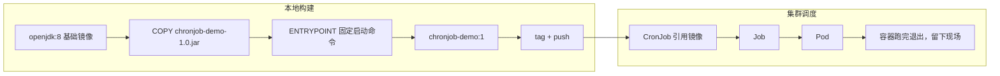

## 纲要

- 业务迁移阶段挑四种常见场景，每种写一个最小化 demo，重点看项目结构而不是业务逻辑
- 把任何服务跑进集群分两大步：先做出镜像，再写 Kubernetes 配置把它调度起来
- 做镜像再分三步：确定基础镜像、找出服务运行所需文件、用 Dockerfile 构建
- 定时任务没有网络也没有接口，不需要服务发现，可以直接跳过这一层分析
- Java 程序的基础镜像选 openjdk，官方 java 镜像已废弃，八版本体积不到六十兆
- 本地先用 maven 打包成 jar 并跑通，再复制到镜像里，是根据镜像的通行做法
- CronJob 用 cron 表达式排期，成功任务会留下 Pod 现场，可配置保留份数
- suspend 用来挂起任务不真正调度，concurrencyPolicy 控制并发与排队，restartPolicy 必须手写

## 进入业务迁移阶段

从这一节开始进入真正把业务搬进集群的部分。每家公司都有自己的业务形态和技术栈，没法把所有场景都铺开讲，所以挑四种最常见的类型，每种配一个最小化的 demo：

| 场景 | 说明 | 迁移关注点 |
| --- | --- | --- |
| 定时任务 | 用 CronJob 定期调度执行 | 无入口、无接口，关注排期与退出码 |
| SpringBoot Web | 完全基于 SpringBoot 的 Web 服务 | 关注服务发现与滚动更新 |
| 传统 Dubbo 服务 | RPC 框架承载的内部服务 | 关注注册中心与版本兼容 |
| 传统外部 Web 服务 | 几乎每家公司都有的对外服务 | 关注七层入口与证书 |

这些 demo 本身没有具体业务逻辑，关注点应该放在**项目结构上**。结构相同的项目，在容器化和迁移到集群的过程中，流程是一致的，所以拿自己的真实项目跟着操作也完全可行。

这一节的任务是把最简单的定时任务从零跑到集群里。

## 先把思路理清楚

看一眼代码，只有一个类、一个主方法：产生一个随机数，打印一行 `I will work for xx 秒`，然后 sleep 对应的秒数，最后打印一行"所有工作完成"，程序退出。非常简单。

目标是让集群按固定频率把这个类调度起来跑一次，效果等价于在应用里配一个定时任务。

想清楚从哪入手：

**第一步，做出镜像。** 没有镜像根本没法调度到集群里。做镜像再拆成三小步：

1. 选一个基础镜像
2. 找出这个服务运行需要的所有文件
3. 写 Dockerfile 把文件加进基础镜像，构建出成品

**第二步，写集群配置并调度。** 这一步要先分析业务的通讯形态，确定服务发现策略，然后再写配置，最后 apply 把服务调度起来。

定时任务比较特殊：它不需要服务发现。没有网络调用、没有接口暴露，谁都不会去调它，所以这一层直接略过，剩下"编写 Kubernetes 配置"这一件事。

## 第一步之基础镜像

看看这个服务跑在什么环境上：一个 Java 程序，那么一个 Java 基础镜像就够了，不需要别的依赖。

去 Docker Hub 搜 java，排第一的是官方的 java 镜像，但它已经标记废弃，官方推荐改用 openjdk 镜像。点进去确认可用，找一个已经更新到新版本的 tag。

今天用 **java 8**，覆盖面最广，体积也不大，不到六十兆。

```bash
# 在 master 节点上拉取
docker pull openjdk:8

# 看一下大小
docker images | grep openjdk
```

镜像拉下来之后，第一件事是打 tag 推到自己的私有仓库，后面反复使用速度就快了：

```bash
docker tag openjdk:8 hub.imooc.com/library/openjdk:8
docker push hub.imooc.com/library/openjdk:8
```

顺带一提，如果 push 的时候发现仓库起不来，先去仓库所在节点把服务拉起：

```bash
cd /opt/harbor
docker-compose up -d
docker ps | grep harbor
```

基础镜像这一步就算做完了。

## 第一步之运行相关文件

回到第二步：服务运行到底需要哪些文件？这个服务只有一个类，那类的产物就是全部。

用 maven 打包，target 目录下会出一个 `chronjob-demo-1.0.jar`，这一个 jar 就是它所有的相关文件。

```bash
# 克隆项目到 master 节点
git clone https://gitee.com/imooc/imooc-k8s-demo.git
cd imooc-k8s-demo/chronjob-demo

# 打包
mvn clean package

# 产物
ls -lh target/*.jar
```

打包完先别急着做镜像，先在机器上把程序跑通，确认它在主机上能正常运行、能正常退出、行为确实符合定时任务的要求：

```bash
# 把 jar 加进 classpath，主类的 package 名写全
java -cp target/chronjob-demo-1.0.jar com.imooc.k8s.ChronJobDemo
```

跑起来输出 `I will work for 11 秒`，睡完退出，再正常停掉，这一步就算确认完毕。

```text
chronjob-demo 项目结构
├── pom.xml（maven 配置，打包成 jar）
├── src
│   └── main
│       └── java
│           └── com
│               └── imooc
│                   └── k8s
│                       └── ChronJobDemo.java（唯一的主类）
└── target
    └── chronjob-demo-1.0.jar（构建产物，也是镜像里要放的文件）
```

## 第一步之构建镜像

在刚才那个位置写一个 Dockerfile。第一行 FROM 指向前面准备好的基础镜像，然后是两个关键动作：把 jar 拷进容器、声明启动命令。

```dockerfile
FROM openjdk:8

COPY chronjob-demo-1.0.jar /root/chronjobdemo.jar

ENTRYPOINT ["java", "-cp", "/root/chronjobdemo.jar", "com.imooc.k8s.ChronJobDemo"]
```

ENTRYPOINT 写成数组形式，第一个参数是可执行文件，后面的依次是参数，最后一个是主类名。写成 exec 数组还有个好处：Java 进程就是容器的 1 号进程，`docker stop` 能直接收到信号，不用额外处理。

构建并验证：

```bash
docker build -t chronjob-demo:1 .
docker run -it chronjob-demo:1
```

容器正常跑起来，sleep 到指定秒数之后自行退出，正是想要的结果——因为启动参数已经在 ENTRYPOINT 里写死了，后面不需要再传什么。

确认没问题就打 tag 推到仓库：

```bash
docker tag chronjob-demo:1 hub.imooc.com/library/chronjob:v1
docker push hub.imooc.com/library/chronjob:v1
```

镜像完全就绪，第一步结束。



## 第二步之编写 CronJob 配置

现在轮到 Kubernetes 这一侧。定时任务对应的是 `batch/v1` 下的 **CronJob** 类型，一个 CronJob 会先生成 Job，Job 再生成 Pod 去真正执行。

```yaml
apiVersion: batch/v1
kind: CronJob
metadata:
  name: chronjob-demo
  namespace: default
spec:
  schedule: "*/1 * * * *"
  successfulJobsHistoryLimit: 3
  failedJobsHistoryLimit: 1
  concurrencyPolicy: Forbid
  suspend: false
  startingDeadlineSeconds: 20
  jobTemplate:
    spec:
      template:
        spec:
          restartPolicy: OnFailure
          containers:
            - name: chronjob
              image: hub.imooc.com/library/chronjob:v1
```

字段逐个拆开看：

**schedule**：后面这个字符串就是 cron 表达式，跟 Linux 里的 crontab 一模一样，五个段。这里 `*/1 * * * *` 表示每分钟运行一次。

**successfulJobsHistoryLimit**：成功任务的历史保留限制，这里设 3。任务跑完会有一个退出值，0 表示成功退出，非零表示失败，跟 Linux 上普通程序的规则一样。这个限制说的是**保留程序运行现场的数量**——也就是 Pod。每调度起一个 Pod，就算程序跑完了也不会立刻删掉，而是留下来，最多保留最近的三个。排查问题时这些留着的 Pod 就是现场，可以看日志、可以 exec。

**failedJobsHistoryLimit**：失败的同样留一份现场，设 1 就够，用来看失败原因。

**suspend**：是否挂起。设为 true，这个 CronJob 只会被保存下来、不会被真正调度，等改回 false 才按 schedule 跑。这其实是暂停定时任务的正规做法——不用删配置，改一个字段就行。

**concurrencyPolicy**：并发策略。定时任务跟普通程序不一样，它既会运行也会停，一次运行多久不一定。假如每分钟调度一次，结果有个任务跑了三分钟，那这会儿新来的任务是让它一起跑、还是把前一个顶掉、还是排队不许同时跑？这个策略就是管这件事的。取值有：允许并发、禁止并发（不允许同时跑，前一个没完就跳过）、前者未跑完直接替换（顶掉）。

**startingDeadlineSeconds**：调度的时间窗口容错。万一前一次执行卡住、Job 控制器错过了调度时间点，超过这个秒数再想起来就跳过这次，避免积压一堆任务一起补跑。

**jobTemplate**：里面是 Job 的模板，写法跟定义 Deployment 很像。这里有个必须注意的点——**restartPolicy 是必填项，它没有默认值**。它控制的是程序跑失败时要不要重启，取值只有 `Never`（不重启）和 `OnFailure`（失败才重启）两种，对一次性任务来说通常选 `OnFailure`。

```text
CronJob 调度链路与保留的现场
└── CronJob/chronjob-demo（schedule: */1 * * * *）
    └── Job/chronjob-demo-28419370（每次触发生成一次）
        └── Pod/chronjob-demo-28419370-xxxxx
            └── Container（java 主类执行完退出，退出码 0）
                ├── 成功 → 留在 successfulJobsHistoryLimit 指定的 3 份里
                └── 失败 → 留在 failedJobsHistoryLimit 指定的 1 份里
```

## 跑起来看效果

```bash
kubectl apply -f cronjob.yaml
kubectl get cronjob
```

刚创建时看到的状态是这样的：SCHEDULE 列显示了表达式，SUSPEND 列是 false，ACTIVE 列是 0，LAST SCHEDULE 列是空——因为才刚建，还没到点。

```text
NAME            SCHEDULE      SUSPEND   ACTIVE   LAST SCHEDULE
chronjob-demo   */1 * * * *   False     0        <none>
```

等过一分钟再来看，LAST SCHEDULE 就有值了，ACTIVE 变成 1：

```bash
kubectl get cronjob
kubectl get job --show-all
kubectl get pod
```

这时查 Pod 能看到一个已经在 Running 又已经 Complete 的任务；Job 那边出现一条记录。回到节点上看更直观——因为任务已经跑完退出了，`docker ps` 里看不到，得带 `-a`：

```bash
docker ps -a | grep chronjob
```

容器已经退出，状态 Exited，运行了十七秒，符合预期。看日志确认：

```bash
kubectl logs chronjob-demo-xxxxx
# 或指定某次 Job 下的 Pod
kubectl logs -l job-name=chronjob-demo-28419370
```

日志里出现那行 "所有的工作都完成了"，这个定时任务就算在集群上正常调度起来了。

再想验证它真跑在哪个节点上，`kubectl get pod -o wide` 的 NODE 列会直接告诉你。

## API 速览

| 能力 | 集群里该用什么 | 做法要点 |
| --- | --- | --- |
| 把 Java 程序搬进容器 | openjdk 基础镜像 + jar | ENTRYPOINT 用数组形式固定启动命令 |
| 本地可跑再做镜像 | `java -cp` 先验证 | 先把 jar 跑通再 COPY，减少返工 |
| 按分钟排期跑任务 | CronJob（batch/v1） | schedule 是五段 cron 表达式 |
| 留下排查现场 | successful/failedJobsHistoryLimit | 成功失败都留 Pod，别让控制器秒删 |
| 临时停掉定时任务 | suspend: true | 比删配置安全，改回来就恢复 |
| 控制同时只跑一个 | concurrencyPolicy: Forbid | 前一个没结束新任务就跳过 |
| 防止积压补跑 | startingDeadlineSeconds | 超过窗口的调度点直接跳过 |
| 失败自动重试 | restartPolicy: OnFailure | 必填无默认，只取 Never / OnFailure |
| 镜像取用加速 | 私有仓库 | 打 tag 后 push，节点上不用现拉官方镜像 |

## Demo 示例

### 1. 从零到镜像的完整脚本

```bash
# 1) 拉基础镜像并推到私有仓库
docker pull openjdk:8
docker tag openjdk:8 hub.imooc.com/library/openjdk:8
docker push hub.imooc.com/library/openjdk:8

# 2) 克隆项目并打包
git clone https://gitee.com/imooc/imooc-k8s-demo.git
cd imooc-k8s-demo/chronjob-demo
mvn clean package
java -cp target/chronjob-demo-1.0.jar com.imooc.k8s.ChronJobDemo

# 3) 写 Dockerfile 并构建
cat > Dockerfile <<'EOF'
FROM openjdk:8
COPY chronjob-demo-1.0.jar /root/chronjobdemo.jar
ENTRYPOINT ["java", "-cp", "/root/chronjobdemo.jar", "com.imooc.k8s.ChronJobDemo"]
EOF
docker build -t chronjob-demo:1 .

# 4) 验证并推送
docker run -it chronjob-demo:1
docker tag chronjob-demo:1 hub.imooc.com/library/chronjob:v1
docker push hub.imooc.com/library/chronjob:v1
```

### 2. 一份可直接用的 CronJob

```yaml
apiVersion: batch/v1
kind: CronJob
metadata:
  name: chronjob-demo
  namespace: default
spec:
  schedule: "*/1 * * * *"
  successfulJobsHistoryLimit: 3
  failedJobsHistoryLimit: 1
  concurrencyPolicy: Forbid
  suspend: false
  startingDeadlineSeconds: 20
  jobTemplate:
    spec:
      template:
        spec:
          restartPolicy: OnFailure
          containers:
            - name: chronjob
              image: hub.imooc.com/library/chronjob:v1
              resources:
                requests:
                  cpu: 100m
                  memory: 256Mi
                limits:
                  cpu: 500m
                  memory: 512Mi
```

### 3. 排期怎么改

```bash
# 先改成挂起，任务不会被调度，但配置还在
kubectl patch cronjob chronjob-demo -p '{"spec":{"suspend":true}}'

# 恢复调度
kubectl patch cronjob chronjob-demo -p '{"spec":{"suspend":false}}'

# 改成每五分钟跑一次
kubectl patch cronjob chronjob-demo -p '{"spec":{"schedule":"*/5 * * * *"}}'
```

### 4. 观察与排障

```bash
# 看排期、是否挂起、上一次调度时间
kubectl get cronjob chronjob-demo

# 看它派生出来的 Job
kubectl get jobs

# 看具体 Pod 与落在哪个节点
kubectl get pod --show-all -o wide

# 直接描述，能看到调度历史与并发策略是否生效
kubectl describe cronjob chronjob-demo

# 看某次执行的输出
kubectl logs -f chronjob-demo-28419370-xxxxx

# 保留下来的现场怎么清理（改小保留份数即可）
kubectl patch cronjob chronjob-demo -p '{"spec":{"successfulJobsHistoryLimit":1}}'

# 手动触发一次，不用等下一个周期
kubectl create job chronjob-manual --from=cronjob/chronjob-demo

# 收尾：删掉这个定时调度
kubectl delete cronjob chronjob-demo
```

`kubectl create job --from=cronjob/<name>` 是非常顺手的一个命令，线上想立刻验证一次任务逻辑时不用傻等下一个调度周期。

### 总结

任何服务进集群都逃不开两条主线：先把业务做成镜像，再写 Kubernetes 配置把它调度起来，定时任务也不例外。

做镜像依次是选基础镜像、找出运行所需文件、用 Dockerfile 构建；Java 程序选 openjdk 八版本即可，官方 java 镜像已废弃。

出品镜像之前先把 jar 在本地跑通，确认退出行为正常，能避免把问题留到集群里再查。

定时任务没有对外接口和调用方，可以不做服务发现分析，直接进到编写 CronJob 配置这一步。

CronJob 的 schedule 是五段 cron 表达式；成功与失败都会留下 Pod 现场，用 historyLimit 控制保留份数，这是线上看日志、查失败原因的主要抓手。

suspend 用来挂起调度、concurrencyPolicy 决定并发还是排队或替换，这两个字段是生产上控制定时任务行为的常用开关。

restartPolicy 是 Job 模板里的必填项且没有默认值，一次性任务一般取 OnFailure，不填会直接创建失败。

